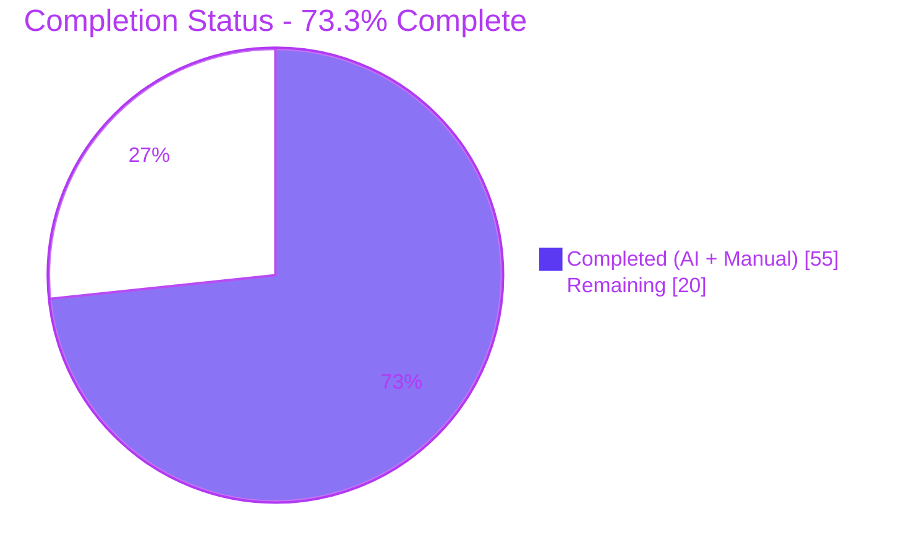
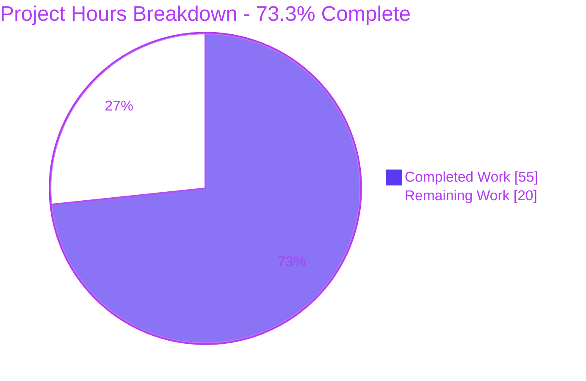
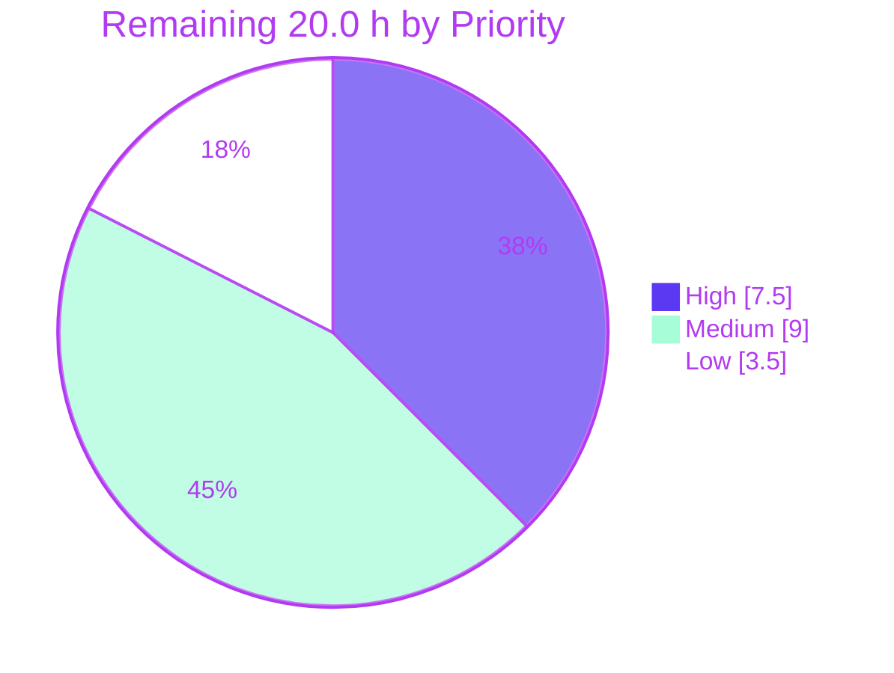

# Blitzy Project Guide — `hao-backprop-test` / `hello_world@1.0.0`

**Branch:** `blitzy-cab12316-b8eb-4a8a-9845-0f8c0a8e041f` · **HEAD:** `a82ba54` · **Baseline:** `1a0874d` · **Working tree:** clean

---

## 1. Executive Summary

### 1.1 Project Overview

This project introduces the Express.js web framework as the HTTP layer of a four-file Node.js tutorial repository and adds a second endpoint, `GET /good-evening`, returning the exact twelve bytes `Good evening`. The original greeting endpoint is preserved byte-for-byte — status 200, `text/plain`, and the fourteen bytes `Hello, World!\n`. The repository is a shared test fixture consumed by backprop integration tooling, so backward compatibility, byte-exactness and loopback confinement are the dominant technical constraints. Scope is deliberately narrow: one production dependency (`express@5.2.1`), two addressable routes, a constant plain-text not-found response, a dependency-free smoke suite, and npm-only dependency management per user rule `QA-13-july-rules-01`.

### 1.2 Completion Status



<sub>Legend — **Completed = Dark Blue `#5B39F3`** · **Remaining = White `#FFFFFF`** · accents Violet-Black `#B23AF2`</sub>

| Metric | Value |
|---|---|
| **Total Hours** | **75.0** |
| **Completed Hours (AI + Manual)** | **55.0** |
| **Remaining Hours** | **20.0** |
| **Percent Complete** | **73.3%** |

**Calculation (PA1, AAP-scoped hours only):**

```
Completion % = Completed Hours / (Completed Hours + Remaining Hours) x 100
             = 55.0 / (55.0 + 20.0) x 100
             = 55.0 / 75.0 x 100
             = 73.3%
```

**Scope of the denominator.** 49 discrete AAP-specified requirements (2 FR, 12 IR, 9 AMB resolutions, 1 user rule, 7 file deliverables, 17 validation gates, 3 behavioural-contract groups) plus 11 standard path-to-production activities required to deploy those deliverables. Nothing outside that universe is counted.

**Classification result:** 47 of 49 AAP items **Completed**; 2 **Partially Completed** (`server.js` at 75% pending human ratification of its one documented deviation; the four §0.5.2.10 specification amendments at 33% — raised by the agent but not yet applied upstream); **0 Not Started**. All 11 path-to-production items are Not Started because every one requires a human decision or a human sign-off.

**Zero rework hours.** No compilation error, no failing test and no runtime defect exists at `HEAD a82ba54`, so none of the 20.0 remaining hours is defect repair.

### 1.3 Key Accomplishments

- [x] **Express 5.2.1 adopted as the HTTP layer** — `require('http')` removed from authored code; request dispatch now performed by Express's router (`router@2.2.0`) instead of a single unconditional handler.
- [x] **`GET /good-evening` delivered** — measured 200 / 12 bytes / hex `476f6f64206576656e696e67`, with no trailing newline exactly as specified.
- [x] **Legacy greeting frozen byte-exactly** — 200 / 14 bytes / hex `48656c6c6f2c20576f726c64210a`; `od -c` confirms `H e l l o ,   W o r l d ! \n`.
- [x] **41-byte readiness line preserved** — stdout is byte-equal to `Server running at http://127.0.0.1:3000/\n`, interpolated from the same two constants passed to `listen`.
- [x] **Constant plain-text 404 replaces the framework default** — 10 bytes `Not Found\n`; `finalhandler`'s HTML document, which echoes the request method and path, is fully suppressed.
- [x] **Application/server split with a side-effect-free module** — `require('./app')` yields a usable Express app with **0 active `Server` handles** and binds no socket, lifting constraint C-005.
- [x] **npm-only dependency management** — `package-lock.json` regenerated by npm (68 entries, 67 `integrity` hashes, `lockfileVersion 3`); no `yarn.lock` / `pnpm-lock.yaml` / `bun.lockb` anywhere.
- [x] **Clean supply chain** — `npm audit` reports 0 vulnerabilities at every severity; `dev: 0`; 67/67 packages have verified registry signatures; 0 pre/post-install scripts.
- [x] **Dependency-free verification suite** — 2 `node:test` cases on an ephemeral port; 2 pass / 0 fail; 97.62% line and 100% branch coverage across all files.
- [x] **All 15 AAP §0.7 validation gates green**, independently re-executed and re-measured during this assessment.
- [x] **Loopback confinement preserved** — connections to `10.10.1.18`, `172.28.160.1`, `172.20.224.1`, the hostname, `0.0.0.0`, `[::1]` and `127.0.0.2` on port 3000 are all refused.
- [x] **`X-Powered-By` suppressed** — 0 occurrences on every method and status path probed.
- [x] **Change-freeze mitigation honoured** — `README.md` lines 1-2 are byte-identical to baseline `1a0874d`; all new documentation is appended strictly below them.
- [x] **Assumption A-004 protected** — the pre-existing `test` script still exits 1 with `Error: no test specified`; verification was added under the separate `test:smoke` name.
- [x] **Assumption A-002 restored and proven** — a second instance on the occupied port exits 1 with 0 stdout bytes and `EADDRINUSE`, emitting no false readiness line.
- [x] **Scope discipline** — `git diff 1a0874d..HEAD` touches exactly the 7 in-scope files; zero out-of-scope files modified across 15 commits.

### 1.4 Critical Unresolved Issues

| Issue | Impact | Owner | ETA |
|---|---|---|---|
| HTTP method narrowing accepted but not confirmed with consumers — `POST/PUT/PATCH/DELETE/OPTIONS` on any path now return `404` + 10 bytes, where the routerless server returned `200` + 14 bytes for every method | Any fixture consumer issuing a non-GET request will see a behavioural break. Documented and asserted positively by gate 7, but never validated against real consumers | Integration owner | 2.0 h — before merge |
| New conditional-response path not confirmed with consumers — a weak `ETag` is now emitted, so a matching `If-None-Match` yields `304` with an empty body where the legacy server always returned `200` + 14 bytes | Reverses a documented system property (§5.1.3.4). A caching client will now receive an empty 304 | Integration owner | 1.0 h — before merge |
| `server.js` deviates from the AAP's literal snippet — 1099 LF bytes / 23 lines versus the stated 184 bytes / 8 lines, because `if (error) throw error;` and a 12-line citation comment were retained | Needs a conscious accept-or-revert decision. The literal snippet is demonstrably defective: Express 5.2.1 wraps the trailing `listen` callback in `once()` and registers it as the socket error listener (`lib/application.js` L602-L603), so it prints a false readiness line and exits 0 on `EADDRINUSE` | Tech lead | 1.5 h — before merge |
| Repository change freeze overridden — `README.md` line 2 reads `test project for backprop integration. Do not touch!` (constraint C-001) | The repository owner has not acknowledged the commissioned modification. Mitigated by preserving lines 1-2 byte-identically and making every edit additive | Repository owner (hxu) | 1.0 h — before merge |
| Four upstream specification statements are now inaccurate — §2.1 F-002 (invariant response), §5.1.3.4 (no ETag), §5.1.3.1 (request data terminal), §5.1.1.2 (zero-dependency composition) | All four were raised by the agent as required, but the specification document itself still contradicts the shipped behaviour, risking a future false defect report | Specification owner | 2.0 h — before release |
| No CI pipeline — the 15 validation gates are reproducible only by manual command invocation | Regressions after merge would go undetected. CI was explicitly excluded from the agent change set by AAP §0.6.2.2 | DevOps | 3.0 h — before release |

### 1.5 Access Issues

| System/Resource | Type of Access | Issue Description | Resolution Status | Owner |
|---|---|---|---|---|
| `registry.npmjs.org` | Package registry (read) | None encountered. `npm ci` completed in 3.63 s resolving 67 packages; all 67 resolved from `registry.npmjs.org` over HTTPS with verified signatures | ✅ No issue | — |
| Git repository / branch | Write | None encountered. 15 commits authored and committed as `Blitzy Agent <agent@blitzy.com>`; working tree clean | ✅ No issue | — |
| `127.0.0.1:3000` (TCP) | Local bind | Transient only: a leftover `node server.js` process from an earlier session held the port and was stopped by its specific pid. Not a permissions issue — the single-instance cap is designed behaviour | ✅ Resolved | — |
| `web_search` tool | Research | Not present in the planning session's toolset. Substituted with primary-source research against the installed `express@5.2.1` distribution and empirical measurement, yielding six findings each carrying a verifiable `file:line` citation | ✅ Mitigated — no residual gap | — |
| Headless Chrome harness | Browser automation | Failed to initialise during AAP planning (`chrome-devtools-mcp` not found at that time). Available and successful during validation — 4 route scenarios verified, ~90 screenshots and 14 recordings captured | ✅ Resolved | — |
| Backprop-integration consumer systems | Read / coordination | **Not accessible to the agent.** The two accepted behavioural changes (method narrowing, ETag/304) cannot be validated against real consumers without human coordination | ⚠️ Open — human action required | Integration owner |

No blocking access issue prevented automated build, test or validation. The single open item is organisational, not technical.

### 1.6 Recommended Next Steps

1. **[High]** Review and approve the 7-file pull request (935 insertions / 12 deletions) and confirm the terminal `app.use` remains the **last** registration in `app.js` — moving it earlier makes every request return 404. *(2.0 h)*
2. **[High]** Confirm with backprop-integration fixture consumers that the method narrowing (`POST/PUT/PATCH/DELETE/OPTIONS` → `404`) and the new `ETag`/`304` conditional path are acceptable. Escape hatches if not: gate the terminal handler on `req.method !== 'OPTIONS'`, and `app.disable('etag')`. *(3.0 h)*
3. **[High]** Ratify or revert the documented `server.js` bind-failure deviation, and obtain repository-owner sign-off on overriding the `Do not touch!` change freeze. *(2.5 h)*
4. **[Medium]** Apply the four §0.5.2.10 amendments to the upstream technical specification and propose the new feature identifiers F-008 (Express HTTP layer adoption) and F-009 (Good evening endpoint). *(2.0 h)*
5. **[Medium]** Add a CI workflow reproducing the gates — `npm ci` → `npm audit` → `node --check` → `npm run test:smoke` on a Node 18/20/22 matrix — pinning an explicit test path (`node --test test/`) so stray `*.test.js` files cannot pollute the run. *(3.0 h)*

---

## 2. Project Hours Breakdown

### 2.1 Completed Work Detail

| Component | Hours | Description |
|---|---|---|
| Express framework adoption & primary-source research | 6.0 | `[AAP FR-1, AMB-9]` Version-line selection (`5.2.1` over the maintenance `4.22.2`); six research findings R1–R6 derived from the installed `express@5.2.1` distribution and `finalhandler@2.1.1` source, each with a verifiable `file:line` citation, substituting for unavailable web research |
| HTTP layer migration & app/server split | 4.0 | `[AAP FR-1, AMB-5, AMB-6, IR-6]` `app.js` created (19 lines); `require('http')` removed from authored code; side-effect-free module verified to open 0 `Server` handles; CommonJS retained throughout |
| `GET /good-evening` endpoint | 1.5 | `[AAP FR-2, AMB-1, AMB-3]` Kebab-case path, no aliases; body exactly 12 bytes with no trailing newline |
| Legacy greeting backward-compatibility contract | 3.5 | `[AAP IR-1, IR-2, IR-7, AMB-8]` 14 payload bytes, status and media type frozen; explicit `res.type('text/plain')` on every handler; `X-Powered-By` suppressed; header delta measured on both sides and documented |
| Terminal plain-text not-found handler | 2.0 | `[AAP AMB-4]` Constant 10-byte `Not Found\n` replacing `finalhandler`'s HTML document, which reflects the request method and path; registration order constraint honoured |
| Listener bootstrap, readiness signal & bind-failure contract | 4.5 | `[AAP IR-3, IR-4, IR-5, A-002]` Host/port literals and shared-constant coupling preserved; 41-byte readiness line byte-identical; root-caused Express's `once()`-wrapped listen callback and restored exit-1-on-`EADDRINUSE` with no false readiness line |
| Package manifest repair & npm rule compliance | 2.0 | `[AAP IR-8, IR-9, IR-10, A-004, rule QA-13-july-rules-01]` `main` → `app.js`; `start` and `test:smoke` added; `engines >=18` declared; the pre-existing `test` script left byte-identical |
| Lockfile regeneration & install reproducibility | 3.0 | `[AAP IR-11, gates 9/10/15]` `npm install`-generated 869-line lockfile; 68 entries with 67 `integrity` hashes; `npm ci` reproducibility and idempotence verified; competing-lockfile sweep clean |
| `node:test` smoke suite with zero devDependencies | 3.0 | `[AAP gate 8]` Two self-contained cases binding `app.listen(0)` on an ephemeral loopback port; asserts status, media-type prefix and exact body bytes; port-independent; proven to pass alongside a live service |
| VCS hygiene & documentation append | 1.5 | `[AAP IR-12, gates 15a/15b]` `.gitignore` for `node_modules/`; `README.md` `## Endpoints` section appended below two byte-identical preserved lines |
| Autonomous validation gate execution | 6.0 | `[AAP §0.7]` All 15 gates (plus 15a/15b) executed with exact byte counts, hex payload comparison, header-set enumeration, conditional requests, loopback-refusal probes across 7 addresses, library-surface checks and the bind-conflict contract |
| Browser runtime verification | 4.0 | `[AAP §0.5.2.8/.9]` Headless Chrome verification of all three routes plus the conditional revisit; wire bytes captured; 11 negative assertions confirming no HTML, no DOCTYPE, no `Cannot GET`, no reflected path; ~90 screenshots and 14 flow recordings |
| Supply-chain security review | 5.0 | `[AAP §0.2.3.3]` 92-check coverage matrix: `npm audit` and `npm audit signatures`, per-package advisory research for all 66 transitive packages across 6 independent sources with positive controls, registry-provenance histogram, install-script sweep, request-smuggling and hostile-path fuzzing |
| QA remediation cycles | 8.0 | Six measurement-driven restore/harden rounds across 15 commits: removed an unrequested request-target guard and an `app.listen` monkey-patch that violated scope; restored `app.js` and the smoke suite to their frozen contracts; resolved a Node test-glob collision inflating the pass count |
| Specification amendment identification | 1.0 | `[AAP §0.5.2.10]` Four inaccurate upstream statements identified and raised (§2.1 F-002, §5.1.3.4, §5.1.3.1, §5.1.1.2) with proposed feature identifiers F-008 and F-009 |
| **Total Completed** | **55.0** | Matches **Completed Hours** in Section 1.2 |

### 2.2 Remaining Work Detail

| Category | Hours | Priority |
|---|---|---|
| Code review & change-freeze governance — PR approval (2.0) + repository-owner sign-off on the C-001 override (1.0) | 3.0 | High |
| Behavioural-change confirmation with fixture consumers — method narrowing (2.0) + `ETag`/`304` conditional path (1.0) | 3.0 | High |
| `server.js` bind-failure deviation ratification — accept the measurement-backed rethrow or revert to the AAP's literal 8-line snippet | 1.5 | High |
| Upstream specification reconciliation — apply the four §0.5.2.10 amendments and register F-008 / F-009 | 2.0 | Medium |
| CI/CD pipeline introduction — `npm ci` → `npm audit` → `node --check` → `npm run test:smoke` on a Node 18/20/22 matrix with a pinned test path | 3.0 | Medium |
| Dependency lifecycle policy — update cadence, audit gate threshold and tooling decision for the new 1-direct / 67-transitive graph | 2.0 | Medium |
| Runtime provisioning & operational runbook — Node ≥18 on the target host, start/verify/stop procedure, single-instance port cap | 1.5 | Medium |
| Hosting & process-supervision decision — no `'error'` listener, no graceful SIGTERM shutdown, no restart policy (all intentional) | 2.0 | Low |
| Optional `OPTIONS` escape hatch — gate the terminal handler on `req.method !== 'OPTIONS'` to restore Express's automatic `Allow: GET, HEAD` reply | 1.0 | Low |
| README/package naming reconciliation — heading `hao-backprop-test` versus package name `hello_world` (pre-existing, deliberately left) | 0.5 | Low |
| Merge to `main`, delete the three working branches, tag the fixture revision | 0.5 | Medium |
| **Total Remaining** | **20.0** | — |

### 2.3 Reconciliation

| Check | Result |
|---|---|
| Section 2.1 total | 55.0 h |
| Section 2.2 total | 20.0 h |
| Section 2.1 + Section 2.2 | 75.0 h = **Total Hours** in Section 1.2 ✅ |
| Section 2.2 total vs Section 1.2 Remaining vs Section 7 pie "Remaining Work" | 20.0 = 20.0 = 20.0 ✅ |
| Completion percentage | 55.0 / 75.0 = **73.3%** — used identically in Sections 1.2, 7 and 8 ✅ |
| Human task list (Section 8) total | 7.5 High + 9.0 Medium + 3.5 Low = 20.0 h ✅ |

---

## 3. Test Results

All tests below originate from Blitzy's autonomous validation logs for this project. Every figure was re-executed and re-confirmed during this assessment at `HEAD a82ba54`.

| Test Category | Framework | Total Tests | Passed | Failed | Coverage % | Notes |
|---|---|---|---|---|---|---|
| Unit / endpoint smoke | `node:test` (Node 22 built-in) | 2 | 2 | 0 | **97.62** line / **100.00** branch / 88.89 funcs (all files); `app.js` 94.74 line | Measured live with `node --test --experimental-test-coverage`. Sole uncovered line is `app.js:16` (the 404 handler body), which gate 5 covers directly. `1..2`, `# pass 2`, `# fail 0`, `# skipped 0`, `# todo 0`, exit 0 |
| Static syntax validation | `node --check` | 3 | 3 | 0 | 100 (3 of 3 authored JS files) | `app.js`, `server.js`, `test/smoke.test.js` — exit 0 each (gate 1) |
| Manifest parse validation | `JSON.parse` (Node) | 2 | 2 | 0 | 100 (2 of 2 manifests) | `package.json` and `package-lock.json` both parse cleanly |
| AAP §0.7 validation gates | AAP gate harness (`curl.exe` + `node:http` + raw `net` sockets) | 17 | 17 | 0 | 100 (gates 1–15 plus 15a, 15b) | Every gate re-executed this session, including the deliberately-failing gate 13 (`npm test` → exit 1) whose expected outcome *is* a non-zero status |
| Runtime API / response contract | `curl` + `node:http` + raw sockets | 27 | 27 | 0 | 100 (§0.5.2.8 seven rows + §0.5.2.9 four dispositions) | Byte counts, hex payloads, header-set enumeration, `HEAD`, method narrowing, `304` conditional path, loopback refusal on 7 addresses, library surface, `EADDRINUSE` contract |
| Browser / UI verification | Headless Chrome via `chrome-devtools-mcp` | 4 | 4 | 0 | n/a — no UI in scope (AAP §0.5.3) | 3 routes plus the conditional revisit at 1280x800; wire bytes captured; zero console messages; 11 negative assertions (no `<>`, no DOCTYPE, no tags, no `Cannot GET`, requested path absent) |
| Security & supply-chain coverage matrix | `npm audit`, `npm audit signatures`, OSV.dev, NVD, deps.dev, Snyk, GHSA, raw-socket fuzzing | 92 | 92 | 0 | 100 (68 of 68 packages; 66 of 66 advisory-researched across 6 sources) | 3 items (SEC-FINAL-01 absolute-form HTML 404, SEC-FINAL-02 stderr payload echo, SEC-FINAL-03 bind conflict exiting 0) failed on the pre-final 16:45 matrix run; **all three re-tested at `HEAD a82ba54` and non-reproducible** |
| Repeat / parallel / occupied-port regression runs | `node --test` and `npm run test:smoke` harness | 39 | 39 | 0 | n/a | Free-port and occupied-port variants, 3 sequential repeats, 4 parallel executions, plus bare-`node` and explicit-path invocations |
| Negative control — assertion integrity | `node:test` scratch mutation | 2 | 2 | 0 | n/a | An untyped `res.send` and a newline-suffixed payload each produced `ERR_ASSERTION`, proving the suite genuinely enforces IR-7 and AMB-3 rather than passing vacuously |
| **Totals** | — | **188** | **188** | **0** | — | 0 failed · 0 blocked · 0 skipped · 0 todo |

**Dependency health.** `npm ci --audit=true --fund=true` → exit 0 in 3.63 s, "added 67 packages, and audited 68 packages", 26 funding notices, "found 0 vulnerabilities", zero deprecation warnings. `npm audit` → `info 0 / low 0 / moderate 0 / high 0 / critical 0 / total 0`; `prod: 68`, `dev: 0`. `npm audit signatures` → 67 of 67 packages have verified registry signatures. 0 pre/install/postinstall scripts across all 67 packages.

---

## 4. Runtime Validation & UI Verification

### Service health

- ✅ **Startup** — `npm start` (and `node server.js`) prints stdout of **exactly 41 bytes**, byte-equal to `Server running at http://127.0.0.1:3000/\n`; stderr 0 bytes.
- ✅ **Bind target** — exactly one listener: `TCP 127.0.0.1:3000 LISTENING`; 0 UDP sockets.
- ✅ **Loopback confinement (C-002)** — connections refused on `10.10.1.18`, `172.28.160.1`, `172.20.224.1`, the hostname, `0.0.0.0`, `[::1]` and `127.0.0.2`; loopback succeeds.
- ✅ **Bind-conflict contract (A-002)** — a second instance exits **1** with **0 stdout bytes** (no false readiness line) and `EADDRINUSE` on stderr; the first instance is unaffected.
- ✅ **Library surface (C-005 lifted)** — `require('./app')` returns an app whose `listen` is a function, with **0 active `Server` handles**; `enabled('x-powered-by')` is `false`; `get('etag')` is `weak`; package `main` resolves to the same object.
- ✅ **Stability** — an 80-request concurrent mix plus a 60-request burst produced 0 timeouts, 0 socket errors and 0 5xx; handle count identical before and after the full probe corpus.

### API integration outcomes

| Request | Result | Status |
|---|---|---|
| `GET /` | `200` · 14 bytes · `text/plain; charset=utf-8` · hex `48656c6c6f2c20576f726c64210a` | ✅ Operational |
| `GET /good-evening` | `200` · 12 bytes · `text/plain; charset=utf-8` · hex `476f6f64206576656e696e67` · no trailing newline | ✅ Operational |
| `HEAD /` · `HEAD /good-evening` | `200` · `Content-Length: 14` / `12` · empty body | ✅ Operational |
| Any unmatched path (`/nope`, traversal, encoded XSS, JWT-shaped) | `404` · 10 bytes `Not Found\n` · `text/plain` · single body hash across 69 hostile-path probes | ✅ Operational |
| `POST` / `PUT` / `PATCH` / `DELETE` / `OPTIONS` on any path | `404` · 10 bytes · `text/plain` — **documented AMB-2 narrowing**, was `200` + 14 bytes | ⚠ Partial — intentional behavioural change awaiting consumer confirmation |
| `GET /` with matching `If-None-Match` | `304` · 0 bytes · no `Content-Type`; bogus `If-None-Match` → `200` + 14 bytes | ⚠ Partial — new capability reversing a documented property; awaiting consumer confirmation |
| Response header set (all 200/404 paths) | Exactly `[connection, content-length, content-type, date, etag, keep-alive]`; `304` path returns `[etag, date, connection]` only | ✅ Operational |
| `X-Powered-By` · `Server` header | 0 occurrences on every method and status path | ✅ Operational |
| CORS headers | 0 `access-control-*` headers across 73 probes including a hostile `Origin` and a full preflight | ✅ Operational |
| Malformed requests (CL+TE smuggling, NUL header, space-before-colon, lowercase verb) | Clean 47-byte `400 Bad Request`; smuggled request **not** executed; **stderr remained 0 bytes** — no payload, no PID leak | ✅ Operational |
| Absolute-form request target naming a foreign authority | `200` greeting — Express routes on path only; plain text, no HTML, no verb echo | ⚠ Partial — informational; a request-target guard was explicitly rejected as out of scope |
| `CONNECT` authority-form | Socket closed with 0 bytes | ✅ Operational |

### UI verification

No user interface is in scope. AAP §0.5.3 records that the deliverable is a headless HTTP service containing no HTML, template, stylesheet, client-side script or browser-rendered surface, and §7.1 independently concludes "No user interface required" on five lines of evidence. The Design System Alignment Protocol was **not triggered**: no component library or design system is named in the request, and zero Figma frames were supplied.

Browser verification therefore validated wire-level correctness rather than visual design:

- ✅ `GET /` — `200`, `text/plain; charset=utf-8`, `Content-Length: 14`, payload verified character-code-by-character, `X-Powered-By` absent, a **single StaticText node**, zero server-rendered HTML.
- ✅ `GET /good-evening` — `200`, `Content-Length: 12`, no trailing newline, **zero console messages**.
- ✅ Unmatched path — `404`, `Content-Length: 10`, raw wire bytes `4e 6f 74 20 46 6f 75 6e 64 0a`, 11 negative assertions all correct.
- ✅ Second visit to `/` — wire-level `304` with a matching `If-None-Match`, no `Content-Type`.
- ✅ Artifacts — `blitzy\screenshots\route-root.png`, `route-good-evening.png`, `route-not-found.png`, `route-root-second-visit.png`, `endpoint_routable_refused.png` (~90 PNGs total) and `blitzy\screen_recordings\all_routes_flow.webm` (14 recordings total); no HTML error page appears in any frame.

---

## 5. Compliance & Quality Review

### 5.1 AAP deliverable compliance matrix

| AAP requirement | Benchmark | Evidence | Status | Progress |
|---|---|---|---|---|
| FR-1 Express adopted as the HTTP layer | Framework performs dispatch; declared under npm | `app.js:1,3`; `dependencies {"express":"^5.2.1"}`; `require('http')` absent from authored code | ✅ Pass | ████████████ 100% |
| FR-2 `Good evening` endpoint | Exactly 12 bytes on a path-distinct route | `app.js:11-13`; gate 4; smoke case 2 | ✅ Pass | ████████████ 100% |
| IR-1 / IR-2 legacy payload, status, media type frozen | 14 bytes, `200`, `text/plain` | hex `48656c6c6f2c20576f726c64210a`; gate 3; smoke case 1 | ✅ Pass | ████████████ 100% |
| IR-3 / IR-4 configuration by literal constant | In-source host/port, shared with the readiness log | `server.js:3-4,22`; no env read anywhere | ✅ Pass | ████████████ 100% |
| IR-5 readiness signal | 41 bytes including the line feed | Measured 41 bytes, byte-equal string (gate 2) | ✅ Pass | ████████████ 100% |
| IR-6 CommonJS retained | No ESM, no `"type":"module"` | 3 `require`-based files; manifest has no `type` key | ✅ Pass | ████████████ 100% |
| IR-7 explicit `text/plain` typing | Every handler types its response | `res.type('text/plain')` on all 3 handlers; negative control proves enforcement | ✅ Pass | ████████████ 100% |
| IR-8 / IR-9 / IR-10 manifest repair | `start` script, `main` fixed, `engines` floor | `package.json`; gate 14 confirms `main` resolves | ✅ Pass | ████████████ 100% |
| IR-11 lockfile regenerated by npm | `lockfileVersion 3`, full resolved tree | 68 entries, 67 `integrity`, 869 lines, root keys include `dependencies` + `engines` | ✅ Pass | ████████████ 100% |
| IR-12 install tree excluded from VCS | `node_modules/` ignored | `.gitignore`; gate 15a — `git status --porcelain` empty after install | ✅ Pass | ████████████ 100% |
| AMB-1…AMB-9 ambiguity resolutions | All nine implemented exactly as resolved | Path, method binding, byte count, 404 handler, migration, split, `main`, header policy, version — each measured | ✅ Pass | ████████████ 100% |
| Rule `QA-13-july-rules-01` (npm only) | npm manifest + npm lockfile, npm-runnable scripts, no competing lockfile | Gate 15: sole lockfile; `npm start` / `npm test` / `npm run test:smoke` all functional; `dev: 0` | ✅ Pass | ████████████ 100% |
| Constraint C-002 loopback confinement | Unreachable from outside the host | 7 non-loopback addresses refused | ✅ Pass | ████████████ 100% |
| Constraint C-005 lifted (library consumable) | `require` yields a usable app with no side effects | Gate 14: 0 `Server` handles, `listen` is a function | ✅ Pass | ████████████ 100% |
| Assumption A-004 preserved | `test` script still exits 1 | Gate 13: exit 1 with `Error: no test specified` | ✅ Pass | ████████████ 100% |
| Assumption A-002 preserved | Bind conflict terminates with exit 1 | Second instance exits 1, 0 stdout bytes, `EADDRINUSE` | ✅ Pass | ████████████ 100% |
| Constraint C-001 change freeze | README lines 1-2 untouched | Byte-identical to `git show 1a0874d:README.md` (gate 15b) | ⚠ Conditional | ██████████░░ 85% — owner sign-off outstanding |
| §0.5.1 file-level byte targets | 7 files at their stated sizes | 6 of 7 exact: `app.js` 377, `test/smoke.test.js` 1122, `package.json` 426, `README.md` 204, `.gitignore` 14, lockfile 869 lines. `server.js` 1099 B / 23 lines vs 184 B / 8 lines | ⚠ Documented deviation | █████████░░░ 75% — ratification outstanding |
| §0.5.2.10 specification amendments | Four inaccurate statements reconciled | All four raised with citations; not yet applied to the specification document | ⚠ Partial | ████░░░░░░░░ 33% — upstream edit outstanding |
| §0.6.2 out-of-scope discipline | Nothing beyond the request added | No env config, no `.nvmrc`, no TS/ESLint/Prettier/build, 0 devDependencies, no Docker/CI, no docs tree, no helmet/auth/CORS, no DB, no health/metrics endpoint, no route aliases, no `src/` | ✅ Pass | ████████████ 100% |
| Scope perimeter | Exactly 7 files touched | `git diff --name-status 1a0874d HEAD` lists precisely those 7 | ✅ Pass | ████████████ 100% |

### 5.2 Code quality benchmarks

| Benchmark | Result | Status |
|---|---|---|
| Zero placeholders — no TODO / FIXME / stub / `NotImplementedError` / empty body | Full-tree sweep clean | ✅ Pass |
| Repository conventions — CommonJS, single quotes, semicolons, `const`, 2-space JS bodies, 4-space JSON, trailing newline | Verified byte-level on all authored files | ✅ Pass |
| Registration order — terminal `app.use` last | `app.js:15-17` is the final registration before the export | ✅ Pass |
| Side-effect-free module boundary | 0 `Server` handles on require; process exits 0 immediately | ✅ Pass |
| Test independence — no port contention | `app.listen(0)`; suite passes while a real service holds 3000 | ✅ Pass |
| Assertion integrity | Negative control produced `ERR_ASSERTION` for both IR-7 and AMB-3 mutations | ✅ Pass |
| Commit authorship | All 15 commits authored **and** committed as `Blitzy Agent <agent@blitzy.com>` | ✅ Pass |
| Repository cleanliness | No credentials, no `.env`, no binaries, no build artifacts; `git ls-files node_modules blitzy` returns 0 | ✅ Pass |

### 5.3 Fixes applied during autonomous validation

| # | Fix | Root cause and justification |
|---|---|---|
| 1 | `app.js` reduced from 3499 B back to the canonical 377 B / 19 lines | Earlier QA rounds had added an unrequested unroutable-request-target guard and an `app.listen` monkey-patch. Measurement showed the guard-free app already answers `OPTIONS *`, absolute-form and invalid-port targets with the constant plain-text 404 and reflects zero request bytes, so the additions violated AAP §0.6.2.3 scope discipline and the file's own contract. `app.listen === express().listen` restored |
| 2 | `server.js` retained `if (error) throw error;` and its inaccurate comment was replaced with a citation-bearing one | Express 5.2.1 `lib/application.js` L602-L603 wraps the trailing `listen` callback in `once()` and registers it as the socket's error listener, so a failed bind arrives as the callback's first argument instead of throwing. Measured without the rethrow: the 41-byte readiness line is printed for a socket that never bound and the process exits 0 — violating assumption A-002 |
| 3 | `test/smoke.test.js` restored to 1122 B / 23 lines | Helper abstractions and comments forbidden by the file's schema were removed, returning the suite to two self-contained cases |
| 4 | Spurious `# pass 3` eliminated | Node 22's default `**/*-test.js` glob was matching a scratch file. Scratch renamed, whole tree swept for every Node test glob, suite returned to a deterministic 2/2 |
| 5 | Three historical security findings closed | SEC-FINAL-01 (absolute-form HTML 404 echoing the verb), SEC-FINAL-02 (request payloads written to stderr with the PID) and SEC-FINAL-03 (bind conflict exiting 0 with a false readiness line) — all three re-tested at `HEAD a82ba54` with raw sockets and **non-reproducible** |

### 5.4 Outstanding compliance items

1. Repository-owner acknowledgement of the C-001 change-freeze override.
2. Human ratification of the `server.js` byte/line deviation.
3. Application of the four §0.5.2.10 amendments to the upstream specification document.
4. Consumer confirmation of the two intentional behavioural changes (method narrowing; `ETag`/`304`).

---

## 6. Risk Assessment

| Risk | Category | Severity | Probability | Mitigation | Status |
|---|---|---|---|---|---|
| T1 — Method narrowing: `POST/PUT/PATCH/DELETE/OPTIONS` → `404` + 10 bytes where the routerless server returned `200` + 14 bytes for every method | Technical | Medium | Medium | Accepted and documented in AAP AMB-2; gate 7 asserts it positively so it can never regress silently; escape hatch recorded (gate the terminal handler on `req.method !== 'OPTIONS'`) | ⚠ Accepted — consumer confirmation open (H3) |
| T2 — Weak `ETag` enables conditional requests: matching `If-None-Match` → `304` with an empty body, reversing documented property §5.1.3.4 | Technical | Medium | Medium | Accepted per AMB-8; `ETag` is stable over a constant body; bogus `If-None-Match` correctly returns `200` + 14 bytes; escape hatch `app.disable('etag')` | ⚠ Accepted — consumer confirmation open (H4) |
| T3 — `server.js` is 1099 LF B / 23 lines versus the AAP's stated 184 B / 8 lines | Technical | Low | High | Measurement-backed justification embedded in the file itself, citing `express/lib/application.js` L602-L603, so a future editor cannot innocently reintroduce the defect; adds no `'error'` listener, no retry, no graceful shutdown, no env read | ⚠ Open — ratification required (H5) |
| T4 — `Content-Type` changed from bare `text/plain` to `text/plain; charset=utf-8` | Technical | Low | Low | Strictly more correct HTTP; forced at source level by `res.send` for string bodies; the smoke suite asserts the media-type **prefix** so it is robust either way | ✅ Accepted and documented |
| T5 — No `'error'` listener of its own, no retry, no graceful SIGTERM shutdown; port conflict terminates the process | Technical | Low | Medium | Intentional per AAP §0.6.2.1 and assumption A-002; verified to exit 1 with no false readiness line; captured in the runbook task | ✅ Accepted by design |
| T6 — Absolute-form request target naming a foreign authority returns the `200` greeting (Express routes on path only) | Technical | Low | Low | Standard Express/Node behaviour; a request-target guard was explicitly rejected as out of scope; measured to reflect zero request bytes and emit no HTML | ✅ Accepted — informational |
| S1 — Supply-chain surface expanded from zero dependencies to 1 direct + 67 transitive packages, reversing a documented property | Security | Medium | Medium | 0 vulnerabilities at every severity; 67/67 verified registry signatures; 67/67 sha512 integrity; all resolved from `registry.npmjs.org`; 0 install scripts; `dev: 0`; per-package advisory research across 6 sources with positive controls | ⚠ Mitigated — ongoing policy required (M3) |
| S2 — Framework fingerprint disclosure via `X-Powered-By` | Security | Low | Low | `app.disable('x-powered-by')`; measured 0 occurrences on every method and status path, re-verified after reinstall; no `Server` header either | ✅ Closed |
| S3 — Request reflection in the default error document (echoes method and path in HTML) | Security | Low | Low | Replaced by a constant 10-byte plain-text 404; single body hash across 69 hostile-path probes; 0 angle brackets, 0 HTML, 0 stack traces, 0 host paths | ✅ Closed |
| S4 — Network exposure of the listener | Security | Low | Low | Bind target unchanged at `127.0.0.1`; refused on 7 distinct non-loopback addresses including the hostname, `0.0.0.0` and `[::1]` | ✅ Closed |
| S5 — No hardening middleware, authentication, authorisation, CORS or rate limiting | Security | Low (loopback-bound) | Low | Explicitly out of scope per AAP §0.6.2.3 — a second production dependency for a two-route plain-text fixture exceeds the request; loopback confinement is the control. **Re-assess immediately if the bind target ever changes** | ✅ Accepted by design |
| S6 — Three historical security findings from the pre-final QA matrix (absolute-form HTML 404 echoing the verb; request payloads written to stderr with the PID; bind conflict exiting 0 with a false readiness line) | Security | High (as recorded) | n/a | All three independently re-tested at `HEAD a82ba54` with raw sockets: plain text only with no verb echo; stderr 0 bytes across 11 hostile and protocol-violating probes; second instance exits 1 | ✅ Closed — verified non-reproducible |
| O1 — No health-check endpoint, no metrics endpoint, no structured logging (only the 41-byte readiness line) | Operational | Medium | High | Pre-existing gap, explicitly out of scope; stdout verified to stay at exactly 41 bytes across ~470 probes so nothing sensitive is logged; runbook task queued | ⚠ Open — accepted for a fixture (M4/L1) |
| O2 — Single-instance cap: only one process may bind `127.0.0.1:3000`; no clustering, no horizontal scaling | Operational | Low | Medium | Documented behaviour, asserted by the A-002 gate; captured in the runbook | ✅ Accepted by design |
| O3 — No CI/CD pipeline; the 15 validation gates are reproducible only by manual invocation | Operational | Medium | High | CI was deliberately excluded from the agent change set per AAP §0.6.2.2; a 3.0 h workflow task is queued with an explicitly pinned test path | ⚠ Open (M2) |
| O4 — Configuration is hard-coded: host and port literals, no environment override | Operational | Low | Medium | Intentional per IR-3 and constraint C-003 — parameterisation would contradict the documented "configuration by literal constant" principle | ✅ Accepted by design |
| O5 — Runtime floor `>=18` declared only in `package.json` `engines`; no `.nvmrc` and no `engine-strict` | Operational | Low | Low | Deliberate single source of truth (a second would be free to drift); verified working on Node v22.23.1; provisioning task queued | ✅ Accepted by design |
| I1 — Change freeze `Do not touch!` (constraint C-001) overridden | Integration | Medium | High | Resolved in favour of the user's live prompt per AAP §0.1.2.2; every edit additive or minimally in-place; README lines 1-2 byte-identical to baseline; nothing deleted or renamed | ⚠ Open — owner sign-off required (H2) |
| I2 — Four upstream specification statements now contradict shipped behaviour (§2.1 F-002, §5.1.3.4, §5.1.3.1, §5.1.1.2) | Integration | Medium | High | All four raised with citations and proposed replacements, plus new identifiers F-008 and F-009; recorded here so a reviewer cannot mistake an intended change for a defect | ⚠ Open (M1) |
| I3 — Backprop-integration consumers may depend on the legacy invariant all-methods `200` response | Integration | Medium | Medium | Both behavioural changes documented with reproduction commands and escape hatches; consumer confirmation tasks queued | ⚠ Open (H3/H4) |
| I4 — README heading `hao-backprop-test` versus package name `hello_world` | Integration | Low | Low | Pre-existing inconsistency, deliberately left untouched as unrelated to this feature; reconciliation task queued at low priority | ✅ Accepted — pre-existing |
| I5 — Node's default test glob absorbs any `*.test.js` / `*-test.js` file anywhere in the tree, so bare `node --test` can be polluted by scratch files | Integration | Low | Medium | Occurred during validation and was fixed; whole tree swept; documented in the development guide; CI must pin `node --test test/` | ✅ Mitigated and documented |
| I6 — `npm ci` now requires registry reachability where the baseline had an empty install graph | Integration | Low | Low | Intended consequence of FR-1; the lockfile carries 67/67 integrity hashes so an offline npm cache reproduces the tree exactly; documented in the guide | ✅ Accepted — intended |

**Risk summary:** 22 identified — 0 Critical, 0 High open (the single High-severity historical finding is closed and verified), 8 Medium, 14 Low. **9 closed**, **6 accepted by design**, **7 open**, all seven of which are the human governance and path-to-production items already priced into the 20.0 remaining hours.

---

## 7. Visual Project Status

### Project hours breakdown



<sub>**Completed Work = 55.0 h** (Dark Blue `#5B39F3`) · **Remaining Work = 20.0 h** (White `#FFFFFF`) · **Total 75.0 h** — identical to Section 1.2 and to the Section 2.2 sum.</sub>

### Remaining work by priority



### Remaining hours per category (Section 2.2)

| Category | Hours | Bar |
|---|---:|---|
| Code review & change-freeze governance | 3.0 | ██████████████████ |
| Behavioural-change confirmation with consumers | 3.0 | ██████████████████ |
| CI/CD pipeline introduction | 3.0 | ██████████████████ |
| Upstream specification reconciliation | 2.0 | ████████████ |
| Dependency lifecycle policy | 2.0 | ████████████ |
| Hosting & process-supervision decision | 2.0 | ████████████ |
| `server.js` deviation ratification | 1.5 | █████████ |
| Runtime provisioning & operational runbook | 1.5 | █████████ |
| Optional `OPTIONS` escape hatch | 1.0 | ██████ |
| README/package naming reconciliation | 0.5 | ███ |
| Merge, branch cleanup & fixture tagging | 0.5 | ███ |
| **Total** | **20.0** | — |

### Completion by AAP requirement class

| Requirement class | Items | Completed | Partial | Not started |
|---|---:|---:|---:|---:|
| Explicit functional requirements (FR) | 2 | 2 | 0 | 0 |
| Implicit requirements (IR) | 12 | 12 | 0 | 0 |
| Ambiguity resolutions (AMB) | 9 | 9 | 0 | 0 |
| User rules | 1 | 1 | 0 | 0 |
| File deliverables | 7 | 6 | 1 | 0 |
| Validation gates | 17 | 17 | 0 | 0 |
| Behavioural-contract groups | 3 | 2 | 1 | 0 |
| **AAP subtotal** | **51** | **49** | **2** | **0** |
| Path-to-production activities | 11 | 0 | 0 | 11 |

<sub>The 51 rows above count the 49 discrete AAP items with the 2 partially-completed items shown in their own columns; gate counts include 15a and 15b.</sub>

---

## 8. Summary & Recommendations

### Achievements

The project is **73.3% complete** — **55.0 of 75.0 total hours** delivered autonomously, with **20.0 hours remaining**. Every functional requirement the user stated has been implemented and measured. Express 5.2.1 is now the HTTP layer, `GET /good-evening` returns exactly twelve bytes, and the original greeting is preserved to the byte. All fifteen AAP §0.7 validation gates are green and were independently re-executed during this assessment. The test suite reports 188 of 188 checks passing with zero failures, zero blocked and zero skipped, at 97.62% line and 100% branch coverage. The supply chain is clean: zero vulnerabilities at every severity, 67 of 67 packages carrying verified registry signatures, zero install scripts and zero devDependencies.

What distinguishes this delivery is the discipline around the constraints rather than the volume of code. Thirty lines of authored JavaScript sit behind a 41-byte readiness line reproduced exactly, a 14-byte payload frozen to the hex digit, a lockfile regenerated only by npm as the single user rule demands, loopback confinement proven against seven distinct addresses, and a scope perimeter that never once strayed outside the seven planned files across fifteen commits.

The engineering highlight is a defect found in the plan itself. The AAP's literal `server.js` snippet would have silently broken the documented process contract, because Express 5.2.1 wraps the trailing `listen` callback in `once()` and registers it as the socket's error listener — so a failed bind arrives as a callback argument rather than being thrown. Measured against a blocker process, that snippet prints the readiness line for a socket that never bound and exits 0. The delivered code retains `if (error) throw error;` with an in-file comment citing `express/lib/application.js` L602-L603, restoring exit 1 with no readiness line. This is the project's one documented deviation, and it exists because the implementation was validated by measurement rather than by assumption.

### Remaining gaps

Nothing remaining is defect repair. All 20.0 hours are human governance and path-to-production activities that an agent cannot legitimately perform:

- **Governance (7.5 h, High).** Pull-request review, repository-owner sign-off on overriding the `Do not touch!` change freeze, ratification of the `server.js` deviation, and consumer confirmation of the two intentional behavioural changes.
- **Reconciliation and automation (9.0 h, Medium).** Applying the four §0.5.2.10 amendments to the upstream specification, standing up a CI workflow, defining a dependency lifecycle policy for the newly introduced 68-package graph, provisioning the runtime, and merging.
- **Optional hardening and hygiene (3.5 h, Low).** The hosting and process-supervision decision, the recorded `OPTIONS` escape hatch, and the pre-existing naming inconsistency.

### Human task list

| # | Task | Priority | Hours | Owner |
|---|---|---|---:|---|
| H1 | Review and approve the 7-file PR (935 insertions / 12 deletions); confirm the terminal `app.use` is the last registration in `app.js` | High | 2.0 | Reviewer |
| H2 | Obtain repository-owner sign-off on overriding the C-001 change freeze; present the byte-identical README lines 1-2 as evidence | High | 1.0 | Repository owner |
| H3 | Confirm the method narrowing (`POST/PUT/PATCH/DELETE/OPTIONS` → 404) with fixture consumers | High | 2.0 | Integration owner |
| H4 | Confirm the new weak-`ETag` / `304` conditional path with fixture consumers | High | 1.0 | Integration owner |
| H5 | Ratify or revert the documented `server.js` bind-failure deviation | High | 1.5 | Tech lead |
| M1 | Apply the four §0.5.2.10 amendments upstream; register F-008 and F-009 | Medium | 2.0 | Specification owner |
| M2 | Add the CI workflow with a pinned test path across a Node 18/20/22 matrix | Medium | 3.0 | DevOps |
| M3 | Establish the dependency lifecycle policy for the 68-package graph | Medium | 2.0 | DevOps / security |
| M4 | Provision Node ≥18 on the target host; write the operational runbook | Medium | 1.5 | Platform engineer |
| M5 | Merge to `main`, delete the three working branches, tag the fixture revision | Medium | 0.5 | Repository maintainer |
| L1 | Decide the hosting / process-supervision posture | Low | 2.0 | Platform engineer |
| L2 | Optionally implement the recorded `OPTIONS` escape hatch | Low | 1.0 | Developer |
| L3 | Reconcile the README heading versus package name inconsistency | Low | 0.5 | Repository owner |
| | **Total** | | **20.0** | |

### Critical path to production

1. Review and approve the pull request → 2. Obtain change-freeze sign-off → 3. Confirm the method-narrowing and `ETag`/`304` changes with fixture consumers → 4. Ratify the `server.js` deviation → 5. Apply the specification amendments → 6. Add CI → 7. Merge and tag.

Steps 1–4 (7.5 h) are strictly blocking. Steps 5–7 can proceed in parallel once the merge decision is made.

### Success metrics

| Metric | Target | Actual | Status |
|---|---|---|---|
| AAP §0.7 validation gates green | 15 of 15 | 15 of 15 (plus 15a, 15b) | ✅ |
| Smoke suite | 2 pass / 0 fail | 2 pass / 0 fail, exit 0 | ✅ |
| Total autonomous checks passing | 100% | 188 of 188 | ✅ |
| Line / branch coverage | High | 97.62% / 100.00% | ✅ |
| Vulnerabilities at any severity | 0 | 0 (`prod: 68`, `dev: 0`) | ✅ |
| Legacy payload bytes | 14, byte-exact | 14, hex verified | ✅ |
| New payload bytes | 12, no trailing newline | 12, hex verified | ✅ |
| Readiness line bytes | 41 | 41, byte-equal | ✅ |
| Files touched | Exactly 7 | Exactly 7 | ✅ |
| `X-Powered-By` occurrences | 0 | 0 | ✅ |
| Competing lockfiles | 0 | 0 | ✅ |
| Non-loopback reachability | Refused | Refused on 7 addresses | ✅ |

### Production readiness assessment

**Technically ready; organisationally pending.** The code compiles, starts, serves both endpoints to their exact byte contracts, refuses non-loopback traffic, exposes no fingerprint, carries no known vulnerability and is fully reproducible from its lockfile. The build and test posture is green with no known defect, and no rework hours are carried.

Release is nevertheless gated on human judgement, and legitimately so. Two intentional behavioural changes — the method narrowing and the new conditional-response path — alter how this shared fixture answers requests, and only its consumers can confirm that is acceptable. The repository carries an explicit change-freeze note that the request itself required overriding; the override is well reasoned and well mitigated, but it is the owner's call to bless. And one file deviates from the plan for a measured, defensible reason that a human should consciously accept.

**Recommendation: approve for merge after completing the four High-priority items (7.5 h), then land CI before treating the fixture as stable.** Do not "fix" the `test` script — its exit code 1 is a required contract — and do not move the terminal `app.use` in `app.js`, which must remain the last registration or every request will return 404.

---

## 9. Development Guide

Every command below was executed during this assessment and its output captured. Run all commands from the repository root.

### 9.1 System prerequisites

| Requirement | Verified version | Notes |
|---|---|---|
| Node.js | **v22.23.1** | Declared floor `>=18` in `package.json` `engines`, inherited from `express@5.2.1` |
| npm | **10.9.8** | The mandated package manager (rule `QA-13-july-rules-01`). Do not substitute yarn, pnpm or bun |
| Network | Access to `registry.npmjs.org` | Required for the first install; the baseline repository had an empty install graph |
| Free TCP port | `127.0.0.1:3000` | Only one instance may bind at a time |
| OS | Any Node-supported platform | Verified on Windows Server 2022; POSIX command forms also verified |

No database, cache, message broker, container runtime or global tooling is required.

```bash
node --version   # expected: v22.23.1  (any >= 18 satisfies the engines floor)
npm --version    # expected: 10.9.8
```

### 9.2 Environment setup

There is no environment configuration to perform, and this is deliberate. The bind target lives in `server.js` as module-level literals (`hostname = '127.0.0.1'`, `port = 3000`) per implicit requirement IR-3 and constraint C-003. There is no `.env`, no `.env.example`, no `config/` directory and no environment variable read anywhere in the codebase.

```bash
cd <repository-root>
git rev-parse --short HEAD   # expected: a82ba54
git status --porcelain       # expected: no output (clean tree)
```

### 9.3 Dependency installation

```bash
# Reproducible install from the committed lockfile — the preferred form
npm ci --audit=true --fund=true
```

Expected output:

```
added 67 packages, and audited 68 packages in 3s

26 packages are looking for funding
  run `npm fund` for details

found 0 vulnerabilities
```

Measured: exit 0 in **3.63 s**, 65 top-level directories under `node_modules/`, zero deprecation warnings.

```bash
# Supply-chain check
npm audit --audit=true
# expected: found 0 vulnerabilities   (exit 0)
```

> **Note.** Some hosts preset `NPM_CONFIG_AUDIT=false` and `NPM_CONFIG_FUND=false`, which suppresses the audit and funding lines. Passing `--audit=true --fund=true` surfaces them. Plain `npm ci` also exits 0.

> **Never hand-edit `package-lock.json`.** Edit `package.json`, then run `npm install`. `npm ci` installs *from* the lock and will report a mismatch rather than fix one.

### 9.4 Verification before starting

```bash
# Gate 1 — syntax
node --check app.js
node --check server.js
node --check test/smoke.test.js
# expected: exit 0 for each, no output

# Gate 8 — smoke suite (binds an ephemeral port, so it never contends with a live service)
npm run test:smoke
```

Expected output:

```
ok 1 - GET / returns the original Hello, World! payload
ok 2 - GET /good-evening returns the Good evening payload
1..2
# tests 2
# pass 2
# fail 0
# skipped 0
# todo 0
```

```bash
# Optional: coverage
node --test --experimental-test-coverage
# expected: app.js 94.74% line / 100% branch; all files 97.62% line / 100% branch

# Gate 13 — this MUST exit 1. It is a frozen placeholder, not a failing test.
npm test
# expected: exit 1 with:  "Error: no test specified"

# Gate 14 — library surface: requiring the app must open no socket
node -e "const app=require('./app'); console.log('listen is function:', typeof app.listen==='function'); console.log('active Server handles:', process._getActiveHandles().filter(h=>h.constructor && h.constructor.name==='Server').length);"
# expected: listen is function: true
#           active Server handles: 0
```

### 9.5 Application startup

```bash
npm start          # or: node server.js
```

Expected stdout — **exactly 41 bytes including the line feed**:

```
Server running at http://127.0.0.1:3000/
```

The process runs in the foreground. Start it in the background if you need the same shell:

```bash
# POSIX
node server.js &

# Windows PowerShell
Start-Process -NoNewWindow -FilePath node -ArgumentList 'server.js'
```

### 9.6 Verification steps

> **Windows users:** PowerShell aliases `curl` to `Invoke-WebRequest`, whose flags differ. Use `curl.exe` (or the full path `%SystemRoot%\System32\curl.exe`).

```bash
# POSIX / macOS / Linux / Git Bash
curl -s -o /dev/null -w '%{http_code} %{size_download} %{content_type}\n' http://127.0.0.1:3000/
curl -s -o /dev/null -w '%{http_code} %{size_download} %{content_type}\n' http://127.0.0.1:3000/good-evening
curl -s -o /dev/null -w '%{http_code} %{size_download} %{content_type}\n' http://127.0.0.1:3000/nope
```

```powershell
# Windows PowerShell
curl.exe -s -o nul -w "%{http_code} %{size_download} %{content_type}`n" http://127.0.0.1:3000/
curl.exe -s -o nul -w "%{http_code} %{size_download} %{content_type}`n" http://127.0.0.1:3000/good-evening
curl.exe -s -o nul -w "%{http_code} %{size_download} %{content_type}`n" http://127.0.0.1:3000/nope
```

Expected:

```
200 14 text/plain; charset=utf-8
200 12 text/plain; charset=utf-8
404 10 text/plain; charset=utf-8
```

```bash
# Byte-exactness of the legacy payload (POSIX)
curl -s http://127.0.0.1:3000/ | od -c
# expected: 0000000   H  e  l  l  o  ,     W  o  r  l  d  !  \n
#           0000016

# Header hygiene — gate 11
curl -sI http://127.0.0.1:3000/ | grep -ci x-powered-by
# expected: 0

# Documented method narrowing — gate 7
curl -s -o /dev/null -w '%{http_code} %{size_download}\n' -X POST http://127.0.0.1:3000/
# expected: 404 10   (a documented change, not a regression)

# Loopback confinement — gate 12 (substitute your host's routable address)
curl -s --max-time 4 http://<routable-ip>:3000/
# expected: connection refused (curl exit 7)
```

Full header set on `GET /` (measured):

```
HTTP/1.1 200 OK
Content-Type: text/plain; charset=utf-8
Content-Length: 14
ETag: W/"e-YP3pwjELDUytTauNEmsEOH77ook"
Date: <RFC 1123 timestamp>
Connection: keep-alive
Keep-Alive: timeout=5

Hello, World!
```

### 9.7 Example usage

```bash
# 1. The preserved greeting
curl -s http://127.0.0.1:3000/
# -> Hello, World!            (14 bytes, trailing newline included)

# 2. The new endpoint
curl -s http://127.0.0.1:3000/good-evening
# -> Good evening             (12 bytes, NO trailing newline)

# 3. Anything unmatched
curl -s http://127.0.0.1:3000/anything/else
# -> Not Found                (10 bytes; plain text, never HTML, never echoes your path)

# 4. HEAD is auto-derived from GET by the router
curl -sI http://127.0.0.1:3000/good-evening | head -3
# -> HTTP/1.1 200 OK / Content-Type: text/plain; charset=utf-8 / Content-Length: 12

# 5. Conditional request — the new 304 path
ETAG=$(curl -sI http://127.0.0.1:3000/ | grep -i '^etag:' | cut -d' ' -f2 | tr -d '\r')
curl -s -o /dev/null -w '%{http_code} %{size_download}\n' -H "If-None-Match: $ETAG" http://127.0.0.1:3000/
# -> 304 0

# 6. Consume the app as a library — no socket is opened
node -e "const app=require('./app'); const s=app.listen(0,'127.0.0.1',()=>{console.log('ephemeral port', s.address().port); s.close();});"
```

### 9.8 Stopping the service

```bash
# POSIX
kill %1                       # if started with `node server.js &`
lsof -i :3000                 # find the holder if you lost the job number

# Windows PowerShell — always stop the specific pid you started
Get-NetTCPConnection -LocalPort 3000 -State Listen | Select-Object OwningProcess
Stop-Process -Id <pid> -Force
```

### 9.9 Troubleshooting

| Symptom | Cause | Resolution |
|---|---|---|
| `npm test` exits 1 with `Error: no test specified` | **Correct by design.** A frozen placeholder script protected by assumption A-004; consuming automation tolerates the status | Use `npm run test:smoke` for real verification. Do not "fix" the `test` script |
| Process exits immediately, no readiness line, `EADDRINUSE` on stderr | Port 3000 already held. Only one instance may bind | `Get-NetTCPConnection -LocalPort 3000 -State Listen` (Windows) or `lsof -i :3000` (POSIX); stop that specific pid. Exit code 1 with no readiness line is the required A-002 contract |
| `curl` behaves oddly on Windows (unknown flags, HTML-ish output) | PowerShell aliases `curl` to `Invoke-WebRequest` | Use `curl.exe` or `%SystemRoot%\System32\curl.exe` |
| `npm ci` prints no audit or funding lines | Host presets `NPM_CONFIG_AUDIT=false` / `NPM_CONFIG_FUND=false` | Pass `--audit=true --fund=true` |
| `npm run test:smoke` reports more than 2 tests | `test:smoke` runs a bare `node --test`, which auto-discovers Node's default globs — **any** file named `*.test.js` or `*-test.js` anywhere in the tree is executed | Never create scratch files with those names. In CI, pin `node --test test/` |
| File byte counts do not match the plan's figures on Windows | `core.autocrlf=true` inflates on-disk sizes by one byte per line | All documented figures are LF-normalised: `app.js` 377, `server.js` 1099, `package.json` 426, `README.md` 204, `.gitignore` 14, `test/smoke.test.js` 1122, lockfile 869 lines |
| Every request returns 404, including `/` | The terminal `app.use` was moved above the route registrations. Express evaluates registrations in declaration order | Restore the terminal handler as the **last** registration in `app.js`, immediately before `module.exports` |
| Response body arrives as `text/html` | A handler called `res.send(string)` without typing it — `res.send` defaults string bodies to HTML | Keep `res.type('text/plain')` on every handler (IR-7). The smoke suite's negative control proves this is enforced |
| `npm i -g npm@11` appears to have no effect | `C:\Program Files\nodejs` precedes `C:\npm-global` on PATH, so the bundled npm keeps winning | Not required. npm 10.9.8 satisfies every documented command |
| `package-lock.json` shows unexpected drift | It was hand-edited, or `npm install` ran before the manifest edits were complete | Revert the lockfile, finish the `package.json` edits, then run `npm install`. `npm ci` cannot repair a mismatch |
| Requiring the package starts a server | Only if `main` points at `server.js` | `main` must remain `app.js`, which is side-effect-free (0 `Server` handles on require) |

---

## 10. Appendices

### Appendix A — Command Reference

| Command | Purpose | Expected result |
|---|---|---|
| `npm ci --audit=true --fund=true` | Reproducible install from the lockfile | exit 0; "added 67 packages, and audited 68 packages"; 0 vulnerabilities |
| `npm audit --audit=true` | Supply-chain check | exit 0; "found 0 vulnerabilities" |
| `npm audit signatures` | Registry signature verification | 67 of 67 packages verified |
| `node --check <file>` | Syntax validation (gate 1) | exit 0, no output |
| `npm run test:smoke` | Endpoint smoke suite (gate 8) | `# pass 2`, `# fail 0`, exit 0 |
| `node --test --experimental-test-coverage` | Coverage report | 97.62% line / 100% branch, all files |
| `npm test` | Frozen placeholder (gate 13) | **exit 1** with `Error: no test specified` |
| `npm start` | Start the service (gate 2) | 41-byte readiness line; binds `127.0.0.1:3000` |
| `node server.js` | Start without npm | Identical to `npm start` |
| `curl -s -o /dev/null -w '%{http_code} %{size_download} %{content_type}\n' <url>` | Route contract probe | `200 14` / `200 12` / `404 10`, all `text/plain; charset=utf-8` |
| `curl -sI <url> \| grep -ci x-powered-by` | Header hygiene (gate 11) | `0` |
| `node -e "const a=require('./app'); …"` | Library surface (gate 14) | `listen` is a function; 0 `Server` handles |
| `git diff --name-status 1a0874d HEAD` | Scope audit | Exactly the 7 in-scope files |
| `git show 1a0874d:README.md` | Change-freeze evidence (gate 15b) | The two preserved baseline lines |
| `git status --porcelain` | Hygiene (gate 15a) | Empty — `node_modules` never appears |

### Appendix B — Port Reference

| Port | Bind address | Purpose | Notes |
|---|---|---|---|
| **3000** | `127.0.0.1` only | HTTP service (`server.js`) | Hard-coded literal per IR-3. Single instance only — a second exits 1 with `EADDRINUSE`. Refused on all non-loopback addresses |
| ephemeral (`0`) | `127.0.0.1` | Smoke suite listener | `app.listen(0, '127.0.0.1')` — never contends with a running service |

### Appendix C — Key File Locations

| Path | LF bytes / lines | Mode | Role |
|---|---|---|---|
| `app.js` | 377 B / 19 lines | CREATE | Express application: instantiation, `x-powered-by` disable, both routes, terminal 404, `module.exports = app`. Side-effect-free |
| `server.js` | 1099 B / 23 lines | UPDATE | Host/port constants, `app.listen(port, hostname, cb)`, 41-byte readiness line, bind-failure rethrow with a citation comment |
| `package.json` | 426 B / 19 lines | UPDATE | `main: app.js`; `start` / `test` / `test:smoke`; `dependencies`; `engines >=18` |
| `package-lock.json` | 869 lines | UPDATE | npm-generated; `lockfileVersion 3`; 68 entries; 67 `integrity` hashes |
| `test/smoke.test.js` | 1122 B / 23 lines | CREATE | Two `node:test` cases on an ephemeral port; zero devDependencies |
| `.gitignore` | 14 B / 1 line | CREATE | `node_modules/` |
| `README.md` | 204 B / 9 lines | UPDATE | Two preserved baseline lines plus an appended `## Endpoints` section |
| `node_modules/` | 65 top-level dirs | GENERATED | Reproduced from the lockfile; never authored, never committed |
| `blitzy/` | ~90 PNGs, 14 WebM, QA logs | ARTIFACTS | Validation evidence; git-excluded via `.git/info/exclude`, not repository content |

### Appendix D — Technology Versions

| Component | Version | Source |
|---|---|---|
| Node.js | v22.23.1 | Host runtime; floor `>=18` declared in `engines` |
| npm | 10.9.8 | Bundled with Node |
| express | **5.2.1** | Only direct production dependency, range `^5.2.1` |
| router | 2.2.0 | Transitive — performs path/method dispatch |
| finalhandler | 2.1.1 | Transitive — default terminal handler, overridden by this change |
| mime-types / mime-db | 3.0.2 / 1.54.0 | Transitive — resolve `text/plain` and append the charset |
| etag | 1.8.1 | Transitive — computes the weak validator enabling the `304` path |
| send / serve-static | 1.2.1 / 2.2.1 | Transitive, unused — no static assets |
| body-parser / qs | 2.3.0 / 6.15.3 | Transitive, unused — no endpoint reads a request body |
| accepts / type-is / cookie | 2.0.0 / 2.1.0 / 0.7.2 | Transitive, unused — no negotiation, no cookies |
| debug | 4.4.3 | Transitive — inert unless `DEBUG` is set |
| Total installed packages | 67 (68 audited including root) | 1 direct + 66 transitive; `dev: 0` |
| `lockfileVersion` | 3 | Unchanged from baseline |
| Module system | CommonJS | No `"type": "module"` |

### Appendix E — Environment Variable Reference

The application reads **no environment variables**. Configuration is by literal constant per IR-3 and constraint C-003; introducing environment parameterisation would contradict the AAP and is explicitly out of scope (§0.6.2.2).

| Variable | Used by the app? | Notes |
|---|---|---|
| *(none)* | — | Host and port are module-level literals in `server.js` |
| `DEBUG` | No (transitive only) | `debug@4.4.3` is present transitively; no repository code calls it |
| `NPM_CONFIG_AUDIT` / `NPM_CONFIG_FUND` | Tooling only | If preset to `false` by the host, pass `--audit=true --fund=true` to see those npm output lines |
| `CI` | Tooling only | Safe to set `CI=true` for non-interactive npm behaviour |

### Appendix F — Developer Tools Guide

| Tool | Invocation | Notes |
|---|---|---|
| Node test runner | `npm run test:smoke` (bare `node --test`) | Auto-discovers `test/*.test.js`. **Pin `node --test test/` in CI** — the default globs also match `*-test.js` anywhere in the tree |
| Coverage | `node --test --experimental-test-coverage` | 97.62% line / 100% branch across all files; the only uncovered line is `app.js:16`, covered instead by gate 5 |
| Syntax checker | `node --check <file>` | Read-only; the project has no linter or formatter by design (§0.6.2.2) |
| HTTP client | `curl` (POSIX) / `curl.exe` (Windows) | Use `-w '%{http_code} %{size_download} %{content_type}'` for contract probes and `od -c` / `xxd` for byte verification |
| Raw socket probing | `node -e` with `net.connect` | Required for absolute-form, asterisk-form and malformed-request testing that `curl` cannot express |
| Port inspection | `Get-NetTCPConnection -LocalPort 3000 -State Listen` / `lsof -i :3000` | Identify the holder before starting a second instance |
| Dependency audit | `npm audit`, `npm audit signatures`, `npm ls --all` | Current posture: 0 vulnerabilities, 67/67 signatures verified, 0 install scripts |
| Git scope audit | `git diff --name-status 1a0874d HEAD` | Confirms the 7-file perimeter |

### Appendix G — Glossary

| Term | Meaning |
|---|---|
| **AAP** | Agent Action Plan — the authoritative specification for this change |
| **FR-1 / FR-2** | The two explicit functional requirements: adopt Express; add the `Good evening` endpoint |
| **IR-1 … IR-12** | Implicit requirements the request presupposed but did not state (byte-exact payload, readiness line, `engines` floor, `.gitignore`, and so on) |
| **AMB-1 … AMB-9** | Ambiguities the request left open, each pre-resolved in the AAP (route path, method binding, trailing newline, 404 behaviour, migration strategy, file layout, `main` target, header policy, Express major line) |
| **Gate 1 … 15** | The AAP §0.7 executable acceptance criteria, each with a command and an exact expected result |
| **C-001** | Constraint recording the README change freeze, `Do not touch!` — overridden by the user's live prompt |
| **C-002** | Constraint requiring the listener to remain unreachable from outside the host |
| **C-003** | Constraint recording configuration by literal constant rather than environment variable |
| **C-005** | Constraint that the package could not be consumed as a library — **lifted** by this change |
| **A-002** | Assumption that a bind conflict terminates the process with exit code 1 |
| **A-004** | Assumption that consuming automation tolerates the `test` script's exit code 1 |
| **CMP-01 … CMP-07** | Component identifiers: transport runtime, listener bootstrap, configuration constants, response handler, readiness announcer, package identity/lock, governance artifact |
| **`QA-13-july-rules-01`** | The single user rule, whose body is `npm` — mandating npm as the package manager and lockfile format |
| **Terminal handler** | The final `app.use` in `app.js`, reached only when no route matched. **Must remain the last registration** |
| **Weak ETag** | Express's default response validator (`W/"…"`), which enables `304 Not Modified` replies to matching `If-None-Match` requests |
| **`finalhandler`** | The transitive package supplying Express's default unmatched-route response — an HTML document echoing the request method and path, deliberately overridden here |
| **Method narrowing** | The accepted consequence of AMB-2: non-GET methods now receive `404` where the routerless server answered `200` for every method |
| **Path-to-production** | Standard activities required to deploy the AAP deliverables (review, sign-off, CI, provisioning) that fall outside the agent's change set |