# Technical Specification

# 1. Introduction

## 1.1 Executive Summary

This Technical Specification documents an intentionally minimal Node.js repository. The entire codebase consists of **four files and 39 lines of content** at the repository root, with no subdirectories: `README.md`, `package.json`, `package-lock.json`, and `server.js`. Readers should calibrate expectations accordingly — this specification describes a deliberately small, self-contained artifact rather than a multi-module enterprise application, and every statement below is grounded in the four files that exist.

### 1.1.1 Project Overview

The repository presents itself under two different names, and both are documented facts rather than errors to be resolved by this specification:

| Identifier | Value | Declared In |
|---|---|---|
| Repository / document title | `hao-backprop-test` | `README.md` (line 1) |
| npm package name | `hello_world` | `package.json`, `package-lock.json` |
| Package version | `1.0.0` | `package.json`, `package-lock.json` |
| Package description | "Hello world in Node.js" | `package.json` |

Functionally, the project is a single-file HTTP server. `server.js` requires only Node.js's built-in `http` module, binds a listener to the loopback address `127.0.0.1` on port `3000`, and answers **every** inbound request with an identical fixed response: HTTP status `200`, header `Content-Type: text/plain`, and the 14-byte body `Hello, World!` followed by a newline. The request object is never inspected, so path, HTTP method, query string, headers, and request body have no effect on the outcome. On successful bind, the process writes a single line to standard output announcing its URL.

The dependency footprint is zero. `package.json` declares neither `dependencies` nor `devDependencies`, and `package-lock.json` (`lockfileVersion: 3`) contains only the root package record with no locked third-party packages. The project therefore runs on an unmodified Node.js installation with no installation step required.

### 1.1.2 Core Business Problem

The only purpose statement anywhere in the repository is the single sentence in `README.md`: it identifies the repository as a test project for "backprop integration" and instructs readers not to modify it. No product brief, business case, requirements document, issue tracker, or design note exists in the repository to elaborate further.

Interpreted strictly from that statement plus the observable implementation, the problem being solved is the need for a **known-good, zero-variance target repository** against which an external integration (referred to in the README as "backprop") can be exercised end to end. Integration and pipeline tooling requires a subject that is small enough to reason about completely, free of dependency resolution and build steps that could fail for unrelated reasons, and deterministic enough that any deviation in observed behavior indicates a fault in the tooling rather than in the subject. Every design choice visible in `server.js` — core-module-only imports, hardcoded constants, a response that ignores its input — serves that determinism requirement.

The README's explicit "Do not touch!" directive is a first-class functional requirement of this system, not incidental commentary: the artifact's value depends on its content remaining stable, because a fixture that changes cannot serve as a fixed reference point.

### 1.1.3 Key Stakeholders and Users

The repository contains no stakeholder register, ownership file, `CODEOWNERS`, or contribution guide. The following parties are the only ones evidenced, together with the audiences implied by the artifact's design and its README directive.

| Stakeholder / User | Evidence In Repository | Relationship to the System |
|---|---|---|
| Package author `hxu` | `author` field in `package.json` | Declared author of the npm package metadata |
| Committer `Sandeep01Kumar` | Sole commit `1a0874d` ("Add files via upload") | Uploaded all four files into the repository |
| Integration / automation engineers | README directive "Do not touch!" | Consume the repository as a fixture; the directive is addressed to anyone who might alter it |
| Automated tooling ("backprop") | README purpose statement | Named consuming context for which the project acts as an integration subject |

No end-user population is served by the running service. The HTTP endpoint performs no authentication, authorization, session handling, or user identification of any kind, so all callers are anonymous and indistinguishable, and every caller receives byte-identical output.

### 1.1.4 Value Proposition and Expected Impact

The repository states no business objectives, revenue expectations, adoption targets, or return-on-investment claims, and this specification does not manufacture any. What follows is the value proposition **as implemented** — each item is a directly verifiable property of the code and manifests rather than a projection.

| Value Delivered | Implementation Evidence | Practical Benefit |
|---|---|---|
| Complete determinism | Fixed `200` / `text/plain` / 14-byte body for every request; request object never read | Any observed deviation isolates the fault to the consuming tooling |
| Zero dependency risk | No `dependencies`/`devDependencies`; lockfile holds only the root package | No registry access, install failures, transitive CVEs, or version drift |
| Near-zero cognitive load | 14 lines in `server.js`; 39 lines repository-wide; no subdirectories | The entire system can be read and fully understood in seconds |
| No build or transpile step | CommonJS `require`; no bundler, compiler, or build configuration present | The source that is committed is exactly the source that executes |
| Contained blast radius | Listener bound to `127.0.0.1`, verified unreachable on non-loopback interfaces | Exercising the fixture cannot expose a network-facing surface |
| Stable reference baseline | Single commit, clean working tree, README "Do not touch!" | The fixture remains a fixed point of comparison over time |

The corresponding trade-off is equally deliberate and must be stated plainly: the repository offers no configurability, no routing, no error handling, no test coverage, no observability instrumentation, and no deployment automation. These absences are catalogued and bounded in section 1.3, and they are consistent with an artifact whose function is to be a fixture rather than a production service.


## 1.2 System Overview

### 1.2.1 Project Context

#### 1.2.1.1 Business Context and Positioning

The repository contains no market analysis, product positioning, competitive assessment, pricing model, roadmap, or commercial documentation of any kind. There is no `docs/` directory, no design notes, and no issue or pull-request templates. The `README.md` file is the sole narrative document, and it is two lines long.

Consequently, the only defensible positioning statement is the one the repository makes about itself: it is an **internal test fixture for an integration named "backprop"**, not a market-facing product. Two secondary signals corroborate this framing. First, the npm metadata is that of a canonical tutorial artifact — package name `hello_world`, description "Hello world in Node.js" — indicating the code was never intended as a differentiated product. Second, the hosting repository is named `28-july-existing-projects-qa-test-01`, a dated quality-assurance test identifier rather than a product name. The MIT license declared in both `package.json` and `package-lock.json` is the only distribution-related term expressed, and no `LICENSE` file accompanies it.

#### 1.2.1.2 Current System Limitations

No predecessor system, legacy platform, or migration path is referenced anywhere in the repository, so this project is not documented as replacing or upgrading anything. The limitations below are therefore properties of the current implementation itself, each confirmed by direct inspection and, where noted, by executing the server.

| Limitation | Evidence | Consequence |
|---|---|---|
| Loopback-only reachability | `hostname = '127.0.0.1'` (`server.js` line 3); requests to the host's routable address fail while `127.0.0.1:3000` succeeds | Cannot serve any client outside the host machine |
| Hardcoded network configuration | `hostname` and `port` are literal constants; no `process.env` reference exists anywhere in the codebase | Host and port cannot be changed without editing source |
| No request differentiation | The handler never reads `req`; no `req.url` or `req.method` reference exists | Routing, methods, query strings, and payloads are all inert |
| No error handling | No `try`/`catch` and no `'error'` event listener anywhere | A bind failure (for example, port 3000 already in use) surfaces as an unhandled exception |
| No graceful shutdown | No `SIGTERM`/`SIGINT` handler and no `process.exit` call | The process can only be terminated abruptly |
| Unresolvable declared entry point | `package.json` sets `main` to `index.js`, but no `index.js` file exists | Consumers must invoke `server.js` explicitly; module resolution via the package name would fail |
| No `start` script | `scripts` contains only `test` | There is no conventional `npm start` path to launch the server |
| No automated verification | `npm test` runs `echo "Error: no test specified" && exit 1` and exits with code 1 | Any CI gate wired to `npm test` fails by design |
| Naming inconsistency | README title `hao-backprop-test` versus package name `hello_world` | The artifact is discoverable under two unrelated identifiers |
| No runtime version constraint | No `engines` field, `.nvmrc`, or `.node-version` file | The supported Node.js range is undeclared |

#### 1.2.1.3 Integration with the Existing Landscape

At the code level there is no integration surface beyond the inbound HTTP listener. Static inspection of every file confirms the complete absence of database clients, message brokers, caches, outbound HTTP or API calls, authentication providers, credential material, environment-variable configuration, and third-party SDKs — the only `require` statement in the repository imports Node.js's built-in `http` module.

| Integration Dimension | Observed State |
|---|---|
| Inbound interface | One HTTP listener on `127.0.0.1:3000`, accepting any method and path |
| Outbound interfaces | None; no network clients or external service calls exist |
| Persistence | None; no database, file, or in-memory store is written or read |
| Configuration source | Source-code literals only; no environment variables or config files |
| Telemetry / logging | A single `console.log` line to standard output at startup |
| Package registry | None required at runtime; the lockfile resolves zero third-party packages |
| Source control | Hosted on GitHub as `28-july-existing-projects-qa-test-01`, branch `main` |

The meaningful integration is therefore **ecosystem-level rather than code-level**: the repository is consumed as an input by the external "backprop" tooling named in the README, using standard Git and npm conventions — clone the repository, read the manifests, optionally install (a no-op), and execute the entry script. The system integrates by being a well-formed, conventional Node.js package, not by calling anything.

### 1.2.2 High-Level Description

#### 1.2.2.1 Primary System Capabilities

The system implements exactly three observable capabilities. All three were verified by running `node server.js` and issuing requests against it.

| Capability | Behavior | Verification |
|---|---|---|
| HTTP listener | Accepts TCP connections on `127.0.0.1:3000` | Connection succeeds on loopback; fails on the host's routable IP |
| Fixed response generation | Returns `200`, `Content-Type: text/plain`, and a 14-byte `Hello, World!` body to every request | `GET /`, `POST /anything/else?q=1` with a body, and `DELETE /deep/path` all produced identical results |
| Startup announcement | Writes `Server running at http://127.0.0.1:3000/` to standard output once bound | Observed on process start |

No other capability exists. There is no static file serving, no content negotiation, no compression, no CORS handling, no health endpoint distinct from the default response, no rate limiting, and no TLS.

#### 1.2.2.2 Major System Components

The system is a single operating-system process with no internal module boundaries. "Components" here means the distinct responsibilities visible within `server.js` plus the supporting repository artifacts.

| Component | Artifact | Responsibility |
|---|---|---|
| HTTP transport | Node.js built-in `http` module (`server.js` line 1) | Connection handling, request parsing, response serialization |
| Server instance | `http.createServer(...)` (`server.js` lines 6–10) | Owns the request-handling callback |
| Request handler | Inline arrow function (`server.js` lines 7–9) | Sets status `200`, sets `Content-Type`, ends the response with the fixed body |
| Listener and startup logger | `server.listen(...)` (`server.js` lines 12–14) | Binds host and port; logs the startup URL |
| Configuration constants | `hostname`, `port` (`server.js` lines 3–4) | Supply the bind address and port as literals |
| Package manifest | `package.json` | Declares identity, version, `main`, license, and the `test` script |
| Dependency lockfile | `package-lock.json` | Pins the root package; records zero third-party dependencies |
| Project documentation | `README.md` | States the fixture purpose and the do-not-modify directive |

The following diagram shows the runtime request flow and the loopback boundary that contains it.

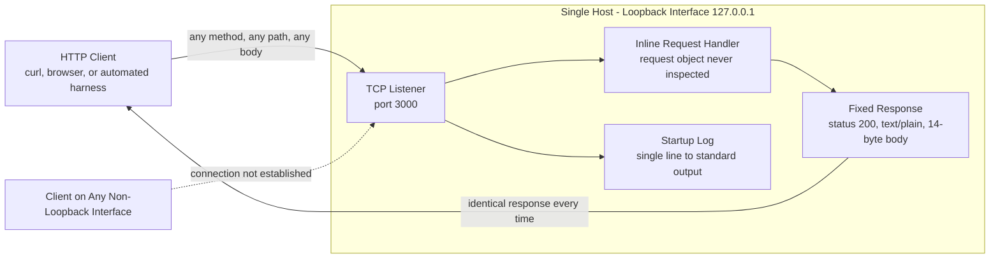
```mermaid
flowchart LR
    Client["HTTP Client<br/>curl, browser, or automated harness"]

    subgraph Host["Single Host - Loopback Interface 127.0.0.1"]
        Listener["TCP Listener<br/>port 3000"]
        Handler["Inline Request Handler<br/>request object never inspected"]
        Fixed["Fixed Response<br/>status 200, text/plain, 14-byte body"]
        Log["Startup Log<br/>single line to standard output"]
        Listener --> Handler
        Handler --> Fixed
        Listener --> Log
    end

    Client -->|"any method, any path, any body"| Listener
    Fixed -->|"identical response every time"| Client
    External["Client on Any Non-Loopback Interface"] -.->|"connection not established"| Listener
```

#### 1.2.2.3 Core Technical Approach

Six architectural choices characterize the implementation, and each is directly observable in the source.

| Approach | Evidence | Rationale as Implemented |
|---|---|---|
| Core modules only | Sole `require` targets Node's built-in `http` | Eliminates installation, registry, and version-drift failure modes |
| CommonJS module system | `require(...)` with no `"type"` field in `package.json` | Runs on a default Node.js configuration with no build step |
| Single-file executable script | All logic in `server.js`; no exports declared | The listener opens as a side effect of evaluating the file |
| Stateless request handling | No variables mutated per request; no session or persistence | Each request is fully independent; no cross-request coupling |
| Configuration by literal constant | `hostname` and `port` declared as `const` | Behavior is fixed at author time, guaranteeing reproducibility |
| Input-independent response | `req` is accepted by the handler but never read | Output cannot vary with client behavior |

The response construction itself is three statements:

```javascript
res.statusCode = 200;
res.setHeader('Content-Type', 'text/plain');
res.end('Hello, World!\n');
```

Because the code sets no other headers, the remaining response headers observed on the wire — `Content-Length`, `Date`, `Connection: keep-alive`, and `Keep-Alive: timeout=5` — are supplied by Node.js `http` runtime defaults and are **not** configured by this repository. Any change to those defaults in a future Node.js release would change the observed response headers without any change to this codebase.

### 1.2.3 Success Criteria

#### 1.2.3.1 Measurable Objectives

The repository declares no acceptance criteria, service-level objectives, or performance targets. The objectives below are derived exclusively from behavior that the code guarantees and that can be asserted deterministically; each was confirmed during inspection.

| Objective | Verifiable Assertion | Confirmed Result |
|---|---|---|
| Process starts and binds | `node server.js` binds `127.0.0.1:3000` without error | Bound successfully |
| Startup log is exact | Standard output equals `Server running at http://127.0.0.1:3000/` | Matched exactly |
| Status code is invariant | Every response carries HTTP `200` | `200` for `GET`, `POST`, and `DELETE` |
| Content type is invariant | Every response carries `Content-Type: text/plain` | Present on all responses |
| Payload is byte-exact | Response body is `Hello, World!` plus a newline, 14 bytes | 14 bytes returned on every request |
| Input independence holds | Path, query, method, and body do not alter the response | Identical responses across all probes |
| Dependency count is zero | `package-lock.json` contains only the root package entry | Zero third-party packages |
| Isolation is enforced | Non-loopback interfaces cannot reach port 3000 | Connection attempt failed |
| Test script fails by design | `npm test` terminates with exit code 1 | Exit code 1 |

#### 1.2.3.2 Critical Success Factors

Four factors determine whether the artifact continues to serve its stated purpose. All four derive from the README's fixture framing and the implementation's design.

- **Content immutability.** The README's "Do not touch!" instruction is the project's governing constraint. The fixture's usefulness as a fixed reference collapses if its files change, and the single-commit history with a clean working tree reflects that stability today.
- **Dependency-free execution.** Zero declared and zero locked dependencies mean the project cannot fail for reasons of registry availability or transitive version conflict.
- **Port 3000 availability on the loopback interface.** With no error handling and no configuration override, the process depends on that specific address and port being free.
- **A CommonJS-capable Node.js runtime.** Since no `engines` constraint is declared, the operating assumption is any Node.js version providing `require` and the standard `http` API.

#### 1.2.3.3 Key Performance Indicators

The repository defines **no** key performance indicators. This is a verified absence, not an omission from this document: there is no metrics library, no instrumentation, no tracing, no health-check endpoint distinguishable from the default response, no logging framework, no latency or throughput target, no error budget, and no monitoring, alerting, or dashboard configuration in any file. No SLA or SLO is stated anywhere.

The only quantifiable, code-derived indicators available for the artifact are correctness and footprint constants rather than performance metrics:

| Indicator | Value | Source |
|---|---|---|
| HTTP status code returned | `200`, unconditionally | `server.js` line 7 |
| Response payload size | 14 bytes | `res.end('Hello, World!\n')`, measured on the wire |
| Distinct routes served | 1 (all paths share one handler) | `server.js` lines 6–10 |
| Bind address and port | `127.0.0.1:3000` | `server.js` lines 3–4 |
| Third-party dependencies | 0 | `package.json`, `package-lock.json` |
| Automated tests | 0 (test script exits 1) | `package.json` `scripts.test` |
| Total source lines | 39 across 4 files | Repository file inventory |
| Commits in history | 1 | Git history |

Any performance, availability, or reliability target for this system would have to be established by the consuming tooling; none can be sourced from this repository.


## 1.3 Scope

Scope for this system is unusually easy to delimit: the repository is four files totalling 39 lines, so the boundary between what exists and what does not is unambiguous. Everything listed as in-scope below was read in the source; everything listed as out-of-scope was confirmed absent by explicit inspection of the repository, not assumed.

### 1.3.1 In-Scope

#### 1.3.1.1 Core Features and Functionalities

**Must-have capabilities.** These are the capabilities the system actually delivers, and they constitute the whole of its functional surface.

| Capability | Definition of Correct Behavior | Implementing Artifact |
|---|---|---|
| Bind an HTTP listener | Listen on `127.0.0.1` port `3000` | `server.js` lines 3–4, 12 |
| Answer all requests uniformly | Status `200`, `Content-Type: text/plain`, body `Hello, World!` plus newline | `server.js` lines 6–10 |
| Announce startup | Emit `Server running at http://127.0.0.1:3000/` to standard output | `server.js` lines 12–14 |
| Declare package identity | Name `hello_world`, version `1.0.0`, MIT license, `test` script | `package.json` |
| Guarantee a zero-dependency install | Lockfile resolving only the root package | `package-lock.json` |
| State purpose and immutability | Fixture purpose and the do-not-modify directive | `README.md` |

**Primary user workflows.** No workflow documentation exists in the repository, so the workflows below are those the artifacts make possible; each was exercised or verified during inspection.

| Workflow | Steps | Observed Outcome |
|---|---|---|
| Launch the service | Execute `server.js` with the Node.js runtime | Listener binds; startup line printed |
| Exercise the endpoint | Send any HTTP request to `http://127.0.0.1:3000/` | `200` with the 14-byte fixed body |
| Resolve dependencies | Run an npm install against the manifests | No third-party packages to fetch |
| Invoke the test script | Run `npm test` | Prints "Error: no test specified"; exits 1 |
| Inspect as a fixture | Clone the repository and read all four files | Full comprehension of the system |

The launch workflow warrants emphasis: because `package.json` declares no `start` script and its `main` field points to a non-existent `index.js`, the server must be started by naming `server.js` directly. There is no conventional npm-mediated launch path.

**Essential integrations.** Only two integration points are in scope, both internal to the host.

| Integration | Nature | Direction |
|---|---|---|
| Node.js built-in `http` module | Runtime API for transport and message handling | In-process |
| Process standard output | Destination for the single startup log line | Outbound, local |

**Key technical requirements.** These are the operating preconditions the code implies.

| Requirement | Basis |
|---|---|
| A Node.js runtime supporting CommonJS `require` and the `http` API | `server.js` line 1; no `"type"` field in `package.json` |
| TCP port `3000` free on the loopback interface | Hardcoded `port`; no error handling for bind failure |
| npm capable of reading `lockfileVersion: 3` for manifest operations | `package-lock.json` lockfile format |
| No installation, build, transpile, or bundling step | Zero dependencies; no build configuration present |
| Repository content remains unmodified | `README.md` directive "Do not touch!" |

#### 1.3.1.2 Implementation Boundaries

**System boundary.** The system is one Node.js process on one host. Its boundary is the TCP socket bound to `127.0.0.1:3000` plus the process's standard output stream. Nothing crosses that boundary in the outbound direction except HTTP responses and the startup log line. Verified by execution: `127.0.0.1:3000` served requests while the host's routable address refused the connection, so the loopback interface is a hard boundary and not merely a default.

**User groups covered.** Exactly one, undifferentiated: any anonymous HTTP client that can reach the loopback interface of the host. There are no roles, permissions, tenants, accounts, or identity concepts in the codebase — no authentication, authorization, session, cookie, or token handling exists — so every caller is treated identically and receives identical output.

**Geographic and market coverage.** Not applicable in any distributed sense. Coverage is a single machine's loopback interface. There is no multi-region deployment, no CDN, no load balancing, no DNS configuration, no internationalization or localization, and no timezone or currency handling. The single response body is fixed ASCII text with no locale variance.

**Data domains included.** One static string constitutes the entirety of the system's data.

| Data Element | Nature | Lifecycle |
|---|---|---|
| `Hello, World!` plus newline | Hardcoded response literal, 14 bytes | Compiled into source; never varies |
| `hostname`, `port` constants | Hardcoded configuration literals | Fixed at author time |
| Startup log line | Transient standard-output text | Emitted once at startup; not persisted |

No request data is read, parsed, stored, or logged. There is no database, no file I/O, no cache, no queue, and no in-memory state that survives a request. Accordingly, no personal data, regulated data, or business records are processed, and no data-retention, encryption, backup, or privacy-compliance concern arises from the code as written.

### 1.3.2 Out-of-Scope

#### 1.3.2.1 Excluded Application Capabilities

Each item below was confirmed absent by inspecting every file in the repository. The single `require` of Node's `http` module is the only import present, and no routing, error-handling, configuration, or security construct appears anywhere in the source.

| Excluded Capability | Confirmation |
|---|---|
| URL routing and method dispatch | The handler never reads the request object |
| Request body, query, or header processing | No parsing of any request input |
| Dynamic or templated responses | Single hardcoded literal response |
| Non-`200` status codes and error responses | Status is unconditionally `200` |
| Authentication, authorization, sessions | No credential, token, or identity handling |
| TLS / HTTPS | No `https` usage; plain HTTP only |
| Data persistence of any kind | No database, file, or cache access |
| Static asset or file serving | No file system reads; no `public/` directory |
| Runtime configuration | No `process.env` reference, `.env` file, or config loader |
| Error handling and resilience | No `try`/`catch`, no `'error'` listener |
| Graceful shutdown | No signal handlers; no `process.exit` |
| Timeout, keep-alive, or connection tuning | No timeout or socket settings in code |
| Rate limiting, CORS, compression, caching headers | No middleware layer of any kind |
| Observability instrumentation | No metrics, tracing, or logging framework |
| Clustering, worker threads, or multi-process scaling | Single-process script only |
| Off-host network exposure | Bind restricted to `127.0.0.1`, verified unreachable externally |

#### 1.3.2.2 Excluded Engineering Infrastructure

The following supporting infrastructure is absent from the repository. Each was checked individually.

| Category | Absent Artifacts |
|---|---|
| Automated testing | No `test/`, `tests/`, `__tests__/`, or `spec/` directory; no Jest or Mocha configuration; `npm test` exits 1 by design |
| Continuous integration / delivery | No `.github/` workflows, `.gitlab-ci.yml`, `Jenkinsfile`, `Makefile`, or `Procfile` |
| Containerization and orchestration | No `Dockerfile`, `docker-compose` file, or `.dockerignore` |
| Build and transpilation | No `tsconfig.json`, Babel, or bundler configuration; no `src/`, `lib/`, `dist/`, or `build/` directory |
| Code quality tooling | No ESLint, Prettier, or `.editorconfig` configuration |
| Runtime version pinning | No `engines` field, `.nvmrc`, or `.node-version` file |
| Environment and secrets management | No `.env`, `.env.example`, or `.npmrc` |
| Extended documentation and governance | No `docs/` directory, `LICENSE` file, `CONTRIBUTING.md`, or `CODEOWNERS`; no `.gitignore` |
| Alternate package managers | No `yarn.lock` or `pnpm-lock.yaml`; no non-JavaScript manifests |

#### 1.3.2.3 Integration Points Not Covered

No integration beyond the in-process `http` module and standard output is implemented. Specifically excluded, all confirmed by the absence of any corresponding client, driver, or SDK in the dependency-free manifests: relational and NoSQL databases; message brokers and event streams; caches; third-party or internal REST, GraphQL, and gRPC APIs; identity providers and single sign-on; payment, email, and notification services; object storage; secret managers; service discovery and API gateways; feature-flag services; and APM or log-aggregation backends. The system makes no outbound network calls whatsoever.

It is worth restating the distinction drawn in section 1.2.1.3: the "backprop integration" named in the README is an integration performed **on** this repository by external tooling through Git and npm conventions. No code inside this repository participates in it, and implementing such code is out of scope.

#### 1.3.2.4 Unsupported Use Cases

Given the implementation, the following uses are not supported and would require changes the repository does not contain.

- **Serving traffic to remote clients.** The loopback bind makes off-host access impossible without a source change.
- **Production or shared-environment deployment.** No configurability, error handling, shutdown handling, health checks, observability, or deployment tooling exists.
- **Consumption as a reusable library.** `server.js` exports nothing, and the `main` field points to a non-existent `index.js`, so the package cannot be meaningfully imported.
- **Serving as a CI quality gate.** `npm test` fails by design, so any pipeline asserting a passing test suite will fail.
- **Concurrent instances on one host.** Two processes cannot both bind port 3000, and the resulting bind error is unhandled.
- **Any behavior conditional on request content.** The response is invariant by construction, so content-driven scenarios cannot be exercised.
- **Modification of the repository.** The README explicitly instructs that the project not be touched, which places changes to it outside the sanctioned scope.

#### 1.3.2.5 Future Phase Considerations

The repository documents **no** future phases. There is no roadmap, backlog, `TODO` or `FIXME` comment, milestone, changelog, issue template, or open branch: the history consists of a single commit on `main`, and the working tree is clean. Nothing in the codebase indicates planned work.

Only one latent inconsistency is visible that a future change could resolve — `package.json` names `index.js` as its `main` entry point while the implementation resides in `server.js` — and even that is recorded here as an observation, not as a recommendation. The README's "Do not touch!" directive weighs against any evolution of this artifact, and this specification treats the current content as the intended final state.


## 1.4 References

Every factual claim in this Introduction traces to the sources below. The repository was examined in full — all four files were read in their entirety, and the complete file inventory was enumerated to confirm that nothing else exists.

### 1.4.1 Repository Files Examined

- `README.md` — Established the repository title `hao-backprop-test`, the sole purpose statement identifying the project as a test project for "backprop integration", and the "Do not touch!" immutability directive. Confirmed to contain no usage instructions, links, or architectural notes.
- `server.js` — Established the entire runtime implementation: the `require` of Node's built-in `http` module (line 1), the hardcoded `hostname = '127.0.0.1'` and `port = 3000` constants (lines 3–4), the inline request handler that ignores the request and sets status `200` with `Content-Type: text/plain` and the fixed `Hello, World!` body (lines 6–10), and the `server.listen` call with its `console.log` startup callback (lines 12–14). Also established the absence of exports, error handling, and shutdown logic.
- `package.json` — Established package name `hello_world`, version `1.0.0`, description "Hello world in Node.js", the `main: index.js` pointer to a non-existent file, the deliberately failing `test` script, author `hxu`, and the MIT license. Established the absence of `dependencies`, `devDependencies`, `engines`, `type`, and a `start` script.
- `package-lock.json` — Established `lockfileVersion: 3`, `requires: true`, and a `packages` map containing only the root entry, confirming zero third-party dependencies.

### 1.4.2 Repository Structure Examined

- Repository root (`/`) — Confirmed the complete inventory of four files with **no subdirectories**, totalling 39 lines of content. This established the system's true scale, cited throughout sections 1.1 and 1.3.

### 1.4.3 Verification Activities

| Activity | What It Established |
|---|---|
| Full file inventory enumeration | Only four files exist; no hidden files, no subdirectories |
| Absence probes across ~40 conventional paths | Verified absence of CI/CD, containerization, tests, build tooling, linters, version pinning, env/secrets, extended docs, and alternate lockfiles (section 1.3.2.2) |
| Static search across all `.js`, `.json`, and `.md` files | Only two matches repository-wide (`require('http')` and `server.listen`), confirming no `process.env`, exports, routing, error handling, signal handling, TLS, or credential material exists |
| Git history inspection | Single commit `1a0874d` ("Add files via upload") added all four files; branch `main` only; no tags; clean working tree; no `.gitignore`; hosted as `28-july-existing-projects-qa-test-01` |
| Runtime execution and HTTP probing | Startup log string matched exactly; `GET /`, `POST /anything/else?q=1` with a body, and `DELETE /deep/path` all returned identical `200` / `text/plain` / 14-byte responses; loopback-only binding confirmed when the host's routable address refused connection; `npm test` confirmed to exit with code 1 |
| Response header attribution | `Content-Length`, `Date`, `Connection`, and `Keep-Alive` observed on the wire originate from Node.js `http` runtime defaults, not from repository configuration (section 1.2.2.3) |

### 1.4.4 External Sources

No external sources were used. One web lookup regarding Node.js release status was attempted and returned no usable result; consequently this section makes no claim about external Node.js versions, release schedules, or support windows. The only version-adjacent inference drawn is that `lockfileVersion: 3` corresponds to a modern npm lockfile format, stated in section 1.3.1.1 solely as a manifest-compatibility requirement.

### 1.4.5 Cross-Section Notes

No other sections of this Technical Specification were available for cross-reference at the time this Introduction was written; all content therefore derives directly from repository inspection. Forward references within this section point to material contained in it: section 1.2.1.3 (integration landscape), section 1.2.2.3 (technical approach and header attribution), section 1.3.1.1 (technical requirements), and section 1.3.2.2 (excluded engineering infrastructure).


# 2. Product Requirements

## 2.1 Feature Catalog

This catalog decomposes the repository into discrete, independently testable features. As established in section 1.1, the entire codebase is **four files and 39 lines** (913 bytes) at the repository root: `README.md`, `package.json`, `package-lock.json`, and `server.js`. The feature set is therefore small and completely enumerable — every capability the system possesses is catalogued below, and nothing is catalogued that is not present in those four files.

### 2.1.1 Catalog Derivation and Conventions

#### 2.1.1.1 Derivation Method

The repository contains no requirements document, product brief, backlog, issue templates, roadmap, or design notes — `README.md` is the only narrative artifact and it is two lines long. No requirement statements were therefore available to transcribe. Every feature and requirement in section 2 was **reverse-derived** from two evidence classes:

| Evidence Class | What It Provided | Where Applied |
|---|---|---|
| Static inspection | Exact source lines, manifest fields, and documented intent | Feature boundaries, metadata, dependencies |
| Runtime execution | Measured status codes, headers, payload byte counts, exit codes, log output | Acceptance criteria in section 2.2 |

Both classes are cited to specific file and line anchors throughout. Where a behavior originates from the Node.js or npm runtime rather than from repository code, that attribution is stated explicitly; this mirrors the header-attribution treatment in section 1.2.2.3.

#### 2.1.1.2 Identifier and Rating Conventions

| Convention | Format | Notes |
|---|---|---|
| Feature identifier | `F-XXX` | Sequential, `F-001` through `F-007`; no gaps, no retired IDs |
| Requirement identifier | `F-XXX-RQ-YYY` | Scoped to its parent feature; assigned in section 2.2 |
| Known deviation identifier | `D-00X` | Documented anomalies, catalogued in section 2.2.9 |
| Priority (feature level) | Critical / High / Medium / Low | Ranked by whether the fixture's purpose survives the feature's removal |
| Priority (requirement level) | Must-Have / Should-Have / Could-Have | Assigned in section 2.2 |
| Status | Proposed / Approved / In Development / Completed | All seven features are **Completed** |

**Basis for the uniform Completed status.** All four files entered the repository in a single commit (`1a0874d`, "Add files via upload"), the working tree is clean, there are no tags, no additional branches, and no `TODO`/`FIXME` markers anywhere in the source. Section 1.3.2.5 further establishes that the repository documents no future phases and that the current content is the intended final state. Every feature below was additionally confirmed to function by direct execution. No feature is partially implemented.

#### 2.1.1.3 Feature Categories

Four categories organize the catalog. They correspond to the artifact boundaries that actually exist in the repository rather than to any layering declared by the project.

| Category | Features | Owning Artifact |
|---|---|---|
| Runtime Service — Network Transport | F-001 | `server.js` |
| Runtime Service — Request Handling | F-002 | `server.js` |
| Operational Feedback | F-003 | `server.js` |
| Packaging, Supply Chain, and Tooling | F-004, F-005, F-007 | `package.json`, `package-lock.json` |
| Documentation and Governance | F-006 | `README.md` |

### 2.1.2 Feature Inventory

| ID | Feature Name | Category | Priority |
|---|---|---|---|
| F-001 | HTTP Listener Binding and Process Lifecycle | Runtime Service — Network Transport | Critical |
| F-002 | Invariant Fixed HTTP Response | Runtime Service — Request Handling | Critical |
| F-003 | Startup Announcement Logging | Operational Feedback | High |
| F-004 | Package Identity and Manifest Declaration | Packaging, Supply Chain, and Tooling | High |
| F-005 | Deterministic Zero-Dependency Resolution | Packaging, Supply Chain, and Tooling | Medium |
| F-006 | Fixture Purpose Statement and Immutability Directive | Documentation and Governance | High |
| F-007 | Placeholder Test Script Contract | Packaging, Supply Chain, and Tooling | Low |

| ID | Status | Implementing Artifact and Lines | Requirements |
|---|---|---|---|
| F-001 | Completed | `server.js` lines 3–4, 6, 12–14 | 4 |
| F-002 | Completed | `server.js` lines 6–10 | 5 |
| F-003 | Completed | `server.js` lines 12–14 | 3 |
| F-004 | Completed | `package.json` lines 2–10 | 4 |
| F-005 | Completed | `package-lock.json` lines 2–12 | 3 |
| F-006 | Completed | `README.md` lines 1–2 | 3 |
| F-007 | Completed | `package.json` lines 6–8 | 1 |

Twenty-three requirements are specified across the seven features in section 2.2.

### 2.1.3 F-001: HTTP Listener Binding and Process Lifecycle

**Feature Metadata**

| Attribute | Value |
|---|---|
| Unique ID | F-001 |
| Feature Name | HTTP Listener Binding and Process Lifecycle |
| Feature Category | Runtime Service — Network Transport |
| Priority Level | Critical |
| Status | Completed |

**Description**

*Overview.* The feature opens a TCP listener for HTTP traffic on the loopback address `127.0.0.1` at port `3000` as the side effect of evaluating `server.js`. The bind parameters are declared as `const` literals on lines 3 and 4, the server object is created on line 6, and the bind is invoked on line 12. There is no configuration layer: a repository-wide search returned **zero** occurrences of `process.env`, and no `.env` file, `.npmrc`, or configuration module exists.

*Business Value.* This is the feature that makes the repository an exercisable target rather than a static code sample. Section 1.1.2 identifies the artifact's purpose as a known-good, zero-variance subject for an external integration named "backprop"; without a bound listener there is nothing for that tooling to exercise end to end.

*User Benefits.* Consumers get a launch path with no prerequisites — no install, build, transpile, or configuration step — and a bind target that is identical on every machine because it is hardcoded. The loopback restriction means exercising the fixture cannot inadvertently expose a network-facing surface, which was confirmed empirically: a request to the host's routable address (`10.76.1.16:3000`) was refused while `127.0.0.1:3000` served normally.

*Technical Context.* The only import in the repository is Node's built-in `http` module on line 1. The listener is created through `http.createServer(...)` and bound through `server.listen(port, hostname, callback)`. No `'error'` listener is registered and no `try`/`catch` exists, so bind failure is handled by Node's default unhandled-error path: a second concurrent instance produced `Error: listen EADDRINUSE: address already in use 127.0.0.1:3000` (errno −98, syscall `listen`) with a stack trace on stderr and process **exit code 1**. Likewise, no `SIGTERM` or `SIGINT` handler exists, so termination is immediate with no connection draining; the port is released by the operating system on exit.

**Dependencies**

| Dependency Class | Item | Nature |
|---|---|---|
| Prerequisite Features | None | F-001 is the root feature; it depends on no other catalogued feature |
| System Dependencies | Node.js runtime with CommonJS `require` and the `http` API | Mandatory; no `engines` field pins a version |
| System Dependencies | TCP port `3000` free on the loopback interface | Mandatory; contention is fatal and unhandled |
| External Dependencies | None | Zero third-party packages; no registry access needed at runtime |
| Integration Requirements | Inbound HTTP over the loopback interface only | The single integration surface of the whole system |

### 2.1.4 F-002: Invariant Fixed HTTP Response

**Feature Metadata**

| Attribute | Value |
|---|---|
| Unique ID | F-002 |
| Feature Name | Invariant Fixed HTTP Response |
| Feature Category | Runtime Service — Request Handling |
| Priority Level | Critical |
| Status | Completed |

**Description**

*Overview.* A single inline arrow function registered at `server.js` line 6 handles every accepted request. It performs exactly three statements — set status `200` (line 7), set `Content-Type: text/plain` (line 8), end the response with the 14-byte body `Hello, World!` plus a newline (line 9). The `req` parameter is accepted but never read; searches for `req.url`, `req.method`, `req.headers`, and `req.on` all returned zero matches.

*Business Value.* Invariance is the property that makes the repository useful as a fixture. Because the response cannot vary with client behavior, any deviation observed by consuming tooling isolates the fault to that tooling rather than to the subject — the reasoning set out in section 1.1.2.

*User Benefits.* Consumers can assert on an exact byte sequence rather than a schema. Verification confirmed a single response signature (`200` / 14 bytes / `text/plain`) across 50 sequential requests to 50 distinct paths and query strings, across 20 concurrent requests, and across the methods `GET`, `POST`, `PUT`, `PATCH`, `DELETE`, and `OPTIONS` (identical body checksum in every case). Non-standard methods behave the same way: a `PURGE` request also returned `200` with 14 bytes.

*Technical Context.* Response construction is three statements:

```javascript
res.statusCode = 200;
res.setHeader('Content-Type', 'text/plain');
res.end('Hello, World!\n');
```

`Content-Type` is the only header set by repository code, and it carries no `charset` parameter. The `Date`, `Connection`, `Keep-Alive`, and `Content-Length` headers observed on the wire are Node.js `http` defaults, not repository configuration — the attribution established in section 1.2.2.3. The handler is stateless: no variable is mutated per request, and no persistence, cache, session, or file access exists anywhere in the codebase.

**Dependencies**

| Dependency Class | Item | Nature |
|---|---|---|
| Prerequisite Features | F-001 (HTTP Listener Binding) | Hard; the handler only executes for connections the listener accepts |
| System Dependencies | Node.js `http` response object (`statusCode`, `setHeader`, `end`) | Mandatory API surface |
| System Dependencies | Node.js default response framing headers | Supplies `Content-Length`, `Date`, `Connection`, `Keep-Alive` |
| External Dependencies | None | No template engine, serializer, or middleware |
| Integration Requirements | Any HTTP client capable of reaching the loopback interface | No client-side capability, header, or credential is required |

### 2.1.5 F-003: Startup Announcement Logging

**Feature Metadata**

| Attribute | Value |
|---|---|
| Unique ID | F-003 |
| Feature Name | Startup Announcement Logging |
| Feature Category | Operational Feedback |
| Priority Level | High |
| Status | Completed |

**Description**

*Overview.* The callback passed to `server.listen` writes one line to standard output once the listener is bound. The message is built with a template literal from the same `hostname` and `port` constants used for the bind (`server.js` line 13), so the announced URL cannot drift from the actual bind target.

*Business Value.* The line is the system's only readiness signal. For automation that must know when the fixture is serving, it is the sole in-band indicator available — there is no health endpoint distinguishable from the default response, no readiness probe, and no metrics or tracing instrumentation anywhere in the repository (section 1.2.3.3).

*User Benefits.* Operators and harnesses get an exact, greppable string to synchronize on. Byte-level verification confirmed standard output equals `Server running at http://127.0.0.1:3000/` followed by a newline, 41 bytes in total, with no prefix, timestamp, or log level.

*Technical Context.* Logging uses `console.log` directly; no logging library, log level, structured format, or output file is involved. The announcement is emitted exactly once and nothing else is ever written: after more than seventy requests, standard output still contained exactly one line. Because the write happens in the `listening` callback, the line is a genuine post-bind signal rather than an optimistic pre-bind message.

**Dependencies**

| Dependency Class | Item | Nature |
|---|---|---|
| Prerequisite Features | F-001 (HTTP Listener Binding) | Hard; the callback fires only after a successful bind |
| System Dependencies | Process standard output stream | Sole log sink |
| System Dependencies | `hostname` and `port` constants (`server.js` lines 3–4) | Shared with F-001; guarantees the announced URL matches the bind |
| External Dependencies | None | No logging framework or log shipper |
| Integration Requirements | A consumer that captures process stdout | Outbound, host-local only |

### 2.1.6 F-004: Package Identity and Manifest Declaration

**Feature Metadata**

| Attribute | Value |
|---|---|
| Unique ID | F-004 |
| Feature Name | Package Identity and Manifest Declaration |
| Feature Category | Packaging, Supply Chain, and Tooling |
| Priority Level | High |
| Status | Completed |

**Description**

*Overview.* `package.json` declares the repository as a well-formed npm package: name `hello_world`, version `1.0.0`, description "Hello world in Node.js", `main` `index.js`, a single `test` script, author `hxu`, and the MIT license. It declares neither `dependencies` nor `devDependencies`, and it omits `engines`, `type`, `private`, `repository`, and `files`.

*Business Value.* Conformance to npm conventions is precisely how the repository integrates with external tooling. Section 1.2.1.3 characterizes the "backprop" integration as ecosystem-level rather than code-level: the manifest is what lets that tooling clone, read, and optionally install the project through standard commands without any bespoke adapter.

*User Benefits.* Consumers obtain a stable, machine-readable identity (`hello_world@1.0.0`) and an unambiguous license declaration. Because `dependencies` is absent, install is a no-op and no registry availability assumption is introduced.

*Technical Context.* The manifest omits a `"type"` field, so Node treats `server.js` as CommonJS, matching its `require` usage. Two consequences of the declared fields are documented as deviations in section 2.2.9 rather than as behavior: `main` names `index.js`, which does not exist in the repository, so requiring the package root fails with `MODULE_NOT_FOUND`; and no `start` script is declared, yet `npm start` still launches the server because npm supplies a built-in default of `node server.js` when a `server.js` file sits at the package root — behavior owned by the npm CLI, not by this repository.

**Dependencies**

| Dependency Class | Item | Nature |
|---|---|---|
| Prerequisite Features | None | The manifest stands alone |
| System Dependencies | JSON-parsing consumer (npm CLI or Node) | Mandatory for any manifest operation |
| External Dependencies | None declared | Zero `dependencies`, zero `devDependencies` |
| Integration Requirements | npm-compatible tooling reading `package.json` conventions | The ecosystem-level integration surface described in section 1.2.1.3 |
| Integration Requirements | Consistency with `package-lock.json` identity fields | Name, version, and license are duplicated in the lockfile |

### 2.1.7 F-005: Deterministic Zero-Dependency Resolution

**Feature Metadata**

| Attribute | Value |
|---|---|
| Unique ID | F-005 |
| Feature Name | Deterministic Zero-Dependency Resolution |
| Feature Category | Packaging, Supply Chain, and Tooling |
| Priority Level | Medium |
| Status | Completed |

**Description**

*Overview.* `package-lock.json` (`lockfileVersion: 3`, `requires: true`) contains a `packages` map holding **only** the root entry — name `hello_world`, version `1.0.0`, license MIT. No third-party package is locked, which is the machine-verifiable guarantee that the install graph is empty.

*Business Value.* Zero dependencies eliminate an entire class of failure that would otherwise contaminate integration runs: registry outages, resolution conflicts, transitive vulnerabilities, and version drift. Section 1.1.4 lists this as a primary value the artifact delivers.

*User Benefits.* Install is deterministic and offline-capable. `npm ci` completed with exit code 0, reported auditing a single package and zero vulnerabilities, and created **no** `node_modules` directory; `npm ls --all` reports an empty dependency tree beneath `hello_world@1.0.0`.

*Technical Context.* The lockfile's presence alongside an empty dependency set is a deliberate assertion rather than an omission: `npm ci` requires a lockfile, so shipping one lets consumers use the strict, reproducible install path and still get a no-op. `lockfileVersion: 3` requires an npm release that understands that format, which section 1.3.1.1 records as a manifest-compatibility requirement. No alternate lockfile (`yarn.lock`, `pnpm-lock.yaml`) exists to contradict it.

**Dependencies**

| Dependency Class | Item | Nature |
|---|---|---|
| Prerequisite Features | F-004 (Package Identity) | Hard; the lockfile mirrors the manifest's name, version, and license |
| System Dependencies | npm CLI supporting `lockfileVersion: 3` | Mandatory for lockfile-driven installs |
| External Dependencies | None | No package registry access is required, since nothing is locked |
| Integration Requirements | Any `npm ci` or `npm install` step in consuming automation | Must tolerate a no-op install and the absence of `node_modules` |

### 2.1.8 F-006: Fixture Purpose Statement and Immutability Directive

**Feature Metadata**

| Attribute | Value |
|---|---|
| Unique ID | F-006 |
| Feature Name | Fixture Purpose Statement and Immutability Directive |
| Feature Category | Documentation and Governance |
| Priority Level | High |
| Status | Completed |

**Description**

*Overview.* `README.md` is two lines: the title `hao-backprop-test` and the sentence identifying the repository as a test project for backprop integration together with the instruction not to touch it. These two lines are the only statement of intent anywhere in the repository.

*Business Value.* Section 1.1.2 treats the do-not-modify directive as **a first-class functional requirement, not incidental commentary**: a fixture whose content changes cannot serve as a fixed reference point, so content stability is itself a delivered property. The purpose statement is also the only artifact that names the consuming context ("backprop"), making it the sole source of the system's raison d'être.

*User Benefits.* Any reader learns the artifact's role and the governing constraint in a single sentence, and is warned off changes that would silently invalidate downstream comparisons.

*Technical Context.* This feature is documentary and governance-oriented; it has no runtime component. Its satisfaction is verified through repository state rather than execution: history consists of the single commit `1a0874d`, `git status --porcelain` is empty, no tags exist, and no `CONTRIBUTING.md`, `CODEOWNERS`, `LICENSE` file, or `.gitignore` accompanies it. The directive is enforced by convention only — no branch protection, hook, or CI check inside the repository enforces it, since the repository contains no `.github/` directory or hooks of its own.

**Dependencies**

| Dependency Class | Item | Nature |
|---|---|---|
| Prerequisite Features | None | Documentary; independent of runtime features |
| System Dependencies | None | No execution required |
| External Dependencies | Git hosting and history for immutability evidence | Verification of "unmodified" relies on version-control state |
| Integration Requirements | Human or automated readers must honor the directive | Advisory; nothing in the repository technically enforces it |
| Integration Requirements | Governs change to all other features (F-001…F-005, F-007) | Cross-cutting constraint documented in section 2.3.1 |

### 2.1.9 F-007: Placeholder Test Script Contract

**Feature Metadata**

| Attribute | Value |
|---|---|
| Unique ID | F-007 |
| Feature Name | Placeholder Test Script Contract |
| Feature Category | Packaging, Supply Chain, and Tooling |
| Priority Level | Low |
| Status | Completed |

**Description**

*Overview.* The `scripts` map in `package.json` contains exactly one entry, `test`, whose command is `echo "Error: no test specified" && exit 1`. Invoking it prints the message and terminates with exit code 1, which was verified twice.

*Business Value.* The value is honesty of signal rather than verification: the repository contains no test suite — no `test/`, `tests/`, `__tests__/`, or `spec/` directory and no test-runner configuration — and the script says so unambiguously instead of exiting 0 and implying coverage that does not exist.

*User Benefits.* Consumers integrating this repository learn immediately that `npm test` is not a quality gate. Section 1.3.2.4 records "serving as a CI quality gate" as an explicitly unsupported use case for exactly this reason.

*Technical Context.* The command is the npm initializer's default placeholder, retained unchanged. It is a shell one-liner with no runner, no framework, and no dependency; its behavior is therefore stable across environments that provide `echo` and shell `exit`. Any automation that treats a non-zero `npm test` exit as failure will fail deterministically against this repository — a deviation catalogued as D-003 in section 2.2.9.

**Dependencies**

| Dependency Class | Item | Nature |
|---|---|---|
| Prerequisite Features | F-004 (Package Identity) | Hard; the script is declared inside `package.json` |
| System Dependencies | npm CLI script runner and a POSIX-style shell providing `echo` | Mandatory for invocation |
| External Dependencies | None | No test framework or runner is installed or declared |
| Integration Requirements | Consuming pipelines must tolerate exit code 1 from `npm test` | Otherwise the pipeline fails by design |


## 2.2 Functional Requirements Table

This subsection specifies twenty-three requirements across the seven catalogued features. Each requirement is stated so that it can be verified by an observer with no access to the source — every acceptance criterion below was actually executed against the running system or evaluated against repository state, and the criteria record what was measured rather than what would be desirable.

### 2.2.1 Requirement Specification Conventions

#### 2.2.1.1 Identification and Rating Scales

| Element | Scale or Format | Meaning in This Specification |
|---|---|---|
| Requirement ID | `F-XXX-RQ-YYY` | `YYY` numbered from `001` within each feature |
| Priority | Must-Have | Removal breaks the fixture contract that section 1.1.2 describes |
| Priority | Should-Have | Materially supports the contract but the fixture still functions without it |
| Priority | Could-Have | Emergent or incidental; not deliberately implemented |
| Complexity | High / Medium / Low | Implementation effort and reasoning burden |

#### 2.2.1.2 Uniform Complexity Rating

**Every requirement in this section is rated Low complexity.** This is a considered assessment, not an unfilled column. The complete implementation is 14 executable lines in a single file with zero dependencies, zero conditional branches, zero asynchronous chains beyond the two runtime callbacks, and no state. There is no algorithm, schema, concurrency control, or integration handshake anywhere in the repository that could justify a higher rating for any individual requirement.

#### 2.2.1.3 Treatment of Performance Criteria

The repository declares **no** performance targets, service-level objectives, throughput budgets, latency thresholds, timeouts, or rate limits — section 1.2.3.3 records this as a verified absence, and a repository-wide search confirmed zero occurrences of `setTimeout` or any keep-alive or socket-tuning setting. Consequently, the "Performance Criteria" entries below express **determinism and invariance properties that were measured**, not speed or capacity guarantees. Any latency or throughput objective for this system must be established by the consuming tooling; none can be sourced from this repository.

### 2.2.2 F-001 Requirements — HTTP Listener Binding and Process Lifecycle

**Requirement Details**

| Requirement ID | Description | Acceptance Criteria | Priority / Complexity |
|---|---|---|---|
| F-001-RQ-001 | On evaluation of `server.js`, the process must create an HTTP server and bind a listener to host `127.0.0.1` port `3000` | Running `node server.js` produces a listening socket that accepts a TCP connection on `127.0.0.1:3000`; a subsequent HTTP request returns a response | Must-Have / Low |
| F-001-RQ-002 | Listener reachability must be confined to the loopback interface | A request to the host's routable address on port 3000 fails to connect (observed: `curl` exit code 7, `http_code=000` against `10.76.1.16:3000`) while the same request to `127.0.0.1:3000` returns `200` | Must-Have / Low |
| F-001-RQ-003 | Bind parameters must originate solely from in-source constants, with no external configuration input | `hostname` and `port` are `const` literals at `server.js` lines 3–4; a repository-wide search yields zero matches for `process.env`; no `.env`, `.npmrc`, or config file exists | Must-Have / Low |
| F-001-RQ-004 | When port `3000` on the loopback interface is already bound, the process must terminate rather than continue in a non-serving state (as-built, emergent behavior) | A second instance emits `Error: listen EADDRINUSE: address already in use 127.0.0.1:3000` (errno −98, syscall `listen`) to stderr as an unhandled `'error'` event and exits with code 1 | Could-Have / Low |

**Technical Specifications**

| Requirement ID | Input Parameters | Output / Response | Performance Criteria and Data Requirements |
|---|---|---|---|
| F-001-RQ-001 | None at invocation; no CLI arguments, flags, or environment variables are read | A bound TCP listener plus the F-003 startup line | Bind completes during process start with no retry loop; no data is read or persisted |
| F-001-RQ-002 | None | Connection accepted on `127.0.0.1`; connection refused on every non-loopback interface | Isolation is absolute, not probabilistic — verified by connection refusal, not by timeout |
| F-001-RQ-003 | `hostname = '127.0.0.1'`, `port = 3000` (source literals) | Identical bind target on every host and every run | Configuration data set is exactly two literals; nothing is read from disk or environment |
| F-001-RQ-004 | Pre-existing listener on `127.0.0.1:3000` | Stack trace on stderr; process exit code 1; no partial service | Failure is immediate at bind time; no request is ever served by the failing process |

**Validation Rules**

| Requirement ID | Business Rules | Data Validation | Security and Compliance |
|---|---|---|---|
| F-001-RQ-001 | The listener is the fixture's only exercisable surface and must open unconditionally at startup | No input to validate; the bind takes no runtime parameters | Plain HTTP only; no TLS, certificate, or `https` usage exists in the repository |
| F-001-RQ-002 | Off-host exposure is out of scope per section 1.3.2.1 and must remain so | Not applicable | Loopback binding is the system's sole network control; there is no firewall rule, allowlist, or authentication layer |
| F-001-RQ-003 | Determinism requires that behavior cannot be altered by deployment environment | Literals are fixed at author time and require no validation | No secret, credential, or token is present in any file; nothing is sourced from the environment |
| F-001-RQ-004 | A conflicting bind must not yield a silently degraded fixture | Not applicable | The stack trace printed on failure exposes only the address, port, and syscall — no sensitive data |

### 2.2.3 F-002 Requirements — Invariant Fixed HTTP Response

**Requirement Details**

| Requirement ID | Description | Acceptance Criteria | Priority / Complexity |
|---|---|---|---|
| F-002-RQ-001 | Every accepted request must receive HTTP status `200`, irrespective of method, path, query string, headers, or body | `200` observed for `GET /`, `POST /anything/else?q=1` with a body, `DELETE /deep/path`, `HEAD /`, `OPTIONS /`, `PUT /`, `PATCH /`, and the non-standard method `PURGE /x` | Must-Have / Low |
| F-002-RQ-002 | The response must carry the header `Content-Type: text/plain` | Header present on every response; value is exactly `text/plain` with no `charset` parameter | Must-Have / Low |
| F-002-RQ-003 | The response body must be exactly `Hello, World!` followed by a single newline | Body measured at 14 bytes; byte sequence confirmed as `H e l l o ,` space `W o r l d !` `\n`; `Content-Length: 14` observed on the wire | Must-Have / Low |
| F-002-RQ-004 | The handler must not inspect the request; the response must be emitted in a single completion call | Searches for `req.url`, `req.method`, `req.headers`, and `req.on` return zero matches; the handler body is three statements ending in one `res.end(...)` | Must-Have / Low |
| F-002-RQ-005 | Response identity must hold across repeated and concurrent invocations | 50 sequential requests to 50 distinct paths and query strings produced exactly one distinct signature (`200` / 14 bytes / `text/plain`); 20 concurrent requests produced one signature; body checksum identical across six HTTP methods | Must-Have / Low |

**Technical Specifications**

| Requirement ID | Input Parameters | Output / Response | Performance Criteria and Data Requirements |
|---|---|---|---|
| F-002-RQ-001 | Any HTTP request line, headers, and body — all accepted, none evaluated | Status line `HTTP/1.1 200 OK` | No status varies under any input; there is no error, redirect, or 4xx/5xx path in the codebase |
| F-002-RQ-002 | None | `Content-Type: text/plain` set explicitly by `server.js` line 8 | The only header set by repository code; `Date`, `Connection`, `Keep-Alive`, and `Content-Length` come from Node defaults (section 1.2.2.3) |
| F-002-RQ-003 | None | 14-byte plain-text payload | Payload is a compiled-in string literal; no template, file read, or serialization occurs |
| F-002-RQ-004 | `req` object is bound but never dereferenced | Response completed with one `res.end` call; no chunked writes | Zero request data is parsed, buffered, stored, or logged |
| F-002-RQ-005 | Arbitrary request volume and concurrency | Byte-identical responses | Statelessness guarantees invariance: no per-request variable is mutated and no shared state exists |

**Validation Rules**

| Requirement ID | Business Rules | Data Validation | Security and Compliance |
|---|---|---|---|
| F-002-RQ-001 | Uniform success is the fixture contract; differentiated responses are out of scope per section 1.3.2.1 | No request validation is performed by design | No authentication, authorization, session, cookie, or token handling exists; all callers are anonymous and indistinguishable |
| F-002-RQ-002 | Content type must be stated explicitly rather than inferred by the client | Header value is a literal and needs no validation | `text/plain` avoids client-side interpretation of the payload as markup or script |
| F-002-RQ-003 | The payload must be assertable byte-for-byte by consuming tooling | Payload is a fixed literal; no encoding negotiation or locale variance | No personal, regulated, or business data is transmitted — the payload is a static greeting |
| F-002-RQ-004 | Input independence is what makes deviation attributable to the consumer | Deliberate non-validation of all request input | Not reading the request body eliminates deserialization, injection, and payload-size attack surface |
| F-002-RQ-005 | A fixture that varies under load cannot serve as a reference | Not applicable | Path traversal probes (for example `/../etc/passwd`) returned the same `200` / 14-byte response; no filesystem access occurs, since no `fs` usage exists anywhere |

### 2.2.4 F-003 Requirements — Startup Announcement Logging

**Requirement Details**

| Requirement ID | Description | Acceptance Criteria | Priority / Complexity |
|---|---|---|---|
| F-003-RQ-001 | Once the listener is bound, the process must write the line `Server running at http://127.0.0.1:3000/` to standard output | Standard output matches that string exactly, followed by a newline (41 bytes total, byte-verified), with no timestamp, level, or prefix | Must-Have / Low |
| F-003-RQ-002 | The announced URL must be derived from the same constants used to bind, so the message cannot diverge from reality | `server.js` line 13 interpolates `${hostname}` and `${port}` — the identical constants consumed by `server.listen` on line 12 | Should-Have / Low |
| F-003-RQ-003 | No further output may be produced during request handling or shutdown | Standard output still contained exactly one line after more than seventy requests; no output is emitted on `SIGTERM` termination | Should-Have / Low |

**Technical Specifications**

| Requirement ID | Input Parameters | Output / Response | Performance Criteria and Data Requirements |
|---|---|---|---|
| F-003-RQ-001 | Listener-bound event supplied by `server.listen`'s callback | One line on stdout, emitted exactly once per process | Emitted after bind completes, making it a true readiness signal rather than an optimistic message |
| F-003-RQ-002 | `hostname` and `port` constants | Interpolated URL `http://127.0.0.1:3000/` | Announced URL and bind target are provably identical because they share one source |
| F-003-RQ-003 | None | Silence for the remainder of process life | No request data reaches any log sink, so no request-derived data is retained anywhere |

**Validation Rules**

| Requirement ID | Business Rules | Data Validation | Security and Compliance |
|---|---|---|---|
| F-003-RQ-001 | This line is the only readiness indicator available; there is no health endpoint distinct from the default response | Not applicable | Discloses only the loopback address and port |
| F-003-RQ-002 | Operator-facing information must not contradict runtime behavior | Not applicable | No credential or environment detail is interpolated |
| F-003-RQ-003 | Log silence preserves the fixture's deterministic output signature | Not applicable | Absence of request logging means no client address, header, or payload is ever recorded |

### 2.2.5 F-004 Requirements — Package Identity and Manifest Declaration

**Requirement Details**

| Requirement ID | Description | Acceptance Criteria | Priority / Complexity |
|---|---|---|---|
| F-004-RQ-001 | `package.json` must declare package identity: name, version, description, author, and license | Fields present with values `hello_world`, `1.0.0`, "Hello world in Node.js", `hxu`, and `MIT` at lines 2–4, 9, and 10 | Must-Have / Low |
| F-004-RQ-002 | The manifest must expose an npm-invocable `test` script | `scripts.test` present at lines 6–8 and invocable via `npm test` | Should-Have / Low |
| F-004-RQ-003 | The manifest must declare no runtime or development dependencies | Neither `dependencies` nor `devDependencies` appears in the file; `npm ls --all` reports an empty tree | Must-Have / Low |
| F-004-RQ-004 | The manifest must be valid, parseable JSON whose identity fields agree with the lockfile | File parses without error; `name`, `version`, and `license` match `package-lock.json` exactly; `npm ci` completes with exit code 0, which requires manifest/lockfile agreement | Must-Have / Low |

**Technical Specifications**

| Requirement ID | Input Parameters | Output / Response | Performance Criteria and Data Requirements |
|---|---|---|---|
| F-004-RQ-001 | None; the manifest is a static 251-byte document | Machine-readable identity `hello_world@1.0.0`, MIT-licensed | Data set is seven top-level keys; no nested structures beyond `scripts` |
| F-004-RQ-002 | Script name `test` supplied by the npm CLI invocation | Delegation to the shell command in `scripts.test` | One script entry only; no pre/post hooks are declared |
| F-004-RQ-003 | None | Absent dependency keys, implying an empty install graph | No registry request is required for install |
| F-004-RQ-004 | Manifest and lockfile read together by the npm CLI | Successful strict install with no reconciliation error | Identity fields are duplicated across two files and must stay synchronized |

**Validation Rules**

| Requirement ID | Business Rules | Data Validation | Security and Compliance |
|---|---|---|---|
| F-004-RQ-001 | npm-convention conformance is the integration mechanism described in section 1.2.1.3 | Fields are literal strings; no schema validation is performed by the repository | MIT license declared in the manifest; note that no `LICENSE` file accompanies it |
| F-004-RQ-002 | Tooling must be able to discover a test entry point even though no suite exists | Not applicable | The command executes only `echo` and `exit`; it touches no file and reads no input |
| F-004-RQ-003 | Zero dependencies is a stated value of the artifact (section 1.1.4) | Absence is itself the assertion | No transitive dependency can introduce a vulnerability; `npm ci` reported zero vulnerabilities |
| F-004-RQ-004 | Manifest and lockfile must not drift | JSON syntax validity is enforced by every consuming parser | Version consistency prevents ambiguity about which artifact is under test |

### 2.2.6 F-005 Requirements — Deterministic Zero-Dependency Resolution

**Requirement Details**

| Requirement ID | Description | Acceptance Criteria | Priority / Complexity |
|---|---|---|---|
| F-005-RQ-001 | A lockfile must be present, declaring `lockfileVersion: 3`, `requires: true`, and a `packages` map containing only the root entry | `package-lock.json` lines 4–12 hold exactly those values; the `packages` object has a single key, `""` | Must-Have / Low |
| F-005-RQ-002 | A strict, lockfile-driven install must succeed without fetching any third-party package | `npm ci` exits 0, reports auditing one package and zero vulnerabilities, and creates no `node_modules` directory; the post-install file listing is unchanged | Must-Have / Low |
| F-005-RQ-003 | The lockfile root entry must mirror the manifest's identity | Lockfile root records `hello_world`, `1.0.0`, and `MIT`, matching `package.json` | Must-Have / Low |

**Technical Specifications**

| Requirement ID | Input Parameters | Output / Response | Performance Criteria and Data Requirements |
|---|---|---|---|
| F-005-RQ-001 | None; a static 247-byte document | A dependency graph containing exactly one node — the root package | Graph size is fixed at one; there is no resolution tree to traverse |
| F-005-RQ-002 | Lockfile plus manifest consumed by `npm ci` | Exit code 0 and an unchanged working tree | Install is offline-capable because no remote artifact is referenced |
| F-005-RQ-003 | None | Consistent identity across both manifests | Three duplicated fields must remain synchronized |

**Validation Rules**

| Requirement ID | Business Rules | Data Validation | Security and Compliance |
|---|---|---|---|
| F-005-RQ-001 | An empty but present lockfile is a deliberate assertion of a zero-dependency graph, enabling the strict install path | npm validates the lockfile format on read | `lockfileVersion: 3` requires a modern npm; older CLIs may not understand the format |
| F-005-RQ-002 | Install must never be a source of integration-run failure | npm reconciles the lockfile against the manifest and fails on mismatch | No supply-chain surface exists: nothing is downloaded, so no integrity hash or provenance check applies |
| F-005-RQ-003 | Duplicate identity data must agree between files | Compared by npm during install | Prevents ambiguity about the identity of the artifact under test |

### 2.2.7 F-006 Requirements — Fixture Purpose Statement and Immutability Directive

**Requirement Details**

| Requirement ID | Description | Acceptance Criteria | Priority / Complexity |
|---|---|---|---|
| F-006-RQ-001 | `README.md` must state the repository's purpose as a test project for backprop integration | Line 2 of `README.md` contains that statement; it is the only purpose statement in the repository | Must-Have / Low |
| F-006-RQ-002 | `README.md` must state the directive that the project not be modified | Line 2 of `README.md` ends with the "Do not touch!" instruction | Must-Have / Low |
| F-006-RQ-003 | Repository content must remain unmodified relative to its published baseline | `git log` shows the single commit `1a0874d` that introduced all four files; `git status --porcelain` returns no output; no tags exist and `main` is the only local branch | Must-Have / Low |

**Technical Specifications**

| Requirement ID | Input Parameters | Output / Response | Performance Criteria and Data Requirements |
|---|---|---|---|
| F-006-RQ-001 | None; a static 73-byte, two-line document | Human-readable purpose statement naming the consuming context | Documentation data set is two lines; no links, images, or usage instructions |
| F-006-RQ-002 | None | Human-readable governance constraint | Directive is expressed in prose only |
| F-006-RQ-003 | Version-control history and working-tree state | A clean tree at a single-commit baseline | Immutability is evidenced by version control, not by any runtime mechanism |

**Validation Rules**

| Requirement ID | Business Rules | Data Validation | Security and Compliance |
|---|---|---|---|
| F-006-RQ-001 | The README is the sole authority on intent; no competing description exists outside the manifest's "Hello world in Node.js" | Not applicable | Contains no credential, endpoint, or sensitive information |
| F-006-RQ-002 | Section 1.1.2 treats this directive as a first-class functional requirement, since a mutable fixture cannot be a reference point | Not applicable | Governance control is advisory; no branch protection, hook, or CI check inside the repository enforces it |
| F-006-RQ-003 | Any content change invalidates prior comparisons made by consuming tooling | Verified by comparing working tree against the committed baseline | Single-commit provenance makes unauthorized change trivially detectable |

### 2.2.8 F-007 Requirements — Placeholder Test Script Contract

**Requirement Details**

| Requirement ID | Description | Acceptance Criteria | Priority / Complexity |
|---|---|---|---|
| F-007-RQ-001 | Invoking `npm test` must print `Error: no test specified` and terminate with a non-zero exit status | `npm test` printed the npm banner `> hello_world@1.0.0 test`, echoed the command, printed `Error: no test specified`, and exited with code **1** on both executions | Must-Have / Low |

**Technical Specifications**

| Requirement ID | Input Parameters | Output / Response | Performance Criteria and Data Requirements |
|---|---|---|---|
| F-007-RQ-001 | Command `npm test`; no arguments, files, or environment inputs are consumed | Message on standard output plus exit code 1 | Deterministic across environments providing `echo` and shell `exit`; no test data, fixture, or artifact is read or produced |

**Validation Rules**

| Requirement ID | Business Rules | Data Validation | Security and Compliance |
|---|---|---|---|
| F-007-RQ-001 | The absence of tests must be reported honestly rather than masked by a zero exit code; consuming pipelines must therefore tolerate exit 1 (section 1.3.2.4) | Not applicable | The command runs only shell built-ins; it touches no file, network, or credential |

### 2.2.9 Known Deviations and Documented Anomalies

The following are documented facts about the repository, not requirements. They are recorded here because they materially affect how the features above behave when consumed, and each was confirmed by direct observation.

| ID | Deviation | Evidence | Affected Features |
|---|---|---|---|
| D-001 | `package.json` declares `main` as `index.js`, but no `index.js` file exists in the repository | Requiring the package root fails with `MODULE_NOT_FOUND` and the message that the `main` entry cannot be found; a full file listing confirms `index.js` is absent | F-004 |
| D-002 | The README title `hao-backprop-test` differs from the npm package name `hello_world` | `README.md` line 1 versus `package.json` line 2 and `package-lock.json` line 2 | F-004, F-006 |
| D-003 | `npm test` fails by design, so any pipeline gating on a passing test suite fails against this repository | `scripts.test` is `echo "Error: no test specified" && exit 1`; measured exit code 1 | F-007 |
| D-004 | No `start` script is declared, yet `npm start` launches the server | The `scripts` map contains only `test`; `npm start` nonetheless printed `> node server.js`, bound the listener, and served a `200`/14-byte response — npm supplies this default because a `server.js` file exists at the package root, so the behavior belongs to the npm CLI rather than to this repository | F-001, F-004 |
| D-005 | No runtime version constraint is expressed, so the supported Node.js range is undeclared | No `engines` field, `.nvmrc`, or `.node-version` file exists; verification was performed on Node.js v22.23.1 with npm 11.18.0 | F-001, F-004 |


## 2.3 Feature Relationships

Only relationships that are directly evident in the four repository files are documented here. Because there are no modules, no exports, no dependency injection, and no configuration layer, the relationship graph is shallow: three runtime features share a single file and a single pair of constants, three packaging features share the manifest pair, and one documentary feature constrains all of them.

### 2.3.1 Feature Dependency Map

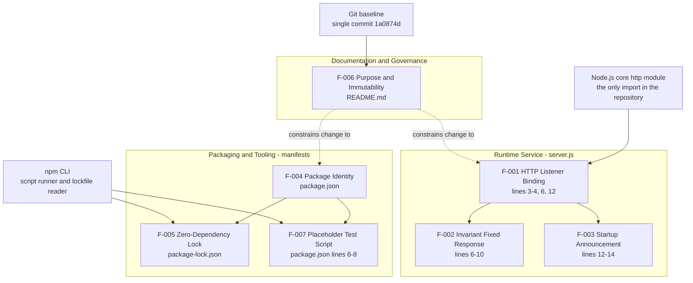
```mermaid
flowchart TD
    HTTPMOD["Node.js core http module<br/>the only import in the repository"]
    NPMCLI["npm CLI<br/>script runner and lockfile reader"]
    GITBASE["Git baseline<br/>single commit 1a0874d"]

    subgraph RuntimeService["Runtime Service - server.js"]
        F001["F-001 HTTP Listener Binding<br/>lines 3-4, 6, 12"]
        F002["F-002 Invariant Fixed Response<br/>lines 6-10"]
        F003["F-003 Startup Announcement<br/>lines 12-14"]
        F001 --> F002
        F001 --> F003
    end

    subgraph Packaging["Packaging and Tooling - manifests"]
        F004["F-004 Package Identity<br/>package.json"]
        F005["F-005 Zero-Dependency Lock<br/>package-lock.json"]
        F007["F-007 Placeholder Test Script<br/>package.json lines 6-8"]
        F004 --> F005
        F004 --> F007
    end

    subgraph Governance["Documentation and Governance"]
        F006["F-006 Purpose and Immutability<br/>README.md"]
    end

    HTTPMOD --> F001
    NPMCLI --> F005
    NPMCLI --> F007
    GITBASE --> F006
    F006 -.->|"constrains change to"| F001
    F006 -.->|"constrains change to"| F004
```

**Dependency edges and their evidence**

| Edge | Type | Evidence |
|---|---|---|
| F-001 → F-002 | Hard runtime dependency | The handler registered at `server.js` line 6 executes only for connections the listener accepts |
| F-001 → F-003 | Hard runtime dependency | The announcement is emitted from the `server.listen` callback (`server.js` lines 12–14), so it fires only after a successful bind |
| F-004 → F-005 | Data-consistency dependency | The lockfile root entry duplicates the manifest's `name`, `version`, and `license`; `npm ci` fails on divergence |
| F-004 → F-007 | Containment dependency | `scripts.test` is declared inside `package.json` and is reachable only through the manifest |
| F-006 → all features | Governance constraint (advisory) | The "Do not touch!" directive in `README.md` line 2, elevated to a functional requirement by section 1.1.2 |

**Relationships that do not exist.** The runtime features (F-001…F-003) and the packaging features (F-004, F-005, F-007) have **no code-level coupling**: `server.js` never reads `package.json`, and neither manifest references `server.js`. The two groups are joined only at the level of consumer workflow — a consumer reads the manifests and then executes the script. The one apparent exception is supplied externally: `npm start` reaches `server.js` through npm's built-in default rather than through any declaration in the repository (deviation D-004 in section 2.2.9).

### 2.3.2 Process Flow and Related Flowcharts

The request-level process flow — client, loopback boundary, handler, and fixed response — is documented in the flowchart in section **1.2.2.2** and is not duplicated here. The complementary view below is the **process lifecycle**, including the two terminal paths that the requirements in section 2.2.2 describe.

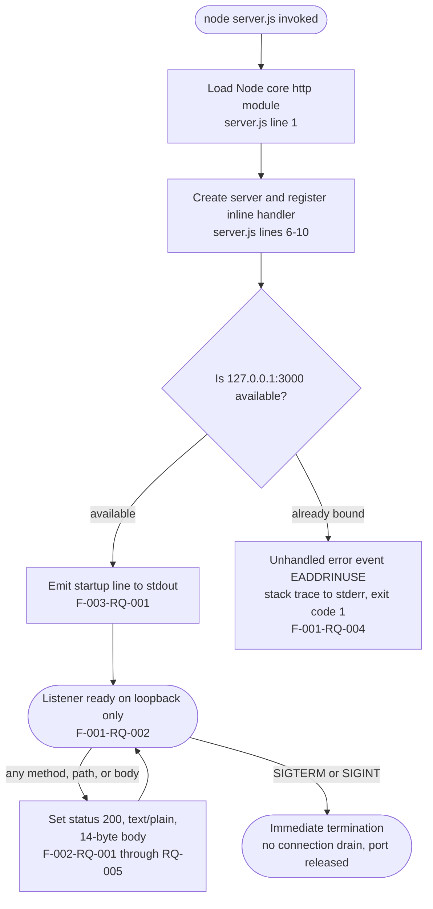
```mermaid
flowchart TD
    Invoke(["node server.js invoked"]) --> LoadMod["Load Node core http module<br/>server.js line 1"]
    LoadMod --> CreateSrv["Create server and register inline handler<br/>server.js lines 6-10"]
    CreateSrv --> BindDec{"Is 127.0.0.1:3000 available?"}
    BindDec -->|"available"| Announce["Emit startup line to stdout<br/>F-003-RQ-001"]
    BindDec -->|"already bound"| BindFail["Unhandled error event EADDRINUSE<br/>stack trace to stderr, exit code 1<br/>F-001-RQ-004"]
    Announce --> Ready(["Listener ready on loopback only<br/>F-001-RQ-002"])
    Ready -->|"any method, path, or body"| Serve["Set status 200, text/plain,<br/>14-byte body<br/>F-002-RQ-001 through RQ-005"]
    Serve --> Ready
    Ready -->|"SIGTERM or SIGINT"| Halt(["Immediate termination<br/>no connection drain, port released"])
```

| Flow Stage | Features Exercised | Terminal Condition |
|---|---|---|
| Module load and server creation | F-001 | None; synchronous and unconditional |
| Bind decision | F-001, F-003 | Success announces readiness; conflict exits with code 1 |
| Steady-state request service | F-002 | Loops indefinitely; no request can alter state |
| Termination | F-001 | Immediate on signal; no handler, no drain, no exit log |

### 2.3.3 Integration Points

| Integration Point | Direction | Features | Contract |
|---|---|---|---|
| TCP socket on `127.0.0.1:3000` | Inbound | F-001, F-002 | Any HTTP request receives `200` / `text/plain` / 14 bytes |
| Process standard output | Outbound, host-local | F-003 | Exactly one readiness line, then silence |
| Process standard error | Outbound, host-local | F-001 | Used only by Node's default unhandled-error path on bind failure |
| `package.json` / `package-lock.json` manifest pair | Consumed by tooling | F-004, F-005, F-007 | npm conventions: identity, no-op install, `test` script exiting 1 |
| Git repository and history | Consumed by tooling | F-006 | Single-commit baseline evidencing immutability |

There are **no outbound integration points** beyond the local streams above. Section 1.3.2.3 records the verified absence of databases, brokers, caches, third-party APIs, identity providers, object storage, secret managers, and telemetry backends; the single `require` in the repository targets a Node core module, so no client or SDK exists that could initiate an outbound call.

### 2.3.4 Shared Components

| Shared Component | Location | Consuming Features |
|---|---|---|
| `hostname` and `port` constants | `server.js` lines 3–4 | F-001 (bind target) and F-003 (announced URL) |
| `server` object returned by `http.createServer` | `server.js` line 6 | F-001 (owns `listen`), F-002 (owns the handler) |
| `res` response object | Handler parameter, `server.js` lines 6–9 | F-002 exclusively |
| Package identity fields (`name`, `version`, `license`) | `package.json` and `package-lock.json` | F-004 and F-005 — duplicated and required to agree |
| `scripts` map | `package.json` lines 6–8 | F-004 (declares it) and F-007 (is its only entry) |

The constant-sharing relationship is the single most consequential coupling in the system: because `server.js` line 13 interpolates the same two constants that line 12 passes to `listen`, the announced URL cannot drift from the actual bind target. There is no other mechanism in the repository that guarantees agreement between documentation and behavior.

### 2.3.5 Common Services

All shared services are supplied by the runtime environment; the repository implements none of its own — there is no middleware layer, no logging service, no configuration service, and no error-handling service anywhere in the code.

| Common Service | Provider | Features Relying On It |
|---|---|---|
| HTTP transport, request parsing, response serialization | Node.js core `http` module | F-001, F-002 |
| Default response framing headers (`Content-Length`, `Date`, `Connection`, `Keep-Alive`) | Node.js `http` defaults, not repository code | F-002 |
| Default unhandled-`'error'` termination and default signal handling | Node.js runtime | F-001 |
| Standard output and standard error streams | Operating-system process I/O | F-001, F-003 |
| Script running, manifest parsing, lockfile-driven install | npm CLI | F-004, F-005, F-007 |
| History, working-tree state, and provenance | Git | F-006 |

Because these services are external, their defaults are part of the observable contract without being under repository control. Section 1.2.2.3 makes the same point about response headers: a change to Node.js defaults in a future release would change observed behavior with no change to this codebase. Deviations D-004 and D-005 in section 2.2.9 are further instances of the same principle — npm supplies the implicit `start` behavior, and no `engines` constraint pins the runtime whose defaults are being relied upon.


## 2.4 Implementation Considerations

The considerations below are stated per feature and derive from what the implementation does and does not contain. Several categories resolve to "not applicable" for this system; where that is the case it is stated plainly rather than filled with generic guidance, in keeping with the evidence discipline applied throughout this specification.

### 2.4.1 Technical Constraints

| Feature | Technical Constraints |
|---|---|
| F-001 | Bind address and port are `const` literals (`server.js` lines 3–4) and cannot be changed without editing source — zero `process.env` references exist. Exactly one instance can run per host, because a second bind fails fatally. Plain HTTP only; no `https` usage exists anywhere. No `engines` field declares a supported Node.js range (D-005). |
| F-002 | The response is a compiled-in literal, so it cannot be varied by request, configuration, or content negotiation. Only `Content-Type` is under repository control; all other headers are Node defaults. There is no error path — no status other than `200` can be produced by this code. |
| F-003 | The sink is fixed to standard output via `console.log`; there is no log level, format, rotation, or file destination. The message is emitted exactly once per process, so a consumer that misses it has no second readiness signal to observe. |
| F-004 | `main` points to a non-existent `index.js`, so the package cannot be resolved by name (D-001). No `start` script is declared, making the launch path dependent on npm's implicit default (D-004). No `type` field is present, fixing the module system as CommonJS. |
| F-005 | `lockfileVersion: 3` constrains consumers to an npm release that understands that format. The lockfile must remain synchronized with the manifest's identity fields or `npm ci` will reject the install. |
| F-006 | The directive is advisory: nothing inside the repository enforces it, since there are no hooks, no `.github/` directory, and no CI configuration. Verification of immutability depends on external version-control state rather than on any repository mechanism. |
| F-007 | The script depends on a shell providing `echo` and `exit`; it is a placeholder and cannot be extended into a real suite without violating F-006. |

### 2.4.2 Performance Requirements

**No performance requirement is declared anywhere in the repository.** Section 1.2.3.3 records this as a verified absence — there is no metrics library, no instrumentation, no tracing, no latency or throughput target, no error budget, and no timeout, keep-alive, or socket-tuning setting in the code. This specification therefore states no numeric performance target, because none can be sourced from the artifact.

What can be asserted are the invariance properties that were measured, which are the only performance-adjacent guarantees the implementation makes:

| Feature | Measured Property | Implication |
|---|---|---|
| F-001 | Bind occurs synchronously during process start with no retry loop | Readiness is effectively immediate; failure is immediate as well |
| F-002 | 50 sequential requests across distinct paths and 20 concurrent requests yielded a single response signature (`200` / 14 bytes / `text/plain`) | Response cost is constant and independent of request content or concurrency |
| F-002 | Payload is a fixed 14-byte literal with no serialization, template rendering, or I/O | Per-request work is bounded and identical for every request |
| F-003 | Exactly one line of output per process, irrespective of request volume | Logging contributes no per-request overhead |
| F-005 | `npm ci` completes with no network fetch and creates no `node_modules` | Install cost is effectively fixed and offline-capable |

Any latency, throughput, or availability objective for this system must be defined and measured by the consuming tooling. The observed environment for all measurements in this specification was Node.js v22.23.1 with npm 11.18.0; those figures characterize the environment, not a repository requirement.

### 2.4.3 Scalability Considerations

| Feature | Scalability Position |
|---|---|
| F-001 | Single process, single port, single host. No clustering, worker threads, or child processes exist — searches for `cluster` and `worker` return zero matches. Horizontal scaling on one host is impossible because the port is hardcoded and a duplicate bind terminates the process (F-001-RQ-004). |
| F-001 | Loopback binding precludes any load balancer, reverse proxy, or remote client, so scaling beyond the host is not merely unimplemented but structurally excluded (section 1.3.2.4). |
| F-002 | The handler is stateless and mutates nothing, so concurrent request handling is safe within the single Node event loop — confirmed by 20 concurrent requests returning one identical signature. Vertical concurrency is limited only by the event loop, as no blocking or synchronous I/O call exists in the handler. |
| F-003 | Logging does not scale with load because it is emitted once at startup; there is no per-request log volume to manage. |
| F-004, F-005 | Manifest and lockfile scale trivially: the dependency graph has exactly one node, so install time and audit surface do not grow. |
| F-006, F-007 | No scalability dimension applies; both are static artifacts. |

Scaling this system in any dimension would require code changes, which F-006 places outside the sanctioned scope. Scalability is therefore correctly read as a non-goal of the artifact rather than as an unmet requirement.

### 2.4.4 Security Implications

The repository contains no security controls of its own beyond the network-scope restriction, and it also presents an unusually small attack surface. Both facts are stated below with their evidence; no control is claimed that does not exist.

| Feature | Security Implications |
|---|---|
| F-001 | The loopback bind is the system's **only** network control, and it is effective: connections to the host's routable address were refused. There is no TLS, so traffic is plaintext — acceptable only because it never leaves the host. There is no firewall rule, allowlist, or connection limit in the repository. |
| F-001 | Bind failure prints a stack trace to stderr. The disclosed content is limited to the address, port, syscall, and Node internals — no credential or environment data is exposed, because none exists in the process. |
| F-002 | No authentication, authorization, session, cookie, or token handling exists; every caller is anonymous and receives identical output (section 1.3.1.2). Because the request is never read, whole classes of input-driven vulnerability are structurally absent: no body deserialization, no query or header parsing, no injection sink, and no payload-size handling. |
| F-002 | No filesystem access occurs — there are zero `fs` references — so path traversal is inert; the probe `/../etc/passwd` returned the same `200` / 14-byte response as `/`. Responses set no security headers (no CORS, CSP, HSTS, or `X-Content-Type-Options`), which is consistent with the loopback-only, fixed-plaintext-payload design. |
| F-003 | The startup line discloses only the loopback address and port. Because nothing is logged per request, no client address, header, or payload is ever recorded — there is no log-based data-retention exposure. |
| F-004, F-005 | Zero declared and zero locked dependencies eliminate the transitive supply-chain surface entirely; `npm ci` reported zero vulnerabilities across the single audited package. No credential material, `.npmrc`, or registry token exists in the repository. |
| F-006 | Immutability is a governance control, not a technical one. Detection of unauthorized change relies on the single-commit provenance and a clean working tree; nothing prevents modification. |
| F-007 | The test command executes only shell built-ins and reads no input, file, or network resource. |

**Compliance.** No compliance requirement is expressed or implicated anywhere in the repository. Section 1.3.1.2 establishes that the system processes no personal, regulated, or business data — the entire data domain is one static 14-byte greeting plus two configuration literals — so no data-retention, encryption, residency, or privacy obligation arises from the code as written. The only distribution term stated is the MIT license declared in both manifests, and no `LICENSE` file accompanies that declaration.

### 2.4.5 Maintenance Requirements

| Feature | Maintenance Requirements |
|---|---|
| F-001, F-002, F-003 | No routine maintenance is implied: no dependency updates are possible, no configuration drifts, and no state accumulates. The material maintenance risk is external — because no `engines` constraint pins the runtime (D-005), a future Node.js release could alter default framing headers or default error behavior and thereby change observed responses with no change to this code (section 1.2.2.3). |
| F-004, F-005 | The only synchronization obligation in the repository is between `package.json` and `package-lock.json` identity fields; any change to name, version, or license must be applied to both or `npm ci` will fail. |
| F-006 | The immutability directive inverts normal maintenance expectations: the correct maintenance action for this repository is **no action**. Section 1.3.2.5 confirms no roadmap, backlog, `TODO`/`FIXME` marker, changelog, or open branch exists, and records the current content as the intended final state. |
| F-007 | Because `npm test` fails by design (D-003), consuming pipelines — not this repository — must be maintained to tolerate that exit code. |
| All | The known deviations D-001 through D-005 are recorded as documented facts, not defects scheduled for repair. Correcting D-001 or D-002 would require editing files that F-006 forbids changing. |

### 2.4.6 Assumptions and Constraints Register

| ID | Assumption or Constraint | Basis and Consequence |
|---|---|---|
| A-001 | A Node.js runtime supporting CommonJS `require` and the standard `http` API is available | `server.js` line 1 and the absence of a `"type"` field; no version range is declared, so the assumption is unbounded (section 1.3.1.1) |
| A-002 | TCP port `3000` on the loopback interface is free at launch | Hardcoded `port` with no fallback; contention terminates the process with exit code 1 |
| A-003 | Consumers launch the server by naming `server.js`, or rely on npm's implicit default | No `start` script is declared and `main` is unresolvable (D-001, D-004) |
| A-004 | Consuming automation tolerates a `npm test` exit code of 1 and an install that produces no `node_modules` | Measured behavior of F-007 and F-005 |
| A-005 | The npm CLI in use understands `lockfileVersion: 3` | `package-lock.json` line 4 |
| C-001 | Repository content must not be modified | `README.md` line 2; treated as a first-class functional requirement by section 1.1.2 |
| C-002 | The service is unreachable from outside the host | Verified loopback-only binding; off-host exposure is out of scope (section 1.3.2.1) |
| C-003 | Behavior cannot be altered at runtime by configuration | Zero `process.env` references; no config file exists |
| C-004 | Response headers other than `Content-Type` are outside repository control | Node `http` defaults supply `Content-Length`, `Date`, `Connection`, and `Keep-Alive` (section 1.2.2.3) |
| C-005 | The package cannot be consumed as a library | `server.js` declares no exports and `main` resolves to a missing file (section 1.3.2.4) |


## 2.5 Traceability Matrix

Every requirement specified in section 2.2 traces forward to an implementing artifact and to the method by which it was verified. Because the repository is four files, coverage is complete in both directions: no requirement lacks an implementation anchor, and no line of the repository is unaccounted for by some requirement.

### 2.5.1 Requirement-to-Implementation Traceability

| Requirement ID | Feature | Implementing Artifact and Lines |
|---|---|---|
| F-001-RQ-001 | F-001 | `server.js` lines 6, 12 (`http.createServer`, `server.listen`) |
| F-001-RQ-002 | F-001 | `server.js` line 3 (`hostname = '127.0.0.1'`), consumed at line 12 |
| F-001-RQ-003 | F-001 | `server.js` lines 3–4; absence of any configuration source repository-wide |
| F-001-RQ-004 | F-001 | No implementing code — emergent from Node's default unhandled-`'error'` path; the absence of an `'error'` listener in `server.js` is the anchor |
| F-002-RQ-001 | F-002 | `server.js` line 7 (`res.statusCode = 200`) |
| F-002-RQ-002 | F-002 | `server.js` line 8 (`res.setHeader('Content-Type', 'text/plain')`) |
| F-002-RQ-003 | F-002 | `server.js` line 9 (`res.end('Hello, World!\n')`) |
| F-002-RQ-004 | F-002 | `server.js` lines 6–10; `req` parameter bound at line 6 and never dereferenced |
| F-002-RQ-005 | F-002 | `server.js` lines 6–10; statelessness of the handler body |
| F-003-RQ-001 | F-003 | `server.js` line 13 (`console.log`) inside the `listen` callback |
| F-003-RQ-002 | F-003 | `server.js` line 13 template literal interpolating the line 3–4 constants |
| F-003-RQ-003 | F-003 | Absence of any other `console` call in the repository |
| F-004-RQ-001 | F-004 | `package.json` lines 2–4, 9, 10 |
| F-004-RQ-002 | F-004 | `package.json` lines 6–8 |
| F-004-RQ-003 | F-004 | `package.json` — absence of `dependencies` and `devDependencies` keys |
| F-004-RQ-004 | F-004 | `package.json` lines 1–11 as a whole, read against `package-lock.json` lines 7–11 |
| F-005-RQ-001 | F-005 | `package-lock.json` lines 4–12 |
| F-005-RQ-002 | F-005 | `package-lock.json` lines 6–12 (root-only `packages` map) |
| F-005-RQ-003 | F-005 | `package-lock.json` lines 8–10 mirroring `package.json` lines 2, 3, 10 |
| F-006-RQ-001 | F-006 | `README.md` line 2 (purpose statement) |
| F-006-RQ-002 | F-006 | `README.md` line 2 (do-not-modify directive) |
| F-006-RQ-003 | F-006 | Repository state: single commit `1a0874d`; clean working tree |
| F-007-RQ-001 | F-007 | `package.json` line 7 (`scripts.test` command string) |

### 2.5.2 Requirement-to-Verification Traceability

| Requirement ID | Verification Method | Observed Result |
|---|---|---|
| F-001-RQ-001 | Executed `node server.js`, then issued an HTTP request | Listener bound; request served |
| F-001-RQ-002 | Requested port 3000 on the host's routable address `10.76.1.16` and on `127.0.0.1` | Routable address refused the connection (`curl` exit 7, `http_code=000`); loopback returned `200` |
| F-001-RQ-003 | Repository-wide search for `process.env` and configuration files | Zero matches; no `.env`, `.npmrc`, or config file exists |
| F-001-RQ-004 | Launched a second instance while the first held the port | Unhandled `'error'` event, `EADDRINUSE` (errno −98, syscall `listen`), stack trace on stderr, exit code 1 |
| F-002-RQ-001 | Issued `GET`, `POST` with body and query, `PUT`, `PATCH`, `DELETE`, `OPTIONS`, `HEAD`, and non-standard `PURGE` | `200` returned in every case |
| F-002-RQ-002 | Inspected response headers on every probe | `Content-Type: text/plain` present, no `charset` parameter |
| F-002-RQ-003 | Measured body length with a byte counter and dumped the raw bytes | 14 bytes; sequence `Hello, World!` plus `\n`; `Content-Length: 14` on the wire |
| F-002-RQ-004 | Static search for `req.url`, `req.method`, `req.headers`, `req.on`; read the handler body | Zero matches; single `res.end` call, no chunked writes |
| F-002-RQ-005 | 50 sequential requests to 50 distinct paths and query strings; 20 concurrent requests; body checksum across six methods | Exactly one distinct signature (`200` / 14 bytes / `text/plain`); identical checksum in all method cases |
| F-003-RQ-001 | Captured process standard output and dumped it byte-by-byte | `Server running at http://127.0.0.1:3000/` plus newline, 41 bytes, no prefix or timestamp |
| F-003-RQ-002 | Compared the interpolated URL against the bind arguments | Both derive from the same line 3–4 constants; announced URL matched the served address |
| F-003-RQ-003 | Re-read standard output after more than seventy requests; terminated with `SIGTERM` | Still exactly one line; no shutdown output |
| F-004-RQ-001 | Read `package.json` in full | All five identity fields present with the documented values |
| F-004-RQ-002 | Invoked `npm test` | npm resolved and executed `scripts.test`, printing its banner |
| F-004-RQ-003 | Read the manifest; ran `npm ls --all` | No dependency keys; tree reported as empty beneath `hello_world@1.0.0` |
| F-004-RQ-004 | Ran `npm ci`, which reconciles manifest against lockfile | Exit code 0; no reconciliation error |
| F-005-RQ-001 | Read `package-lock.json` in full | `lockfileVersion: 3`, `requires: true`, `packages` map with the single key `""` |
| F-005-RQ-002 | Ran `npm ci`, then re-listed the directory | "up to date, audited 1 package", zero vulnerabilities, exit 0; no `node_modules` created |
| F-005-RQ-003 | Field-by-field comparison of the two manifests | `hello_world`, `1.0.0`, `MIT` identical in both |
| F-006-RQ-001 | Read `README.md` | Purpose statement present on line 2 |
| F-006-RQ-002 | Read `README.md` | Directive present on line 2 |
| F-006-RQ-003 | Inspected git log, tags, branches, and `git status --porcelain` | Single commit `1a0874d` adding all four files; no tags; `main` only; empty status output |
| F-007-RQ-001 | Invoked `npm test` twice and captured the exit code | `Error: no test specified` printed; exit code 1 both times |

### 2.5.3 Feature-to-Specification Cross-References

| Feature | Related Section 1 Content | Related Section 2 Content |
|---|---|---|
| F-001 | 1.2.2.1 (capabilities), 1.2.2.2 (components and request-flow flowchart), 1.3.1.1 (in-scope), 1.3.2.1 (excluded network exposure) | 2.1.3, 2.2.2, 2.3.1, 2.3.2, 2.4.1, 2.4.3, 2.4.4 |
| F-002 | 1.1.4 (determinism value), 1.2.2.3 (technical approach, header attribution), 1.2.3.1 (measurable objectives), 1.3.1.2 (data domains) | 2.1.4, 2.2.3, 2.3.1, 2.3.2, 2.4.2, 2.4.4 |
| F-003 | 1.2.1.3 (telemetry), 1.2.2.1 (startup announcement), 1.2.3.1 (exact log assertion) | 2.1.5, 2.2.4, 2.3.3, 2.3.4, 2.4.1 |
| F-004 | 1.1.1 (identity table), 1.2.1.3 (ecosystem-level integration), 1.2.1.2 (unresolvable entry point) | 2.1.6, 2.2.5, 2.2.9 (D-001, D-002, D-004), 2.3.4 |
| F-005 | 1.1.3 note on dependency footprint in 1.1.1, 1.1.4 (zero dependency risk), 1.3.1.1 (npm compatibility) | 2.1.7, 2.2.6, 2.3.5, 2.4.2 |
| F-006 | 1.1.2 (directive as first-class requirement), 1.2.1.1 (positioning), 1.3.2.5 (no future phases) | 2.1.8, 2.2.7, 2.3.1, 2.4.5, 2.4.6 (C-001) |
| F-007 | 1.2.1.2 (no automated verification), 1.3.1.1 (test-script workflow), 1.3.2.4 (not a CI gate) | 2.1.9, 2.2.8, 2.2.9 (D-003), 2.4.5 |

### 2.5.4 Artifact Coverage

| Repository Artifact | Features Traced To It | Requirements Traced To It |
|---|---|---|
| `server.js` (14 lines) | F-001, F-002, F-003 | 12 requirements (F-001-RQ-001…004, F-002-RQ-001…005, F-003-RQ-001…003) |
| `package.json` (10 lines) | F-004, F-007 | 5 requirements (F-004-RQ-001…004, F-007-RQ-001) |
| `package-lock.json` (13 lines) | F-005 | 3 requirements (F-005-RQ-001…003) |
| `README.md` (2 lines) | F-006 | 3 requirements (F-006-RQ-001…003) |

Every file in the repository is traced to at least one feature, and every catalogued feature is traced to at least one file. There is no untraced artifact and no orphan requirement.

### 2.5.5 Requirement Baseline and Version Tracking

The repository contains no requirements document to version, so the baseline for section 2 is the repository state itself. There is exactly one baseline; no prior or subsequent revision exists.

| Attribute | Value |
|---|---|
| Requirement baseline | Repository state at commit `1a0874d` ("Add files via upload") |
| Artifact version | `1.0.0`, declared identically in `package.json` and `package-lock.json` |
| Commit history depth | 1 commit; all four files introduced together |
| Branches / tags | `main` only; no tags exist |
| Working-tree state at documentation time | Clean (`git status --porcelain` returned no output) |
| Baseline revision count | 1 — no requirement has been superseded, amended, or retired |
| Verification environment | Node.js v22.23.1, npm 11.18.0 (environment fact; not pinned by the repository, per D-005) |

Because F-006-RQ-003 requires that content remain unmodified, any future change to a repository file simultaneously establishes a new requirement baseline and violates that requirement. Requirement version tracking for this artifact therefore reduces to a single assertion that consuming tooling can evaluate directly: the working tree matches commit `1a0874d`.

### 2.5.6 Coverage Summary

| Metric | Value |
|---|---|
| Features catalogued | 7 (F-001 … F-007) |
| Requirements specified | 23 |
| Requirements with a measured or state-verified acceptance result | 23 of 23 |
| Requirements by priority | 19 Must-Have, 3 Should-Have, 1 Could-Have |
| Requirements by complexity | 23 Low (justification in section 2.2.1.2) |
| Features by priority | 2 Critical, 3 High, 1 Medium, 1 Low |
| Features by status | 7 Completed |
| Known deviations documented | 5 (D-001 … D-005) |
| Assumptions and constraints registered | 10 (A-001 … A-005, C-001 … C-005) |
| Repository files traced | 4 of 4 |


## 2.6 References

Every feature, requirement, acceptance criterion, deviation, and constraint in section 2 traces to the sources below. All four repository files were read in full, and the complete file inventory was enumerated to confirm that nothing else exists.

### 2.6.1 Repository Files Examined

- `server.js` — Established features F-001, F-002, and F-003 and their twelve requirements: the sole `require` of Node's built-in `http` module (line 1); the `hostname = '127.0.0.1'` and `port = 3000` constants (lines 3–4) that anchor F-001-RQ-003 and are shared with F-003-RQ-002; `http.createServer` with the inline handler (lines 6–10) that anchors F-002-RQ-001 through RQ-005; and `server.listen` with its `console.log` callback (lines 12–14) that anchors F-001-RQ-001 and F-003-RQ-001. Also established, by absence, F-001-RQ-004's emergent nature (no `'error'` listener), F-002-RQ-004 (no request inspection), and constraint C-005 (no exports).
- `package.json` — Established feature F-004 and feature F-007: identity fields `name`, `version`, `description`, `author`, and `license` (lines 2–4, 9, 10); the `scripts.test` command (lines 6–8) that anchors F-007-RQ-001; the `main: index.js` pointer that anchors deviation D-001; and the absence of `dependencies`, `devDependencies`, `engines`, `type`, and `start`, which anchor F-004-RQ-003 and deviations D-004 and D-005.
- `package-lock.json` — Established feature F-005: `lockfileVersion: 3` and `requires: true` (lines 4–5) and a `packages` map containing only the root entry (lines 6–12), which anchor F-005-RQ-001 and RQ-002; the root entry's `name`, `version`, and `license` (lines 8–10), which anchor F-005-RQ-003 and F-004-RQ-004.
- `README.md` — Established feature F-006: the title `hao-backprop-test` (line 1), which anchors deviation D-002, and the purpose statement plus do-not-modify directive (line 2), which anchor F-006-RQ-001, F-006-RQ-002, and constraint C-001.

### 2.6.2 Repository Structure Examined

- Repository root (`/`) — Confirmed the complete inventory of four files with **no subdirectories**, totalling 39 lines and 913 bytes. This bounded the feature catalogue in section 2.1 and underpins the artifact-coverage completeness claim in section 2.5.4.

### 2.6.3 Static Verification Activities

| Activity | What It Established |
|---|---|
| Full file and hidden-file enumeration | Only four files exist; no subdirectories and no hidden files — no `.gitignore`, `.env`, or `.npmrc` |
| Absence probe across 35 conventional paths | Verified absence of `index.js`, `src/`, `test/`, `.github/`, `Dockerfile`, build/lint configs, `.nvmrc`, `LICENSE`, and alternate lockfiles — the basis for D-001, D-005, and the F-007 business-value statement |
| Negative search sweep across all files | Zero matches for `process.env`, `module.exports`, `req.url`, `req.method`, `req.headers`, `req.on`, `try`, `catch`, `'error'`, `SIGTERM`, `SIGINT`, `process.exit`, `https`, `setTimeout`, `cluster`, `worker`, `fs.`, `crypto`, credential terms, `engines`, and `start`; exactly one `require(` and one `listen` match, both in `server.js` — the evidence for F-001-RQ-003, F-002-RQ-004, and most of section 2.4 |
| Independent file summary of `server.js` | Corroborated the absence of classes, named functions, and exports; confirmed the listener opens as a module side effect |
| Semantic file search for configuration, routing, and test artifacts | Returned an empty result set, corroborating that no such artifact exists |
| Git history, branch, tag, and status inspection | Single commit `1a0874d` introducing all four files; `main` only; no tags; clean working tree — the evidence for F-006-RQ-003 and section 2.5.5 |
| Byte and line measurement of each file | 342 / 251 / 247 / 73 bytes and 14 / 10 / 13 / 2 lines, used in sections 2.1 and 2.5.4 |

### 2.6.4 Runtime Verification Activities

| Activity | What It Established |
|---|---|
| Executed `node server.js` and dumped standard output byte-by-byte | Startup line equals `Server running at http://127.0.0.1:3000/` plus newline, 41 bytes — acceptance evidence for F-003-RQ-001 |
| HTTP probes with `GET`, `POST` (body and query), `PUT`, `PATCH`, `DELETE`, `OPTIONS`, `HEAD`, and non-standard `PURGE` | `200` and `Content-Type: text/plain` in every case; identical body checksum across methods — acceptance evidence for F-002-RQ-001 and RQ-002 |
| Body byte measurement and raw byte dump | Exactly 14 bytes, `Hello, World!` plus newline, with `Content-Length: 14` observed on the wire — acceptance evidence for F-002-RQ-003 |
| 50 sequential requests to distinct paths and query strings; 20 concurrent requests | A single response signature in both cases — acceptance evidence for F-002-RQ-005 and the invariance claims in section 2.4.2 |
| Edge-path probes including `//`, `/%20space`, deep paths, and `/../etc/passwd` | Identical `200` / 14-byte response; no filesystem access — the basis for the F-002 security analysis in section 2.4.4 |
| Connection attempt to port 3000 on the host's routable address and on loopback | Routable address refused the connection; loopback served normally — acceptance evidence for F-001-RQ-002 |
| Launched a second instance while the port was held | Unhandled `'error'` event, `EADDRINUSE` (errno −98, syscall `listen`), stack trace on stderr, exit code 1 — acceptance evidence for F-001-RQ-004 |
| Sent `SIGTERM` to the running process | Immediate termination with no handler output; port released — the basis for the F-001 lifecycle description and the flow diagram in section 2.3.2 |
| Ran `npm test` twice and captured exit codes | `Error: no test specified` printed; exit code 1 both times — acceptance evidence for F-007-RQ-001 and deviation D-003 |
| Ran `npm start` with the port free | npm printed `> node server.js`, the listener bound, and a probe returned `200` / 14 bytes — established deviation D-004 as npm-supplied default behavior |
| Attempted a package-root `require` | Failed with `MODULE_NOT_FOUND` naming the missing `index.js` — established deviation D-001 and constraint C-005 |
| Ran `npm ci` and re-listed the directory | Exit code 0, "audited 1 package", zero vulnerabilities, no `node_modules` created — acceptance evidence for F-005-RQ-002 and F-004-RQ-004 |
| Ran `npm ls --all` | Empty dependency tree beneath `hello_world@1.0.0` — acceptance evidence for F-004-RQ-003 |
| Recorded the execution environment | Node.js v22.23.1 and npm 11.18.0; documented as an environment fact only, since no `engines` field pins a range (D-005) |

### 2.6.5 Technical Specification Sections Cross-Referenced

- `1.1 Executive Summary` — Supplied the four-file/39-line scale statement, the dual-identity table, the fixture rationale used as business value throughout section 2.1, and the characterization of the do-not-modify directive as a first-class functional requirement (F-006).
- `1.2 System Overview` — Supplied the current-limitations table reused in section 2.4.1, the component inventory, the request-flow flowchart referenced by section 2.3.2, the attribution of default response headers to the Node.js runtime (F-002-RQ-002, C-004), and the verified absence of KPIs and SLAs that governs section 2.4.2.
- `1.3 Scope` — Supplied the in-scope capability, workflow, integration, and technical-requirement tables mapped to features in section 2.5.3; the exhaustive out-of-scope confirmations relied upon throughout sections 2.2 and 2.4; the data-domain statement underpinning the compliance analysis; and the unsupported use cases behind F-007 and constraint C-005.
- `1.4 References` — Supplied the precedent for the evidence-citation format used in this subsection and confirmed which repository artifacts had already been examined in full.

### 2.6.6 External Sources

No external or web sources were consulted for this section. Every statement derives from repository inspection, from execution of the repository's own code and scripts, or from the Technical Specification sections listed in 2.6.5. Where behavior originates in the Node.js or npm runtime rather than in repository code — the default framing headers, the default unhandled-error termination, and the implicit `start` script — that attribution is stated at each point of use rather than sourced externally.


# 3. Technology Stack

## 3.1 Programming Languages

This repository is a **single-language codebase**. Of the four tracked files established in section 1.1, exactly one contains executable program code — `server.js` — and it is written in JavaScript for direct execution by the Node.js runtime. The other three files are declarative or documentary: `package.json` and `package-lock.json` are JSON documents consumed by the npm CLI, and `README.md` is CommonMark prose. `git ls-files` returns exactly four paths, whose extensions are `.js` (one), `.json` (two), and `.md` (one); no other extension exists anywhere in the repository, and there are no subdirectories.

There is no generated, compiled, transpiled, minified, or bundled source. A search for `sourceMappingURL` returns nothing, no `dist/`, `build/`, or `lib/` directory exists, and no `.map` file is tracked. Consequently the file that is committed is byte-for-byte the file that executes, which is what makes the "no installation, build, transpile, or bundling step" requirement recorded in section 1.3.1.1 literally true rather than merely aspirational.

### 3.1.1 Language Inventory by Component

Each component identified in the component table of section 1.2.2.2 maps to exactly one language or format:

| Component | Language / Format | Artifact |
|---|---|---|
| HTTP transport, server instance, request handler, listener, startup logger, configuration constants | JavaScript (CommonJS) | `server.js` |
| Package identity, script declaration, license declaration (F-004) | JSON | `package.json` |
| Dependency-graph lock (F-005) | JSON, npm `lockfileVersion: 3` schema | `package-lock.json` |
| Purpose statement and immutability directive (F-006) | CommonMark (Markdown) | `README.md` |
| Placeholder test command (F-007) | POSIX shell one-liner embedded in JSON | `package.json` `scripts.test` |

Measured distribution across the repository:

| Language / Format | Files | Lines | Bytes (share of 913) |
|---|---|---|---|
| JavaScript | 1 | 14 | 342 (37.5%) |
| JSON | 2 | 23 | 498 (54.5%) |
| CommonMark | 1 | 2 | 73 (8.0%) |
| **Total** | **4** | **39** | **913 (100%)** |

JSON and CommonMark are data and documentation formats, not programming languages. Restricted to executable program code, **JavaScript accounts for 100% of the repository**. There is no second language tier of any kind: no browser-executed code exists (no `.html` or `.css` file, and `package.json` declares no `browserslist` target), and no native, mobile, or desktop source exists.

### 3.1.2 JavaScript Language Level and Module System

The language level of `server.js` was determined by enumerating every syntactic construct the file actually uses:

| Construct Used | Source Location | Language Level Required |
|---|---|---|
| `const` binding | `server.js` lines 3, 4, 6 | ECMAScript 2015 |
| Arrow function expression | `server.js` lines 6, 12 | ECMAScript 2015 |
| Template literal with two interpolations | `server.js` line 13 | ECMAScript 2015 |
| `require()` of a string-literal specifier | `server.js` line 1 | CommonJS (a Node module convention, not an ECMAScript feature) |

A construct sweep confirmed **zero** occurrences of `let`, `var`, the `function` keyword, `class`, `import`, `export`, `async`, `await`, optional chaining (`?.`), nullish coalescing (`??`), and spread/rest (`...`). ECMAScript 2015 is therefore both the ceiling and the floor of the dialect in use: nothing newer is required, and nothing older would suffice.

```javascript
const http = require('http');
const server = http.createServer((req, res) => { /* three statements */ });
```

**Module system.** `package.json` has exactly seven top-level keys — `name`, `version`, `description`, `main`, `scripts`, `author`, `license` — and `"type"` is not among them. Node.js therefore applies its default and loads `server.js` as **CommonJS**, which is consistent with the `require` on line 1 and with the total absence of ESM syntax. The file declares no exports at all (`module.exports` never appears), so it is an executable script rather than a consumable module — the condition registered as constraint C-005 in section 2.4.6 and reflected in the `MODULE_NOT_FOUND` behaviour of deviation D-001, where `main` names a non-existent `index.js`.

Two further properties of the module were verified and matter for reasoning about the runtime:

- **Static module graph.** The repository contains exactly one `require()` call, and its specifier is a string literal (a search for a non-literal argument returns nothing). The module graph is fully determinable without executing anything: one node, zero edges to non-core code.
- **Sloppy mode.** No `"use strict"` directive appears in any file, so `server.js` evaluates under CommonJS sloppy-mode semantics. Nothing in the 14 lines depends on either mode, so this is a documented fact rather than a behavioural dependency.

**Format conventions of the JSON artifacts.** Both manifests parse without error and use four-space indentation. `package-lock.json` ends with a trailing newline; `package.json` does not. These are recorded because constraint C-001 forbids modification, so even whitespace normalisation would constitute a change to the fixture.

### 3.1.3 Runtime Requirements and Version Constraints

The repository expresses **no runtime version constraint whatsoever** — the condition catalogued as deviation D-005. There is no `engines` field in `package.json` (verified programmatically against a list of 27 candidate manifest fields, none of which are present), no `.nvmrc`, and no `.node-version` file. There is likewise no `packageManager` field pinning an npm version and no `os`/`cpu` platform restriction.

| Attribute | Value | Provenance |
|---|---|---|
| Declared Node.js version range | *none* | `package.json` — no `engines` field (D-005) |
| Version-manager pin | *none* | no `.nvmrc`, no `.node-version` |
| Declared package-manager pin | *none* | `package.json` — no `packageManager` field |
| Node.js used for every measurement in this specification | 22.23.1 | measured `process.versions.node` |
| V8 engine | 12.4.254.21-node.56 | measured `process.versions.v8` |
| libuv | 1.51.0 | measured `process.versions.uv` |
| OpenSSL | 3.5.7 | measured `process.versions.openssl` |
| Native add-on ABI (`process.versions.modules`) | 127 | measured |
| Release channel self-reported by the binary | Long Term Support line codenamed `Jod` | measured `process.release.lts` |

Every value in the lower half of that table is an **environment observation, not a repository requirement** — the same framing section 2.5.5 uses for its verification-environment entry. Nothing in the four tracked files would change if the fixture were executed on a different Node.js build.

**Effective capability floor.** Derived from the source rather than from a declaration, a runtime is sufficient if it (a) resolves CommonJS `require`, (b) exposes the standard-library `http` module with the classic callback surface used on lines 6–12, and (c) supports ES2015 `const`, arrow functions, and template literals. Because the source uses no syntax newer than ES2015 and no API newer than that callback surface, the language level imposes no meaningful upper bound either. The ABI number above is relevant only to compiled native add-ons, of which there are none — section 3.3 establishes an empty dependency graph.

The one machine-readable Node.js range anywhere in the observed toolchain belongs to the tool rather than to the repository: npm 11.18.0 in the verification environment declares `engines: { "node": "^20.17.0 || >=22.9.0" }` in its own manifest. That bound applies to consumers who drive the repository through npm commands (`npm ci`, `npm test`, `npm start`); consumers who invoke `node server.js` directly are not subject to it.

**Security implication of the missing pin.** Because no supported range is declared, a consumer can run the fixture on a Node.js build that no longer receives security updates with nothing in the repository to signal the problem. The exposure that results is nonetheless narrow and was measured, not assumed: the process reads no request input (F-002-RQ-004), reads no environment variables or files, holds no credentials, and evaluates no dynamic code — sweeps for `eval(`, `new Function`, `child_process`, `execSync`, `spawn`, and `vm.` all return zero matches. The attack surface that a vulnerable runtime could expose is therefore confined to Node's own HTTP parser on a loopback-only socket (F-001-RQ-002).

### 3.1.4 Selection Criteria and Justification

The repository records no decision rationale — `README.md` is two lines and contains no design notes, links, or code examples. The criteria below are therefore reconstructed from the properties the artifact demonstrably has, in keeping with the reverse-derivation approach established in section 2.1.1.1.

| Selection Criterion | How JavaScript on Node.js Satisfies It | Supporting Evidence |
|---|---|---|
| Committed source must be the executed artifact | No compile, transpile, link, or bundle step exists between the file and the running process | 1.3.1.1; direct execution of `node server.js` |
| HTTP service without third-party code | Node's standard library ships a complete HTTP server, so the single `require` on line 1 targets a core module | `server.js` line 1; F-005 empty install graph |
| Byte-level output determinism | 14 statements, no state, no branches, no I/O, no request inspection — one response signature under repetition and concurrency | F-002-RQ-005 |
| Legibility to the consuming automation | npm manifest conventions give external tooling a standard way to read identity and invoke scripts, which is the ecosystem-level integration described in section 1.2.1.3 | F-004; `npm pkg get` resolves `hello_world@1.0.0`, MIT |
| Near-zero cognitive load for reviewers | The complete implementation fits in 14 lines using only ES2015 constructs | 1.1.4; 2.2.1.2 uniform Low complexity |
| Fixture stability across hosts | Bind target and payload are in-source literals, so behaviour cannot drift with the deployment environment | F-001-RQ-003; zero `process.env` occurrences |

An additional consequence worth stating plainly: choosing a language whose runtime bundles an HTTP server is what allows the dependency count to be zero. Any framework-based alternative would have introduced a registry dependency and, with it, the resolution, availability, and vulnerability exposure that section 1.1.4 identifies as deliberately eliminated.

### 3.1.5 Constraints, Dependencies, and Languages Deliberately Absent

**Language-level constraints carried by the choice:**

| Constraint | Consequence for Consumers |
|---|---|
| CommonJS-only, no exports | The package cannot be `require`d as a library; it can only be executed (C-005, D-001) |
| No `engines` declaration | The supported runtime range is undeclared and must be decided by the consumer (D-005) |
| ES2015 syntax ceiling | Portability is maximal, but no modern-syntax affordance (ESM, `async`/`await`) is available to extend from without editing the file, which C-001 forbids |
| Single-file script, no module boundaries | There is no seam at which behaviour can be substituted or stubbed; the process is the unit of use |
| Pure ASCII, LF-only source | All four files contain zero non-ASCII bytes and zero carriage returns, so no encoding or line-ending negotiation is involved |

**Languages and dialects explicitly probed for and found absent.** Because a conventional enterprise default stack — Python with Flask on the backend, React with TypeScript on the web, React Native for cross-platform mobile, and Swift, Kotlin, or Objective-C for native targets — might otherwise be assumed for a document of this class, each was tested for directly:

| Candidate Language or Dialect | Status | Evidence of Absence |
|---|---|---|
| TypeScript | Absent | No `.ts`/`.tsx` file; no `tsconfig.json` or `jsconfig.json`; no `types`/`typings` manifest field; no `@types` dependency |
| ECMAScript modules (ESM) | Absent | No `"type": "module"`; no `.mjs` file; zero `import`/`export` occurrences |
| JSX / React dialect | Absent | No `.jsx`/`.tsx` file; zero matches for `react` across tracked files |
| Python | Absent | No `.py` file; no `requirements.txt`, `pyproject.toml`, `setup.py`, or `Pipfile`; zero matches for `flask`, `django`, `fastapi`, `langchain` |
| Swift, Kotlin, Objective-C | Absent | No corresponding source files and no `Package.swift`, `build.gradle`, `pom.xml`, or Xcode project |
| Go, Rust, Java, Ruby, PHP, C/C++ | Absent | No `go.mod`, `Cargo.toml`, `pom.xml`, `Gemfile`, `composer.json`, or `CMakeLists.txt` |
| Shell | Present only as an embedded one-liner | `scripts.test` in `package.json` is `echo "Error: no test specified" && exit 1`, executed by npm's script runner (F-007); no `.sh` file exists |

The shell fragment is the only non-JavaScript executable expression in the repository. It uses nothing but shell built-ins, touches no file, reads no input, and terminates with exit code 1 by design (F-007-RQ-001, D-003), so it introduces no interpreter dependency beyond a POSIX-style shell providing `echo` and `exit`.


## 3.2 Frameworks and Libraries

**The repository uses no application framework and no third-party library.** This is a measured fact, not an inference: `package.json` declares neither `dependencies` nor `devDependencies` (F-004-RQ-003), `package-lock.json` locks nothing but the root package (F-005-RQ-001), `npm ls --all` reports no dependency key at all, and the repository contains exactly one `require()` call — for the Node.js core module `http` on line 1 of `server.js`.

The entire framework layer is therefore the **Node.js standard library**, and its version is whatever version of Node.js the consumer happens to run, since the repository pins none (D-005). The only version numbers the repository itself declares are its own identity, `hello_world@1.0.0`, and the lockfile schema version, `lockfileVersion: 3`.

### 3.2.1 The Standard Library as the Framework Layer

Seven standard-library call and property sites constitute the complete framework surface of the system. The list below is exhaustive — no other API is touched anywhere in the repository.

| Standard-Library API | Site | Role |
|---|---|---|
| `require('http')` | `server.js` line 1 | The only module import in the repository; resolves a core module, so no resolution path outside the runtime is consulted |
| `http.createServer(handler)` | `server.js` line 6 | Creates the server object and registers the single inline request handler (F-002) |
| `server.listen(port, hostname, callback)` | `server.js` line 12 | Binds the loopback listener and schedules the readiness callback (F-001-RQ-001) |
| `res.statusCode` | `server.js` line 7 | Sets the invariant `200` status (F-002-RQ-001) |
| `res.setHeader(name, value)` | `server.js` line 8 | Sets `Content-Type: text/plain` — the only header set by repository code (F-002-RQ-002) |
| `res.end(payload)` | `server.js` line 9 | Emits the 14-byte payload and completes the response in a single call, with no chunked writes (F-002-RQ-003) |
| `console.log(message)` | `server.js` line 13 | Writes the single startup line to standard output (F-003-RQ-001) |

Two attributions matter for correctness when reading this surface:

- **The `req` object is never used.** It is bound as a handler parameter on line 6 and never dereferenced; searches for `req.url`, `req.method`, `req.headers`, and `req.on` all return zero matches (F-002-RQ-004). No parsing, routing, or negotiation capability of the `http` module is exercised.
- **Response framing headers come from the runtime, not from this repository.** The `Content-Length`, `Date`, `Connection`, and `Keep-Alive` headers observed on the wire are Node.js `http` defaults. This is the attribution established in section 1.2.2.3 and registered as constraint C-004; it must not be read as repository configuration.

The rest of the standard library is unused. Searches confirm zero references to `fs`, `path`, `https`, `net`, `crypto`, `url`, `os`, `cluster`, `worker_threads`, `child_process`, `vm`, `process.env`, and `process.argv`. Consequently the process performs no filesystem I/O, no TLS, no subprocess execution, no clustering, and no environment or argument parsing.

### 3.2.2 Stack Composition

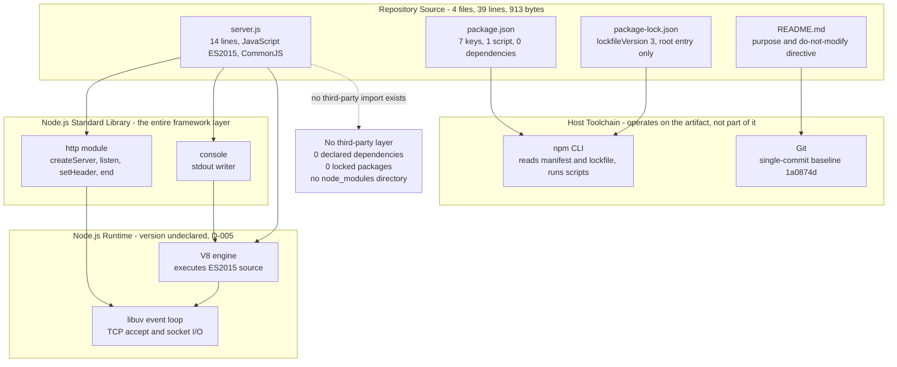
```mermaid
flowchart TB
    subgraph RepoLayer["Repository Source - 4 files, 39 lines, 913 bytes"]
        SRV["server.js<br/>14 lines, JavaScript ES2015, CommonJS"]
        PKG["package.json<br/>7 keys, 1 script, 0 dependencies"]
        LOCK["package-lock.json<br/>lockfileVersion 3, root entry only"]
        DOC["README.md<br/>purpose and do-not-modify directive"]
    end

    subgraph StdLibLayer["Node.js Standard Library - the entire framework layer"]
        HTTPMOD["http module<br/>createServer, listen, setHeader, end"]
        CONSOLEMOD["console<br/>stdout writer"]
    end

    subgraph RuntimeLayer["Node.js Runtime - version undeclared, D-005"]
        V8ENGINE["V8 engine<br/>executes ES2015 source"]
        LIBUVLOOP["libuv event loop<br/>TCP accept and socket I/O"]
    end

    subgraph ToolLayer["Host Toolchain - operates on the artifact, not part of it"]
        NPMCLI["npm CLI<br/>reads manifest and lockfile, runs scripts"]
        GITVCS["Git<br/>single-commit baseline 1a0874d"]
    end

    NOTHIRD["No third-party layer<br/>0 declared dependencies<br/>0 locked packages<br/>no node_modules directory"]

    SRV --> HTTPMOD
    SRV --> CONSOLEMOD
    SRV --> V8ENGINE
    HTTPMOD --> LIBUVLOOP
    CONSOLEMOD --> V8ENGINE
    V8ENGINE --> LIBUVLOOP
    PKG --> NPMCLI
    LOCK --> NPMCLI
    DOC --> GITVCS
    SRV -.->|no third-party import exists| NOTHIRD
```

The diagram makes the load-bearing point visible: there is no layer between the repository source and the Node.js standard library. Every arrow leaving `server.js` terminates inside the runtime.

### 3.2.3 Supporting Libraries and the Roles They Would Otherwise Fill

For a conventional HTTP service, the following concerns are normally delegated to libraries. In this repository each is either satisfied by a standard-library primitive or genuinely absent:

| Concern | What Fills It Here | Evidence |
|---|---|---|
| HTTP server | Node core `http` module | `server.js` line 1, 6, 12 |
| Routing and method dispatch | Nothing — every request receives the same response | F-002-RQ-001; zero `req.url`/`req.method` matches |
| Middleware, body parsing, CORS, compression | Nothing — the request is never read | F-002-RQ-004; section 1.3.2.1 excludes these |
| Response serialisation or templating | Nothing — a string literal is passed to `res.end` | `server.js` line 9 |
| Input validation | Nothing — validation is deliberately not performed | F-002-RQ-004 validation rules |
| Logging | `console.log`, invoked exactly once | F-003-RQ-001, F-003-RQ-003 |
| Configuration management | Two in-source `const` literals | F-001-RQ-003; zero `process.env` matches |
| Authentication and authorisation | Nothing — all callers are anonymous and indistinguishable | F-002-RQ-001 validation rules |
| Test framework and assertion library | Nothing — a shell `echo` and `exit 1` placeholder | F-007; D-003 |
| Type system | Nothing — no TypeScript, no `types`/`typings` field | section 3.1.5 |
| Build, bundling, transpilation | Nothing — no build step exists | section 1.3.1.1 |
| Process management, clustering, restart supervision | Nothing — a single process with no `cluster` usage | section 1.3.2.1 |
| Metrics, tracing, health endpoints | Nothing — no instrumentation of any kind | section 1.2.3.3 |

### 3.2.4 Compatibility Requirements

Because there is no library layer, there is no inter-library compatibility matrix to manage. `package.json` declares no `peerDependencies`, no `optionalDependencies`, and no `overrides`, so no version-resolution conflict can arise, and `npm outdated` returns empty output with exit code 0 — there is nothing that can drift. The compatibility surface reduces to the runtime and toolchain requirements below.

| Requirement | Floor or Value | Why It Binds |
|---|---|---|
| CommonJS module loader | Required | `server.js` line 1 uses `require`; no `"type"` field exists (assumption A-001) |
| ECMAScript 2015 syntax support | Required | `const`, arrow functions, and template literals are used; nothing newer is |
| Standard-library `http` with the classic callback API | Required | `http.createServer`, `server.listen`, `res.setHeader`, `res.end` on lines 6–12 |
| npm able to read `lockfileVersion: 3` | The v3 format is written by npm v9 and above and, per npm's own bundled documentation, is backwards compatible to npm v7 | Assumption A-005 and the manifest-compatibility requirement in section 1.3.1.1; the file carries no legacy top-level `dependencies` block, so an older CLI would find nothing usable |
| POSIX-style shell providing `echo` and `exit` | Required only to invoke `npm test` | F-007-RQ-001 |
| TCP port 3000 free on the loopback interface | Required at bind time | Assumption A-002; contention terminates the process with exit code 1 (F-001-RQ-004) |
| Native compilation toolchain (`node-gyp`, C++ compiler) | **Not** required | Zero dependencies means no native add-on can be built or loaded |
| Network access to a package registry | **Not** required | `npm ci --offline` and `npm install --offline` both complete with exit code 0 |

### 3.2.5 Justification for the Zero-Framework Design

The framework decision is not documented anywhere in the repository, so the justification below is derived from the properties the design actually delivers.

| Property Delivered | Why the Absence of a Framework Produces It |
|---|---|
| Byte-level determinism | With no middleware chain, no content negotiation, and no framework-supplied error pages, the response cannot vary — one signature across 50 sequential, 20 concurrent, and eight method variants (F-002-RQ-005) |
| Zero supply-chain surface | Nothing is downloaded, so no integrity hash, provenance check, or CVE feed applies; `npm audit` reports zero vulnerabilities across a single audited package (F-005-RQ-002) |
| Offline, no-op installation | A framework would make install a network operation; here `npm ci` completes in about 120 ms without creating `node_modules` |
| Committed source equals executed source | No framework build, code generation, or decorator transform sits between the file and the process |
| Complete auditability | The whole implementation is 14 lines with a seven-call standard-library surface, which is why section 2.2.1.2 rates every requirement Low complexity |
| Attribution of failures to the consumer | Because the subject has no framework behaviour of its own to misconfigure, an anomaly observed by consuming tooling isolates to that tooling — the fixture rationale in section 1.1.2 |

The cost of the decision is equally concrete and is documented as excluded scope in section 1.3.2.1 rather than as a defect: there is no routing, no error handling (no `'error'` listener and no `try`/`catch` anywhere), no graceful shutdown, no TLS, no rate limiting, and no security headers. For a fixture whose contract is invariance, those omissions are the point; for any other purpose they are disqualifying, which is why section 1.3.2.4 lists production and CI-gate usage as unsupported.

### 3.2.6 Frameworks Explicitly Probed For and Found Absent

Every marker below was searched for across all tracked files, case-insensitively, and returned **zero matches**:

| Category | Candidates Probed | Result |
|---|---|---|
| Node.js web frameworks | `express`, `fastify`, `koa`, `hapi`, `nest`, `next` | Absent |
| Front-end frameworks | `react`, `vue`, `angular`, `svelte`, `jquery` | Absent |
| CSS frameworks | `tailwind` | Absent |
| Utility and HTTP-client libraries | `lodash`, `axios`, `socket.io` | Absent |
| API layers | `graphql`, `apollo` | Absent |
| Python frameworks | `flask`, `django`, `fastapi` | Absent |
| AI / LLM frameworks | `langchain` | Absent |
| Desktop, mobile, native toolkits | `electron`, `swift`, `kotlin` | Absent |

A conventional default stack for a system of this description would specify Flask on the backend, React with TypeScript and TailwindCSS on the web, React Native for mobile, and Langchain for AI orchestration. **None of those technologies is present in this repository**, and constraint C-001 forbids introducing them. They are recorded here as verified absences so that no reader mistakes an assumed default for an observed dependency.


## 3.3 Open Source Dependencies

**The open-source dependency set is empty.** No third-party package is declared, locked, vendored, or installed. This subsection documents the evidence for that claim, the lockfile that asserts it, the registry configuration that is never exercised, and the security and licensing consequences — which are unusual precisely because the set is empty rather than merely small.

### 3.3.1 Declared Dependency Inventory

`package.json` contains exactly seven top-level keys, none of which carries dependency information. Every dependency-bearing field defined by the npm manifest schema was probed for programmatically and is absent:

| Manifest Field | Declared Entries | Status |
|---|---|---|
| `dependencies` | 0 | Field absent from the manifest (F-004-RQ-003) |
| `devDependencies` | 0 | Field absent |
| `peerDependencies` | 0 | Field absent |
| `optionalDependencies` | 0 | Field absent |
| `bundleDependencies` | 0 | Field absent |
| `overrides` | 0 | Field absent — no resolution can be forced or patched |
| `workspaces` | 0 | Field absent — not a monorepo root |

The corresponding runtime evidence agrees: the repository contains exactly one `require()` call, and it resolves the Node.js core module `http` (section 3.2.1). `npm ls` prints `hello_world@1.0.0` followed by `└── (empty)`, and `npm ls --all --json` emits no `dependencies` key at all. **The dependency graph is one node — the root package itself — with depth 0 and zero edges.**

### 3.3.2 Lockfile Structure and Schema Version

`package-lock.json` is 13 lines and 247 bytes. Its top-level keys are exactly `name`, `version`, `lockfileVersion`, `requires`, and `packages`:

```json
"lockfileVersion": 3,
"requires": true,
"packages": { "": { "name": "hello_world", "version": "1.0.0", "license": "MIT" } }
```

| Lockfile Element | Value | Significance |
|---|---|---|
| `lockfileVersion` | `3` (numeric) | Modern schema; the file carries **no** legacy top-level `dependencies` block, which is the defining characteristic of v3 |
| `requires` | `true` | Standard flag written by npm for lockfiles that track the manifest's requirement set |
| `packages` | Exactly one key, `""` | The root project only; **no third-party package record exists** (F-005-RQ-001) |
| Root record fields | `name`, `version`, `license` | `hello_world`, `1.0.0`, `MIT` — mirroring `package.json` exactly (F-005-RQ-003) |

**Compatibility floor.** According to the `package-lock.json` manual page bundled with the installed npm CLI, `lockfileVersion: 3` is the format used by npm v9 and above and is backwards compatible to npm v7; version 2 was used by npm v7 and v8, and version 1 by npm v5 and v6. Because this file omits the v1-compatibility block entirely, an npm older than v7 would find nothing usable in it. That is exactly the constraint registered as assumption A-005 in section 2.4.6 and listed as a key technical requirement in section 1.3.1.1. Measured behaviour confirms the format is stable in place: npm 11.18.0 read the file for `ls`, `ci`, `install`, and `audit`, and its MD5 digest was **unchanged** afterwards — npm neither rewrote nor migrated it.

**Why an empty lockfile is present at all.** Shipping a lockfile that locks nothing is a deliberate assertion rather than an oversight. `npm ci` refuses to run without a lockfile, so its presence is what lets consuming automation use the strict, reproducible install path and still get a no-op. Section 2.1.7 makes the same point from the feature perspective.

### 3.3.3 Package Registry Configuration

| Attribute | Observed Value | Provenance |
|---|---|---|
| Effective registry | `https://registry.npmjs.org/` | npm's built-in default (`npm config get registry`) |
| Repository-level `.npmrc` | Absent | No `.npmrc` at the repository root |
| User- and global-level npm configuration | Absent | No `.npmrc` in the user home directory and none at `/usr/etc/npmrc`, `/etc/npmrc`, or npm's built-in config path |
| Registry authentication | None configured | No `_authToken`; `always-auth` undefined; `npm config list` reports no non-default entries |
| Scoped registries or mirrors | None | No configuration file exists in which to declare one |

The registry is therefore a **latent default that is never contacted**. Both `npm ci --offline` and `npm install --offline` complete with exit code 0, proving that no registry round-trip is required for any supported workflow. Combined with the absence of credentials anywhere in the repository (a sweep for `token`, `secret`, `password`, `credential`, and `api key` returns zero matches), there is no registry authentication surface to protect.

**Alternate package managers.** No `yarn.lock`, `pnpm-lock.yaml`, or `bun.lockb` exists, and `package.json` declares no `packageManager` field. npm is the only package manager the repository is configured for, and nothing contradicts the single lockfile — consistent with the alternate-lockfile exclusion recorded in section 1.3.2.

### 3.3.4 Measured Install, Audit, and Drift Behaviour

All measurements below were executed against an unmodified copy of the repository under Node.js 22.23.1 and npm 11.18.0, honouring the do-not-modify directive of F-006 by leaving the tracked checkout byte-identical.

| Command | Observed Result | Exit Code |
|---|---|---|
| `npm ls` | `hello_world@1.0.0` then `└── (empty)` | 0 |
| `npm ls --all --json` | No `dependencies` key; dependency count 0 | 0 |
| `npm ci` | "up to date" in roughly 120 ms; **`node_modules` not created** | 0 |
| `npm ci --offline` | Completes without any network access | 0 |
| `npm install --offline` | Completes without any network access | 0 |
| `npm audit` | "found 0 vulnerabilities" across a single audited package | 0 |
| `npm outdated` | Empty output — nothing can drift | 0 |
| `npm run` (script listing) | Only the `test` lifecycle script exists | 0 |

Two results deserve emphasis because they are counter-intuitive for anyone expecting a normal Node.js project. First, a successful `npm ci` leaves **no `node_modules` directory** — there is nothing to place in one, which is the tolerance requirement registered as assumption A-004 in section 2.4.6. Second, the lockfile's digest is identical before and after install, so repeated installs are provably idempotent at the file level.

### 3.3.5 Licensing Posture

| Aspect | Finding |
|---|---|
| Declared license | `MIT`, stated in `package.json` line 10 and duplicated in the `package-lock.json` root record |
| License text file | **None.** No `LICENSE`, `LICENCE`, `COPYING`, or `NOTICE` file is tracked — the declaration exists only as a metadata string |
| Inbound third-party license obligations | **None.** With zero installed packages there is no attribution list to maintain, no copyleft exposure, and no license-compatibility analysis to perform |
| Attribution requirements imposed on consumers | Governed solely by the MIT declaration; no `THIRD-PARTY-NOTICES` artifact is required because no third-party code is redistributed |

The missing license text is a documentation gap rather than a technical one, and it is consistent with the broader absence of governance artifacts noted in section 2.1.8 (no `CONTRIBUTING.md`, no `CODEOWNERS`, no `.gitignore`).

### 3.3.6 Supply-Chain Security Implications

An empty dependency graph eliminates most of the supply-chain risk categories that would otherwise apply to a Node.js project. The table records exposure and the basis for each assessment:

| Risk Category | Exposure | Basis |
|---|---|---|
| Transitive vulnerabilities | None | `npm audit` audits one package and reports zero vulnerabilities |
| Typosquatting and dependency confusion | None | No package name is ever resolved against a registry |
| Malicious install scripts | None | No dependencies exist to run lifecycle hooks, and `scripts` contains only `test` — there is no `preinstall`, `postinstall`, or `prepare` hook |
| Artifact integrity and provenance | Not applicable | Nothing is downloaded, so no integrity hash or provenance attestation is consulted |
| Registry availability as a single point of failure | Eliminated | Offline install succeeds with exit code 0 |
| Version drift between environments | None | `npm outdated` is empty and the lockfile digest is stable across installs |
| Lockfile tampering | Confined to the root record | The only lockable data is the root identity; a mismatch against `package.json` would cause `npm ci` to fail, which is what makes F-004-RQ-004 verifiable |
| Credential exposure via registry configuration | None | No `.npmrc` and no auth token exist at any configuration level |

**Residual risk lies outside the dependency graph.** The one unmanaged version surface is the runtime itself: because the repository declares no `engines` range (D-005), responsibility for running a patched Node.js build rests entirely with the consumer, and no repository artifact records or warns about it. Section 3.1.3 bounds the resulting exposure with measured negatives; the point here is simply that a zero-dependency posture removes the package supply chain from consideration but does not remove the runtime supply chain.


## 3.4 Third-Party Services

**The system integrates with no third-party service.** It calls no external API, delegates to no identity provider, reports to no monitoring backend, and consumes no cloud service. Every claim in this subsection rests on an exhaustive census of the four tracked files rather than on the absence of an integration document.

### 3.4.1 External APIs and Outbound Integrations

The `http` module is used exclusively in **server mode**. A case-insensitive sweep across all tracked files returned zero matches for every outbound-call and messaging marker probed:

| Category | Markers Probed | Result |
|---|---|---|
| HTTP clients | `fetch(`, `http.request`, `http.get`, `https.request`, `XMLHttpRequest` | Zero matches |
| Raw sockets and name resolution | `net.connect`, `dns` | Zero matches |
| Streaming and RPC | `WebSocket`, `grpc` | Zero matches |
| Message brokers and queues | `amqp`, `kafka`, `mqtt`, `nats`, `sqs`, `sns`, `pubsub` | Zero matches |
| Event delivery | `webhook` | Zero matches |

A complete census of network literals is decisive on this point. Searching every tracked file for URL schemes, dotted-quad addresses, and the `.com`, `.io`, `.net`, and `.org` top-level domains returns **exactly two lines, both in `server.js`**: the loopback bind constant on line 3 and the self-referential URL interpolated into the startup message on line 13. There is no external hostname, domain, endpoint, base URL, API path, or third-party address anywhere in the repository. Because there is also no `process.env` usage and no configuration file, no endpoint can be injected at runtime either (F-001-RQ-003).

The practical consequence is that the process has **no egress path**. There is no channel through which request data could be forwarded, no telemetry beacon, and no update or licence check.

### 3.4.2 Authentication and Identity Services

No authentication or authorisation technology of any kind is present. Markers probed with zero matches include `auth0`, `okta`, `oauth`, `jwt`, `passport`, and `bcrypt`, alongside the credential-material terms `token`, `secret`, `password`, `credential`, and `api key`.

| Aspect | Finding |
|---|---|
| Identity provider | None — no federation, no OIDC or SAML flow, no client registration |
| Credential storage | None — no `.env`, no `.npmrc`, no secret of any kind in any tracked file |
| Request-level authentication | None — the request object is never read, so no header, cookie, or bearer token can be evaluated (F-002-RQ-004) |
| Session or state management | None — the handler is stateless and no session store exists |
| Caller identity | All callers are anonymous and indistinguishable, as recorded in the F-002-RQ-001 validation rules |

Auth0 — the identity service a conventional default stack would specify — is **not present and not applicable**. The only access control in the system is network-level: the listener binds `127.0.0.1`, so it is unreachable from any non-loopback interface (F-001-RQ-002, constraint C-002).

### 3.4.3 Monitoring, Logging, and Observability Services

No monitoring, APM, tracing, or log-aggregation client exists. Markers probed with zero matches: `sentry`, `datadog`, `newrelic`, `prometheus`, `opentelemetry`, `statsd`, `winston`, `pino`, and `bunyan`.

| Observability Concern | What Exists |
|---|---|
| Application logging | A single `console.log` call on `server.js` line 13, emitted once per process (F-003-RQ-001, F-003-RQ-003) |
| Error reporting | None. No `'error'` listener and no `try`/`catch`; a bind conflict produces Node's default stack trace on standard error and exit code 1 (F-001-RQ-004) |
| Metrics and tracing | None — no instrumentation, no exporter, no sampling configuration (section 1.2.3.3) |
| Health and readiness endpoints | None distinguishable from the default response; the startup log line is the only readiness signal (section 2.1.5) |
| Log shipping and retention | None — the only sink is the process's standard output stream |

Any observability over this system must therefore be supplied entirely by the consuming harness: capturing the process's standard output for readiness, and probing the loopback endpoint externally for liveness. No performance target, SLO, timeout, or rate limit exists in the repository from which a monitoring threshold could be derived — section 2.2.1.3 records that absence explicitly.

### 3.4.4 Cloud Services and Infrastructure Platforms

| Platform Category | Markers or Artifacts Probed | Result |
|---|---|---|
| AWS | `aws`, `s3`, `sqs`, `sns`, `dynamo` | Zero matches; no SDK, no client, no bucket or table reference |
| Azure and Google Cloud | `azure`, `gcp`, `google` | Zero matches |
| Infrastructure as code | Terraform, CloudFormation, Pulumi configuration files | None present anywhere in the repository |
| Container platform artifacts | `Dockerfile`, `docker-compose.yml`, `.dockerignore` | None present |
| Serverless or PaaS descriptors | `Procfile`, `serverless.yml`, app manifests | None present |

Neither `docker` nor `terraform` is even installed in the environment used to verify this specification, which is consistent with the repository requiring neither. More fundamentally, the loopback-only bind means the service cannot be exposed by any cloud networking construct without editing `server.js` — and constraint C-001 forbids that edit. AWS, the cloud platform a conventional default stack would specify, is **not present and not applicable**.

### 3.4.5 The Integration Surfaces That Do Exist

Rather than third-party services, the system has a small number of primitive integration surfaces. This is the complete set:

| Surface | Direction | Mechanism | Reach |
|---|---|---|---|
| HTTP listener on `127.0.0.1:3000` | Inbound | Node `http` server created at `server.js` line 6, bound at line 12 | Host-local only; refused on every non-loopback interface |
| Standard output | Outbound | One `console.log` line at `server.js` line 13 | Host-local; captured by whichever process launched the server |
| Standard error | Outbound, failure path only | Node's default unhandled-`'error'` handling on bind conflict | Host-local; produced only when port 3000 is already bound |
| `package.json` and `package-lock.json` | Tooling | Read by the npm CLI for identity, scripts, and install (F-004, F-005) | Local filesystem; no registry contact occurs |
| Git version control and hosting | Ecosystem | Single-commit baseline `1a0874d` on branch `main`, with an HTTPS origin remote on GitHub | External to the running process; not a runtime dependency |

Two clarifications about the ecosystem-level relationships:

- **"Backprop" is a consumer, not a service the system calls.** `README.md` line 2 names it as the integration context for which the fixture exists (F-006-RQ-001), and it is the only external party named anywhere in the repository. The relationship is inbound and one-directional: that tooling exercises the fixture. Section 1.2.1.3 characterises this as an ecosystem-level integration rather than a code-level one, and nothing in `server.js` is aware of it.
- **GitHub hosting is not an application dependency.** The repository has an HTTPS origin remote on GitHub, which is how the artifact is distributed and how the immutability evidence for F-006-RQ-003 is established. The running process never contacts it.

**Security consequence of having no third-party integrations.** There are no external trust relationships to manage, no third-party credentials to rotate or leak, no vendor availability coupled to the fixture's behaviour, and — because there is no egress path at all — no channel through which data could be exfiltrated even if the process were compromised. The sole trust boundary in the entire system is the loopback socket, and it is enforced by the bind address rather than by any service.

### 3.4.6 Default-Stack Services Explicitly Not Applicable

| Conventional Default Service | Role It Would Play | Status in This Repository |
|---|---|---|
| AWS | Cloud platform and managed infrastructure | Absent — no SDK, no IaC, no deployment descriptor |
| Auth0 | Authentication and identity | Absent — no auth of any kind; callers are anonymous |
| Monitoring and APM backends | Metrics, tracing, error reporting | Absent — telemetry is one stdout line |
| Langchain and LLM provider APIs | AI orchestration | Absent — zero matches for any AI or LLM marker |
| Managed database and cache services | Persistence and caching | Absent — see section 3.5 |

Every entry above was probed for directly and found absent. Introducing any of them would require modifying repository content, which constraint C-001 prohibits and which would invalidate the fixture's role as a fixed reference baseline (F-006).


## 3.5 Databases and Storage

**The system has no database, no persistence layer, no cache, and no storage service.** Statelessness is not a design aspiration here — it is a mechanical property of a 14-line program that imports nothing but `http`, declares four immutable bindings, and performs exactly one property write per request.

### 3.5.1 Primary and Secondary Databases

No database technology of any kind appears in the repository. Every marker below was probed case-insensitively across all tracked files with zero matches:

| Category | Markers Probed | Result |
|---|---|---|
| Document stores | `mongo`, `mongoose`, `cassandra`, `dynamo` | Zero matches |
| Relational databases and drivers | `postgres`, `pg`, `mysql`, `sqlite` | Zero matches |
| ORMs and query builders | `prisma`, `sequelize`, `typeorm`, `knex` | Zero matches |
| Search engines | `elastic` | Zero matches |

There is correspondingly no schema, no migration directory, no seed data, and no fixture file — `git ls-files` confirms that only `.js`, `.json`, and `.md` files are tracked, so no data artifact of any kind exists. There is also no connection string to find: the complete network-literal census reported in section 3.4.1 returned exactly two lines, both referring to the loopback listener itself.

**MongoDB** — the database a conventional default stack would specify — is **not present and not applicable**. Neither a primary nor a secondary datastore exists, so questions of replication, sharding, read replicas, and failover do not arise.

### 3.5.2 Data Persistence Strategy

The persistence strategy is that **nothing is persisted**. Each mechanism by which data could be retained was examined:

| Potential Persistence Mechanism | Finding |
|---|---|
| Filesystem I/O | The `fs` module is never imported. Sweeps for `fs.`, `path.`, `readFile`, `writeFile`, `createReadStream`, `createWriteStream`, `mkdir`, `unlink`, and `os.tmpdir` all return zero matches |
| Working directories | No `data/`, `storage/`, `logs/`, `var/`, `tmp/`, `dist/`, or `build/` directory exists in the checkout, and `node_modules` is never created |
| Module-level mutable state | **None.** All four bindings in `server.js` are `const` |
| Per-request state | One property write, `res.statusCode = 200`, on a response object owned by the runtime and discarded when the response completes |
| Request data retention | None. The request object is never dereferenced (F-002-RQ-004) and nothing about a request is logged (F-003-RQ-003) |
| Session or cookie state | None. No `session` or cookie handling exists anywhere |

The mutable-state census is small enough to state exhaustively. `server.js` contains exactly six lines with an `=` character: four `const` initialisations (lines 1, 3, 4, 6), the arrow-function token on line 12, and the single assignment `res.statusCode = 200` on line 7. **Nothing in the program accumulates across requests**, which is the mechanical reason the invariance measured under repetition and concurrency in F-002-RQ-005 holds rather than being merely likely.

**Data domains.** The only datum the system handles is the 14-byte greeting payload compiled into line 9 as a string literal. No personal, regulated, financial, or business data is read, stored, transmitted, or logged — consistent with the data-domain boundary recorded in section 1.3.1.2.

### 3.5.3 Caching

No caching layer exists at any tier.

| Cache Tier | Finding |
|---|---|
| External cache service | No `redis` or `memcache` client; markers return zero matches |
| In-process cache structure | No `Map(`, `Set(`, `WeakMap`, `globalThis`, or `global.` usage; zero matches for `cache` |
| HTTP response cache directives | Repository code sets exactly one header, `Content-Type` (F-002-RQ-002), so no `Cache-Control`, `ETag`, `Last-Modified`, or `Vary` directive is emitted; the only other headers on the wire are Node's defaults (C-004) |
| Build or dependency cache | Not applicable — there is no build step and no dependency to cache |

Caching would serve no purpose here: the response payload is a compiled-in literal returned by a single `res.end` call, so there is no computation, query, or I/O whose result could be reused.

### 3.5.4 Object, File, and Blob Storage

| Storage Category | Finding |
|---|---|
| Object storage services | Zero matches for `s3`, `azure`, `gcp`, or any bucket or container reference |
| Static asset serving | No `public/`, `assets/`, or `static/` directory exists; the response body is a literal, not a file read |
| File upload or download handling | None — the request body is never read, and no multipart or stream handling exists |
| Mounted volumes or persistent disks | Not applicable — no container or orchestration artifact exists (section 3.6) |
| Tracked binary assets | None — every tracked file is `.js`, `.json`, or `.md` |

### 3.5.5 The State That Genuinely Exists

For completeness, the following is the full inventory of state associated with a running instance. All of it is ephemeral, and most of it belongs to the runtime rather than to repository code:

| State Element | Scope | Lifetime | Owner |
|---|---|---|---|
| Listening TCP socket on `127.0.0.1:3000` | OS kernel and libuv | Process lifetime; released by the OS on exit | Node.js runtime |
| Accepted connection sockets and keep-alive timers | Runtime | Per connection, governed by Node's default keep-alive behaviour | Node.js runtime (C-004) |
| `http`, `hostname`, `port`, `server` bindings | Module scope | Process lifetime; immutable | `server.js` lines 1, 3, 4, 6 |
| `res.statusCode` write | Single response object | One request | Runtime-owned object, set by `server.js` line 7 |
| The startup log line | External to the process | As long as the capturing consumer retains it | Whichever process captured standard output |

**Data at rest: none.** Nothing is written to any durable medium, so there is no encryption-at-rest requirement, no backup or retention policy to define, and no data-residency consideration. **Data in transit: plaintext HTTP over the loopback interface only.** No TLS exists — the `https` module is never imported and no certificate material is present — but the traffic never leaves the host, since off-host reachability is refused at the socket level (F-001-RQ-002, C-002).

A direct operational consequence is that **restarting the process loses nothing and changes nothing**. There is no state to migrate, warm, drain, or reconcile, which is why section 1.3.2.1 can exclude graceful shutdown without introducing a data-loss risk.

### 3.5.6 Default-Stack Storage Technologies Not Applicable

| Conventional Default Technology | Role It Would Play | Status in This Repository |
|---|---|---|
| MongoDB | Primary database | Absent — no driver, ODM, schema, or connection string |
| Redis or Memcached | Cache and session store | Absent — no client and no in-process cache |
| AWS S3 or equivalent | Object and blob storage | Absent — no SDK, bucket reference, or asset directory |
| Managed relational database | Secondary or reporting store | Absent — no SQL driver or migration tooling |

Each of these was probed for explicitly and found absent. Adding any of them would require modifying repository content, which constraint C-001 prohibits.


## 3.6 Development and Deployment

The development and deployment toolchain is deliberately minimal: there is no build system, no containerisation, no continuous-integration definition, and no code-quality tooling. What remains is a runtime, a package manager whose only job is to read two manifests, and version control. This subsection documents what is required, what is measurably absent, and what any consuming pipeline must therefore tolerate.

### 3.6.1 Development Tooling

**Tools actually required.** Versions shown are those used for every measurement in this specification; only the capability, not the version, is required by the repository (D-005).

| Tool | Version Measured | Role | Necessity |
|---|---|---|---|
| Node.js | 22.23.1 | Executes `server.js`; supplies the `http` module and the CommonJS loader | Required for any use of the system |
| npm CLI | 11.18.0 | Reads `package.json` and `package-lock.json`; runs `test`; resolves the implicit `start` | Required only for npm-driven workflows |
| Git | present at `/usr/bin/git` | Obtains the artifact and verifies the single-commit baseline for F-006-RQ-003 | Required to establish the immutability evidence |
| POSIX-style shell | `sh` and `bash` present | Executes the `scripts.test` one-liner | Required only to invoke `npm test` |
| HTTP client | `curl` present | Exercises the endpoint | Not required by the repository; used for verification only |

**Code-quality and developer-experience tooling — verified absent.** Each of the following was probed for as a configuration file in the repository and, where relevant, as an executable in the environment:

| Tooling Category | Configuration Probed | Result |
|---|---|---|
| Linting | `.eslintrc`, `.eslintrc.json`, `.eslintrc.js`, `eslint.config.js` | None present; `eslint` not installed |
| Formatting | `.prettierrc`, `.prettierrc.json`, `.editorconfig` | None present; `prettier` not installed |
| Type checking | `tsconfig.json`, `jsconfig.json`, `types`/`typings` manifest fields | None present; `tsc` not installed |
| Test runner | Jest, Mocha, or any runner configuration; `test/`, `tests/`, `__tests__/`, `spec/` directories | None present; `jest` and `mocha` not installed |
| Pre-commit automation | `.husky/`, active Git hooks | None present; `.git/hooks` holds only the 14 default `.sample` templates — zero active hooks |
| Editor and workspace settings | `.vscode/`, `.idea/`, `.gitattributes`, `.gitignore` | None present |

`npm run` confirms the script surface from the tool's own perspective: the only lifecycle script declared is `test`. There is no `lint`, `format`, `build`, `dev`, `watch`, or `start` script, and no `pre`/`post` hook of any kind.

### 3.6.2 Build System

**There is no build system, and none is required.** The repository is not a project that produces an artifact; the tracked tree *is* the artifact.

| Conventional Build Stage | Status in This Repository |
|---|---|
| Dependency installation | A no-op. `npm ci` exits 0 in roughly 120 ms and creates no `node_modules` (section 3.3.4) |
| Transpilation | Not applicable. `server.js` uses only ES2015 syntax, which the runtime executes directly; no Babel, SWC, or `tsc` configuration exists |
| Bundling | Not applicable. No Webpack, Rollup, Vite, esbuild, or Parcel configuration exists; the module graph is a single node |
| Minification and asset pipeline | Not applicable. No minifier, no CSS or image processing, no `public/` directory |
| Native compilation | Not applicable. With zero dependencies, no `node-gyp` invocation or C++ toolchain is reachable |
| Artifact packaging and publication | None declared. `package.json` has no `files` allowlist, no `publishConfig`, no `repository` field, and no `private` flag; distribution is via the Git repository rather than a registry publish |

This is what makes section 1.3.1.1's "no installation, build, transpile, or bundling step" requirement verifiable rather than rhetorical, and it is why `make`, absent from the verification environment, is not needed.

### 3.6.3 Launch, Readiness, and Termination

All behaviours below were measured directly against an unmodified copy of the repository.

| Invocation | Mechanism | Measured Outcome |
|---|---|---|
| `node server.js` | Direct runtime invocation | Binds the listener and prints the startup line; serves `200` with a 14-byte `text/plain` body |
| `npm start` | **npm's built-in default**, not a declared script — npm falls back to `node server.js` because a `server.js` exists at the package root and no `start` script is declared | Printed `> hello_world@1.0.0 start` then `> node server.js`, bound the listener, and served normally (deviation D-004) |
| `npm test` | Runs the `scripts.test` shell one-liner | Prints `Error: no test specified` and exits **1** (deviation D-003, F-007-RQ-001) |
| `require('hello_world')` | Resolves the manifest `main` field | Fails with `MODULE_NOT_FOUND` because `index.js` does not exist (deviation D-001, constraint C-005) |
| `npm ci` / `npm install` | Lockfile-driven and manifest-driven install | Exit 0, offline-capable, no `node_modules` created |

**Readiness.** The single line `Server running at http://127.0.0.1:3000/` on standard output is the only readiness signal the system emits (F-003-RQ-001). There is no health or readiness endpoint distinguishable from the default response, so automation must either synchronise on that exact string or poll the loopback endpoint.

**Termination.** No `SIGTERM` or `SIGINT` handler exists, so termination is immediate with no connection draining and no shutdown output; the operating system releases the port on exit. Because section 3.5 establishes that nothing is persisted, abrupt termination carries no data-loss risk.

**Instance cardinality.** Exactly one instance can run per host. A second bind attempt on `127.0.0.1:3000` produces an unhandled `'error'` event — `EADDRINUSE`, errno −98, syscall `listen` — a stack trace on standard error, and process exit code 1 (F-001-RQ-004, assumption A-002). Consuming automation must therefore serialise its use of port 3000 rather than relying on any retry or port-fallback behaviour, because neither exists.

**Configuration at deploy time: none.** There is no environment-variable surface (zero `process.env` matches), no CLI-argument handling (zero `process.argv` matches), no configuration file, and no `.env`. The bind target and payload are in-source literals (F-001-RQ-003), which is registered as constraint C-003. Deployment cannot be parameterised without editing the source, and constraint C-001 forbids that edit.

### 3.6.4 Containerisation

No containerisation artifact exists anywhere in the repository: no `Dockerfile`, no `Dockerfile.dev`, no `docker-compose.yml` or `.yaml`, and no `.dockerignore`. There is likewise no Kubernetes manifest, Helm chart, or other orchestration descriptor, and no infrastructure-as-code definition of any kind. Neither `docker` nor `terraform` is installed in the verification environment, consistent with the repository requiring neither.

One consequence is worth stating explicitly for anyone who might wrap the repository externally. Because the listener binds `127.0.0.1` rather than a wildcard address (C-002), an unmodified container built around this repository would expose the service **only within its own network namespace** — a published port mapping would not reach it. Making the fixture reachable from outside a container would require changing the bind address in `server.js`, which constraint C-001 prohibits. Containerisation is recorded as excluded scope in section 1.3.2 rather than as a gap to be filled.

### 3.6.5 Continuous Integration and Delivery

**No CI/CD definition exists.** All of the following paths were tested for and are absent: `.github/` (and therefore any workflow file), `.gitlab-ci.yml`, `Jenkinsfile`, `.travis.yml`, `azure-pipelines.yml`, `.circleci/`, `Makefile`, and `Procfile`. There are no active Git hooks and no `CODEOWNERS` file, so nothing inside the repository enforces the immutability directive of F-006 — enforcement is by convention only, as section 2.1.8 records.

Because there is no pipeline, the relevant engineering content is what a *consuming* pipeline must accommodate. Each item below follows from a measured behaviour:

| Pipeline Stage | Behaviour Against This Repository | Required Accommodation |
|---|---|---|
| Checkout | Single commit `1a0874d` on branch `main`; clean working tree; no tags | Verifying the baseline is a `git status --porcelain` emptiness check (F-006-RQ-003) |
| Install | `npm ci` exits 0 in roughly 120 ms, works offline, creates no `node_modules` | Must not assert that `node_modules` exists (assumption A-004) |
| Build | No build step exists | Must not require a build target or emit-directory |
| Lint / type check | No configuration exists for any tool | Must not require a lint or type-check stage |
| Test | `npm test` exits **1** by design | Must skip the test stage or explicitly tolerate exit 1; section 1.3.2.4 records CI-gate usage as an unsupported use case (D-003) |
| Start / smoke test | `npm start` works only through npm's implicit default | Must not assume a declared `start` script exists (D-004) |
| Audit | `npm audit` reports zero vulnerabilities across one audited package | Safe to run; will never gate |
| Package / publish | No packaging metadata or publish configuration | No release stage is meaningful |

The net effect is that a conventional pipeline template — install, lint, build, test, publish — fails at the test stage against this repository and has nothing to do at three of the other four. GitHub Actions, the CI system a conventional default stack would specify, is **not present**; the repository is hosted on GitHub, but no workflow definition accompanies it.

### 3.6.6 Source-to-Run Path

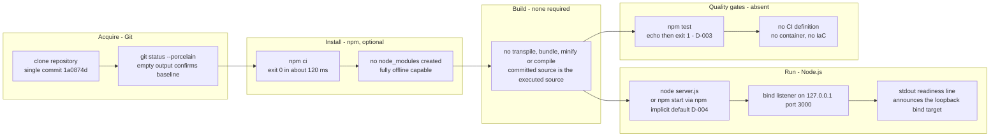
```mermaid
flowchart LR
    subgraph AcquireStage["Acquire - Git"]
        CLONE["clone repository<br/>single commit 1a0874d"]
        VERIFY["git status --porcelain<br/>empty output confirms baseline"]
    end

    subgraph InstallStage["Install - npm, optional"]
        CIRUN["npm ci<br/>exit 0 in about 120 ms"]
        NOMOD["no node_modules created<br/>fully offline capable"]
    end

    subgraph BuildStage["Build - none required"]
        NOOP["no transpile, bundle, minify or compile<br/>committed source is the executed source"]
    end

    subgraph RunStage["Run - Node.js"]
        LAUNCH["node server.js<br/>or npm start via npm implicit default D-004"]
        BIND["bind listener on 127.0.0.1 port 3000"]
        READY["stdout readiness line<br/>announces the loopback bind target"]
    end

    subgraph GateStage["Quality gates - absent"]
        TESTCMD["npm test<br/>echo then exit 1 - D-003"]
        NOPIPE["no CI definition<br/>no container, no IaC"]
    end

    CLONE --> VERIFY
    VERIFY --> CIRUN
    CIRUN --> NOMOD
    NOMOD --> NOOP
    NOOP --> LAUNCH
    LAUNCH --> BIND
    BIND --> READY
    NOOP --> TESTCMD
    TESTCMD --> NOPIPE
```

The diagram is deliberately lopsided: the acquire and run stages carry real, measured behaviour, while the install stage is a verified no-op, the build stage is empty, and the quality-gate stage terminates in absences. That shape is an accurate rendering of the toolchain rather than an omission.

### 3.6.7 Deployment Topology and Environment Requirements

| Requirement | Value | Source |
|---|---|---|
| Host operating system | Any on which a Node.js build runs; no `os` or `cpu` restriction is declared | `package.json` — fields absent |
| Runtime | A Node.js build providing CommonJS `require`, the `http` module, and ES2015 syntax | Derived in section 3.1.3; unpinned per D-005 |
| Network | TCP port 3000 free on the loopback interface | Assumption A-002; F-001-RQ-004 |
| Reachability | Loopback only; unreachable from any other interface | F-001-RQ-002; constraint C-002 |
| Instances per host | Exactly one | Duplicate bind terminates the process with exit code 1 |
| Filesystem | Read access to the four tracked files; no write access needed | Section 3.5.2 — no filesystem I/O occurs |
| Credentials and secrets | None required at any stage | Zero credential markers repository-wide; no `.npmrc` |
| Registry or internet access | Not required | `npm ci --offline` exits 0 |

Because there is no configuration surface, no persistence, and no external dependency, the deployment unit is a single short-lived process co-located with whatever exercises it. That topology is the direct consequence of the technology choices documented in sections 3.1 through 3.5, and it is what makes the artifact usable as the fixed reference baseline described in section 1.1.4.


## 3.7 References

Every technology claim in section 3 traces to one of the sources below. The repository's evidence set is closed: four tracked files totalling 39 lines and 913 bytes, with no subdirectories, so the inventory of examined files is necessarily complete.

### 3.7.1 Repository Files Examined

- `server.js` — the sole executable artifact and the entire basis for section 3.1 and 3.2. Established the JavaScript/CommonJS language determination (line 1), the ES2015 construct set (`const` on lines 3, 4, 6; arrow functions on lines 6 and 12; template literal on line 13), the complete seven-site Node.js standard-library API surface, the hardcoded loopback bind constants, the single-header response construction, the `console.log` readiness line, and the mutable-state census that grounds section 3.5.2.
- `package.json` — established package identity (`hello_world@1.0.0`, MIT), the exact seven top-level keys, the single `test` script, and — critically for sections 3.1.3, 3.2.4, and 3.3.1 — the programmatically verified absence of 27 candidate manifest fields including `dependencies`, `devDependencies`, `peerDependencies`, `overrides`, `engines`, `type`, `packageManager`, `files`, `publishConfig`, `browserslist`, `types`, `os`, and `cpu`.
- `package-lock.json` — established `lockfileVersion: 3`, `requires: true`, and a `packages` map containing only the root entry, together with the absence of any legacy v1-style top-level `dependencies` block. This is the primary evidence for section 3.3.2 and for the empty dependency graph.
- `README.md` — established the fixture purpose, the do-not-modify directive that constrains every recommendation in section 3, the naming discrepancy against the npm package name, and the fact that no design rationale, install instruction, or code example is documented anywhere.

### 3.7.2 Repository Folders and Paths Examined

- Repository root (`./`) — contained exactly the four files above and no subdirectories; the extension census returned one `.js`, two `.json`, and one `.md` file and nothing else, which established the single-language finding in section 3.1.
- `.git/hooks/` — contained only the 14 default `.sample` templates, establishing that zero active Git hooks exist (section 3.6.1).
- Verified-absent paths (existence-tested, none present) — `Dockerfile`, `Dockerfile.dev`, `docker-compose.yml`, `docker-compose.yaml`, `.dockerignore`, `Makefile`, `Procfile`, `Jenkinsfile`, `.gitlab-ci.yml`, `.travis.yml`, `azure-pipelines.yml`, `.circleci/`, `.github/`, `.husky/`, `tsconfig.json`, `jsconfig.json`, `.babelrc`, `babel.config.js`, `webpack.config.js`, `rollup.config.js`, `vite.config.js`, `esbuild.config.js`, `.eslintrc`, `.eslintrc.json`, `.eslintrc.js`, `eslint.config.js`, `.prettierrc`, `.prettierrc.json`, `.editorconfig`, `.nvmrc`, `.node-version`, `.npmrc`, `.env`, `.env.example`, `.gitignore`, `.gitattributes`, `LICENSE`, `CONTRIBUTING.md`, `CODEOWNERS`, `yarn.lock`, `pnpm-lock.yaml`, `bun.lockb`, `index.js`, `node_modules/`, `dist/`, `build/`, `src/`, `lib/`, `test/`, `tests/`, `__tests__/`, `spec/`, `public/`, `docs/`, `data/`, `storage/`, `logs/`, `var/`, `requirements.txt`, `pyproject.toml`, `setup.py`, `Pipfile`, `go.mod`, `Cargo.toml`, `pom.xml`, `build.gradle`, `Gemfile`, `composer.json`, `CMakeLists.txt`. These absences underpin sections 3.1.5, 3.2.6, 3.4.4, 3.5, and 3.6.

### 3.7.3 Local Toolchain Artifacts Consulted

- `/usr/lib/node_modules/npm/man/man5/package-lock-json.5` — npm 11.18.0's bundled manual page for `package-lock.json`; the authoritative source for the lockfile compatibility floor cited in sections 3.2.4 and 3.3.2 (version 1 for npm v5–v6, version 2 for npm v7–v8, version 3 for npm v9 and above with backwards compatibility to npm v7, and the deliberate omission of the v1-compatibility block in v3).
- `/usr/lib/node_modules/npm/package.json` — established that npm 11.18.0 itself declares `engines: { "node": "^20.17.0 || >=22.9.0" }`, the only machine-readable Node.js range anywhere in the observed toolchain (section 3.1.3).
- Node.js runtime introspection (`process.versions`, `process.release`) — established the measured environment figures in section 3.1.3: Node.js 22.23.1, V8 12.4.254.21-node.56, libuv 1.51.0, OpenSSL 3.5.7, native ABI 127, and the binary's self-reported LTS line codename `Jod`.
- npm configuration introspection (`npm config get registry`, `npm config list`) — established the effective registry `https://registry.npmjs.org/` as an unmodified built-in default, the absence of any `.npmrc` at repository, user, or global level, and the absence of registry credentials (section 3.3.3).

### 3.7.4 Technical Specification Sections Cross-Referenced

- **1.1 Executive Summary** — supplied the four-file/39-line baseline, the dual-identity discrepancy, and the value propositions (determinism, zero dependency risk, no build step, stable reference baseline) that section 3.2.5 and 3.6.7 build upon.
- **1.2 System Overview** — supplied the component inventory mapped in section 3.1.1 and, decisively, the header-attribution rule in 1.2.2.3 preserved throughout sections 3.2.1, 3.4.3, and 3.5.3; also the absence of instrumentation recorded in 1.2.3.3.
- **1.3 Scope** — supplied the technical requirements reused in section 3.2.4 (CommonJS-capable runtime, free loopback port 3000, npm able to read `lockfileVersion: 3`, no install/build/transpile/bundle step) and the excluded-scope categories that sections 3.2.5, 3.4, 3.5, and 3.6 present as deliberate exclusions rather than gaps.
- **2.1 Feature Catalog** — supplied the F-001 through F-007 identifiers, categories, and owning artifacts used for every feature cross-reference in section 3.
- **2.2 Functional Requirements Table** — supplied the requirement identifiers cited throughout (F-001-RQ-002/003/004, F-002-RQ-001/002/003/004/005, F-003-RQ-001/003, F-004-RQ-003/004, F-005-RQ-001/002/003, F-007-RQ-001), the D-001 through D-005 deviation definitions, and the 2.2.1.3 statement that no performance target exists — respected by section 3.4.3.
- **2.4 Implementation Considerations** — supplied assumptions A-001 through A-005 and constraints C-001 through C-005, which bound every recommendation and non-applicability statement in sections 3.2 through 3.6.
- **2.5 Traceability Matrix** — supplied the artifact coverage figures and the environment-versus-requirement framing for version numbers adopted verbatim in section 3.1.3.

### 3.7.5 Verification Activities Underpinning Section 3

All commands were executed against an unmodified copy of the repository so that the tracked checkout remained byte-identical, honouring the immutability directive of F-006 and constraint C-001; the checkout was confirmed clean afterwards.

- Language and construct analysis — enumerated every syntactic construct in `server.js` and confirmed zero occurrences of `let`, `var`, `function`, `class`, `import`, `export`, `async`, `await`, `?.`, `??`, and spread/rest; confirmed no shebang, no `sourceMappingURL`, pure ASCII content, and LF-only line endings across all four files.
- Manifest field analysis — parsed both JSON documents programmatically to enumerate present keys and to prove the absence of 27 candidate manifest fields; confirmed that `main` names a non-existent `index.js`.
- Marker sweeps — case-insensitive searches across all tracked files for framework, front-end, CSS, utility, API-layer, AI, native-toolkit, cloud, identity, monitoring, database, ORM, cache, storage, outbound-client, messaging, dynamic-code, credential, and state markers, each returning zero matches; plus a complete network-literal census that returned only the two loopback lines in `server.js`.
- npm toolchain measurement — `npm ls`, `npm ls --all --json`, `npm ci`, `npm ci --offline`, `npm install --offline`, `npm audit`, `npm outdated`, `npm run`, `npm test`, `npm start`, and `npm pkg get`, with exit codes and lockfile digest stability recorded in section 3.3.4.
- Runtime measurement — direct execution of `node server.js` followed by an HTTP probe confirming status `200`, a 14-byte body, and `Content-Type: text/plain`, with the startup line captured verbatim.
- Repository state verification — `git ls-files`, subdirectory enumeration, `git status --porcelain`, single-commit history confirmation, and Git hook inspection. The origin remote was inspected only to establish that hosting is on GitHub; the remote URL embeds an ephemeral access credential and is therefore deliberately not reproduced anywhere in this specification.

### 3.7.6 External Sources

- [web] **None.** Outbound web research was unavailable in the documentation environment: two distinct search queries for current Node.js release and LTS status returned no results, and direct URL retrieval was rejected. Consequently section 3 contains **no** externally attributed claim about "latest stable" or "current LTS" versions. Every version figure is either declared in the repository (`hello_world@1.0.0`, `lockfileVersion: 3`, MIT) or measured in the verification environment (Node.js 22.23.1, npm 11.18.0), with environment figures labelled as such throughout, and the lockfile compatibility floor is sourced from npm's locally bundled documentation rather than from the web.


# 4. Process Flowchart

## 4.1 System Workflows

This section documents the workflows that actually exist in this repository. The system is a single-process HTTP server implemented in 14 lines of `server.js`, accompanied by `package.json`, `package-lock.json`, and `README.md` — four files totalling 913 bytes, with no subdirectories. Every workflow below was traced statically through the source and then confirmed by executing a disposable copy of the four files and probing the running process.

One finding governs the whole section and is stated once here rather than repeated in every diagram: **`server.js` contains no conditional logic at all.** Word-boundary searches for `if`, `else`, `for`, `while`, `switch`, `try`, `catch`, `throw`, and `return` return zero matches, and a token analysis of the parsed script finds zero ternary operators and zero `&&`/`||` operators. Consequently every decision diamond that appears in an accurate flowchart of this system is owned by the **Node.js runtime**, the **operating-system loopback stack**, the **npm CLI**, or the **operator** — never by application code. The application contributes exactly three unconditional statements per request.

### 4.1.1 Core Business Processes

#### 4.1.1.1 Process Inventory

Four end-to-end processes exist. Nothing in the repository schedules, queues, or chains them; each is initiated externally.

| Process | Trigger | Terminal State | Features Exercised |
|---|---|---|---|
| P-1 Service bootstrap | An operator or harness runs `node server.js` (or `npm start`) | Listener bound and readiness line emitted, or process exit code 1 | F-001, F-003 |
| P-2 Request service cycle | Any HTTP request arrives on `127.0.0.1:3000` | Fixed `200` response written, or a runtime-generated rejection | F-002 |
| P-3 Fixture consumption and verification | A consumer clones the repository and runs npm commands | Manifest read, no-op install, deliberately failing `npm test` | F-004, F-005, F-006, F-007 |
| P-4 Termination | `SIGTERM` or `SIGINT` delivered to the process | Immediate exit, listening socket released | F-001 |

#### 4.1.1.2 End-to-End Journey with Actor Swim Lanes

The diagram below follows one complete journey — launch, readiness, service, and teardown — with each lane owned by a distinct actor. Timings shown are measured values from the verification environment (Node.js v22.23.1), not declared targets; the repository declares no service-level objectives, as recorded in section 2.2.1.3.

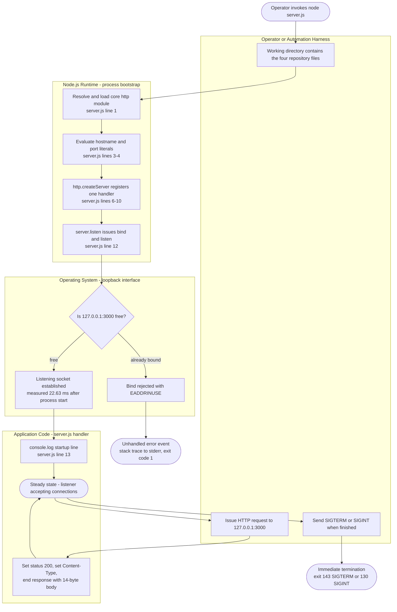
```mermaid
flowchart TD
    Start([Operator invokes node server.js]) --> Lane1

    subgraph OperatorLane["Operator or Automation Harness"]
        Lane1["Working directory contains the four repository files"]
        Probe["Issue HTTP request to 127.0.0.1:3000"]
        Signal["Send SIGTERM or SIGINT when finished"]
    end

    subgraph RuntimeLane["Node.js Runtime - process bootstrap"]
        LoadHttp["Resolve and load core http module<br/>server.js line 1"]
        Consts["Evaluate hostname and port literals<br/>server.js lines 3-4"]
        Create["http.createServer registers one handler<br/>server.js lines 6-10"]
        Listen["server.listen issues bind and listen<br/>server.js line 12"]
    end

    subgraph KernelLane["Operating System - loopback interface"]
        BindDec{"Is 127.0.0.1:3000 free?"}
        Bound["Listening socket established<br/>measured 22.63 ms after process start"]
        Conflict["Bind rejected with EADDRINUSE"]
    end

    subgraph AppLane["Application Code - server.js handler"]
        Announce["console.log startup line<br/>server.js line 13"]
        Ready([Steady state - listener accepting connections])
        Handle["Set status 200, set Content-Type,<br/>end response with 14-byte body"]
    end

    Lane1 --> LoadHttp --> Consts --> Create --> Listen --> BindDec
    BindDec -->|"free"| Bound --> Announce --> Ready
    BindDec -->|"already bound"| Conflict --> Crash([Unhandled error event<br/>stack trace to stderr, exit code 1])
    Ready --> Probe
    Probe --> Handle --> Ready
    Ready --> Signal --> Halt([Immediate termination<br/>exit 143 SIGTERM or 130 SIGINT])
```

**Step-by-step evidence for the bootstrap path (P-1).**

| Step | Mechanism | Evidence |
|---|---|---|
| Module load | Synchronous `require('http')` — the only `require` in the repository, with a literal specifier | `server.js` line 1 |
| Configuration | Two immutable `const` literals supply the entire configuration surface | `server.js` lines 3–4; zero `process.env` matches repository-wide |
| Server creation | `http.createServer` allocates the server and registers exactly one `request` listener | `server.js` line 6; measured listener census shows `request` = 1 |
| Bind and listen | `server.listen(port, hostname, cb)` performs the syscall; the callback fires on the `listening` event | `server.js` line 12; measured 22.63 ms from process start to `listening` |
| Readiness signal | `console.log` writes one line built from the same two constants used to bind | `server.js` line 13; stdout matched `Server running at http://127.0.0.1:3000/` |
| Steady state | Module evaluation returns; the process stays alive only because libuv holds the listening handle | Closing the handle in an instrumented run caused immediate process exit |

#### 4.1.1.3 System Interactions

| Interaction | Direction | Mechanism and Evidence |
|---|---|---|
| Client to listener | Inbound | TCP on `127.0.0.1:3000`; 50 parallel requests to 50 distinct paths produced one `200`/14-byte signature |
| Listener to client | Outbound over the same socket | Status line, headers, and 14-byte body; only `Content-Type` originates in repository code (`server.js` line 8) |
| Process to stdout | Outbound, host-local | Exactly one readiness line for the process lifetime; still one line after ~700 requests and all fault probes |
| Process to stderr | Outbound, host-local | Written only by Node's default unhandled-`error` path on bind failure |
| Non-loopback client to listener | Blocked | A request to the host's routable address failed to connect (`curl` exit 7, `http_code` 000) while loopback returned `200` |
| npm CLI to manifests | Tooling read | `npm ci` exits 0, audits one package, reports zero vulnerabilities, and creates no `node_modules` |

#### 4.1.1.4 Decision Points

Every decision point in the system, with its owner. The right-hand column shows how each was confirmed.

| ID | Decision (owner) | Outcomes and Evidence |
|---|---|---|
| DP-01 | Is `127.0.0.1:3000` free? (OS / Node `listen`) | Free → `listening` event and readiness line. Bound → `EADDRINUSE`, errno −98, syscall `listen`, exit code 1 |
| DP-02 | Is the request line and header block valid HTTP? (Node parser) | Invalid → `400 Bad Request` with `Connection: close`, 47 bytes, handler never invoked |
| DP-03 | Is the header block within `http.maxHeaderSize`? (Node parser) | 20 KB header block → `431 Request Header Fields Too Large`, 67 bytes; limit measured at 16384 bytes |
| DP-04 | Did headers complete before `headersTimeout`? (Node) | Incomplete block → `408 Request Timeout` observed at 68.8 s (60 s timeout plus the 30 s sweep interval) |
| DP-05 | Does the request carry `Expect: 100-continue`? (Node) | Yes → runtime auto-sends `HTTP/1.1 100 Continue` before the normal `200`; no `checkContinue` listener exists |
| DP-06 | Can the connection be kept alive? (Node, from protocol version and headers) | HTTP/1.1 → `Content-Length: 14` plus `Keep-Alive: timeout=5`. HTTP/1.0 → `Connection: close` and close-delimited framing with no `Content-Length` |
| DP-07 | Has the idle connection exceeded `keepAliveTimeout`? (Node) | Idle socket closed after a measured 5.806 s against the 5000 ms default |
| DP-08 | Should the process continue running? (Operator, via signals) | `SIGTERM` → exit 143; `SIGINT` → exit 130; both immediate, silent, and release the port |

Application code participates in **none** of these decisions. A counting wrapper placed around the handler proved the separation quantitatively: across four connections that sent a malformed request, an oversized header block, a valid `GET`, and a `HEAD`, the runtime accepted four connections but invoked the application handler only **twice** — the `400` and `431` requests were rejected before application code ran.

#### 4.1.1.5 Error Handling Paths

Four error paths exist, and all four are produced by the runtime rather than by repository logic (no `try`/`catch`, no `'error'` listener, and no `clientError` listener exist anywhere).

| Path | Immediate Effect | Service Impact |
|---|---|---|
| Bind conflict at startup | Unhandled `'error'` event, stack trace on stderr, stdout empty, exit code 1 | No request is ever served by that process; fail-fast |
| Protocol rejection (`400`, `431`) | Runtime writes the status line with `Connection: close` and closes that socket | Listener unaffected; the next request is served normally |
| Timeout (`408`, idle keep-alive close) | Runtime closes the affected socket after the applicable default elapses | Listener unaffected; verified by a `200`/14-byte probe immediately afterwards |
| Client abort mid-request | Socket destroyed silently; nothing written to stdout or stderr | Process survived a mid-request `RST` and served the following request normally |

Detailed recovery mechanics, including the absence of retry and notification machinery, are documented in section 4.3.2, and the consolidated error flowcharts are in section 4.4.3.

### 4.1.2 Integration Workflows

#### 4.1.2.1 Data Flow Between Systems

The repository integrates by being a well-formed Node.js package that other tools consume, not by calling anything. A complete census of network literals across all tracked files returns exactly two lines, both in `server.js` — the loopback constant on line 3 and the self-referential startup URL on line 13. There is no external hostname, endpoint, or base URL anywhere.

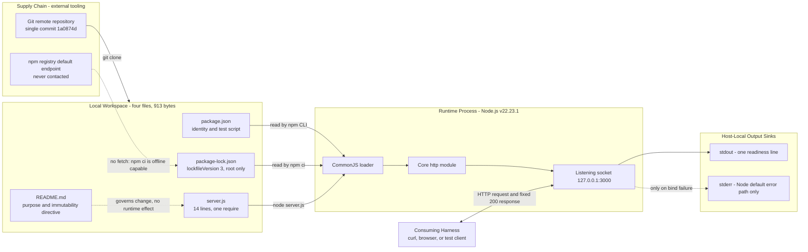
```mermaid
flowchart LR
    subgraph Supply["Supply Chain - external tooling"]
        GitRemote["Git remote repository<br/>single commit 1a0874d"]
        NpmReg["npm registry default endpoint<br/>never contacted"]
    end

    subgraph Local["Local Workspace - four files, 913 bytes"]
        Manifest["package.json<br/>identity and test script"]
        Lock["package-lock.json<br/>lockfileVersion 3, root only"]
        Source["server.js<br/>14 lines, one require"]
        Readme["README.md<br/>purpose and immutability directive"]
    end

    subgraph Runtime["Runtime Process - Node.js v22.23.1"]
        Loader["CommonJS loader"]
        HttpMod["Core http module"]
        Listener["Listening socket 127.0.0.1:3000"]
    end

    subgraph Sinks["Host-Local Output Sinks"]
        Stdout["stdout - one readiness line"]
        Stderr["stderr - Node default error path only"]
    end

    Consumer["Consuming Harness<br/>curl, browser, or test client"]

    GitRemote -->|"git clone"| Local
    NpmReg -.->|"no fetch: npm ci is offline capable"| Lock
    Manifest -->|"read by npm CLI"| Loader
    Lock -->|"read by npm ci"| Loader
    Source -->|"node server.js"| Loader
    Readme -.->|"governs change, no runtime effect"| Source
    Loader --> HttpMod --> Listener
    Listener --> Stdout
    Listener -.->|"only on bind failure"| Stderr
    Consumer <-->|"HTTP request and fixed 200 response"| Listener
```

| Data Flow | Payload | Volume Observed |
|---|---|---|
| Git remote → local workspace | Four files at commit `1a0874d` | 913 bytes, 39 lines |
| Manifest pair → npm CLI | Identity fields and a single `test` script | `npm ci` audited exactly one package |
| Source file → Node loader | One CommonJS script with one core-module import | 342 bytes |
| Client → listener | Arbitrary request line, headers, and body — all accepted, none read | Unbounded input, zero bytes consumed by application code |
| Listener → client | Fixed status, one application-set header, 14-byte body | 14 bytes per response |
| Process → stdout | One readiness line, 41 bytes including the newline | Once per process |

#### 4.1.2.2 API Interactions

The system exposes exactly one API surface — an HTTP endpoint that ignores its input — and consumes none. There is no outbound client of any kind: searches for `fetch(`, `http.request`, `http.get`, `https.request`, `net.connect`, `dns`, `WebSocket`, `grpc`, `amqp`, `kafka`, `mqtt`, and `webhook` all return zero matches.

| Aspect | Contract |
|---|---|
| Endpoint | Any path on `http://127.0.0.1:3000` — no routing table exists, so `/`, `/a/b/c/d/e`, `/%20space`, and `/../etc/passwd` are equivalent |
| Methods | All accepted, including non-standard ones; `GET`, `POST`, `PUT`, `PATCH`, `DELETE`, `OPTIONS`, `HEAD`, and `PURGE` were each observed returning the same result |
| Request handling | Request object bound but never dereferenced; body never read (a 64 KB unconsumed body still produced a normal `200`) |
| Response | `200`, `Content-Type: text/plain`, body `Hello, World!` plus newline (14 bytes) |
| Outbound calls | None; the single `require` targets a core module and the process opens no client sockets |

#### 4.1.2.3 Event Processing Flows

The system is event-driven only in the sense that Node's `http` server is event-driven. There is no application-level event bus, broker, or subscriber: searches for `queue`, `publish`, `subscribe`, `consumer`, `producer`, `emit(`, `.on(`, and `once(` return zero matches in repository code. The listener census taken from the live server object shows what is and is not wired:

| Runtime Event | Listeners Registered | Consequence |
|---|---|---|
| `request` | 1 — the inline arrow function at `server.js` line 6 | The only application entry point |
| `connection` | 1 — Node's internal connection listener | Repository code observes no connection events |
| `listening` | 1 — the callback at `server.js` line 12 | Sole readiness hook, used for the startup log |
| `error`, `clientError`, `checkContinue`, `upgrade`, `close` | 0 | All corresponding behavior falls to Node defaults |
| `SIGTERM`, `SIGINT`, `uncaughtException`, `unhandledRejection` (process) | 0 | Termination and crash handling are entirely default |

Two consequences follow directly. First, a bind error becomes an unhandled `'error'` event that terminates the process, because nothing is listening for it. Second, an `Upgrade: websocket` request is treated as an ordinary request and answered with the same `200`/14-byte response, because no `upgrade` listener exists to intercept it.

#### 4.1.2.4 Batch Processing Sequences

**No batch processing exists in the repository.** Searches for `cron`, `schedul`, `batch`, `job`, `worker`, `poll`, `setInterval`, and `setTimeout` return zero matches, and there is no scheduler configuration, no queue drain, and no bulk data path. The only multi-step, non-interactive sequences associated with the project are tooling invocations that a consumer drives:

| Sequence | Steps | Observed Result |
|---|---|---|
| Dependency materialization | `npm ci` reads the manifest and `lockfileVersion: 3` lockfile | Exit 0, "audited 1 package", zero vulnerabilities, no `node_modules` created, lockfile unmodified |
| Verification gate | `npm test` runs the placeholder script | Prints `Error: no test specified` and exits 1 — a pipeline gating on it fails by design (deviation D-003) |
| Launch | `npm start` with no declared `start` script | npm's built-in default resolves to `node server.js` and the server binds (deviation D-004) |
| Library consumption | Requiring the package root | Fails with `MODULE_NOT_FOUND` because `main` points at a non-existent `index.js` (deviation D-001) |

These sequences are illustrated as a single integration sequence diagram in section 4.4.4.


## 4.2 Flowchart Requirements

This section presents the element-complete flowchart for the system's primary workflow — the request service cycle (P-2) — and then enumerates each element that the flowchart is required to express: start and end points, process steps, decision diamonds, system boundaries, user touchpoints, error states with recovery paths, and timing constraints. Validation rules follow in section 4.2.2.

### 4.2.1 Workflow Element Coverage

#### 4.2.1.1 Annotated Request Processing Flowchart

The three swim lanes below correspond to the three ownership domains that a request traverses. Note that application code occupies only the middle lane and contains no branches: the request enters and leaves the application in a straight line of three statements.

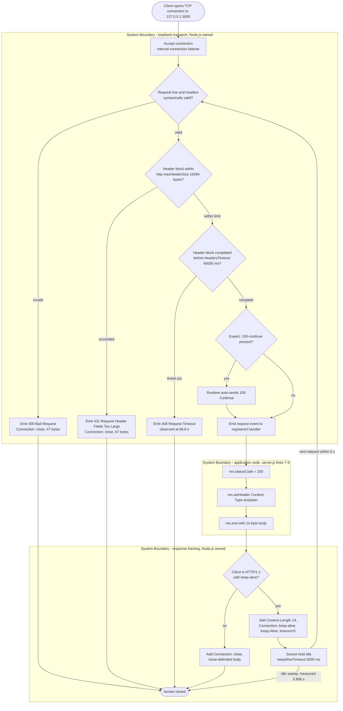
```mermaid
flowchart TD
    ReqStart([Client opens TCP connection to 127.0.0.1:3000]) --> Accept

    subgraph Transport["System Boundary - loopback transport, Node.js owned"]
        Accept["Accept connection<br/>internal connection listener"]
        ParseDec{"Request line and headers<br/>syntactically valid?"}
        SizeDec{"Header block within<br/>http.maxHeaderSize 16384 bytes?"}
        CompleteDec{"Header block completed<br/>before headersTimeout 60000 ms?"}
        Reject400["Emit 400 Bad Request<br/>Connection: close, 47 bytes"]
        Reject431["Emit 431 Request Header Fields Too Large<br/>Connection: close, 67 bytes"]
        Reject408["Emit 408 Request Timeout<br/>observed at 68.8 s"]
        ExpectDec{"Expect: 100-continue present?"}
        Continue["Runtime auto-sends 100 Continue"]
        Dispatch["Emit request event to registered handler"]
    end

    subgraph AppCode["System Boundary - application code, server.js lines 7-9"]
        SetStatus["res.statusCode = 200"]
        SetType["res.setHeader Content-Type text/plain"]
        EndRes["res.end with 14-byte body"]
    end

    subgraph Framing["System Boundary - response framing, Node.js owned"]
        FrameDec{"Client is HTTP/1.1<br/>with keep-alive?"}
        KeepAlive["Add Content-Length 14,<br/>Connection: keep-alive, Keep-Alive: timeout=5"]
        CloseFrame["Add Connection: close,<br/>close-delimited body"]
        Idle["Socket held idle<br/>keepAliveTimeout 5000 ms"]
        Closed([Socket closed])
    end

    Accept --> ParseDec
    ParseDec -->|"invalid"| Reject400 --> Closed
    ParseDec -->|"valid"| SizeDec
    SizeDec -->|"exceeded"| Reject431 --> Closed
    SizeDec -->|"within limit"| CompleteDec
    CompleteDec -->|"timed out"| Reject408 --> Closed
    CompleteDec -->|"complete"| ExpectDec
    ExpectDec -->|"yes"| Continue --> Dispatch
    ExpectDec -->|"no"| Dispatch
    Dispatch --> SetStatus --> SetType --> EndRes --> FrameDec
    FrameDec -->|"yes"| KeepAlive --> Idle
    FrameDec -->|"no"| CloseFrame --> Closed
    Idle -->|"next request within 5 s"| ParseDec
    Idle -->|"idle sweep, measured 5.806 s"| Closed
```

#### 4.2.1.2 Element Register

| Required Element | Instances in This System | Evidence |
|---|---|---|
| Start points | Process launch (`node server.js`); TCP connection arrival; npm command invocation; signal delivery | `server.js` line 12; measured connection acceptance; `npm test`/`npm ci` runs |
| End points | Response written; socket closed; process exit 0-path absent — exits are 1 (bind failure), 143 (`SIGTERM`), or 130 (`SIGINT`) | Measured exit codes |
| Process steps | Three per request (`statusCode`, `setHeader`, `end`); five at bootstrap (load, evaluate constants, create, listen, log) | `server.js` lines 1–14 |
| Decision diamonds | Eight, all runtime- or operator-owned (DP-01…DP-08 in section 4.1.1.4) | Zero conditionals in `server.js` |
| System boundaries | Loopback transport, application code, response framing, output sinks, packaging/tooling | Listener census and measured header attribution |
| User touchpoints | HTTP request/response; stdout readiness line; stderr stack trace on bind failure; npm commands; signals | See section 4.2.1.4 |
| Error states | `400`, `431`, `408`, silent socket destruction, `EADDRINUSE` exit 1 | Raw-socket probes captured verbatim response bytes |
| Recovery paths | External only — client retry, port release plus relaunch, supervisor restart | No `retry`, `backoff`, `catch`, or `'error'` handler exists |
| Timing constraints | Five runtime defaults plus measured latencies | See section 4.2.1.5 |

#### 4.2.1.3 System Boundaries and Ownership

| Boundary | Owner | What Crosses It |
|---|---|---|
| Loopback network edge | OS kernel plus Node `net`/`http` | Raw bytes in, serialized responses out; non-loopback traffic never crosses |
| Runtime-to-application edge | Node `http` server dispatching the `request` event | A `req`/`res` pair; `req` is never dereferenced by application code |
| Application-to-runtime edge | `res.end` handing the body back for serialization | Status code, one header, and a 14-byte string literal |
| Framing edge | Node `http` response serializer | `Date`, `Content-Length`, `Connection`, and `Keep-Alive` headers added without repository involvement |
| Process-to-host edge | OS process I/O | One stdout line; stderr only on the default unhandled-error path |
| Packaging edge | npm CLI and Git | Manifest fields, lockfile, script invocations, and commit history |

#### 4.2.1.4 User Touchpoints

There is no human user interface, no authentication prompt, and no session concept. Every touchpoint is either a protocol exchange or a console stream.

| Touchpoint | Actor | Observable Contract |
|---|---|---|
| HTTP request to `127.0.0.1:3000` | Any local client or harness | Receives `200`, `text/plain`, 14 bytes, regardless of method, path, query, headers, or body |
| Readiness line on stdout | Operator or supervising process | Exactly `Server running at http://127.0.0.1:3000/` (41 bytes with the newline), once per process |
| Stack trace on stderr | Operator | Only on bind failure; discloses address, port, and syscall, nothing else |
| `npm test` / `npm ci` / `npm start` | Consumer pipeline | Exit 1 with `Error: no test specified`; exit 0 no-op install; implicit launch of `server.js` |
| `SIGTERM` / `SIGINT` | Operator | Immediate exit with no output and immediate port release |

#### 4.2.1.5 Timing Constraints and SLA Considerations

**The repository declares no timing constraint of any kind.** There is no `setTimeout`, no `setInterval`, no keep-alive or socket tuning, no rate limit, and no declared SLA, SLO, or error budget — consistent with the verified absences recorded in sections 1.2.3.3 and 2.2.1.3. Every timing value that governs behavior is therefore a **Node.js default in effect**, read directly from the live server object during verification, or a **measured latency** from the verification environment. Both categories are attributions rather than commitments: a future Node.js release could change the defaults with no change to this codebase.

| Timing Parameter | Value in Effect | Origin and Observed Effect |
|---|---|---|
| `server.keepAliveTimeout` | 5000 ms | Node default; surfaces as `Keep-Alive: timeout=5`; idle socket closed after a measured 5.806 s |
| `server.headersTimeout` | 60000 ms | Node default; an incomplete header block received `408 Request Timeout` at 68.8 s |
| `server.requestTimeout` | 300000 ms | Node default; not exercised, reported for completeness |
| `server.connectionsCheckingInterval` | 30000 ms | Node default; explains the gap between nominal timeouts and observed close times |
| `server.timeout` | 0 (disabled) | Node default; no per-socket inactivity timeout applies |
| `server.maxRequestsPerSocket` / `maxHeadersCount` | 0 / `null` (unlimited) | Node defaults; no per-connection request cap exists |
| `http.maxHeaderSize` | 16384 bytes | Node default; a 20 KB header block produced `431` |
| Startup to readiness | 22.63 ms measured | Environment measurement; the readiness line is emitted after the bind completes, so it is a true readiness signal |
| Request latency, reused connection | p50 0.077 ms, p95 0.124 ms, p99 0.479 ms, max 4.377 ms over 500 requests | Environment measurement; approximately 10,400 sequential requests per second on one connection |
| Request latency, new connection each time | p50 0.117 ms, p95 0.299 ms, max 0.880 ms over 100 requests | Environment measurement; first request after launch measured 3.235 ms TTFB (warm-up) |

Any availability or latency objective for this system must be established by the consuming tooling; none can be sourced from the repository.

### 4.2.2 Validation Rules

#### 4.2.2.1 Validation Checkpoint Flow

The diagram distinguishes checkpoints that genuinely execute from checkpoints that a reader might expect but that provably do not exist. The lower lane is deliberately drawn as pass-through nodes: they represent verified absences, and a request traverses them without any evaluation occurring.

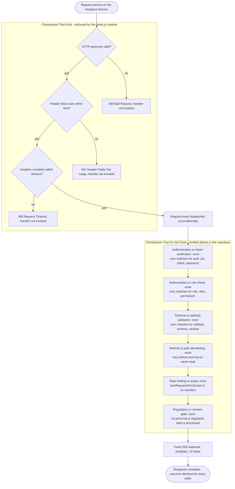
```mermaid
flowchart TD
    Arrive([Request arrives on the loopback listener]) --> V1

    subgraph RuntimeChecks["Checkpoints That Exist - enforced by the Node.js runtime"]
        V1{"HTTP grammar valid?"}
        V2{"Header block size within limit?"}
        V3{"Headers complete within timeout?"}
        V1 -->|"no"| R400["400 Bad Request, handler not invoked"]
        V1 -->|"yes"| V2
        V2 -->|"no"| R431["431 Header Fields Too Large, handler not invoked"]
        V2 -->|"yes"| V3
        V3 -->|"no"| R408["408 Request Timeout, handler not invoked"]
    end

    subgraph AbsentChecks["Checkpoints That Do Not Exist - verified absent in the repository"]
        A1["Authentication or token verification: none<br/>zero matches for auth, jwt, token, password"]
        A2["Authorization or role check: none<br/>zero matches for role, rbac, permission"]
        A3["Schema or payload validation: none<br/>zero matches for validate, schema, sanitize"]
        A4["Method or path allowlisting: none<br/>req.method and req.url never read"]
        A5["Rate limiting or quota: none<br/>maxRequestsPerSocket 0, no counters"]
        A6["Regulatory or consent gate: none<br/>no personal or regulated data is processed"]
    end

    V3 -->|"yes"| Pass["Request event dispatched unconditionally"]
    Pass --> A1 --> A2 --> A3 --> A4 --> A5 --> A6
    A6 --> Fixed["Fixed 200 response, text/plain, 14 bytes"]
    Fixed --> Done([Response complete - outcome identical for every caller])
```

#### 4.2.2.2 Business Rules at Each Step

The governing rule set comes from the fixture contract described in sections 1.1 and 2.2: the artifact must behave identically for every caller so that any deviation observed by consuming tooling is attributable to the consumer, not to the fixture.

| Workflow Step | Business Rule | Enforcement Mechanism |
|---|---|---|
| Bootstrap | The listener must open unconditionally at startup, or the process must not run at all | `server.listen` with no fallback; bind failure terminates the process (F-001-RQ-001, F-001-RQ-004) |
| Bootstrap | Behavior must not vary with the deployment environment | Configuration is two `const` literals; zero `process.env` references exist (F-001-RQ-003) |
| Readiness | The announced URL must not diverge from the actual bind target | Line 13 interpolates the same constants passed to `listen` on line 12 (F-003-RQ-002) |
| Request dispatch | Every accepted request must succeed | `res.statusCode = 200` executes unconditionally (F-002-RQ-001) |
| Response construction | The payload must be byte-assertable by consumers | A single string literal ended with one `res.end` call; 14 bytes measured (F-002-RQ-003) |
| Response construction | Output must be independent of input | `req` is bound but never dereferenced (F-002-RQ-004) |
| Steady state | Repetition and concurrency must not change the result | Stateless handler; 50 parallel and 500 sequential requests produced one signature (F-002-RQ-005) |
| Logging | Output noise must not perturb the deterministic signature | Exactly one stdout line for the process lifetime; no request or shutdown logging (F-003-RQ-003) |
| Change control | Repository content must remain unmodified | Advisory only — the `README.md` directive, evidenced by a single-commit clean history (F-006) |

#### 4.2.2.3 Data Validation Requirements

Validation exists only at the protocol layer, and it is entirely the runtime's. Application code performs none, deliberately: not reading the request eliminates deserialization, injection, and payload-size handling from the application surface.

| Validation | Layer | Rule and Measured Outcome |
|---|---|---|
| HTTP grammar (request line, method token, version) | Node HTTP parser | Malformed line, invalid method characters, and `HTTP/9.9` each produced `400 Bad Request` with `Connection: close`; the handler was never invoked |
| Header block size | Node HTTP parser | Blocks above the 16384-byte default produced `431 Request Header Fields Too Large` |
| Header completeness within a time bound | Node runtime timers | An unterminated block produced `408 Request Timeout` at a measured 68.8 s |
| Body content, type, or size | None | A 64 KB body and a chunked body were both ignored; a promised-but-unsent body still produced an immediate `200` |
| Path, query string, or method allowlisting | None | `/`, `//`, `/a/b/c/d/e`, `/%20space`, `/?q=1&r=2`, and `/../etc/passwd` all returned `200` with 14 bytes; no filesystem access occurs because no `fs` usage exists |
| Output validation or encoding negotiation | None | `Content-Type: text/plain` is emitted with no `charset` parameter and no content negotiation |

#### 4.2.2.4 Authorization Checkpoints

**No authorization checkpoint exists anywhere in the workflow.** Repository-wide searches return zero matches for `auth` in any code context (the only match is the `"author"` metadata field in `package.json`), and zero matches for `jwt`, `token`, `password`, `credential`, `secret`, `permission`, `role`, `rbac`, and `session`. All callers are anonymous and indistinguishable, and the response is identical for every one of them. The only access control the system possesses is topological: the listener is bound to `127.0.0.1`, so a client on any non-loopback interface cannot connect at all — confirmed by a failed connection to the host's routable address while the loopback request succeeded. There is no firewall rule, allowlist, or rate limit inside the repository to supplement it.

#### 4.2.2.5 Regulatory Compliance Checks

**No regulatory or compliance check exists, and none is applicable to the observed data flows.** The evidence is as follows.

| Compliance Dimension | Observed State |
|---|---|
| Personal or regulated data | None processed. The response is a fixed greeting; request bodies are never read, and nothing is logged per request, so no client address, header, or payload is ever recorded |
| Data retention | Nothing is persisted. No database, no filesystem write, no cache, and no in-memory accumulation exist |
| Transport protection | Plain HTTP only; no `https` usage and no certificate material anywhere. Exposure is limited to the loopback interface |
| Consent, audit, or retention gates | Absent; there is no audit log, no consent flow, and no data subject concept |
| Licensing | MIT declared in `package.json` and in the lockfile root record; no `LICENSE` file accompanies the declaration |
| Change-control attestation | Provided by version control only: a single commit `1a0874d` and a clean working tree evidence the unmodified baseline; no branch protection, hook, or CI check inside the repository enforces it |


## 4.3 Technical Implementation

This section documents how the workflows above are implemented with respect to state and failure. Both topics are unusually short in substance and unusually well evidenced: the system holds no application state and implements no error handling, and both facts were confirmed by exhaustive search and by execution.

### 4.3.1 State Management

#### 4.3.1.1 State Inventory and the Mutable-State Census

A complete census of assignments in `server.js` — every line containing `=` — yields six lines: four `const` initializations (`http`, `hostname`, `port`, `server`), the arrow-token line for the `listen` callback, and exactly **one** real assignment, `res.statusCode = 200` on line 7, which writes to a property of a per-request object owned by the runtime.

| State Element | Scope | Lifetime and Mutability |
|---|---|---|
| `http` module reference | Module | Immutable `const`, resolved once at load |
| `hostname`, `port` | Module | Immutable `const` literals; the entire configuration surface |
| `server` object | Module | Immutable binding; the runtime mutates its internal connection bookkeeping |
| `req` / `res` pair | Per request | Created by the runtime, discarded after the response; `req` never read |
| `res.statusCode` | Per request | The only value the application writes anywhere |

There are **zero module-level mutable variables**: `let`, `var`, `++`, counters, `Map`, `Set`, `WeakMap`, `globalThis`, and `global.` all return zero matches. This is the mechanical reason the invariance property (F-002-RQ-005) holds — there is no accumulator that repeated or concurrent traffic could disturb. Measured confirmation: 500 sequential requests to distinct paths and 50 parallel requests each produced exactly one response signature.

#### 4.3.1.2 State Transitions

Three state machines exist, and none of them belongs to application code:

1. **Process and server lifecycle** — from module loading to a bound listener to termination. Documented as a state diagram in section 4.4.5.
2. **Connection and request lifecycle** — accepted, parsing, dispatched, responded, idle keep-alive, closed, plus the rejection and abort states. Documented in section 4.4.5.
3. **Per-request response object** — the only transition sequence that repository code drives, shown below. Each transition maps to one line of `server.js`.

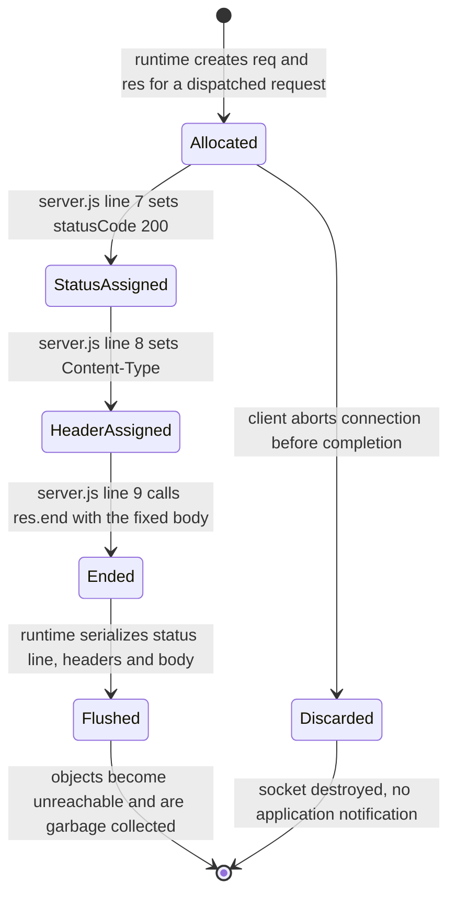
```mermaid
stateDiagram-v2
    [*] --> Allocated : runtime creates req and res for a dispatched request
    Allocated --> StatusAssigned : server.js line 7 sets statusCode 200
    StatusAssigned --> HeaderAssigned : server.js line 8 sets Content-Type
    HeaderAssigned --> Ended : server.js line 9 calls res.end with the fixed body
    Ended --> Flushed : runtime serializes status line, headers and body
    Flushed --> [*] : objects become unreachable and are garbage collected
    Allocated --> Discarded : client aborts connection before completion
    Discarded --> [*] : socket destroyed, no application notification
```

The `Discarded` transition was exercised deliberately: a client that sent partial request bytes and then reset the connection caused the runtime to destroy the socket with no output on stdout or stderr, and the next request was served normally. Because no `'aborted'` or `'error'` listener exists on the request, application code is never informed.

#### 4.3.1.3 Data Persistence Points

**There are none.** No data is written anywhere by the running process, which is a verified absence rather than an inference:

| Candidate Persistence Point | Observed State |
|---|---|
| Database or ORM | No client, driver, model, migration, or connection string exists (zero matches for `mongo`, `postgres`, `mysql`, `sqlite`, `prisma`, `sequelize`, `typeorm`, `knex`) |
| Filesystem | The `fs` and `path` modules are never imported; no read, write, stream, or temp-file call exists |
| Session or cookie store | No session, cookie, or token handling of any kind |
| In-process accumulation | No mutable module state; per-request objects are released after the response |
| Log persistence | One stdout line per process; no file sink, no rotation, no request logging |
| Artifacts on disk | `npm ci` created no `node_modules`; the working tree remained the four original files |

The only durable state associated with the project is the Git history itself — the single commit `1a0874d` that establishes the immutable baseline referenced by F-006.

#### 4.3.1.4 Caching Requirements

**No caching layer exists and none is required.** Searches for `cache`, `ttl`, `redis`, `memcache`, and `localStorage` return zero matches. Two observations explain why caching would add nothing: the response body is a compiled-in 14-byte string literal, so there is no computation or I/O to memoize, and no `Cache-Control`, `ETag`, `Last-Modified`, or `Vary` header is emitted, so clients receive no caching directives either. The only reuse mechanism in effect is transport-level connection reuse, which the runtime provides through the 5000 ms keep-alive default and which measurably reduces per-request cost (p50 0.077 ms on a reused connection versus 0.117 ms when a new connection is established per request).

#### 4.3.1.5 Transaction Boundaries

There is no transactional resource, so there is no commit, rollback, or compensation logic — `transaction`, `commit`, `rollback`, and `idempot` all return zero matches. The only boundary with transaction-like semantics is the **response boundary**: `res.end` on line 9 is a single completion call, so a response is either fully serialized or not sent at all, and no partial or chunked writes exist that could leave a response half-emitted.

| Boundary | Atomic Unit | Failure Semantics |
|---|---|---|
| Per-request response | Status, one application header, and 14-byte body, completed by one `res.end` | If the client aborts first, the socket is destroyed and nothing is retained; there is no partial-state cleanup to perform |
| Process bootstrap | Bind plus readiness announcement | All-or-nothing: bind failure exits before the announcement, so a readiness line is never printed for a non-serving process |
| Consumer install | `npm ci` against the `lockfileVersion: 3` lockfile | Idempotent and offline-capable; exit 0 with an unchanged lockfile and no installed tree |

Because the system is stateless, recovery never involves state reconstruction: restarting the process restores full service immediately.

### 4.3.2 Error Handling

#### 4.3.2.1 Implementation Posture

Repository code contains **no error handling whatsoever**. This is a measured statement: `try`, `catch`, `finally`, and `throw` return zero matches; no `'error'`, `'clientError'`, or `'aborted'` listener is registered; the live listener census showed zero listeners for `error`, `clientError`, `checkContinue`, `upgrade`, and `close`; and the process registers zero handlers for `SIGTERM`, `SIGINT`, `uncaughtException`, and `unhandledRejection`. Every error behavior the system exhibits is therefore a Node.js default, and it is documented here as such.

#### 4.3.2.2 Fault Taxonomy and Measured Behavior

| Fault | Runtime Response | Blast Radius |
|---|---|---|
| Bind conflict (`EADDRINUSE`) | Unhandled `'error'` event: stack trace with `code: 'EADDRINUSE'`, `errno: -98`, `syscall: 'listen'`, `address: '127.0.0.1'`, `port: 3000`; stdout empty; exit code 1 | Whole process; no request is ever served |
| Malformed request | `400 Bad Request` with `Connection: close` (47 bytes), socket closed | One socket |
| Oversized header block | `431 Request Header Fields Too Large` (67 bytes), socket closed | One socket |
| Stalled request headers | `408 Request Timeout` at a measured 68.8 s, socket closed | One socket |
| Idle keep-alive connection | Socket closed after a measured 5.806 s | One socket |
| Client reset mid-request | Socket destroyed silently, no output | One socket |
| `SIGTERM` / `SIGINT` | Immediate termination, exit 143 / 130, no drain, port released | Whole process; in-flight connections dropped |

#### 4.3.2.3 Retry, Fallback, Notification, and Recovery

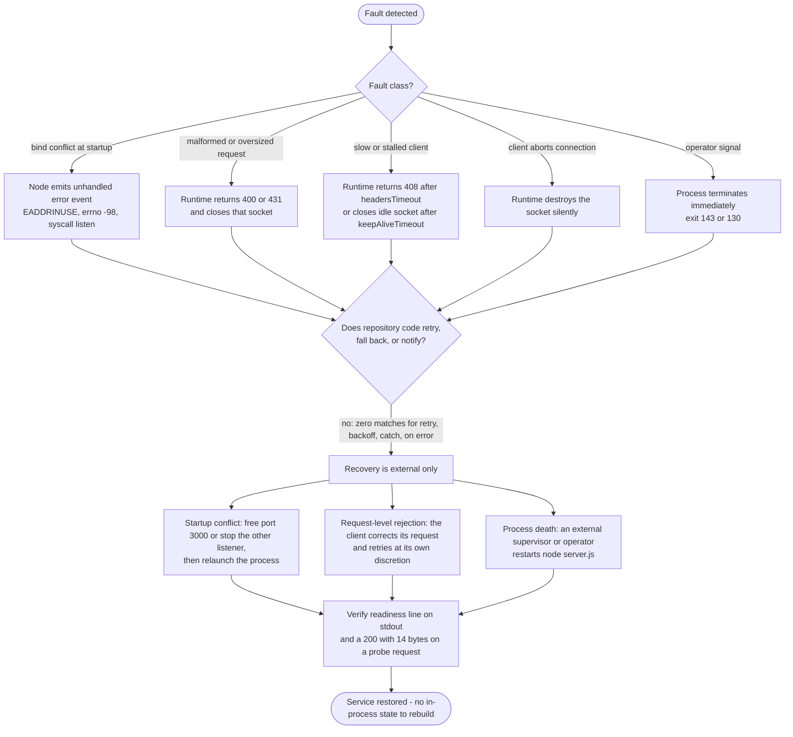
```mermaid
flowchart TD
    Detect([Fault detected]) --> Class{"Fault class?"}

    Class -->|"bind conflict at startup"| S1["Node emits unhandled error event<br/>EADDRINUSE, errno -98, syscall listen"]
    Class -->|"malformed or oversized request"| S2["Runtime returns 400 or 431<br/>and closes that socket"]
    Class -->|"slow or stalled client"| S3["Runtime returns 408 after headersTimeout<br/>or closes idle socket after keepAliveTimeout"]
    Class -->|"client aborts connection"| S4["Runtime destroys the socket silently"]
    Class -->|"operator signal"| S5["Process terminates immediately<br/>exit 143 or 130"]

    S1 --> NoRetry{"Does repository code retry,<br/>fall back, or notify?"}
    S2 --> NoRetry
    S3 --> NoRetry
    S4 --> NoRetry
    S5 --> NoRetry

    NoRetry -->|"no: zero matches for retry, backoff, catch, on error"| External["Recovery is external only"]
    External --> R1["Startup conflict: free port 3000 or stop the other listener,<br/>then relaunch the process"]
    External --> R2["Request-level rejection: the client corrects its request<br/>and retries at its own discretion"]
    External --> R3["Process death: an external supervisor or operator<br/>restarts node server.js"]
    R1 --> Verify["Verify readiness line on stdout<br/>and a 200 with 14 bytes on a probe request"]
    R2 --> Verify
    R3 --> Verify
    Verify --> Restored([Service restored - no in-process state to rebuild])
```

**Retry mechanisms.** None exist in the repository. There is no retry loop, no exponential backoff, no circuit breaker, and no alternate-port fallback: `retry`, `backoff`, and `circuit` return zero matches, and the bind is attempted exactly once. Any retry is the client's or the supervisor's responsibility.

**Fallback processes.** None exist. There is no degraded mode, no default route, no static-error page, and no secondary listener. The only "fallback" observable anywhere in the workflow is supplied by npm rather than by the repository: `npm start` succeeds despite no `start` script being declared, because npm's built-in default resolves to `node server.js` (deviation D-004).

**Error notification flows.** There is no alerting, metrics, tracing, or log-aggregation path — no monitoring client and no telemetry exist. Notification is limited to three channels, all host-local and all synchronous with the fault:

| Channel | Content | When Used |
|---|---|---|
| Process exit code | 1 (bind failure), 143 (`SIGTERM`), 130 (`SIGINT`) | Consumed by the invoking shell or supervisor |
| stderr | Node's default unhandled-`'error'` stack trace with address, port, and syscall | Bind failure only |
| HTTP status line | `400`, `431`, or `408` with `Connection: close` | Per-socket protocol faults; the client is the only party informed |

Silence is itself part of the contract: client aborts and idle-socket reaping produce no output at all, and stdout still contained exactly one line after roughly 700 requests plus every fault probe.

**Recovery procedures.** Recovery is entirely external and, because the system is stateless, trivial:

| Fault | Recovery Step | Verification |
|---|---|---|
| `EADDRINUSE` at startup | Stop the process already holding `127.0.0.1:3000`, or wait for it to exit, then relaunch | Readiness line reappears on stdout; a probe returns `200` with 14 bytes |
| Protocol rejection | Client corrects its request; no server action is required or possible | A well-formed request immediately after a `400`/`431` returned `200` |
| Connection closed by timeout | Client reconnects; the listener was never affected | Probe after the 408 path returned `200`/14 bytes |
| Process terminated | Operator or external supervisor re-runs `node server.js`; the port is released immediately on exit | Zero listening sockets on 3000 observed after `SIGTERM`, and a clean rebind afterwards |

Because a restart is the only recovery mechanism and it restores the complete contract in roughly 23 milliseconds with no state to rebuild, the system's practical resilience characteristic is fast replacement rather than fault tolerance. The corollary is equally important for consumers: there is nothing inside the repository that will restart it — no supervisor configuration, no container restart policy, no CI/CD or process-manager definition exists in any file.


## 4.4 Required Diagrams

This section collects the diagram set required for a process specification: a high-level system workflow, detailed process flows for each core feature, error-handling flowcharts, integration sequence diagrams, and state transition diagrams. The diagrams in sections 4.1 through 4.3 are the in-context views used to explain individual topics; the diagrams below are the standalone views, each keyed to the feature and requirement identifiers established in section 2.2.

**Diagram register.**

| Diagram | Scope | Related Requirements |
|---|---|---|
| 4.4.1 High-level system workflow | Three lifecycle phases, both terminal outcomes | F-001, F-002, F-003 |
| 4.4.2 Detailed process flows | Response construction; consumer and packaging journey | F-002; F-004, F-005, F-006, F-007 |
| 4.4.3 Error handling flowchart | All four fault phases and their blast radius | F-001-RQ-004, F-002-RQ-001 |
| 4.4.4 Integration sequence diagrams | Normal service, bind-conflict failure, automation pipeline | F-001, F-002, F-003, F-005, F-007 |
| 4.4.5 State transition diagrams | Process lifecycle; connection and request lifecycle | F-001, F-002 |

### 4.4.1 High-Level System Workflow

One page covering the entire system: an operator launches it, one decision determines whether it serves or dies, clients receive an invariant response for as long as it lives, and a signal ends it.

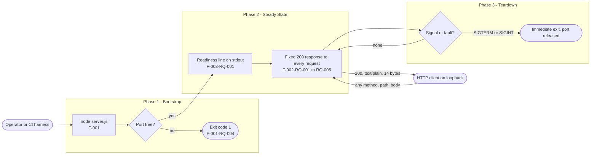
```mermaid
flowchart LR
    Op(["Operator or CI harness"]) --> Launch

    subgraph Bootstrap["Phase 1 - Bootstrap"]
        Launch["node server.js<br/>F-001"]
        BindQ{"Port free?"}
        Fail(["Exit code 1<br/>F-001-RQ-004"])
    end

    subgraph Steady["Phase 2 - Steady State"]
        Announced["Readiness line on stdout<br/>F-003-RQ-001"]
        Serving["Fixed 200 response to every request<br/>F-002-RQ-001 to RQ-005"]
    end

    subgraph Teardown["Phase 3 - Teardown"]
        SignalQ{"Signal or fault?"}
        Stop(["Immediate exit, port released"])
    end

    Client(["HTTP client on loopback"]) -->|"any method, path, body"| Serving
    Serving -->|"200, text/plain, 14 bytes"| Client
    Launch --> BindQ
    BindQ -->|"no"| Fail
    BindQ -->|"yes"| Announced --> Serving --> SignalQ
    SignalQ -->|"SIGTERM or SIGINT"| Stop
    SignalQ -->|"none"| Serving
```

Two properties of this diagram are worth stating explicitly because they are unusual. First, there is no success-exit path: the process never terminates of its own accord, so every terminal state is either a bind failure (exit 1) or an external signal (exit 143 or 130). Second, the steady-state loop has no internal branches — the same node serves every request because no routing, method dispatch, or content negotiation exists.

### 4.4.2 Detailed Process Flows

#### 4.4.2.1 F-002 Response Construction

The complete application-owned process: three unconditional statements, followed by runtime serialization. The dotted edge records the deliberate non-use of the request object, which is what makes the response input-independent (F-002-RQ-004).

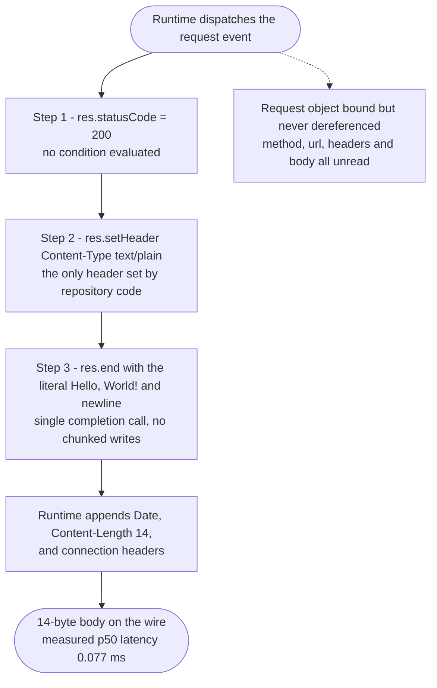
```mermaid
flowchart TD
    Dispatch([Runtime dispatches the request event]) --> Step1
    Step1["Step 1 - res.statusCode = 200<br/>no condition evaluated"]
    Step2["Step 2 - res.setHeader Content-Type text/plain<br/>the only header set by repository code"]
    Step3["Step 3 - res.end with the literal Hello, World! and newline<br/>single completion call, no chunked writes"]
    Ignored["Request object bound but never dereferenced<br/>method, url, headers and body all unread"]
    Step1 --> Step2 --> Step3
    Dispatch -.-> Ignored
    Step3 --> RuntimeFrame["Runtime appends Date, Content-Length 14,<br/>and connection headers"]
    RuntimeFrame --> Wire([14-byte body on the wire<br/>measured p50 latency 0.077 ms])
```

#### 4.4.2.2 F-004 through F-007 Consumer and Packaging Journey

The packaging features are exercised by a consumer rather than by the running process. This flow shows the three viable launch paths and the one that cannot work, with each documented deviation marked at the point where a consumer encounters it.

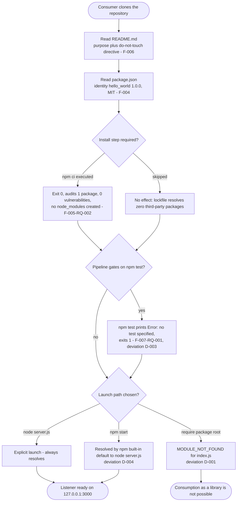
```mermaid
flowchart TD
    Clone([Consumer clones the repository]) --> ReadDoc["Read README.md<br/>purpose plus do-not-touch directive - F-006"]
    ReadDoc --> ReadMan["Read package.json<br/>identity hello_world 1.0.0, MIT - F-004"]
    ReadMan --> InstallQ{"Install step required?"}
    InstallQ -->|"npm ci executed"| CiRun["Exit 0, audits 1 package, 0 vulnerabilities,<br/>no node_modules created - F-005-RQ-002"]
    InstallQ -->|"skipped"| NoOp["No effect: lockfile resolves zero third-party packages"]
    CiRun --> TestQ{"Pipeline gates on npm test?"}
    NoOp --> TestQ
    TestQ -->|"yes"| TestFail["npm test prints Error: no test specified,<br/>exits 1 - F-007-RQ-001, deviation D-003"]
    TestQ -->|"no"| LaunchQ{"Launch path chosen?"}
    TestFail --> LaunchQ
    LaunchQ -->|"node server.js"| Direct["Explicit launch - always resolves"]
    LaunchQ -->|"npm start"| Implicit["Resolved by npm built-in default to node server.js<br/>deviation D-004"]
    LaunchQ -->|"require package root"| Broken["MODULE_NOT_FOUND for index.js<br/>deviation D-001"]
    Direct --> Ready([Listener ready on 127.0.0.1:3000])
    Implicit --> Ready
    Broken --> Abort([Consumption as a library is not possible])
```

The startup announcement flow (F-003) is not drawn separately because it has no independent structure: it is a single `console.log` inside the `listen` callback, already shown as the readiness step in sections 4.1.1.2 and 4.4.1.

### 4.4.3 Error Handling Flowcharts

Faults are grouped by the lifecycle phase in which they occur, because blast radius follows phase: startup faults kill the process, request faults cost one socket, transport faults are invisible, and shutdown is abrupt by design.

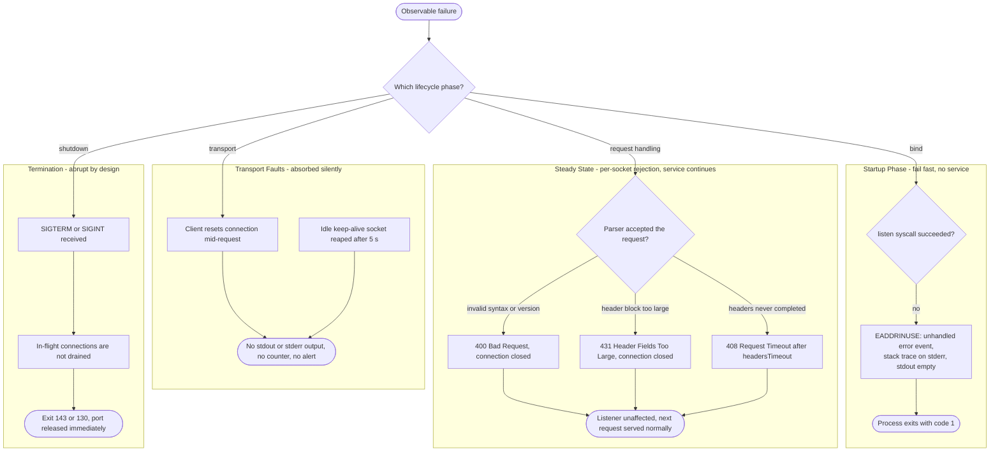
```mermaid
flowchart TD
    Fault([Observable failure]) --> Phase{"Which lifecycle phase?"}

    subgraph StartupErrors["Startup Phase - fail fast, no service"]
        BindErr{"listen syscall succeeded?"}
        Eaddr["EADDRINUSE: unhandled error event,<br/>stack trace on stderr, stdout empty"]
        Exit1(["Process exits with code 1"])
        BindErr -->|"no"| Eaddr --> Exit1
    end

    subgraph RequestErrors["Steady State - per-socket rejection, service continues"]
        Grammar{"Parser accepted the request?"}
        E400["400 Bad Request, connection closed"]
        E431["431 Header Fields Too Large, connection closed"]
        E408["408 Request Timeout after headersTimeout"]
        Survive(["Listener unaffected, next request served normally"])
        Grammar -->|"invalid syntax or version"| E400 --> Survive
        Grammar -->|"header block too large"| E431 --> Survive
        Grammar -->|"headers never completed"| E408 --> Survive
    end

    subgraph TransportErrors["Transport Faults - absorbed silently"]
        Abort["Client resets connection mid-request"]
        Idle["Idle keep-alive socket reaped after 5 s"]
        NoLog(["No stdout or stderr output, no counter, no alert"])
        Abort --> NoLog
        Idle --> NoLog
    end

    subgraph TerminationErrors["Termination - abrupt by design"]
        Sig["SIGTERM or SIGINT received"]
        NoDrain["In-flight connections are not drained"]
        Gone(["Exit 143 or 130, port released immediately"])
        Sig --> NoDrain --> Gone
    end

    Phase -->|"bind"| BindErr
    Phase -->|"request handling"| Grammar
    Phase -->|"transport"| Abort
    Phase -->|"shutdown"| Sig
```

No path in this diagram passes through repository code. The recovery side of each path, and the reasons no retry or notification machinery exists, are documented in section 4.3.2.3.

### 4.4.4 Integration Sequence Diagrams

#### 4.4.4.1 Normal Service Sequence

Five participants: operator, Node.js runtime, application handler, loopback stack, and HTTP client. Measured timings are annotated at the points where they were taken.

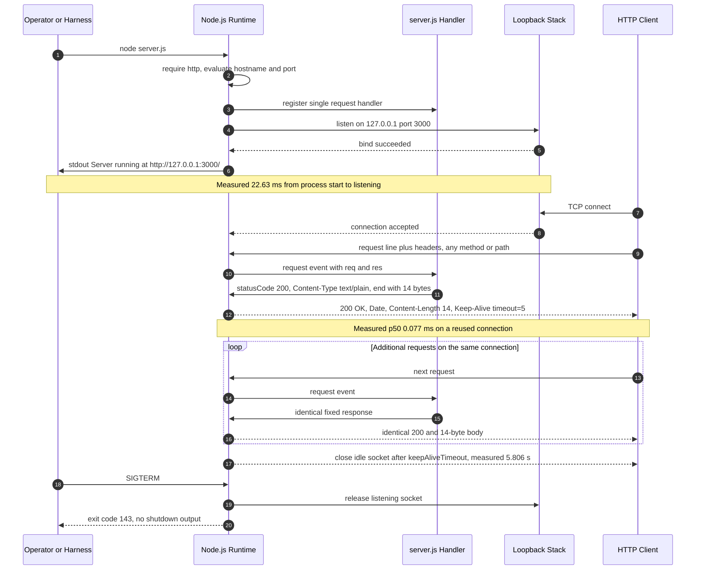
```mermaid
sequenceDiagram
    autonumber
    participant Op as Operator or Harness
    participant Node as Node.js Runtime
    participant App as server.js Handler
    participant OS as Loopback Stack
    participant Cli as HTTP Client

    Op->>Node: node server.js
    Node->>Node: require http, evaluate hostname and port
    Node->>App: register single request handler
    Node->>OS: listen on 127.0.0.1 port 3000
    OS-->>Node: bind succeeded
    Node->>Op: stdout Server running at http://127.0.0.1:3000/
    Note over Op,OS: Measured 22.63 ms from process start to listening

    Cli->>OS: TCP connect
    OS-->>Node: connection accepted
    Cli->>Node: request line plus headers, any method or path
    Node->>App: request event with req and res
    App->>Node: statusCode 200, Content-Type text/plain, end with 14 bytes
    Node-->>Cli: 200 OK, Date, Content-Length 14, Keep-Alive timeout=5
    Note over Node,Cli: Measured p50 0.077 ms on a reused connection

    loop Additional requests on the same connection
        Cli->>Node: next request
        Node->>App: request event
        App->>Node: identical fixed response
        Node-->>Cli: identical 200 and 14-byte body
    end

    Node-->>Cli: close idle socket after keepAliveTimeout, measured 5.806 s
    Op->>Node: SIGTERM
    Node->>OS: release listening socket
    Node-->>Op: exit code 143, no shutdown output
```

#### 4.4.4.2 Bind Conflict Sequence

The complete failure interaction when port 3000 is already held on the loopback interface. Field values shown were captured from the actual stderr output of a second instance.

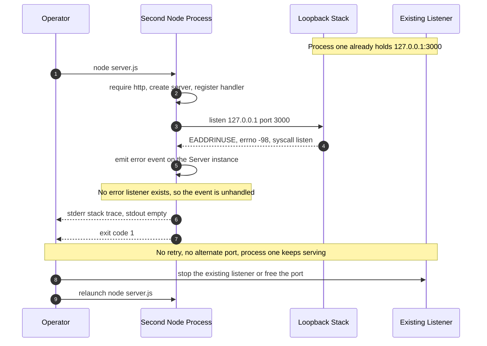
```mermaid
sequenceDiagram
    autonumber
    participant Op as Operator
    participant P2 as Second Node Process
    participant OS as Loopback Stack
    participant P1 as Existing Listener

    Note over P1,OS: Process one already holds 127.0.0.1:3000
    Op->>P2: node server.js
    P2->>P2: require http, create server, register handler
    P2->>OS: listen 127.0.0.1 port 3000
    OS-->>P2: EADDRINUSE, errno -98, syscall listen
    P2->>P2: emit error event on the Server instance
    Note over P2: No error listener exists, so the event is unhandled
    P2-->>Op: stderr stack trace, stdout empty
    P2-->>Op: exit code 1
    Note over Op,P1: No retry, no alternate port, process one keeps serving
    Op->>P1: stop the existing listener or free the port
    Op->>P2: relaunch node server.js
```

#### 4.4.4.3 Automation Pipeline Sequence

The end-to-end tooling integration a consuming pipeline performs, including the branch where a test gate is applied. Each response shown is a measured result.

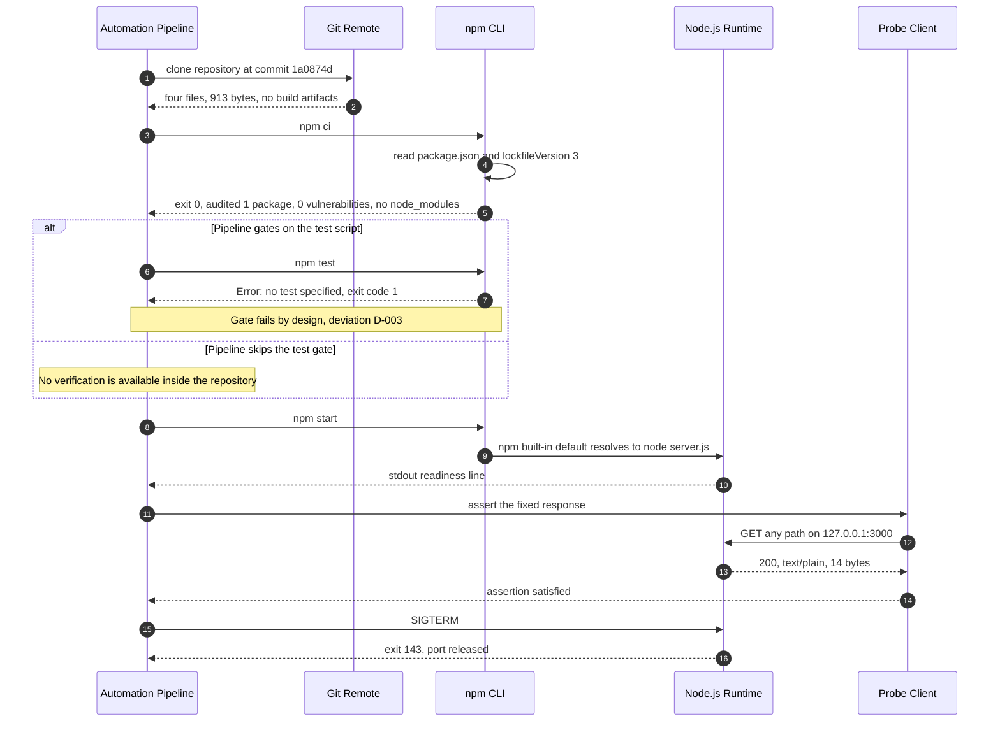
```mermaid
sequenceDiagram
    autonumber
    participant CI as Automation Pipeline
    participant Git as Git Remote
    participant Npm as npm CLI
    participant Node as Node.js Runtime
    participant Probe as Probe Client

    CI->>Git: clone repository at commit 1a0874d
    Git-->>CI: four files, 913 bytes, no build artifacts
    CI->>Npm: npm ci
    Npm->>Npm: read package.json and lockfileVersion 3
    Npm-->>CI: exit 0, audited 1 package, 0 vulnerabilities, no node_modules
    alt Pipeline gates on the test script
        CI->>Npm: npm test
        Npm-->>CI: Error: no test specified, exit code 1
        Note over CI,Npm: Gate fails by design, deviation D-003
    else Pipeline skips the test gate
        Note over CI: No verification is available inside the repository
    end
    CI->>Npm: npm start
    Npm->>Node: npm built-in default resolves to node server.js
    Node-->>CI: stdout readiness line
    CI->>Probe: assert the fixed response
    Probe->>Node: GET any path on 127.0.0.1:3000
    Node-->>Probe: 200, text/plain, 14 bytes
    Probe-->>CI: assertion satisfied
    CI->>Node: SIGTERM
    Node-->>CI: exit 143, port released
```

### 4.4.5 State Transition Diagrams

#### 4.4.5.1 Process and Server Lifecycle

Six states with two terminal outcomes. The self-transition on `Listening` is the entire steady state: serving a request changes nothing about the process, which is why the machine has no request-dependent states.

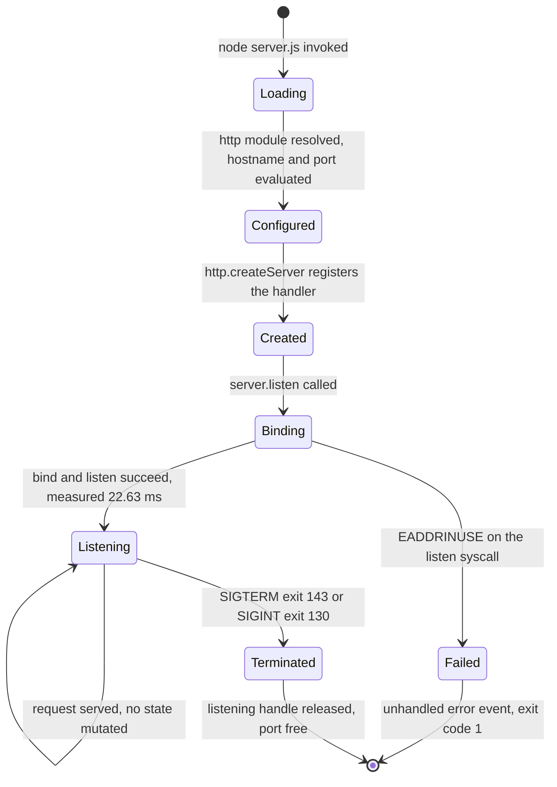
```mermaid
stateDiagram-v2
    [*] --> Loading : node server.js invoked
    Loading --> Configured : http module resolved, hostname and port evaluated
    Configured --> Created : http.createServer registers the handler
    Created --> Binding : server.listen called
    Binding --> Listening : bind and listen succeed, measured 22.63 ms
    Binding --> Failed : EADDRINUSE on the listen syscall
    Listening --> Listening : request served, no state mutated
    Listening --> Terminated : SIGTERM exit 143 or SIGINT exit 130
    Failed --> [*] : unhandled error event, exit code 1
    Terminated --> [*] : listening handle released, port free
```

#### 4.4.5.2 Connection and Request Lifecycle

All per-socket state lives here, and all of it is owned by the runtime. Note that three of the transitions out of `Parsing` — `Rejected`, `TimedOut`, and the abort path — bypass application code entirely, which was confirmed by the handler-invocation count described in section 4.1.1.4.

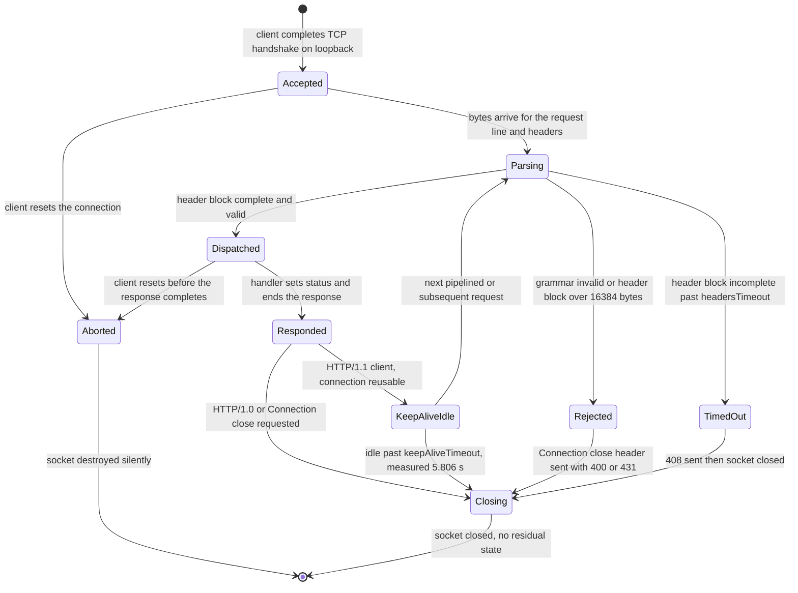
```mermaid
stateDiagram-v2
    [*] --> Accepted : client completes TCP handshake on loopback
    Accepted --> Parsing : bytes arrive for the request line and headers
    Parsing --> Rejected : grammar invalid or header block over 16384 bytes
    Parsing --> TimedOut : header block incomplete past headersTimeout
    Parsing --> Dispatched : header block complete and valid
    Dispatched --> Responded : handler sets status and ends the response
    Responded --> KeepAliveIdle : HTTP/1.1 client, connection reusable
    Responded --> Closing : HTTP/1.0 or Connection close requested
    KeepAliveIdle --> Parsing : next pipelined or subsequent request
    KeepAliveIdle --> Closing : idle past keepAliveTimeout, measured 5.806 s
    Accepted --> Aborted : client resets the connection
    Dispatched --> Aborted : client resets before the response completes
    Rejected --> Closing : Connection close header sent with 400 or 431
    TimedOut --> Closing : 408 sent then socket closed
    Aborted --> [*] : socket destroyed silently
    Closing --> [*] : socket closed, no residual state
```

The per-request response object has its own short state sequence, documented alongside the state-management discussion in section 4.3.1.2. No other state machine exists in the system: there is no workflow engine, no job state, no saga, and no status field anywhere in the repository.


## 4.5 References

### 4.5.1 Repository Files Examined

- `server.js` - Established the entire runtime workflow: the single `require('http')` on line 1, the `hostname` and `port` literals on lines 3–4, the `http.createServer` call with its inline three-statement handler on lines 6–10, and the `server.listen` call with its readiness callback on lines 12–14. Also established, by exhaustive search of its 14 lines, the absence of conditionals, error handling, request inspection, timers, signal handling, and mutable state.
- `package.json` - Established the packaging workflow inputs: identity fields (`hello_world`, `1.0.0`, MIT, author `hxu`), the single `scripts.test` entry that drives the failing verification gate, the absence of any dependency declarations, and the `main: index.js` field whose target does not exist (deviation D-001).
- `package-lock.json` - Established the install workflow: `lockfileVersion: 3`, `requires: true`, and a `packages` map containing only the root entry, which is why `npm ci` is a no-op that contacts no registry.
- `README.md` - Established the fixture purpose and the "Do not touch!" change-control directive that governs the workflows rather than participating in them.
- `` (repository root) - Confirmed the complete file inventory: four tracked files, 39 lines, 913 bytes, and zero subdirectories, bounding the set of workflows that can exist.

### 4.5.2 Cross-Referenced Specification Sections

- **1.2 System Overview** - Supplied the component inventory, the existing request-flow flowchart referenced in section 4.1, and the attribution rule that `Date`, `Content-Length`, `Connection`, and `Keep-Alive` are Node.js defaults rather than repository configuration.
- **1.2.3.3 Key Performance Indicators** - Confirmed the verified absence of KPIs, SLAs, monitoring, and instrumentation, which section 4.2.1.5 relies on when framing all timing values as measurements or runtime defaults.
- **2.2 Functional Requirements Table** - Supplied the requirement identifiers used throughout this section (F-001-RQ-001 through F-007-RQ-001), the uniform Low-complexity policy, the per-requirement validation-rule statements reflected in section 4.2.2, and deviations D-001 through D-005.
- **2.3 Feature Relationships** - Supplied the feature dependency map and the process-lifecycle flowchart that sections 4.1 and 4.4 extend rather than duplicate, plus the integration-point and common-service tables.

### 4.5.3 Verification Activities Performed for This Section

All execution was performed against a disposable copy of the four files placed outside the repository checkout, so the "Do not touch!" directive was honored; the repository working tree was confirmed clean and at commit `1a0874d` before and after every experiment. Verification environment: Node.js v22.23.1 with npm 11.18.0 — an environment fact, since the repository declares no runtime constraint (deviation D-005).

- **Static workflow analysis** - Word-boundary searches proved zero branching constructs in `server.js`; token analysis of the parsed script confirmed zero ternary and zero logical operators; a repository-wide marker sweep proved the absence of routing, middleware, validation, schemas, authorization, retry/backoff/circuit breakers, cron/schedule/batch/job, queue/publish/subscribe/webhook, transactions, caching, sessions, streaming, and polling constructs.
- **Instrumented startup measurement** - A wrapper around `http.createServer` (applied without modifying the source) captured 22.63 ms from process start to the `listening` event, the bound address `127.0.0.1:3000`, the live listener census (`request` 1, `connection` 1, and zero for `error`, `clientError`, `checkContinue`, `upgrade`, `close`), zero process signal handlers, and the effective Node timing defaults (`timeout` 0, `keepAliveTimeout` 5000 ms, `headersTimeout` 60000 ms, `requestTimeout` 300000 ms, `connectionsCheckingInterval` 30000 ms, `maxRequestsPerSocket` 0, `maxHeadersCount` null, `http.maxHeaderSize` 16384).
- **Handler-invocation proof** - A counting wrapper showed four accepted connections but only two handler invocations, proving that `400` and `431` rejections never reach application code.
- **Latency measurement** - 500 sequential requests on one keep-alive connection (p50 0.077 ms, p95 0.124 ms, p99 0.479 ms, max 4.377 ms, roughly 10,400 requests per second) and 100 requests with a new connection each (p50 0.117 ms, p95 0.299 ms); `curl` timings recorded a 3.235 ms first-request TTFB and connection reuse at zero connect cost.
- **Protocol-path probes (raw sockets)** - Captured verbatim responses for malformed request lines, invalid method characters, and `HTTP/9.9` (`400 Bad Request`, 47 bytes); a 20 KB header block (`431`, 67 bytes); an unterminated header block (`408` at 68.8 s); HTTP/1.0 without `Host` (close-delimited `200` with no `Content-Length`); `Expect: 100-continue` (automatic `100 Continue`); a 64 KB unconsumed body; a promised-but-unsent body; pipelined requests; an `Upgrade: websocket` attempt; `HEAD`; and a 5.806 s idle keep-alive close.
- **Fault and lifecycle probes** - Captured the full `EADDRINUSE` stderr output with `code`, `errno -98`, `syscall listen`, `address`, and `port` fields plus exit code 1; a client `RST` mid-request followed by a successful probe; `SIGTERM` exit 143 and `SIGINT` exit 130 with immediate port release; and process exit upon release of the listening handle.
- **Concurrency and invariance probes** - 50 parallel requests to 50 distinct paths produced a single `200|14` signature; stdout still contained exactly one line after all traffic and fault probes; the process was observed with 7 OS threads while JavaScript execution remained single-threaded.
- **Tooling probes** - `npm test` (exit 1 with `Error: no test specified`), `npm run` (only a `test` script listed), `npm ci` (exit 0, one package audited, zero vulnerabilities, no `node_modules`), `npm start` (npm's built-in default resolving to `node server.js`), and a package-root `require` failing with `MODULE_NOT_FOUND` for `index.js`.
- **Diagram validation** - All fifteen Mermaid diagrams authored for this section were rendered to SVG with the locally installed Mermaid CLI before submission, so their syntax is machine-verified rather than inspected.

### 4.5.4 External Sources

No external or web sources were used for this section. Every statement is grounded in the four repository files, in behavior measured from the running process, or in cross-references to sections 1 and 2 of this specification.


# 5. System Architecture

## 5.1 High-Level Architecture

The architecture described in this section is small enough to be stated exhaustively rather than approximated. The entire runtime system is one file — `server.js`, 14 lines — executed as a single operating-system process, supported by three non-executable artifacts (`package.json`, `package-lock.json`, `README.md`). Every architectural claim below was verified either by reading those four files or by executing an unmodified copy of `server.js` and measuring its behaviour. Where a conventional architecture element does not exist, this section says so explicitly and records the evidence of absence, because in a system this minimal the absences are as architecturally significant as the presences.

### 5.1.1 System Overview

#### 5.1.1.1 Architecture Style and Rationale

The system implements a **single-process, single-module monolith realised as a directly executable script**, layered on top of an **event-driven, non-blocking reactor** that is supplied entirely by the Node.js runtime rather than by repository code. Three properties of `server.js` establish this classification:

- **Monolithic and single-module.** All logic resides in one file. `server.js` declares no classes, no named functions, and no exports of any kind (`module.exports` and `export` each appear zero times), so there are no internal module boundaries to cross and no importable surface. The module graph is a single node whose only edge points at a runtime built-in.
- **Script-as-service.** The listener opens as a *side effect of evaluating the file*: `http.createServer(...)` and `server.listen(...)` execute at load time with no `main()` guard, no bootstrap framework, and no dependency-injection container. The artifact is not a library that a host invokes; it is a program that becomes a service when interpreted.
- **Reactor delegated to the runtime.** The single `require` in the repository targets Node's built-in `http` module (`server.js` line 1). Connection acceptance, HTTP/1.1 parsing, handler dispatch, and response serialisation are therefore performed by the runtime's event loop. Repository code contributes only a callback.

The rationale for this style is documented, not inferred. `README.md` declares the project a "test project for backprop integration" and appends the directive "Do not touch!". The governing quality attributes are consequently **determinism, reproducibility, and immutability** rather than extensibility, throughput, or configurability — and each style decision serves those attributes:

| Style Decision | Architectural Consequence | Attribute Served |
|---|---|---|
| Core runtime modules only; zero third-party packages | No registry, install, or transitive-version failure mode exists | Reproducibility |
| One file, no exports, no build step | The committed source is byte-for-byte the executed source | Determinism |
| Request object accepted but never read | Output cannot vary with client input | Determinism |
| Configuration as in-source `const` literals | Behaviour is fixed at author time, not at deploy time | Reproducibility |
| Loopback-only bind address | Blast radius is confined to a single host | Containment |

This is deliberately a *degenerate* layered architecture: the presentation, application, and data layers of a conventional web service collapse into three consecutive statements, and the data layer is empty. Section 5.3 records the tradeoffs of that collapse as formal decisions.

#### 5.1.1.2 Architectural Principles and Patterns

Seven principles are observable in the code. Each is stated with the evidence that establishes it, and each has a measurable consequence.

| Principle | Evidence in the Repository |
|---|---|
| **Zero-dependency composition** | `package.json` declares no `dependencies` or `devDependencies`; `package-lock.json` (`lockfileVersion: 3`) contains only the root package record |
| **Statelessness and input independence** | No module-level mutable state; the `req` parameter declared on line 6 is never dereferenced (`req.` appears zero times) |
| **Configuration by literal constant** | `hostname` and `port` are `const` literals on lines 3–4; `process.env` appears zero times |
| **Deny-by-default network exposure** | Bind address is `127.0.0.1`, not a wildcard; connections to the host's routable address and to IPv6 `[::1]` were both refused under test |
| **Delegation to runtime defaults** | The application sets only `statusCode` and one header; framing headers, protocol error responses, and signal disposition all come from the runtime |
| **Minimal operation surface** | The whole system is six runtime operations: `createServer`, `statusCode`, `setHeader`, `res.end`, `listen`, `console.log` |
| **Artifact immutability** | `README.md` line 2 issues an explicit change freeze; Git history is a single commit (`1a0874d`) with a clean working tree |

Two well-known patterns are present, both inherited from the platform rather than authored here: the **Reactor** pattern (a single event loop demultiplexing socket readiness to one callback) and **Request–Response** over persistent HTTP/1.1 connections. Patterns that are conventionally expected in an HTTP service and are **verifiably absent** include middleware/interceptor chains, front-controller routing, layered or hexagonal separation, repository or data-mapper abstractions, circuit breakers, bulkheads, and any form of caching or queueing.

The most consequential *positive* coupling in the design is a deliberate one: line 13 interpolates the same `hostname` and `port` constants that line 12 passes to `listen`, so the announced readiness URL cannot drift from the actual bind target. This single shared-constant relationship is the only mechanism in the repository that guarantees agreement between what the system reports and what it does.

#### 5.1.1.3 System Boundaries and Major Interfaces

The system has **four runtime boundaries and one design-time boundary**. Nothing crosses any other surface — there is no outbound network client, no filesystem I/O (`fs.` appears zero times), no IPC, and no child process.

| Boundary | Direction | What Crosses It |
|---|---|---|
| TCP socket on `127.0.0.1:3000` | Bidirectional | Inbound HTTP requests; outbound fixed responses and runtime-generated protocol errors |
| Process standard output | Outbound | Exactly one readiness line, then silence for the process lifetime |
| Process standard error | Outbound | Only Node's default unhandled-`'error'` stack trace on bind failure |
| Process / OS control plane | Bidirectional | POSIX signals inbound; exit status outbound (`1` on bind failure, `143` on `SIGTERM`, `130` on `SIGINT`) |
| Git + npm artifact surface | Consumed | The four tracked files, read by external tooling before any process exists |

The loopback bind is a **hard, verified boundary rather than a default**: requests to `127.0.0.1:3000` were served while connection attempts to the host's routable address `10.76.1.16:3000` and to `[::1]:3000` were refused outright. Off-host reachability is therefore architecturally impossible without a source change, which the change freeze in `README.md` prohibits.

The diagram below expresses the two planes of the architecture — the design-time plane that external tooling consumes, and the runtime plane that exists only while the process lives. It complements the request-level flow already documented in section 1.2.2.2 by making the plane separation and the process boundary explicit.

```mermaid
flowchart TB
    LOCALCLIENT["HTTP client on the same host<br/>curl, browser, or automated harness"]
    REMOTECLIENT["Client on any non-loopback interface"]

    subgraph DesignTime["Design-Time Plane - consumed by tooling, no runtime role"]
        GIT["Git baseline<br/>single commit 1a0874d, clean tree"]
        MANIFEST["package.json and package-lock.json<br/>identity plus zero-dependency lock"]
        DOC["README.md<br/>fixture purpose and change freeze"]
        GIT --> MANIFEST
    end

    subgraph HostOS["Runtime Plane - Single Host, Single Process"]
        LOOPBACK["Loopback interface<br/>127.0.0.1 port 3000"]
        subgraph NodeProc["Node.js Process - node server.js"]
            RUNTIME["Node core http module<br/>event loop, parser, serializer"]
            CONFIG["Configuration constants<br/>hostname and port literals"]
            HANDLER["Invariant response handler<br/>200, text/plain, 14 bytes"]
            CONFIG --> RUNTIME
            RUNTIME --> HANDLER
        end
        STDOUT["stdout<br/>one readiness line"]
        STDERR["stderr<br/>unhandled bind error only"]
        SIGNALS["OS signal and exit-code channel"]
        LOOPBACK --> RUNTIME
        HANDLER --> LOOPBACK
        RUNTIME --> STDOUT
        RUNTIME --> STDERR
        SIGNALS --> RUNTIME
    end

    LOCALCLIENT --> LOOPBACK
    REMOTECLIENT -.->|"connection refused - verified"| LOOPBACK
    MANIFEST -.->|"read by npm CLI, no-op install"| CONFIG
    DOC -.->|"governs change to every component"| HANDLER
```

### 5.1.2 Core Components

"Component" here means a distinct architectural responsibility, not a separate deployable or module — the system has exactly one of each of those. Seven responsibilities are identifiable: five inside the running process and two in the design-time plane. Component identifiers (`CMP-nn`) are introduced here and reused in section 5.2. Feature identifiers referenced in the tables are those established in section 2.1.

#### 5.1.2.1 Component Responsibilities and Dependencies

| Component | Primary Responsibility | Key Dependencies |
|---|---|---|
| **CMP-01 HTTP Transport Runtime** | Accept TCP connections, parse HTTP/1.1 requests, dispatch to the handler, serialise responses, generate protocol-level error replies | Node.js core `http` module, acquired by the single `require` on `server.js` line 1; underlying event loop and OS socket API |
| **CMP-02 Listener Bootstrap** | Bind the socket to the configured address and port at load time and invoke the readiness callback (`server.listen`, lines 12–14) | CMP-01 (server object), CMP-03 (bind target), availability of port 3000 on loopback |
| **CMP-03 Configuration Constants** | Supply the complete configuration surface as two immutable literals: `hostname = '127.0.0.1'`, `port = 3000` (lines 3–4) | None — no environment variables, CLI arguments, or config files are read |
| **CMP-04 Invariant Response Handler** | Compose the single response for every request: status `200`, `Content-Type: text/plain`, 14-byte body (lines 6–10) | CMP-01 (supplies the `res` object and performs serialisation) |
| **CMP-05 Readiness Announcer** | Emit exactly one startup line to standard output, interpolating CMP-03's constants (line 13) | CMP-02 (fires only after a successful bind), CMP-03, process stdout stream |
| **CMP-06 Package Identity and Lock** | Declare package identity (`hello_world@1.0.0`, MIT), the `test` script, and a lockfile proving a zero-node dependency graph | npm CLI at install/script time; no runtime dependency on this component |
| **CMP-07 Governance Artifact** | State the fixture purpose and impose the change freeze that fixes the architecture in place (`README.md`) | Git history as corroborating evidence of the frozen baseline |

#### 5.1.2.2 Component Integration Points and Critical Considerations

| Component | Integration Points | Critical Considerations |
|---|---|---|
| **CMP-01 HTTP Transport Runtime** | Inbound loopback socket; in-process callback invocation of CMP-04 | Its defaults are part of the observable contract but are **not** under repository control — `Content-Length`, `Date`, `Connection: keep-alive`, and `Keep-Alive: timeout=5` are all runtime-supplied. No `engines` constraint pins the version (deviation D-005), so a future runtime release could change observed behaviour with no code change |
| **CMP-02 Listener Bootstrap** | OS socket bind; triggers CMP-05 on success | Registers **no** `'error'` listener, so a bind conflict becomes an unhandled `'error'` event: `EADDRINUSE` on `127.0.0.1:3000`, stack trace to stderr, exit code 1. This caps instance cardinality at exactly one per host |
| **CMP-03 Configuration Constants** | Read by CMP-02 (bind) and CMP-05 (announced URL) | The entire configuration surface is compiled in (constraint C-003). Deployment cannot be parameterised, and the change freeze (C-001) forbids editing the literals. The shared-constant coupling is what prevents the announced URL from drifting from the bind target |
| **CMP-04 Invariant Response Handler** | Invoked by CMP-01 once per dispatched request; writes only to the runtime-owned `res` object | Accepts `req` but never reads it, so routing, methods, query strings, headers, and bodies are all inert. Its single `res.end` call makes the response atomic — fully serialised or not sent at all. It is the only response path in the system, so the application layer cannot emit a non-`200` status |
| **CMP-05 Readiness Announcer** | Writes one line to process stdout | This line is the **only** readiness signal the system produces; there is no health or metrics endpoint distinguishable from the default response. Automation must synchronise on the exact string or poll the endpoint |
| **CMP-06 Package Identity and Lock** | Consumed by the npm CLI; no code path links it to `server.js` | `main` names `index.js`, which does not exist (constraint C-005), so `require('hello_world')` fails with `MODULE_NOT_FOUND` (D-001). No `start` script is declared; `npm start` succeeds only through npm's built-in default (D-004). `npm test` exits 1 by design (D-003) |
| **CMP-07 Governance Artifact** | Consumed by humans and by the tooling that clones the repository | Enforcement is by convention only — no Git hooks, `CODEOWNERS`, or CI check exists to protect the baseline. The project is discoverable under two unrelated names: `hao-backprop-test` (README) and `hello_world` (manifests) |

There is **no code-level coupling between the runtime components (CMP-01…CMP-05) and the design-time components (CMP-06, CMP-07)**: `server.js` never reads `package.json`, and neither manifest references `server.js`. The two groups are joined only by consumer workflow — read the manifests, then execute the script.

### 5.1.3 Data Flow Description

#### 5.1.3.1 Primary Data Flows

The architecture carries **two data flows plus one control flow**, and no others.

**Flow 1 — Startup / control flow (executes once).** Invoking `node server.js` causes the runtime to evaluate the module top to bottom: the `http` module reference is resolved synchronously, the two configuration literals are bound, an anonymous handler is registered with a newly created server object, and `server.listen` requests the socket bind. On success the runtime invokes the listen callback, which writes a single interpolated line to standard output. This flow is strictly all-or-nothing with respect to observability: because the announcement is emitted *from inside* the listen callback, a readiness line is never printed for a process that failed to bind — the absence of the line is itself a reliable negative signal.

**Flow 2 — Request/response data flow (executes per request, indefinitely).** Request bytes arrive on the loopback socket and are consumed by the runtime's HTTP parser, which materialises a `req`/`res` object pair and invokes the registered handler in-process — a direct function call, not an IPC or network hop. The handler ignores `req` entirely and performs three writes against `res`: status, one header, then completion with a fixed 14-byte string. The runtime serialises that into a wire response, adding the framing headers the application did not set, and writes it back to the socket. The connection is then retained for reuse under the runtime's 5-second keep-alive default. The measured cost of this path is 0.077 ms at p50 on a reused connection versus 0.117 ms when a new connection must be established, and 50 concurrent requests completed with 50 successful responses on the single event loop.

**Flow 3 — Fault flow (executes only on failure).** Two distinct fault paths exist, and neither is authored by the repository. Protocol-level faults are answered by the runtime on the same socket and never reach the handler: a malformed request line yields `400 Bad Request` with `Connection: close`, an oversized header block yields `431 Request Header Fields Too Large`, and a stalled request yields `408 Request Timeout`. Process-level faults bypass the socket entirely and surface on standard error plus the exit code. Section 5.4.3 develops this flow in full.

The single most important property of Flow 2 is that **request data is terminal**. Bytes are parsed into objects and then discarded; nothing derived from a request is read, stored, forwarded, logged, or allowed to influence the response. The flow is unidirectional in the informational sense even though it is bidirectional at the transport layer.

#### 5.1.3.2 Integration Patterns and Protocols

| Interaction | Pattern | Protocol and Format |
|---|---|---|
| Client → service | Synchronous request/response, one response per request | HTTP/1.1 over TCP with persistent connections; response body `text/plain` |
| Runtime → handler | In-process callback dispatch (Reactor); no queue, no thread hand-off | JavaScript function invocation with runtime-owned `req`/`res` objects |
| Service → console | Fire-and-forget one-way stream write | UTF-8 plain-text line on file descriptor 1 |
| Operator → process | Asynchronous signal delivery; response is termination plus exit status | POSIX signals; integer exit codes |
| Tooling → artifact | Pull-based read of static declarations | JSON manifests (`lockfileVersion: 3`); Git over HTTPS |

No asynchronous, brokered, streaming, batch, or publish–subscribe pattern is present; there is no message broker, event bus, scheduler, or webhook anywhere in the repository.

#### 5.1.3.3 Data Transformation Points

The system contains exactly **three transformation points**, only one of which is authored by repository code.

| # | Transformation | Owner |
|---|---|---|
| 1 | Raw request bytes → parsed `req` object (request line, headers, body stream) | CMP-01, the runtime parser. The output of this transformation is never consumed |
| 2 | Empty `res` → status `200`, `Content-Type: text/plain`, 14-byte body | CMP-04, repository code — the only application-authored transformation |
| 3 | `res` state → serialised HTTP/1.1 wire response, with `Content-Length`, `Date`, `Connection`, and `Keep-Alive` added automatically | CMP-01, the runtime serialiser |

A fourth, single-shot transformation occurs at startup: the `hostname` and `port` constants are interpolated into the readiness string (CMP-05). There is no validation, sanitisation, encoding conversion, compression, templating, or content negotiation at any point — no such construct exists in the source.

#### 5.1.3.4 Data Stores and Caches

**The system has no data store and no cache.** This is a verified absence: no database client, driver, ORM, or connection string exists in the dependency-free manifests; the `fs` and `path` modules are never imported; and no session, cookie, or token store is present. Searches for cache constructs return nothing, and no `Cache-Control`, `ETag`, `Last-Modified`, or `Vary` header is emitted, so clients are given no caching directives either.

Only four locations hold data of any kind, and none of them is a store in the architectural sense:

- **The compiled-in response literal** — the 14-byte `Hello, World!\n` string, resident in the loaded module and never varying.
- **The configuration literals** — `hostname` and `port`, fixed at author time.
- **Kernel socket buffers and the runtime's connection bookkeeping** — transient, owned by the OS and CMP-01, released when a connection closes.
- **Git history** — the only durable artifact associated with the project, and it is design-time state, not runtime state.

The single reuse mechanism in effect anywhere is transport-level connection reuse via the runtime's keep-alive default, which measurably lowers per-request cost. Because the response body is a compiled-in constant, there is no computation or I/O for a cache to amortise; section 5.3.5 records the decision not to introduce one.

### 5.1.4 External Integration Points

Every integration point is **host-local**. The system makes no outbound network call of any kind: the sole `require` in the repository targets a Node core module, so no HTTP client, SDK, driver, or socket-initiating construct exists that could reach off-host. The table pair below enumerates the complete integration surface.

#### 5.1.4.1 Integration Surface and Exchange Patterns

| External System / Actor | Integration Type | Data Exchange Pattern |
|---|---|---|
| HTTP client on the host loopback | Inbound network interface (primary) | Synchronous request/response; one 14-byte response per request, invariant across method, path, query, and body |
| Process standard output | Outbound local stream | One-way, fire-and-forget; exactly one line emitted at readiness, then silence |
| Process standard error | Outbound local stream | One-way; used only by the runtime's default unhandled-`'error'` path on bind failure |
| Invoking shell or process supervisor | Bidirectional control plane | Signals inbound, exit status outbound; no draining or acknowledgement |
| Node.js runtime | In-process API binding | Synchronous `require` at load time plus callback dispatch thereafter |
| npm CLI | Design-time tooling | Pull-based manifest read; install is a verified no-op that creates no `node_modules` |
| Git / GitHub repository | Design-time artifact source | Clone plus working-tree verification against the single-commit baseline |

#### 5.1.4.2 Protocols, Formats, and Service-Level Expectations

The repository declares **no SLA, SLO, error budget, availability target, latency target, or throughput target anywhere** — there is no monitoring, alerting, or dashboard configuration in any file, and no such commitment appears in `README.md` or the manifests. The right-hand column below therefore records the *verified absence* of a declared service level alongside the measured behaviour that a consumer may rely on as an observation, not as a guarantee.

| External System / Actor | Protocol / Format | Declared SLA and Measured Behaviour |
|---|---|---|
| HTTP client on the host loopback | HTTP/1.1 over TCP, port 3000; response `text/plain`, 14 bytes | **No SLA declared.** Measured: p50 0.077 ms on a reused connection, 0.117 ms on a new connection; 50/50 concurrent requests succeeded; a single instance is the maximum capacity unit |
| Process standard output | UTF-8 text, exactly `Server running at http://127.0.0.1:3000/` | **No SLA declared.** Measured: emitted once at bind; stdout still contained one line after roughly 700 requests |
| Process standard error | UTF-8 stack trace with `code`, `errno`, `syscall`, `address`, `port` | **No SLA declared.** Written only on unhandled bind failure |
| Invoking shell or supervisor | POSIX signals; integer exit status | **No SLA declared.** Measured: exit 1 on `EADDRINUSE`, 143 on `SIGTERM`, 130 on `SIGINT`; no drain period |
| Node.js runtime | CommonJS `require` of the core `http` API; ES2015 syntax | **No version pinned** (no `engines`, `.nvmrc`, or `.node-version`) — deviation D-005. Verified against Node.js 22.23.1 |
| npm CLI | JSON manifests; `lockfileVersion: 3` | **No SLA declared.** Measured: `npm ci` exits 0 in roughly 120 ms, works offline, creates no `node_modules`; `npm test` exits 1 by design |
| Git / GitHub repository | Git over HTTPS | **No SLA declared.** Baseline is commit `1a0874d` on `main`, no tags, clean working tree |

One clarification is architecturally important. The "backprop integration" named in `README.md` is an integration performed **on** this repository by external tooling using ordinary Git and npm conventions — clone, read manifests, optionally install, execute the script. No code inside the repository participates in it, and no integration endpoint exists for it. The system integrates by *being a well-formed, conventional Node.js package*, not by calling anything.

Also excluded, each confirmed by the absence of any corresponding client or SDK in the dependency-free manifests: relational and NoSQL databases, message brokers and event streams, caches, third-party REST/GraphQL/gRPC APIs, identity providers and single sign-on, payment and notification services, object storage, secret managers, service discovery, API gateways, feature-flag services, and APM or log-aggregation backends.


## 5.2 Component Details

Each component introduced in section 5.1.2 is developed below against five dimensions: purpose and responsibilities, technologies and frameworks, key interfaces and APIs, data persistence requirements, and scaling considerations. Two dimensions have the same answer for every component and are stated once here rather than repeated seven times: **no component has any data persistence requirement** — the running process writes nothing to any database, file, cache, or session store — and **no component is independently deployable or independently scalable**, because all five runtime components execute inside one process that binds one socket.

### 5.2.1 CMP-01 HTTP Transport Runtime

**Purpose and responsibilities.** CMP-01 is the largest component in the architecture by function and the only one not authored in this repository. It accepts TCP connections on the bound socket, parses HTTP/1.1 request messages, materialises the `req`/`res` object pair, dispatches to the registered handler, serialises the resulting response onto the wire, manages connection persistence and reaping, and answers protocol-level faults without involving application code. Every capability the system exhibits that is *not* the three statements in the handler belongs to this component.

**Technologies and frameworks.** Node.js's built-in `http` module, acquired by the repository's sole dependency edge — `require('http')` on `server.js` line 1. No web framework is present: Express, Koa, Fastify, Hapi, and NestJS are all absent, as is any middleware, router, or plugin layer. The component is reached through CommonJS resolution because `package.json` declares no `"type"` field.

**Key interfaces and APIs.** Four surfaces are used by repository code, and no others: `http.createServer(handler)`, `server.listen(port, hostname, callback)`, and the `res.statusCode`/`res.setHeader()`/`res.end()` trio on the response object. A live listener census on the constructed server object shows `request = 1` and `connection = 1` — both installed by `createServer` itself — with `error`, `clientError`, `close`, and `upgrade` all at **zero**. The repository therefore contributes exactly one listener to this component and leaves every other event class to the runtime's default disposition.

**Configuration posture — everything is a runtime default.** `server.js` tunes nothing on this component. The values below were read from a server object constructed identically to `server.js` lines 6–10 under Node.js 22.23.1, and they are part of the observable contract *without being under repository control*.

| Setting | Runtime Default | Architectural Consequence |
|---|---|---|
| `keepAliveTimeout` | 5000 ms | Produces the observed `Keep-Alive: timeout=5` header and the measured ~5.8 s idle-socket close |
| `headersTimeout` | 60000 ms | Basis of the `408 Request Timeout` path for stalled clients |
| `requestTimeout` | 300000 ms | Upper bound on a single request's lifetime |
| `timeout` | 0 (disabled) | No socket inactivity timeout beyond the two above |
| `maxHeadersCount` | `null` (unbounded) | The `431` response is driven by header *size* limits, not header count |
| `maxRequestsPerSocket` | 0 (unlimited) | A single keep-alive connection may serve unbounded requests |
| `maxConnections` | unset | No connection ceiling; concurrency is bounded only by OS file descriptors and the default 511-entry accept backlog |

**Scaling considerations.** CMP-01 runs on a single event loop in a single thread. `cluster` and `worker_threads` appear zero times in the source, so the component cannot use more than one core even though the verification host exposed 16. Concurrency is achieved by non-blocking multiplexing rather than parallelism, which is well matched to this workload: the handler performs no I/O and no computation, so requests never block one another — 50 concurrent requests all completed successfully in a measured 25 ms. The practical ceiling is single-core event-loop throughput, and because the accept backlog and file-descriptor limit are untouched defaults, overload behaviour is whatever the OS and runtime defaults produce rather than anything this repository specifies.

### 5.2.2 CMP-02 Listener Bootstrap

**Purpose and responsibilities.** CMP-02 is the activation component: `server.listen(port, hostname, callback)` on `server.js` lines 12–14 converts a configured-but-inert server object into a live service by requesting the socket bind, and it gates the readiness announcement behind that bind's success. It is the single point at which the system transitions from "loading" to "available".

**Technologies and frameworks.** The `net`/`http` listen path of the Node.js runtime, invoked with the two-argument-plus-callback form. No backlog argument is supplied, so the runtime's documented default of 511 applies.

**Key interfaces and APIs.** Outbound: the OS socket bind for `127.0.0.1:3000`. Inbound: the two constants from CMP-03. Callback: a single arrow function that invokes CMP-05. Notably, the component exposes **no error interface** — because no `'error'` listener is registered on the server, a failed bind has nowhere to go.

**Persistence.** None. The only durable side effect of a successful bind is an entry in the OS socket table, released automatically when the process exits.

**Scaling considerations.** CMP-02 fixes instance cardinality at **exactly one per host**. A second `node server.js` on the same machine was observed to fail with `Error: listen EADDRINUSE: address already in use 127.0.0.1:3000`, reported by the runtime as an unhandled `'error'` event and terminating the process with exit code 1. There is no retry, no exponential backoff, and no alternate-port fallback — the bind is attempted exactly once. Horizontal scale-out on a single host is therefore architecturally impossible, and any consuming automation must serialise its use of port 3000 rather than rely on resilience that does not exist.

### 5.2.3 CMP-03 Configuration Constants

**Purpose and responsibilities.** Two module-scope `const` declarations — `hostname = '127.0.0.1'` and `port = 3000` (`server.js` lines 3–4) — constitute the system's complete configuration surface. They serve two consumers: CMP-02 uses them as the bind target and CMP-05 interpolates them into the readiness line.

**Technologies and frameworks.** Plain ES2015 `const` bindings. No configuration library, schema validator, or layered-override mechanism exists; `process.env` and `process.argv` each appear zero times in the repository, and there is no `.env` file, config directory, or CLI parser.

**Key interfaces and APIs.** Lexical scope only. The constants are not exported, not injectable, and not observable at runtime.

**Persistence.** The values are persisted only as source text in the Git baseline.

**Scaling and evolution considerations.** This is the architecture's principal rigidity and it is deliberate (constraint C-003). Deployment cannot be parameterised: changing the bind address or port requires editing `server.js`, which the change freeze in `README.md` prohibits (constraint C-001). The loopback literal in particular has a non-obvious consequence for anyone wrapping the artifact externally — a container built around this repository would expose the listener only inside its own network namespace, so a published port mapping would not reach it. The compensating benefit is the shared-constant guarantee: because line 13 interpolates the same constants line 12 binds, the advertised URL cannot diverge from reality.

### 5.2.4 CMP-04 Invariant Response Handler

**Purpose and responsibilities.** CMP-04 is the whole of the application layer. Registered as the sole `request` listener at `server.js` line 6, it composes one response for every request via three statements: set status `200`, set `Content-Type: text/plain`, and complete with the 14-byte body `Hello, World!\n`.

```javascript
res.statusCode = 200;
res.setHeader('Content-Type', 'text/plain');
res.end('Hello, World!\n');
```

**Technologies and frameworks.** An inline anonymous arrow function — no class, no controller, no service layer, no dependency injection. It operates only on the runtime-owned `res` object.

**Key interfaces and APIs.** Inbound: invocation by CMP-01 with `(req, res)`. Outbound: three writes to `res`. The defining architectural property is what the handler *does not* use — `req.` appears **zero** times in the file, so the request's method, URL, query string, headers, and body are all structurally unreachable. This was confirmed empirically: `GET`, `POST`, `PUT`, `DELETE`, `PATCH`, and `OPTIONS` all returned the identical 200/`text/plain`/14-byte response, as did `/`, `/any/deep/path`, `/x?y=1&z=2`, `/admin`, `/health`, and `/metrics`. `HEAD` returned 200 with a zero-length body because the runtime suppresses bodies for that method. There is consequently **no routing table, no method dispatch, no content negotiation, no input validation, and no authorisation gate** — and `/health` and `/metrics` are not endpoints, merely paths that fall through to the same constant.

**Persistence.** None, and structurally so. The handler mutates exactly one thing anywhere in the system — `res.statusCode`, a property of a per-request object owned by the runtime and discarded after the response. There are zero module-level mutable variables, which is the mechanical reason the invariance property holds under load: there is no accumulator that repeated or concurrent traffic could disturb.

**Scaling considerations.** The handler is O(1) in time and space, performs no I/O, allocates no per-request state beyond what the runtime provides, and is trivially re-entrant. It is therefore never the bottleneck; whatever limits throughput lies in CMP-01, the kernel, or the client. Its single `res.end` call also gives the response atomic semantics — no chunked or partial writes exist that could leave a response half-emitted.

### 5.2.5 CMP-05 Readiness Announcer

**Purpose and responsibilities.** A single `console.log` inside the listen callback (`server.js` line 13) emits `Server running at http://127.0.0.1:3000/` to standard output. This is the entirety of the system's observability output.

**Technologies and frameworks.** The global `console` object writing to file descriptor 1, with a template literal interpolating CMP-03's constants. No logging framework, log level, structured format, sink, or rotation exists.

**Key interfaces and APIs.** One unidirectional write to the process stdout stream. There is no log ingestion contract beyond "one plain-text line".

**Persistence.** None — the line is transient process output. There is no file sink and no request logging: stdout still contained exactly one line after roughly 700 requests plus every fault probe.

**Scaling and operational considerations.** Because CMP-05 fires from inside the listen callback, it is a **trustworthy readiness signal in both directions**: it appears only after a successful bind, and it never appears for a process that failed to bind. It is also the *only* readiness signal — there is no health endpoint distinguishable from the default response, no metrics endpoint, and no liveness probe — so automation must either match that exact string or poll the loopback endpoint. Log volume does not grow with traffic, which means the output stream can never become an operational bottleneck, but it equally means per-request diagnosis is impossible from logs.

### 5.2.6 CMP-06 Package Identity and Dependency Lock

**Purpose and responsibilities.** The manifest pair declares the artifact's identity and guarantees its supply chain. `package.json` supplies `name`, `version`, `description`, `main`, `scripts`, `author`, and `license`; `package-lock.json` (`lockfileVersion: 3`, `requires: true`) contains only the root package record, which is formal proof of a **zero-node dependency graph**.

**Technologies and frameworks.** JSON manifests interpreted by the npm CLI. The two files duplicate `name`, `version`, and `license` and must agree, or `npm ci` fails.

**Key interfaces and APIs.** Consumed entirely by tooling; there is no code path from `server.js` to either file. Three interface characteristics matter to consumers, all verified: `main` names `index.js`, which does not exist, so `require('hello_world')` fails with `MODULE_NOT_FOUND` (deviation D-001, constraint C-005); no `start` script is declared, so `npm start` works only through npm's built-in fallback to `node server.js` (deviation D-004); and `scripts.test` is `echo "Error: no test specified" && exit 1`, which exits **1** by design (deviation D-003).

**Persistence.** The manifests are the persisted declaration; `npm ci` is a verified no-op that exits 0 in roughly 120 ms, works offline, and creates no `node_modules` directory.

**Scaling considerations.** Not applicable at runtime — the component has no runtime role. Its architectural value is negative-risk: zero dependencies means the system cannot fail for registry-availability, transitive-version-conflict, or transitive-CVE reasons, and `npm audit` reports zero vulnerabilities across one audited package.

### 5.2.7 CMP-07 Governance Artifact

**Purpose and responsibilities.** `README.md` performs the only governance function in the repository. Its two lines name the project `hao-backprop-test`, declare it a "test project for backprop integration", and impose the change freeze "Do not touch!". Architecturally this component is what makes every rigidity documented above intentional rather than accidental.

**Technologies and frameworks.** Markdown, with the single-commit Git history (`1a0874d`, clean working tree) as corroborating evidence of the frozen baseline.

**Key interfaces and APIs.** Human-readable text plus the Git baseline that automation can verify with a working-tree emptiness check.

**Persistence.** Version control is the persistence mechanism, and the Git history is the only durable state the project has.

**Scaling and enforcement considerations.** Enforcement is **by convention only**: there are no active Git hooks (the `.git/hooks` directory contains only the default `.sample` templates), no `CODEOWNERS`, and no CI check, so nothing inside the repository mechanically prevents modification. A secondary governance weakness is the naming divergence — the artifact is discoverable as `hao-backprop-test` in the README and as `hello_world` in the manifests.

### 5.2.8 Component Interaction Diagram

The diagram below shows every interaction edge that exists in the system, separating the runtime component graph from the design-time components that have no runtime edges at all.

```mermaid
flowchart LR
    CLIENT["HTTP Client<br/>host loopback only"]
    STDOUT["stdout stream"]
    STDERR["stderr stream<br/>then exit code 1"]

    subgraph ProcessScope["Node.js Process - one event loop"]
        subgraph RuntimeScope["CMP-01 HTTP Transport Runtime - Node core http"]
            ACCEPT["Connection acceptor<br/>default backlog 511"]
            PARSER["HTTP/1.1 parser<br/>materializes req and res"]
            SERIAL["Response serializer<br/>adds Content-Length, Date, Connection"]
            PROTOERR["Protocol fault responder<br/>400, 408, 431 then close"]
            ACCEPT --> PARSER
            PARSER --> PROTOERR
            SERIAL --> ACCEPT
        end
        CONFIGC["CMP-03 Configuration Constants<br/>127.0.0.1 and port 3000"]
        BOOT["CMP-02 Listener Bootstrap<br/>server.listen"]
        HANDLER["CMP-04 Invariant Response Handler<br/>200, text/plain, 14 bytes"]
        ANNOUNCE["CMP-05 Readiness Announcer<br/>console.log"]
        CONFIGC --> BOOT
        CONFIGC --> ANNOUNCE
        BOOT --> ACCEPT
        BOOT --> ANNOUNCE
        PARSER -->|"in-process dispatch"| HANDLER
        HANDLER -->|"statusCode, setHeader, end"| SERIAL
    end

    subgraph DesignScope["Design-Time Components - zero runtime edges"]
        MANIF["CMP-06 Package Identity and Lock"]
        GOV["CMP-07 Governance Artifact"]
    end

    CLIENT -->|"request bytes, any method or path"| ACCEPT
    SERIAL -->|"invariant response bytes"| CLIENT
    PROTOERR -->|"error status with Connection close"| CLIENT
    ANNOUNCE -->|"exactly one readiness line"| STDOUT
    BOOT -.->|"unhandled error event on EADDRINUSE"| STDERR
    MANIF -.->|"read by npm CLI before any process exists"| BOOT
    GOV -.->|"change freeze constrains the literals"| CONFIGC
```

Two features of the graph are worth naming. First, **CMP-04 has exactly one inbound and one outbound edge** — it is a leaf in the interaction graph, which is why it can be reasoned about in isolation. Second, the `PROTOERR` path reaches the client **without passing through CMP-04**, which is the structural reason the application layer can only ever emit `200` while the system as a whole can emit `400`, `408`, and `431`.

### 5.2.9 State Transition Diagrams

Two state machines are presented here at component granularity: the availability state of the deployment unit, and the ownership state of a connection as control passes between CMP-01 and CMP-04. The finer-grained process- and connection-lifecycle machines are documented in section 4.4.5, and the per-request response-object transitions in section 4.3.1.2; the views below are the architectural complements to those, not restatements.

**Service availability states.** This machine has two terminal paths and one absorbing steady state. Its most important property is that `Serving → Serving` mutates nothing, which is what makes the service's behaviour identical on request one and request one million.

```mermaid
stateDiagram-v2
    [*] --> ModuleLoading : node server.js invoked
    ModuleLoading --> Configured : http required, CMP-03 constants bound
    Configured --> HandlerRegistered : createServer registers CMP-04
    HandlerRegistered --> Binding : CMP-02 requests 127.0.0.1 port 3000
    Binding --> Serving : bind succeeds, CMP-05 writes the readiness line
    Binding --> Aborted : EADDRINUSE, unhandled error event
    Serving --> Serving : request served, no state mutated
    Serving --> Terminated : SIGTERM exit 143 or SIGINT exit 130, no drain
    Aborted --> [*] : exit code 1, readiness line never printed
    Terminated --> [*] : operating system releases the port
```

**Connection ownership states.** Control over a connection alternates between the two runtime components. Note that the transport component owns every state except the brief interval between dispatch and `res.end`, and that both terminal transitions are runtime-driven.

```mermaid
stateDiagram-v2
    [*] --> TransportOwned : CMP-01 accepts the socket and parses the request
    TransportOwned --> ApplicationOwned : CMP-01 dispatches to CMP-04
    ApplicationOwned --> ApplicationOwned : status then Content-Type written
    ApplicationOwned --> TransportReturned : res.end returns control to CMP-01
    TransportReturned --> IdleKeepAlive : response serialized, connection retained
    IdleKeepAlive --> TransportOwned : next request arrives on the same socket
    IdleKeepAlive --> [*] : keepAliveTimeout of 5000 ms elapses, socket closed
    TransportOwned --> [*] : protocol fault answered by CMP-01, socket closed
```

### 5.2.10 Sequence Diagrams for Key Flows

**Startup and bind, including the failure branch.** This flow executes once per process and determines whether the system exists at all.

```mermaid
sequenceDiagram
    autonumber
    participant OP as Operator or Supervisor
    participant NODE as Node.js Runtime
    participant SRC as server.js module scope
    participant HTTPM as CMP-01 http module
    participant OS as OS socket layer
    participant OUT as stdout and stderr

    OP->>NODE: node server.js
    NODE->>SRC: evaluate module top to bottom
    SRC->>HTTPM: require http
    SRC->>SRC: bind CMP-03 hostname and port constants
    SRC->>HTTPM: createServer registers CMP-04 as the request listener
    SRC->>HTTPM: CMP-02 calls listen with port, hostname and callback
    HTTPM->>OS: bind 127.0.0.1 port 3000
    alt port available
        OS-->>HTTPM: socket bound
        HTTPM-->>SRC: invoke the listen callback
        SRC->>OUT: CMP-05 writes the single readiness line
        Note over HTTPM,OS: event loop keeps the process alive, service is available
    else port already bound
        OS-->>HTTPM: EADDRINUSE
        HTTPM->>NODE: emit error event with zero listeners registered
        NODE->>OUT: default unhandled error stack trace on stderr
        NODE->>OP: exit code 1, no readiness line ever printed
    end
```

**Steady-state request handling with connection reuse.** This flow executes indefinitely and is the system's only hot path.

```mermaid
sequenceDiagram
    autonumber
    participant CL as HTTP client on loopback
    participant OS as OS socket layer
    participant RT as CMP-01 Transport Runtime
    participant H as CMP-04 Response Handler

    CL->>OS: TCP connect to 127.0.0.1 port 3000
    OS->>RT: connection accepted
    CL->>RT: request line, headers and optional body
    RT->>RT: parse into req and res objects
    RT->>H: dispatch with req and res
    H->>H: set statusCode to 200
    H->>H: set Content-Type to text/plain
    H->>RT: end response with the fixed 14 byte body
    RT->>RT: add Content-Length, Date, Connection and Keep-Alive
    RT->>CL: 200 text/plain, 14 bytes
    Note over RT,H: req is never dereferenced, so the response cannot vary
    CL->>RT: second request on the same connection
    RT->>H: dispatch again
    H->>RT: identical response composed
    RT->>CL: identical 200 response, measured p50 0.077 ms
    RT--xCL: socket closed after 5000 ms idle, a runtime default
```

**Protocol-fault handling, which bypasses the application entirely.** This flow demonstrates the structural separation established in section 5.2.8.

```mermaid
sequenceDiagram
    autonumber
    participant CL as HTTP client on loopback
    participant RT as CMP-01 Transport Runtime
    participant H as CMP-04 Response Handler

    CL->>RT: malformed request line or oversized header block
    RT->>RT: parser rejects the message before dispatch
    RT->>CL: 400 Bad Request or 431 Request Header Fields Too Large
    RT--xCL: Connection close, socket destroyed
    Note over RT,H: CMP-04 is never invoked and produces no output
    CL->>RT: well formed request on a new connection
    RT->>H: dispatch proceeds normally
    H->>RT: invariant response composed
    RT->>CL: 200 text/plain, 14 bytes
```


## 5.3 Technical Decisions

### 5.3.1 Basis and Method

The repository contains **no architecture decision records, no design notes, no `docs/` directory, and no decision log of any kind** — this was verified by a full-tree inspection that found only four tracked files. Every decision documented in this section is therefore **reconstructed from the artifact**: it states the decision the code demonstrably embodies, together with the evidence that establishes it and the tradeoffs that necessarily follow. Nothing here is a rationale quoted from the repository, and nothing here should be read as an author's stated intent beyond the two sentences in `README.md`.

That README supplies the single design premise everything else follows from: the artifact is a "test project for backprop integration" that is not to be modified. A fixture optimises for *being identical every time it is used*, which inverts the usual priority ordering of a web service. Extensibility, configurability, throughput, and operability are all subordinated to determinism, reproducibility, and immutability. Read in that light, the architecture is internally consistent rather than merely sparse.

### 5.3.2 Architecture Style Decisions and Tradeoffs

The chosen style is a single-process, single-module monolith executed as a script (section 5.1.1.1). The table below sets each style dimension against the mainstream alternative and names the tradeoff that was accepted.

| Dimension | Chosen Approach | Tradeoff Accepted |
|---|---|---|
| Framework | Node.js core `http` only — the repository's single dependency edge is `require('http')` | No routing, middleware, validation, or content negotiation is available; every such capability would have to be hand-written |
| Module structure | One file, no exports, no build step | The artifact cannot be imported or unit-tested as a module; verification must be black-box against a live listener |
| Process model | One process, one event loop, no `cluster` or `worker_threads` | Cannot use more than one core; 16 CPUs were available on the verification host and 15 are unusable by design |
| Configuration | Two in-source `const` literals | Deployment cannot be parameterised; changing host or port requires a source edit that the change freeze forbids |
| Deployment unit | The Git working tree itself; no container, orchestration, or IaC artifact exists | No portable, reproducible runtime packaging; the consumer supplies the runtime |
| Error strategy | Runtime defaults only; zero `'error'` listeners and zero signal handlers | A bind conflict terminates the process; there is no graceful shutdown and no in-flight-request draining |

**Why the alternatives were rejected — on the evidence of the fixture premise.** Adopting a framework such as Express, Koa, or Fastify would introduce a dependency graph, and the lockfile's single root record shows that a *zero-node* graph was the objective; a graph of any size reintroduces registry availability, transitive version drift, and transitive CVE exposure as failure modes for an artifact whose value is that it never behaves differently. Decomposing into modules would create an internal API surface to maintain for 14 lines of logic. Adding environment-variable configuration would make behaviour a function of the environment, directly contradicting the invariance property that consumers depend on. Introducing `cluster` would make the response path concurrent across processes without changing the response, adding operational complexity for a workload whose handler is O(1) and performs no I/O.

**Where the style has a genuine cost that the premise does not excuse.** Three consequences are liabilities rather than tradeoffs, because they impair the fixture's own usability: `package.json` names `index.js` as `main` while the implementation lives in `server.js`, so `require('hello_world')` fails with `MODULE_NOT_FOUND` (deviation D-001, constraint C-005); no `start` script is declared, so `npm start` succeeds only through npm's built-in fallback rather than any repository declaration (deviation D-004); and no `engines` field, `.nvmrc`, or `.node-version` pins the runtime whose defaults form part of the observable contract (deviation D-005). The last is the most architecturally significant: `Content-Length`, `Date`, `Connection: keep-alive`, and `Keep-Alive: timeout=5` are all runtime-supplied, so a future Node.js release could change observed behaviour with no change to this codebase.

### 5.3.3 Communication Pattern Choices

Two communication patterns are in use and both are synchronous.

| Pattern | Where It Is Used | Rationale on the Evidence |
|---|---|---|
| Synchronous request/response over HTTP/1.1 | The only external interface, on `127.0.0.1:3000` | HTTP is the protocol the fixture exists to exercise; one response per request makes assertions trivially deterministic |
| In-process callback dispatch (Reactor) | Transport runtime to response handler | Zero-cost hand-off — a direct function call with no queue, thread, IPC, or network hop between the two runtime components |
| Fire-and-forget stream write | Readiness announcement to stdout | Non-blocking, unacknowledged, and emitted exactly once; no log transport to configure or fail |
| Signal and exit-code exchange | Operator or supervisor to process | Uses the OS-native control plane rather than an in-band administrative endpoint |

**Patterns explicitly not used.** There is no message broker, event bus, publish–subscribe topic, work queue, scheduler, webhook, streaming, long-polling, Server-Sent Events, or WebSocket upgrade path — the `upgrade` listener count on the server object is zero, so upgrade requests are handled by the runtime default rather than by application code. Nor is there any outbound communication of any kind: with a single dependency edge to a core module, no HTTP client, SDK, or driver exists that could initiate a call.

Two consequences of the synchronous choice deserve naming. Positively, persistent connections make the interaction cheap and measurable — p50 0.077 ms on a reused connection versus 0.117 ms when a connection must be established, a difference attributable entirely to the runtime's keep-alive default rather than to any repository setting. Negatively, request/response over a single event loop means there is no backpressure mechanism, no admission control, and no queue depth to observe; overload is absorbed by the OS accept backlog at its untouched default of 511 entries, and its behaviour beyond that is a platform property rather than a designed one.

### 5.3.4 Data Storage Solution Rationale

**The decision was to have no storage tier at all, and on the evidence it is the correct one.** The system's entire data surface is a 14-byte string literal compiled into the module, plus two configuration literals. There is nothing to store because nothing is produced: no request datum is read, so nothing arrives that could be persisted; no state is accumulated, so nothing exists that could be checkpointed.

| Storage Option | Status | Rationale |
|---|---|---|
| Relational or NoSQL database | Not present — no client, driver, ORM, model, migration, or connection string exists in the dependency-free manifests | No entity, record, or query exists in the domain |
| Filesystem | Not used — `fs` and `path` are never imported | No read, write, stream, or temp-file operation is performed |
| In-memory store | Not present — zero module-level mutable variables | Persisting state would break the invariance property that the fixture guarantees |
| Session or token store | Not present — no session, cookie, or token handling anywhere | There is no identity concept to associate state with |
| Log persistence | Not present — one stdout line per process, no file sink or rotation | Log volume does not grow with traffic, so there is nothing to retain |

The architectural dividends of this decision are substantial and measurable. Recovery never involves state reconstruction — restarting the process restores the full contract in roughly 23 ms. Abrupt termination carries no data-loss risk, which is why the absence of graceful shutdown is tolerable. And because no data is processed, no data-retention, encryption-at-rest, backup, or privacy-compliance obligation arises from the code as written. The only durable state associated with the project is the Git history itself.

### 5.3.5 Caching Strategy Justification

**The decision was to implement no cache and to emit no cache directives.** Both halves are verified: no cache library, TTL construct, or memoisation exists in the source, and the response carries no `Cache-Control`, `ETag`, `Last-Modified`, or `Vary` header — only the single `Content-Type` header the application sets, plus the runtime's framing headers.

Three arguments make caching structurally pointless here rather than merely omitted:

- **Nothing to memoise.** A cache trades memory for avoided computation or I/O. The response body is a compiled-in string literal, so the "computation" being avoided would be reading a constant already resident in the loaded module.
- **Nothing to invalidate.** Cache invalidation is the hard part of any caching strategy, and it presupposes that the underlying value can change. This value cannot: it is source text under a change freeze.
- **Nothing to key on.** Cache keys are derived from request attributes, and no request attribute is read. Every possible key would map to the same entry.

The one reuse mechanism actually in effect is **transport-level connection reuse**, and it is supplied by the runtime's 5000 ms `keepAliveTimeout` default rather than by repository configuration. Its benefit is measurable — the 0.077 ms versus 0.117 ms p50 difference cited above — which makes it the only performance optimisation present in the system, and it is one the repository inherited rather than chose. A deliberate consequence of emitting no cache directives is that clients and any intermediary are given no permission to cache, so every request results in a real round trip; for a fixture whose purpose is to be exercised, that is the desirable behaviour.

### 5.3.6 Security Mechanism Selection

**Exactly one security control is implemented, and it is a network-level one:** the listener binds `127.0.0.1` rather than a wildcard address, confining reachability to same-host processes. This is a verified control rather than a nominal one — requests to `127.0.0.1:3000` were served while connection attempts to the host's routable address `10.76.1.16:3000` and to IPv6 `[::1]:3000` were both refused outright.

An audit of all four tracked files found **zero** occurrences of `eval`, `child_process`, `spawn`, `crypto`, `process.argv`, `session`, `cookie`, `token`, `secret`, `password`, `apikey`, `authorization`, `cors`, and `helmet`. The security posture that follows is unusual: most of it derives from absence rather than from mechanism.

| Mechanism | Status | Architectural Rationale or Consequence |
|---|---|---|
| Network isolation via loopback bind | **Implemented** — the sole control | Off-host attack surface is nil; a co-located fixture needs no wider exposure (constraint C-002) |
| TLS / HTTPS | Not implemented — `https` and `tls` never imported | Plaintext is defensible *only because* traffic never leaves the loopback interface; the control above is what makes this acceptable |
| Authentication and authorisation | Not implemented — no identity, credential, session, or token construct exists | Every caller is treated identically; there is no role, tenant, or permission concept to enforce |
| Input validation and sanitisation | Not applicable — no request input is read | There is no injection sink: no query, body, header, or path value ever reaches an interpreter, filesystem, or datastore |
| Secret management | Not required — no credential material anywhere, and no `.npmrc` | Nothing to leak, rotate, or inject at deploy time |
| Supply-chain controls | **Structurally satisfied** — zero third-party dependencies, lockfile with only a root record | No transitive CVE surface; `npm audit` reports zero vulnerabilities across one audited package |
| Security response headers | Not emitted — no HSTS, CSP, `X-Frame-Options`, or CORS headers | Nothing is rendered as HTML and no browser-origin trust decision depends on this service |
| Rate limiting and abuse controls | Not implemented | A local client can issue unbounded requests; the runtime's `431` and `408` defaults provide the only header-flood and slow-client protection |

**Residual risks, stated plainly.** Any process on the host can reach the endpoint without authentication; there is no request logging, so local access leaves no audit trail; and there is no rate limiting, so a local client can saturate the single event loop. Each of these is a direct consequence of the fixture premise rather than an oversight, and each is bounded by the loopback control. The decision that carries the most latent risk is the absence of a runtime version pin (D-005), because the security-relevant parser defaults that produce the `400`, `408`, and `431` responses belong to the runtime and are therefore unversioned by this repository.

### 5.3.7 Decision Tree

The following tree traces the design questions in the order the architecture answers them. Solid branches are the paths the code takes; dotted branches are the mainstream alternatives and the reason each was not taken.

```mermaid
flowchart TD
    START(["Design premise: a fixed-response HTTP fixture<br/>that must behave identically every time"]) --> Q1{"Does the workload require routing,<br/>middleware or content negotiation?"}

    Q1 -->|"No - the response is invariant"| Q2{"Can the transport need be met by<br/>a core runtime module alone?"}
    Q1 -.->|"Yes"| ALT1["Adopt Express, Koa or Fastify<br/>not taken: reintroduces a dependency graph"]

    Q2 -->|"Yes - the http module suffices"| D1["ADR-001 core http only,<br/>zero third-party dependencies"]
    Q2 -.->|"No"| ALT2["Add a framework or a reverse proxy<br/>not taken: registry and version drift risk"]

    D1 --> Q3{"Must behaviour vary by environment<br/>at deploy time?"}
    Q3 -->|"No - determinism is the objective"| D2["ADR-003 configuration as<br/>in-source const literals"]
    Q3 -.->|"Yes"| ALT3["Environment variables or a config file<br/>not taken: makes output environment dependent"]

    D2 --> Q4{"Must clients outside the host<br/>reach the service?"}
    Q4 -->|"No - the consumer is co-located"| D3["ADR-004 bind 127.0.0.1,<br/>network isolation as the only control"]
    Q4 -.->|"Yes"| ALT4["Bind a wildcard address with TLS and auth<br/>not taken: widens the attack surface"]

    D3 --> Q5{"Does any response depend on stored,<br/>computed or request derived state?"}
    Q5 -->|"No - the body is a compiled-in literal"| D4["ADR-006 no persistence tier<br/>and no cache tier"]
    Q5 -.->|"Yes"| ALT5["Add a datastore and a cache<br/>not taken: nothing to store or memoize"]

    D4 --> Q6{"Should faults be handled in<br/>application code?"}
    Q6 -->|"No - stateless restart is cheaper than recovery"| D5["ADR-007 delegate all fault handling<br/>to runtime defaults"]
    Q6 -.->|"Yes"| ALT6["Error listeners, retries, graceful drain<br/>not taken: no state to protect"]

    D5 --> Q7{"Is the artifact expected to evolve?"}
    Q7 -->|"No - README imposes a change freeze"| D6["ADR-008 no build, test<br/>or delivery pipeline"]
    Q7 -.->|"Yes"| ALT7["CI, containers and IaC<br/>not taken: nothing to build or promote"]

    D6 --> RESULT(["Resulting architecture: a 14-line,<br/>single-process, loopback-only HTTP service"])
```

### 5.3.8 Architecture Decision Records

The eight records below formalise the decisions traced above. All are marked **Accepted and frozen**, because the change freeze in `README.md` combined with a single-commit history and a clean working tree means no decision here is open for revision within the sanctioned scope of the project.

| ADR | Decision | Primary Evidence |
|---|---|---|
| ADR-001 | Use the Node.js core `http` module exclusively; adopt no web framework and no third-party package | `server.js` line 1; `package.json` with no dependency fields; lockfile with only a root record |
| ADR-002 | Implement the service as a single executable script with no module surface | One file; zero `module.exports`/`export` occurrences; no classes or named functions |
| ADR-003 | Express all configuration as in-source `const` literals | `server.js` lines 3–4; zero `process.env` and `process.argv` occurrences |
| ADR-004 | Bind the listener to `127.0.0.1` and treat network isolation as the only security control | `server.js` line 3; routable-address and IPv6 connections verified refused |
| ADR-005 | Return an invariant, input-independent response | `server.js` lines 6–10; zero `req.` dereferences; identical response across a full method and path matrix |
| ADR-006 | Provide no persistence tier and no caching tier | No database client, no `fs`/`path` import, no cache construct, no cache-control headers |
| ADR-007 | Delegate all fault handling and lifecycle management to runtime defaults | Zero `try`/`catch`; server `'error'`/`'clientError'` listener counts of 0; zero `SIGTERM`/`SIGINT`/`uncaughtException` handlers |
| ADR-008 | Ship no build, test, or delivery pipeline and freeze the artifact | `scripts.test` exits 1; no CI, container, or IaC artifact; single commit `1a0874d`; `README.md` change freeze |

#### 5.3.8.1 ADR-001 — Core Runtime HTTP Stack Only

**Context.** An HTTP endpoint is required that returns one fixed response and must behave identically on every invocation, in every environment, indefinitely.
**Decision.** Depend on nothing but Node.js's built-in `http` module. The repository's only dependency edge is `require('http')`.
**Consequences.** Positive: installation is a verified no-op (`npm ci` exits 0 in roughly 120 ms, works offline, and creates no `node_modules`); there is no registry-availability, version-drift, or transitive-vulnerability failure mode; `npm audit` reports zero findings. Negative: no routing, middleware, validation, negotiation, or compression capability exists, and any future need for one would have to be hand-written against the raw runtime API.

#### 5.3.8.2 ADR-002 — Single-File Executable Script

**Context.** The logic totals three response statements and one bind call.
**Decision.** Place everything in `server.js`, export nothing, and let the listener open as a side effect of module evaluation.
**Consequences.** Positive: the committed source is byte-for-byte the executed source, with no build, transpile, or bundle step to introduce variance. Negative: the package cannot be meaningfully imported, which combines with the unresolvable `main` field to make library-style consumption impossible; and because there is no exported unit, verification can only be black-box against a running listener.

#### 5.3.8.3 ADR-003 — Configuration as In-Source Literals

**Context.** The fixture must present the same address and port to every consumer.
**Decision.** Declare `hostname` and `port` as module-scope `const` literals and read no environment variable, CLI argument, or configuration file.
**Consequences.** Positive: behaviour is fixed at author time, and interpolating the same constants into the readiness line guarantees the advertised URL matches the bind target. Negative: deployment cannot be parameterised (constraint C-003), and because the change freeze forbids editing the literals, the loopback address cannot be widened — which means a container built around this repository would expose the service only within its own network namespace.

#### 5.3.8.4 ADR-004 — Loopback-Only Bind as the Sole Security Control

**Context.** The consumer of the fixture runs on the same host, and the service implements no authentication.
**Decision.** Bind `127.0.0.1` instead of a wildcard address, accepting network-level isolation as the complete security posture.
**Consequences.** Positive: off-host attack surface is nil, verified by refused connections on both the routable IPv4 address and IPv6 loopback; the absence of TLS, authentication, and security headers becomes defensible because no traffic leaves the host. Negative: any local process can reach the endpoint unauthenticated and unlogged, and remote use is architecturally impossible.

#### 5.3.8.5 ADR-005 — Invariant, Input-Independent Response

**Context.** A fixture's assertions are only as stable as its output.
**Decision.** Accept the `req` parameter for signature compatibility but never dereference it; return status `200`, `Content-Type: text/plain`, and a 14-byte body unconditionally.
**Consequences.** Positive: output cannot vary with client behaviour, which was confirmed across a full method and path matrix and held under 50 concurrent and 500 sequential requests; combined with zero module-level mutable state, there is no accumulator that traffic could disturb. Negative: no content-driven scenario can be exercised, no error status can be produced by the application, and paths that look like operational endpoints — `/health`, `/metrics` — are indistinguishable from any other path.

#### 5.3.8.6 ADR-006 — No Persistence and No Cache

**Context.** The response body is a compiled-in constant and no request datum is read.
**Decision.** Implement no database, filesystem, session, or in-memory store, and no caching layer or cache-control directive.
**Consequences.** Positive: recovery never requires state reconstruction, so a restart restores the complete contract in roughly 23 ms; abrupt termination carries no data-loss risk; and no retention, encryption, backup, or privacy obligation arises. Negative: nothing survives a restart, and there is no record of what traffic the fixture served.

#### 5.3.8.7 ADR-007 — Delegate Fault Handling to Runtime Defaults

**Context.** The system holds no state worth protecting and can be replaced in milliseconds.
**Decision.** Register no `'error'` or `'clientError'` listener, no signal handler, and no `uncaughtException` or `unhandledRejection` hook; let the runtime's defaults define all failure behaviour.
**Consequences.** Positive: failure semantics are simple, uniform, and inherited — protocol faults are answered per specification (`400`, `408`, `431`) without any application involvement, and the fault blast radius is a single socket in every case except bind failure. Negative: a port conflict becomes an unhandled `'error'` event that kills the process with exit code 1 and no retry or fallback; `SIGTERM` and `SIGINT` terminate immediately with no draining, dropping in-flight connections; and the fault taxonomy is defined by an unpinned runtime version.

#### 5.3.8.8 ADR-008 — No Build, Test, or Delivery Pipeline; Frozen Artifact

**Context.** `README.md` declares the project a fixture and instructs that it not be modified.
**Decision.** Ship no build system, no automated tests, no CI/CD definition, no container image, and no infrastructure-as-code; retain a deliberately failing placeholder `test` script.
**Consequences.** Positive: there is no pipeline that can drift, break, or alter the artifact, and the single-commit history makes the baseline trivially verifiable with a working-tree emptiness check. Negative: `npm test` exits 1, so any conventional CI gate asserting a passing suite fails against this repository; no mechanism inside the repository enforces the change freeze, since there are no active Git hooks and no `CODEOWNERS`; and nothing in the repository will restart the process if it dies, because no supervisor, restart policy, or process-manager definition exists.


## 5.4 Cross-Cutting Concerns

In a conventional service, cross-cutting concerns are implemented as an aspect layer — middleware, interceptors, decorators, sidecars. This system has no such layer, and the concerns below are therefore addressed in one of three ways: **implemented directly in the 14 lines** (one concern), **inherited from the Node.js runtime as a default** (most of them), or **verifiably absent** (the remainder). The table orients the detail that follows; the distinction between the second and third categories matters, because inherited behaviour is real and testable while absent behaviour is not.

| Concern | How It Is Addressed | Owner |
|---|---|---|
| Monitoring and observability | One startup line to stdout; nothing else | Repository (CMP-05) |
| Logging and tracing | `console.log` at startup only; no request logging, no tracing | Repository (CMP-05) |
| Error handling | No application handling at all; every behaviour is a runtime default | Node.js runtime |
| Authentication and authorisation | Not implemented; loopback bind substitutes at the network layer | Repository (CMP-03) for isolation only |
| Performance and service levels | No requirement, target, or SLA declared anywhere | Undefined by the repository |
| Disaster recovery | No documented procedure; statelessness makes restart the whole strategy | External to the repository |

### 5.4.1 Monitoring and Observability Approach

**The system emits exactly one telemetry signal for its entire lifetime.** `console.log` inside the listen callback (`server.js` line 13) writes `Server running at http://127.0.0.1:3000/` to standard output, and standard output was still one line long after roughly 700 requests plus every fault probe. There is no metrics library, no instrumentation, no tracing, no health-check endpoint distinguishable from the default response, no monitoring, alerting, or dashboard configuration in any file.

| Signal | Emitted | Consumable By |
|---|---|---|
| Readiness line on stdout | Once, immediately after a successful bind | The invoking shell, a supervisor capturing stdout, or an automated harness matching the exact string |
| Absence of the readiness line | Implicitly, when the bind fails | The same consumers — a reliable negative health indicator |
| Unhandled-error stack trace on stderr | Only on bind failure | Shell or supervisor |
| Process exit status | On termination: `1`, `143`, or `130` | Shell or supervisor |
| HTTP response itself | Per request | The requesting client only |

Two observability properties follow from the architecture rather than from any monitoring design. First, the readiness signal is **trustworthy in both directions** because it is emitted from inside the listen callback: it appears only after a successful bind, and it never appears for a process that failed to bind. Second, because the fixture returns `200` for *every* path, **liveness cannot be distinguished from correctness by probing** — a `GET /health` returns the same `200`/`text/plain`/14 bytes as any other path, so a probe confirms only that the listener is accepting and responding, which for this system happens to be the whole of its contract.

The practical consequence for an operator is that observability must be supplied from outside. The only viable strategies are to capture stdout and match the readiness string, to poll `127.0.0.1:3000` and assert `200` with a 14-byte body, or to watch the process exit status. No in-process signal beyond those exists to collect.

### 5.4.2 Logging and Tracing Strategy

**The logging strategy is a single unstructured line, and there is no tracing strategy at all.** The relevant facts, all verified:

- **One log statement exists** in the entire repository, and it fires once per process lifetime.
- **No logging framework** is present — no Winston, Pino, Bunyan, or `debug`, consistent with a zero-dependency manifest. There are no log levels, no structured/JSON output, no timestamps beyond what a capturing supervisor might add, no file sink, and no rotation.
- **No request logging.** Nothing is written per request, so there is no access log and no record of what traffic the fixture served.
- **No distributed tracing.** There is no OpenTelemetry or APM integration, no span creation, no trace or correlation ID generation, and no propagation of inbound trace headers — the handler never reads any request header, so `traceparent` or `X-Request-ID` values arriving from a client are structurally unreachable and are silently discarded.

This is architecturally coherent for a single-process, single-hop system: with no downstream call and no internal component boundary crossed over a network, there is no distributed context to correlate. It is nonetheless the system's sharpest operational limitation — **per-request diagnosis from logs is impossible**, and any investigation must be conducted from the client side or by observing the socket. A compensating benefit is that log volume is constant and independent of traffic, so the output stream can never become a bottleneck or a disk-space concern.

### 5.4.3 Error Handling Patterns

**Repository code contains no error handling whatsoever, and this is a measured statement rather than an impression.** `try`, `catch`, `finally`, and `throw` appear zero times; the server object's listener counts are `error = 0`, `clientError = 0`, `close = 0`, and `upgrade = 0`; and the process registers zero handlers for `SIGTERM`, `SIGINT`, `uncaughtException`, and `unhandledRejection`. Every error behaviour the system exhibits is therefore a Node.js default, inherited rather than designed, and documented here as such.

The architectural pattern that results is best described as **fail-fast at the process level, delegate-and-close at the socket level**. Three properties define it:

- **Faults are classified by phase, not by type.** A fault during bind kills the process; a fault during parsing costs one socket; a fault inside the handler is structurally impossible because the handler performs three assignments with no I/O and no parsing.
- **The application layer has no error path.** Because CMP-04 is invoked only after successful parsing and can only emit `200`, every non-`200` status the system produces originates in CMP-01 and reaches the client without CMP-04 ever running.
- **Recovery is external in every case.** There is no retry loop, no exponential backoff, no circuit breaker, no alternate-port fallback, no degraded mode, and no static error page. The bind is attempted exactly once.

#### 5.4.3.1 Fault Disposition Flow

The diagram traces each fault class to the component that disposes of it, the channel that reports it, and its blast radius.

```mermaid
flowchart TD
    FAULT(["Fault occurs"]) --> WHEN{"In which phase<br/>does the fault occur?"}

    WHEN -->|"during bind, before serving"| B1["CMP-02 causes the runtime<br/>to emit an error event"]
    B1 --> B2{"Is an error listener<br/>registered on the server?"}
    B2 -->|"No - measured listener count is zero"| B3["Runtime rethrows:<br/>unhandled error event"]
    B2 -.->|"Yes - not this system"| B6["Application could recover<br/>or select another port"]
    B3 --> B4["stderr receives the default stack trace<br/>code EADDRINUSE, errno -98, syscall listen"]
    B4 --> B5(["Exit code 1; readiness line never printed<br/>blast radius: the whole process"])

    WHEN -->|"during request parsing"| P1{"What did the parser reject?"}
    P1 -->|"invalid request line or version"| P2["Runtime replies 400 Bad Request"]
    P1 -->|"header block exceeds the size limit"| P3["Runtime replies 431"]
    P1 -->|"headers incomplete past headersTimeout"| P4["Runtime replies 408"]
    P2 --> PC["Connection close header sent,<br/>socket destroyed"]
    P3 --> PC
    P4 --> PC
    PC --> PE(["CMP-04 is never invoked<br/>blast radius: one socket"])

    WHEN -->|"client aborts mid request"| A1["Runtime destroys the socket silently"]
    A1 --> A2(["No stdout or stderr output;<br/>application is never notified<br/>blast radius: one socket"])

    WHEN -->|"inside the request handler"| H1{"Does CMP-04 have<br/>any failure mode?"}
    H1 -->|"No - three assignments, no I/O, no parsing"| H2(["No application fault path exists;<br/>the handler cannot fail on a dispatched request"])

    WHEN -->|"operator signal"| S1["No SIGTERM or SIGINT<br/>handler is registered"]
    S1 --> S2(["Immediate termination, exit 143 or 130,<br/>no connection drain<br/>blast radius: the whole process"])
```

#### 5.4.3.2 Fault Taxonomy and Reporting Channels

| Fault | Runtime Disposition | Reporting Channel |
|---|---|---|
| Bind conflict (`EADDRINUSE`) | Unhandled `'error'` event; process aborts | stderr stack trace plus exit code 1 |
| Malformed request line or HTTP version | `400 Bad Request` with `Connection: close` | HTTP status line to that client only |
| Oversized header block | `431 Request Header Fields Too Large` | HTTP status line to that client only |
| Stalled request headers | `408 Request Timeout` after the 60000 ms `headersTimeout` | HTTP status line to that client only |
| Idle keep-alive connection | Socket closed after the 5000 ms `keepAliveTimeout` | None — silent by design |
| Client reset mid-request | Socket destroyed | None — silent by design |
| `SIGTERM` / `SIGINT` | Immediate termination, no drain, port released | Exit code 143 / 130 |

**Silence is part of the contract.** Client aborts and idle-socket reaping produce no output at all, and the only fault that ever reaches stderr is a bind failure. An operator therefore cannot learn from the system that a client misbehaved; only the client learns that, through its status code.

### 5.4.4 Authentication and Authorisation Framework

**There is no authentication framework and no authorisation framework.** An audit of all four tracked files found zero occurrences of `session`, `cookie`, `token`, `secret`, `password`, `apikey`, `authorization`, `cors`, `helmet`, and `crypto`. There is no identity concept, no role, no tenant, no account, no permission model, and no credential material anywhere in the repository.

Access control is enforced at exactly one layer, and it is the network layer:

| Control Layer | Mechanism | Verified Effect |
|---|---|---|
| Network reachability | Listener bound to `127.0.0.1` rather than a wildcard address | Only same-host processes can connect; the routable address `10.76.1.16:3000` and IPv6 `[::1]:3000` were both refused |
| Transport confidentiality | None — `https` and `tls` are never imported | Traffic is plaintext, which is bounded by the control above since it never leaves the host |
| Request authentication | None — no header, token, or credential is read | Every caller is anonymous and indistinguishable |
| Request authorisation | None — the handler cannot branch, because `req` is never dereferenced | Every caller receives identical output; no path or method is privileged |
| Auditing | None — no request logging exists | Access leaves no trace on the server side |

The architectural substitution being made is explicit: **network isolation is used in place of identity**. Its adequacy depends entirely on the trust model of the host, and for a co-located test fixture that model is reasonable. It is also brittle in one specific way — the isolation lives in a single source literal (`server.js` line 3), so the entire security posture is one character-level edit away from being removed, with no compensating control behind it. The change freeze in `README.md` is what protects that literal, and enforcement of the freeze is by convention only, since no Git hook, `CODEOWNERS`, or CI check exists.

### 5.4.5 Performance Characteristics and Service-Level Posture

**The repository declares no performance requirement, no SLA, no SLO, no error budget, and no availability, latency, or throughput target.** This is a verified absence: no monitoring, alerting, or dashboard configuration exists in any file, no such commitment appears in `README.md` or the manifests, and there is no instrumentation from which a target could be tracked. Any performance or availability target for this system would have to be established by the consuming tooling; none can be sourced from this repository.

What *can* be documented is measured behaviour. The figures below are **observations of one environment, not commitments**. They were produced against an unmodified copy of `server.js` under Node.js 22.23.1 on a 16-CPU host, using an in-process Node HTTP client over a single keep-alive connection after a 50-request warm-up.

| Measurement | Observed Value | Method |
|---|---|---|
| Startup to readiness | 26.9 ms | Process spawn until the readiness line appeared on stdout |
| Sequential throughput | ≈12,761 requests/second (2000 requests in 156.7 ms) | One keep-alive connection, one event loop |
| Latency p50 / p99 / max | 0.064 ms / 0.184 ms / 0.414 ms | Same run, 2000 measured requests |
| Concurrent request handling | 50 of 50 succeeded with `200` in 25 ms wall time | 50 parallel clients against the single event loop |
| Connection-reuse benefit | p50 0.077 ms reused versus 0.117 ms per new connection | Reported in section 4.3.1.4 |
| Response payload | 14 bytes, invariant | Measured on the wire |

Three structural characteristics govern these numbers and are more durable than the numbers themselves:

- **Throughput is capped by one core.** The design uses one process and one event loop with no `cluster` or `worker_threads`, so 15 of the 16 available CPUs are unusable. Vertical scaling stops at single-core event-loop capacity.
- **Latency is dominated by transport, not by work.** The handler is O(1), performs no I/O, and allocates nothing beyond the runtime-supplied objects, which is why p99 sits within a factor of three of p50 and why the only measurable optimisation in the system is connection reuse.
- **There is no overload control.** No rate limiting, admission control, queue-depth metric, `maxConnections` cap, or backpressure mechanism exists. Beyond the runtime's untouched 511-entry accept backlog, overload behaviour is a platform property rather than a designed one.

Capacity, correspondingly, is not scalable by any mechanism the repository provides: a single instance is the maximum unit, because a second process on the same host aborts with `EADDRINUSE`.

### 5.4.6 Disaster Recovery Procedures

**No disaster recovery procedure is documented in the repository, and no recovery automation exists in it.** There is no supervisor configuration, no container restart policy, no process-manager definition, no CI/CD or deployment pipeline, and no runbook. Nothing inside the repository will restart the process if it dies.

What the architecture *does* provide is a recovery profile so simple that a procedure is nearly unnecessary. Because ADR-006 eliminates all persistence, **recovery never involves state reconstruction**: restarting the process restores the complete contract, and a restart was measured to reach readiness in 26.9 ms (with section 4.3.2.3 reporting roughly 23 ms for the same operation). The system's resilience characteristic is therefore **fast replacement rather than fault tolerance**.

| Recovery Dimension | Characteristic | Basis |
|---|---|---|
| Recovery point objective | Not applicable — no data is ever written, so there is nothing to lose | No database, filesystem, cache, or session store exists |
| Recovery time, mechanically | ~27 ms from process launch to readiness; detection time is external and unbounded | Measured startup-to-ready; no health check or watchdog exists in the repository |
| Recovery action | Re-run `node server.js`; the OS releases port 3000 immediately on exit | Verified rebind after `SIGTERM` |
| Recovery verification | Readiness line on stdout, plus a probe returning `200` with a 14-byte body | The only two observable success signals |
| Artifact recovery | Re-clone the single-commit baseline `1a0874d` and confirm a clean working tree | Git is the only durable state the project has |
| High availability | None possible on one host — a second instance aborts with `EADDRINUSE` | Bind conflict terminates the process with exit code 1 |

Two failure scenarios warrant explicit procedures, and both are external to the repository by necessity:

- **Port conflict at startup.** The process exits 1 with an `EADDRINUSE` trace and no readiness line. Recovery is to stop whatever else holds `127.0.0.1:3000` — or wait for it to exit — and relaunch. There is no retry and no port fallback to rely on, so consuming automation must serialise its use of port 3000.
- **Unexpected process death.** Because no readiness line is re-emitted and no metrics exist, death is detectable only by exit status or by a failing probe. Recovery is to relaunch; because termination carries no data-loss risk, no consistency check or replay is needed afterwards.

The single largest gap between this profile and a production posture is not recovery speed but **detection**: the architecture provides a fast, reliable recovery path and no mechanism whatsoever to notice that recovery is required.


## 5.5 References

### 5.5.1 Repository Files Examined

All four tracked files in the repository were read in full; the inventory below is exhaustive, as confirmed by `git ls-files`.

- `server.js` — the sole runtime artifact (14 lines). Established the architecture style (single-file CommonJS script), the one dependency edge `require('http')` on line 1, the configuration constants `hostname = '127.0.0.1'` and `port = 3000` on lines 3–4, the invariant response handler on lines 6–10, and the listener bootstrap plus readiness announcement on lines 12–14. Its absences established the error-handling, observability, security, and configuration posture: zero occurrences of `process.env`, `process.argv`, `try`/`catch`, `.on(`, `process.on`, `uncaughtException`, `unhandledRejection`, `cluster`, `https`, `tls`, `req.`, `module.exports`, `SIGTERM`/`SIGINT`, `writeHead`, `fs.`, and `Cache-Control`.
- `package.json` — established package identity (`hello_world@1.0.0`, MIT, author `hxu`), the unresolvable `main: "index.js"` entry point, the single deliberately failing `test` script, and the absence of `dependencies`, `devDependencies`, `engines`, `type`, and `start`.
- `package-lock.json` — established the zero-dependency graph: `lockfileVersion: 3`, `requires: true`, and a `packages` map containing only the root record.
- `README.md` — established the fixture premise ("test project for backprop integration"), the change-freeze directive that fixes the architecture in place, and the naming divergence from the npm package name.

### 5.5.2 Repository Structure Examined

- `/` (repository root) — the only directory in the repository. Contained exactly four files and zero subdirectories. Its contents established the complete component inventory of section 5.1.2 and, through explicit existence checks, the negative evidence underpinning sections 5.3 and 5.4: `src/`, `lib/`, `config/`, `test/`, `tests/`, `spec/`, `__tests__/`, `dist/`, `build/`, `docs/`, `public/`, `node_modules/`, `.github/`, `k8s/`, `helm/`, `terraform/`, `index.js`, `Dockerfile`, `docker-compose.yml`, `.dockerignore`, `Makefile`, `Procfile`, `.gitlab-ci.yml`, `serverless.yml`, `vercel.json`, `.env`, `.env.example`, `.npmrc`, `.nvmrc`, `.eslintrc*`, `.prettierrc`, `tsconfig.json`, `babel.config.js`, and `jest.config.js` are all absent.
- Git metadata — established the frozen baseline: a single commit `1a0874d` ("Add files via upload") on branch `main`, no tags, a clean working tree, and no active hooks.

### 5.5.3 Empirical Verification Performed

Architecture claims that could not be settled by reading alone were verified by executing an isolated copy of `server.js` under Node.js 22.23.1 / npm 11.18.0. The repository files were never modified.

- **Startup and readiness** — confirmed the single stdout line `Server running at http://127.0.0.1:3000/` and an empty stderr; measured 26.9 ms from process spawn to readiness.
- **Response invariance** — a method matrix (`GET`, `POST`, `PUT`, `DELETE`, `PATCH`, `HEAD`, `OPTIONS`) and a path matrix (`/`, `/any/deep/path`, `/x?y=1&z=2`, `/admin`, `/health`, `/metrics`, `/favicon.ico`) all returned identical `200`/`text/plain`/14-byte responses, establishing the absence of routing, method dispatch, and authorisation gates.
- **Wire headers** — captured `Content-Type` as the only application-authored header, with `Date`, `Connection: keep-alive`, `Keep-Alive: timeout=5`, and `Content-Length: 14` supplied by the runtime; confirmed no cache or security headers.
- **Network boundary** — connections to `10.76.1.16:3000` (the host's routable address) and `[::1]:3000` were refused while `127.0.0.1:3000` succeeded, establishing the loopback bind as a verified control.
- **Protocol fault handling** — a malformed request line and a bad HTTP version each produced `400 Bad Request` with `Connection: close`; a ~20 KB header block produced `431 Request Header Fields Too Large`.
- **Concurrency, reuse, and throughput** — 50 parallel requests all returned `200` in 25 ms; two requests were served over one keep-alive connection; 2000 sequential requests over a single reused connection yielded ≈12,761 requests/second with p50 0.064 ms, p99 0.184 ms, max 0.414 ms.
- **Runtime-default configuration** — read from an identically constructed server object: `keepAliveTimeout` 5000 ms, `headersTimeout` 60000 ms, `requestTimeout` 300000 ms, `timeout` 0, `maxHeadersCount` `null`, `maxRequestsPerSocket` 0, no `maxConnections`; listener counts `request` 1, `connection` 1, and `error`/`clientError`/`close`/`upgrade` all 0; process-level `SIGTERM`/`SIGINT`/`uncaughtException`/`unhandledRejection` handler counts all 0.
- **Failure mode** — a second instance binding `127.0.0.1:3000` produced `Error: listen EADDRINUSE`, reported as an unhandled `'error'` event, terminating with exit code 1.
- **Security construct audit** — a repository-wide search found zero occurrences of `eval`, `child_process`, `spawn`, `crypto`, `process.argv`, `session`, `cookie`, `token`, `secret`, `password`, `apikey`, `authorization`, `cors`, and `helmet`, and confirmed that the only `require` in the repository targets a Node core module.

### 5.5.4 Technical Specification Sections Cross-Referenced

- **1.2 System Overview** — supplied the fixture framing, the component-and-artifact inventory, and the runtime-defaults attribution reused in sections 5.1 and 5.2.
- **1.3 Scope** — supplied the in-scope capability set and the verified out-of-scope inventories relied on throughout sections 5.1.4, 5.3, and 5.4.
- **2.3 Feature Relationships** — supplied the canonical feature identifiers F-001 through F-007, the shared-component relationships, and the integration-point contracts used in sections 5.1.2 and 5.1.4.
- **3.6 Development and Deployment** — supplied deployment topology, instance cardinality, the launch/readiness/termination behaviours, and the constraint, deviation, and assumption identifiers (C-001…C-005, D-001, D-003…D-005, A-002, A-004) referenced in sections 5.2, 5.3, and 5.4.
- **4.3 Technical Implementation** — supplied the state inventory, the measured fault taxonomy and exit codes, the connection-reuse latency comparison, and the ~23 ms restart figure cited in sections 5.1.3, 5.3.5, 5.4.3, and 5.4.6.


# 6. SYSTEM COMPONENTS DESIGN

## 6.1 Core Services Architecture

### 6.1.1 Core Services Architecture Applicability Assessment

**Core Services Architecture is not applicable for this system.**

The system documented by this specification is a single Node.js process created by a single 14-line source file. It contains no second deployable unit, no inter-process or inter-node communication of any kind, and no artifact — code, manifest, or configuration — associated with service decomposition, discovery, mediation, or orchestration. The concepts this section would normally describe therefore have no referent in the repository.

That conclusion is not a shortcut. The remainder of Section 6.1 records, for every capability the section is expected to cover, whether it exists, what governs its behaviour if it does, and what the verified consequence is where it does not. In a system this small the absences are architecturally load-bearing: the loopback bind, the single event loop, and the unhandled bind error together define the system's entire scalability and resilience envelope, and each of those is a *missing* mechanism rather than a present one.

#### 6.1.1.1 Determination and Adjudication

Applicability was adjudicated against three independent tests. A positive result on any one of them would have made this section applicable; all three resolve negative.

| Applicability Test | Architectural Requirement | Repository Evidence | Verdict |
|---|---|---|---|
| Microservices architecture | Two or more independently deployable, independently versioned services | One executable artifact (`server.js`); no build, packaging, or deployment descriptor of any kind; complete tracked file set is four files totalling 39 lines | Not present |
| Distributed architecture | Two or more processes or nodes exchanging messages across a process or network boundary | One OS process with one JavaScript event loop, verified by direct execution; the repository's only dependency edge is `require('http')` on `server.js` line 1, so no HTTP client, SDK, driver, or broker exists that could initiate an outbound call | Not present |
| Distinct service components | Components with separate lifecycles, independently deployable or independently scalable | Seven architectural responsibilities are identified in Section 5.1.2 (`CMP-01`–`CMP-07`); five execute inside the one process and two exist only at design time. Section 5.2 states that no component is independently deployable or independently scalable | Not present |

#### 6.1.1.2 Evidence Base for the Determination

Every artifact class that would evidence a services architecture was searched for explicitly. The result column reports what a full-tree inspection found, not what was assumed.

| Artifact Class Searched | Role in a Core Services Architecture | Result of Inspection |
|---|---|---|
| Additional service entry points | Independent deployable units | Absent — only `server.js` exists; no `src/`, `lib/`, `services/`, or `api/` directory, and no subdirectory of any kind |
| Container and orchestration descriptors | Service packaging, placement, replica management | Absent — no `Dockerfile`, `docker-compose` file, `.dockerignore`, Kubernetes manifest, or Helm chart |
| Service registry / discovery configuration | Endpoint resolution between services | Absent — no Consul, etcd, Eureka, ZooKeeper, or DNS-SD configuration; a semantic repository search for discovery, load-balancing, orchestration, and clustering configuration returned an empty result set |
| Reverse proxy / load balancer configuration | Traffic distribution across instances | Absent — no `nginx.conf`, `haproxy.cfg`, or Envoy configuration |
| Message broker or event-bus clients | Asynchronous inter-service communication | Absent — no AMQP, Kafka, NATS, or Redis client; `package-lock.json` (`lockfileVersion: 3`) contains only the root package record, proving a zero-node dependency graph |
| Resilience libraries | Circuit breaking, retry, bulkheading | Absent — no circuit-breaker, retry, or backoff construct appears anywhere in the source |
| Multi-process primitives | Using more than one core on one host | Absent — `cluster`, `worker_threads`, and `child_process` appear zero times |
| Process supervision / IaC | Restart policy, replica count, autoscaling rules | Absent — no `Procfile`, PM2 ecosystem file, systemd unit, Terraform, or CI/CD workflow |

Two of these findings are worth restating because they are load-bearing for Sections 6.1.3 and 6.1.4: the zero-dependency lockfile means **no resilience or discovery library could be in use even indirectly**, and the absence of any supervision artifact means **nothing inside the repository will restart the process if it dies** (Section 5.3.8.8, ADR-008).

#### 6.1.1.3 Architectural Classification and Deployment Topology

Section 5.1.1.1 classifies the system as a *single-process, single-module monolith realised as a directly executable script*, layered on an event-driven reactor supplied by the Node.js runtime rather than by repository code. Section 6.1 adopts that classification unchanged and adds the deployment-topology consequence: **the deployment unit is the Git working tree itself**, executed in place. There is no image, artifact, or bundle between the source and the running process.

A clarification prevents a common misreading of Sections 5.1 and 5.2. Those sections decompose the system into seven components, which can look like a service inventory. It is not one. `CMP-01`–`CMP-05` are *responsibilities inside one address space* that communicate by direct JavaScript function call; `CMP-06` and `CMP-07` are static files with zero runtime edges. Responsibility decomposition is a reasoning aid; service decomposition requires independent deployability, and Section 5.2 establishes explicitly that none exists here.

**Diagram 6.1.1-A — Deployment-Unit Topology: Verified Single Process Against the Reference Core-Services Model**

```mermaid
flowchart TB
    CLIENT["HTTP client on the same host<br/>loopback reachability only"]

    subgraph Actual["Verified Topology - The Entire System"]
        PROC["Single Node.js process - node server.js<br/>one event loop, one bound socket"]
        SOCK["TCP listener on 127.0.0.1 port 3000<br/>the only network boundary"]
        RESP["Invariant response composed in-process<br/>200, text/plain, 14 bytes"]
        PROC --> SOCK
        SOCK --> RESP
    end

    subgraph Reference["Reference Core-Services Model - No Artifact Exists For Any Element"]
        GW["Edge router or API gateway"]
        REG["Service registry and discovery"]
        SVCA["Independently deployable service A"]
        SVCB["Independently deployable service B"]
        BUS["Message broker or event bus"]
        GW --> SVCA
        GW --> SVCB
        SVCA -.->|"register and resolve"| REG
        SVCB -.->|"register and resolve"| REG
        SVCA --> BUS
        BUS --> SVCB
    end

    GATE{"Does the repository contain a second<br/>deployable unit or any outbound client?"}
    VERDICT["Determination: Core Services Architecture<br/>is not applicable for this system"]

    CLIENT -->|"request bytes, any method or path"| SOCK
    RESP -->|"identical response on every request"| CLIENT
    PROC --> GATE
    GATE -->|"No - one executable file, zero deploy descriptors,<br/>zero outbound dependency edges"| VERDICT
```

#### 6.1.1.4 How the Remainder of This Section Is Structured

Because the determination is negative, Sections 6.1.2 through 6.1.4 are written as **evidence-based status assessments** rather than design descriptions. Each addresses one of the areas this section is expected to cover, states what the repository actually provides, and — where a mechanism is absent — records the verified operational consequence of that absence rather than describing a mechanism that does not exist.

| Sub-section | Area Covered | Form of the Content |
|---|---|---|
| 6.1.2 | Service boundaries, communication, discovery, load balancing, circuit breaking, retry and fallback | The single component boundary that does exist, plus verified absence and consequence for each mediation pattern |
| 6.1.3 | Horizontal and vertical scaling, auto-scaling, resource allocation, performance optimization, capacity planning | The three measured hard limits on the scaling envelope, and the capacity guidance that follows from them |
| 6.1.4 | Fault tolerance, disaster recovery, data redundancy, failover, service degradation | Runtime-inherited fault dispositions, the external replacement model, and the detection gap |
| 6.1.5 | Consolidated determination | A single traceability table from every enumerated capability to its status and governing evidence |


### 6.1.2 Service Components Analysis

This sub-section documents the one component boundary that genuinely exists and then addresses each inter-service mediation pattern the section is expected to cover. For every pattern the finding is the same in kind — the pattern is absent — but the *reason* differs, and the reason is what carries architectural meaning. Two of the patterns are absent because the repository omits them; three are absent because the system contains no second party for them to mediate.

#### 6.1.2.1 Service Boundaries and Responsibilities

The system has exactly **one service boundary**: the TCP listener bound to `127.0.0.1:3000` by `server.js` line 12. Everything inside that boundary is one process; everything outside it is a client, the operating system, or design-time tooling. No other boundary is crossed at runtime — there is no outbound network call, no filesystem I/O, no IPC, and no child process.

| Boundary | Type | What Crosses It |
|---|---|---|
| `127.0.0.1:3000` TCP listener | Network (loopback only) | Inbound HTTP/1.1 requests; outbound invariant responses and runtime-generated protocol errors |
| Process stdout | Local stream, outbound | Exactly one readiness line for the entire process lifetime |
| Process stderr | Local stream, outbound | Only the runtime's default unhandled-`'error'` trace on bind failure |
| Process / OS control plane | Bidirectional | POSIX signals inbound; exit status outbound |

Within that single boundary, responsibilities are divided as established in Section 5.1.2. The table below restates them from the perspective relevant here — *where each responsibility physically executes* — because that is what determines whether it could be a service.

| Responsibility | Owned Scope | Execution Location |
|---|---|---|
| `CMP-01` HTTP Transport Runtime | Connection acceptance, HTTP/1.1 parsing, handler dispatch, response serialisation, protocol-fault replies, connection reaping | In-process; supplied by the Node.js core `http` module, not authored here |
| `CMP-02` Listener Bootstrap | One socket bind attempt and the readiness gate (`server.js` lines 12–14) | In-process; executes once at load time |
| `CMP-03` Configuration Constants | The complete configuration surface: `hostname` and `port` literals (lines 3–4) | In-process; module scope, not exported or injectable |
| `CMP-04` Invariant Response Handler | The entire application layer: status `200`, `Content-Type: text/plain`, 14-byte body (lines 6–10) | In-process; an inline anonymous function |
| `CMP-05` Readiness Announcer | One `console.log` line to stdout (line 13) | In-process; fires once |
| `CMP-06` / `CMP-07` Manifests and Governance | Package identity, zero-dependency lock, fixture purpose and change freeze | Design time only; zero runtime edges |

Three properties make this a responsibility split rather than a service split. All five runtime responsibilities share one address space and one event loop, so they cannot fail, deploy, or scale independently. `CMP-04` has exactly one inbound and one outbound edge — it is a leaf in the interaction graph. And `CMP-03` is lexically scoped, so it cannot be reconfigured or substituted without editing source, which the change freeze in `README.md` prohibits.

#### 6.1.2.2 Inter-Service Communication Patterns

**There is no inter-service communication, because there is no second service.** All communication in the system falls into one of four categories, none of which crosses a process or network boundary between cooperating services.

| Interaction | Mechanism | Crosses a Network Boundary? |
|---|---|---|
| Client → service | Synchronous HTTP/1.1 request/response over TCP, one response per request | Yes — inbound only, and only on the loopback interface |
| `CMP-01` → `CMP-04` | Direct in-process callback invocation (Reactor dispatch); no queue, thread hand-off, IPC, or serialisation | No — a JavaScript function call within one address space |
| Service → console | Fire-and-forget write to file descriptor 1 | No |
| Operator → process | POSIX signal in, integer exit status out | No |

The consequence for a services architecture is decisive: the hand-off between the transport component and the application component is a **function call, not a protocol**. There is nothing to version, nothing to serialise, nothing that can partially fail, and no latency to budget. Correspondingly, the patterns that define inter-service communication are all absent — no gRPC or protobuf contract, no message broker, event bus, publish–subscribe topic, work queue, scheduler, webhook, streaming channel, Server-Sent Events, or WebSocket upgrade path. Section 5.3.3 records the `upgrade` listener count on the server object as zero, so upgrade requests fall through to the runtime default rather than to application code.

The absence of *outbound* capability is the strongest evidence here. The repository's only dependency edge is `require('http')`, and `package-lock.json` locks no third-party package, so no HTTP client, SDK, driver, or socket-initiating construct exists that could reach another service even if one were deployed alongside it.

#### 6.1.2.3 Service Discovery Mechanisms

**No service discovery mechanism exists, and none has a referent.** Discovery resolves a logical service name to a reachable endpoint; this system neither publishes itself to a registry nor resolves anything.

| Discovery Mechanism | Status | Why It Has No Referent |
|---|---|---|
| Registry-based (Consul, etcd, Eureka, ZooKeeper) | Absent | No client library exists in a zero-dependency manifest; nothing registers and nothing queries |
| DNS or DNS-SD based | Absent | The bind target is an IP literal, `127.0.0.1` (`server.js` line 3), so no name resolution occurs at any point |
| Orchestrator-provided (Kubernetes Service, Docker DNS) | Absent | No container or orchestration descriptor exists in the repository |
| Configuration-based endpoint lists | Absent | The entire configuration surface is two in-source `const` literals; `process.env` appears zero times |
| Self-announcement | **Partially present, but not discovery** | `CMP-05` writes one readiness line to stdout. It is a one-way, unaddressed announcement to whoever captures the stream — not a registration, and no consumer can query it |

The readiness line is the closest analogue the system has to discovery, and Section 5.2.5 establishes why it is trustworthy in both directions: it is emitted from *inside* the listen callback, so it appears only after a successful bind and never appears for a process that failed to bind. Its absence is therefore a reliable negative signal. But it advertises a fixed, compiled-in address that could never have been anything else, so it conveys no information a consumer did not already have from the source.

#### 6.1.2.4 Load Balancing Strategy

**No load balancing strategy exists, and the architecture actively precludes one without a source change.** This is stronger than a simple omission, and it rests on two verified facts.

| Load Balancing Element | Status | Verified Consequence |
|---|---|---|
| Reverse proxy or L7 balancer configuration | Absent — no nginx, HAProxy, or Envoy artifact | No traffic distribution tier exists in the repository |
| Multiple backend instances to balance across | **Impossible on one host** | A second `node server.js` fails with `Error: listen EADDRINUSE: address already in use 127.0.0.1:3000`, raised as an unhandled `'error'` event that terminates the process with exit code 1 |
| Reachability from a balancer on another host | **Impossible without editing source** | The listener binds `127.0.0.1`, not a wildcard address; a request to the host's routable address `10.76.1.16:3000` was refused outright while `127.0.0.1:3000` was served |
| In-process connection distribution | Not applicable | One event loop multiplexes all connections; there is no worker pool to distribute to, since `cluster` and `worker_threads` appear zero times |

The second and third rows compound in a way that matters for anyone attempting to wrap this artifact. Section 5.2.3 records the consequence precisely: because the loopback address is compiled in, **a container built around this repository would expose the listener only inside its own network namespace, so a published port mapping would not reach it**. A load balancer placed in front of such a container would receive no successful upstream connection. Horizontal scale-out is therefore blocked at two independent layers — instance cardinality and network reachability — and both are fixed by source literals under the change freeze (constraints C-001 and C-003).

#### 6.1.2.5 Circuit Breaker Patterns

**No circuit breaker exists, and the pattern's preconditions are not met.** A circuit breaker protects a caller from a failing downstream dependency by tripping open after a failure threshold. Each precondition is absent here.

| Precondition for a Circuit Breaker | Present? | Evidence |
|---|---|---|
| An outbound call to a remote dependency | No | The only `require` targets a core module; no HTTP client, driver, or SDK exists |
| A dependency that can be slow or unavailable | No | The response body is a compiled-in 14-byte literal; the handler performs no I/O |
| Failure counting and state (closed / open / half-open) | No | There are zero module-level mutable variables, so no failure counter or breaker state could be held |
| A fallback path to serve while open | No | `CMP-04` contains three statements and can only emit `200`; there is no alternate response path |

Section 5.1.1.2 lists circuit breakers and bulkheads among the patterns that are conventionally expected in an HTTP service and are **verifiably absent** here. The architecturally interesting corollary is that the *inbound* direction has no protection either: Section 5.4.5 records that there is no rate limiting, admission control, queue-depth metric, `maxConnections` cap, or backpressure mechanism, so beyond the runtime's untouched 511-entry accept backlog, overload behaviour is a platform property rather than a designed one.

#### 6.1.2.6 Retry and Fallback Mechanisms

**No retry logic and no fallback path exist anywhere in the repository.** `try`, `catch`, `finally`, and `throw` appear zero times, and Section 5.3.8.7 (ADR-007) records the decision to delegate all fault handling to runtime defaults. The table maps each point where a retry or fallback would conventionally apply to what actually happens.

| Failure Point | Retry or Fallback Present? | Actual Behaviour |
|---|---|---|
| Socket bind at startup | No | The bind is attempted **exactly once**. On `EADDRINUSE` the runtime emits an `'error'` event with no registered listener, prints a stack trace to stderr, and exits 1. There is no backoff, no alternate-port fallback, and no readiness line |
| Malformed or oversized request | No — handled by the runtime | `CMP-01` replies `400 Bad Request` or `431 Request Header Fields Too Large` with `Connection: close` and destroys the socket; `CMP-04` is never invoked |
| Stalled client | No — handled by the runtime | `408 Request Timeout` after the runtime's 60000 ms `headersTimeout` default |
| Client reset mid-request | No | The runtime destroys the socket silently; the application is never notified and nothing is logged |
| Fault inside the request handler | Not applicable | `CMP-04` performs three assignments with no I/O and no parsing, so it has no failure mode on a dispatched request |
| Process death | No | Nothing in the repository restarts it — no supervisor configuration, container restart policy, or process-manager definition exists (Section 5.3.8.8) |

The pattern Section 5.4.3 names for this posture is **fail-fast at the process level, delegate-and-close at the socket level**. Its practical implication for consuming automation is that recovery is external in every case: since the bind is attempted once and never retried, automation must serialise its use of port 3000 rather than rely on resilience the system does not have.

#### 6.1.2.7 Service Interaction Diagram

The diagram below is the complete interaction surface of the system — every edge that exists is shown, and the mediation layer that a core-services architecture would insert is shown separately as verified absent. Note that the only edge crossing a boundary between cooperating components (`CMP-01` → `CMP-04`) is an in-process function call, and that the protocol-fault path reaches the client without passing through the application layer at all.

**Diagram 6.1.2-A — Complete Service Interaction Surface and the Absent Mediation Layer**

```mermaid
flowchart LR
    CLIENT["HTTP client<br/>reachable on 127.0.0.1 only"]
    OUT["stdout<br/>one readiness line"]
    ERR["stderr then exit code 1<br/>bind failure only"]

    subgraph Process["Single Node.js Process - one address space, one event loop"]
        BOOT["CMP-02 Listener Bootstrap<br/>bind attempted exactly once"]
        ACCEPT["CMP-01 acceptor and HTTP/1.1 parser<br/>untouched 511-entry accept backlog"]
        HANDLER["CMP-04 Invariant Response Handler<br/>200, text/plain, 14 bytes"]
        SERIAL["CMP-01 response serializer<br/>adds Content-Length, Date, Connection"]
        PROTO["CMP-01 protocol fault responder<br/>400, 408, 431 then close"]
        BOOT --> ACCEPT
        ACCEPT -->|"in-process function call<br/>no network hop, no serialization"| HANDLER
        HANDLER -->|"statusCode, setHeader, end"| SERIAL
        ACCEPT -->|"rejected before dispatch"| PROTO
    end

    subgraph Mediators["Inter-Service Mediation Layer - Verified Absent"]
        NOTE["No artifact in the repository implements<br/>any element below"]
        DISC["Service discovery client"]
        LBAL["Load balancer or reverse proxy"]
        BREAK["Circuit breaker"]
        RETRY["Retry with backoff and fallback"]
        NOTE -.- DISC
        DISC -.- LBAL
        LBAL -.- BREAK
        BREAK -.- RETRY
    end

    CLIENT -->|"any method, any path, body ignored"| ACCEPT
    SERIAL -->|"identical 14-byte response"| CLIENT
    PROTO -->|"error status with Connection close"| CLIENT
    BOOT -->|"readiness callback fires only on success"| OUT
    BOOT -.->|"EADDRINUSE with zero error listeners"| ERR
```


### 6.1.3 Scalability Design Analysis

**The repository contains no scalability design.** There is no scaling mechanism, no auto-scaling rule, no resource declaration, and no capacity target in any of the four tracked files. What the repository does contain is a set of hard structural limits that fix the system's capacity at exactly one single-core event loop, and those limits — not a design — are what this sub-section documents.

All quantitative figures below are **observations of a specific environment, not commitments**. Section 5.4.5 establishes that the repository declares no SLA, SLO, error budget, or availability, latency, or throughput target anywhere, and that no instrumentation exists from which such a target could be tracked. Nothing in this sub-section should be read as a service-level guarantee.

#### 6.1.3.1 Horizontal and Vertical Scaling Approach

Neither scaling dimension is available, and each is blocked by a different mechanism.

| Scaling Dimension | Mechanism Present | Ceiling and Verifying Evidence |
|---|---|---|
| Vertical — more cores | None | `cluster` and `worker_threads` appear zero times in the source. Section 5.2.1 records that the verification host exposed 16 CPUs and the process can use one, so 15 are unusable by design. Adding cores yields no additional throughput |
| Vertical — more memory | None required | The process was measured at roughly 50 MB resident with 7 OS threads, of which exactly one executes JavaScript. The handler allocates nothing per request beyond runtime-supplied objects, so memory is not a throughput lever |
| Horizontal — same host | **Blocked** | A second `node server.js` aborts with `Error: listen EADDRINUSE: address already in use 127.0.0.1:3000` as an unhandled `'error'` event, exit code 1. Instance cardinality is fixed at exactly one per host (Section 5.2.2) |
| Horizontal — across hosts | **Blocked** | The listener binds the loopback literal on `server.js` line 3. A request to the host's routable address `10.76.1.16:3000` was refused while `127.0.0.1:3000` was served, so no off-host client or balancer can reach an instance |

The two horizontal blocks are independent, which is why neither can be worked around externally. Even if port contention were avoided by placing each instance in its own network namespace, Section 5.2.3 records that the compiled-in loopback address means a container built around this repository exposes the listener only *inside* that namespace — a published port mapping would not reach it. Any real scale-out therefore requires editing `server.js` lines 3–4, which constraints C-001 (change freeze) and C-003 (compiled-in configuration) place outside the sanctioned scope of the project.

The one scalability property the architecture does possess is that **concurrency is achieved by non-blocking multiplexing rather than parallelism**, and this is well matched to the workload: the handler performs no I/O and no computation, so requests never block one another. Section 5.2.1 reports 50 concurrent requests all completing successfully in a measured 25 ms on the single event loop.

#### 6.1.3.2 Auto-Scaling Triggers and Rules

**No auto-scaling exists, and none could be configured against this system as written.** Auto-scaling requires three things: a signal to scale on, a controller to act on it, and a scalable unit to act upon. All three are missing.

| Auto-Scaling Prerequisite | Required Input | Status in the Repository |
|---|---|---|
| Utilisation or saturation signal | CPU, memory, request-rate, latency, or queue-depth metric | Absent — the system emits exactly one stdout line for its entire lifetime; there is no metrics endpoint, no instrumentation, and no queue depth to observe |
| Health signal distinguishable from load | A probe whose result varies with system state | Absent — Section 5.4.1 establishes that because every path returns `200`, liveness cannot be distinguished from correctness by probing; `/health` and `/metrics` are ordinary paths that fall through to the same constant |
| Scaling controller | Orchestrator, replica controller, or autoscaler definition | Absent — no Kubernetes HPA, no cloud auto-scaling group, no container platform artifact, no supervisor definition |
| Scalable unit | Replaceable, multipliable instances | Absent — replica count is capped at one per host by the bind conflict documented in 6.1.3.1 |

The second row is the most consequential and is easy to overlook. Even if an external autoscaler were introduced, it would have **no usable input**: the only two observable signals the system produces are the presence or absence of the readiness line and the process exit status, and neither varies with load.

#### 6.1.3.3 Resource Allocation Strategy

**No resource allocation strategy is declared.** The repository specifies no CPU request or limit, no memory limit, no file-descriptor ceiling, no connection cap, and no thread-pool sizing. Every value that governs resource consumption is a Node.js runtime default inherited rather than chosen — Section 5.2.1 tabulates them and notes explicitly that they are part of the observable contract *without being under repository control*.

| Resource | Governed By | Observed or Default Value |
|---|---|---|
| CPU | One event loop on one thread; no multi-process primitive | One core utilised regardless of host core count |
| Memory | Runtime defaults; no `--max-old-space-size` or equivalent flag anywhere | Roughly 50 MB resident measured for the running process |
| Concurrent connections | `maxConnections` is unset; bounded only by OS file descriptors | No connection ceiling declared by the repository |
| Pending connection queue | The `listen` call supplies no backlog argument | The runtime's default 511-entry accept backlog |
| Connection lifetime | `keepAliveTimeout` (5000 ms), `headersTimeout` (60000 ms), `requestTimeout` (300000 ms), `timeout` disabled at 0 | All runtime defaults; the 5000 ms value produces the observed `Keep-Alive: timeout=5` header |
| Requests per connection | `maxRequestsPerSocket` is 0 | Unlimited — one keep-alive connection may serve unbounded requests |

Two risks follow directly. First, because no `engines` field, `.nvmrc`, or `.node-version` pins the runtime (deviation D-005), **the values in the right-hand column are unversioned by this repository** and a future Node.js release could change them with no change to the code. Second, Section 5.4.5 records that there is no rate limiting, admission control, `maxConnections` cap, or backpressure mechanism, so beyond the 511-entry backlog, overload behaviour is a platform property rather than a designed one — a single local client can saturate the event loop without restriction.

#### 6.1.3.4 Performance Optimization Techniques

**Exactly one performance optimisation is in effect, and the repository inherited rather than chose it.** Section 5.3.5 identifies it as transport-level connection reuse via the runtime's 5000 ms `keepAliveTimeout` default, and quantifies the benefit as p50 0.077 ms on a reused connection against 0.117 ms when a connection must be established.

| Technique | Present | Effect Observed |
|---|---|---|
| Connection reuse (HTTP keep-alive) | Yes — runtime default, not repository configuration | The only measurable optimisation in the system: p50 0.077 ms reused versus 0.117 ms per new connection |
| O(1), allocation-free handler | Yes — a structural property, not a tuning choice | Three assignments, no I/O, no parsing; Section 5.2.4 concludes the handler can never be the bottleneck |
| Atomic single-write response | Yes — one `res.end` call | No chunked or partial writes exist that could leave a response half-emitted |
| Response caching or cache directives | No | No cache construct exists, and no `Cache-Control`, `ETag`, `Last-Modified`, or `Vary` header is emitted, so clients are given no permission to cache |
| Compression | No | No `zlib` usage and no `Content-Encoding` negotiation; the 14-byte body would not benefit |
| Multi-core parallelism | No | `cluster` and `worker_threads` absent (see 6.1.3.1) |
| Payload minimisation | Structural | The response is 14 bytes and invariant, so bandwidth is never the constraint |

Section 5.4.5 explains why this list is short and why a longer one would be pointless: latency here is dominated by transport rather than by work, which is why p99 sits within a factor of three of p50. The only cost a cache could amortise would be reading a string literal already resident in the loaded module.

#### 6.1.3.5 Capacity Planning Guidelines

Conventional capacity planning multiplies a per-instance capacity by a replica count. Here the replica count is fixed at one, so planning reduces to a small set of questions with definite answers drawn from measured behaviour.

| Planning Question | Answer From Observed Evidence |
|---|---|
| What is the unit of capacity? | One process, one event loop, one bound socket. It cannot be subdivided or multiplied by any mechanism the repository provides |
| What throughput has been observed? | Approximately 12,761 requests/second sequentially over one keep-alive connection (2000 requests in 156.7 ms), with p50 0.064 ms, p99 0.184 ms, and max 0.414 ms (Section 5.4.5) |
| What concurrency has been observed? | 50 of 50 parallel requests returned `200` in 25 ms wall time |
| How long does a new instance take to become available? | Roughly 27 ms from process launch to the readiness line; Section 4.3.2.3 reports about 23 ms for a restart |
| What must be true of the environment? | TCP port 3000 must be free on the loopback interface. Because the bind is attempted exactly once with no retry or fallback, consuming automation must **serialise** its use of port 3000 |
| How is capacity increased? | It cannot be, without editing `server.js` — which the change freeze prohibits. Capacity planning for this artifact is therefore a question of scheduling access to a single instance, not of sizing a fleet |
| What is the storage growth projection? | None. No data is written to any database, file, cache, or session store, and log volume is one line per process lifetime rather than per request |

The practical planning guidance that follows is unusual but simple: treat the artifact as a **single-tenant, single-host fixture whose capacity is a scheduling constraint rather than a scaling variable**. The binding resource is not CPU, memory, or bandwidth — all of which the measured figures show to be far from saturated — but exclusive availability of `127.0.0.1:3000` on the host.

#### 6.1.3.6 Scalability Architecture Diagram

The diagram below shows the capacity envelope that actually exists alongside the three verified walls that bound it. Each conventional scaling action is drawn against the wall that defeats it, and every path converges on the same effective capacity.

**Diagram 6.1.3-A — Scalability Envelope and the Three Verified Hard Walls**

```mermaid
flowchart TB
    DEMAND["Increasing request demand<br/>from same-host clients"]

    subgraph Envelope["Capacity Envelope Actually Available"]
        LOOPX["One event loop in one process<br/>non-blocking multiplexing, no parallelism"]
        KEEP["Connection reuse<br/>runtime keepAliveTimeout of 5000 ms"]
        BACKLOG["Pending connection queue<br/>untouched 511-entry accept backlog"]
        LOOPX --> KEEP
        LOOPX --> BACKLOG
    end

    subgraph Walls["Three Verified Hard Walls"]
        W1["Wall 1 - Vertical<br/>cluster and worker_threads absent:<br/>1 of 16 host cores usable"]
        W2["Wall 2 - Horizontal, same host<br/>second instance aborts with<br/>EADDRINUSE and exit code 1"]
        W3["Wall 3 - Horizontal, across hosts<br/>bind 127.0.0.1 refuses every<br/>non-loopback connection"]
    end

    ADDCPU["Scaling action:<br/>allocate more CPU cores"]
    ADDINST["Scaling action:<br/>start a second instance"]
    ADDLB["Scaling action:<br/>place a load balancer in front"]
    RESULT["Effective capacity is unchanged:<br/>one single-core event loop,<br/>observed p50 0.064 ms and 50 of 50 concurrent"]
    SOURCE["Only remaining lever:<br/>edit server.js lines 3-4,<br/>prohibited by constraints C-001 and C-003"]

    DEMAND --> LOOPX
    ADDCPU --> W1
    ADDINST --> W2
    ADDLB --> W3
    W1 --> RESULT
    W2 --> RESULT
    W3 --> RESULT
    RESULT --> SOURCE
```


### 6.1.4 Resilience Patterns Analysis

**No resilience pattern is implemented in repository code.** Section 5.3.8.7 records this as a deliberate decision (ADR-007): register no `'error'` or `'clientError'` listener, no signal handler, and no `uncaughtException` or `unhandledRejection` hook, and let the runtime's defaults define all failure behaviour. `try`, `catch`, `finally`, and `throw` appear zero times in the source.

The system is nevertheless not fragile in every respect, and the distinction is what this sub-section documents. Its resilience characteristic is **fast replacement rather than fault tolerance** (Section 5.4.6): most faults are contained by the runtime to a single socket, the process holds no state worth protecting, and a replacement reaches full function in tens of milliseconds. What the architecture lacks is not recovery capability but any means of *noticing* that recovery is required.

#### 6.1.4.1 Fault Tolerance Mechanisms

Fault tolerance here is entirely inherited. The useful way to classify it is by blast radius, because that determines whether the service survives the fault at all.

| Fault Tolerance Mechanism | Status and Owner | Verified Behaviour |
|---|---|---|
| Socket-level fault containment | **Present** — owned by `CMP-01`, the Node.js runtime | Malformed request lines yield `400`, oversized header blocks yield `431`, and stalled headers yield `408` after the runtime's 60000 ms `headersTimeout`; each is answered with `Connection: close` and destroys only that socket. The service stays available and `CMP-04` is never invoked |
| Silent socket reaping | **Present** — runtime default | Client resets and idle keep-alive connections are destroyed with no output at all; Section 5.4.3.2 notes that silence is part of the contract |
| Response atomicity | **Present** — structural | The single `res.end` call means a response is either fully serialised or not sent; no chunked write can leave one half-emitted |
| Application error handling | **Absent** | Zero `try`/`catch`; server `'error'` and `'clientError'` listener counts are both zero. `CMP-04` has no failure mode on a dispatched request because it performs three assignments with no I/O |
| Bind-failure tolerance | **Absent** | `EADDRINUSE` becomes an unhandled `'error'` event: stack trace to stderr, exit code 1, no readiness line, no retry, no alternate-port fallback |
| Bulkheads and isolation | **Absent** | One event loop serves every connection; there is no pool, partition, or worker boundary that could isolate one class of traffic from another |
| Timeout protection on outbound work | Not applicable | There is no outbound call, no downstream dependency, and no `setTimeout` anywhere in the source |

The structural reason the application layer cannot participate in fault tolerance is documented in Section 5.2.8: the protocol-fault path reaches the client **without passing through `CMP-04`**. Every non-`200` status the system can emit originates in the runtime, so the application layer is architecturally incapable of producing an error response — or of catching one.

#### 6.1.4.2 Disaster Recovery Procedures

**No disaster recovery procedure is documented in the repository, and no recovery automation exists in it.** There is no supervisor configuration, container restart policy, process-manager definition, CI/CD pipeline, or runbook. Section 5.3.8.8 states the consequence plainly: nothing inside the repository will restart the process if it dies.

What the architecture provides instead is a recovery profile simple enough that the procedure is nearly trivial, because ADR-006 eliminates all persistence and therefore all state reconstruction.

| Recovery Dimension | Characteristic | Basis |
|---|---|---|
| Recovery point objective | Not applicable — no data is ever written, so nothing can be lost | No database, filesystem, cache, or session store exists |
| Recovery time, mechanically | Roughly 27 ms from process launch to the readiness line; Section 4.3.2.3 reports about 23 ms for a restart | Measured startup-to-ready |
| Detection time | **Externally owned and unbounded** | No health check, watchdog, metric, or heartbeat exists in the repository |
| Recovery action | Re-run `node server.js`; the OS releases port 3000 immediately on exit | Rebind verified after `SIGTERM` |
| Recovery verification | The readiness line on stdout, plus a probe returning `200` with a 14-byte body | The only two observable success signals |
| Artifact recovery | Re-clone the single-commit baseline `1a0874d` and confirm a clean working tree | Git is the only durable state the project has |

Two scenarios warrant explicit handling, and both are necessarily external to the repository. On **port conflict at startup**, the process exits 1 with an `EADDRINUSE` trace and no readiness line; recovery is to release `127.0.0.1:3000` and relaunch, since no retry or port fallback exists. On **unexpected process death**, no signal is re-emitted and no metric exists, so death is detectable only by exit status or by a failing probe; because termination carries no data-loss risk, no consistency check or replay is needed afterwards.

#### 6.1.4.3 Data Redundancy Approach

**No data redundancy mechanism exists, and none is required, because the system holds no data.** Section 5.1.3.4 establishes that there is no data store and no cache: no database client or driver in the dependency-free manifests, no `fs` or `path` import, and no session, cookie, or token store. Only four locations hold data of any kind, and none is a store in the architectural sense.

| Data Location | Redundancy Mechanism | Loss on Restart |
|---|---|---|
| The 14-byte response literal compiled into the module | Version control — replicated to the configured remote and to every clone of the repository | None; it is source text, reloaded on every start |
| The `hostname` and `port` configuration literals | Version control, same as above | None; fixed at author time |
| Kernel socket buffers and the runtime's connection bookkeeping | None — transient, owned by the OS and `CMP-01` | Total, and inconsequential: in-flight connections are dropped, and no request datum was ever read |
| Git history (commit `1a0874d`) | The origin remote plus any clone; the only durable state the project has | Not affected by process lifecycle — it is design-time state |

The architectural dividend is stated in Section 5.3.4: recovery never involves state reconstruction, abrupt termination carries no data-loss risk, and no retention, encryption-at-rest, backup, or privacy obligation arises from the code as written. The corresponding cost is equally definite — nothing survives a restart, and because no request logging exists, there is **no record of what traffic the fixture served**.

#### 6.1.4.4 Failover Configurations

**No failover configuration exists at any layer, and failover is architecturally impossible on a single host.**

| Failover Element | Status | Consequence |
|---|---|---|
| Standby or passive instance | Absent — and impossible on one host | A second `node server.js` aborts with `EADDRINUSE` and exit code 1, so no warm standby can be held ready |
| Health-check-driven traffic shift | Absent | No health endpoint distinguishable from the default response exists; every path returns the same `200`, so a probe cannot report degradation |
| Virtual IP, DNS failover, or balancer pool | Absent | No DNS configuration, load balancer, or CDN artifact exists; the bind target is an IP literal on the loopback interface |
| Supervisor-driven restart | Absent | No `Procfile`, PM2 file, systemd unit, or container restart policy exists in the repository |
| Graceful failover handshake | Absent | `SIGTERM` and `SIGINT` terminate immediately with exit codes 143 and 130, with **no connection drain**; in-flight requests are dropped |
| Port release for a successor | **Present** — an OS property | The OS releases port 3000 immediately on exit, and a rebind by a replacement process was verified, so successive replacement works even though concurrent redundancy does not |

The last row is the only positive finding, and it is the mechanism that makes the replacement model viable: failover is impossible, but **succession is instantaneous**. Section 5.4.6 summarises the resulting posture as high availability being unattainable on one host while mechanical recovery is measured in tens of milliseconds.

#### 6.1.4.5 Service Degradation Policies

**No service degradation policy exists, and the architecture provides no degraded mode to fall back to.** Availability is binary: either the listener is bound and every request receives the identical `200`, or the process is absent and every connection is refused. There is no intermediate state that repository code can express.

| Degradation Mode | Available? | Actual Behaviour |
|---|---|---|
| Reduced-functionality or read-only mode | No | `CMP-04` has one code path and can only emit `200`; there is no feature flag, toggle, or conditional branch anywhere in the source |
| Static error page or fallback response | No | No alternate response body exists; the only non-`200` statuses (`400`, `408`, `431`) are runtime-generated and bypass the application entirely |
| Load shedding or admission control | No | Section 5.4.5 records the absence of rate limiting, admission control, queue-depth metrics, a `maxConnections` cap, and backpressure. Beyond the untouched 511-entry accept backlog, overload behaviour is a platform property |
| Graceful drain before shutdown | No | No `SIGTERM`/`SIGINT` handler is registered; termination is immediate with no drain period |
| Cached or stale-response serving | No | No cache exists, and no `Cache-Control`, `ETag`, or `Vary` header is emitted, so clients and intermediaries are given no permission to serve a stale copy |
| Partial degradation under socket faults | **Effectively yes** — runtime-owned | A protocol fault degrades exactly one connection while the service continues to serve all others normally |

The last row is the only degradation the system exhibits, and it is containment rather than policy. The practical implication for a consumer is that this artifact should be treated as **binary-available**: the correct operational question is not "is it degraded?" but "is the readiness line present and does a probe return `200` with 14 bytes?"

#### 6.1.4.6 Resilience Pattern Implementation Diagram

The diagram traces every fault class to the component that disposes of it, distinguishes faults contained to one socket from those that are process-fatal, and shows the externally owned replacement loop — including the detection gap that Section 5.4.6 identifies as the single largest divergence from a production posture. The absent application-level patterns are shown separately so that the inherited mechanisms are not mistaken for designed ones.

**Diagram 6.1.4-A — Resilience Posture: Inherited Fault Disposition and the External Replacement Loop**

```mermaid
flowchart TD
    START(["Fault or termination event"]) --> CLASS{"What is the blast radius<br/>of this fault class?"}

    CLASS -->|"one socket"| SOCKETLANE["Runtime-contained faults:<br/>400, 431, 408, client reset, idle reap"]
    CLASS -->|"whole process"| PROCLANE["Process-fatal events:<br/>EADDRINUSE at bind, SIGTERM, SIGINT"]

    SOCKETLANE --> CONTAIN["CMP-01 answers or destroys that socket;<br/>CMP-04 is never invoked"]
    CONTAIN --> AVAIL(["Service remains available -<br/>tolerance inherited, not designed"])

    PROCLANE --> EXIT["Process exits: code 1 on EADDRINUSE,<br/>143 on SIGTERM, 130 on SIGINT.<br/>No drain; in-flight connections dropped"]
    EXIT --> DETECT{"Does anything in the repository<br/>detect that the process died?"}
    DETECT -->|"No supervisor, restart policy,<br/>watchdog or health check exists"| GAP["Detection gap -<br/>externally owned and unbounded"]
    GAP --> OPERATOR["External operator or harness observes<br/>a failed probe or the exit status"]
    OPERATOR --> RELAUNCH["Re-run node server.js -<br/>OS released port 3000 on exit"]
    RELAUNCH --> READY(["Readiness line in about 27 ms;<br/>full contract restored, no state to rebuild"])

    subgraph Absent["Application-Level Resilience Patterns - Verified Absent"]
        A1["Retry with backoff, bulkheads, timeouts"]
        A2["Circuit breaker and fallback response"]
        A3["Graceful shutdown and connection drain"]
        A4["Standby instance, failover target, health probe"]
        A5["Load shedding and admission control"]
        A1 -.- A2
        A2 -.- A3
        A3 -.- A4
        A4 -.- A5
    end
```


### 6.1.5 Applicability Determination Summary

This sub-section consolidates the findings of 6.1.1 through 6.1.4 into a single traceability view. Every capability that a Core Services Architecture section would normally specify is listed with its verified status and the evidence or specification section that governs it.

#### 6.1.5.1 Capability Traceability

| Capability Area | Verified Status | Governing Evidence |
|---|---|---|
| Service boundaries and responsibilities | One boundary only: the `127.0.0.1:3000` listener. Internal division is by responsibility (`CMP-01`–`CMP-07`), not by service | `server.js` lines 3–4, 12; Sections 5.1.2, 5.2 (no component is independently deployable or scalable) |
| Inter-service communication patterns | None. The one internal hand-off is an in-process function call; no outbound client, broker, or queue exists | `server.js` line 1 (sole dependency edge); `package-lock.json` zero-dependency lock; Section 5.3.3 |
| Service discovery mechanisms | None. The bind target is an IP literal, so no name resolution occurs; the stdout readiness line is an announcement, not a registration | `server.js` lines 3, 13; Sections 5.2.5, 1.3.2.3 |
| Load balancing strategy | None, and precluded at two layers — one instance per host (`EADDRINUSE`) and loopback-only reachability | Verified bind conflict and refused connection to `10.76.1.16:3000`; Sections 5.2.2, 5.2.3 |
| Circuit breaker patterns | None; all four preconditions unmet (no outbound call, no failable dependency, no breaker state, no fallback path) | `server.js` lines 6–10; Sections 5.1.1.2, 5.4.5 |
| Retry and fallback mechanisms | None. Bind attempted exactly once; protocol faults answered by the runtime; no application fallback exists | Sections 5.3.8.7 (ADR-007), 5.4.3.2 |
| Horizontal / vertical scaling approach | Neither available. `cluster` and `worker_threads` absent; horizontal scale-out blocked by bind conflict and loopback literal | Section 5.2.1 (1 of 16 cores usable); Section 1.3.2.1 |
| Auto-scaling triggers and rules | None, and none configurable: no load-varying signal, no controller, no multipliable unit | Sections 5.4.1, 5.4.5; verified absence of orchestration artifacts |
| Resource allocation strategy | Not declared. Every governing value is an inherited Node.js runtime default, unversioned by the repository (D-005) | Section 5.2.1 runtime-defaults table; no `engines`, `.nvmrc`, or `.node-version` |
| Performance optimization techniques | One in effect — transport connection reuse via the runtime keep-alive default (p50 0.077 ms reused vs 0.117 ms new) | Sections 5.3.5, 4.3.1.4 |
| Capacity planning guidelines | Capacity is one instance and is a scheduling constraint, not a scaling variable; the binding resource is exclusive use of port 3000 | Section 5.4.5 measured figures; verified `EADDRINUSE` on a second instance |
| Fault tolerance mechanisms | Socket-level containment inherited from the runtime; zero application-level handling; no bulkheads | Zero `try`/`catch`; `'error'`/`'clientError'` listener counts of 0; Section 5.4.3 |
| Disaster recovery procedures | No procedure or automation in the repository. Mechanical recovery ≈27 ms; detection externally owned and unbounded | Sections 5.3.8.8 (ADR-008), 5.4.6 |
| Data redundancy approach | Not required — no data is written anywhere. Only Git provides redundancy, and only for source | Sections 5.1.3.4, 5.3.4 (ADR-006) |
| Failover configurations | None, and impossible on one host. The only positive property is immediate OS port release enabling instant succession | Verified rebind after `SIGTERM`; Section 5.4.6 |
| Service degradation policies | None. Availability is binary; the only degradation is runtime-owned single-socket containment | `server.js` lines 6–10 (single code path); Section 5.4.5 |

#### 6.1.5.2 Cross-Section References

| Topic | Where It Is Specified in Full |
|---|---|
| Architecture style, component inventory, boundaries, data flows | Sections 5.1.1–5.1.4 |
| Per-component scaling considerations and runtime configuration defaults | Sections 5.2.1–5.2.7 |
| Decisions governing every absence recorded here (ADR-001 to ADR-008) | Section 5.3.8 |
| Fault taxonomy, reporting channels, performance measurements, DR profile | Sections 5.4.3, 5.4.5, 5.4.6 |
| Explicit exclusion of clustering, load balancing, service discovery, containerization | Sections 1.3.2.1–1.3.2.3 |
| Request lifecycle and startup/restart timing measurements | Sections 4.3.1, 4.3.2 |

#### 6.1.5.3 Concluding Statement

Core Services Architecture is not applicable for this system. The repository defines a single 14-line, single-process, loopback-only HTTP listener whose capacity is one event loop and whose resilience model is external replacement rather than internal tolerance. Every service-decomposition, scaling, and resilience mechanism this section would otherwise specify has been verified absent, and in each case the absence is traceable to an accepted, frozen decision recorded in Section 5.3.8 rather than to an oversight. Should the artifact ever be required to serve remote traffic, run in more than one instance, or survive its own failure unattended, the necessary change is not the addition of a resilience layer but a modification to `server.js` lines 3–4 — which constraint C-001, the change freeze declared in `README.md`, places outside the sanctioned scope of the project.


### 6.1.6 References

#### 6.1.6.1 Repository Files Examined

- `server.js` - The sole executable artifact and the entire runtime system. Established the single service boundary (loopback bind on line 3, port on line 4, `listen` on line 12), the single in-process handler with no routing or request dereference (lines 6–10), the sole dependency edge `require('http')` (line 1), the one-line readiness announcement (line 13), and the verified absence of `cluster`, `worker_threads`, `child_process`, `process.env`, signal handlers, `'error'` listeners, `try`/`catch`, retry logic, and timeout configuration.
- `package.json` - Established the zero-dependency posture (no `dependencies` or `devDependencies`), the absence of an `engines` runtime pin, the absence of a `start` script, the deliberately failing `test` stub, and the `main: index.js` mismatch against the actual entry file.
- `package-lock.json` - `lockfileVersion: 3` containing only the root package record; formal proof of a zero-node dependency graph and therefore of the impossibility that any discovery, load-balancing, circuit-breaker, or retry library is in use even transitively.
- `README.md` - Established the fixture purpose ("test project for backprop integration") and the change freeze ("Do not touch!") that makes the scaling and resilience rigidities intentional and non-remediable within sanctioned scope.

#### 6.1.6.2 Repository Folders Examined

- `` (repository root) - Contained exactly four first-order files and zero subfolders. Established the absence of every service-architecture and infrastructure artifact class: no `src/`, `services/`, `api/`, `config/`, `deploy/`, `infra/`, `k8s/`, `helm/`, `docker/`, `.github/`, `tests/`, or `scripts/` directory, and no `Dockerfile`, `docker-compose` file, `Procfile`, PM2 file, reverse-proxy configuration, Kubernetes or Helm manifest, Terraform configuration, or CI workflow.

#### 6.1.6.3 Technical Specification Sections Cross-Referenced

- `5.1 High-Level Architecture` - Architecture style classification (single-process, single-module monolith realised as an executable script), the `CMP-01`–`CMP-07` component inventory, system boundaries, data flows, and the verified absence of a data store or cache.
- `5.2 Component Details` - Per-component scaling considerations, the `CMP-01` runtime-defaults table (`keepAliveTimeout` 5000 ms, `headersTimeout` 60000 ms, `requestTimeout` 300000 ms, `maxConnections` unset, 511-entry accept backlog), the zero listener census for `error`/`clientError`/`close`/`upgrade`, the single-instance-per-host bind constraint, and the container network-namespace consequence of the compiled-in loopback address.
- `5.3 Technical Decisions` - ADR-001 through ADR-008, notably ADR-006 (no persistence or cache tier), ADR-007 (delegate all fault handling to runtime defaults), and ADR-008 (no build, test, or delivery pipeline; nothing in the repository restarts the process); also constraints C-001/C-003 and deviation D-005.
- `5.4 Cross-Cutting Concerns` - Fault taxonomy and reporting channels, the "fail-fast at the process level, delegate-and-close at the socket level" pattern, measured performance figures with their explicit non-commitment framing, the absence of overload control, and the disaster-recovery profile characterised as fast replacement rather than fault tolerance.
- `1.3 Scope` - Explicit out-of-scope confirmations directly relevant to this section: no clustering, worker threads, or multi-process scaling; no load balancing, CDN, or DNS configuration; no service discovery or API gateway; no containerization or orchestration; and unsupported use cases including concurrent instances on one host.

#### 6.1.6.4 Verification Activities Performed

- Full-tree file inventory and directory enumeration confirming four tracked files and zero subdirectories.
- Repository-wide pattern search for service-architecture, orchestration, and resilience markers, returning zero matches in tracked project files.
- Semantic repository search for service discovery, load balancing, orchestration, and clustering configuration, returning an empty result set.
- Direct execution of the unmodified `server.js`, confirming the readiness line, a `200`/`text/plain`/14-byte response with the runtime-supplied `Keep-Alive: timeout=5` header, and identical responses across `GET`, `POST`, and `DELETE` on multiple paths.
- Reachability test against the host's routable address `10.76.1.16:3000`, which was refused while `127.0.0.1:3000` was served — confirming loopback-only reachability.
- Process and thread inspection of the running server, confirming one OS process with a single JavaScript event loop.
- Second-instance launch test, confirming `Error: listen EADDRINUSE: address already in use 127.0.0.1:3000` raised as an unhandled `'error'` event that terminates the process.


## 6.2 Database Design

### 6.2.1 Database Design Applicability Assessment

**Database Design is not applicable to this system.**

The repository contains no database, no persistence layer, no cache, no object store, and no file-based data artifact of any kind. It tracks exactly four files — `server.js`, `package.json`, `package-lock.json`, and `README.md` — totalling 39 lines and 913 bytes, with zero subdirectories. The single executable file imports one module (`require('http')` on `server.js` line 1), declares four immutable `const` bindings, and performs exactly one property write per request. There is therefore no schema to design, no entity to relate, no index to define, no partition or replica to configure, and no migration to sequence.

This determination agrees with Section 3.5, which reached the same conclusion from the technology-stack perspective, and with ADR-006 in Section 5.3, which records the absence of a persistence or cache tier as an accepted architectural decision rather than an omission. What follows is not a restatement of that decision but an independent verification of it, conducted specifically against the data-tier concerns this section is expected to cover — because in a system this small the absences are load-bearing: they are the mechanical reason the response invariance in F-002-RQ-005 holds, the reason the recovery point objective in Section 5.4.6 is undefined rather than zero, and the reason no retention, encryption-at-rest, or data-residency obligation arises from the code as written.

#### 6.2.1.1 Determination and Adjudication

Applicability was adjudicated against four independent tests. A positive result on any one of them would have made a database-design section applicable. All four resolve negative.

| Applicability Test | Requirement for Applicability | Repository Evidence | Verdict |
|---|---|---|---|
| External datastore | A client, driver, ODM, or connection string addressing a database service | No dependency of any kind: `package.json` declares neither `dependencies` nor `devDependencies`, and `package-lock.json` (`lockfileVersion: 3`) contains only the root `""` package record. Section 3.4.1 reports a complete network-literal census of exactly two lines, both referring to the loopback listener itself | Not present |
| Embedded or file-based store | Filesystem I/O, an embedded engine, or a tracked data file | `fs` and `path` are never imported; `readFile`, `writeFile`, `createWriteStream`, `mkdir`, and `unlink` return zero matches. Every tracked file is `.js`, `.json`, or `.md`, and a probe for 32 candidate data paths (`data/`, `db/`, `migrations/`, `seeds/`, `fixtures/`, `schema/`, `*.sqlite`, `dump.rdb`, `db.json`, …) found none | Not present |
| In-memory data store or cache | A module-scope mutable structure surviving across requests | `server.js` contains six lines with an `=` character: four `const` initialisations (lines 1, 3, 4, 6), two arrow-function tokens (lines 6, 12), and exactly one assignment — `res.statusCode = 200` (line 7), onto a runtime-owned object. `let` and `var` counts are zero; `new Map`, `new Set`, `WeakMap`, `globalThis`, and `global.` return zero matches | Not present |
| Durable state elsewhere | Session, cookie, token, or log-derived retention | No `session` or cookie handling exists; nothing is written per request (F-003-RQ-003), so no access log accumulates request-derived data. Standard output remained exactly one line after 25,000 requests | Not present |

#### 6.2.1.2 Evidence Base — Data-Tier Marker Census

Every artifact class that would evidence a data tier was searched for explicitly across all four tracked files, case-insensitively. The census below reports what a full-tree inspection found, not what was assumed.

| Marker Category | Representative Markers Probed | Result |
|---|---|---|
| Relational engines and drivers | `postgres`, `pg`, `mysql`, `mysql2`, `mariadb`, `sqlite`, `sqlite3`, `mssql`, `tedious`, `oracledb`, `cockroach`, `better-sqlite3` | Zero matches |
| Document and wide-column stores | `mongo`, `mongodb`, `mongoose`, `couch`, `pouchdb`, `cassandra`, `scylla`, `dynamo`, `firestore`, `rethink`, `neo4j`, `arangodb` | Zero matches |
| Key-value stores and cache clients | `redis`, `ioredis`, `memcache`, `memcached`, `etcd`, `hazelcast`, `keyv`, `node-cache`, `lru`, `levelup`, `leveldb`, `rocksdb` | Zero matches |
| Analytical and time-series stores | `influx`, `timescale`, `clickhouse`, `druid`, `snowflake`, `bigquery`, `redshift`, `athena`, `duckdb` | Zero matches |
| Search engines | `elastic`, `elasticsearch`, `opensearch`, `solr`, `algolia`, `meilisearch`, `typesense` | Zero matches |
| ORMs, ODMs, and query builders | `prisma`, `sequelize`, `typeorm`, `mikro-orm`, `objection`, `bookshelf`, `waterline`, `drizzle`, `knex`, `kysely` | Zero matches |
| Migration and schema tooling | `migrate`, `migration`, `liquibase`, `flyway`, `alembic`, `umzug`, `db-migrate`, `sqitch`, `schema`, `ddl`, `seed`, `fixture` | Zero matches |
| SQL statements and constraints | `SELECT`, `INSERT`, `UPDATE`, `DELETE FROM`, `JOIN`, `GROUP BY`, `ORDER BY`, `WHERE`, `CREATE TABLE`, `ALTER TABLE`, `CREATE INDEX`, `PRIMARY KEY`, `FOREIGN KEY`, `UNIQUE`, `CONSTRAINT`, `TRANSACTION`, `COMMIT`, `ROLLBACK` | Zero matches |
| Document-store operations | `findOne`, `insertOne`, `updateOne`, `deleteOne`, `aggregate`, `$set`, `$match`, `collection`, `getItem`, `putItem` | Zero matches |
| Object and blob storage | `aws-sdk`, `s3`, `bucket`, `blob`, `azure`, `gcs`, `google-cloud`, `minio`, `cloudinary` | Zero matches |
| Filesystem and serialization primitives | `require('fs')`, `node:fs`, `fs.`, `path.`, `readFile`, `writeFile`, `appendFile`, `createReadStream`, `createWriteStream`, `mkdir`, `unlink`, `readdir`, `os.tmpdir`, `existsSync`, `JSON.stringify`, `JSON.parse`, `Buffer.from` | Zero matches |
| Connection management and pooling | `createPool`, `Pool(`, `connect`, `connection`, `connectionString`, `DATABASE_URL`, `MONGO_URI`, `dsn`, `maxConnections` | Zero matches |
| Replication, sharding, clustering | `replica`, `replication`, `shard`, `sharding`, `cluster`, `read-replica`, `primary`, `secondary`, `failover`, `quorum` | Zero matches |
| Caching and HTTP cache directives | `cache`, `Cache-Control`, `ETag`, `Last-Modified`, `Vary`, `max-age`, `memoize`, `stale`, `revalidate` | Zero matches |
| Backup, retention, and archival | `backup`, `snapshot`, `restore`, `archive`, `retention`, `ttl`, `expire`, `pg_dump`, `mongodump`, `rsync`, `cron` | Zero matches |
| Audit, privacy, and cryptography | `audit`, `gdpr`, `hipaa`, `pii`, `encrypt`, `decrypt`, `hash`, `crypto`, `anonymi`, `pseudonym`, `consent` | Zero matches |

Two of these rows are decisive rather than merely negative. The zero-dependency lockfile means **no data-access library can be in use even transitively**, so absence cannot be hiding in a dependency graph. And the zero-match result for filesystem primitives means the process has no mechanism by which to create durable state even accidentally — a property confirmed at runtime in Section 6.2.2.2.

#### 6.2.1.3 Artifact and History Proof

A data tier can also be evidenced by artifacts rather than code — a dump, a fixture, a schema file, or a deleted file still present in version-control history. All three checks below are negative, which establishes that no data artifact exists now and none ever existed.

| Check Performed | Method | Result |
|---|---|---|
| Tracked-file type census | `git ls-files` with an extension tally | Exactly 4 files: 1 × `.js`, 2 × `.json`, 1 × `.md`. A search for any tracked file that is not `.js`, `.json`, or `.md` returned zero |
| Working-tree artifact probe | Existence test over 32 conventional data paths | None present; the tree contains four files and zero subdirectories |
| Full-history object census | `git log --all --name-status`, `git rev-list --objects --all`, `git fsck --lost-found` | One commit only (`1a0874d`, "Add files via upload"), which **adds** the same four files. No modify or delete record exists anywhere in history, the object database contains no other path, and there are no dangling objects |

#### 6.2.1.4 Governing Decisions and Constraints

The absence of a data tier is traceable to recorded decisions and constraints rather than to incompleteness, and those same constraints prevent a data tier from being introduced within sanctioned scope.

| Identifier | Statement | Consequence for This Section |
|---|---|---|
| ADR-006 (Section 5.3) | No persistence or cache tier | Recovery never involves state reconstruction; no retention, encryption-at-rest, backup, or privacy obligation arises from the code as written |
| C-001 (`README.md` line 2) | Change freeze — "Do not touch!" | Introducing a database, cache, or schema would require modifying repository content, which the freeze prohibits |
| C-003 (`server.js` lines 3–4) | Configuration is compiled in | There is no configuration surface into which a connection string could be supplied; `process.env` appears zero times (F-001-RQ-003) |
| F-002-RQ-003 / F-002-RQ-004 | Fixed 14-byte literal response; request never dereferenced | The response requires no read from any store, and no request datum is available to write to one |

#### 6.2.1.5 Conditions That Would Change This Determination

This assessment is a statement about the repository at commit `1a0874d`, and it is falsifiable. Any one of the following would make a database-design section applicable, and each would be detectable by the same probes used above:

- A dependency entry for a driver, ODM, or cache client in `package.json`, which would also add nodes to the currently root-only `package-lock.json`.
- An import of `fs`, an embedded engine, or any module that opens a durable handle — currently provably absent, since the only `require` in the repository targets core `http`.
- A module-scope `let`, `var`, `Map`, or `Set` used to retain values across requests, which would convert the process from stateless to stateful and invalidate the invariance measured in F-002-RQ-005.
- A tracked schema, migration, seed, or dump artifact, which would change the tracked-extension census away from `.js`/`.json`/`.md`.

None of these can be introduced without editing repository content, which constraint C-001 places outside the sanctioned scope of the project.

#### 6.2.1.6 Structure of the Remainder of This Section

Because the determination is negative, Sections 6.2.2 through 6.2.6 are written as **evidence-based status assessments** rather than design descriptions. Each covers one area this section is expected to address, states what the repository actually provides, and — where a mechanism is absent — records the verified operational consequence of that absence instead of describing a mechanism that does not exist.

| Sub-section | Area Covered | Form of the Content |
|---|---|---|
| 6.2.2 | Data domain, the ephemeral state that genuinely exists, storage and retrieval mechanics, data-flow and entity-relationship diagrams | Exhaustive state inventory with ownership and lifetime, plus measured proof that nothing accumulates |
| 6.2.3 | Schema design: entity relationships, data models, indexing, partitioning, replication, backup architecture | Per-concern not-applicable determination with evidence, an explicit index and constraint register, and the replication topology diagram |
| 6.2.4 | Data management: migrations, versioning, archival, storage and retrieval, caching policies | What Git provides in place of each mechanism, and where no analogue exists at all |
| 6.2.5 | Compliance: retention, backup and fault tolerance, privacy, audit, access control | The obligations that do not arise, the one control that does exist, and the two verified compliance gaps |
| 6.2.6 | Performance: query optimization, caching, connection pooling, read/write splitting, batch processing | Measured figures with explicit non-commitment framing, and correct attribution of the one optimisation in effect |


### 6.2.2 Data Domain and Ephemeral State Model

Although no database exists, the system is not devoid of data — it handles exactly three literal values and creates a small amount of per-request state that the runtime owns. Documenting that state precisely is what makes the determination in Section 6.2.1 verifiable rather than assertive, because it establishes that every datum in the system has a lifetime bounded by a single response or a single process.

#### 6.2.2.1 The Complete Data Domain

The entire data domain of the system is three string or numeric literals compiled into `server.js`. There is no schema because there is no record; there is no record because there is no input — the request object is bound but never dereferenced (F-002-RQ-004), so zero request bytes are parsed, buffered, stored, or logged.

| Datum | Source Location | Classification |
|---|---|---|
| `Hello, World!\n` — the 14-byte response payload | `server.js` line 9, a compiled-in string literal | Non-sensitive static content; no template, file read, or serialization is involved (F-002-RQ-003) |
| `127.0.0.1` — the bind address | `server.js` line 3, an immutable `const` | Non-sensitive configuration; also the system's only access control (Section 6.2.5.5) |
| `3000` — the bind port | `server.js` line 4, an immutable `const` | Non-sensitive configuration |

No personal, regulated, financial, or business data is read, stored, transmitted, or logged anywhere in the system, which is consistent with the data-domain boundary recorded in Section 1.3.1.2 and with the storage findings in Section 3.5.2. The consequence for this section is direct: **there is no data classification tier that would trigger a retention schedule, an encryption-at-rest requirement, or a data-residency consideration.**

#### 6.2.2.2 Ephemeral State Inventory

The inventory below is exhaustive — it is the complete set of state associated with a running instance. Most of it belongs to the Node.js runtime rather than to repository code, and none of it is durable.

| State Element | Scope and Owner | Lifetime | Durable? |
|---|---|---|---|
| Listening TCP socket on `127.0.0.1:3000` | OS kernel and libuv; opened by `server.js` line 12 | Process lifetime; released by the OS on exit | No |
| Accepted connection sockets and keep-alive timers | Node.js runtime (`CMP-01`) | One connection; reaped after the runtime's 5000 ms `keepAliveTimeout` default | No |
| `http`, `hostname`, `port`, `server` bindings | Module scope; `server.js` lines 1, 3, 4, 6 — all `const` | Process lifetime; immutable | No — reloaded from source text on every start |
| Request object per request | Runtime-owned | One request; never dereferenced by application code | No |
| `res.statusCode = 200` — the only assignment in the program | Runtime-owned response object; `server.js` line 7 | One response; discarded on completion | No |
| Response header map entry `Content-Type: text/plain` | Runtime-owned response object; `server.js` line 8 | One response | No |
| Startup announcement line on stdout | External to the process once written | As long as the capturing consumer retains it | Only if an external consumer persists the stream |
| Git history at commit `1a0874d` | Version control; the only durable state the project has | Independent of process lifecycle | Yes — but it is design-time artifact state, not application data |

**Measured proof that nothing accumulates.** Static analysis establishes that there is no module-scope mutable binding to accumulate into; execution confirms that the runtime's own bookkeeping is bounded as well.

| Measurement | Method | Result |
|---|---|---|
| Resident-set growth under sustained load | Five cumulative rounds of 5,000 requests over one keep-alive connection, sampling `VmRSS` after each | 48.2 MB at startup, rising to 59.5 MB at 5,000 requests, then 61.6 / 61.6 / 61.7 / 61.9 MB at 10,000 / 15,000 / 20,000 / 25,000 requests — a 268 kB change across the final 20,000 requests. The resident set **plateaus**; the initial rise is heap and JIT warm-up, not accumulating data |
| Durable-handle census | `/proc/<pid>/fd` inspection during and after the load | Open descriptor count constant at 22 throughout; **zero** regular-file descriptors after excluding standard streams, sockets, pipes, and libuv internals. The process never opens a file for reading or writing |
| Emitted-record census | Standard-output line count after 25,000 requests | Exactly one line — the readiness announcement. No per-request record accumulates anywhere (F-003-RQ-003) |
| Filesystem side-effect check | Tree comparison before and after a run, plus a run from an independent scratch working directory | Repository tree unchanged at four files; the scratch directory received no data, log, lock, or socket file |
| Restart equivalence | Terminate, relaunch, and compare the first response and the startup line | Identical response checksum and byte-identical readiness line — nothing is carried across a restart, and nothing is lost by one |

#### 6.2.2.3 Entity-Relationship View of Runtime State

The diagram below is provided because this section is expected to include an entity-relationship view, and it is important to be precise about what it represents. **It is not a database schema.** No entity shown is stored, keyed, indexed, or queryable; there is no primary or foreign key anywhere in the system because there is no record identity to establish. The cardinalities describe *object lifetimes inside one process* — one listener accepts many connections, one connection carries many keep-alive requests, and each request is answered by exactly one response — and every entity carries an explicit `persisted` attribute recording that it is discarded rather than written.

**Diagram 6.2.2-A — Entity-Relationship View of Ephemeral Runtime State (No Persisted Entity Exists)**

```mermaid
erDiagram
    MODULE_CONSTANTS ||--|| LISTENING_SOCKET : "supplies bind target to"
    MODULE_CONSTANTS ||--o{ RESPONSE_OBJECT : "supplies fixed payload to"
    LISTENING_SOCKET ||--o{ CONNECTION_SOCKET : accepts
    CONNECTION_SOCKET ||--o{ REQUEST_OBJECT : carries
    REQUEST_OBJECT ||--|| RESPONSE_OBJECT : "answered by"
    MODULE_CONSTANTS {
        string http_binding "require http - server.js line 1"
        string hostname "127.0.0.1 - immutable const line 3"
        int port "3000 - immutable const line 4"
        string mutability "none - zero let or var declarations"
        string persisted "NO - source text reloaded on every start"
    }
    LISTENING_SOCKET {
        string owner "OS kernel and libuv"
        string lifetime "process lifetime"
        string persisted "NO - released by the OS on exit"
    }
    CONNECTION_SOCKET {
        string keep_alive_timeout "5000 ms - Node runtime default"
        string lifetime "one connection"
        string persisted "NO - destroyed on close or idle reap"
    }
    REQUEST_OBJECT {
        string dereferenced "never - F-002-RQ-004"
        string bytes_retained "zero - not parsed buffered stored or logged"
        string persisted "NO"
    }
    RESPONSE_OBJECT {
        int status_code "200 - the only assignment in the program"
        string content_type "text-plain - only header set by repository code"
        string body "14-byte literal - server.js line 9"
        string persisted "NO - discarded when the response completes"
    }
```

#### 6.2.2.4 Data Flow

The data flow of the system is a single hop with no read from and no write to any store. The response payload is not fetched — it is a string literal already resident in the loaded module, referenced by the one `res.end` call on `server.js` line 9. The inbound direction has no flow at all: request bytes are parsed by the runtime for protocol purposes and then discarded with the socket, never reaching application code.

**Diagram 6.2.2-B — Data Flow Through the Request Path, With the Verified-Absent Persistence Tier**

```mermaid
flowchart LR
    CLIENT["Same-host HTTP client<br/>loopback reachability only"]

    subgraph Runtime["Single Node.js Process - one address space, no data tier"]
        ACCEPT["CMP-01 accept and parse<br/>request bytes never surfaced to the application"]
        HANDLER["CMP-04 invariant handler<br/>one write - res.statusCode = 200"]
        LITERAL["Compiled-in 14-byte literal<br/>server.js line 9 - read-only source text"]
        SERIAL["CMP-01 serializer<br/>adds Content-Length, Date, Connection"]
        ACCEPT -->|"in-process function call, no query, no I/O"| HANDLER
        LITERAL -->|"string reference resident in the loaded module"| HANDLER
        HANDLER --> SERIAL
    end

    subgraph Absent["Persistence and Caching Tier - Verified Absent"]
        WRITE["Write path - INSERT, UPDATE, file write"]
        READ["Read path - SELECT, find, getItem"]
        CACHE["Cache lookup and invalidation"]
        OBJSTORE["Object or blob storage"]
        MIGRATE["Migration or schema-versioning runner"]
        WRITE -.- READ
        READ -.- CACHE
        CACHE -.- OBJSTORE
        OBJSTORE -.- MIGRATE
    end

    DISCARD["Request datum discarded with the socket<br/>zero bytes parsed, buffered, stored or logged"]

    CLIENT -->|"any method, path, query or body"| ACCEPT
    SERIAL -->|"identical 14-byte response every time"| CLIENT
    ACCEPT --> DISCARD
```

#### 6.2.2.5 Storage and Retrieval Mechanics

Mapping each conventional data operation onto what the system actually does makes the scope of the absence concrete.

| Operation Class | Conventional Mechanism | What Actually Happens |
|---|---|---|
| Retrieve | Query a store, deserialise a row or document, map to an object | A reference to a string literal already resident in the loaded module. Constant-time, allocation-free beyond runtime-supplied objects, and incapable of failing — Section 5.2.4 concludes the handler can never be the bottleneck |
| Create or update | `INSERT`/`UPDATE`, file write, or cache `SET` | Nothing. The only write in the program is `res.statusCode = 200` onto a runtime-owned response object |
| Delete or expire | `DELETE`, TTL expiry, tombstoning | Nothing to delete. Per-request objects and sockets are reclaimed by the runtime; the idle keep-alive socket is reaped silently after the 5000 ms runtime default |
| Serialise for transport | ORM serialisation plus response marshalling | The runtime serialises the response and supplies `Content-Length`, `Date`, `Connection`, and `Keep-Alive`; repository code sets only `Content-Type` (F-002-RQ-002, C-004) |
| Recover after restart | Reload from the store, replay a log, warm a cache | Re-evaluate `server.js`. Because the payload is source text, the "data" is restored by the module loader itself in roughly 27 ms to readiness (Section 5.4.6) |

The operational dividend is the property recorded in Section 3.5.5: **restarting the process loses nothing and changes nothing.** There is no state to migrate, warm, drain, or reconcile, which is why Section 1.3.2.1 can exclude graceful shutdown without introducing a data-loss risk, and why the recovery point objective in Section 5.4.6 is *not applicable* rather than zero.


### 6.2.3 Schema Design

**No schema exists in this system, in any form and at any layer.** There is no relational schema, no document schema, no key-space design, and no external schema-description artifact: a sweep of all four tracked files returned zero matches for OpenAPI, Swagger, GraphQL SDL, protobuf, Avro, Thrift, JSON Schema, TypeScript declarations, `interface`, `class`, and every validation library probed (`zod`, `joi`, `ajv`, `yup`). The sub-sections below record the status of each schema-design concern this section is expected to cover, together with the verified consequence of its absence.

#### 6.2.3.1 Entity Relationships

There are **no entities and therefore no relationships**. Nothing in the system has an identity, a lifecycle spanning more than one response, or a reference to another record.

| Schema Element | Conventional Definition | Status in This Repository |
|---|---|---|
| Entity or table | A named collection of records with an identifying key | None. No `CREATE TABLE`, model class, collection reference, or record type exists |
| Attribute or column | A typed field on an entity | None. The three literals in the data domain (Section 6.2.2.1) are compiled-in values, not fields of any record |
| Relationship or association | A key-based reference between entities | None. No primary key, foreign key, join, or embedded-document reference exists |
| Cardinality and referential integrity | Rules governing how many records may relate, and enforcement of references | Not applicable. The only cardinalities in the system are the *object lifetimes* shown in Diagram 6.2.2-A, which the runtime manages and which are never written down or enforced by a constraint |

The only relationship structure that genuinely exists is the runtime object graph of Diagram 6.2.2-A — one listener, many connections, many requests, one response per request — and that graph is created and destroyed by the Node.js runtime within a single process lifetime.

#### 6.2.3.2 Data Models and Structures

The system has one data structure, and it is a **response contract rather than a data model**: a fixed status, a fixed header, and a fixed body, none of which is derived from input or from stored state. `server.js` defines no class, no named function, no type, and no export, so there is no model layer to describe.

| Contract Element | Value | Set By |
|---|---|---|
| Status | `200`, for every request regardless of method, path, query, headers, or body (F-002-RQ-001) | `server.js` line 7 — the only assignment in the program |
| Media type | `Content-Type: text/plain`, with no `charset` parameter (F-002-RQ-002) | `server.js` line 8 — the only header set by repository code |
| Body | `Hello, World!\n`, exactly 14 bytes (F-002-RQ-003) | `server.js` line 9, a compiled-in literal emitted by a single `res.end` call |
| Transport metadata | `Content-Length`, `Date`, `Connection`, `Keep-Alive` | Node.js runtime defaults, not repository code (C-004). A full wire census confirmed these five headers and no others |

Because the contract has no variable component, it needs no serialisation format, no versioning envelope, and no validation schema — and, critically for this section, no persisted representation from which to reconstitute it.

#### 6.2.3.3 Indexing Strategy and Index Register

**No index of any kind exists.** An index requires a stored collection and a lookup key; the system has neither. The register below is complete: every index class this section would document is listed, and every one is absent.

| Index Class | Where It Would Apply | Status and Evidence |
|---|---|---|
| Primary key / clustered index | Row or document identity in a table or collection | None — no store exists; `PRIMARY KEY` returns zero matches |
| Secondary / non-clustered index | Query predicates on non-key attributes | None — no query predicate exists anywhere in the codebase |
| Unique index | Enforcing value uniqueness within a collection | None in a data tier. The only uniqueness enforced anywhere is the kernel's exclusivity on `127.0.0.1:3000` (Section 6.2.3.4) |
| Composite, partial, covering, or full-text index | Multi-column, filtered, or text-search access paths | None — `CREATE INDEX` returns zero matches, and no search engine client exists |
| In-memory lookup structure | A `Map`, `Set`, or routing table used as an access path | None — `new Map`, `new Set`, and `WeakMap` return zero matches, and no routing table exists because `req.url` and `req.method` are never read (F-002-RQ-004) |

Two details make this register unusually easy to verify. First, the handler performs no lookup at all: the response body is a string reference resolved by the module loader, so the access path is constant-time by construction and no index could improve it. Second, the only occurrence of the string `index` anywhere in the repository is `package.json` line 5, `"main": "index.js"` — a field that points at a file which does not exist (deviation D-001) and which has nothing to do with data access.

#### 6.2.3.4 Constraint Register

No database constraint exists, because there is no database. The invariants below are the closest analogues the system has, and they are recorded here because this section is expected to document all constraints. Each is enforced structurally — by lexical scoping, by the absence of a code path, or by the operating system — rather than declaratively by a schema.

| Invariant (Constraint Analogue) | Enforcement Mechanism | Verification |
|---|---|---|
| Bind target is immutable and environment-independent | `const` lexical bindings at `server.js` lines 3–4; `process.env` appears zero times (F-001-RQ-003, C-003) | No `.env`, `.npmrc`, or configuration file exists; no override path was found |
| Status is always `200` | A single unconditional code path — the handler contains three statements and no branch | `200` observed for `GET`, `POST`, `DELETE`, `HEAD`, `OPTIONS`, `PUT`, `PATCH`, and the non-standard `PURGE` (F-002-RQ-001) |
| Media type is always `text/plain` | Literal argument to `setHeader` on line 8 | Present with that exact value on every observed response |
| Body is always exactly 14 bytes | Compiled-in literal; no template, file read, or serialization (F-002-RQ-003) | 40 requests across distinct paths, methods, and bodies produced a single distinct body checksum; 25,000 further requests produced no deviation |
| No request-derived datum may enter the system | The `req` parameter is bound but never dereferenced (F-002-RQ-004) | Zero matches for `req.url`, `req.method`, `req.headers`, and `req.on`; nothing is parsed, buffered, stored, or logged |
| No module-scope mutable state may exist | All four module bindings are `const`; zero `let` and zero `var` declarations | Exactly one assignment in the whole program, onto a runtime-owned response object |
| Uniqueness of the listening endpoint (uniqueness-constraint analogue) | OS kernel port exclusivity — **not** repository code | A second `node server.js` exits with code 1 on `Error: listen EADDRINUSE: address already in use 127.0.0.1:3000`, raised as an unhandled `'error'` event |

The last row is the only constraint in the system whose violation produces an error, and it is enforced entirely outside the repository. Its failure mode is fail-fast rather than reject-and-continue: there is no retry, no alternate-port fallback, and no readiness line, so consuming automation must serialise its use of port 3000 (Section 5.4.6).

#### 6.2.3.5 Partitioning Approach

**No partitioning of any kind exists, and none has a referent.** Partitioning distributes a dataset across ranges, hashes, or lists to bound the cost of access; there is no dataset here to distribute.

| Partitioning Concept | Status | Reason and Evidence |
|---|---|---|
| Horizontal partitioning or sharding | Not present | No shard key, no `shard`/`partition` marker, and no data collection to divide |
| Vertical partitioning | Not present | No entity with columns to split |
| Time-based or range partitioning | Not present | Nothing is written, so no time-ordered data accumulates; the storage growth projection is nil (Section 6.1.3.5) |
| Functional partitioning across stores | Not present | One process, one store-free address space; no second deployable unit exists (Section 6.1.1.1) |
| Partition-aware routing | Not present | The handler never inspects the request, so no routing decision — partition-aware or otherwise — is possible |

#### 6.2.3.6 Replication Configuration

**No replication is configured, and no data-tier replication is possible, because there is no data tier.** The distinction worth recording is that the *artifact* is replicated while the *runtime state* is not: Git distributes the source to the `origin` remote and to every clone, which is a design-time mechanism, not a runtime one.

| Replication Element | Status | Consequence |
|---|---|---|
| Primary / replica topology | Absent | No write node, standby, or read replica exists; `replica`, `replication`, `primary`, `secondary`, `failover`, and `quorum` all return zero matches |
| Log shipping or change stream | Absent | Nothing is written, so no write-ahead log, oplog, or binlog exists to ship |
| Synchronous versus asynchronous mode, and consistency model | Not applicable | With no replicated datum there is no replication lag, no read-your-writes concern, and no conflict resolution to define |
| Multi-instance runtime redundancy | **Impossible on one host** | A second instance aborts with `EADDRINUSE`; and because the loopback literal is compiled in, an off-host replica could not be reached either (F-001-RQ-002, C-002) |
| Source-artifact replication | **Present, design time only** | The single-commit baseline `1a0874d` is replicated to the configured `origin` remote and to every clone; `git status --porcelain` returns no output, confirming the working tree matches that baseline (F-006-RQ-003) |

**Diagram 6.2.3-A — Replication Topology: Verified Reality Against the Reference Replicated Data Tier**

```mermaid
flowchart TB
    TRAFFIC["Inbound requests from same-host clients"]

    subgraph Verified["Verified Data Topology - The Entire System"]
        SOCK["TCP listener on 127.0.0.1 port 3000<br/>the only boundary crossed at runtime"]
        PROC["One Node.js process - node server.js<br/>no data tier of any kind"]
        STATE["Ephemeral per-request objects only<br/>resident set plateaus after 25000 requests"]
        SOCK --> PROC
        PROC --> STATE
    end

    subgraph Reference["Reference Replicated Data Tier - No Artifact Exists For Any Element"]
        PRIMARY["Primary write node"]
        WAL["Write-ahead log stream"]
        SYNCREP["Synchronous standby replica"]
        ASYNCREP["Asynchronous read replica"]
        BACKUP["Snapshot and point-in-time-recovery store"]
        PRIMARY -->|"log shipping"| WAL
        WAL --> SYNCREP
        WAL --> ASYNCREP
        PRIMARY -.->|"scheduled dump"| BACKUP
    end

    subgraph Durable["The Only Durable Replicated Artifact"]
        GITLOCAL["Local clone at commit 1a0874d<br/>working tree clean"]
        GITREMOTE["origin remote and every other clone"]
        GITLOCAL -->|"push and fetch - design-time replication"| GITREMOTE
    end

    GATE{"Is there any datum whose loss would<br/>require replication, failover or restore?"}
    VERDICT["Determination - no replication configuration,<br/>no failover target and no backup architecture<br/>exists or is required"]

    TRAFFIC --> SOCK
    STATE --> GATE
    GATE -->|"No - nothing is written to any durable medium"| VERDICT
    GITLOCAL --> VERDICT
```

#### 6.2.3.7 Backup Architecture

**There is no data backup architecture, and none is required: data at rest is nil.** No file, database, cache, or session store is ever written, which is why Section 5.4.6 records the recovery point objective as *not applicable* rather than as a duration. The only thing that can meaningfully be backed up is the source artifact, and that responsibility belongs to version control.

| Backup Dimension | Mechanism | Basis |
|---|---|---|
| Application data backup | None — and nothing to back up | Zero regular-file descriptors during a 25,000-request run; no `fs` usage anywhere; no data artifact tracked or ever tracked |
| Snapshot / point-in-time recovery | Absent | No `backup`, `snapshot`, `restore`, `pg_dump`, `mongodump`, or `cron` marker exists in any file |
| Artifact backup and restore | Git: the `origin` remote plus every clone; restore by re-cloning the single-commit baseline `1a0874d` | Git is the only durable state the project has (Section 6.1.4.3) |
| Restore verification | Confirm a clean working tree against the baseline, then confirm the readiness line and a `200`/14-byte probe response | The two observable success signals identified in Section 5.4.6; content integrity is verifiable because provenance is a single commit (F-006-RQ-003) |
| Backup schedule, retention, and encryption of backups | Not applicable | There is no backup set to schedule, retain, or encrypt |


### 6.2.4 Data Management

Data management concerns the lifecycle of stored data — how it is introduced, evolved, retained, retrieved, and cached. With no stored data, four of the five concerns below have no referent, and the fifth (versioning) applies to the *artifact* rather than to data. Each is documented with what the repository actually provides in place of the conventional mechanism.

#### 6.2.4.1 Migration Procedures

**No migration tooling, migration directory, or migration runner exists, and there is no schema or dataset to migrate.** The probe for `migrate`, `migration`, `liquibase`, `flyway`, `alembic`, `umzug`, `db-migrate`, `sqitch`, `seed`, and `fixture` returned zero matches across all four tracked files, and no `migrations/` or `seeds/` directory is present in the tree or anywhere in the repository's single-commit history.

| Migration Concern | Conventional Mechanism | Status in This System |
|---|---|---|
| Forward migration | Versioned DDL or ORM migration applied in sequence | Not applicable — no schema exists to alter |
| Rollback / down migration | Reverse DDL or a restored snapshot | Not applicable — there is no schema state to revert and no snapshot to restore |
| Data backfill or transformation | Batch job rewriting existing records | Not applicable — no record has ever existed (verified across the full Git object database) |
| Zero-downtime change pattern | Expand–contract, dual-write, or shadow-read sequencing | Not applicable, and unnecessary: replacing the process loses nothing, and readiness is re-established in roughly 27 ms (Section 5.4.6) |
| Dependency materialisation before start | Install step producing a runtime tree | Effectively a no-op: `npm ci` exits 0, audits one package, reports zero vulnerabilities, and **creates no `node_modules` directory** (F-005-RQ-002) |

The only state transition the system has between versions is replacement of source text, because the deployment unit is the Git working tree executed in place (Section 6.1.1.3). There is no intermediate schema state that could be left half-migrated, and no compatibility window to manage between a code version and a data version.

#### 6.2.4.2 Versioning Strategy

Versioning exists, but it applies exclusively to the artifact. There is no data version, no schema version, and no wire-format version, because nothing is stored and the response contract carries no version envelope.

| Versioned Artifact | Mechanism | Current Value and Evidence |
|---|---|---|
| Package identity | Semantic version declared in both manifests, which `npm ci` reconciles and fails on mismatch | `1.0.0`, present at `package.json` line 3 and `package-lock.json` line 3 (F-004-RQ-004, F-005-RQ-003) |
| Source baseline | Git history | A single commit, `1a0874d`, on the `main` branch with no tags; `git status --porcelain` returns no output, so the tree matches the baseline exactly (F-006-RQ-003) |
| Lockfile format | `lockfileVersion` field | `3`, with a `packages` map containing only the root `""` entry — a formal assertion of a zero-node dependency graph (F-005-RQ-001) |
| Schema, data, or API version | — | **None.** No schema exists; the response carries no version header or envelope; and no version prefix could be honoured in a path, because `req.url` is never read (F-002-RQ-004) |
| Runtime version | — | **Not pinned.** No `engines` field, `.nvmrc`, or `.node-version` file exists (deviation D-005). Verification was performed on Node.js v22.23.1 |

The last row is the one versioning gap with a data-adjacent consequence. Every behaviour this section attributes to the runtime — the 5000 ms `keepAliveTimeout`, the 511-entry accept backlog, the transport headers listed in Section 6.2.3.2 — is a Node.js default that the repository does not version. A future runtime release could change any of them with no change to repository content.

#### 6.2.4.3 Archival Policies

**No archival policy exists, and nothing accumulates that would require one.** Archival presupposes a growing dataset whose older partitions must be moved to cheaper storage or deleted; the storage growth projection for this system is nil (Section 6.1.3.5).

| Archival Concern | Status | Evidence |
|---|---|---|
| Data archival or cold-storage tiering | Not applicable | Nothing is written to any durable medium; the tree remained at four files across a 25,000-request run |
| TTL, expiry, or tombstoning | Not present | `ttl`, `expire`, `retention`, and `archive` return zero matches in every tracked file |
| Log archival and rotation | Not applicable | Log volume is one line per **process lifetime**, not per request, so the output stream can never become a disk-space concern (Section 5.4.2) |
| Historical artifact retention | Present, by version control only | Git history is the sole archive the project has; it consists of the single commit `1a0874d` |

#### 6.2.4.4 Data Storage and Retrieval Mechanisms

The storage and retrieval mechanics are documented in full in Section 6.2.2.5. The table below records the mechanisms that would normally implement them and their status here, so that the absence is enumerable rather than implied.

| Mechanism | Present | Evidence |
|---|---|---|
| Database client or connection | No | No driver, ODM, connection string, or `DATABASE_URL`; the network-literal census in Section 3.4.1 returned only the loopback listener |
| Filesystem read or write | No | `fs` is never imported; zero regular-file descriptors were open during a 25,000-request run |
| Module-loader retrieval of the payload | **Yes — this is the entire retrieval mechanism** | The 14-byte body is a string literal resident in the loaded module, emitted by one `res.end` call on `server.js` line 9 |
| Dependency tree on disk | No | `npm ci` completes without creating `node_modules`; nothing is downloaded, so no offline artifact store is consulted |
| In-memory data structure | No | Zero `Map`, `Set`, `WeakMap`, `let`, or `var`; the only assignment in the program targets a runtime-owned response object |

#### 6.2.4.5 Caching Policies

**No caching policy exists at any tier**, and the absence is complete rather than partial — including the HTTP layer, where a policy could have been declared without adding a single dependency.

| Cache Tier | Status | Evidence and Consequence |
|---|---|---|
| External cache service | Absent | No `redis`, `memcached`, or equivalent client; the zero-dependency lockfile makes transitive presence impossible |
| In-process cache | Absent | No `Map`, `Set`, `WeakMap`, `globalThis`, or `global.` usage, and zero matches for `cache`; there is no module-scope binding in which a cache could live |
| HTTP response cache directives | Absent | A full wire census returned exactly five headers — `Content-Type`, `Date`, `Connection`, `Keep-Alive`, `Content-Length` — with **no** `Cache-Control`, `ETag`, `Last-Modified`, `Vary`, `Expires`, or `Age`. Clients and intermediaries are therefore given no permission to cache and no validator to revalidate against |
| CDN or edge cache | Not applicable | The listener is reachable only on the loopback interface (F-001-RQ-002, C-002), so no edge tier can reach an origin to cache |
| Build or dependency cache | Not applicable | There is no build step, and no dependency to cache (Section 3.5.3) |

Two consequences follow, and they point in opposite directions. Negatively, every request is served by re-emitting the literal, and no client is permitted to avoid a round trip. Positively — and more importantly for a fixture whose value is determinism — **there is no cache to invalidate, no stale-read window, and no coherence problem**: the invariance measured in F-002-RQ-005 could not be undermined by a cached copy diverging from the source. Caching would in any case amortise nothing, since the only "cost" it could remove is reading a string literal that is already resident in the loaded module.


### 6.2.5 Compliance Considerations

Data-tier compliance obligations are driven by the data a system holds. This system holds none, so most obligations do not arise at all rather than being satisfied by a control. That is a meaningfully different statement from "the controls are adequate", and the sub-sections below are explicit about which category each concern falls into — and about the two places where the absence of a data tier leaves a genuine gap rather than a non-issue.

#### 6.2.5.1 Data Retention Rules

**No data retention rule exists, and none is required, because no datum is retained.** Retention rules govern how long stored records are kept and when they must be destroyed; the system stores no record at any tier.

| Retention Concern | Applicability | Basis |
|---|---|---|
| Retention schedule for stored records | Does not arise | No database, file, cache, or session store exists; zero regular-file descriptors were open during a 25,000-request run |
| Retention of request-derived data | Does not arise | The request object is never dereferenced, so zero request bytes are parsed, buffered, stored, or logged (F-002-RQ-004); no client address, header, or payload is ever recorded (F-003-RQ-003) |
| Log retention and rotation | Does not arise for request data | The only emitted record is a single readiness line per process lifetime; retention of that line belongs to whichever consumer captured standard output |
| Right-to-erasure / deletion-on-request capability | Not applicable | There is no personal datum to erase, and no store from which to delete one |
| Retention of the source artifact | Governed by version control | The single-commit baseline `1a0874d` is retained indefinitely in Git; this is artifact retention, not data retention |

#### 6.2.5.2 Backup and Fault Tolerance Policies

The repository declares no backup policy and no fault-tolerance mechanism of its own. What exists is a recovery profile in which the recovery point objective is *undefined rather than zero* — there is no data whose currency could be lost — combined with fault containment inherited from the Node.js runtime.

| Policy Area | Status | Basis |
|---|---|---|
| Recovery point objective | Not applicable — nothing is ever written, so nothing can be lost | Section 5.4.6; corroborated by the zero-regular-file-descriptor census |
| Recovery time, mechanically | Roughly 27 ms from launch to readiness; a restart requires no state reconstruction, cache warming, or reconciliation | Section 5.4.6; restart produced a byte-identical readiness line and an identical first-response checksum |
| Data-tier fault tolerance | No mechanism, and no referent — there is no store to make redundant | Section 6.1.4.3: only Git provides redundancy, and only for source |
| Request-path fault containment | Inherited from the runtime: protocol faults answered with `400`, `431`, or `408` and `Connection: close`, destroying only that socket | Section 5.4.3.2; the application layer has no error path and is never invoked for these faults |
| Backup of the artifact | Git `origin` remote plus every clone; restore by re-cloning the baseline and confirming a clean tree | Section 6.2.3.7 |
| Failure detection | **Gap — externally owned and unbounded.** No health check, watchdog, metric, or heartbeat exists in the repository | Section 5.4.6 identifies detection, not recovery speed, as the largest divergence from a production posture |

#### 6.2.5.3 Privacy Controls

**No privacy control is implemented, and no personal data is processed.** The strongest privacy property of this system is structural rather than procedural: the collection surface does not exist, because the request is never read.

| Privacy Concern | Status | Basis |
|---|---|---|
| Personal data collection | None. No personal, regulated, financial, or business datum is read, stored, transmitted, or logged | Section 6.2.2.1 data domain; the data-domain boundary in Section 1.3.1.2 |
| Data minimisation | Absolute by construction — the collection surface is nil, since `req` is bound but never dereferenced | F-002-RQ-004; not reading the body also eliminates deserialization, injection, and payload-size attack surface |
| Encryption at rest | Requirement does not arise — there is no data at rest | Section 3.5.5 |
| Encryption in transit | **None.** `https` and `tls` are never imported and no certificate material exists, so traffic is plaintext | Bounded by the loopback control below: traffic never leaves the host (F-001-RQ-002, C-002) |
| Consent, purpose limitation, subject-access handling | Not applicable — no data subject is involved and no identity is ever established | No `session`, `cookie`, `token`, `secret`, or credential marker exists in any file (Section 5.4.4) |
| Regulatory framework markers | None present. `gdpr`, `hipaa`, `pii`, `consent`, `anonymi`, and `pseudonym` all return zero matches | No compliance framework is claimed by, or applicable to, a static greeting payload |

#### 6.2.5.4 Audit Mechanisms

**There is no data-access audit mechanism, and this is one of the two genuine gaps in this section rather than a non-issue.** Because nothing is logged per request, the server retains no evidence of who connected, when, or what they asked for — Section 5.4.4 states the consequence directly: access leaves no trace on the server side.

| Audit Capability | Status | Consequence |
|---|---|---|
| Data-access audit trail | Absent, and without referent — there is no store whose reads and writes could be audited | No `audit` marker exists in any file |
| Request or access log | **Absent.** Standard output still contained exactly one line after 25,000 requests | Per-request diagnosis and after-the-fact attribution are impossible from the server side; any investigation must be conducted from the client or by observing the socket (Section 5.4.2) |
| Change audit for the data model | Not applicable to a schema, but present for source | Git provides complete provenance: one commit (`1a0874d`), one branch, no tags, and a clean working tree make any unauthorised content change trivially detectable (F-006-RQ-003) |
| Tamper evidence for the running configuration | Structural | The bind address, port, and payload are compiled-in literals, so the running configuration cannot diverge from the audited source without a source edit |
| Auditable runtime signals | Two only: the readiness line on stdout and the process exit status | Neither varies with load or with client identity, so neither supports access auditing |

#### 6.2.5.5 Access Controls

**Access control is enforced at exactly one layer — the network layer — and it protects a system that has nothing to protect.** There is no identity, role, tenant, account, or permission model anywhere in the repository, and no data-tier authorisation exists because there is no data tier.

| Control Layer | Mechanism | Verified Effect |
|---|---|---|
| Network reachability | The listener binds the literal `127.0.0.1` rather than a wildcard address (`server.js` line 3) | Only same-host processes can connect; the host's routable address `10.76.1.16:3000` and IPv6 `[::1]:3000` were both refused while `127.0.0.1:3000` was served (F-001-RQ-002) |
| Data-tier authorisation | None — no grants, roles, row-level security, or least-privilege database account, because no database account exists | No credential of any kind appears in any tracked file |
| Request authentication and authorisation | None. Every caller is anonymous and indistinguishable; no path or method is privileged | The handler cannot branch, because `req` is never dereferenced (F-002-RQ-004) |
| Secret and credential management | Not applicable — there is no secret to manage and no configuration channel to supply one | Zero matches for `token`, `password`, `secret`, `apikey`, and `authorization`; `process.env` appears zero times (F-001-RQ-003) |
| Artifact and configuration integrity | Filesystem permissions plus the change freeze in `README.md` (C-001) | **Gap — advisory only.** Enforcement is by convention: no Git hook, `CODEOWNERS`, or CI check exists in the repository (Section 5.4.4) |

The architectural substitution being made is explicit and worth restating in a data-design context: **network isolation is used in place of identity, and the absence of data is used in place of data protection.** Both are sound for a co-located test fixture, and both are brittle in the same specific way — the isolation lives in a single source literal, so the entire posture depends on that literal remaining unedited, with no compensating control behind it. Introducing any datastore would remove the "nothing to protect" property immediately, and would require a source change that constraint C-001 prohibits.


### 6.2.6 Performance Optimization

Data-tier performance optimisation has no subject in this system: there is no query to plan, no working set to cache, no pool to size, no replica to read from, and no batch to schedule. Before any figure is quoted, one framing point must be restated from Section 5.4.5: **the repository declares no performance requirement, no SLA, no SLO, no error budget, and no availability, latency, or throughput target.** Every number below is an observation of one environment, not a commitment, and no instrumentation exists in the repository from which such a target could be tracked.

#### 6.2.6.1 Query Optimization Patterns

**No query exists, so no query optimisation pattern applies.** The retrieval path is a reference to a string literal already resident in the loaded module (Section 6.2.2.5), which is constant-time by construction and cannot be improved by an access-path change.

| Optimization Pattern | Applicability | Basis |
|---|---|---|
| Query planning, `EXPLAIN` analysis, index selection | Does not arise | No query language, statement, or store exists; the SQL and document-operation probes returned zero matches |
| N+1 elimination, eager loading, projection, pagination | Does not arise | No collection is traversed and no result set is produced |
| Prepared statements and statement caching | Does not arise | No statement is ever prepared or parsed |
| Denormalisation or materialised views | Does not arise | There is no normalised model to denormalise and no view to materialise |
| Constant-time response construction | **Present — structural, not a tuning choice** | The handler performs three assignments with no I/O and no parsing; Section 5.2.4 concludes it can never be the bottleneck |

#### 6.2.6.2 Caching Strategy

There is no caching strategy at any tier; the full tier-by-tier evidence is in Section 6.2.4.5. In data-tier terms the point is narrow and decisive: a cache exists to amortise the cost of a query, a computation, or an I/O operation, and this system performs none of the three. The only cost a cache could remove is reading a literal that the module loader has already resolved.

#### 6.2.6.3 Connection Pooling

A distinction matters here, because a keep-alive connection can be mistaken for a pooled one. **There is no database connection pool, because there is no database connection.** What the system does exhibit is *transport-level connection reuse* on its inbound HTTP listener, and that behaviour is a Node.js runtime default rather than repository configuration — no `keepAlive`, `agent`, `maxConnections`, or socket-tuning setting appears anywhere in the source.

| Pooling Concept | Status | Owner and Evidence |
|---|---|---|
| Database connection pool (min/max size, acquire timeout, idle eviction) | Absent, without referent | No driver or connection exists; `createPool`, `Pool(`, and `connectionString` return zero matches |
| Inbound HTTP keep-alive reuse | **Present, inherited** | Node runtime default `keepAliveTimeout` of 5000 ms — the source of the observed `Keep-Alive: timeout=5` header (C-004). Measured directly: across two sequential requests, the second reported zero new connections, confirming reuse of the established socket |
| Requests per connection ceiling | Unbounded | `maxRequestsPerSocket` is `0`, so one keep-alive connection may serve unlimited requests (Section 6.1.3.3) |
| Concurrent connection ceiling and queue depth | Not declared by the repository | `maxConnections` is unset; pending connections are bounded only by the runtime's untouched 511-entry accept backlog, and no rate limiting, admission control, or backpressure exists (Section 5.4.5) |
| Outbound connection management | Not applicable | The system makes no outbound call of any kind; its only dependency edge is `require('http')` |

The measured benefit of the inherited reuse is small and transport-bound: Section 5.3.5 reports p50 0.077 ms on a reused connection against 0.117 ms when a connection must be established. It is nonetheless the only performance optimisation in effect anywhere in the system.

#### 6.2.6.4 Read/Write Splitting

**No read/write splitting exists, and neither side of the split has a referent.**

| Splitting Element | Status | Basis |
|---|---|---|
| Write path to a primary | Absent | Nothing is written to any store; the only assignment in the program targets a runtime-owned response object |
| Read path to a replica | Absent | No replica exists, and no read operation is performed (Section 6.2.3.6) |
| Routing layer deciding read versus write | Absent | The handler never inspects the request, so it cannot classify an operation; `req.url` and `req.method` return zero matches |
| Replication-lag or read-your-writes handling | Not applicable | With no replicated datum, no consistency window exists to reason about |
| Command/query separation at the application layer | Not present | One unconditional code path serves every request identically (F-002-RQ-001) |

#### 6.2.6.5 Batch Processing Approach

**No batch processing exists.** There is no scheduler, cron entry, queue, worker, job definition, or bulk operation anywhere in the repository, and no data to process in bulk.

| Batch Concern | Status | Basis |
|---|---|---|
| Scheduled or periodic job | Absent | `cron` returns zero matches; there is no `setTimeout`, `setInterval`, or timer construct in the source |
| Bulk insert, bulk update, or ETL pipeline | Absent, without referent | No store to load into and no dataset to extract or transform |
| Queue or worker pool | Absent | No broker client, and `cluster`, `worker_threads`, and `child_process` appear zero times (Section 6.1.1.2) |
| Batched response writes | Not used — deliberately | A single `res.end` call emits the whole body atomically; no chunked or partial write exists that could leave a response half-emitted |
| Request-level batching by clients | Supported only incidentally | Many requests may be pipelined over one keep-alive connection, but each is answered independently and identically; no aggregation occurs |

#### 6.2.6.6 Measured Behaviour

The figures below were produced against an unmodified working tree. They are recorded so that the "no optimisation is needed" conclusion is grounded rather than asserted, and they carry no commitment of any kind.

| Measurement | Observed Value | Method |
|---|---|---|
| Sustained sequential throughput | 5,000 requests completed in 375.7 ms (≈13,300 requests/second), consistent with the ≈12,761 requests/second reported in Section 5.4.5 | In-process Node HTTP client over a single keep-alive connection, distinct path per request |
| Latency distribution | p50 0.064 ms, p99 0.184 ms, max 0.414 ms | Section 5.4.5, 2,000 measured requests after warm-up |
| Memory behaviour under load | Resident set plateaus: 59.5 MB at 5,000 requests and 61.9 MB at 25,000, a 268 kB change across the final 20,000 requests | `VmRSS` sampled after each of five cumulative 5,000-request rounds |
| Durable I/O under load | Zero regular-file descriptors and zero files written; open descriptor count constant at 22 | `/proc/<pid>/fd` inspection plus tree comparison |
| Startup to readiness | ≈27 ms, with no cache to warm and no state to reconstruct | Section 5.4.6; corroborated by an identical response checksum on the first post-restart request |

#### 6.2.6.7 Consolidated Determination Summary

Every concern this section is expected to cover is listed below with its verified status and governing evidence.

| Concern | Verified Status | Governing Evidence |
|---|---|---|
| Entity relationships | No entities, keys, or relationships exist | Zero SQL/document-operation matches; Diagram 6.2.2-A shows object lifetimes only |
| Data models and structures | One fixed response contract; no model layer, no schema-description artifact | `server.js` lines 7–9; zero matches for OpenAPI, GraphQL, protobuf, JSON Schema, `interface`, `class` |
| Indexing strategy | No index of any class; the access path is a constant-time literal reference | Section 6.2.3.3 index register |
| Constraints | No database constraint; seven structurally enforced invariants documented instead | Section 6.2.3.4 constraint register |
| Partitioning approach | Not present and without referent | Section 6.2.3.5; nil storage growth (Section 6.1.3.5) |
| Replication configuration | No data replication; design-time Git artifact replication only | Section 6.2.3.6; `origin` remote configured; single-commit baseline `1a0874d` |
| Backup architecture | No data backup — data at rest is nil; artifact backup via Git | Section 6.2.3.7; zero regular-file descriptors under load |
| Migration procedures | No tooling, directory, or schema to migrate; `npm ci` creates no `node_modules` | Section 6.2.4.1; F-005-RQ-002 |
| Versioning strategy | Artifact versioning only (`1.0.0`, commit `1a0874d`, `lockfileVersion: 3`); runtime unpinned | Section 6.2.4.2; deviation D-005 |
| Archival policies | Nothing accumulates; log volume is one line per process lifetime | Section 6.2.4.3 |
| Storage and retrieval mechanisms | Module-loader resolution of a 14-byte literal is the entire mechanism | Sections 6.2.2.5, 6.2.4.4 |
| Caching policies and strategy | Absent at every tier, including HTTP directives | Section 6.2.4.5; five-header wire census |
| Data retention rules | None required; no datum is retained, including request-derived data | Section 6.2.5.1; F-002-RQ-004, F-003-RQ-003 |
| Backup and fault tolerance policies | RPO not applicable; containment inherited from the runtime; detection is a gap | Section 6.2.5.2; Section 5.4.6 |
| Privacy controls | No personal data processed; minimisation is absolute; no encryption-at-rest requirement | Section 6.2.5.3; data-domain boundary in Section 1.3.1.2 |
| Audit mechanisms | No data-access audit and no access log — a verified gap; Git provides source provenance | Section 6.2.5.4; one stdout line after 25,000 requests |
| Access controls | One network-layer control (loopback bind); no identity, role, or data-tier grant | Section 6.2.5.5; routable and IPv6 addresses refused |
| Query optimization patterns | No query to optimise; constant-time construction is structural | Section 6.2.6.1 |
| Connection pooling | No database pool; inbound keep-alive reuse is a runtime default | Section 6.2.6.3; measured connection reuse |
| Read/write splitting | Neither side has a referent; no routing layer can exist | Section 6.2.6.4 |
| Batch processing approach | No scheduler, queue, worker, or bulk operation | Section 6.2.6.5 |

**Concluding statement.** Database Design is not applicable to this system. The repository defines a 14-line, single-process HTTP listener whose entire data domain is three compiled-in literals, whose only per-request state is one property write on a runtime-owned object, and whose measured behaviour under 25,000 requests shows no durable write and no unbounded memory growth. Every schema, replication, retention, and optimisation mechanism this section would otherwise specify has been verified absent — and in each case the absence traces to ADR-006 rather than to an oversight. Introducing any datastore would require modifying repository content, which constraint C-001, the change freeze declared in `README.md`, places outside the sanctioned scope of the project; it would also forfeit the two properties that make the artifact useful as a fixture: response invariance that no cache or replica can undermine, and a restart that loses nothing.


### 6.2.7 References

#### 6.2.7.1 Repository Files Examined

- `server.js` — The sole executable artifact and the entire runtime system. Established the complete data domain (the 14-byte literal on line 9, the bind address on line 3, the port on line 4), the sole dependency edge `require('http')` on line 1, the exhaustive mutable-state census (six lines containing `=`: four `const` initialisations, two arrow-function tokens, and the single assignment `res.statusCode = 200` on line 7), the one header set by repository code on line 8, and the verified absence of `fs`, `path`, any database or cache client, any `Map`/`Set`/`WeakMap`, any `let`/`var`, and any request dereference.
- `package.json` — Established the zero-dependency posture (neither `dependencies` nor `devDependencies` is declared), the package version `1.0.0` used as the artifact version, and the fact that the only occurrence of the string `index` anywhere in the repository is the unresolvable `"main": "index.js"` field on line 5.
- `package-lock.json` — `lockfileVersion: 3` with a `packages` map containing only the root `""` entry; formal proof of a zero-node dependency graph and therefore that no data-access, cache, or migration library can be present even transitively.
- `README.md` — Established the fixture purpose ("test project for backprop integration") and the change freeze ("Do not touch!") that constitutes constraint C-001 and prevents introduction of any datastore within sanctioned scope.

#### 6.2.7.2 Repository Folders Examined

- `` (repository root) — Contained exactly four first-order files and **zero** subfolders. Established the absence of every data-tier artifact class: no `data/`, `db/`, `database/`, `migrations/`, `seeds/`, `fixtures/`, `schema/`, `sql/`, `models/`, `repositories/`, `entities/`, `storage/`, `logs/`, `var/`, `tmp/`, or `cache/` directory, and no `prisma`, `alembic`, `knexfile.js`, `ormconfig.json`, `dump.rdb`, `*.sqlite`, `db.json`, or `data.json` artifact. Every tracked file is `.js`, `.json`, or `.md`.

#### 6.2.7.3 Technical Specification Sections Cross-Referenced

- `3.5 Databases and Storage` — The authoritative technology-stack determination that the system has no database, persistence layer, cache, or storage service; the per-mechanism persistence findings (3.5.2), the four cache tiers (3.5.3), the ephemeral-state inventory and the "restarting loses nothing" property (3.5.5), and the default-stack technologies confirmed absent (3.5.6). Also supplied the network-literal census result from 3.4.1 and the data-domain boundary recorded in 1.3.1.2.
- `6.1 Core Services Architecture` — The applicability-determination precedent, the `CMP-01`–`CMP-07` component identifiers, the data-redundancy findings (6.1.4.3), the runtime-default resource table including `keepAliveTimeout`, the 511-entry accept backlog and `maxRequestsPerSocket` (6.1.3.3), the nil storage-growth projection (6.1.3.5), and the single-deployment-unit topology (6.1.1.3).
- `5.4 Cross-Cutting Concerns` — The absence of request logging and its consequence that access leaves no trace on the server side (5.4.2, 5.4.4), the fault taxonomy and reporting channels (5.4.3), the single network-layer access control with refused routable and IPv6 addresses (5.4.4), the explicit absence of any SLA/SLO/target and the measured performance figures (5.4.5), and the disaster-recovery profile in which the recovery point objective is not applicable (5.4.6).
- `2.2 Functional Requirements Table` — The requirement identifiers cited throughout this section: F-001-RQ-002 (loopback-only reachability), F-001-RQ-003 (in-source configuration only), F-002-RQ-001 (uniform `200`), F-002-RQ-002 (the one repository-set header), F-002-RQ-003 (14-byte literal payload), F-002-RQ-004 (request never dereferenced; nothing parsed, buffered, stored, or logged), F-002-RQ-005 (invariance under repetition and concurrency), F-003-RQ-003 (no per-request output), F-004-RQ-004 and F-005-RQ-001/002/003 (manifest–lockfile agreement and the no-`node_modules` strict install), F-006-RQ-003 (unmodified baseline), plus deviations D-001 and D-005.
- Sections `1.3 Scope`, `3.4 Third-Party Services`, `5.2 Component Details`, and `5.3 Technical Decisions` — Referenced indirectly through the sections above for the out-of-scope confirmations, the network-literal census, the handler-is-never-the-bottleneck conclusion (5.2.4), the connection-reuse measurement (5.3.5), and the governing decisions and constraints ADR-006, C-001, C-003, and C-004.

#### 6.2.7.4 Verification Activities Performed

- Filesystem-wide search for `.blitzyignore` files (none exist), followed by a full tracked-file inventory (`git ls-files`), an extension tally, and a directory census confirming four files and zero subdirectories.
- Existence probe over 32 conventional data-tier paths and artifacts, all absent, plus a check that no tracked file is anything other than `.js`, `.json`, or `.md`.
- Case-insensitive marker sweep across all four tracked files in 19 categories — relational drivers, document and wide-column stores, key-value and cache clients, analytical and time-series stores, search engines, ORMs and query builders, migration tooling, SQL statements and constraints, document-store operations, object storage SDKs, filesystem and serialization primitives, in-process state containers, connection pooling, replication and clustering, HTTP cache directives, backup and retention, audit and privacy markers, schema-description formats (OpenAPI, GraphQL, protobuf, Avro, Thrift, JSON Schema, TypeScript declarations), and validation libraries — every category returning zero matches.
- Full-history object-database audit: `git log --all --name-status` (single commit `1a0874d` adding four files, no modify or delete records), `git rev-list --objects --all` (no other path ever tracked), and `git fsck --lost-found` (no dangling objects); plus `git status --porcelain` confirming a clean tree and `git remote` confirming one configured remote named `origin`.
- Direct execution of the unmodified server followed by 40 requests across distinct paths, methods, and bodies, yielding a single response signature (`200` / 14 bytes / `text/plain`) and one distinct body checksum.
- Sustained-load state measurement: five cumulative rounds of 5,000 requests over a single keep-alive connection with `VmRSS` and file-descriptor sampling after each round, establishing that the resident set plateaus (59.5 MB → 61.9 MB between 5,000 and 25,000 requests) and that zero regular-file descriptors are ever open.
- Filesystem side-effect verification by tree comparison before and after a run, and an independent run from a scratch working directory confirming that no data, log, lock, or socket file is emitted.
- Restart-equivalence test: terminate, relaunch, and confirm a byte-identical readiness line and an identical first-response body checksum.
- Full response-header census on the wire, confirming exactly five headers and the absence of `Cache-Control`, `ETag`, `Last-Modified`, `Vary`, `Expires`, and `Age`; plus a connection-reuse measurement confirming that a second sequential request reuses the established socket.
- Second-instance launch test confirming the uniqueness-constraint analogue: exit code 1 on `Error: listen EADDRINUSE: address already in use 127.0.0.1:3000`, raised as an unhandled `'error'` event.
- Render validation of all three Mermaid diagrams in this section using the Mermaid CLI, confirming that each produces a valid diagram.


## 6.3 Integration Architecture

### 6.3.1 Integration Architecture Applicability Assessment

**Integration Architecture is not applicable for this system in the conventional sense.** The repository contains no integration with any external system or service: it declares no dependency, opens no outbound network connection, publishes to no broker, calls no third-party API, and is fronted by no gateway. What it does have is a single *inbound* protocol surface — one HTTP listener bound to the loopback interface — and that surface is documented in full below, because for a fixture whose entire purpose is to be called by other tooling, the inbound contract *is* the integration architecture.

This determination is not inferred from a missing design document. It is the result of an exhaustive census of the four files that constitute the repository, corroborated by direct runtime measurement of the running process.

#### 6.3.1.1 Adjudication

Four independent tests were applied. Each resolved negative on measured evidence.

| Test | Requirement for "applicable" | Verdict and Evidence |
|---|---|---|
| Outbound integration | At least one client, SDK, driver or socket that initiates a call to an external system | **Negative.** The repository contains exactly one `require()` — `require('http')` at `server.js` line 1 — used only in server mode. An inode-matched socket census of the running process recorded **zero outbound TCP connections**, both idle and while twenty inbound keep-alive connections were held open. |
| Asynchronous messaging | A broker client, queue, topic, stream consumer or scheduled job | **Negative.** A case-insensitive sweep for sixteen broker technologies, nine job-queue libraries and all cron/scheduler markers returned zero matches. `process.getActiveResourcesInfo()` during request handling returned only `["TCPServerWrap","TCPSocketWrap"]` — no timer, worker or child-process handle exists. |
| Mediated API exposure | Gateway, ingress, reverse proxy, service mesh or published contract | **Negative.** An eighty-path existence probe found no gateway, proxy, ingress, serverless or IaC descriptor, and no OpenAPI, AsyncAPI, GraphQL, protobuf or Postman artifact of any kind. |
| External reachability | The service is addressable by a system beyond the host | **Negative.** `server.js` line 3 hard-codes `hostname = '127.0.0.1'`. A request to the container's routable address on port 3000 is refused while `127.0.0.1:3000` succeeds — the listener is unreachable from any non-loopback interface (constraint C-002). |

Section 3.4 reaches the same conclusion from the technology-selection perspective, stating that the system "integrates with no third-party service", that the `http` module is used "exclusively in **server mode**", and that "the process has **no egress path**". Section 2.3.3 records the same finding at feature level: "There are **no outbound integration points** beyond the local streams."

#### 6.3.1.2 The Integration Surfaces That Do Exist

Five surfaces exist. Only the first three are exercised by the running process; the last two are design-time relationships consumed by tooling.

| Surface | Direction | Contract |
|---|---|---|
| TCP/HTTP listener on `127.0.0.1:3000` | Inbound | Every syntactically valid HTTP request receives `200`, `Content-Type: text/plain`, and a 14-byte body — regardless of method, path, headers or payload |
| Process standard output | Outbound, host-local | Exactly one line, `Server running at http://127.0.0.1:3000/`, emitted once per process lifetime; measured still one line after 25,000 requests |
| Process standard error | Outbound, host-local, failure path only | Written only by Node's default unhandled-`'error'` path; observed on port contention with exit code 1 |
| `package.json` and `package-lock.json` | Consumed by tooling, design time | npm identity, a `test` script that exits 1, and a lockfile whose `packages` map contains only the root record |
| Git repository with an `origin` remote | Consumed by tooling, ecosystem | Single-commit baseline `1a0874d` on branch `main`; never contacted by the running process |

The one external party named anywhere in the repository is the consumer identified by `README.md` line 2 — "test project for backprop integration". That relationship is inbound and one-directional: the tooling exercises the fixture, and `server.js` contains nothing that is aware of the tooling's existence.

```mermaid
flowchart LR
    CONSUMER["Host-local HTTP consumer<br/>backprop test tooling or curl"]
    NOEGRESS["Egress capability<br/>measured zero outbound sockets"]

    subgraph Verified["Verified Runtime Integration Surfaces - host local only"]
        LOOPBACK["Inbound TCP listener<br/>127.0.0.1 port 3000<br/>server.js L3-L4 L12"]
        RUNTIME["Node.js core http runtime<br/>parse, dispatch, serialize"]
        HANDLER["Single request listener<br/>200 text-plain 14 bytes<br/>server.js L6-L10"]
        STDOUT["Standard output<br/>one readiness line<br/>server.js L13"]
        STDERR["Standard error<br/>failure path only"]
        LOOPBACK --> RUNTIME
        RUNTIME --> HANDLER
        HANDLER --> RUNTIME
    end

    subgraph DesignTime["Design-Time Surfaces - not exercised at runtime"]
        NPMCLI["npm CLI reads manifests<br/>package.json and lockfile v3"]
        GITORIGIN["Git origin remote<br/>single-commit baseline"]
    end

    subgraph Absent["Integration Tiers Verified Absent"]
        GATEWAY["API gateway or reverse proxy"]
        IDP["Identity provider or token issuer"]
        BROKER["Message broker or job queue"]
        VENDOR["Third-party or vendor API"]
        LEGACY["Legacy or file-transfer interface"]
        DATATIER["Database or cache service"]
    end

    CONSUMER -->|"HTTP over loopback"| LOOPBACK
    RUNTIME -->|"response bytes"| CONSUMER
    HANDLER -.-> STDOUT
    LOOPBACK -.->|"bind conflict only"| STDERR
    NOEGRESS -.->|"no connection is ever opened"| GATEWAY
    NOEGRESS -.-> IDP
    NOEGRESS -.-> BROKER
    NOEGRESS -.-> VENDOR
    NOEGRESS -.-> LEGACY
    NOEGRESS -.-> DATATIER
```

*Diagram 6.3.1-A — Integration landscape. Solid edges are measured data paths. Dotted edges to the lower subgraph denote relationships that do not exist; no connection is ever opened to any of those tiers.*

#### 6.3.1.3 Why the Absences Are Architecturally Load-Bearing

For most systems, an absent integration control is a gap. Here the absences are the design, and three of them are load-bearing:

- **The loopback literal is the only access control.** Because `server.js` line 3 compiles `127.0.0.1` into the binary path of the program, network isolation substitutes for identity. There is no authentication layer to bypass because there is no reachable network position from which to attempt it.
- **Zero egress makes the fixture non-exfiltrating by construction.** With no HTTP client, no driver and no measured outbound socket, there is no channel through which request data could leave the host even if the process were subverted. Section 3.4.5 draws the same conclusion.
- **An empty dependency graph removes the integration supply chain.** `package-lock.json` locks exactly one package — the root itself — so no transitive broker client, auth SDK or telemetry agent can be present. Section 3.3.1 characterises this as "one node — the root package itself — with depth 0 and zero edges".

#### 6.3.1.4 Scope of the Determination and Structure of This Section

The "not applicable" verdict applies to every integration *tier*: no API gateway, no identity provider, no message broker, no stream platform, no batch pipeline, no third-party service, and no legacy interface. It does **not** apply to the inbound HTTP contract, which is real, measurable and the sole reason the artifact exists.

The remainder of section 6.3 is therefore organised as follows: 6.3.2 documents the inbound API in the terms the prompt requires — protocol, authentication, authorization, rate limiting, versioning and documentation standards — recording each control's measured status. 6.3.3 addresses message processing, where the only genuine event mechanism is the runtime's own event-loop dispatch. 6.3.4 documents external systems and the complete external-dependency inventory. 6.3.5 consolidates the determinations and records the structural constraints any future integration would face.

### 6.3.2 API Design

The system exposes exactly one API: an unauthenticated, unversioned, undocumented HTTP endpoint that answers every request identically. This sub-section specifies that endpoint precisely and records the measured status of each API-design control the prompt enumerates. Every value below was obtained by probing the running process, not by reading a specification — no specification exists.

#### 6.3.2.1 API Architecture

Four layers participate in every call. Only one of them — the application layer — is authored by this repository; the other three are supplied by the operating system and the Node.js runtime, which means their behaviour is part of the observable contract while remaining outside repository control (a principle also recorded in section 2.3.5).

```mermaid
flowchart TB
    CLIENTTIER["Client tier<br/>any process on the same host<br/>off-host clients refused"]

    subgraph Transport["Transport layer - kernel and libuv"]
        SOCKET["Loopback socket 127.0.0.1:3000<br/>default accept backlog 511"]
        CONNPOOL["Accepted connections<br/>no maxConnections ceiling"]
        SOCKET --> CONNPOOL
    end

    subgraph Protocol["Protocol layer - Node.js core http, runtime owned"]
        PARSE["Request-line and header parsing<br/>maxHeaderSize 16384"]
        METHODGATE["Method token allow-list<br/>unknown token rejected 400"]
        KEEPALIVE["Keep-alive manager<br/>keepAliveTimeout 5000 ms"]
        PARSE --> METHODGATE
        METHODGATE --> KEEPALIVE
    end

    subgraph Application["Application layer - repository authored"]
        DISPATCH["Single request listener<br/>no router, no middleware chain"]
        INVARIANT["Set status 200<br/>set Content-Type text-plain<br/>end with 14-byte literal"]
        DISPATCH --> INVARIANT
    end

    subgraph Serialize["Serialization layer - runtime owned"]
        FRAMING["Adds Date, Connection,<br/>Keep-Alive, Content-Length"]
    end

    subgraph AbsentControls["API Management Controls Verified Absent"]
        AUTHN["Authentication and credential validation"]
        AUTHZ["Authorization and scope evaluation"]
        RATELIMIT["Rate limiting and quota enforcement"]
        VERSIONING["Version negotiation and deprecation"]
        CONTRACT["Machine-readable API contract"]
    end

    CLIENTTIER --> SOCKET
    CONNPOOL --> PARSE
    KEEPALIVE --> DISPATCH
    INVARIANT --> FRAMING
    FRAMING --> CLIENTTIER
    AUTHN -.->|"no interception point exists"| DISPATCH
    AUTHZ -.-> DISPATCH
    RATELIMIT -.-> DISPATCH
    VERSIONING -.-> DISPATCH
    CONTRACT -.-> DISPATCH
```

*Diagram 6.3.2-A — API architecture. The application layer is 5 lines of code; every control in the lower subgraph is absent, and because there is no middleware chain there is no interception point at which one could be inserted without editing `server.js`.*

#### 6.3.2.2 Protocol Specifications

##### 6.3.2.2.1 Transport and Endpoint

| Attribute | Value | Source |
|---|---|---|
| Transport | TCP, cleartext; no TLS anywhere in the repository | `server.js` line 1 requires `http`, never `https` |
| Bind address and port | `127.0.0.1:3000`, hard-coded, not overridable | `server.js` lines 3–4; no `process.env` usage exists |
| Reachability | Loopback only; the routable host address refuses connection | Measured — constraint C-002 |
| Advertised protocol | `HTTP/1.1` in every status line | Measured on every response |
| Endpoint count | One implicit endpoint covering the entire URI space | No routing code exists |

A client that attempts HTTPS receives a **cleartext `400 Bad Request`** rather than a TLS alert: the raw ClientHello bytes fail HTTP parsing. Any integrator configured for `https://` will therefore fail at handshake, not at authentication.

##### 6.3.2.2.2 Request-Line and Version Handling

The application never inspects the request line, so everything in this table is enforced by the runtime's parser.

| Request Form | Measured Outcome | Notes |
|---|---|---|
| `GET / HTTP/1.1` with `Host` | `200`, `Content-Length: 14` present | Nominal path |
| `GET / HTTP/1.0`, no `Host` | `200`, **`Content-Length` omitted** | Body delimited by connection close; status line still says `HTTP/1.1` |
| `GET /` with no version (HTTP/0.9 form) | `200`, no `Content-Length` | Accepted by the parser |
| `GET / HTTP/1.1` **without** `Host` | `400 Bad Request`, `Connection: close`, chunked empty body | Runtime rejection; handler never runs |
| `GET / HTTP/9.9` | `400 Bad Request`, `Connection: close` | Unsupported version |
| `PRI * HTTP/2.0` (h2 prior-knowledge preface) | `400 Bad Request` | No HTTP/2 support |
| `GET http://example.com/x HTTP/1.1` (absolute form) | `200` with the greeting | Accepted but **not proxied** — the URI is never read |
| `OPTIONS * HTTP/1.1` (asterisk form) | `200` with the greeting body, **no `Allow` header** | Not a conformant `OPTIONS` response |

##### 6.3.2.2.3 Method Handling

| Method Class | Methods Tested | Measured Result |
|---|---|---|
| Standard, body-bearing and safe | `GET`, `POST`, `PUT`, `PATCH`, `DELETE`, `OPTIONS`, `TRACE` | All `200` / `text/plain` / 14 bytes, byte-identical bodies (same MD5) |
| Head request | `HEAD` | `200` with an empty body; `Content-Length` not emitted |
| Extension method in the parser's allow-list | `PURGE` | `200` / 14 bytes — identical to `GET` |
| Method token outside the allow-list | `FROBNICATE` | **`400 Bad Request`** — rejected by the runtime parser, not by application logic |
| Tunnelling method | `CONNECT` | **Socket destroyed, zero bytes returned** — no `'connect'` listener is registered |

The distinction matters for integrators: a `405 Method Not Allowed` is **unreachable**, because the application performs no method validation at all. The only method-related rejection comes from the parser's token allow-list and surfaces as `400`.

##### 6.3.2.2.4 URI, Content Negotiation and Payload Handling

| Dimension | Probes | Measured Result |
|---|---|---|
| Path and query | `/`, `/v1/orders`, `/api/v2/users?id=7`, `/index.js`, `/../../etc/passwd`, `//double`, deep nested paths | All `200` / 14 bytes / `text/plain` — no routing, no traversal exposure (no filesystem access exists) |
| Content negotiation | `Accept: application/json`, `Accept: application/xml`, `Accept-Language: fr-FR` | Ignored; response is always `text/plain` with no `Vary` header |
| Compression | `Accept-Encoding: gzip, deflate, br` | Ignored; no `Content-Encoding` is ever emitted |
| Request payload | `Content-Length` body, `Transfer-Encoding: chunked` body, 1 MiB body | All `200`. The body is consumed by the runtime and discarded; inspected after the handler returned, the request stream showed `readableFlowing=null`, zero `data` listeners and zero bytes buffered |
| `Expect: 100-continue` | `POST` with the expectation header | Runtime emits `HTTP/1.1 100 Continue` **automatically** (no `checkContinue` listener is registered), then the ordinary `200` |

##### 6.3.2.2.5 Response Contract

| Element | Value | Set By |
|---|---|---|
| Status | `200` — invariant; no other status is reachable from application code | `server.js` line 7 |
| `Content-Type` | `text/plain`, **no charset parameter** | `server.js` line 8 — the only header set by application code, confirmed programmatically via `res.getHeaderNames()` returning `["content-type"]` |
| Body | `Hello, World!\n` — exactly 14 bytes, a compiled-in literal | `server.js` line 9 |
| `Date`, `Connection`, `Keep-Alive`, `Content-Length` | Runtime-generated framing headers | Node.js `http` defaults (constraint C-004) |
| Headers **not** emitted | `Server`, `ETag`, `Cache-Control`, `Vary`, `Content-Encoding`, any `Access-Control-*`, any `X-RateLimit-*` | Nothing in the repository emits them |

A keep-alive response is 163 bytes on the wire and a `Connection: close` response is 135 bytes, of which the body is 14 bytes in both cases.

##### 6.3.2.2.6 Connection Lifecycle and Runtime-Enforced Limits

Every limit below is a Node.js default read from the live server instance; the repository sets none of them, and because no `engines` range is declared (deviation D-005) these values are unversioned by the repository.

| Property | Live Value | Integration Consequence |
|---|---|---|
| `keepAliveTimeout` | 5000 ms — advertised as `Keep-Alive: timeout=5`; idle close measured at 6.00 s | Long-lived integrator connections are dropped after five idle seconds and must be re-established |
| `headersTimeout` / `requestTimeout` | 60000 ms / 300000 ms | A slow client is disconnected by the runtime, not by application logic |
| `maxHeaderSize` | 16384 bytes — a ~24 KB header block returned `431 Request Header Fields Too Large` | Integrators propagating large trace or auth headers can be rejected before the handler runs |
| `maxRequestsPerSocket` / `maxConnections` | `0` (unlimited) / `undefined` (no ceiling) | No connection or request ceiling is enforced |
| Pipelining | Two requests in a single TCP segment produced two complete `200` responses | HTTP/1.1 pipelining works, supplied by the runtime |
| Protocol upgrade | `Upgrade: websocket` and `Upgrade: h2c` both received an ordinary `200`; **no `101 Switching Protocols` was ever emitted** | WebSocket and h2c integrations are impossible; the client sees a protocol violation |

#### 6.3.2.3 Key Flow — Successful API Call

```mermaid
sequenceDiagram
    autonumber
    participant C as Host-local client
    participant K as Kernel loopback socket
    participant R as Node http runtime
    participant H as Request listener server.js L6-L10
    C->>K: TCP connect to 127.0.0.1:3000
    K->>R: connection accepted, connection listener count 1
    C->>R: request line plus headers, any method or path
    Note over R: parse, validate method token,<br/>enforce 16384-byte header limit
    R->>H: emit request event with req and res
    Note over H: req never dereferenced,<br/>readableFlowing stays null
    H->>R: res.statusCode 200
    H->>R: res.setHeader Content-Type text-plain
    H->>R: res.end with 14-byte literal
    Note over R: runtime appends Date, Connection,<br/>Keep-Alive and Content-Length
    R-->>C: HTTP/1.1 200 OK plus 14-byte body
    Note over R,C: connection retained, Keep-Alive timeout 5
    R-->>K: idle socket closed after keep-alive expiry
```

*Diagram 6.3.2-B — The complete lifecycle of the only API operation. The application contributes steps 6, 7 and 8; every other step belongs to the kernel or the runtime.*

#### 6.3.2.4 Authentication Methods

**No authentication mechanism exists.** The request object is bound as a handler parameter and never dereferenced, so no credential can be read, let alone validated. A static sweep for `authorization`, `bearer`, `jwt`, `oauth`, `oidc`, `saml`, `api-key`, `hmac`, `mtls`, `session`, `cookie` and `passport` returned zero matches across all four files.

Runtime probing confirms that credentials are neither required nor rejected. Every request below returned `200`:

| Credential Presented | Measured Response |
|---|---|
| `Authorization: Bearer <JWT-shaped token>` | `200` — token neither parsed nor validated |
| `Authorization: Basic dXNlcjpwYXNz` | `200` — identical response |
| `Cookie: session=abc123` | `200` — no session lookup occurs |
| `X-API-Key: totally-invalid` | `200` — an invalid key is indistinguishable from a valid one |
| No credential at all | `200` — the baseline is identical |

Consequently **`401 Unauthorized` and `403 Forbidden` are unreachable status codes**. All callers are anonymous and mutually indistinguishable, matching the finding in section 3.4.2. The substitute control is network position: the loopback bind means only same-host processes can reach the endpoint at all. Section 5.4.4 characterises this as network isolation used in place of identity.

Two related integration behaviours were also measured: `X-Forwarded-For` and `X-Forwarded-Proto` are ignored (no trust-proxy semantics, so a fronting proxy could not convey client identity even if one existed), and a spoofed `Host: attacker.example` is accepted with a normal `200` (no host allow-list).

#### 6.3.2.5 Authorization Framework

**No authorization framework exists**, and none could operate: authorization requires both a principal and a resource, and the system has neither. There is one implicit resource (the fixed greeting) and no principal at all. A sweep for `role`, `scope`, `permission`, `acl`, `rbac`, `tenant` and `principal` returned zero matches.

| Authorization Concern | Status |
|---|---|
| Policy definition or decision point | None — no policy file, no middleware, no interception point |
| Scope or claim evaluation | None — no token is parsed |
| Resource-level access rules | Not applicable — one undifferentiated resource |
| Multi-tenancy or data isolation | Not applicable — no data and no tenant concept |
| Audit of access decisions | None — after 60 requests each with a distinct `Authorization` header, server stdout still contained exactly one line (the startup banner) |

The audit finding is worth emphasising for integration purposes: **integration traffic leaves no server-side trace.** There is no access log, no request counter and no record of which client called, so integrators cannot reconcile their own call volume against anything the server reports.

#### 6.3.2.6 Rate Limiting Strategy

**No rate limiting, throttling, quota or admission-control mechanism exists.** A sweep for `rate-limit`, `throttl`, `quota`, `token bucket`, `429`, `retry-after` and `x-ratelimit` returned zero matches, and no connection or request ceiling is configured.

Load probes confirm the absence behaviourally:

| Probe | Result |
|---|---|
| 2,000 sequential requests to 2,000 distinct paths | 2,000 × `200` in 114 ms; zero non-`200` responses |
| 200 concurrent requests | 200 × `200` in 117 ms; `429` count = **0** |
| Response headers under load | No `Retry-After` and no `X-RateLimit-*` header ever emitted |

The only bounds an integrator experiences are structural rather than policy-driven: work is serialised through a single event loop in a single process, the accept backlog defaults to 511 entries, and `maxConnections` is unset so there is no explicit ceiling. Section 5.4.5 records that the repository declares no performance requirement, SLA, SLO or error budget from which a limit could be derived; overload behaviour is therefore a property of the platform, not of this system.

#### 6.3.2.7 Versioning Approach

**No API versioning scheme exists in any form.** All conventional mechanisms were probed and none is present:

| Versioning Mechanism | Status |
|---|---|
| URI path versioning | Absent — `/v1/orders` and `/api/v2/users?id=7` return the same response as `/`; no path is ever parsed |
| Header or media-type versioning | Absent — no `Accept-Version`, `X-API-Version` or versioned media type; `Accept` is ignored entirely |
| Query-parameter versioning | Absent — query strings are never read |
| Version advertisement in responses | Absent — no `Server` header, no version header, no version in the body |
| Deprecation signalling | Absent — no `Deprecation`, `Sunset` or `Warning` header |

The only version identifier in the system is the package version `1.0.0`, declared in `package.json` and mirrored in the lockfile root record. It is a *build-time artifact identifier*, not an API version: no runtime response exposes it, so a client cannot discover which build it is talking to. The effective API version contract is therefore the immutability directive in `README.md` — the response cannot change because the source is frozen (constraint C-001) — rather than any negotiated version token.

#### 6.3.2.8 Documentation Standards

**No machine-readable API documentation exists, and no documentation standard is applied.** A sweep for `openapi`, `swagger`, `asyncapi`, `graphql`, `protobuf`, `avro`, `thrift`, `json-schema`, `wsdl`, `raml` and `apiblueprint` returned zero matches, and an existence probe found no OpenAPI/Swagger file, no `.proto`, no GraphQL SDL, no JSON Schema, no Postman or Insomnia collection, no `.well-known/` directory and no `docs/` folder.

| Documentation Artifact | Status |
|---|---|
| Machine-readable contract (OpenAPI, AsyncAPI, GraphQL SDL, IDL) | None |
| Interactive or generated reference (Swagger UI, Redoc) | None |
| Human-readable API description | Effectively none — `README.md` is two lines and describes purpose, not the interface; it contains no endpoint, method, port or example |
| Client collection or example requests | None |
| Schema validation library (`zod`, `joi`, `ajv`, `yup`) | None |
| Response self-description | None — no `Server` header, no discovery endpoint, no `OPTIONS` `Allow` header |

The practical consequence for integrators is that **the running process is the only specification**. The contract must be discovered empirically — which is tractable precisely because it is invariant: one status code, one content type and one 14-byte body for every possible request. This specification section, together with section 2.2's functional requirements, is the closest thing to a published contract that exists.

#### 6.3.2.9 API Design Control Summary

| Control | Status | Governing Evidence |
|---|---|---|
| Protocol specification | Present but implicit | Cleartext HTTP/1.1 on `127.0.0.1:3000`; all limits are runtime defaults |
| Authentication | Absent | Zero credential markers; `401`/`403` unreachable |
| Authorization | Absent | No principal and no differentiated resource exist |
| Rate limiting | Absent | 2,200 measured requests, zero `429` responses |
| Versioning | Absent | Versioned paths and version headers all ignored |
| Documentation standard | Absent | No contract artifact of any kind; the process is the specification |

### 6.3.3 Message Processing

**Message-oriented integration is not applicable for this system.** There is no broker, no queue, no topic, no stream pipeline and no batch job. The only mechanism that can legitimately be called "message processing" is the Node.js runtime's own event-loop dispatch of a parsed HTTP request to a single in-process listener — a synchronous, one-hop, in-memory hand-off with no intermediary, no durability and no ordering guarantee to make.

This sub-section documents that mechanism precisely, then records the measured status of each message-processing concern the prompt enumerates.

#### 6.3.3.1 Event Processing Patterns

The `http.Server` instance is an `EventEmitter`, so the system is technically event-driven — but the entire event topology consists of two subscriptions, and the repository creates both implicitly by passing callbacks rather than by calling `.on()`. A static sweep confirms this: there are **zero** occurrences of `.on(`, `.once(`, `.emit(`, `addListener`, `subscribe` or `publish` anywhere in the repository.

A listener census taken on the live server instance is decisive:

| Server Event | Listener Count | Owner and Consequence |
|---|---|---|
| `request` | 1 | The `createServer` callback at `server.js` lines 6–10 — the sole application-level message handler |
| `listening` | 1 | The `server.listen` callback at `server.js` lines 12–14 — fires once, emits the readiness line |
| `connection` | 1 | Installed internally by the `http` module, not by repository code |
| `error`, `clientError`, `close`, `upgrade`, `connect`, `checkContinue`, `checkExpectation`, `timeout`, `dropRequest` | **0 each** | Every one falls through to the runtime's default disposition |

The pattern is therefore best described as **single-subscriber synchronous dispatch**: one event type carries application meaning, exactly one handler is attached to it, and that handler completes synchronously with no `await`, no callback deferral and no continuation. Because nine other server events have no subscriber, a large part of the system's observable behaviour — including all protocol error handling and all upgrade negotiation — is decided by runtime defaults rather than by code in this repository.

```mermaid
flowchart LR
    ARRIVE["Inbound bytes on an<br/>accepted loopback socket"]

    subgraph EventLoop["Single Node.js event loop - one process, one thread"]
        READABLE["libuv reports socket readable"]
        PARSER["http parser consumes bytes"]
        EMIT["request event emitted<br/>listener count 1"]
        LISTENER["Invariant response listener<br/>synchronous, no awaits"]
        WRITE["Response bytes queued<br/>to the same socket"]
        READABLE --> PARSER
        PARSER --> EMIT
        EMIT --> LISTENER
        LISTENER --> WRITE
    end

    subgraph Discarded["Inbound Payload Disposition"]
        BODY["Request body bytes<br/>Content-Length or chunked"]
        DRAIN["Consumed by the runtime and discarded<br/>zero bytes buffered, no data listener"]
        BODY --> DRAIN
    end

    subgraph AbsentMessaging["Messaging Infrastructure Verified Absent"]
        PRODUCER["Producer or publisher client"]
        TOPIC["Topic, exchange or queue"]
        CONSUMERGRP["Consumer group or worker pool"]
        DLQ["Retry path or dead-letter queue"]
        SCHEDULER["Scheduler, cron or batch window"]
        PRODUCER --> TOPIC
        TOPIC --> CONSUMERGRP
        CONSUMERGRP --> DLQ
    end

    ARRIVE --> READABLE
    ARRIVE -.-> BODY
    WRITE -->|"14-byte response"| DELIVER["Bytes returned to the calling client"]
    LISTENER -.->|"no publish call exists"| PRODUCER
    LISTENER -.->|"no timer or handle exists"| SCHEDULER
```

*Diagram 6.3.3-A — Message flow. The complete path is five in-process steps on one thread. The lower subgraph is drawn for contrast only: no producer call, no queue and no scheduler exists, and the dotted edges represent relationships that were probed for and found absent.*

#### 6.3.3.2 Message Queue Architecture

**Not applicable — no message queue exists.** Every broker and job-queue technology probed returned zero matches across all four tracked files:

| Category | Technologies Probed | Result |
|---|---|---|
| Brokers and streaming platforms | Kafka, AMQP/RabbitMQ, SQS, SNS, Pub/Sub, NATS, MQTT, STOMP, ZeroMQ, ActiveMQ, Pulsar, EventBridge, Service Bus, Kinesis, Celery, Redis | Zero matches |
| In-process job queues | Bull, Bee-Queue, Agenda, Kue, Bree, node-resque, Graphile Worker, pg-boss | Zero matches |
| Queue semantics | acknowledgement, negative acknowledgement, dead-letter, offset, consumer group, idempotency key, deduplication, outbox, saga, CQRS, event sourcing | Zero matches |

Section 3.4.1 reaches the same conclusion, recording zero matches for `amqp`, `kafka`, `mqtt`, `nats`, `sqs`, `sns`, `pubsub` and `webhook`. Because `package-lock.json` locks exactly one package — the root itself — no broker client can be present transitively either.

The **only queue-like structure in the entire system is the kernel's TCP accept backlog**, which defaults to 511 entries and is neither configured nor observed by repository code. It provides no durability, no acknowledgement, no redelivery and no visibility: connections that overflow it are refused by the operating system, and the application never learns that it happened.

#### 6.3.3.3 Stream Processing Design

**Not applicable as a design, though two Node.js streams are structurally present.** Each HTTP request supplies a `Readable` request stream and a `Writable` response stream. The repository uses neither as a stream:

| Stream | Repository Usage | Measured State |
|---|---|---|
| Request (`Readable`) | Never read. `req` is bound as a parameter and never dereferenced | Inspected immediately after the handler returned for a JSON `POST`: `readableFlowing=null`, `data` listeners `0`, `end` listeners `0`, bytes buffered `0`, `complete=false` |
| Response (`Writable`) | Written once, via a single `res.end()` with a literal | `writableEnded=true`, `headersSent=true`, `getHeaderNames()` = `["content-type"]`; zero occurrences of `res.write(` exist in the repository |

Three consequences follow, and all three matter to an integrator:

- **The response is emitted before the request is complete** (`complete=false` at handler exit). The system does not wait for the inbound payload; it answers immediately and lets the runtime drain the remainder.
- **Inbound payloads are consumed and discarded by the runtime.** A 1 MiB `POST` body and a chunked body both produced the ordinary `200`, and no application code ever observed a byte of either.
- **There is no transformation, no backpressure management and no piping.** Zero occurrences of `pipe(`, `pipeline`, `Transform`, `chunk`, `pause(` or `resume(` exist, so no stream-processing topology can be described.

#### 6.3.3.4 Batch Processing Flows

**Not applicable — no batch processing exists.** No scheduler, cron entry, timer, worker pool, child process or bulk-processing routine is present, and this was verified at both the source and runtime levels:

| Batch Concern | Verification | Result |
|---|---|---|
| Scheduler or cron definition | Sweep for `cron`, `schedul`, `setInterval`, `batch`, `bulk`, `etl`, `worker`, `daemon`; existence probe for `cron/`, `jobs/`, `tasks/`, `scheduler/`, `crontab` | Zero matches; no such path exists |
| Live timer or scheduled handle | `process.getActiveResourcesInfo()` sampled during request handling | Returned only `["TCPServerWrap","TCPSocketWrap"]` — no `Timeout`, `Immediate`, `FSReqCallback` or `Worker` handle |
| Parallel or background execution | Child-process and thread census of the running server | `0` child processes; 7 threads, all Node/libuv internals with one JavaScript event loop |
| Bulk data ingestion or file drop | Filesystem-primitive sweep (`fs.`, `readFile`, `createReadStream`, `path.`) | Zero matches — the process opens no regular file for data |

The system's unit of work is one HTTP request, processed to completion synchronously. There is no window, no accumulation, no checkpoint and no batch identifier — and because nothing is written anywhere, there would be nothing for a batch job to operate on.

#### 6.3.3.5 Error Handling Strategy

**Every error path in the integration surface is owned by the runtime, not by this repository.** The application contains no `try`/`catch`, no `'error'` listener, no `uncaughtException` or `unhandledRejection` handler, and no signal handler. The listener census in 6.3.3.1 explains why this is consequential: with `clientError`, `error`, `upgrade` and `connect` all at zero subscribers, Node's defaults *are* the error strategy.

```mermaid
flowchart TD
    INBOUND["Inbound connection or request received"]
    PARSEOK{"Parses as a supported<br/>HTTP request?"}
    HDRSIZE{"Header block within<br/>16384 bytes?"}
    METHODOK{"Method token in the<br/>runtime allow-list?"}
    HOSTOK{"HTTP/1.1 request<br/>carries a Host header?"}
    TUNNEL{"CONNECT method?"}
    HANDLER["Application listener runs<br/>always returns 200 text-plain 14 bytes"]
    R400["Runtime emits 400 Bad Request<br/>plus Connection close"]
    R431["Runtime emits 431 Request Header<br/>Fields Too Large"]
    DESTROY["Socket destroyed, zero bytes returned<br/>no connect listener registered"]
    BINDFAIL["Bind conflict at startup<br/>unhandled error event, exit code 1"]
    NOAPPERR["No application error path exists<br/>no try-catch, no error listener,<br/>no retry, no dead-letter"]

    INBOUND --> PARSEOK
    PARSEOK -->|"no - malformed line, TLS bytes,<br/>HTTP/2 preface, bogus version"| R400
    PARSEOK -->|"yes"| HDRSIZE
    HDRSIZE -->|"no"| R431
    HDRSIZE -->|"yes"| METHODOK
    METHODOK -->|"no"| R400
    METHODOK -->|"yes"| HOSTOK
    HOSTOK -->|"no"| R400
    HOSTOK -->|"yes"| TUNNEL
    TUNNEL -->|"yes"| DESTROY
    TUNNEL -->|"no"| HANDLER
    HANDLER --> NOAPPERR
    BINDFAIL -.->|"precedes all request handling"| INBOUND
```

*Diagram 6.3.3-B — Inbound fault disposition. Every rejection branch is decided before the application listener is reached; once the listener runs, no failure mode remains that application code could handle.*

##### 6.3.3.5.1 Measured Fault Dispositions

| Fault Condition | Measured Disposition | Handled By |
|---|---|---|
| Malformed request line | `400 Bad Request` + `Connection: close`; handler never invoked | Runtime default `clientError` |
| Method token outside the parser allow-list | `400 Bad Request` | Runtime parser |
| TLS ClientHello sent to the cleartext port | `400 Bad Request` in cleartext | Runtime parser |
| HTTP/2 prior-knowledge preface | `400 Bad Request` | Runtime parser |
| `HTTP/1.1` request without `Host` | `400 Bad Request` + chunked empty body | Runtime |
| Header block exceeding 16384 bytes | `431 Request Header Fields Too Large` + close | Runtime |
| `CONNECT` request | Socket destroyed, zero bytes returned | Runtime default (no `connect` listener) |
| `Upgrade: websocket` / `h2c` | Ordinary `200`; no `101` ever emitted | Application listener, upgrade never honoured |
| Idle keep-alive connection | Socket closed; measured at 6.00 s against `Keep-Alive: timeout=5` | Runtime `keepAliveTimeout` |
| Port already bound at startup | Unhandled `'error'` event, stack trace on standard error, **exit code 1** | Runtime default (no `'error'` listener) |

```mermaid
sequenceDiagram
    autonumber
    participant C as Integrating client
    participant R as Node http runtime
    participant H as Application listener
    Note over C,H: Case 1 - client attempts TLS on the plaintext port
    C->>R: TLS ClientHello bytes
    R-->>C: HTTP/1.1 400 Bad Request, Connection close
    Note over H: listener never invoked
    Note over C,H: Case 2 - client attempts a WebSocket upgrade
    C->>R: GET with Upgrade websocket and Sec-WebSocket-Key
    R->>H: emit request event, upgrade not honoured
    H->>R: 200 text-plain 14 bytes
    R-->>C: HTTP/1.1 200 OK, no 101 Switching Protocols
    Note over C,H: Case 3 - client attempts a CONNECT tunnel
    C->>R: CONNECT host:443
    R-->>C: socket destroyed, zero bytes
    Note over C,H: Case 4 - client sends Expect 100-continue
    C->>R: POST with Expect 100-continue
    R-->>C: HTTP/1.1 100 Continue emitted automatically
    C->>R: request body bytes
    R->>H: emit request event
    H->>R: 200 text-plain 14 bytes
    R-->>C: HTTP/1.1 200 OK, body never read
```

*Diagram 6.3.3-C — Four measured integration-attempt outcomes that an integrator is most likely to encounter. Cases 1 and 3 never reach application code; cases 2 and 4 reach it but ignore the client's protocol intent.*

##### 6.3.3.5.2 Error-Handling Patterns Verified Absent

| Pattern | Status | Basis |
|---|---|---|
| Retry with backoff | Absent | Zero matches for `retry` or `backoff`; a failed bind exits rather than retrying |
| Circuit breaker or bulkhead | Absent | Zero matches; there is no downstream call to protect |
| Dead-letter queue or poison-message handling | Absent | No queue exists, so no message can be parked |
| Compensating transaction or saga | Absent | Nothing is written, so there is nothing to compensate |
| Idempotency keys or deduplication | Not required — every response is identical regardless of repetition | No mutable state exists |
| Error propagation to callers | Absent from application code | The handler can only emit `200`; all error statuses originate in the runtime |
| Graceful shutdown or connection drain | Absent | No `SIGTERM`/`SIGINT` handler; termination is immediate |
| Automatic process restart | Absent from the repository | No supervisor, container restart policy or process-manager definition exists |

The pattern is **fail-fast at the process level and delegate-and-close at the socket level**. For an integrator this has one concrete implication: a failure is never reported *in-band*. Either the response is the same 14-byte `200` as always, or the connection is closed or refused — there is no error payload, no error code and no retry hint to interpret.

### 6.3.4 External Systems

**The system integrates with no external system.** It consumes no third-party API, fronts no legacy interface, sits behind no gateway, and is party to no service contract that it did not itself define implicitly by responding. The external relationships that do exist are of a different kind: one *inbound* consumer, one *design-time* toolchain, and one *distribution* channel. This sub-section documents all of them and enumerates every external dependency in the system.

```mermaid
flowchart TB
    subgraph Runtime["Runtime Integration Boundary - one host, one process"]
        LISTENER["Loopback HTTP listener<br/>127.0.0.1 port 3000"]
        PROCESS["Single Node.js process<br/>no child process, no worker"]
        LOGSINK["Standard output and standard error"]
        LISTENER --> PROCESS
        PROCESS --> LOGSINK
    end

    subgraph Consumers["External Parties That Interact - inbound or design time"]
        HARNESS["Backprop test tooling<br/>named in README as the consumer"]
        OPERATOR["Operator or CI shell<br/>launches node server.js"]
        NPMTOOL["npm CLI<br/>reads manifests, no registry contact"]
        GITHOST["Git origin remote<br/>distributes the frozen artifact"]
    end

    subgraph NotPresent["External System Categories Not Present"]
        VENDORAPI["SaaS or vendor API"]
        LEGACYIF["Legacy mainframe, EDI, FTP or ODBC interface"]
        GATEWAYCFG["Gateway, ingress or service-mesh configuration"]
        CONTRACTDOC["Published service contract or SLA"]
    end

    HARNESS -->|"HTTP request over loopback"| LISTENER
    LISTENER -->|"200 text-plain 14 bytes"| HARNESS
    OPERATOR -->|"process launch"| PROCESS
    LOGSINK -->|"readiness line captured"| OPERATOR
    NPMTOOL -.->|"design time only"| PROCESS
    GITHOST -.->|"source distribution"| NPMTOOL
    PROCESS -.->|"never contacted"| VENDORAPI
    PROCESS -.-> LEGACYIF
    PROCESS -.-> GATEWAYCFG
    PROCESS -.-> CONTRACTDOC
```

*Diagram 6.3.4-A — Integration flow across the external boundary. Solid edges are measured; dotted edges to the lower subgraph mark categories probed for and found absent. Note that every solid edge terminates on the same host.*

#### 6.3.4.1 Third-Party Integration Patterns

**No third-party integration pattern is implemented**, because there is no mechanism with which to implement one. The decisive evidence is that the process has no egress capability at all:

| Integration Prerequisite | Verification | Result |
|---|---|---|
| An HTTP or RPC client | Sweep for `axios`, `node-fetch`, `fetch(`, `got`, `superagent`, `undici`, `http.request`, `https.request`, `grpc`, `jsonrpc`, `tRPC` | Zero matches |
| A vendor SDK | Sweep for AWS, Azure, Google Cloud, Stripe, Twilio, SendGrid, Slack, Firebase, Auth0, Okta, Datadog, Sentry, New Relic, Segment, PayPal | Zero matches |
| An endpoint to call | Census of every URL, host and endpoint literal in the repository | Exactly one URL-shaped string exists — the self-referential startup banner at `server.js` line 13 |
| A runtime-injectable endpoint | Sweep for `process.env`, `.env`, config files, `connectionString`, `DSN` | Zero matches; configuration is compiled in (constraint C-003) |
| An actual outbound connection | Inode-matched TCP socket census of the running process | **Zero outbound sockets** — idle, under a 400-request load, and while 20 inbound keep-alive connections were held open |

The socket census is worth stating in full because it is the strongest available evidence: idle, the process owned exactly **1** socket (the listener in `LISTEN` state); holding twenty client connections open, it owned **21** sockets — one listener plus twenty inbound — and **zero** outbound; after the clients disconnected it returned to one. No integration pattern of any kind — synchronous request/reply, webhook callback, polling, publish/subscribe, file exchange or shared database — can be attributed to a process that never opens an outbound connection.

**The one named external party is a consumer, not a provider.** `README.md` line 2 identifies the repository as a "test project for backprop integration". The direction of that relationship is inbound only: the tooling calls the fixture, and nothing in `server.js` references, authenticates against or is even aware of it. Section 3.4.5 records the same characterisation, noting that the relationship is "inbound and one-directional".

#### 6.3.4.2 Legacy System Interfaces

**No legacy system interface exists.** Every conventional legacy integration mechanism was probed for and found absent:

| Legacy Mechanism | Markers Probed | Result |
|---|---|---|
| File transfer and batch exchange | `ftp`, `sftp`, `scp`, `smb`, `nfs`, fixed-width, `csv` | Zero matches; no filesystem primitive of any kind is used |
| Host and mainframe access | `as400`, `mainframe`, `cobol`, terminal emulation | Zero matches |
| Industry message formats | `edi`, `hl7`, `iso8583`, SWIFT MT | Zero matches |
| Database bridges | `jdbc`, `odbc`, any driver or connection string | Zero matches |
| Legacy web services | `soap`, `wsdl`, `xsd`, XML-RPC | Zero matches |

There is also no *predecessor* system: the repository has a single commit (`1a0874d`) that added all four files, so there is no migration path, no strangler façade, no adapter layer and no dual-write period to document. The fixture is not a modernisation of anything.

#### 6.3.4.3 API Gateway Configuration

**No API gateway, reverse proxy, ingress controller or service mesh is configured**, and none is referenced. An existence probe covering nginx, Apache, HAProxy, Envoy, Kong, Apigee, Traefik, Caddy, Istio/Linkerd sidecars, Kubernetes ingress manifests, `serverless.yml`, SAM/CloudFormation templates and Terraform found **no such file anywhere in the repository**, and a source sweep for the same technologies plus `x-forwarded` returned zero matches.

Two findings make this more than a simple absence:

- **A gateway could not front this listener as written.** Because `server.js` line 3 compiles the loopback address into the program, the listener is bound inside whatever network namespace the process runs in. A proxy on another host cannot reach it, and — as section 5.2.3 records — a container built around this repository would expose the listener only inside its own namespace, so even a published port mapping would not reach it. Introducing a gateway would require editing line 3, which the `README.md` change freeze prohibits (constraint C-001).
- **Gateway-conveyed context would be discarded anyway.** `X-Forwarded-For` and `X-Forwarded-Proto` were both sent and both ignored, returning the ordinary `200`. There is no trust-proxy setting, no client-IP extraction and no scheme awareness, so even a correctly configured gateway could not pass client identity, TLS termination status or rate-limit decisions into this application.

The practical consequence is that the *only* gateway-equivalent control in the system is the bind address itself: it performs the network-level admission decision that an edge tier would normally own, and it does so by refusing every non-loopback interface.

#### 6.3.4.4 External Service Contracts

No contract is *consumed*, because no external service is called. One contract is *offered*, but it is implicit — it exists only as observed behaviour, since section 6.3.2.8 establishes that no machine-readable contract artifact exists.

| Contract Dimension | Offered Contract (inbound) | Basis |
|---|---|---|
| Functional guarantee | Every syntactically valid HTTP request receives `200`, `Content-Type: text/plain`, and the 14-byte body `Hello, World!\n` | `server.js` lines 7–9; verified invariant across methods, paths, headers and payloads |
| Addressability | `127.0.0.1:3000` only; every non-loopback interface refuses connection | `server.js` line 3; measured |
| Readiness signal | One standard-output line, `Server running at http://127.0.0.1:3000/`; no health or readiness endpoint exists | `server.js` line 13 |
| Availability, latency or throughput commitment | **None.** The repository declares no SLA, SLO, error budget or performance target | Verified absence of any such declaration |
| Change and deprecation policy | Immutability by directive: "Do not touch!" (`README.md` line 2), with a single-commit baseline as the evidence of it | Constraint C-001 |
| Support, versioning or notification channel | None — no contact metadata, no repository field, no issue template | `package.json` declares only `name`, `version`, `description`, `main`, `scripts`, `author`, `license` |

Measured figures that appear elsewhere in this specification (throughput of roughly 12,761 requests per second sequentially, p50 latency of 0.064 ms) are **observations of a particular environment, not commitments**; nothing in the repository promises them, and section 5.4.5 records that no performance requirement exists.

#### 6.3.4.5 Complete External Dependency Inventory

This is the exhaustive list of everything outside the repository on which the system depends, in any capacity. There are five entries, and only the first is required at runtime.

| Dependency | Kind | Role and Evidence |
|---|---|---|
| Node.js core `http` module | Runtime, built-in | The entire integration technology of the system: transport, parsing, dispatch, serialization, connection management and all error defaults. `require('http')` at `server.js` line 1 is the only `require()` in the repository |
| Node.js runtime (unpinned version) | Runtime, platform | Supplies the event loop, the wire framing headers and every timeout/limit default. No `engines` range, `.nvmrc` or `.node-version` is declared (deviation D-005), so the version — and therefore those defaults — is chosen by the consumer. Verification for this specification used Node.js 22.23.1 |
| Operating-system TCP/IP stack and loopback interface | Runtime, platform | Owns the socket, the 511-entry accept backlog and the port-exclusivity check that produces `EADDRINUSE` |
| npm CLI | Design-time tooling | Reads `package.json` and `package-lock.json` for identity, install and the `test` script. Section 3.3.4 records that `npm ci --offline` exits 0 and creates no `node_modules`, so the npm registry is a latent default that is never contacted |
| Git and the `origin` remote | Ecosystem, distribution | Distributes the frozen artifact and evidences immutability via the single-commit baseline `1a0874d` on branch `main`. The running process never contacts it |

**Third-party package dependencies: zero.** `package.json` declares none of `dependencies`, `devDependencies`, `peerDependencies`, `optionalDependencies`, `bundleDependencies`, `overrides` or `workspaces`, and `package-lock.json` (lockfileVersion 3) contains exactly one `packages` entry — the root record. Section 3.3.1 describes the resulting graph as "one node — the root package itself — with depth 0 and zero edges".

Two dependency risks that normally dominate integration architecture are therefore eliminated, and one unusual one remains:

- **Eliminated:** third-party service availability coupling (no service is called) and package supply-chain exposure (nothing is installed; `npm audit` reports zero vulnerabilities across one package).
- **Remaining:** the *runtime* supply chain. Because the framing headers, the keep-alive timeout, the 16384-byte header limit and the method allow-list are all Node.js defaults rather than repository settings, a future runtime release could change this system's observable integration contract with no change to its source. Sections 2.3.5 and 3.3.6 record the same exposure.

### 6.3.5 Integration Determination Summary and Extension Constraints

#### 6.3.5.1 Determination Summary

Every topic the Integration Architecture scope requires is listed below with its status and governing evidence. "Present" means an implemented mechanism was found; "Absent" means the mechanism was probed for and verified not to exist; "Not applicable" means the mechanism has no meaning in this system's design.

| Topic | Determination | Governing Evidence |
|---|---|---|
| Protocol specification | **Present, implicit** | Cleartext HTTP/1.1 on `127.0.0.1:3000`; measured version, method, URI and payload matrices in 6.3.2.2 |
| Authentication methods | **Absent** | Zero credential markers; five credential classes all returned `200`; `401`/`403` unreachable (6.3.2.4) |
| Authorization framework | **Absent / not applicable** | No principal and no differentiated resource exist (6.3.2.5) |
| Rate limiting strategy | **Absent** | 2,200 measured requests produced zero `429` responses; no quota, ceiling or `Retry-After` (6.3.2.6) |
| Versioning approach | **Absent** | Versioned paths, version headers and query versions are all ignored (6.3.2.7) |
| Documentation standards | **Absent** | No OpenAPI/AsyncAPI/GraphQL/IDL/collection artifact of any kind (6.3.2.8) |
| Event processing patterns | **Present, minimal** | Single-subscriber synchronous dispatch; measured listener census with nine events at zero subscribers (6.3.3.1) |
| Message queue architecture | **Not applicable** | 16 brokers and 8 job-queue libraries at zero matches; the only queue-like structure is the kernel accept backlog (6.3.3.2) |
| Stream processing design | **Not applicable** | Both HTTP streams exist structurally but are unused; `readableFlowing=null`, single-shot `res.end()` (6.3.3.3) |
| Batch processing flows | **Not applicable** | No scheduler, timer, worker or child process; active handles are only `TCPServerWrap` and `TCPSocketWrap` (6.3.3.4) |
| Error handling strategy | **Present, runtime-owned** | Ten measured fault dispositions, all decided by Node defaults; no application error path exists (6.3.3.5) |
| Third-party integration patterns | **Absent** | Zero clients, zero SDKs, zero endpoint literals, zero outbound sockets (6.3.4.1) |
| Legacy system interfaces | **Absent** | Five categories of legacy mechanism at zero matches; no predecessor system exists (6.3.4.2) |
| API gateway configuration | **Absent** | No gateway/proxy/ingress/mesh/IaC artifact; the loopback bind also precludes one (6.3.4.3) |
| External service contracts | **One offered, none consumed** | Implicit inbound contract only; no SLA, SLO or performance commitment (6.3.4.4) |
| External dependencies | **Five, one required at runtime** | Core `http` module, Node.js runtime, OS TCP/IP stack, npm CLI, Git origin (6.3.4.5) |

#### 6.3.5.2 Structural Constraints on Any Future Integration

These are not recommendations; they are constraints that follow from the code as it exists. Each would have to be resolved before any integration could be added.

| Constraint | Mechanism | Consequence for Integration Work |
|---|---|---|
| Change freeze | `README.md` line 2 states "Do not touch!"; elevated to constraint C-001 elsewhere in this specification | Every integration below requires editing tracked content, which the directive prohibits — so the constraint is governance, not technique |
| Loopback confinement | `hostname = '127.0.0.1'` compiled into `server.js` line 3 (constraint C-002) | No remote consumer, gateway, load balancer, sidecar or published container port can reach the listener. Exposure requires a source edit, not a configuration change |
| No configuration surface | Zero `process.env` usage, no `.env`, no config file (constraint C-003) | An endpoint, credential or broker address cannot be injected at deploy time; every integration parameter would have to be hard-coded |
| No interception point | One inline handler, no middleware chain, no exports (`server.js` has no `module.exports`) | Authentication, rate limiting, logging or tracing cannot be wrapped around the handler; they would have to be written into it |
| Empty install graph | `package-lock.json` locks only the root record; no `node_modules` is created by `npm ci` | Any client library, broker SDK or auth library would require adding a dependency, re-locking, and accepting a network install — reversing the zero-dependency property |
| Single-instance bind | A second `node server.js` exits with code 1 on `EADDRINUSE` (unhandled `'error'` event) | Horizontally scaling behind a gateway is precluded on one host without both a source change and a supervision strategy |
| Unpinned runtime | No `engines`, `.nvmrc` or `.node-version` (deviation D-005) | The wire contract's framing headers and limits are inherited from whichever Node.js build the consumer runs, so an integration test asserting on them is asserting on the platform |

#### 6.3.5.3 Guidance for Integrating Systems

Derived strictly from measured behaviour, an integrator should expect the following:

- **Address it as plain HTTP on the loopback interface only.** `https://` fails with a cleartext `400`, and any non-loopback address refuses the connection.
- **Do not encode meaning in the request.** Method, path, query string, headers and body are never read; a `POST /v1/orders` with a JSON payload is answered exactly as `GET /` is.
- **Assert on the invariant, not on the framing.** `200`, `text/plain` and the 14 bytes come from `server.js`; `Date`, `Connection`, `Keep-Alive` and `Content-Length` come from the runtime and can change with a runtime upgrade.
- **Expect no error semantics.** Failures arrive as a closed or refused connection, or as a runtime-generated `400`/`431` — never as an application error payload.
- **Manage connection lifetime.** Keep-alive connections are closed after five idle seconds (measured at 6.00 s), so long-lived integrator connections must be re-established.
- **Detect readiness from standard output, and liveness by probing.** The single startup line is the only readiness signal; there is no health endpoint, no metrics endpoint and no access log, so the server contributes nothing to reconciliation or diagnosis.
- **Supervise the process externally.** Nothing in the repository restarts it, drains it on `SIGTERM`, or retries a failed bind.

### 6.3.6 References

#### 6.3.6.1 Repository Files Examined

- `server.js` — the sole executable artifact and the entire integration surface. Established: the single `require('http')` on line 1 (server mode only, no client); the hard-coded loopback host and port on lines 3–4; the single inline request listener on lines 6–10 with its invariant status, `Content-Type` and 14-byte body; the `server.listen` call and readiness log on lines 12–14. Also established, by what it lacks: no routing, no auth, no rate limiting, no versioning, no error handling, no outbound call, and no exports.
- `package.json` — established the package identity (`hello_world` 1.0.0, MIT, author `hxu`), the failing placeholder `test` script, and the absence of every dependency-bearing field, of `engines`, and of any repository/support metadata.
- `package-lock.json` — established lockfileVersion 3 with exactly one `packages` entry (the root record), proving an empty external install graph through which no broker, auth or telemetry client could arrive transitively.
- `README.md` — established the fixture's purpose ("test project for backprop integration"), the identity of the sole named external party as an inbound consumer, and the "Do not touch!" change-freeze directive.
- Repository root (`/`) — established, by exhaustive listing, that the project comprises exactly four tracked files and zero subdirectories, so no additional integration surface can exist.

#### 6.3.6.2 Technical Specification Sections Cross-Referenced

- `3.4 Third-Party Services` — corroborated that no third-party service is integrated, that `http` is used exclusively in server mode, that the process has no egress path, the five-surface integration inventory, and the "backprop is a consumer, not a service the system calls" characterisation.
- `3.3 Open Source Dependencies` — corroborated the empty dependency graph (one node, depth 0, zero edges), the lockfileVersion 3 root-only record, the never-contacted registry default, and the residual runtime supply-chain exposure.
- `2.3 Feature Relationships` — corroborated the integration-points inventory, the explicit "no outbound integration points" finding, and the common-services table establishing that HTTP transport, framing headers and unhandled-error termination are runtime-supplied.
- `5.2 Component Details` — source of the finding that a container built around this repository would expose the listener only inside its own network namespace.
- `5.4 Cross-Cutting Concerns` — source of the "network isolation used in place of identity" characterisation and of the recorded absence of any SLA, SLO, error budget or overload control.
- `6.1 Core Services Architecture` — provided the component, decision and constraint identifiers reused here (CMP-01…CMP-07, ADR-001…ADR-008, C-001…C-004, D-001/D-004/D-005) and the determination-pattern precedent.
- `2.2 Functional Requirements Table` — provided the requirement identifiers cited for loopback reachability, compiled-in configuration, the single application-set header, request-data non-retention, and the bind-failure behaviour.

#### 6.3.6.3 Verification Activities Performed

- **Existence probes** — 80 candidate integration paths tested (API contract artifacts, route/controller/middleware directories, client/SDK/connector/webhook directories, gateway and edge configuration for nginx/HAProxy/Envoy/Kong/Apigee/Traefik/Caddy/ingress, serverless and IaC templates, endpoint configuration and secrets, and messaging directories): every one absent.
- **Static marker sweeps** — case-insensitive sweeps across all four tracked files in six groups (API/contract, auth/authz/TLS, rate limiting/overload, messaging/queue/stream/batch, outbound/third-party/gateway, dependency manifests). All returned zero matches except a single URL-shaped string, the self-referential startup banner. The complete external-module surface is one `require('http')`.
- **Runtime protocol probes** — HTTP version and URI-form matrix; ten-method matrix; nine-path matrix including versioned paths; content-negotiation and compression probes; a five-class credential matrix; a CORS preflight header census; body handling for `Content-Length`, chunked, 1 MiB and `Expect: 100-continue`; protocol-mismatch probes for TLS ClientHello, HTTP/2 preface, malformed request line, missing `Host` and oversized headers; pipelining; WebSocket, h2c and `CONNECT` dispositions; and keep-alive idle-close timing.
- **Load probes** — 2,000 sequential requests to distinct paths and 200 concurrent requests, confirming zero non-`200` responses and zero `429`s.
- **Instance introspection** — event-listener census across fourteen server events; live read of `keepAliveTimeout`, `headersTimeout`, `requestTimeout`, `maxHeadersCount`, `maxRequestsPerSocket`, `maxConnections` and `maxHeaderSize`; post-handler inspection of the request stream (`readableFlowing`, listener counts, buffered bytes, `complete`) and response object (`writableEnded`, `headersSent`, `getHeaderNames()`); and `process.getActiveResourcesInfo()` during request handling.
- **Egress census** — inode-matched correlation of the process's socket descriptors against the kernel TCP tables, sampled idle, under a 400-request load, and while twenty inbound keep-alive connections were held open; plus child-process and thread counts.
- **Failure-path verification** — startup of a second instance while one was listening, capturing the unhandled `'error'` event, the `EADDRINUSE` message and exit code 1.
- **Diagram validation** — all seven Mermaid diagrams in this section were rendered successfully with the local Mermaid CLI (version 11.16.0) before inclusion, confirming valid syntax, closed subgraphs and non-conflicting node identifiers.
- **Verification environment** — Node.js 22.23.1 and npm 11.18.0. The repository declares no runtime version, so these are environment facts rather than repository requirements. The tracked checkout was left byte-identical, honouring the `README.md` change freeze.

## 6.4 Security Architecture

### 6.4.1 Security Architecture Applicability Assessment

**Detailed Security Architecture is not applicable for this system.**

The repository contains no authentication framework, no authorization system, and no data-protection mechanism. It tracks exactly four files — `server.js`, `package.json`, `package-lock.json`, and `README.md` — totalling 39 lines and 913 bytes across zero subdirectories. The single executable file imports one module, declares four immutable `const` bindings, and answers every request with a compiled-in 14-byte literal without ever dereferencing the request object. There is therefore no identity to manage, no credential to validate, no session to maintain, no principal to authorize, no resource to differentiate, and no datum whose confidentiality, integrity, or retention would need to be protected.

That statement requires immediate scoping, because it is easy to misread. It does **not** mean the system exhibits no security-relevant behaviour, and it does not mean the security posture is unexamined. Three security properties are real, measurable, and architecturally load-bearing: the listener is bound to the loopback interface and refuses every other network position; the request is never read, which makes entire vulnerability classes structurally unreachable rather than merely unexploited; and the dependency graph is empty, which removes the transitive supply chain altogether. What is absent is the *framework layer* — the identity providers, token issuers, policy engines, enforcement points, key stores, and audit sinks that this section would normally specify. The standard practices that operate in their place are enumerated in Section 6.4.6.

The remainder of Section 6.4 is therefore written as an evidence-based security assessment rather than a design description. Every claim below was verified either by static census of the four tracked files or by direct measurement against a running copy of the unmodified `server.js`; the checkout itself was left byte-identical throughout, honouring the change freeze recorded as constraint C-001.

#### 6.4.1.1 Determination and Adjudication

Applicability was adjudicated against six independent tests, one for each domain this section is expected to specify. A positive result on any one of them would have made a detailed security architecture applicable. All six resolve negative.

| Applicability Test | Requirement for Applicability | Repository Evidence | Verdict |
|---|---|---|---|
| Authentication framework | Any mechanism that reads, validates, issues, or challenges a credential | Zero matches across all four files for `authorization`, `bearer`, `jwt`, `oauth`, `oidc`, `saml`, `api-key`, `hmac`, `mtls`, `session`, `cookie`, `password`, `credential`, and `passport`. Fourteen credential-bearing probes returned byte-identical `200` responses; no `WWW-Authenticate` or `Set-Cookie` header was ever emitted | Not present |
| Authorization system | A principal, a differentiated resource, and a decision point between them | Zero matches for `rbac`, `abac`, `role`, `permission`, `privilege`, `scope`, `claim`, `acl`, `policy`, `entitlement`, and `tenant`. `GET /admin/users`, `DELETE /admin/users/1`, and `PUT /internal/config` — all unauthenticated — returned the same 14 bytes as `GET /` | Not present |
| Data protection | Data at rest, data in transit requiring confidentiality, or key material | The entire data domain is three compiled-in literals. `https`, `tls`, `ssl`, `crypto`, `cipher`, and `certificate` return zero matches; the server object is not a `tls.Server`; a file-extension census for `.pem`, `.key`, `.crt`, `.p12`, `.pfx`, `.jks`, and `id_rsa*` found **zero files** | Not present |
| Secret and key management | A secret, key, or configuration channel through which one could be supplied | `process.env` appears zero times; no `.env`, `.npmrc`, `config/`, `secrets/`, `certs/`, or `keys/` path exists. A credential-shaped string scan across the working tree **and every blob in Git history** returned zero hits | Not present |
| Security control layer | A middleware chain, guard, interceptor, or filter at which a control could execute | Zero matches for `middleware`, `guard`, `interceptor`, `decorator`, `helmet`, `csurf`, `cors`, `sanitiz`, `validator`, `joi`, `zod`, and `ajv`. `server.js` declares no exports, so nothing can wrap the handler | Not present |
| Compliance obligation | Personal, regulated, financial, or health data entering, transiting, or leaving the system | `req` is bound but never dereferenced, so zero request bytes are read; no persistence exists; an inode-matched socket census recorded zero outbound connections. Zero matches for `gdpr`, `ccpa`, `hipaa`, `pci`, `sox`, `fedramp`, `soc2`, `iso27001`, `nist`, `pii`, `phi`, `consent`, and `privacy` | Not present |

#### 6.4.1.2 Evidence Base — Security Artifact Existence Probe

Every artifact class that would evidence a security architecture was probed for explicitly across the full tree. The result column reports what inspection found, not what was assumed. Forty-six paths were tested in total; none exists.

| Artifact Class Probed | Role in a Security Architecture | Result of Inspection |
|---|---|---|
| Security policy and disclosure documents | Vulnerability reporting, supported-version statement | Absent — no `SECURITY.md`, `CODE_OF_CONDUCT.md`, or `.well-known/` directory |
| Authentication and authorization source trees | Credential handling, policy evaluation | Absent — no `auth/`, `authentication/`, `authorization/`, `middleware/`, `guards/`, `policies/`, or `rbac/` directory; no subdirectory of any kind exists |
| Configuration and secret material | Runtime injection of credentials and endpoints | Absent — no `.env`, `.env.example`, `config/`, `configs/`, `settings/`, or `secrets/` path; no `.npmrc` in the repository or in the invoking user's home directory, and the resolved npm `authToken` is empty |
| Cryptographic key and certificate material | TLS identity, signing, encryption at rest | Absent — no `certs/`, `certificates/`, `keys/`, `ssl/`, or `tls/` directory, and a filesystem census for `*.pem`, `*.key`, `*.crt`, `*.cer`, `*.p12`, `*.pfx`, `*.jks`, `*.keystore`, `id_rsa*`, `*.gpg`, and `*.asc` returned **zero files** |
| Transport termination and edge configuration | TLS termination, security headers, WAF rules | Absent — no `nginx.conf`, reverse-proxy configuration, ingress manifest, or `helmet` usage |
| Container and runtime hardening descriptors | Non-root execution, capability dropping, seccomp | Absent — no `Dockerfile` (hence no `USER` directive), no `docker-compose` file, no Kubernetes `securityContext`, and no systemd unit or process-manager definition |
| Supply-chain and code-scanning configuration | Dependency alerts, SAST, secret scanning | Absent — no `.github/` directory, no `dependabot.yml`, no `.gitlab-ci.yml`, `Jenkinsfile`, `.snyk`, `.trivyignore`, `.semgrep.yml`, or `sonar-project.properties` |
| Change-control and provenance artifacts | Enforced review, signed commits, protected branches | Absent — no `CODEOWNERS`, no Git hooks, no CI workflow, no tags, and the single commit carries no signature |
| Installed dependency tree | Transitive attack surface | Absent — `npm ci` creates no `node_modules`; `npm ls --all` reports `hello_world@1.0.0` followed by `(empty)`, and `npm audit` reports **0 vulnerabilities** |

#### 6.4.1.3 Static Security-Marker Census

A case-insensitive marker sweep was run across all four tracked files in seven groups. Counts are exact. Only one marker in the entire security-relevant vocabulary produced a match, and it is a startup log call rather than a control.

| Marker Group | Representative Markers Probed | Matches |
|---|---|---|
| Authentication schemes and libraries | `jwt`, `oauth`, `oidc`, `saml`, `bearer`, `basic-auth`, `digest`, `ntlm`, `kerberos`, `api-key`, `hmac`, `mtls`, `client-cert`, `passport`, `next-auth`, `auth0`, `okta`, `keycloak`, `cognito`, `bcrypt`, `argon2`, `scrypt`, `pbkdf2`, `otp`, `totp`, `webauthn`, `fido` | 0 |
| Identity, session, and token state | `session`, `cookie`, `set-cookie`, `csrf`, `xsrf`, `token`, `refresh-token`, `access-token`, `nonce`, `identity`, `principal`, `username`, `login`, `logout`, `password`, `credential`, `secret`, `salt`, `mfa`, `2fa` | 0 |
| Rejection paths | `authenticat*`, `authoriz*`, `www-authenticate`, `401`, `403`, `unauthori*`, `forbidden` | 0 |
| Authorization models and enforcement points | `rbac`, `abac`, `role`, `permission`, `privilege`, `grant`, `deny`, `scope`, `claim`, `acl`, `policy`, `entitlement`, `tenant`, `middleware`, `guard`, `interceptor`, `filter`, `requireAuth`, `canActivate`, `casbin`, `opa`, `oso` | 0 |
| Audit and logging infrastructure | `audit`, `access-log`, `trail`, `siem`, `syslog`, `winston`, `pino`, `bunyan`, `morgan`, `log4` | 0 |
| Cryptography, TLS, and key management | `crypto`, `createHash`, `createHmac`, `randomBytes`, `https`, `tls`, `ssl`, `secureContext`, `passphrase`, `minVersion`, `ciphers`, `rejectUnauthorized`, `.pem`, `.crt`, `.key`, `kms`, `vault`, `secretsmanager`, `keyvault`, `sops`, `jwks` | 0 |
| Browser security headers and hardening | `content-security-policy`, `strict-transport-security`, `x-frame-options`, `x-content-type-options`, `referrer-policy`, `permissions-policy`, `x-xss-protection`, `nosniff`, `cors`, `access-control`, `preflight`, `helmet`, `csurf`, `express-rate-limit`, `sanitiz`, `escape`, `validator` | 0 |
| Injection sinks and dangerous primitives | `eval(`, `new Function`, `vm.`, `child_process`, `execSync`, `spawn`, `fs.`, `readFile`, `writeFile`, `path.join`, `__dirname`, `sql`, `select ... from`, `insert into`, `mongo`, `redis`, `query(`, `JSON.parse`, `deserializ`, `yaml.load`, `innerHTML`, `dangerouslySet` | 0 |
| Request-data access | `req.url`, `req.method`, `req.headers`, `req.socket`, `req.on`, `remoteAddress`, `x-forwarded` | 0 |
| Process privilege and environment | `process.env`, `process.argv`, `setuid`, `setgid`, `umask`, `process.getuid`, `process.permission`, `process.policy` | 0 |
| Resource and denial-of-service controls | `rate-limit`, `throttl`, `quota`, `429`, `retry-after`, `maxConnections`, `maxHeadersCount`, `maxRequestsPerSocket`, `timeout`, `bodyLimit` | 0 |
| Logging calls (the sole non-zero result) | `console.`, `logger`, `log(` | **1** — `server.js` line 13, the startup banner |

The single match is decisive in the negative direction. The only logging call in the entire system runs once per process lifetime and records the address it just bound; it records no request, no caller, and no decision. Section 6.4.3.5 develops the audit consequence of that in full.

A companion sweep of the four manifest fields that could introduce third-party code — `dependencies`, `devDependencies`, `peerDependencies`, and `optionalDependencies` — plus `overrides`, `resolutions`, `preinstall`, `postinstall`, and `prepare`, returned zero matches in `package.json`. The only `scripts` entry is a placeholder `test` command that echoes a message and exits `1`.

#### 6.4.1.4 Runtime Confirmation of the Static Findings

Static absence was corroborated behaviourally against a running copy. The measurements below are the security-relevant subset; the full matrices appear in Sections 6.4.2 through 6.4.5.

| Verification | Method | Result |
|---|---|---|
| Credential indifference | Fourteen probes spanning `Authorization: Bearer` with a JWT-shaped token, an invalid bearer token, `Authorization: Basic`, an empty `Authorization` value, `Cookie`, `X-API-Key`, `X-Forwarded-For`, `X-Forwarded-Proto`, `Origin`, privileged paths, and unauthenticated `DELETE` and `PUT` | Every probe returned `200` with a 14-byte body and an identical body digest. The authenticated, anonymous, and malformed-credential cases are byte-identical |
| Security-header emission | Presence check for thirteen headers across the response | `set-cookie`, `www-authenticate`, `strict-transport-security`, `content-security-policy`, `x-frame-options`, `x-content-type-options`, `referrer-policy`, `permissions-policy`, `x-xss-protection`, `access-control-allow-origin`, and `vary` all absent — as are `server` and `x-powered-by`, which is a positive finding recorded in Section 6.4.6.2 |
| Transport security | HTTPS request, `openssl s_client` handshake, raw TLS ClientHello, and a type check on the live server object | HTTPS returned code `000`; `s_client` failed with an SSL record `wrong version number` error; a raw ClientHello produced a **cleartext** `400 Bad Request`; and `server instanceof require('tls').Server` evaluated `false`. `tlsClientError` and `secureConnection` listener counts are both `0` |
| Network confinement | Connection attempts to the loopback address, `localhost`, the host's routable address, IPv6 loopback, and a second loopback address | `127.0.0.1:3000` and `localhost:3000` returned `200`; the routable address, IPv6 loopback, and `127.0.0.2:3000` were all **refused**. `/proc/net/tcp` shows one listening socket with local address `0100007F:0BB8` in state `0A` — bound to the single address `127.0.0.1`, not the `127/8` block |
| Injection reachability | Eleven payload classes injected into path, query, headers, and body — reflected XSS, SQL injection, path traversal, encoded traversal, null byte, CRLF response splitting, template injection, command metacharacters, prototype-pollution JSON, and a 1 MiB body | Every response was the same 14-byte greeting; nothing was reflected, and a header census after the CRLF probe found no injected header. The payloads were never read, so no sink could be reached |
| Audit-trail existence | Twenty-five requests, each carrying a distinct bearer token, a distinct session cookie, and a path containing a synthetic identifier | Standard output remained exactly one line and standard error remained empty; a search of both streams for the token and identifier markers returned zero hits |
| Process privilege posture | `/proc/<pid>/status`, open-descriptor census, child-process count, and Node hardening-feature check | The process ran as `uid 0` with full capabilities, `NoNewPrivs 0` and `Seccomp 0`, umask `0022`, 22 open descriptors, and **zero** child processes. `process.permission` and `process.policy` are both `undefined`. See Section 6.4.5.4 for the correct attribution of these values |

#### 6.4.1.5 Why the Absences Are Architecturally Load-Bearing

In most systems an absent security control is a gap to be remediated. Here four of the absences are the design, and each has a measurable protective effect that a conventional control layer would not improve upon.

- **The loopback literal is the only access control, and it is the whole perimeter.** Because `server.js` line 3 compiles `127.0.0.1` into the program, network position substitutes for identity. There is no authentication layer to bypass because there is no reachable network position from which to attempt one — a characterisation Section 5.4.4 states as *network isolation used in place of identity*.
- **Not reading the request eliminates the input attack surface rather than defending it.** Zero matches for `req.url`, `req.method`, `req.headers`, and `req.on` combine with zero injection sinks to make reflected injection, deserialization abuse, path traversal, and payload-size attacks structurally unreachable. Section 2.4.4 records the same conclusion: whole classes of input-driven vulnerability are structurally absent.
- **Zero egress makes the process non-exfiltrating by construction.** With no HTTP client, no driver, and zero measured outbound sockets, there is no channel through which data could leave the host even if the process were subverted.
- **An empty dependency graph removes the transitive supply chain.** `package-lock.json` locks exactly one package — the root itself — so no authentication library, telemetry agent, or transitive vulnerability can be present. `npm audit` reports zero vulnerabilities, and no install lifecycle script exists that could execute at install time.

Two counterweights must be recorded with equal precision, because they are the section's genuine findings rather than benign absences. First, the entire posture rests on a single unprotected source literal: an edit to `server.js` line 3 would remove the only access control the system has, with no compensating control behind it, and the change freeze that protects that literal is enforced by convention only — no Git hook, `CODEOWNERS`, or CI check exists. Second, no request is ever recorded, so access leaves no server-side trace whatsoever; after-the-fact attribution is impossible.

#### 6.4.1.6 Scope of the Determination and Structure of This Section

The determination applies to every security *framework* tier: no identity provider, no multi-factor mechanism, no session or token infrastructure, no password policy, no role or permission model, no policy decision or enforcement point, no audit pipeline, no cryptographic subsystem, no key-management service, no data-masking layer, and no compliance control programme. It does **not** apply to the four measurable security properties above, nor to the standard practices catalogued in Section 6.4.6, all of which are real and were verified directly.

| Sub-section | Area Covered | Form of the Content |
|---|---|---|
| 6.4.2 | Identity management, multi-factor authentication, session management, token handling, password policies | Per-area status with static and runtime evidence, the authentication flow diagram, and the authentication control matrix |
| 6.4.3 | Role-based access control, permission management, resource authorization, policy enforcement points, audit logging | Per-area status, the authorization flow diagram, the authorization control matrix, and the audit-logging gap analysis |
| 6.4.4 | Encryption standards, key management, data masking, secure communication, compliance controls | Data classification, the transport-security determination, the key-management scope statement, and the compliance requirement tables |
| 6.4.5 | Security zones, trust boundaries, attack surface, threat disposition, process privilege | The security zone diagram, the boundary register, the measured threat-disposition map, and the privilege attribution analysis |
| 6.4.6 | The standard security practices that operate in place of a framework layer | The consolidated control matrix, the residual risk register, and the conditions that would invalidate this determination |
| 6.4.7 | References | Every repository file, folder, specification section, and verification activity cited as evidence |


### 6.4.2 Authentication Framework

**There is no authentication framework.** The request object is bound as a handler parameter and never dereferenced, so no credential can be read, let alone validated. This is not an inference from a missing design document: it is a static property of `server.js` (zero matches for `req.headers`, `req.url`, and `req.method`) confirmed behaviourally by fourteen credential-bearing probes that all produced byte-identical responses.

The consequence that matters most to a consumer is a negative capability: **`401 Unauthorized` and `403 Forbidden` are unreachable status codes.** No literal `401` or `403` appears anywhere in the repository, and the handler contains a single unconditional code path with three statements, so no rejection branch can exist to emit one. Section 6.3.2.4 records the same finding from the integration perspective.

What operates in place of authentication is a single network-layer admission decision made by the operating system before any byte reaches the process. Section 6.4.2.1 specifies it precisely, and the sub-sections that follow address each authentication concern this section is expected to cover.

#### 6.4.2.1 The De-Facto Authentication Substitute — Network-Position Admission

The system's only caller-facing control is the bind address literal on `server.js` line 3. It is not authentication, and describing it accurately matters because its guarantees and its limits are both narrow.

| Property | Measured Behaviour | Security Interpretation |
|---|---|---|
| What is checked | Whether the inbound TCP connection arrives on `127.0.0.1` | A network-position test performed by the kernel, not an identity assertion |
| Granularity | Binary and host-wide | Every same-host process is admitted; no process, user, or container is distinguished from another |
| Enforcement point | The kernel socket bind, before the Node.js runtime or `server.js` executes | The decision is made outside the application, which is why it cannot be bypassed by any request content |
| Precision of the binding | The single address `127.0.0.1`, not the `127/8` block and not IPv6 | `127.0.0.2:3000` and `[::1]:3000` were both **refused**, as was the host's routable address. `/proc/net/tcp` shows exactly one listener, `0100007F:0BB8`, in state `0A` |
| Failure mode | Connection refused with no bytes exchanged | Rejection is silent from the server's perspective — nothing is logged, and the application never learns that an attempt occurred |

Three limits of this substitute were measured directly and should not be overlooked.

- **It conveys no identity into the application.** `X-Forwarded-For` and `X-Forwarded-Proto` were both sent and both ignored, returning the ordinary `200`. There is no trust-proxy semantics, no client-address extraction, and no scheme awareness, so even a correctly configured fronting proxy could not pass a client identity, a TLS-termination status, or an upstream authentication decision into this application.
- **It does not validate the requested authority.** A spoofed `Host: attacker.example` was accepted with a normal `200`; there is no host allow-list, and `OPTIONS *` produced the greeting with no `Allow` header.
- **It is protected by convention alone.** The literal that constitutes the control is one token in an unenforced file. Section 5.4.4 states the exposure precisely: the entire security posture is one character-level edit away from being removed, with no compensating control behind it, and the `README.md` change freeze that protects it has no Git hook, `CODEOWNERS`, or CI enforcement.

#### 6.4.2.2 Identity Management

**No identity concept exists at any layer.** There is no user, account, service principal, tenant, subject, or machine identity — and no store, directory, or registry in which one could be recorded.

| Identity Capability | Status | Evidence |
|---|---|---|
| User or account model | Absent | Zero matches for `identity`, `principal`, `username`, `user-id`, `login`, `signin`, and `logout`; `server.js` defines no class, no named function, and no type |
| Identity provider or directory integration | Absent | Zero matches for `auth0`, `okta`, `keycloak`, `cognito`, `firebase-auth`, `next-auth`, and `passport`; the zero-dependency lockfile makes transitive presence impossible |
| Service or workload identity | Absent | No client certificate, no SPIFFE identity, no `mtls` usage, and no signing key; the certificate and key material census found zero files |
| Caller attribution at runtime | Absent | `req.socket` and `remoteAddress` are never referenced, so the process never determines even the source address of a caller |
| Identity lifecycle — provisioning, deprovisioning, recertification | Not applicable | There is no identity record to create, disable, or review |
| Anonymous access | **The only mode** | All callers are anonymous and mutually indistinguishable; the authenticated, anonymous, and malformed-credential probe responses are byte-identical |

The single identity-adjacent field anywhere in the repository is the `author` value `hxu` in `package.json`. It is package metadata describing provenance, not a runtime principal, and no code reads it.

#### 6.4.2.3 Multi-Factor Authentication

**No multi-factor authentication exists, and the concept has no referent, because there is no first factor.** MFA strengthens an existing primary authentication event; this system performs none.

| MFA Element | Status | Evidence |
|---|---|---|
| Primary authentication event to strengthen | Absent | No credential of any kind is read or validated |
| One-time-password or authenticator support | Absent | Zero matches for `otp`, `totp`, `hotp`, and any authenticator library |
| Hardware-token or platform authenticator support | Absent | Zero matches for `webauthn`, `fido`, `u2f`, and `passkey`; no `crypto` usage exists with which to verify an assertion |
| Out-of-band channel — SMS, email, push | Absent | The process has zero egress capability; an inode-matched socket census recorded zero outbound connections while twenty inbound connections were held open, so no second-channel challenge could be delivered |
| Step-up or risk-based re-authentication | Absent | The handler has one unconditional code path and cannot branch on any signal |

The out-of-band row is the structurally decisive one: even if a primary factor were introduced, the process as written has no channel through which a second factor could be transmitted or verified.

#### 6.4.2.4 Session Management

**No session management exists, and the system is stateless in the strict sense.** Nothing correlates one request to another, and nothing is retained between them.

| Session Concern | Status | Evidence |
|---|---|---|
| Session identifier issuance | Absent | **No `Set-Cookie` header is emitted on any response.** A thirteen-header presence check found `set-cookie` absent in every case |
| Session store | Absent | No module-scope mutable binding exists — all four bindings are `const`, with zero `let` and zero `var`; no `Map`, `Set`, or `WeakMap` is used, and no external store is reachable |
| Inbound session recognition | Absent | `Cookie: session=abc123; csrf=xyz` returned the ordinary `200` with no session lookup; the cookie was never parsed |
| Session fixation, rotation, and idle or absolute timeout | Not applicable | There is no session identifier to fix, rotate, or expire |
| Logout and server-side invalidation | Not applicable | There is nothing to invalidate; no state survives a response |
| Cross-site request forgery defence | Not required in the conventional sense | No `csrf` or `xsrf` marker exists, but the precondition for CSRF is also absent: no ambient credential is ever issued, so a forged cross-site request has no authority to borrow, and every request — forged or not — receives the same inert 14-byte response |

**The keep-alive connection is not a session.** The runtime retains an idle TCP connection for its default `keepAliveTimeout` of 5000 ms — advertised as `Keep-Alive: timeout=5` and measured closing at 6.00 s — and `maxRequestsPerSocket` is `0`, so one connection may carry unlimited requests. This is transport-level socket reuse supplied by the Node.js runtime, not application state: no request on a reused connection is treated differently from the first, and nothing about a previous request is remembered. Because the repository configures none of these values and declares no `engines` range (deviation D-005), they are unversioned by this repository.

#### 6.4.2.5 Token Handling

**No token is parsed, validated, issued, refreshed, or revoked.** The measured indistinguishability of valid-looking and invalid tokens is the clearest single demonstration that no credential processing occurs anywhere in the system.

| Token Concern | Status | Evidence |
|---|---|---|
| Inbound token parsing | Absent | Zero matches for `jwt`, `bearer`, `authorization`, `access-token`, and `refresh-token`; `req.headers` is never dereferenced |
| Signature or integrity verification | Absent, and impossible as written | No `crypto` import, no `createHmac`, no JWKS endpoint, and no key material of any kind exists |
| Claim, audience, issuer, and expiry validation | Absent | No token is decoded, so no claim can be inspected |
| Token issuance or refresh | Absent | The response body is a compiled-in literal; no header other than `Content-Type` is set by repository code |
| Revocation, introspection, or denylisting | Absent | No state exists in which a revocation list could be held, and no outbound call could reach an introspection endpoint |
| Anti-replay protection | Not applicable | Zero matches for `nonce`; because every response is identical and no state changes, replaying a request has no effect that differs from the original |

The measured credential matrix below is the primary evidence. Fourteen probes were issued against the running server; every one returned status `200`, a `Content-Type` of `text/plain`, a 14-byte body, and the same body digest.

| Credential or Request Presented | Measured Response | Interpretation |
|---|---|---|
| No credential at all — the baseline | `200`, 14 bytes | Anonymous access is the normal mode |
| `Authorization: Bearer` with a JWT-shaped, three-segment token | `200`, byte-identical to baseline | The token is neither decoded nor verified |
| `Authorization: Bearer not-a-real-token` | `200`, byte-identical | A malformed token is indistinguishable from a well-formed one |
| `Authorization: Basic dXNlcjpwYXNz` | `200`, byte-identical | Basic credentials are never base64-decoded or compared |
| `Authorization:` with an empty value | `200`, byte-identical | A malformed authorization header triggers no rejection path |
| `Cookie: session=abc123; csrf=xyz` | `200`, byte-identical | No session or CSRF token lookup occurs |
| `X-API-Key: totally-invalid` | `200`, byte-identical | An invalid API key is indistinguishable from a valid one |
| `X-Forwarded-For: 203.0.113.9` | `200`, byte-identical | No proxy-conveyed client identity is honoured |
| `X-Forwarded-Proto: https` | `200`, byte-identical | No TLS-termination assertion is honoured |
| `Origin: https://evil.example` | `200`, byte-identical; no `Access-Control-Allow-Origin` in the response | No origin check and no CORS negotiation |
| `GET /admin/users` and `GET /api/private` | `200`, byte-identical | No path is privileged |
| Unauthenticated `DELETE /admin/users/1` | `200`, byte-identical | A destructive-looking request is neither authenticated nor refused |
| Unauthenticated `PUT /internal/config` | `200`, byte-identical | No write path exists to protect, and none is guarded |

#### 6.4.2.6 Password Policies

**No password exists anywhere in the system, and therefore no password policy has anything to attach to.** This is a stronger statement than "no policy is documented": there is no field, form, store, comparison, or hashing routine that a policy could govern.

| Policy Dimension | Status | Evidence |
|---|---|---|
| Password acceptance, storage, or comparison | Absent | Zero matches for `password`, `passwd`, `credential`, and `secret` across all four tracked files |
| Hashing and key derivation | Absent | Zero matches for `bcrypt`, `argon2`, `scrypt`, `pbkdf2`, `salt`, and any `crypto` API |
| Complexity, length, rotation, history, and reuse rules | Not applicable | There is no credential to constrain |
| Lockout, throttling, and brute-force resistance | Not applicable — and structurally moot | There is no authentication attempt to count. Repeated requests carry no authentication semantics; 2,000 sequential and 200 concurrent requests all returned `200` with zero `429` responses |
| Credential material in the repository or its history | **Verified absent** | A credential-shaped string scan across the working tree and **every blob in Git history** returned zero hits for AWS access-key, GitHub token, OpenAI key, Slack token, PEM header, JWT-shaped, and long base64 patterns |

The last row is a positive finding rather than a vacuous one, and Section 6.4.6.2 records it as such: no secret has ever been committed to this repository at any point in its history.

#### 6.4.2.7 Authentication Flow

The diagram traces the measured request path and places the absent authentication pipeline alongside it. Two features are worth reading carefully. The only decision that is genuinely evaluated is the kernel's loopback admission test, which occurs before any application code runs. And the `401` challenge terminal is drawn as unreachable, because no code path in the repository can produce it.

```mermaid
flowchart TD
    ARRIVE(["Inbound TCP connection<br/>on 127.0.0.1 port 3000"])
    ZONE{"Does the connection arrive<br/>on the loopback interface?"}
    REFUSE(["Refused by the kernel - measured on the<br/>routable address and on IPv6 loopback"])
    PARSE["CMP-01 Node http runtime<br/>parses request line and headers"]
    HDRS["Credential-bearing headers arrive intact<br/>Authorization, Cookie, X-API-Key"]
    DISPATCH["CMP-01 emits the request event<br/>request listener count is 1"]
    HANDLER["CMP-04 handler runs - req is bound<br/>but never dereferenced"]
    RESP(["200 OK, text-plain, 14 bytes -<br/>byte-identical across 14 credential probes"])

    subgraph AbsentAuthN["Authentication Pipeline - Verified Absent"]
        EXTRACT{"Extract a credential<br/>from the request?"}
        RESOLVE{"Resolve a principal against<br/>an identity store?"}
        VALIDATE{"Validate the credential<br/>signature or secret?"}
        SESSION{"Look up or issue a<br/>session or token?"}
        CHALLENGE(["Emit 401 with<br/>WWW-Authenticate"])
        EXTRACT -->|"no code reads req.headers"| RESOLVE
        RESOLVE -->|"no identity store exists"| VALIDATE
        VALIDATE -->|"no crypto call and no secret exist"| SESSION
        SESSION -->|"no Set-Cookie is ever emitted"| CHALLENGE
    end

    ARRIVE --> ZONE
    ZONE -->|"no"| REFUSE
    ZONE -->|"yes"| PARSE
    PARSE --> HDRS
    HDRS --> DISPATCH
    DISPATCH --> HANDLER
    HANDLER --> RESP
    HDRS -.->|"credentials are never read -<br/>no interception point exists"| EXTRACT
    CHALLENGE -.->|"unreachable status code"| RESP
```

*Diagram 6.4.2-A — Authentication decision flow. Solid edges are measured. The dotted edge into the lower subgraph marks the point at which a credential would be extracted if any code read the request; the subgraph itself was probed for and found entirely absent.*

#### 6.4.2.8 Authentication Control Matrix

| Control | Implementation Status | Governing Evidence |
|---|---|---|
| Identity management | Absent — anonymous access only | Zero identity markers; no identity store; caller source address never determined |
| Multi-factor authentication | Absent — no first factor to strengthen | Zero OTP/WebAuthn markers; zero egress for any out-of-band channel |
| Session management | Absent — strictly stateless | No `Set-Cookie` ever emitted; all module bindings are `const`; no session store |
| Token handling | Absent — no parse, verify, issue, or revoke | Fourteen credential probes byte-identical; no `crypto` and no key material |
| Password policy | Not applicable — no password exists | Zero password, hash, salt, and KDF markers; zero secrets in the tree or in history |
| Credential challenge | Unreachable | No `401`/`403` literal and no `WWW-Authenticate` header anywhere in the system |
| Brute-force and rate control | Absent | No rate limiting, quota, or `maxConnections` ceiling; zero `429` across 2,200 measured requests |
| Transport authentication of the server to the client | Absent | Not a `tls.Server`; a TLS ClientHello receives a cleartext `400`, so no server certificate is ever presented |
| Network-position admission | **Present — the only control** | Kernel-enforced loopback bind; routable, IPv6, and `127.0.0.2` addresses all refused |
| Proxy-conveyed identity | Absent, and not honourable | `X-Forwarded-For` and `X-Forwarded-Proto` ignored; no trust-proxy setting exists |
| Host authorization | Absent | Spoofed `Host` accepted with `200`; no host allow-list |
| Anti-automation signalling | Absent | No `Retry-After` and no `X-RateLimit-*` header is ever emitted |


### 6.4.3 Authorization System

**There is no authorization system, and none could operate as the code is written.** Authorization is a function of two inputs — a principal and a differentiated resource — and this system has neither. Section 6.4.2 establishes that no principal is ever determined; this sub-section establishes that there is exactly one implicit resource, the fixed greeting, and that the handler contains no conditional branch with which a decision could be expressed.

The system's effective authorization policy is therefore **implicit, unconditional allow**. Every request is permitted, no request is evaluated, and no decision is recorded. The measured evidence and the consequences of each absent capability follow.

#### 6.4.3.1 Role-Based Access Control

**No role-based access control exists, and neither of its two preconditions is met.**

| RBAC Element | Status | Evidence |
|---|---|---|
| Role, group, or scope definition | Absent | Zero matches across all four tracked files for `rbac`, `abac`, `role`, `scope`, `claim`, `entitlement`, `privilege`, and `tenant` |
| Role assignment or membership | Absent | There is no principal to which a role could be assigned, and no store in which an assignment could be recorded |
| Role hierarchy or inheritance | Not applicable | No role exists to inherit from |
| Separation of duties and least privilege | Not expressible in code | The handler has one unconditional path; every caller receives the maximum authority the system can grant, which is a 14-byte greeting |
| Multi-tenancy or data isolation | Not applicable | No tenant concept and no data exist; Section 6.2 establishes the absence of any data tier |
| Administrative role for policy management | Absent | No configuration surface exists — `process.env` appears zero times, and no configuration file is present (constraint C-003) |

The least-privilege row deserves precision rather than a formulaic verdict. Least privilege is normally a property of a granted authority set; here the authority set is a single read-only constant that discloses nothing about the host, the process, or any other caller. The maximum privilege obtainable through the API is therefore inherently minimal, which is a genuine mitigating property — but it is a consequence of the response being a constant, not of any authorization design.

#### 6.4.3.2 Permission Management

**No permission model exists, and there is no surface on which permissions could be administered.**

| Permission Concern | Status | Evidence |
|---|---|---|
| Permission or capability catalogue | Absent | Zero matches for `permission`, `grant`, `deny`, `acl`, and `can`-prefixed authorization helpers |
| Permission-to-role mapping | Absent | Neither side of the mapping exists |
| Grant and revoke operations | Absent | No mutable state exists in which a grant could be held — all module bindings are `const`, with zero `let` and zero `var` |
| Default-deny posture | **Inverted — the effective default is allow** | The handler cannot refuse; `403` is unreachable, so a deny outcome has no representation |
| Delegation, impersonation, or consent | Not applicable | No principal exists to delegate from or to |
| Policy versioning and change control | Not applicable to a policy; governance only for source | No policy artifact exists. Source change control is the single-commit Git baseline plus the advisory `README.md` freeze (constraint C-001) |

#### 6.4.3.3 Resource Authorization

**There is exactly one resource and it is undifferentiated.** No path, method, query parameter, or payload identifies a distinct resource, because none of them is read. The probes below were issued against the running server and are the direct evidence for that claim.

| Resource-Authorization Probe | Measured Response | Interpretation |
|---|---|---|
| `GET /` — the nominal path | `200`, `text/plain`, 14 bytes | Baseline |
| `GET /admin/users` | `200`, byte-identical to baseline | A conventionally privileged namespace is not privileged here |
| `GET /api/private` | `200`, byte-identical | No resource is marked private |
| Unauthenticated `DELETE /admin/users/1` | `200`, byte-identical | A destructive method against a privileged path is neither refused nor distinguished. Nothing is deleted, because no state exists |
| Unauthenticated `PUT /internal/config` | `200`, byte-identical | No configuration write path exists to protect; the request is simply ignored |
| `GET /../../../../etc/passwd` and its percent-encoded form | `200`, byte-identical | Path traversal is inert: the path is never parsed and the process opens no regular file — a descriptor census during sustained load found zero regular-file descriptors |
| `GET /.git/config`, `/index.js`, `//double`, deep nested paths | `200`, byte-identical | No static-file handler exists, so no repository content can be served |
| Method sweep — `GET`, `POST`, `PUT`, `PATCH`, `DELETE`, `OPTIONS`, `TRACE`, `PURGE` | All `200`, one identical body digest | No method is authorized differently from any other |
| `HEAD /` | `200` with a zero-byte body | Runtime-supplied body suppression, not an authorization decision |
| `TRACE /` carrying a marker header | `200` with the ordinary greeting; the marker was **not** echoed and the response is not `message/http` | Cross-Site Tracing is not possible even though `TRACE` is accepted, because the handler answers every dispatched request identically |

Two properties of this table are load-bearing. First, `405 Method Not Allowed` is unreachable for the same reason `401` and `403` are: the application performs no method validation, and the only method-related rejection comes from the runtime parser's token allow-list, which surfaces as `400` for an unknown token such as `FROBNICATE`. Second, the uniform treatment of `/admin` and `/internal` is not a misconfiguration — it is the specified contract, recorded as requirement F-002-RQ-001 (uniform `200`) and F-002-RQ-004 (the request is never dereferenced).

#### 6.4.3.4 Policy Enforcement Points

**There is no policy enforcement point, and — more consequentially — there is no location at which one could be inserted without editing `server.js`.** This is the structural finding of the sub-section.

| Enforcement Mechanism | Status | Evidence and Consequence |
|---|---|---|
| Middleware or interceptor chain | Absent | Zero matches for `middleware`, `interceptor`, `filter`, and `decorator`. The request listener is a single inline anonymous function passed directly to `http.createServer` |
| Route guard or per-path rule table | Absent | No router exists; `req.url` is never read, so no path-scoped rule could be evaluated |
| Wrappable module boundary | **Absent — the decisive constraint** | `server.js` declares no `module.exports`, so the handler cannot be imported, decorated, or wrapped by an external control. Authorization would have to be written *into* lines 6–10 |
| External enforcement tier — gateway, sidecar, service mesh | Absent, and precluded | No gateway or mesh artifact exists, and because the loopback address is compiled in, an external tier could not reach the listener. Section 5.2.3 records that a container built around this repository would expose the listener only inside its own network namespace, so even a published port mapping would not reach it |
| Kernel-level enforcement | **Present — the only enforcement point that exists** | The loopback bind performs the sole admission decision, before any application code executes |
| Policy decision point and policy store | Absent | Zero matches for `policy`, `casbin`, `opa`, and `oso`; no policy file, rule set, or decision cache exists |

The practical reading is that the system has an enforcement point but no decision point. The kernel enforces a single binary admission rule that is encoded in a source literal rather than in a policy; there is no evaluator, no rule set, and no way to express a second rule.

#### 6.4.3.5 Audit Logging

**No audit logging exists. This is one of the two genuine security gaps in the system rather than a benign absence**, and it is documented here with both its negative and its positive consequences, because both were measured.

The entire logging surface of the system is one call: `console.log` at `server.js` line 13, inside the listen callback. It fires once per process lifetime and records the address and port the process just bound. It records no request, no caller, no decision, and no outcome.

| Audit Capability | Status | Evidence |
|---|---|---|
| Per-request access record | **Absent** | Twenty-five requests, each with a distinct bearer token, a distinct session cookie, and a path containing a synthetic identifier, left standard output at exactly one line and standard error empty. Section 6.2.5.4 records the same result at 25,000 requests |
| Caller attribution — source address, port, identity | **Absent** | `req.socket` and `remoteAddress` are never referenced; the process never determines who called |
| Authorization-decision record | **Absent** | No decision is computed, so there is nothing to record |
| Authentication-failure record | Absent | No authentication attempt is recognised, so no failure can be counted or alerted on |
| Structured log format, severity levels, timestamps | Absent | No logging framework is present — zero matches for `winston`, `pino`, `bunyan`, `morgan`, and `log4`. The single line is unstructured and carries no timestamp beyond what a capturing supervisor might add |
| Log integrity, retention, forwarding, or SIEM export | Absent | Zero matches for `syslog`, `siem`, and `audit`; the process writes no file, so no local log artifact exists to protect or ship |
| Tamper evidence for the audited configuration | **Present — structural** | The bind address, port, and payload are compiled-in literals, so the running configuration cannot diverge from the audited source without a source edit |
| Source-change audit trail | **Present — Git only** | One commit (`1a0874d`), one branch, zero tags, and a clean working tree make any unauthorised content change trivially detectable. The commit is unsigned, and no `CODEOWNERS` or branch-protection artifact exists |

##### 6.4.3.5.1 Consequences of the Audit Gap

| Consequence | Direction | Basis |
|---|---|---|
| After-the-fact attribution is impossible | Negative | Nothing records that a request occurred, so a security investigation must be conducted from the client side or by observing the socket |
| Anomaly detection has no input | Negative | The only two observable runtime signals are the readiness line and the process exit status, and neither varies with load or with caller |
| Refused connections are invisible to the server | Negative | A non-loopback connection attempt is refused by the kernel with no bytes exchanged and no notification to the process; reconnaissance against the port leaves no server-side trace |
| No credential or personal datum can leak into a log | **Positive** | Because nothing is written per request, no bearer token, cookie, header, client address, or payload can ever reach a log sink. A search of both streams for the synthetic token and identifier markers after the 25-request probe returned zero hits |
| Log-based data-retention exposure does not arise | **Positive** | Section 2.4.4 records the same conclusion; there is no log artifact whose retention, redaction, or residency would have to be governed |
| Log volume cannot be weaponised | **Positive** | Output is one line per process lifetime rather than per request, so log flooding and disk-exhaustion attacks against the log sink are not available |

The positive rows are not offered as compensation for the negative ones. They record a real property with a real design implication: **redaction, masking, and log-sanitisation controls are unnecessary in this system because the collection surface does not exist**, and any future introduction of request logging would create the need for all three simultaneously.

#### 6.4.3.6 Authorization Flow

The diagram shows the measured path — an implicit, unconditional allow — alongside the three tiers that a conventional authorization system would supply, each probed for and found absent. The `403` terminal inside the decision-point lane is drawn as unreachable for the same reason as the `401` terminal in Diagram 6.4.2-A.

```mermaid
flowchart TD
    REQ(["Request dispatched to CMP-04 -<br/>any method, any path, any body"])
    IMPLICIT["Implicit allow - the handler contains<br/>no conditional branch of any kind"]
    WRITE["Three statements execute - set status 200,<br/>set Content-Type, end with the 14-byte literal"]
    OUT(["Identical response - DELETE /admin/users/1<br/>returns exactly what GET / returns"])

    subgraph AbsentPDP["Policy Decision Point - Verified Absent"]
        PRIN{"Who is the principal?"}
        ROLES{"Which roles, scopes or<br/>entitlements are held?"}
        RES{"Which resource and action<br/>are requested?"}
        POLICY{"Evaluate policy -<br/>permit or deny?"}
        DENY(["Emit 403 Forbidden"])
        PRIN -->|"no principal exists"| ROLES
        ROLES -->|"zero role, scope, permission or ACL markers"| RES
        RES -->|"one undifferentiated resource"| POLICY
        POLICY -->|"no policy artifact exists"| DENY
    end

    subgraph AbsentPEP["Policy Enforcement Points - Verified Absent"]
        MW["Middleware or interceptor chain"]
        GUARD["Route guard, decorator or filter"]
        ROUTER["Router applying per-path rules"]
        MW -.- GUARD
        GUARD -.- ROUTER
    end

    subgraph AbsentAudit["Access-Decision Audit - Verified Absent"]
        RECORD["Per-request access record"]
        WHO["Caller identity and source address"]
        TRAIL["Decision outcome and policy version"]
        RECORD -.- WHO
        WHO -.- TRAIL
    end

    REQ --> IMPLICIT
    IMPLICIT --> WRITE
    WRITE --> OUT
    REQ -.->|"server.js declares no module.exports -<br/>nothing can wrap the handler"| MW
    IMPLICIT -.->|"no decision is ever computed"| PRIN
    DENY -.->|"unreachable status code"| OUT
    OUT -.->|"stdout still one line after 25000 requests"| RECORD
```

*Diagram 6.4.3-A — Authorization flow. The measured path is the three solid nodes across the top. Each dotted edge marks a point at which a conventional system would consult a decision point, enforce at an interception point, or emit an audit record; all three tiers were probed for and found absent.*

#### 6.4.3.7 Authorization Control Matrix

| Control | Implementation Status | Governing Evidence |
|---|---|---|
| Role-based access control | Absent — no role and no principal | Zero RBAC markers; no identity is ever determined |
| Permission management | Absent — no catalogue, grant, or revoke | Zero permission markers; no mutable state to hold a grant |
| Default-deny posture | **Inverted — effective default is allow** | Single unconditional code path; `403` unreachable |
| Resource authorization | Absent — one undifferentiated resource | `/admin`, `/api/private`, `/internal`, and traversal paths all return identical bytes |
| Method authorization | Absent — `405` unreachable | Eight methods returned one identical body digest; unknown tokens are rejected by the runtime as `400` |
| Policy decision point | Absent | No policy artifact, rule set, or evaluator exists |
| Policy enforcement point — application tier | Absent, and not insertable | No middleware chain and no `module.exports`; a control would have to be written into lines 6–10 |
| Policy enforcement point — network tier | **Present — the only enforcement point** | Kernel-enforced loopback bind, evaluated before any application code |
| Policy enforcement point — external tier | Absent, and precluded | No gateway or mesh artifact; the compiled-in loopback address prevents an external tier from reaching the listener |
| Audit logging of access and decisions | **Absent — a genuine gap** | One logging call in the entire system; 25 credential-bearing requests produced no log record |
| Credential and personal-data leakage into logs | **Not possible — a positive control property** | No per-request output exists, so no sensitive value can reach a sink |
| Source-change auditability | Present — Git provenance only | Single unsigned commit, one branch, clean tree; no `CODEOWNERS`, hook, or CI check enforces review |


### 6.4.4 Data Protection

**No data-protection mechanism exists, and for most protection concerns no obligation arises, because the system holds and transmits no protected data.** The distinction between those two statements is the substance of this sub-section: a missing control over sensitive data is a finding, whereas a missing control over a compiled-in greeting is a non-issue. Each concern below is classified explicitly into one category or the other, and the two places where a genuine gap remains are identified as such.

Section 6.2 establishes the data-tier facts this sub-section builds on: there is no database, cache, object store, or file-based artifact; the process never opens a regular file; and nothing accumulates across requests. What follows is the security-architecture treatment — classification, cryptography, key management, masking, transport confidentiality, and compliance.

#### 6.4.4.1 Data Classification

The complete data domain of the system is three values compiled into `server.js`. This is exhaustive: nothing else enters, is derived, is stored, or is emitted.

| Datum | Source and Nature | Classification |
|---|---|---|
| `Hello, World!\n` — the 14-byte response payload | `server.js` line 9, a compiled-in string literal emitted by a single `res.end` call | **Public / non-sensitive.** Static content with no template, file read, or serialization; identical for every caller |
| `127.0.0.1` — the bind address | `server.js` line 3, an immutable `const` | **Public / non-sensitive**, but *security-significant*: it is simultaneously the system's only access control |
| `3000` — the bind port | `server.js` line 4, an immutable `const` | **Public / non-sensitive**; also disclosed in the startup banner on line 13 |

No personal, regulated, financial, health, authentication, or business datum is read, stored, transmitted, or logged anywhere in the system. Three independent measurements establish this rather than assume it: the request object is never dereferenced, so zero request bytes reach application code; a descriptor census under sustained load found zero regular-file descriptors, so nothing is written; and an inode-matched socket census recorded zero outbound connections, so nothing leaves the host. The consequence is that **there is no data classification tier that would trigger an encryption-at-rest requirement, a retention schedule, a residency constraint, or a subject-access obligation.**

#### 6.4.4.2 Encryption Standards

**No cryptography of any kind is used, and no encryption standard is therefore in force.** This is a complete absence rather than a weak configuration: there is no algorithm to assess, no cipher suite to review, and no key length to specify.

| Encryption Concern | Status | Category and Evidence |
|---|---|---|
| Cryptographic API usage | Absent | Non-issue. Zero matches for `crypto`, `createHash`, `createHmac`, `createCipheriv`, `randomBytes`, and `webcrypto`; the sole `require` in the repository targets core `http` |
| Symmetric or asymmetric encryption of payloads | Absent | Non-issue — the only payload is a public constant identical for every caller |
| Hashing, salting, or key derivation | Absent | Non-issue. Zero matches for `sha`, `md5`, `bcrypt`, `argon2`, `scrypt`, `pbkdf2`, and `salt`; nothing exists that would require hashing |
| Encryption at rest | **No referent** | Non-issue. There is no data at rest: no database, file, cache, or session store, and zero regular-file descriptors were open during a sustained-load run |
| Encryption in transit | **Absent** | **Genuine gap, bounded.** Traffic is cleartext HTTP/1.1; see Section 6.4.4.5 for the full determination and the bound that limits its impact |
| Signing and integrity verification of the artifact | Absent | **Genuine gap, minor.** The single commit is unsigned; integrity rests on the single-commit Git baseline and a clean working tree rather than on a signature |
| Random-number generation for security purposes | Absent | Non-issue — no nonce, token, session identifier, or salt is ever generated |
| Cryptographic agility and deprecation management | Not applicable | There is no algorithm selection to version or retire |

#### 6.4.4.3 Key Management

**No key material exists in the repository, in its history, or on the filesystem, and there is no channel through which a key could be supplied at runtime.** Key management is therefore not merely unimplemented — it has no subject.

| Key-Management Concern | Status | Evidence |
|---|---|---|
| Key or certificate material in the working tree | **Verified absent** | A filesystem census for `*.pem`, `*.key`, `*.crt`, `*.cer`, `*.p12`, `*.pfx`, `*.jks`, `*.keystore`, `id_rsa*`, `*.gpg`, and `*.asc` returned **zero files**; no `certs/`, `keys/`, `ssl/`, or `tls/` directory exists |
| Key material in version-control history | **Verified absent** | A credential-shaped string scan across **every blob in the object database** returned zero hits, including PEM headers, JWT-shaped strings, and long base64 sequences |
| External key-management service integration | Absent | Zero matches for `kms`, `vault`, `secretsmanager`, `keyvault`, `parameter-store`, `sops`, `keyring`, and `jwks`; the process has zero egress capability with which to reach one |
| Runtime key injection channel | **Absent by construction** | `process.env` appears zero times (requirement F-001-RQ-003); no `.env`, `.npmrc`, `config/`, or `secrets/` path exists. Constraint C-003 records that behaviour cannot be altered at runtime by configuration |
| Key generation, rotation, escrow, and destruction | Not applicable | There is no key whose lifecycle could be managed |
| Registry or package-signing credential | **Verified absent** | No `.npmrc` in the repository or in the invoking user's home directory; the resolved npm `authToken` is empty and the registry default is never contacted |
| Secret-scanning or pre-commit prevention | Absent | No `.github/` directory, no hook, and no scanning configuration exists — so the clean result above is an observed state, not an enforced one |

The last row is the only finding in this sub-section that is a gap rather than a non-issue, and it is a governance gap: the repository is verifiably free of secrets today, but nothing in it would prevent a secret from being committed tomorrow.

#### 6.4.4.4 Data Masking Rules

**No data-masking, redaction, tokenisation, or anonymisation rule exists, and none is required, because the collection surface is nil.** Masking exists to prevent sensitive values from reaching a display, a log, or a downstream consumer; this system reads no value and writes no record.

| Masking Concern | Status | Basis |
|---|---|---|
| Masking of request-derived values | Not required | The request is never dereferenced, so no header, cookie, query parameter, or body value is ever held in memory by application code |
| Log redaction | Not required, and not possible to need | Nothing is written per request. After 25 requests carrying distinct bearer tokens and synthetic identifiers, a search of both output streams for those markers returned zero hits |
| Response-payload minimisation | Absolute by construction | The response is a 14-byte public constant; it discloses nothing about the host, the process, other callers, or any stored value |
| Technology and version disclosure in responses | **Not disclosed — a positive finding** | Neither a `Server` nor an `X-Powered-By` header is ever emitted, so the response reveals no framework or runtime fingerprint |
| Error-message and stack-trace disclosure | **Bounded** | The only stderr output in the system is the runtime's default unhandled-`'error'` trace on bind failure, containing the address, port, `errno`, `syscall`, and Node internal frames. No credential or environment value can appear in it because none exists in the process |
| Tokenisation, format-preserving encryption, pseudonymisation | Not applicable | No identifier or personal datum exists to tokenise |

The bind-failure trace is the system's only information-disclosure channel, and its content is fully enumerable: it reveals that `127.0.0.1:3000` was already in use. That fact is already published in the startup banner and in this specification, so the marginal disclosure is nil. Section 2.4.4 reaches the same conclusion.

#### 6.4.4.5 Secure Communication

**All communication is cleartext. The listener is not a TLS server, no certificate exists, and no protocol minimum or cipher policy is configured.** This is the one substantive data-protection gap in the system, and it is bounded — but the bound must be stated as precisely as the gap.

| TLS Verification | Method | Measured Result |
|---|---|---|
| HTTPS request to the endpoint | `curl https://127.0.0.1:3000/` | Returned HTTP code `000` — no response |
| TLS handshake attempt | `openssl s_client -connect 127.0.0.1:3000` | Failed with an SSL record error reporting a **wrong version number**, because the server replied with HTTP text rather than a TLS record |
| Raw ClientHello injection | TLS ClientHello bytes written to the socket | The server replied `HTTP/1.1 400 Bad Request` **in cleartext**, 47 bytes total — the handshake bytes simply failed HTTP parsing |
| Server type check | `server instanceof require('tls').Server` on the live instance | `false` |
| TLS event listeners | Listener census on the live server object | `tlsClientError` = `0` and `secureConnection` = `0`; no TLS event can ever fire |
| Transport-security response header | Header presence check | `strict-transport-security` absent on every response |

The practical consequence for an integrator is that a client configured for `https://` fails at the handshake rather than at authentication, and receives a cleartext `400` instead of a TLS alert.

##### 6.4.4.5.1 What Bounds the Exposure, and What Does Not

| Consideration | Determination | Basis |
|---|---|---|
| Confidentiality of transmitted data | Not at risk in substance | The only bytes transmitted are a public 14-byte constant and runtime framing headers; there is no secret, credential, or personal datum in either direction |
| Network exposure of the cleartext channel | Confined to one host | The listener binds the single address `127.0.0.1`; the host's routable address, IPv6 loopback, and `127.0.0.2` were all refused. Traffic never traverses a network segment |
| Interception risk | Requires a same-host adversary already inside the trust boundary | Loopback traffic does not leave the host. An attacker able to observe it can already read the process memory and the source file that contains the entire payload |
| Server authentication to the client | **Absent** | No certificate is presented, so a client cannot verify it is talking to the intended process. Mitigated only by the fact that the endpoint is a fixed loopback address, and that a competing binder would have caused `EADDRINUSE` |
| Downgrade or stripping attack | Not applicable | There is no secure variant to downgrade from; the endpoint has never advertised TLS |
| Container or namespace change | **This bound is fragile** | The confinement is a property of one source literal. Section 5.2.3 records that a container built around this repository exposes the listener only inside its own network namespace — which preserves the bound — but a single edit to `server.js` line 3 to a wildcard address would place cleartext traffic on a routable interface with no other control behind it |

##### 6.4.4.5.2 Browser and Response Security Headers

No security response header of any kind is emitted. The census below is complete, and the risk assessment is specific to a constant, inert, `text/plain` payload rather than generic.

| Header | Emitted | Assessed Consequence Here |
|---|---|---|
| `Content-Security-Policy` | No | Minimal — the response contains no script, style, or markup; the body is 14 bytes of plain text |
| `Strict-Transport-Security` | No | Not meaningful — there is no HTTPS variant to pin |
| `X-Frame-Options` | No | Minimal — there is no interactive or authenticated content to frame, and no ambient credential to abuse |
| `X-Content-Type-Options` | No | Minor — `Content-Type: text/plain` is sent **without a charset parameter**, so a sniffing client is not explicitly prevented from re-interpreting the body. The body is a fixed, script-free constant, so no payload can be smuggled |
| `Referrer-Policy` and `Permissions-Policy` | No | Not applicable — no navigation, no embedded resource, and no browser feature is used |
| `Access-Control-Allow-Origin` | No | Fail-safe — a cross-origin `Origin: https://evil.example` request receives a `200` with no CORS grant, so a browser will not expose the response to the calling script |
| `Vary` | No | Not applicable — the response never varies, so no cache key could be poisoned |
| `Server` and `X-Powered-By` | No | **Positive** — zero technology-fingerprint disclosure |

The complete wire census is four headers on a `Connection: close` response — `Content-Type`, `Date`, `Connection`, and `Content-Length`, 135 bytes in total — and five on a keep-alive response, which adds `Keep-Alive: timeout=5` for 163 bytes. Only `Content-Type` is set by repository code; the remainder are runtime framing, recorded as constraint C-004.

#### 6.4.4.6 Compliance Controls

**No compliance requirement is expressed or implicated anywhere in the repository.** Zero matches were returned for `gdpr`, `ccpa`, `hipaa`, `pci`, `sox`, `fedramp`, `soc2`, `iso27001`, `nist`, `pii`, `phi`, `consent`, `retention`, and `privacy`, and no attestation, control mapping, data-processing agreement, or audit artifact exists in any form.

The determination below is made strictly on the basis of the data the system actually processes, because that is what triggers each regime. It is not an assertion that the artifact would satisfy any of these regimes in a different context.

| Regulatory Regime | Trigger Condition | Determination for This System |
|---|---|---|
| GDPR / UK GDPR | Processing of personal data of identifiable natural persons | **Not implicated.** No personal datum is collected; the request is never read and no client address is captured, so no processing occurs and no data subject exists |
| CCPA / CPRA | Collection or sale of consumer personal information | **Not implicated.** Nothing is collected, retained, sold, or shared; there is no egress channel through which sharing could occur |
| HIPAA | Creation, receipt, or transmission of protected health information | **Not implicated.** No health datum enters or leaves the system |
| PCI-DSS | Storage, processing, or transmission of cardholder data | **Not implicated.** No payment datum exists; there is no store and no outbound connection |
| SOX | Systems bearing on financial reporting integrity | **Not implicated.** The system produces no financial record and holds no ledger data |
| FedRAMP / NIST SP 800-53 | Federal information system authorisation | **Not implicated and not claimed.** No control-baseline mapping, system security plan, or boundary definition exists |
| SOC 2 | Service-organisation controls over a customer-facing service | **Not implicated and not claimed.** The system is a loopback-only test fixture with no customer, tenant, or service commitment; Section 6.3.4.4 records that no SLA, SLO, or availability commitment exists |
| ISO/IEC 27001 | Certified information security management system | **Not implicated and not claimed.** No policy, risk register, or management-system artifact exists in the repository |

##### 6.4.4.6.1 The One Live Compliance Obligation

The only compliance obligation that genuinely applies to this repository is a licensing one, and it carries a documented gap.

| Obligation | Observed State | Assessment |
|---|---|---|
| Licence declaration | `MIT` is declared in exactly two places: `package.json` line 10 and the root record of `package-lock.json` line 10 | The intended distribution term is unambiguous and internally consistent between the manifests |
| Licence text | **No `LICENSE` or `LICENSE.md` file exists anywhere in the repository or in its history** | **Gap.** The MIT terms are named but their text — including the copyright and permission notice that MIT requires to accompany copies — is not present in the distribution |
| Copyright attribution | The only attribution field is `"author": "hxu"` in `package.json`; `README.md` names no copyright holder and the commit author is a different identity | **Gap.** No copyright line names a holder or a year, so the notice MIT contemplates cannot be reproduced from repository content |
| Third-party licence obligations | None — the dependency graph is empty | **Satisfied trivially.** `npm ls --all` reports the root package followed by `(empty)`, so no inbound licence obligation, notice file, or SBOM attribution requirement arises |
| Vulnerability-disclosure policy | No `SECURITY.md` and no contact metadata in `package.json` | **Gap, minor.** There is no published channel through which a security issue could be reported, though the change freeze means no fix would be applied in any case |

These are documentation gaps in satisfying a stated intent, recorded here as observations of repository content. They are not legal conclusions.

#### 6.4.4.7 Data Protection Control Matrix

| Control | Implementation Status | Governing Evidence |
|---|---|---|
| Data classification scheme | Present implicitly — all three data elements are public | Complete three-literal domain in `server.js` lines 3, 4, and 9 |
| Encryption at rest | No referent — no data at rest exists | No persistence of any kind; zero regular-file descriptors under load |
| Encryption in transit | **Absent — plaintext only** | Not a `tls.Server`; TLS ClientHello answered with a cleartext `400`; no `Strict-Transport-Security` header |
| Cryptographic algorithm and cipher policy | Absent — no cryptography is used | Zero `crypto` API matches; no cipher, hash, or protocol-minimum setting |
| Key and certificate management | No subject — no key material exists | Zero key/certificate files on the filesystem; zero secret hits across all historical blobs |
| Runtime secret injection | Absent by construction | Zero `process.env` usage; no configuration surface (constraint C-003) |
| Secret-scanning prevention | **Absent — governance gap** | Repository is verifiably clean today, but no hook, CI check, or scanner would prevent a future commit |
| Data masking and redaction | Not required — collection surface is nil | Request never dereferenced; no per-request log record exists |
| Information-disclosure minimisation | **Present** | No `Server` or `X-Powered-By` header; bind-failure trace content fully enumerable and non-sensitive |
| Network confinement of cleartext traffic | **Present — the compensating control** | Single-address loopback bind; routable, IPv6, and `127.0.0.2` addresses all refused |
| Data-in-use isolation | Present — process boundary only | One process, one address space, zero child processes; no shared memory or IPC |
| Exfiltration prevention | **Present — structural** | Zero outbound sockets measured idle, under load, and with twenty inbound connections held open |
| Browser security headers | Absent | Thirteen-header presence check; consequences assessed as minimal for a constant `text/plain` payload |
| Regulatory compliance controls | Not implicated — no regulated data is processed | Regime-by-regime determination in Section 6.4.4.6 |
| Licence compliance | Declared but incompletely satisfied | MIT named in both manifests; no `LICENSE` file and no copyright notice exist |


### 6.4.5 Security Zone Architecture and Trust Boundaries

The system has a single security perimeter and it is the host itself. There is no network zone model in the conventional sense — no public segment, no demilitarised zone, no internal tier, and no management network — because the listener is bound to the loopback interface and no artifact in the repository defines any other zone. What does exist is a small, precisely measurable set of trust boundaries, and documenting them accurately is what makes the applicability determination in Section 6.4.1 verifiable rather than assertive.

Section 6.1.2.1 identifies four boundaries crossed at runtime: the loopback TCP listener, standard output, standard error, and the process/OS control plane. This sub-section treats each as a security boundary, establishes the zone model that contains them, enumerates the reachable attack surface, and records the measured disposition of every threat class that surface admits.

#### 6.4.5.1 Security Zone Model

Three zones exist, nested inside one another; all three are contained within a single host, and none of them is separated from another by a network. The zone identifiers below are introduced by this section for reference within it.

| Zone | Extent | Trust Assumption |
|---|---|---|
| **Zone H** — Host trust domain | The entire operating-system instance on which the process runs | Everything in Zone H is trusted. This is the whole of the system's security model: any process on the host is admitted, and no further distinction is made |
| **Zone L** — Loopback network segment | The `127.0.0.1` interface, on which one socket listens on port 3000 | Membership in Zone L is the sole admission credential. It is granted by co-location, verified by the kernel, and conveys no identity |
| **Zone P** — Process address space | One Node.js process: `CMP-01` runtime, `CMP-03` constants, `CMP-04` handler, `CMP-05` announcer | A single address space with one event loop, zero child processes, and no thread boundary that isolates one request from another |
| **Zone C** — OS control plane | POSIX signals inbound; exit status, standard output, and standard error outbound | Fully trusted and unauthenticated. No signal handler is registered, so any process able to signal this one can terminate it immediately |

The diagram places these zones alongside the five zones a conventional security architecture would define, every one of which was probed for and found absent. Note that the only evaluated decision in the entire model is the kernel's admission test on the left, and that it is evaluated before any code in Zone P executes.

```mermaid
flowchart TB
    OFFHOST["Off-host or non-loopback client -<br/>routable address, IPv6 loopback, 127.0.0.2"]
    KERNEL{"Does the connection arrive<br/>on 127.0.0.1 port 3000?"}
    REFUSED(["Connection refused - measured,<br/>zero bytes exchanged"])

    subgraph HostZone["Zone H - Host Trust Domain - the entire security perimeter"]
        subgraph LoopZone["Zone L - Loopback Segment 127.0.0.1"]
            PEER["Any same-host process -<br/>anonymous and indistinguishable"]
            LISTEN["Listener socket 127.0.0.1 port 3000<br/>bound by server.js line 12"]
            PEER -->|"cleartext HTTP/1.1, no TLS"| LISTEN
        end
        subgraph ProcZone["Zone P - Node.js Process Address Space - uid 0 in the test host"]
            RT["CMP-01 http runtime -<br/>parse, dispatch, serialize"]
            APP["CMP-04 handler -<br/>three statements, no I/O"]
            CONST["CMP-03 constants - the bind literals<br/>are the only access control"]
            CONST --> RT
            RT --> APP
        end
        subgraph CtlZone["Zone C - OS Control Plane"]
            SIG["POSIX signals inbound -<br/>no handler is registered"]
            SOUT["stdout - one readiness line"]
            SERR["stderr - bind-failure trace only"]
        end
        LISTEN --> RT
        APP --> SOUT
    end

    subgraph AbsentZones["Security Zones Verified Absent - no artifact defines any of them"]
        DMZ["Public or DMZ network zone"]
        EDGE["Edge tier - WAF, gateway, reverse proxy"]
        IDZ["Identity zone - IdP, token issuer, secret store"]
        DATAZ["Data zone - database, cache, object store"]
        MGMT["Management zone - bastion, log collector, SIEM"]
        DMZ -.- EDGE
        EDGE -.- IDZ
        IDZ -.- DATAZ
        DATAZ -.- MGMT
    end

    OFFHOST --> KERNEL
    KERNEL -->|"no"| REFUSED
    KERNEL -->|"yes"| LISTEN
    SIG -.->|"immediate termination, exit 143 or 130"| RT
    APP -.->|"zero outbound sockets measured"| DATAZ
    RT -.->|"no interception point"| EDGE
    RT -.->|"no credential is ever read"| IDZ
    SERR -.->|"no collector exists"| MGMT
```

*Diagram 6.4.5-A — Security zone and trust-boundary model. Solid edges are measured data paths; every dotted edge to the lower subgraph marks a zone relationship that was probed for and found absent. The entire trusted perimeter is the host.*

#### 6.4.5.2 Trust Boundary Register

Four boundaries are crossed at runtime. For each, the register records what crosses it, in which direction, and which control — if any — governs the crossing.

| Boundary | What Crosses, and In Which Direction | Governing Control |
|---|---|---|
| Loopback TCP listener, `127.0.0.1:3000` | Inbound: arbitrary HTTP/1.1 request bytes from any same-host process. Outbound: the invariant 14-byte response, plus runtime-generated protocol errors | Kernel address binding — the only access control in the system. No authentication, authorization, rate limit, or TLS applies |
| Standard output | Outbound only: exactly one readiness line per process lifetime | None. The stream is inherited from the launching process; no redaction is needed because no sensitive value is ever written |
| Standard error | Outbound only, and only on bind failure: the runtime's default unhandled-`'error'` trace | None. Content is bounded to address, port, `errno`, `syscall`, and Node internal frames |
| Process and OS control plane | Inbound: POSIX signals. Outbound: process exit status | **None — the weakest boundary.** No `SIGTERM` or `SIGINT` handler is registered, so termination is immediate with no connection drain; exit codes `143` and `130` are the only signal of it |

Two boundaries that a conventional architecture would have do not exist here, and their absence is protective rather than deficient. There is no **egress boundary** to control, because an inode-matched socket census recorded zero outbound connections while idle, under load, and while twenty inbound keep-alive connections were held open — the process owned one socket idle and twenty-one with clients attached, none of them outbound. And there is no **persistence boundary**, because a descriptor census under sustained load found zero regular-file descriptors; the process never opens a file for reading or writing.

#### 6.4.5.3 Attack Surface Enumeration and Measured Threat Disposition

The reachable attack surface consists of one inbound socket, reachable only from Zone H, plus the design-time surface of the repository artifact itself. The diagram maps each threat class the surface admits onto its measured disposition.

```mermaid
flowchart LR
    ADV["Same-host adversary -<br/>the only reachable position"]

    subgraph Surface["Reachable Attack Surface - one inbound socket"]
        S1["Malformed, oversized or<br/>stalled request"]
        S2["Credential forgery, replay<br/>or privilege escalation"]
        S3["Injection in path, query,<br/>header or body"]
        S4["Traffic interception<br/>on the loopback path"]
        S5["Connection or event-loop<br/>exhaustion"]
        S6["Source or artifact<br/>tampering"]
    end

    subgraph Disposition["Measured Disposition"]
        D1["Runtime replies 400, 408 or 431<br/>and closes that socket only"]
        D2["No effect - 14 credential probes<br/>returned byte-identical 200"]
        D3["Structurally unreachable - zero sinks<br/>and req is never dereferenced"]
        D4["Plaintext but host-confined -<br/>no TLS anywhere in the repository"]
        D5["Unbounded by the application -<br/>headersTimeout 60000 ms is the only brake"]
        D6["Detectable, not prevented -<br/>single-commit provenance, clean tree"]
    end

    ADV --> S1
    ADV --> S2
    ADV --> S3
    ADV --> S4
    ADV --> S5
    ADV --> S6
    S1 --> D1
    S2 --> D2
    S3 --> D3
    S4 --> D4
    S5 --> D5
    S6 --> D6
```

*Diagram 6.4.5-B — Attack surface mapped to measured disposition. Every disposition on the right was verified against a running instance rather than inferred.*

##### 6.4.5.3.1 Threat Disposition Detail

| Threat Class | Measured Disposition | Owner of the Disposition |
|---|---|---|
| Malformed request line, bogus HTTP version, missing `Host` | `400 Bad Request` with `Connection: close`; the handler is never invoked | Node.js runtime parser |
| Oversized header block, approximately 24 KB against a 16384-byte `maxHeaderSize` | `431 Request Header Fields Too Large`, then close | Node.js runtime |
| Stalled or incomplete header block — slow-header attack | An incomplete header connection remained open past 12 s in direct measurement; the runtime's 60000 ms `headersTimeout` is what eventually terminates it with `408` | Node.js runtime; **no application-level defence exists** |
| Reflected injection — XSS in path or query, template injection, CRLF response splitting | Nothing reflected. The `Hello, World!` body was returned unchanged for all eleven payload classes, and a header census after the CRLF probe found no injected header, so response splitting is impossible | Structural — `req` is never dereferenced |
| Injection into an interpreter — SQL, command, prototype pollution, deserialization | **Structurally unreachable.** Zero injection sinks exist (`eval`, `new Function`, `vm`, `child_process`, `fs`, SQL, `JSON.parse` all at zero matches) *and* the request is never read, so no untrusted byte can reach any interpreter | Structural, at two independent layers |
| Path traversal and local file disclosure | Inert. `/../../../../etc/passwd` and its percent-encoded form returned the standard greeting; the process opens no regular file, so no path can be resolved | Structural — no filesystem primitive is imported |
| Credential forgery, replay, and privilege escalation via the API | No effect. All fourteen credential probes returned byte-identical responses; there is no privilege to escalate to, since every caller already receives the maximum available authority |  Structural — no credential is read and no privilege tier exists |
| Cross-Site Tracing via `TRACE` | Not possible. `TRACE` with a marker header returned the ordinary 135-byte greeting; the marker was not echoed and the response is not `message/http` | Structural — the handler answers every dispatched request identically |
| Cross-origin data theft | Fail-safe. `Origin: https://evil.example` received a `200` with **no** `Access-Control-Allow-Origin`, so a browser will not expose the response body to the calling script | Absence of a CORS grant |
| Protocol confusion — TLS on the cleartext port, HTTP/2 preface, `CONNECT` tunnelling, WebSocket upgrade | TLS bytes and `PRI * HTTP/2.0` receive a cleartext `400`; `CONNECT` causes the socket to be destroyed with zero bytes returned; `Upgrade: websocket` and `h2c` receive an ordinary `200` and never a `101` | Node.js runtime defaults; no listener is registered for `connect` or `upgrade` |
| Traffic interception | Cleartext, but confined to the loopback path; an adversary positioned to observe it is already inside Zone H and can read both the process memory and the source literal that contains the entire payload | Loopback confinement, per Section 6.4.4.5.1 |
| Reconnaissance against the port | Refused connections are silent on both sides: no bytes are exchanged and the process is never notified. No `Server` or `X-Powered-By` header discloses the technology on a successful request | Kernel refusal plus the absence of fingerprint headers |
| Source or artifact tampering | **Detectable, not prevented.** A single unsigned commit, one branch, zero tags, and a clean working tree make any content change trivially detectable, but no hook, `CODEOWNERS`, branch-protection artifact, or CI check prevents one | Git provenance; governance only |
| Supply-chain compromise via dependencies | Not available. Zero declared and zero locked dependencies, no `node_modules` created by `npm ci`, no install lifecycle script, and `npm audit` reporting zero vulnerabilities | Structural — an empty install graph |
| Data exfiltration following any compromise | No channel exists. Zero outbound sockets and zero child processes were measured; no HTTP client, driver, or SDK is present to open one | Structural — no egress capability |

#### 6.4.5.4 Process Privilege Posture and Correct Attribution

The privilege posture of the running process was measured directly, and the attribution of those measurements requires care: most of them are properties of the **launch context** used for verification, not instructions issued by the repository.

| Measurement on the Live Process | Observed Value | Attribution |
|---|---|---|
| Real, effective, saved, and filesystem UID and GID | `0` for all four; effective user `root`; supplementary group list `0` | **Launch context.** The verification host started the process as `root`; nothing in the repository requests, requires, or drops privilege |
| Permitted and effective capability sets | `000001ffffffffff` — the full set | **Launch context.** No capability bounding, dropping, or `securityContext` exists anywhere in the repository |
| `NoNewPrivs` and `Seccomp` | `0` and `0`, with zero seccomp filters | **Launch context.** No sandbox profile is defined |
| `umask` | `0022` | **Launch context**, and inconsequential: the process never creates a file |
| Open file descriptors | 22, constant; zero of them regular files | **Repository-relevant.** The process opens no file at any point, so file-permission exposure does not arise |
| Child processes | `0` | **Repository-relevant.** `child_process` appears zero times; there is no process-spawning attack path |
| Thread count | 7, all Node/libuv internals with one JavaScript event loop | Runtime property |
| Node.js permission model and policy | `process.permission` and `process.policy` both `undefined` | **Repository-relevant gap.** The runtime's own hardening features are available but unused; no `--experimental-permission` flag or policy manifest exists |
| Bind port privilege requirement | Port 3000 (`0x0BB8`) is in the unprivileged range above 1023 | **Repository-relevant mitigation.** No elevated privilege is *needed* to bind, so running unprivileged is possible without any source change |
| Tracked file permissions | All four files `0644`, owned `root:root`, none executable, no setuid or setgid bit | **Repository-relevant.** No file in the repository grants execute or elevated rights |

The correct architectural statement is therefore this: **the repository contains no privilege management at all.** There is no `Dockerfile` and therefore no `USER` directive, no systemd unit, no process-manager definition, and no launcher script that could specify a service account — a consequence of ADR-008, which records that no build, packaging, or delivery pipeline exists. Whatever privilege the invoking context holds is the privilege the process runs with.

Three structural facts materially contain the consequence. The bind port is unprivileged, so nothing about the design compels elevated execution. The process spawns no children and opens no files, so an elevated identity has almost no surface on which to act. And the handler performs three assignments with no I/O, so there is no code path through which an attacker-supplied value could invoke a privileged operation. The residual exposure is that a compromise of the Node.js runtime itself — the only unpinned input, deviation D-005 — would inherit whatever privilege the launch context supplied, and the repository provides nothing that would constrain it.

#### 6.4.5.5 Availability and Resource-Exhaustion Posture

Availability protection is a security concern and is documented here because the loopback boundary is what bounds it. The repository declares no overload control of any kind.

| Resource Control | Status | Consequence |
|---|---|---|
| Rate limiting, throttling, or quota | Absent | 2,000 sequential requests to distinct paths and 200 concurrent requests all returned `200`, with **zero** `429` responses and no `Retry-After` or `X-RateLimit-*` header ever emitted |
| Concurrent connection ceiling | Absent — `maxConnections` is `undefined` on the live server | Connection count is bounded only by operating-system file-descriptor limits, not by the application |
| Pending-connection queue | Runtime default only — a 511-entry accept backlog, with no backlog argument supplied to `listen` | Overflow behaviour is a platform property; the application is never notified that a connection was refused |
| Requests per connection | Unlimited — `maxRequestsPerSocket` is `0` | One keep-alive connection may carry unbounded requests |
| Slow-request defence | Absent at the application layer | The runtime's `headersTimeout` of 60000 ms and `requestTimeout` of 300000 ms are the only brakes; an incomplete header connection was still open after 12 s of direct observation |
| Body-size limit | Absent, and moot | A 1 MiB body returned the ordinary `200`; the runtime consumes and discards the payload, and the response is emitted before the request is complete, so no buffer accumulates in application code |
| Multi-core capacity or worker isolation | Absent | One event loop on one core; `cluster` and `worker_threads` appear zero times, so a single local client can saturate the loop |
| Automatic restart after exhaustion | Absent from the repository | Nothing in the repository restarts the process; recovery is external, and detection is externally owned and unbounded |

**Loopback confinement is what makes this posture tolerable.** Every exhaustion vector above requires a same-host attacker, and an adversary already inside Zone H has far more direct means of denying service — including sending a signal, which the process handles with immediate termination because no `SIGTERM` or `SIGINT` handler is registered. The measured mitigating facts are that memory does not grow with traffic (resident set plateaued at roughly 61.9 MB after 25,000 requests, changing 268 kB across the final 20,000) and that log volume is one line per process lifetime rather than per request, so neither memory nor disk can be exhausted through the API.

#### 6.4.5.6 Zone Control Summary

| Zone Boundary | Control Present | Verified Effect |
|---|---|---|
| External network into Zone H | Kernel address binding to `127.0.0.1` | The host's routable address, IPv6 loopback, and `127.0.0.2` were all refused; only `127.0.0.1` and `localhost` were served |
| Zone H into Zone L | None beyond co-location | Every same-host process is admitted anonymously; no process, user, container, or namespace is distinguished |
| Zone L into Zone P | Runtime protocol validation only | Malformed, oversized, and stalled requests are answered with `400`, `431`, or `408` and closed before the application runs |
| Within Zone P | None — one address space | No bulkhead, worker boundary, or per-request isolation exists; no sandbox or permission model is enabled |
| Zone P outbound to any other zone | **None needed — no egress exists** | Zero outbound sockets and zero child processes measured; no data can leave the host |
| Zone C into Zone P | None | Any process able to signal this one terminates it immediately with no connection drain |
| Design-time zone — repository artifact | Git provenance and an advisory change freeze | Tampering is detectable via the single-commit baseline and a clean tree, but no technical control prevents it |


### 6.4.6 Standard Security Practices and Control Matrix

Section 6.4.1 determined that a detailed security architecture is not applicable to this system. The prompt for this section requires that such a determination be accompanied by a statement of the standard security practices followed instead. That statement is given here, and it is deliberately honest about provenance: several of the practices below are genuinely observable properties of the repository, but most of them hold because the repository is 39 lines long and does nothing, not because a control was designed. Both categories are recorded, and each is distinguished.

#### 6.4.6.1 Standard Practices Observably Followed

| Standard Practice | Evidence in the Repository | Deliberate Control or By-Product |
|---|---|---|
| **Least network exposure** — bind to the narrowest interface | `server.js` line 3 binds the exact literal `127.0.0.1`; the routable address, IPv6 loopback, and `127.0.0.2` were all refused in measurement | **Deliberate.** A single literal, but a chosen one, and the only security control in the system |
| **No secrets in source control** | Zero credential-shaped strings across all four tracked files and, critically, zero hits across **every blob in Git history**; the complete string-literal inventory of `server.js` is six values, none sensitive | **By-product**, but verifiably clean. Nothing sensitive exists to leak |
| **No committed key or certificate material** | A file-extension census for `.pem`, `.key`, `.crt`, `.p12`, `.jks`, `.pfx`, and `id_rsa` returned zero files | By-product |
| **Minimal dependency footprint** | Zero declared and zero locked dependencies; `npm ls --all` prints the root package followed by `└── (empty)`; `npm audit` reports **found 0 vulnerabilities** | **Deliberate and strong.** The transitive supply-chain surface is eliminated, not merely reduced |
| **No install-time code execution** | All seven npm lifecycle hooks (`preinstall`, `install`, `postinstall`, `prepare`, `prepublish`, `prepublishOnly`, `prepack`) are absent; the only script is a placeholder `test` | Deliberate consequence of an empty manifest |
| **No registry credential on disk** | No `.npmrc` exists anywhere in the repository or the user profile; the resolved `authToken` is empty | By-product |
| **No technology fingerprint disclosure** | Neither `Server` nor `X-Powered-By` is emitted; the complete response header set is four headers on a closing connection and five on a keep-alive connection | **Runtime-owned**, not repository-owned — Node's `http` module does not add a `Server` header by default. Correct outcome, external cause |
| **No reflection of untrusted input** | Eleven payload classes across path, query, headers, and body were returned with the body unchanged and no injected header; `req` is bound but never dereferenced | **Structural and absolute.** The strongest property in the system |
| **No filesystem or interpreter reach from a request** | `fs`, `child_process`, `vm`, `eval`, `new Function`, and `JSON.parse` all appear zero times | Structural |
| **Immutable, compiled-in configuration** | Zero `process.env` references; the address and port are module-scope constants that are neither exported nor injectable (constraint C-003) | **Deliberate benefit.** The running configuration cannot diverge from the audited source, so there is no environment-variable injection surface and no configuration drift |
| **Deterministic, atomic response construction** | The handler performs three statements — status, one header, one `end()` with a literal — with no conditional branch and no partial-write path | By-product of triviality, but it removes response-splitting and inconsistent-state classes entirely |
| **Version-controlled provenance with a clean baseline** | One commit `1a0874d` on a single branch, zero tags, and `git status --porcelain` empty; any content change is trivially detectable against that baseline | **Deliberate but advisory.** Detection only — see 6.4.6.5 |
| **Stated distribution terms** | `MIT` declared at `package.json` line 10 and at `package-lock.json` line 10 | Deliberate, though incomplete — no `LICENSE` file accompanies the declaration |

#### 6.4.6.2 Standard Practices Not Followed

The distinction that matters is between a control that is missing and a control that has no referent. Only the first column of verdicts below represents a finding.

| Standard Practice | Status | Assessment |
|---|---|---|
| Transport encryption for all network traffic | **Not followed** | `https`, `tls`, and `crypto` are never imported and the listener is not a `tls.Server`; traffic is cleartext. Contained by loopback confinement, not solved by it — a **genuine gap** whose severity is bounded by the boundary, not by a control |
| Dependency and runtime version pinning | **Partially followed** | Dependencies are pinned trivially by being absent, but no `engines` field, `.nvmrc`, or `.node-version` exists (deviation D-005). The Node.js runtime is the **only unpinned input to the system** and therefore its entire remaining supply chain |
| Distribution of the license text with the licensed work | **Not followed** | MIT is declared in two manifests; the `LICENSE` file is absent. A documentation gap, not a security one |
| Automated secret scanning or a pre-commit guard | **Not followed** | No hook, no scanner configuration, no CI workflow. The tree and history are verifiably clean today; nothing prevents a future commit from introducing a secret — the **one governance gap with a plausible future cost** |
| Enforced change control on the protected artifact | **Not followed** | `README.md` line 2 states `Do not touch!`, and that freeze is what protects the loopback literal, but no Git hook, `CODEOWNERS`, branch-protection artifact, or CI check enforces it (constraint C-001). Immutability is a governance control, not a technical one |
| Commit signing and artifact integrity attestation | **Not followed** | The single commit is unsigned; no checksum, signature, or attestation accompanies the tree |
| Request-level audit logging | **Not followed** | Exactly one logging call exists — the startup banner at `server.js` line 13. No request, caller, or outcome is ever recorded; this is the second genuine gap |
| Privilege separation and least-privilege execution | **Not followed** | No `Dockerfile` and therefore no `USER`, no service unit, no launcher, and neither `process.permission` nor a policy manifest is enabled. Materially contained by the unprivileged port, zero children, and zero file opens (Section 6.4.5.4) |
| Graceful shutdown with connection draining | **Not followed** | No `SIGTERM` or `SIGINT` handler; termination is immediate. An availability concern at the control-plane boundary |
| Browser response security headers — CSP, HSTS, `X-Content-Type-Options`, `X-Frame-Options` | **Not followed; low materiality** | None are emitted. The payload is a 14-byte `text/plain` literal with no markup, script, form, or credential, so no header has a risk to mitigate here |
| Input validation and schema enforcement | **No referent** | There is no input to validate: the request is never read. A validation layer would have nothing to act on |
| Authentication, authorization, session, and token controls | **No referent** | Documented in full in Sections 6.4.2 and 6.4.3. There is no principal, no protected resource, and no state to bind |
| Encryption at rest, key rotation, and secret management | **No referent** | No data tier, no persisted byte, and no secret exist; a descriptor census under load found zero regular-file descriptors |
| Rate limiting and quota enforcement | **Not followed; contained** | Zero `429` responses across 2,000 sequential and 200 concurrent requests, and `maxConnections` is `undefined`. Every exhaustion vector requires an in-zone attacker (Section 6.4.5.5) |
| Vulnerability management process | **Followed by circumstance** | `npm audit` reports zero vulnerabilities against an empty graph, so there is nothing to triage — but no scheduled scan, advisory subscription, or patch process exists either |

#### 6.4.6.3 Supply-Chain and Provenance Trust Chain

The one trust chain the system genuinely possesses is the design-time chain from the Git origin to the running process. Because there is no build step, no artifact registry, and no packaging stage — the deployment unit is the Git working tree executed in place, per ADR-008 — the chain is unusually short, which is itself a security property.

```mermaid
flowchart LR
    GIT["Git origin remote -<br/>single commit 1a0874d on main"]
    TREE["Local working tree - four files,<br/>git status porcelain empty"]
    FREEZE{"Is the README change freeze<br/>technically enforced?"}
    ADVISORY["Advisory only - no hook,<br/>no CODEOWNERS, no CI check"]
    NPMSTEP["npm ci reads the manifests -<br/>zero packages installed"]
    NODE["Node.js runtime -<br/>version chosen by the consumer"]
    PROC["node server.js -<br/>one process on port 3000"]
    RISK["Residual risk - the runtime is the<br/>only unpinned input, deviation D-005"]

    subgraph AbsentSupply["Supply-Chain Vectors Verified Absent"]
        DEPS["Third-party packages -<br/>zero declared, zero locked"]
        HOOKS["Install lifecycle scripts -<br/>none present"]
        REGCRED["Registry credential -<br/>no .npmrc, empty authToken"]
        KEYS["Committed key or certificate<br/>material - zero files"]
        SECRETS["Secrets in history -<br/>zero hits across all blobs"]
        DEPS -.- HOOKS
        HOOKS -.- REGCRED
        REGCRED -.- KEYS
        KEYS -.- SECRETS
    end

    GIT --> TREE
    TREE --> FREEZE
    FREEZE -->|"no"| ADVISORY
    TREE --> NPMSTEP
    NPMSTEP --> NODE
    NODE --> PROC
    NODE --> RISK
    NPMSTEP -.->|"nothing is fetched or executed"| DEPS
```

*Diagram 6.4.6-A — Supply-chain and provenance trust chain. Two findings are visible in it: the change freeze that protects the only access control is enforced by convention alone, and the Node.js runtime is the single unpinned input to an otherwise fully determined chain.*

#### 6.4.6.4 Consolidated Security Control Matrix

The matrix consolidates every control domain examined in Sections 6.4.2 through 6.4.5. **Status** uses four values: *Present* (a control exists and was verified to act), *Absent — gap* (a control is missing and its absence has a real consequence), *Absent — no referent* (a control is missing but has nothing to protect), and *Runtime default* (behaviour is supplied by Node.js, not by the repository).

| Domain / Control | Status | Verified Basis |
|---|---|---|
| **Authentication** — credential verification | Absent — no referent | 14 credential probes returned byte-identical `200`; `401` is an unreachable status code |
| **Authentication** — identity store, MFA, password policy | Absent — no referent | Zero identity, MFA, or credential markers; no principal exists |
| **Authentication** — session and token handling | Absent — no referent | No `Set-Cookie` ever emitted; keep-alive is transport reuse, not session state |
| **Authorization** — RBAC, permissions, resource rules | Absent — no referent | `/admin/users`, `/api/private`, and unauthenticated `DELETE` and `PUT` all returned the identical greeting; `403` and `405` unreachable |
| **Authorization** — policy enforcement point | Absent — structural | One inline handler, no middleware chain, and no `module.exports`, so nothing can wrap the handler |
| **Audit** — access, decision, and admin logging | **Absent — gap** | One logging call total; stdout remained one line after 25,000 requests with distinct tokens and cookies |
| **Data protection** — encryption in transit | **Absent — gap** | Not a `tls.Server`; TLS `ClientHello` receives a cleartext `400` |
| **Data protection** — encryption at rest, key management, rotation | Absent — no referent | Zero regular-file descriptors under load; no secret and no data tier exist |
| **Data protection** — masking and sanitisation | Absent — no referent | Nothing is logged and nothing is echoed; the only disclosure channel is the bind-failure trace |
| **Data protection** — data minimisation | **Present — absolute** | No request attribute is read, retained, or transmitted anywhere |
| **Network** — interface restriction | **Present — the only access control** | Non-loopback and IPv6-loopback connections refused with zero bytes exchanged |
| **Network** — host allow-list, CORS grant, proxy trust | Absent | Spoofed `Host` accepted; no `Access-Control-*` header emitted (fail-safe); `X-Forwarded-*` ignored |
| **Network** — browser security headers | Absent — low materiality | Thirteen security and auth headers checked, all present-count zero |
| **Protocol** — malformed, oversized, and stalled request handling | Runtime default | `400`, `431`, and `408` returned before the handler runs; that socket only is closed |
| **Protocol** — tunnelling and upgrade refusal | Runtime default | `CONNECT` destroys the socket with zero bytes; `Upgrade` receives an ordinary `200`, never `101` |
| **Input handling** — injection sink exposure | **Present — structural, two layers** | Zero sinks exist *and* `req` is never dereferenced; traversal and CRLF-splitting probes inert |
| **Availability** — rate limit, connection ceiling, body limit | Absent — contained | Zero `429` across 2,200 requests; `maxConnections` `undefined`; memory plateaued at ~61.9 MB |
| **Availability** — graceful shutdown, restart, health endpoint | Absent | No signal handler; nothing in the repository restarts the process |
| **Process** — privilege separation, sandbox, capability drop | Absent | No `USER`, unit file, or launcher; `process.permission` and `process.policy` both `undefined` |
| **Supply chain** — dependency surface and install execution | **Present — eliminated** | Zero dependencies, `npm audit` zero vulnerabilities, no lifecycle script, no registry credential |
| **Supply chain** — runtime version pinning | **Absent — gap (D-005)** | No `engines`, `.nvmrc`, or `.node-version`; the runtime is the sole unpinned input |
| **Governance** — change control on the protected literal | Absent — advisory only (C-001) | `README.md` line 2 freeze with no hook, `CODEOWNERS`, or CI check |
| **Governance** — commit signing and artifact attestation | Absent | Single unsigned commit; no checksum or signature |
| **Governance** — secret scanning | **Absent — gap** | Tree and full history verifiably clean today; no control prevents future introduction |
| **Compliance** — regulated-data obligations | No referent | Zero compliance keywords; no personal, financial, or health data is processed |
| **Compliance** — license attribution | Partially present | MIT declared in both manifests; `LICENSE` file absent |

#### 6.4.6.5 Residual Risk Register

Six residual risks follow from the evidence. Each is recorded with the measurement that establishes it and the containment that currently applies.

| Risk | Measured Basis | Current Containment |
|---|---|---|
| **R-01 — The entire security posture is one edit away from removal.** Changing the `127.0.0.1` literal to `0.0.0.0` would expose an unauthenticated, unlogged, unencrypted, unthrottled endpoint to the network | The access control lives in a single source literal at `server.js` line 3, with no compensating control behind it | Governance only: the `README.md` change freeze, enforced by convention. **This is the highest-consequence risk in the system** |
| **R-02 — No forensic capability.** A same-host compromise, abuse, or misconfiguration leaves no server-side trace | Stdout remained exactly one line after 25,000 requests; no client address, header, or payload is ever captured | None. Any investigation depends entirely on host-level or external telemetry |
| **R-03 — Cleartext transport.** Request and response bytes are readable on the loopback path | `https` and `tls` never imported; a raw `ClientHello` is answered with a cleartext `400` | Loopback confinement. An observer of that path is already in Zone H and can read the greeting from the source or from process memory |
| **R-04 — Unpinned runtime.** The Node.js version is chosen by whoever launches the process, so a vulnerable or incompatible runtime may be used | No `engines`, `.nvmrc`, or `.node-version` (D-005); the runtime supplies all protocol parsing, all timeouts, and all fault handling | None in the repository. Because the runtime owns nearly all observable security behaviour, this is the largest technical dependency |
| **R-05 — Undetectable-in-time tampering.** A content change is detectable against the single-commit baseline but nothing prevents or alerts on it | One unsigned commit, no hook, no `CODEOWNERS`, no branch protection, no CI check | Detection after the fact via `git status` and `git diff` |
| **R-06 — Unbounded local resource consumption.** A same-host client can hold connections open and saturate the single event loop | `maxConnections` `undefined`, 511-entry backlog, `maxRequestsPerSocket` `0`, and an incomplete header connection still open after 12 s | The 60000 ms `headersTimeout` as the only brake, plus loopback confinement; memory and log volume do not grow with traffic |

#### 6.4.6.6 Conditions That Would Invalidate This Determination

The determination in Section 6.4.1 is contingent, and it is worth stating precisely what would falsify it. Each row identifies a change, why the determination would no longer hold, and the controls that would become mandatory.

| Change to the System | Why the Determination Fails | Controls That Become Mandatory |
|---|---|---|
| Binding to a non-loopback address, or fronting the process with a proxy that forwards to it | Removes constraint C-002, the only access control. Every absence documented in 6.4.2 through 6.4.5 becomes directly reachable at once | Transport encryption, request authentication, rate limiting, and access logging — all four simultaneously, since none of them can be added incrementally |
| Reading any request attribute — path, query, header, or body | Removes the structural immunity established in 6.4.5.3, where injection is unreachable at two independent layers | Input validation and output encoding, plus a defined trust boundary for every attribute consumed |
| Introducing routing, or more than one response variant | Creates the first protected resource and therefore the first authorization decision | An authorization decision point and a policy enforcement point — neither of which can currently be wrapped around the handler, because no module boundary exists |
| Introducing a user, tenant, or caller concept | Creates a principal, which is the missing precondition for authentication, session management, and audit | Identity management, credential handling, session or token lifecycle, and per-principal access logging |
| Introducing persistence, a cache, or any outbound integration | Creates data at rest and an egress path, dissolving both the "no referent" verdicts in the data-protection matrix and the non-exfiltrating property established in 6.4.5.2 | Encryption at rest, key management and rotation, connection-credential storage, and egress control |
| Declaring any dependency | Reintroduces the transitive supply chain that an empty install graph currently eliminates | Lockfile review, vulnerability scanning in CI, and provenance verification for install-time scripts |
| Handling personal, financial, or health data | Replaces the three-literal data domain with a regulated one, activating regimes that Section 6.4.4.6 records as not implicated | Data classification, lawful-basis and retention controls, subject-rights handling, and the corresponding regime-specific technical safeguards |
| Deploying to any shared or multi-tenant host | Invalidates the Zone H trust assumption that every same-host process is trusted | Process-level authentication or mutual TLS, privilege separation with a dedicated service account, and audit logging |
| Making the module importable, or adding a configuration surface | Removes constraints C-003 and C-005 and creates an injection point for configuration | Configuration validation, secret management, and a guarantee that the audited source and the running configuration cannot diverge |

Until one of these conditions holds, the appropriate security posture for this repository is the one it already has: preserve the loopback literal, keep the dependency graph empty, keep the request unread, and treat the change freeze as the control it actually is.


### 6.4.7 References

Every determination in Section 6.4 rests on the artifacts, cross-references, and verification activities listed below. Because this section documents an architecture defined substantially by what is *absent*, negative evidence — the artifact classes and code markers that were searched for and not found — is recorded with the same specificity as positive evidence.

#### 6.4.7.1 Repository Files Examined

- `server.js` — the entire application and the entire security surface, read in full (14 lines). Established the loopback bind literal `127.0.0.1` at line 3 and port `3000` at line 4 as the system's only access control; the `require('http')` import as proof that neither `https`, `tls`, nor `crypto` is loaded; the three-statement handler at lines 6–10 in which `req` is bound but never dereferenced; the `listen` call at line 12; and the single logging call at line 13 that constitutes the whole of the system's audit capability. Its complete six-value string-literal inventory established that no credential, secret, or sensitive value exists in the source.
- `package.json` — read in full (10 lines). Established zero `dependencies`, `devDependencies`, `peerDependencies`, and `optionalDependencies`; the absence of all seven npm lifecycle hooks, with the only script being a placeholder `test` at line 7; the `MIT` license declaration at line 10 as the single live compliance obligation; the `author` field at line 9 as design-time metadata rather than a runtime principal; and the absence of an `engines` field, which is the basis of the unpinned-runtime finding (D-005).
- `package-lock.json` — read in full (13 lines). Established `lockfileVersion 3` with a `packages` map containing only the root entry, corroborating the empty dependency graph, and repeated the `MIT` declaration at line 10.
- `README.md` — read in full (2 lines). Established the change freeze at line 2 (`Do not touch!`) that is the only protection over the loopback literal, and confirmed that no security policy, threat model, deployment instruction, or hardening guidance is documented anywhere.
- `/` (repository root) — enumerated exhaustively. Contained exactly four tracked files, 39 lines and 913 bytes in total, with zero subdirectories; all files mode `0644`, none executable, and none carrying a setuid or setgid bit.
- Git repository metadata — established a single unsigned commit `1a0874d` on a single branch with zero tags and a clean working tree, providing the tamper-detection baseline used throughout Sections 6.4.5 and 6.4.6. The origin remote is the repository `28-july-existing-projects-qa-test-01` owned by `Sandeep01Kumar`; the stored remote URL embeds an access token and is deliberately not reproduced.

#### 6.4.7.2 Artifact Classes Probed and Verified Absent

Forty-six candidate paths were probed across the repository and the surrounding filesystem, and all forty-six were absent. The security-relevant classes, recorded as negative evidence:

- Security documentation and policy — `SECURITY.md`, threat model, and any hardening guide.
- Licensing — a `LICENSE` or `LICENCE` file, despite the MIT declaration in both manifests.
- Configuration and secrets — `.env` and any variant, `config/`, `.npmrc`, and any credential or token file.
- Cryptographic material — a census of `.pem`, `.key`, `.crt`, `.p12`, `.jks`, `.pfx`, and `id_rsa` returned **zero files**.
- Application security layers — `auth/`, `middleware/`, `routes/`, and any interceptor, guard, or filter module.
- Governance and CI — `.github/workflows/`, any Git hook, `CODEOWNERS`, any branch-protection artifact, `.gitignore`, and any linter or scanner configuration.
- Packaging and runtime control — `Dockerfile`, any container or orchestration manifest, any systemd or process-manager unit, any launcher script, `.nvmrc`, and `.node-version`.
- Dependency tree — `node_modules/`, which `npm ci` does not create for this manifest.
- `.blitzyignore` — searched for across the repository and the wider filesystem and confirmed absent, so no path exclusions applied to this investigation.

#### 6.4.7.3 Static Analysis Activities

- **Twelve-group case-insensitive marker census** across all four tracked files, covering authentication (`jwt`, `oauth`, `oidc`, `saml`, `bearer`, `basic`, `api-key`, `hmac`, `mtls`, `passport`, `authenticat*`, `authoriz*`, `www-authenticate`, `401`, `403`, `unauthori*`, `forbidden`), session and token state, identity and credential terms, authorization primitives (`rbac`, `role`, `permission`, `scope`, `acl`, `policy`, `guard`, `middleware`, `tenant`, `principal`), cryptography and TLS, browser security headers, injection sinks, resource controls, and manifest dependency fields. **Every group returned zero matches except a single `console.log` call** at `server.js` line 13.
- **Request-object reference sweep** — `req.url`, `req.method`, `req.headers`, `req.socket`, `req.on`, `remoteAddress`, and `x-forwarded` all returned zero matches, which is the static half of the two-layer injection immunity finding.
- **Full Git history blob scan** — a credential-shaped and high-entropy string search across every blob in the repository's history returned zero hits, establishing that no secret has ever been committed.
- **String-literal enumeration** of `server.js`, which bounded the system's entire data domain to three values and confirmed no sensitive payload exists.

#### 6.4.7.4 Runtime Verification Activities

All runtime measurements were taken against an isolated copy of the repository in a scratch directory; the repository working tree was never executed in place and was confirmed unmodified before and after every activity.

- **Startup and stream census** — verified the single readiness line on stdout and a zero-byte stderr, and confirmed stdout remained one line after sustained traffic.
- **Fourteen-probe credential matrix** — `Authorization: Bearer`, `Authorization: Basic`, malformed and empty `Authorization`, `Cookie`, `X-API-Key`, session-shaped headers, and a no-credential baseline. All fourteen returned `200 | 14 bytes | identical body digest`, establishing that no request-borne credential alters behaviour.
- **Response header census** — the complete four-header closing-connection set (135 bytes) and five-header keep-alive set (163 bytes) were enumerated, and thirteen security and authentication headers were checked for presence, all returning zero — including `Set-Cookie`, `WWW-Authenticate`, `Server`, and `X-Powered-By`.
- **Eleven-class injection probe** — script, SQL, command, template, path-traversal, encoded-traversal, null-byte, and CRLF payloads injected via path, query, headers, and body; nothing was reflected and no header was injected.
- **TLS probe suite** — `curl --insecure` against the port, `openssl s_client`, and a raw `ClientHello`, together with a direct `instanceof tls.Server` check on the live server object, establishing cleartext-only operation.
- **Network exposure probe** — `127.0.0.1` and `localhost` served; the host's routable address, IPv6 loopback `[::1]`, and `127.0.0.2` all refused; corroborated by the kernel socket table showing a single listening entry bound to the loopback address on port 3000.
- **Process privilege census** — real, effective, saved, and filesystem UID and GID; permitted and effective capability sets; `NoNewPrivs`, `Seccomp`, and `umask`; open file descriptors with type classification; child-process and thread counts; and `process.permission` and `process.policy` availability. The privileged values observed are properties of the verification launch context, not of the repository.
- **Runtime timeout and limit census** — `keepAliveTimeout`, `headersTimeout`, `requestTimeout`, `timeout`, `maxHeadersCount`, `maxRequestsPerSocket`, `maxHeaderSize`, and `maxConnections`, which established which availability behaviour is runtime-owned and which ceilings do not exist.
- **Audit-trail probe** — twenty-five requests bearing distinct tokens, cookies, and identifier-shaped paths, after which stdout remained one line, stderr remained empty, and a marker search across both streams returned zero hits.
- **`TRACE` and Cross-Site Tracing probe** — a marker header was not echoed and the response was not `message/http`, establishing that XST is structurally impossible.
- **Resource and load observations** — sequential and concurrent request batches producing zero `429` responses, a stalled-header connection still open after 12 s, a resident-set plateau under sustained load, and a constant file-descriptor count with zero regular files.
- **Egress census** — inode-matched socket enumeration while idle, under load, and with multiple inbound keep-alive connections held open, returning zero outbound connections in every state.
- **Supply-chain audit** — `npm audit` reporting zero vulnerabilities, `npm ls --all` reporting an empty tree, verification that no lifecycle script exists, and confirmation that no registry authentication token is resolvable.

#### 6.4.7.5 Cross-Referenced Specification Sections

- **2.4 Implementation Considerations** — supplied the per-feature security implications, the authoritative statement that no compliance requirement is expressed or implicated anywhere in the repository, and the assumption, constraint, and deviation register (C-001 change freeze, C-002 host confinement, C-003 no runtime configuration, C-005 non-consumable as a library, D-005 no runtime pin).
- **5.4 Cross-Cutting Concerns** — supplied the framework-level determination that no authentication and no authorization framework exists, the characterisation that network isolation is used in place of identity, the fragility analysis of the single-literal control, and the observability findings on which the audit-logging gap in 6.4.3.5 rests.
- **6.1 Core Services Architecture** — supplied the component identifiers used in the diagrams and zone model (`CMP-01` runtime, `CMP-03` constants, `CMP-04` handler, `CMP-05` announcer), the four-boundary inventory that became the trust boundary register, ADR-008 on the absence of any build or delivery pipeline, and the container consequence of a loopback bind.
- **6.2 Database Design** — supplied the confirmation that no data tier exists, the exhaustive three-literal data domain used for the classification in 6.4.4.1, the descriptor and memory measurements proving nothing is persisted, and the privacy, audit, and access-control positions reconciled in 6.4.4.
- **6.3 Integration Architecture** — supplied the credential-probe and protocol-fault results reused in 6.4.2 and 6.4.5, the finding that `401` and `403` are unreachable status codes, the ignored `X-Forwarded-*` and absent host allow-list findings, the rate-limit measurements, the listener census, the egress census, and the structural-constraints table — including the decisive finding that no interception point exists around the handler.

#### 6.4.7.6 Diagram Inventory and Validation

Five Mermaid diagrams were authored for this section and each was rendered successfully before inclusion, confirming valid syntax, paired fences, closed subgraphs, and no use of a subgraph name as a node identifier within its own scope.

| Diagram | Location | Purpose |
|---|---|---|
| 6.4.2-A | Section 6.4.2.7 | Authentication flow — the measured request path with the absent authentication pipeline shown as an unreachable branch |
| 6.4.3-A | Section 6.4.3.6 | Authorization flow — the implicit-allow path with the absent decision point, enforcement points, and access audit |
| 6.4.5-A | Section 6.4.5.1 | Security zones and trust boundaries — Zones H, L, P, and C, and the five verified-absent zones |
| 6.4.5-B | Section 6.4.5.3 | Attack surface mapped to measured threat disposition |
| 6.4.6-A | Section 6.4.6.3 | Supply-chain and provenance trust chain, from Git origin to running process |


## 6.5 Monitoring and Observability

### 6.5.1 Monitoring Architecture Applicability Assessment

**Detailed Monitoring Architecture is not applicable for this system.**

The scope of that statement must be precise. It does not mean the system is unobservable — a running instance can be checked in several verified ways, and this section documents each of them. It means that **no monitoring architecture exists in the repository to document**: there is no metrics collection tier, no log aggregation tier, no tracing tier, no alert-evaluation tier, and no dashboard definition in any of the four tracked files, and none can be introduced through configuration or dependency because neither surface exists. The entire telemetry output of the repository's code is one 41-byte line written to standard output once per process lifetime, from `server.js` line 13.

That conclusion is not a shortcut, and the absences it records are architecturally load-bearing rather than incidental. Section 5.4.6 identifies the consequence in one sentence: the architecture provides a fast, reliable recovery path and no mechanism whatsoever to notice that recovery is required. Section 6.5 is the section that must confront that detection gap, so the remainder of it is written as an **evidence-based operational assessment**: for every capability a monitoring section would normally specify, it records what the repository actually provides, what an operator can measure from outside without violating the change freeze, and — where a mechanism is absent — the verified consequence of that absence.

#### 6.5.1.1 Determination and Adjudication

Applicability was adjudicated against four independent tests. A positive result on any one of them would have made a detailed monitoring architecture applicable; all four resolve negative.

| Applicability Test | Architectural Requirement | Repository Evidence | Verdict |
|---|---|---|---|
| Instrumented application | Code that emits measurements — counters, timers, gauges, or structured events | Exactly one emission call site exists (`console.log` at `server.js` line 13). A census of 100+ telemetry tokens across all four files found zero occurrences of `console.error`, `process.stdout`, `perf_hooks`, `process.hrtime`, `Date.now`, `process.memoryUsage`, `process.cpuUsage`, `diagnostics_channel`, or `util.debuglog` | Not present |
| Telemetry pipeline | An agent, exporter, collector, shipper, or backend that receives signals | 66 conventional monitoring artifact paths were probed and **none exists** — no `prometheus.yml`, `alertmanager.yml`, `grafana/`, `otel-collector-config.yaml`, `newrelic.js`, `datadog.yaml`, `.sentryclirc`, `fluent-bit.conf`, `filebeat.yml`, `promtail.yaml`, or `vector.toml` | Not present |
| Dedicated health or metrics surface | An endpoint whose response varies with system state | Verified by probe: `/health`, `/healthz`, `/ready`, `/readyz`, `/live`, `/livez`, `/status`, `/metrics`, `/debug/vars`, and `/-/healthy` all return the identical `200` / `text/plain` / 14-byte greeting, collapsing to a single body signature. `req.url` is never referenced, so no path-specific behaviour is reachable | Not present |
| Declared service level to monitor against | An SLA, SLO, error budget, or threshold that alerting could evaluate | Zero occurrences of `sla`, `slo`, `threshold`, `alert`, `alarm`, `uptime`, `dashboard`, `monitor`, `incident`, `runbook`, `oncall`, `escalat`, or `pager` anywhere in the repository — the vocabulary itself never appears. Section 2.2.1.3 records the absence of performance targets as a verified finding | Not present |

The third row is the one most often misread. The conventional probe paths are not merely unimplemented; they are **served successfully by the invariant handler**, which is a materially worse condition than a 404. A monitoring system pointed at `/health` receives a green result that carries no health information, and a Prometheus scrape of `/metrics` succeeds at the HTTP layer and then fails at parse time.

#### 6.5.1.2 Evidence Base for the Determination

Every artifact class that would evidence a monitoring architecture was searched for explicitly. The result column reports what a full-tree inspection of the four-file, zero-subdirectory repository found.

| Artifact Class Searched | Role in a Monitoring Architecture | Result of Inspection |
|---|---|---|
| Metrics client libraries | Counter, gauge, histogram registration and exposition | Absent — zero matches for `prometheus`, `statsd`, `dogstatsd`, `graphite`, `influx`, `telegraf`, or `metric`; `package.json` declares no `dependencies` or `devDependencies` and `package-lock.json` locks zero packages, so none can be present transitively |
| Logging frameworks | Levels, structure, sinks, rotation | Absent — zero matches for `winston`, `pino`, `bunyan`, `morgan`, `log4js`, `loglevel`, `debug`, `signale`, `roarr`; no `logger.js`, `winston.js`, `pino.config.js`, `logrotate.conf`, or `.logrotate` |
| Distributed tracing SDKs and context | Span creation, propagation, correlation | Absent — zero matches for `otel`, `opentelemetry`, `tracing`, `span`, `baggage`, `traceparent`, `tracestate`, `zipkin`, `jaeger`, `x-request-id`, `correlation`; no `instrumentation.js` or `tracing.js` |
| APM and error-tracking agents | Automatic instrumentation and exception capture | Absent — zero matches for `apm`, `newrelic`, `datadog`, `dd-trace`, `sentry`, `bugsnag`, `rollbar`, `appinsights`, `cloudwatch`, `stackdriver`; no agent config file of any kind |
| Container and orchestration health directives | `HEALTHCHECK`, liveness / readiness / startup probes | Absent — no `Dockerfile`, `docker-compose` file, `.dockerignore`, `k8s/`, `manifests/`, `helm/`, `Chart.yaml`, or `values.yaml`, so no probe definition can exist |
| Process supervision and restart policy | The conventional failure-detection and remediation layer | Absent — no `ecosystem.config.js`, `pm2.json`, `Procfile`, `nodemon.json`, systemd unit, or `supervisord.conf`. Section 6.1 records the consequence: nothing inside the repository restarts the process if it dies |
| CI/CD definitions carrying smoke tests or synthetic checks | Post-deploy verification and scheduled probing | Absent — no `.github/`, `.gitlab-ci.yml`, `Jenkinsfile`, `azure-pipelines.yml`, `.circleci/`, `.travis.yml`, or `Makefile`. Section 3.6.5 confirms the repository is hosted on GitHub with no workflow definition |
| Purpose-built health, status or metrics scripts | A separate probe target invoked by a monitor | Absent — no `healthcheck.js`, `health.js`, `status.js`, `monitor.js`, `metrics.js`, or `statsd.js`; `package.json` declares exactly one script, `test`, and no `start`, `monitor`, or `healthcheck` entry |
| Configuration surface pointing at a backend | Endpoint, API key, or sampling configuration for a collector | Absent — no `.env`, `.env.example`, `config/`, `config.json`, `config.js`, or `settings.json`; Section 3.6.3 records zero `process.env` and zero `process.argv` references, so no agent could be enabled at deploy time |

Two findings from this table are decisive rather than merely confirmatory. The **zero-dependency lock** means no observability agent can arrive through the dependency graph, and the **absence of any configuration or script surface** means none can be enabled at launch by a manifest change — there is no `start` script into which `NODE_OPTIONS` or a `--require` preload could be inserted. Instrumentation could therefore only be added by editing `server.js` itself, which `README.md` line 2 prohibits (constraint C-001).

#### 6.5.1.3 The Single Instrumentation Call Site

The whole of the repository's monitoring implementation is one statement, and characterising it precisely determines what is and is not possible downstream.

```javascript
// server.js line 13 — inside the server.listen callback
console.log(`Server running at http://${hostname}:${port}/`);
```

| Property | Observed Value | Consequence for Monitoring |
|---|---|---|
| Emission count | Once per process lifetime; stdout remained exactly one line after roughly 1,300 requests and again after 25,000 requests | Log volume is constant and independent of traffic; there is no access log and no per-request record |
| Payload | 41 bytes including the newline, byte-verified; carries no timestamp, no severity level, no PID, no counter, no duration | Nothing in the line is a measurement. Because `Date.now`, `new Date`, and `process.hrtime` are all absent, the process cannot self-timestamp anything — timestamps must be added by whatever captures the stream |
| Position in the lifecycle | Inside the `server.listen` callback, so it fires only after the socket is successfully bound | It is a genuine readiness gate rather than an optimistic message, and its **absence is a reliable negative signal** (Section 5.4.1) |
| Destination | File descriptor 1, unbuffered to whatever the launching context attached | The repository defines no supervisor, so in normal use the line is read by a human in a terminal rather than by a log pipeline |

Two structural facts complete the picture and are what make the determination irreversible without a source change. First, `.on(` appears zero times, so the application subscribes to **no server or process event** — no `error`, `clientError`, `connection`, or `close` listener, and no `SIGTERM`, `SIGINT`, `uncaughtException`, or `unhandledRejection` handler. Failure and termination are therefore silent from the application's point of view. Second, the handler at `server.js` lines 6–10 contains no conditional, no router, and no dereference of `req`, and the module exports nothing — so there is **no interception point** at which probe-specific behaviour, request counting, or log emission could be wrapped around it.

#### 6.5.1.4 Monitoring Architecture as Observed

The diagram below is the complete observability topology of the system. It shows the single instrumentation call site, the four verified signal boundaries that Section 6.1.2.1 establishes as the entire emission surface, the three diagnostic channels that can be activated without editing code, the environment-supplied collection that must substitute for a pipeline, and — separately, so that inherited signals are not mistaken for designed ones — the conventional tiers that were verified absent.

**Diagram 6.5.1-A — Monitoring Architecture as Observed: Signal Boundaries, Opt-In Diagnostics, and the Absent Collection Tiers**

```mermaid
flowchart TB
    subgraph SystemBoundary["Instrumented System - one Node.js process, 39 tracked lines"]
        BOOT["CMP-02 Listener Bootstrap<br/>server.js lines 12-14<br/>one bind attempt, no retry"]
        HANDLER["CMP-04 Invariant Response Handler<br/>server.js lines 6-10<br/>no counter, no timer, no log call"]
        ANNOUNCE["CMP-05 Readiness Announcer<br/>server.js line 13<br/>the ONLY instrumentation call site"]
        RUNTIME["Node.js http runtime<br/>emits protocol faults and the<br/>unhandled bind error trace"]
        PIDSTATE["Process state observable to the kernel<br/>RSS, CPU ticks, threads, fds, sockets<br/>not emitted by the process itself"]
        BOOT --> ANNOUNCE
        BOOT --> RUNTIME
        RUNTIME -->|"in-process dispatch"| HANDLER
        BOOT --> PIDSTATE
    end

    subgraph Channels["The Four Verified Signal Boundaries - complete emission surface"]
        CH1["Loopback listener 127.0.0.1 port 3000<br/>per-request response signal<br/>status 200, text-plain, 14 bytes, invariant"]
        CH2["stdout - fd 1<br/>exactly 41 bytes for the whole process life<br/>no timestamp, no level, no PID"]
        CH3["stderr - fd 2<br/>0 bytes in normal operation<br/>20-line EADDRINUSE trace on bind failure only"]
        CH4["Process and OS control plane<br/>POSIX signals in, exit status out<br/>0 bytes emitted on any termination"]
    end

    subgraph OptIn["Zero-Code-Change Diagnostic Channels - runtime flags, opt-in per launch"]
        DBG["NODE_DEBUG=http<br/>about 5 stderr lines per request<br/>unstructured, PID-prefixed"]
        INSP["SIGUSR1 activates the inspector<br/>ws listener on 127.0.0.1 port 9229<br/>process stays alive"]
        REPORT["--report-on-signal plus SIGUSR2<br/>writes an 11-section JSON diagnostic report<br/>process stays alive"]
    end

    subgraph ExternalOnly["Environment-Supplied Collection - no repository artifact participates"]
        PROBE["Synthetic HTTP prober<br/>curl or equivalent, run by the operator"]
        PROCFS["OS metric reader<br/>proc pid status VmRSS, proc pid stat CPU ticks,<br/>fd count, proc net tcp listener presence"]
        CAPTURE["stdout and stderr capture<br/>the invoking terminal or a supervisor<br/>that the repository does not define"]
        WAIT["Exit-status observer<br/>shell wait or supervisor reaping"]
    end

    subgraph AbsentTier["Conventional Monitoring Tiers - every element verified absent"]
        EXP["Metrics exporter or agent sidecar"]
        TSDB["Time-series database and scraper"]
        LOGAGG["Log shipper, index and retention store"]
        TRACE["Trace collector and span backend"]
        ALERTMGR["Alert rule engine and notifier"]
        DASH["Dashboard server and saved boards"]
        EXP -.- TSDB
        TSDB -.- LOGAGG
        LOGAGG -.- TRACE
        TRACE -.- ALERTMGR
        ALERTMGR -.- DASH
    end

    HANDLER --> CH1
    ANNOUNCE --> CH2
    RUNTIME --> CH3
    RUNTIME --> CH4
    DBG --> CH3
    INSP --> CH4
    REPORT --> CH4

    CH1 --> PROBE
    CH2 --> CAPTURE
    CH3 --> CAPTURE
    CH4 --> WAIT
    PIDSTATE -.->|"read from outside, PID-scoped, not application-aware"| PROCFS

    OPER["Human operator<br/>the only alert consumer that exists"]
    PROBE --> OPER
    PROCFS --> OPER
    CAPTURE --> OPER
    WAIT --> OPER

    GATE{"Does any repository file configure,<br/>enable or reference a collection tier?"}
    OPER --> GATE
    GATE -->|"No - 66 conventional artifact paths probed, none present"| EXP
```

The asymmetry of the diagram is the finding. Signals flow outward across four narrow boundaries; every element that would normally receive, store, evaluate, or visualise them is absent; and the only consumer that exists is a person reading a terminal.

#### 6.5.1.5 How the Remainder of This Section Is Structured

Because the determination is negative, the sub-sections that follow do not describe a design. Each addresses one group of areas this section is expected to cover, states what the repository provides, and substitutes a verified basic practice wherever a mechanism is absent.

| Sub-section | Areas Covered | Form of the Content |
|---|---|---|
| 6.5.2 | Metrics collection, log aggregation, distributed tracing, alert management, dashboard design | Per-area status with the measured evidence, the OS-sourced metric catalogue that substitutes for instrumentation, the opt-in diagnostic channels, and the dashboard layout that can actually be built |
| 6.5.3 | Health checks, performance metrics, business metrics, SLA monitoring, capacity tracking | The de-facto probe semantics and their precise limits, the measured performance and capacity baseline, and why no business metric or SLA exists to monitor |
| 6.5.4 | Alert routing, escalation procedures, runbooks, post-mortem processes, improvement tracking | The detection-to-response path that exists, four evidence-derived runbooks, and the verified-absent automated routing and escalation tiers |
| 6.5.5 | Alert threshold matrix, SLA requirements, basic-practice summary | The consolidated threshold matrix, the explicit SLA determination, the baseline practices followed instead of a monitoring architecture, and the conditions that would change this determination |
| 6.5.6 | References | Every file, folder, specification section, and verification activity relied upon |


### 6.5.2 Monitoring Infrastructure

No monitoring infrastructure is defined by the repository. Each of the five areas below therefore records the same two things: the verified status of the conventional mechanism, and the basic practice that stands in its place — where a practice is possible at all. Every substitute described here operates entirely from outside the process, because Section 6.5.1.3 establishes that the code offers no interception point and `README.md` line 2 forbids adding one.

#### 6.5.2.1 Metrics Collection

**No metrics are collected by the application, and none can be.** There is no counter, gauge, histogram, or summary anywhere in the source; no exposition endpoint; and no push client. `/metrics` is an ordinary path that returns the 14-byte greeting, so an HTTP scrape of it succeeds at the transport layer and then fails at parse time — a failure mode more misleading than a refused connection.

The practical consequence is that **every metric available for this system is OS-sourced and PID-scoped**. The catalogue below is complete: it is everything measurable about a running instance without editing `server.js`. All values were read externally from `/proc` for a live process on the verification host and are observations, not targets.

| Metric | Source Read Externally | Observed Value or Range |
|---|---|---|
| Resident set size | `VmRSS` in `/proc/<pid>/status` | 48.2 MB at start, 59.5 MB after 5,000 requests, 61.9 MB after 25,000 requests — a 268 kB increase across the final 20,000 requests |
| Virtual reservation | `VmSize` in `/proc/<pid>/status` | 1,014,076 kB — a Node.js address-space reservation, not consumption; misleading if charted as memory use |
| JavaScript heap in use | `javascriptHeap.totalMemory` in an on-demand diagnostic report | 5,873,664 bytes — roughly one tenth of RSS, the rest being runtime and native allocation |
| User and system CPU time | `utime` and `stime` in `/proc/<pid>/stat` at `CLK_TCK` 100 | 13 → 15 user ticks and 3 system ticks to serve roughly 1,300 requests, i.e. about 0.15 s user and 0.03 s system |
| Thread count | `Threads` in `/proc/<pid>/status`; `num_threads` in `/proc/<pid>/stat` | Constant at 7, of which exactly one executes JavaScript |
| Open file descriptors | Entry count in `/proc/<pid>/fd` | Constant at 22 before and after load — no descriptor leak observable |
| Listener presence | Socket in state `0A` with local address `0100007F:0BB8` in `/proc/net/tcp` | Exactly one listening socket, confirming the bind on 127.0.0.1 port 3000 |
| Established connections | Rows in state `01` for the same local address in `/proc/net/tcp` | 0 at idle; the only concurrency indicator available |
| IO bytes and syscalls | `rchar`, `wchar`, `syscr`, `syscw` in `/proc/<pid>/io` | 32,337 / 205 / 41 / 3 — the closest available proxy for traffic volume, though it counts bytes rather than requests |
| Context switches | `voluntary_ctxt_switches` in `/proc/<pid>/status` | 1,399 — rises with event-loop activity and is the nearest thing to a work-rate signal |
| Process age | `ps -o etimes=` for the PID; `starttime` in `/proc/<pid>/stat` | Available; a reset is the only evidence an unlogged restart occurred |
| libuv handle count | `libuv` section of an on-demand diagnostic report | 11 handles |

The limitation of this catalogue is categorical rather than a matter of coverage: **not one of these metrics is application-aware**. No request count, error count, status-code distribution, latency histogram, in-flight-request gauge, or queue depth can be obtained from the process, because nothing in `server.js` records one. Section 6.1.3.2 draws the operational conclusion — an external autoscaler or capacity controller pointed at this system would have no load-varying input to act on.

| Metric Class Conventionally Expected | Obtainable? | Reason |
|---|---|---|
| Request rate and total request count | No | The handler increments nothing; `/proc/<pid>/io` byte counters are the only proxy and cannot separate requests from connections |
| Error rate and status-code breakdown | No | The application can emit only `200`; the runtime-generated `400`, `408`, and `431` responses bypass the application and are never recorded anywhere |
| Server-side latency histogram | No | `process.hrtime`, `Date.now`, and `perf_hooks` are all absent, so no duration is ever measured in-process |
| Event-loop lag or utilisation | No | No `perf_hooks` monitor and no periodic timer exist; `setInterval` appears zero times |
| Saturation or queue depth | No | Section 5.4.5 records the absence of any queue-depth metric; the runtime's 511-entry accept backlog is untouched and not exposed |

#### 6.5.2.2 Log Aggregation

**There is no log aggregation, and there is almost nothing to aggregate.** The system produces one 41-byte stdout line for its entire lifetime and, in normal operation, zero bytes on stderr. After a 17-path probe matrix, a 200-sample latency loop, a 1,000-request keep-alive batch, and 100 concurrent requests — over 1,300 requests in total — stdout was still exactly one line and stderr still zero bytes. The same invariance was confirmed at 25,000 requests and after 60 requests each carrying a distinct `Authorization` header.

| Log Pipeline Stage | Status | Verified Consequence |
|---|---|---|
| Emission | One unstructured line, once per process | No access log exists; Section 5.4.2 states that per-request diagnosis from logs is impossible |
| Structure and levels | Absent — no JSON, no severity, no field schema | Nothing can be filtered, faceted, or parsed; the line is matched as a literal string or not at all |
| Timestamping | Absent in-process — `Date.now`, `new Date`, and `process.hrtime` all appear zero times | Time must be attached by the capturing layer; the process cannot say when anything happened |
| Sink and rotation | Absent — no file sink, no `logrotate` configuration, no write to disk at all | Section 3.6.7 records that no filesystem write access is needed, so a log file cannot be produced without a source change |
| Shipping and indexing | Absent — no Fluent Bit, Fluentd, Filebeat, Vector, or Promtail configuration | Aggregation, retention, and search must be provided by whatever captures fd 1 and fd 2 |
| Redaction and privacy controls | Not required | No client address, header, or payload is ever recorded, so no log-borne data-handling obligation arises |

The basic practice that substitutes for aggregation is **stream capture at the launch site**: redirect fd 1 and fd 2 to a durable destination, attach timestamps at capture time, and treat the readiness string as the sole positive event. Two properties make this cheap and reliable — volume is constant and independent of traffic, so the stream can never become a bottleneck or a disk-space concern; and the readiness line is trustworthy in both directions, so its presence and its absence are both meaningful.

One genuine per-request log channel exists without any code change, and it is the most useful finding in this sub-section. Launching the process with `NODE_DEBUG=http` makes the Node core `http` module trace its own activity to stderr. Three requests produced 17 stderr lines, 15 of which were `HTTP`-prefixed:

```text
HTTP 33675: SERVER new http connection
HTTP 33675: outgoing message end.
```

| Property of `NODE_DEBUG=http` Output | Observed Characteristic |
|---|---|
| Volume | Roughly five stderr lines per request; unlike the application's output, this scales linearly with traffic |
| Structure | Unstructured free text, prefixed with the literal `HTTP` and the PID; not machine-parseable in any standard format |
| Content | Connection acceptance, parser progress, write results, and message completion — transport-level, not application-level |
| Caveat | Node.js itself warns that setting `NODE_DEBUG` to `http` can expose sensitive data; it also requires a relaunch, so it cannot be enabled on an already-running process |

#### 6.5.2.3 Distributed Tracing

**There is no distributed tracing, and the architecture provides no referent for it.** Section 5.4.2 establishes the design rationale: with one process, one hop, and no outbound dependency, there is no distributed context to correlate. The verified facts are stronger than a simple absence of an SDK.

| Tracing Capability | Status | Evidence |
|---|---|---|
| Span creation and export | Absent | Zero matches for `otel`, `opentelemetry`, `span`, `baggage`, `zipkin`, or `jaeger`; zero dependencies locked |
| Trace-context propagation | Absent | The handler never dereferences `req`, so `traceparent` and `tracestate` are structurally unreachable |
| Correlation identifier generation | Absent | No `x-request-id`, `request-id`, or `correlation` token appears anywhere; the response carries no generated identifier |
| Correlation identifier echo | **Verified absent by measurement** | A request carrying `X-Request-Id: probe-abc-123` and a W3C `traceparent` header produced a response containing zero occurrences of either — inbound context is silently dropped |

The measured echo test matters operationally: because nothing is echoed and nothing is logged, **a client-side observation cannot be joined to a server-side one by any identifier**. The only in-band field that varies between two responses is the `Date` header — two probes 1.2 seconds apart differed in exactly that one line — and it is generated by the Node.js runtime rather than by repository code. The complete response header block is the status line plus four headers: `Content-Type: text/plain` (the only one set by repository code), `Date`, `Connection`, and `Content-Length: 14`.

Two runtime facilities substitute for tracing when a specific instance must be investigated, and neither requires a source change. Both were verified to leave the process running, which is what makes them usable on a live instance:

- **On-demand inspector attach.** Sending `SIGUSR1` to the running PID caused the runtime to print `Debugger listening on ws://127.0.0.1:9229/<uuid>` to stderr and to keep serving. This enables CPU profiling, heap snapshots, and step debugging of the live process.
- **On-demand structured process snapshot.** Launching with `--report-on-signal --report-directory=<dir>` and then sending `SIGUSR2` wrote a JSON diagnostic report and left the process alive. The report contains eleven sections — `header`, `javascriptStack`, `javascriptHeap`, `nativeStack`, `libuv`, `resourceUsage`, `environmentVariables`, `sharedObjects`, `userLimits`, `uvthreadResourceUsage`, and `workers` — with `resourceUsage` exposing `rss`, `userCpuSeconds`, `free_memory`, `total_memory`, `constrained_memory`, and `available_memory`. This is the closest thing to a metrics endpoint the system can offer, and it is obtained with a launch flag rather than a code edit.

#### 6.5.2.4 Alert Management

**No alert management exists at any layer.** The words `alert`, `alarm`, `threshold`, `incident`, `oncall`, `escalat`, and `pager` appear zero times in the repository, and no rule file, notifier configuration, or routing definition is present.

| Alert Management Component | Status | Where the Function Must Live Instead |
|---|---|---|
| Rule definition and evaluation | Absent — no `alerts.yml`, `recording_rules.yml`, or `alertmanager.yml` | Inside the prober itself: the script that issues the probe must compare the result against the expected `200` / 14-byte / `text/plain` signature and decide |
| Signal to evaluate | Effectively absent from the application | The four boundaries of Section 6.5.1.4 — probe result, stdout presence, stderr content, exit status — plus the procfs catalogue of 6.5.2.1 |
| Deduplication, grouping, silencing | Absent | Not available; each probe cycle is independent and stateless, so a persistent fault re-fires on every cycle unless the operator suppresses it manually |
| Notification transport | Absent — no webhook, email, chat, or paging integration | The terminal or harness that ran the probe; Section 6.5.4 documents the resulting routing path in full |
| Automated remediation | Absent — Section 6.1.4.2 records that nothing in the repository restarts the process | A human, or a supervisor the consuming environment supplies |

The structural point is that **alert evaluation cannot be delegated to the monitored system**. In a conventional service a threshold is evaluated against emitted telemetry; here there is no telemetry to evaluate, so the assertion logic and the expected values must both live in the monitor. Section 6.5.5.1 supplies the consolidated threshold matrix that such a monitor would encode.

#### 6.5.2.5 Dashboard Design

**No dashboard definition exists** — there is no `grafana/` directory, no `dashboard.json`, and no saved-board artifact of any kind. What *can* be built is a small operator console assembled entirely from external commands. Every panel below is populated by an observation this specification actually made, and the expected-value column is what a correct instance produced.

| Panel | Populated By | Expected Value |
|---|---|---|
| Liveness | `curl` to any path on 127.0.0.1 port 3000 | `http_code` 200; a `curl` exit status of 7 with `http_code` 000 means nothing is listening |
| Readiness banner | Literal match against captured stdout | Exactly one occurrence of `Server running at http://127.0.0.1:3000/`, 41 bytes |
| Listener presence | `/proc/net/tcp` scan for `0100007F:0BB8` in state `0A` | Exactly one listening socket |
| Response integrity | Status, `Content-Length`, and body checksum from the probe | `200`, `Content-Length: 14`, and a body checksum identical to the frozen signature |
| Header set | Response header block with `Connection: close` | Exactly four headers — `Content-Type: text/plain`, `Date`, `Connection`, `Content-Length` |
| Probe latency | `curl` `time_total` over repeated probes | p50 0.138 ms and p95 0.237 ms observed with a new connection per request |
| Resident memory | `VmRSS` from `/proc/<pid>/status` | Within the 48–62 MB envelope observed across all runs |
| CPU time | `utime` plus `stime` from `/proc/<pid>/stat` | Monotonic and near-flat at idle; about 0.18 s total for 1,300 requests |
| Descriptors and threads | `/proc/<pid>/fd` count and `Threads` | Constant at 22 and 7 respectively |
| Process age | `ps -o etimes=` | Monotonically increasing; a reset indicates an unlogged restart |
| Last exit status | Shell `wait` or supervisor reaping | `1` bind conflict, `143` SIGTERM, `130` SIGINT, `137` SIGKILL, `140` SIGUSR2 without the report flag |
| Baseline drift | `git status --porcelain` and `git rev-parse HEAD` | Empty output and `1a0874d`; any change invalidates every other panel's expected value |

**Diagram 6.5.2-A — Operator Console Dashboard Layout: Panels Buildable Without a Source Change, and the Panels That Are Not**

```mermaid
flowchart TB
    TITLE["Operator Console for hello_world 1.0.0 at 127.0.0.1 port 3000<br/>every panel is populated by an external command, none by an in-process exporter"]

    subgraph RowA["Row 1 - Availability - the only panels that answer the binary question"]
        A1["Panel A1 - Liveness<br/>curl to slash<br/>GREEN when http_code is 200<br/>RED when curl exit is 7 and code is 000"]
        A2["Panel A2 - Readiness banner<br/>grep the captured stdout for<br/>Server running at http://127.0.0.1:3000/<br/>GREEN when present exactly once"]
        A3["Panel A3 - Listener presence<br/>proc net tcp entry 0100007F:0BB8<br/>GREEN when listen_sockets equals 1"]
    end

    subgraph RowB["Row 2 - Response Integrity - asserts the whole published contract"]
        B1["Panel B1 - Status and size<br/>expect 200 and Content-Length 14<br/>body md5 must equal the frozen signature"]
        B2["Panel B2 - Header set<br/>expect exactly Content-Type text-plain,<br/>Date, Connection, Content-Length"]
        B3["Panel B3 - Probe latency<br/>curl time_total sparkline<br/>observed p50 0.138 ms, p95 0.237 ms"]
    end

    subgraph RowC["Row 3 - Resource Consumption - PID-scoped, from procfs only"]
        C1["Panel C1 - Resident memory<br/>VmRSS from proc pid status<br/>observed 48.2 MB to 61.9 MB"]
        C2["Panel C2 - CPU time<br/>utime plus stime from proc pid stat<br/>at 100 ticks per second"]
        C3["Panel C3 - Descriptors and threads<br/>fd count observed constant at 22<br/>Threads observed constant at 7"]
    end

    subgraph RowD["Row 4 - Lifecycle and Integrity"]
        D1["Panel D1 - Process age<br/>ps etimes for the PID<br/>a reset indicates an unlogged restart"]
        D2["Panel D2 - Last exit status<br/>1 bind conflict, 143 SIGTERM, 130 SIGINT,<br/>137 SIGKILL, 140 SIGUSR2 without report flag"]
        D3["Panel D3 - stderr byte count<br/>expected 0<br/>any non-zero value is a fault trace"]
        D4["Panel D4 - Baseline drift<br/>git status --porcelain must be empty<br/>HEAD must remain 1a0874d"]
    end

    subgraph RowE["Row 5 - Panels That Cannot Be Built Without Editing server.js"]
        E1["Request rate and total request count"]
        E2["Error rate and status-code breakdown"]
        E3["Server-side latency histogram"]
        E4["Business or domain KPI of any kind"]
        E5["Trace waterfall and span timings"]
        E6["Log volume, log levels and access log"]
        E1 -.- E2
        E2 -.- E3
        E3 -.- E4
        E4 -.- E5
        E5 -.- E6
    end

    TITLE --> A1
    TITLE --> A2
    TITLE --> A3
    A1 --> B1
    A2 --> B2
    A3 --> B3
    B1 --> C1
    B2 --> C2
    B3 --> C3
    C1 --> D1
    C2 --> D2
    C3 --> D3
    C3 --> D4
    D1 --> E1
```

Two design principles follow from the evidence and are worth stating because they invert normal dashboard practice. First, **the availability row is the whole dashboard**: Section 6.1.4.5 establishes that availability here is binary, so rows 2 through 4 add integrity and trend context but cannot express partial degradation. Second, **the resource row must be read as a trend, not a threshold**, because the repository declares no memory, CPU, or descriptor limit against which any value could be judged.

#### 6.5.2.6 Zero-Code-Change Diagnostic Channel Matrix

The three channels below are the complete set of deeper diagnostics available on this artifact without violating the change freeze. They are consolidated here because they are the principal practical contribution this section can make to an operator.

| Channel | Activation | Observable Output | Process Survives |
|---|---|---|---|
| HTTP core tracing | `NODE_DEBUG=http node server.js` — requires a relaunch | About five unstructured, PID-prefixed lines per request on stderr | Yes |
| Live inspector | `kill -USR1 <pid>` on a running process | `Debugger listening on ws://127.0.0.1:9229/<uuid>` on stderr; CPU profiles, heap snapshots, step debugging | **Yes** — verified still serving after attach |
| Structured process snapshot | `node --report-on-signal --report-directory=<dir> server.js`, then `kill -USR2 <pid>` | An eleven-section JSON report file per signal, including `resourceUsage` and `javascriptHeap` | **Yes** — verified still serving after the report was written |

> **Operational hazard, verified by measurement.** If the process was **not** started with `--report-on-signal`, sending `SIGUSR2` **terminates it** with exit code 140 and no shutdown output. An operator must never use `SIGUSR2` as a diagnostic trigger unless that launch flag is known to be in effect. Of the six signals tested, only `SIGUSR1` was non-destructive by default; `SIGTERM`, `SIGINT`, `SIGHUP`, `SIGQUIT`, `SIGUSR2`, and `SIGKILL` all terminated the process with exit codes 143, 130, 129, 131, 140, and 137 respectively — each exactly `128 + signum`, confirming that no handler ran.


### 6.5.3 Observability Patterns

This sub-section documents the observability patterns that are actually available against a running instance. One of the five — health checking — exists in a de-facto form and is genuinely useful once its limits are understood. The other four are absent, and in three of those cases the absence is structural rather than an omission that could be corrected by configuration.

#### 6.5.3.1 Health Checks

**No dedicated health check exists, but a usable de-facto liveness probe does.** The distinction is important and is grounded in measurement. Seventeen paths were probed against a running instance — `/`, `/health`, `/healthz`, `/health/live`, `/health/ready`, `/ready`, `/readyz`, `/live`, `/livez`, `/status`, `/metrics`, `/debug/vars`, `/-/healthy`, `/-/ready`, `/favicon.ico`, `/admin`, and `/nonexistent-path-xyz`. Every one returned `200` with 14 bytes of `text/plain`, and the body checksums across all of them collapsed to a **single distinct signature**.

| Probe Property | Measured Result | Interpretation |
|---|---|---|
| Status code, all 17 paths | `200` | Uniform success is the contract (F-002-RQ-001), not evidence of health logic |
| Body size and checksum | 14 bytes; one signature across all paths | The response is path-independent, so no path carries health semantics |
| Content type | `text/plain`, with no `charset` parameter | The only header set by repository code (`server.js` line 8) |
| Probe latency | 0.000135 s to 0.003439 s per probe; the 3.4 ms figure was the first, cold probe | Warm-up matters when interpreting a single sample |
| Effect on server output | stdout stayed at one line; stderr stayed at 0 bytes | Probing is invisible to the server and leaves no record |

What a `200` from this system **does** prove is narrow but real: the process is running, the socket is bound and accepting, the event loop is turning, and the handler completed a full response. Section 5.4.1 notes that for this fixture those four facts happen to constitute the whole of its contract, which is why the de-facto probe is adequate here in a way it would not be for a real service.

What it **cannot** prove is more extensive, and each item below is a verified structural limit rather than a caveat:

| Claim a Probe Cannot Support | Why Not |
|---|---|
| That `/health` was routed to health logic | `req.url` is never referenced; the handler has no conditional and no router, so path-specific behaviour is unreachable |
| That the system is correct rather than merely alive | Every path returns the same response, so there is **no negative case** to assert against — a 404 is unreachable, and a monitor cannot distinguish correct behaviour from wrong-path behaviour |
| That dependencies are healthy | There are none: the only `require` targets a core module and no outbound client exists |
| That the instance is ready to serve versus merely started | Readiness and liveness are the same event here; the bind either succeeded, in which case both hold, or it failed, in which case the process is gone |
| That degradation is or is not occurring | Section 6.1.4.5 establishes availability as binary; no intermediate state can be expressed by the code |
| That a `/metrics` scrape is meaningful | The path returns the greeting; the scrape succeeds at the HTTP layer and fails at parse time |

Two further findings bear directly on how a probe should be configured. First, **the negative signature is ambiguous**: a `curl` exit status of 7 with `http_code` 000 is produced both when nothing is listening and when the request is sent to a non-loopback interface — the refused connection to the host's routable address recorded in F-001-RQ-002 produces the identical signature to a dead process. A probe must therefore pin its target to `127.0.0.1` for the result to be diagnostic. Second, Section 3.6.4 establishes that an unmodified container built around this repository exposes the listener only inside its own network namespace, so **an orchestrator probe issued from outside that namespace would fail against a perfectly healthy instance**.

The practice that follows is a compound assertion rather than a status-code check. A correct probe asserts all four of: target `127.0.0.1:3000`; `http_code` equal to `200`; `Content-Length` equal to `14`; and a body checksum matching the frozen signature. Section 6.1.4.5 phrases the operational question the same way — *is the readiness line present and does a probe return `200` with 14 bytes?*

#### 6.5.3.2 Performance Metrics

**No performance metric is produced by the system**; every figure below was measured from outside. Two independent instruments were used, and because their results differ by design, the method is stated in every row. These are observations of specific runs on the verification host, **not commitments** — the framing Section 2.2.1.3 requires, since no latency, throughput, or timeout target exists anywhere in the repository.

| Measurement | Observed Value | Instrument and Method |
|---|---|---|
| Per-request latency, new connection each time | min 0.112 ms, p50 0.138 ms, p90 0.197 ms, p95 0.237 ms, p99 0.346 ms, max 0.876 ms, mean 0.154 ms | `curl` `time_total`, n = 200, one fresh TCP connection per request |
| Per-request latency, connection reused | p50 0.064 ms, p99 0.184 ms, max 0.414 ms | In-process Node client over one keep-alive connection after a 50-request warm-up, as reported in Section 5.4.5 |
| Connection-establishment cost | p50 0.077 ms reused versus 0.117 ms per new connection | Section 4.3.1.4; the only measurable optimisation in the system, and it is a runtime keep-alive default |
| Sequential throughput | 1,000 requests in 81 ms, about 12,300 requests/second | `curl` over reused keep-alive connections |
| Sequential throughput, second instrument | 2,000 requests in 156.7 ms, about 12,761 requests/second | In-process client, Section 5.4.5 — corroborating the figure above |
| Concurrency | 100 requests at parallelism 50 completed in 45 ms; distinct status codes `{200}`; non-200 count 0 | Parallel `curl` invocations |
| Concurrency, second instrument | 50 of 50 parallel requests returned `200` in 25 ms wall time | Section 5.4.5 |
| Path-cardinality independence | 2,000 sequential requests to 2,000 distinct paths returned 2,000 × `200` in 114 ms | Section 6.3.2.6 |
| Time to readiness | 29 ms, 29 ms, 34 ms across three launches | Polling for the first byte on stdout from process exec |
| Time to readiness, second instrument | 26.9 ms; about 23 ms for a restart | Sections 5.4.5 and 4.3.2.3 |
| CPU cost of load | 15 user ticks and 3 system ticks at `CLK_TCK` 100 for roughly 1,300 requests | `/proc/<pid>/stat` sampled before and after |
| Memory cost of load | VmRSS +64 kB after roughly 1,300 requests; +268 kB across 20,000 requests | `/proc/<pid>/status` sampled before and after |

The two latency rows differ by roughly a factor of two purely because of connection handling, which is the single most important caveat when reading any performance number for this system: **latency here is dominated by transport rather than by work**, so the measurement instrument affects the result more than the server does. Section 5.4.5 explains the structural reason — the handler is O(1), performs no I/O, and allocates nothing beyond runtime-supplied objects.

For monitoring purposes the practicable performance signals reduce to three, and their limits should be recorded alongside them:

| Available Performance Signal | Where It Comes From | Limitation |
|---|---|---|
| Probe round-trip time | The monitor's own clock | Measures the monitor, the loopback stack, and the server together; the server's contribution cannot be isolated |
| CPU tick delta | `/proc/<pid>/stat` | Aggregate only; cannot be attributed to individual requests or paths |
| Context-switch delta | `voluntary_ctxt_switches` in `/proc/<pid>/status` | A proxy for event-loop activity, not a request counter |

#### 6.5.3.3 Business Metrics

**No business metric exists, and none has a referent.** This is the shortest finding in the section and the most definitive: the system has no domain. The response is a compiled-in 14-byte greeting; no request datum is read, parsed, stored, or counted; there is no user, account, tenant, transaction, order, or session concept anywhere in the repository; and Section 6.2 establishes that no data is written to any store. A business metric requires a business event to count, and the handler at `server.js` lines 6–10 produces none.

The nearest analogue an operator can track is **fixture availability for its consumers** — that is, whether the artifact was reachable and byte-correct when a consuming integration test needed it. That is an availability measure, recorded by the consumer, not a business metric produced by the system. `README.md` states the artifact's purpose as a test project for backprop integration, so its only value-bearing property is being present and unchanged.

#### 6.5.3.4 SLA Monitoring

**No SLA, SLO, error budget, availability target, latency threshold, or throughput commitment exists in the repository.** This is a verified absence, not an undocumented one: the tokens `sla`, `slo`, `threshold`, and `uptime` appear zero times across all four tracked files; Section 5.4.5 records the same finding from the architecture side; and Section 2.2.1.3 states the governing position — any latency or throughput objective for this system must be established by the consuming tooling, because none can be sourced from this repository.

Consequently there is nothing to monitor an SLA against, and no compliance calculation is defined. If a consumer chooses to impose one externally, the table below records what could and could not be computed from the signals that exist.

| Conventional SLI | Computable From Available Signals | Basis and Limitation |
|---|---|---|
| Availability | **Yes, as a probe success ratio** | Successful probes divided by attempted probes. Resolution is limited to the probe interval; the system contributes no uptime counter, and process age from `ps -o etimes=` resets silently on restart |
| Latency objective | **Partially** | Probe round-trip time is measurable, but it includes client and loopback cost and cannot be decomposed; no server-side duration is ever recorded |
| Error rate | **No** | The application can only emit `200`. The runtime-generated `400`, `408`, and `431` responses bypass the application entirely and are recorded nowhere, so a server-side error rate cannot be computed at all |
| Correctness or data-integrity objective | **Yes, trivially** | The full contract is a byte-comparison: `200`, `Content-Length: 14`, and a fixed body checksum |
| Durability or recovery-point objective | Not applicable | Section 5.4.6 records that no data is ever written, so nothing can be lost |
| Time to recover | **Yes, mechanically** | Measured at 29 ms to readiness; but Section 6.1.4.2 records detection time as externally owned and unbounded, so an end-to-end recovery objective is dominated by the probe interval, not by the system |

The honest summary is that **availability and correctness are measurable; error rate is not measurable at all; and latency is measurable only as an end-to-end figure that includes the monitor**. Any SLA written for this artifact should be confined to the first two.

#### 6.5.3.5 Capacity Tracking

**No capacity metric, quota, or limit is declared anywhere in the repository.** Section 6.1.3.3 establishes that every value governing resource consumption is an inherited Node.js runtime default — `maxConnections` unset, the untouched 511-entry accept backlog, `keepAliveTimeout` 5000 ms, `headersTimeout` 60000 ms, `requestTimeout` 300000 ms, `timeout` 0, and `maxRequestsPerSocket` 0 — and that because no `engines` field, `.nvmrc`, or `.node-version` pins the runtime (deviation D-005), those values are unversioned by this repository.

What can be tracked is resource trend and instance availability. The measured envelope below is what a correct, unmodified instance produced under load, and it is the only baseline against which a future observation can be compared.

| Capacity Dimension | Observed Envelope | Tracking Source |
|---|---|---|
| Resident memory | 48.2 MB at start, 59.5 MB at 5,000 requests, 61.9 MB at 25,000 requests; only +268 kB across the final 20,000 | `VmRSS` in `/proc/<pid>/status` |
| File descriptors | Constant at 22 before and after load — no leak observable across 25,000 requests | `/proc/<pid>/fd` entry count |
| Threads | Constant at 7, one of which runs JavaScript | `Threads` in `/proc/<pid>/status` |
| CPU headroom | About 0.18 s of CPU consumed for 1,300 requests on a 16-CPU host, with 15 cores unusable by design | `/proc/<pid>/stat` and Section 6.1.3.1 |
| Concurrent connections | 0 established at idle; 100 requests at parallelism 50 all succeeded | `/proc/net/tcp` rows in state `01` |
| Instance cardinality | Exactly one per host; a second launch aborts with `EADDRINUSE` and exit code 1 | Verified bind conflict |
| Log and storage growth | Zero — one output line per process lifetime, no filesystem writes at all | Sections 5.4.2 and 6.2 |

Three properties make capacity tracking for this artifact unlike capacity tracking for a service. **The binding resource is not CPU, memory, or bandwidth but exclusive availability of `127.0.0.1:3000`** — Section 6.1.3.5 concludes that capacity here is a scheduling constraint rather than a scaling variable, so the metric that matters most is whether the port is free. **There is no saturation signal to track**: Section 5.4.5 records the absence of rate limiting, admission control, queue-depth metrics, a `maxConnections` cap, and backpressure, so overload behaviour is a platform property, and the only externally visible symptom of saturation would be rising probe latency. And **the trend baseline must be re-established after any runtime upgrade**, because the resource defaults above belong to Node.js rather than to the repository.


### 6.5.4 Incident Response

No incident-response mechanism is defined by the repository — the tokens `incident`, `runbook`, `oncall`, `escalat`, and `pager` appear zero times across all four tracked files, and no supervisor, restart policy, or notification artifact exists. What follows is therefore an account of the response path that genuinely exists, plus four runbooks derived entirely from measured behaviour. Each runbook prescribes only actions that were actually performed and verified during the preparation of this specification.

#### 6.5.4.1 Alert Routing

**There is no alert routing tier. Detection and routing collapse into a single step: whatever issued the probe displays the result, and a human reads it.** Every automated element of a conventional routing path was verified absent.

| Routing Element | Status | What Exists Instead |
|---|---|---|
| Alert rule evaluation | Absent — no rule file or engine | The prober must encode the expected `200` / `Content-Length: 14` / checksum assertion itself |
| Notification transport | Absent — no webhook, chat, email, or paging integration | The terminal or harness output stream |
| Routing by severity or service label | Absent — no severity model and no labels exist | A single undifferentiated channel |
| Deduplication, grouping, silencing | Absent | None; each probe cycle is stateless, so a persistent fault re-fires every cycle |
| Automated remediation trigger | Absent — Section 6.1.4.2 records that nothing in the repository restarts the process | A human executing one of the runbooks in 6.5.4.3 |

Six detectable conditions exist, and they are the complete set derivable from the four signal boundaries. They are named here so that the runbooks and the threshold matrix in 6.5.5.1 can refer to them.

| ID | Condition | Detection Basis |
|---|---|---|
| AL-01 | Service absent — nothing listening on `127.0.0.1:3000` | TCP connect fails; `curl` exit status 7 with `http_code` 000 |
| AL-02 | Malformed or stalled client traffic | Response is `400`, `431`, or `408` — all runtime-generated, with the application never invoked |
| AL-03 | Contract violation — status `200` but the body differs from the frozen 14-byte signature | Body checksum mismatch; implies the frozen source was edited, since the handler has only one code path |
| AL-04 | Bind conflict at launch | Readiness line never appears, exit code 1, and a 20-line `EADDRINUSE` trace on stderr naming errno −98 and syscall `listen` |
| AL-05 | Launch failed silently — no banner and no stderr output | Absence of the 41-byte readiness line within roughly 35 ms of exec, with stderr empty |
| AL-06 | Resource trend outside the observed envelope | `VmRSS` beyond the 48–62 MB range, or `/proc/<pid>/fd` count above 22, or `Threads` above 7 |

**Diagram 6.5.4-A — Alert Flow: Detection Basis, Condition Identification, Human Routing, and Runbook Selection**

```mermaid
flowchart TD
    LAUNCH(["Process launch - node server.js<br/>foreground, no supervisor defined anywhere"])
    TICK(["Operator-initiated monitoring cycle<br/>no scheduler exists in the repository"])
    SAMPLE(["Operator-initiated procfs sample"])

    TICK --> Q1{"Does a TCP connect to<br/>127.0.0.1 port 3000 succeed?"}

    Q1 -->|"No - curl exit 7, http_code 000"| SEV1["Condition AL-01 - Service absent<br/>the process is not listening"]
    Q1 -->|"Yes"| Q2{"Is the reply 200 with<br/>Content-Length 14 and text-plain?"}

    Q2 -->|"Yes"| OK(["No condition raised<br/>the entire published contract is satisfied"])
    Q2 -->|"No - 400, 408 or 431"| SEV2["Condition AL-02 - Malformed client traffic<br/>runtime-generated, application never invoked"]
    Q2 -->|"No - 200 but body differs"| SEV3["Condition AL-03 - Contract violation<br/>implies the frozen source was edited"]

    subgraph StartupPath["Launch-Time Detection - evaluated once per start"]
        S0{"Did the 41-byte readiness line<br/>appear on stdout within about 35 ms?"}
        S0 -->|"No, and stderr carries an EADDRINUSE trace"| SEV4["Condition AL-04 - Bind conflict<br/>exit code 1, port 3000 already held"]
        S0 -->|"No, and stderr is empty"| SEV5["Condition AL-05 - Launch failed silently<br/>wrong working directory or missing runtime"]
        S0 -->|"Yes"| SREADY["Readiness confirmed<br/>bind and announce share one source"]
    end

    subgraph ResourcePath["Trend Detection - procfs sampling, PID-scoped"]
        R0{"Has VmRSS grown beyond the<br/>48 to 62 MB observed envelope?"}
        R0 -->|"Yes"| SEV6["Condition AL-06 - Memory growth<br/>no baseline exists in the repository"]
        R0 -->|"No"| RSTEADY["Steady state<br/>fd count 22 and Threads 7 held constant"]
    end

    subgraph Routing["Alert Routing - what actually happens"]
        RT1["The condition surfaces in the terminal<br/>or harness that issued the probe"]
        RT2["A human reads it<br/>there is no notifier, no webhook, no queue"]
        RT3{"Is a runbook defined for<br/>this condition?"}
        RT1 --> RT2
        RT2 --> RT3
    end

    subgraph Response["Response Actions - all external to the repository"]
        RB1["RB-01 Relaunch<br/>run node server.js, confirm the banner,<br/>then confirm 200 with 14 bytes"]
        RB2["RB-02 Release port 3000<br/>identify the holder, stop it, then relaunch<br/>no retry or port fallback exists"]
        RB3["RB-03 Restore the baseline<br/>git checkout the tracked files and verify<br/>a clean working tree at 1a0874d"]
        RB4["RB-04 Deep diagnosis<br/>relaunch under NODE_DEBUG=http, or send<br/>SIGUSR1, or use --report-on-signal"]
    end

    subgraph AbsentRouting["Automated Routing and Escalation - verified absent"]
        N1["Alert rule file or evaluation engine"]
        N2["Paging, chat or email integration"]
        N3["On-call schedule and rotation"]
        N4["Ticket creation and incident timeline"]
        N5["Automatic restart policy or supervisor"]
        N1 -.- N2
        N2 -.- N3
        N3 -.- N4
        N4 -.- N5
    end

    SEV1 --> RT1
    SEV2 --> RT1
    SEV3 --> RT1
    SEV4 --> RT1
    SEV5 --> RT1
    SEV6 --> RT1

    RT3 -->|"AL-01 or AL-05"| RB1
    RT3 -->|"AL-04"| RB2
    RT3 -->|"AL-03"| RB3
    RT3 -->|"AL-02 or AL-06"| RB4

    RB1 --> VERIFY["Verification is identical for every runbook<br/>readiness line present AND probe returns 200 with 14 bytes"]
    RB2 --> VERIFY
    RB3 --> VERIFY
    RB4 --> VERIFY
    VERIFY --> CLOSED(["Condition cleared - mechanical recovery about 29 ms<br/>detection latency remains bounded only by probe interval"])

    RT2 -.->|"no automated hand-off exists"| N1
```

The shape of the diagram carries the finding. Detection is cheap and reliable; routing is a person looking at a screen; remediation is fast and uniform; and the entire left-to-right automation that a production posture would supply is confined to the verified-absent lane. Section 5.4.6 identifies the resulting asymmetry precisely — mechanical recovery is measured in tens of milliseconds while **detection latency is bounded only by how often someone chooses to probe**.

#### 6.5.4.2 Escalation Procedures

**No escalation procedure exists, and there is no tier to escalate to.** No on-call schedule, rotation, severity taxonomy, response-time commitment, or contact list appears in the repository, and Section 3.6.5 confirms there is no `CODEOWNERS` file and no active Git hook that would identify an owner or gate a change.

The escalation model that the evidence supports is single-tier and is stated here so that consuming teams do not assume a tier that does not exist:

| Escalation Question | Answer From Repository Evidence |
|---|---|
| Who is notified? | Whoever launched the process and is watching its terminal. No other party is reachable by any mechanism the repository defines |
| What is the severity model? | None exists. Section 6.1.4.5 establishes availability as binary, so every condition is either "the contract holds" or "it does not" — there is no partial-impact tier to assign |
| What is the response-time commitment? | None. Section 2.2.1.3 and Section 5.4.5 both record that no service-level target of any kind exists |
| When does an incident become someone else's? | Only when the resolution requires editing `server.js`, which constraint C-001 (the `README.md` change freeze) places outside sanctioned scope. That is the single genuine escalation boundary the artifact has |
| What identifies the owning team? | Nothing in the repository. `package.json` names the author `hxu`; `README.md` names the consuming context. Neither is a support contact |

The one substantive escalation rule that follows from the evidence is therefore a **scope rule rather than a severity rule**: any condition whose remediation requires a source change must be escalated to whoever owns the change freeze, because no runbook may resolve an incident by modifying the four tracked files.

#### 6.5.4.3 Runbooks

The repository contains no runbook. The four below are derived from behaviour that was directly measured, and each was executed at least once during verification. They share one verification step, because Section 6.1.4.5 establishes that there is only one question to ask about this system.

##### 6.5.4.3.1 RB-01 — Service Absent or Silent Launch Failure

| Step | Action | Expected Observation |
|---|---|---|
| Trigger | AL-01 or AL-05 raised | `curl` exit 7 with `http_code` 000, or no readiness line within roughly 35 ms of exec |
| 1 | Confirm nothing is listening | `/proc/net/tcp` contains no `0100007F:0BB8` entry in state `0A` |
| 2 | Confirm the working tree is intact | `git status --porcelain` empty; four tracked files present; `HEAD` is `1a0874d` |
| 3 | Relaunch from the repository root | `node server.js`, or `npm start` which resolves to the same command through npm's implicit default (deviation D-004) |
| 4 | Verify readiness | The 41-byte line `Server running at http://127.0.0.1:3000/` appears on stdout, typically within 29–34 ms |
| 5 | Verify the contract | A probe to `127.0.0.1:3000` returns `200`, `Content-Length: 14`, and the expected body checksum |

Two cautions apply. `npm start` runs **in the foreground** with stdout and stderr attached to the invoking shell, so the process dies with that shell — there is no supervisor artifact anywhere in the repository to prevent this. And because `require('hello_world')` fails with `MODULE_NOT_FOUND` (deviation D-001, the `main: index.js` mismatch), the service must be started by executing `server.js`, never by requiring the package.

##### 6.5.4.3.2 RB-02 — Bind Conflict on Port 3000

| Step | Action | Expected Observation |
|---|---|---|
| Trigger | AL-04 raised | Exit code 1, no readiness line, and a 20-line stderr trace containing `Error: listen EADDRINUSE: address already in use 127.0.0.1:3000` with `errno: -98` and `syscall: 'listen'` |
| 1 | Identify the holder of the port | The `0100007F:0BB8` listening entry in `/proc/net/tcp` and its owning PID |
| 2 | Stop the holder, or wait for it to exit | `SIGTERM` yields exit 143 with no shutdown output; the OS releases the port immediately on exit |
| 3 | Relaunch | As RB-01 steps 3–5 |

The critical property is that **no retry and no port fallback exist** — Section 6.1.2.6 records that the bind is attempted exactly once. Consuming automation must therefore serialise its use of port 3000 rather than relying on resilience the system does not have. A prior instance that has been signalled but not yet reaped will still hold the port, so step 2 must be confirmed rather than assumed.

##### 6.5.4.3.3 RB-03 — Contract Violation

| Step | Action | Expected Observation |
|---|---|---|
| Trigger | AL-03 raised | Status `200` but the body, `Content-Length`, or `Content-Type` differs from the frozen signature |
| 1 | Treat the cause as source drift, not runtime failure | The handler has one code path and no conditional, so a differing response cannot be produced by the unmodified source |
| 2 | Detect the drift | `git status --porcelain` output, `git diff`, and `git rev-parse HEAD` against `1a0874d` |
| 3 | Restore the baseline | Restore the tracked files from the single-commit baseline and re-confirm a clean working tree (F-006-RQ-003) |
| 4 | Relaunch and verify | As RB-01 steps 3–5 |

This runbook exists because the change freeze in `README.md` is **advisory only** — Section 3.6.5 confirms there is no Git hook, `CODEOWNERS` file, or CI check enforcing it. A contract violation is therefore both the symptom of an unauthorised edit and, given the single-commit provenance, trivially attributable.

##### 6.5.4.3.4 RB-04 — Deep Diagnosis Without Modifying the Repository

| Step | Action | Expected Observation |
|---|---|---|
| Trigger | AL-02 or AL-06 raised, or any condition that survives RB-01 | A recurring anomaly with no application-side evidence available |
| 1 | Snapshot the live process non-destructively | With `--report-on-signal` in effect, `kill -USR2 <pid>` writes an eleven-section JSON report and the process keeps serving |
| 2 | Attach the inspector if deeper analysis is needed | `kill -USR1 <pid>` prints `Debugger listening on ws://127.0.0.1:9229/<uuid>` and the process keeps serving; CPU profiles and heap snapshots become available |
| 3 | Obtain per-request tracing | Relaunch with `NODE_DEBUG=http` for roughly five unstructured stderr lines per request. This requires a restart and Node warns it can expose sensitive data |
| 4 | Correlate from the client side | Because no correlation identifier is echoed or logged, the client's own records are the only per-request evidence that exists |
| 5 | Verify the instance afterwards | As RB-01 steps 4–5 |

> **Do not send `SIGUSR2` unless the process was launched with `--report-on-signal`.** Without that flag, `SIGUSR2` terminates the process with exit code 140 and no shutdown output. This was verified directly, along with the full default disposition of every signal tested: 143, 130, 129, 131, 140, and 137 for `SIGTERM`, `SIGINT`, `SIGHUP`, `SIGQUIT`, `SIGUSR2`, and `SIGKILL`.

#### 6.5.4.4 Post-Mortem Processes

**No post-mortem process is defined, and — more consequentially — the system preserves almost no evidence for one.** This is the sharpest operational limitation in the whole of Section 6.5, and it follows directly from Section 5.4.2's finding that there is no request logging and therefore no record of what traffic the fixture served.

| Forensic Question | Evidence Available After the Fact |
|---|---|
| Was the service up, and when did it stop? | Only what the monitor recorded. The process emits nothing on termination; stdout stays at one line and stderr at 0 bytes for every signal tested |
| How did it stop? | The exit status, if a shell or supervisor captured it: `1` bind conflict, `143`/`130`/`129`/`131`/`140`/`137` for the signalled cases. Nothing distinguishes an operator `SIGTERM` from an out-of-memory kill except the code itself |
| Why did it fail to start? | The stderr trace, but **only** for a bind conflict. AL-05 — no banner and no stderr — leaves no artifact at all |
| Which requests were affected? | **Nothing.** No access log, no counter, no trace. Client-side records are the only source |
| Who called, and with what? | **Nothing.** No client address, header, or payload is ever recorded; even 60 requests bearing distinct `Authorization` headers left stdout at exactly one line |
| Did the artifact change? | Git: `git status --porcelain`, `git diff`, and the single-commit baseline `1a0874d`. This is the one durable, high-quality evidence source the project has |
| What was the process state at the time? | Only if a diagnostic report was captured while it was alive; nothing is written on death |

The practice this dictates is that **a post-mortem for this system must be reconstructed from the consumer's side and from the monitor's own records**, not from the service. Three consequences should be written into any consuming team's process:

- **Retain the monitor's raw probe log.** It is the only timeline that will exist, and its resolution is the probe interval.
- **Capture fd 1 and fd 2 at launch, with timestamps added at capture time.** The process cannot self-timestamp, since `Date.now`, `new Date`, and `process.hrtime` are all absent, so an uncaptured stream is unrecoverable.
- **Capture the exit status.** It is the only cause-of-death signal, and it is lost the moment the launching shell exits.

Because Section 5.4.6 establishes that no data can be lost — nothing is ever written — a post-mortem for this artifact never needs a data-integrity or replay assessment. The entire scope of any post-mortem is availability, detection latency, and whether the baseline was altered.

#### 6.5.4.5 Improvement Tracking

**No improvement-tracking mechanism exists inside the repository, and the change freeze deliberately makes the artifact non-improvable within sanctioned scope.**

| Tracking Mechanism | Status | Evidence |
|---|---|---|
| Issue tracker or backlog reference | Absent from the repository | No issue template, `CONTRIBUTING.md`, or tracker link in any of the four files; `package.json` declares no `repository` or `bugs` field |
| Change history | **Present** — the single durable record | Git: one commit `1a0874d`, one branch `main`, zero tags. Any future change is trivially visible against it |
| Enforcement of the freeze | Absent | No active Git hook — `.git/hooks` holds only the 14 default `.sample` templates — no `CODEOWNERS`, and no CI check. Section 2.1.8 records enforcement as by convention only |
| Regression detection | **Present but deliberately failing** | `npm test` prints `Error: no test specified` and exits 1 by design (D-003), so the only exit status the repository can produce from a verification command is a failure. Nothing in the repository can confirm a deployment automatically |
| Post-incident action tracking | Absent | No document, checklist, or workflow exists to record a follow-up action |

The improvement loop that the evidence supports is therefore not a change to the artifact but a change to **the monitoring around it**. Every deficiency identified in this section — no metrics, no logs, no tracing, no alerting, no dashboards — is remediable only by editing `server.js`, which constraint C-001 forbids; so the actionable improvements available to a consuming team are exclusively external: shorten the probe interval, capture the streams and the exit status, assert the full response signature rather than the status code alone, verify baseline integrity before each run, and serialise access to port 3000. Section 6.5.5.4 records the conditions under which the applicability determination itself would have to be revisited, which is the only route by which internal improvement could become in scope.


### 6.5.5 Alert Thresholds, Service Levels and Baseline Practice

This sub-section consolidates the section into the three artifacts the prompt requires — a threshold matrix, an explicit service-level determination, and a statement of the basic practices followed in place of a monitoring architecture — and closes with the conditions that would invalidate the determination.

#### 6.5.5.1 Alert Threshold Matrix

**No threshold is configured anywhere in the repository.** The token `threshold` appears zero times, and there is no rule file, limit declaration, or budget against which a value could be judged. The matrix below therefore separates two things that are easy to conflate: the **configured threshold**, which is uniformly absent, and the **evidence-derived expected value**, which this specification measured and which a monitor can legitimately assert against.

| Condition | Detection Basis and Assertion | Configured Threshold |
|---|---|---|
| AL-01 Service absent | TCP connect to `127.0.0.1:3000` fails; `curl` exit 7 with `http_code` 000. Assert on the **first** failure — availability is binary, so there is no partial state to wait out | None in the repository. Recommended external value: 1 consecutive failure, because no retry, fallback, or degraded mode exists |
| AL-02 Malformed or stalled client traffic | Response is `400`, `431`, or `408`. These are runtime-generated and bypass the application; the runtime's own `headersTimeout` of 60000 ms governs the `408` case | None. The three governing timeouts are inherited Node.js defaults, unversioned by the repository per D-005 |
| AL-03 Contract violation | Status `200` but body length ≠ 14, `Content-Type` ≠ `text/plain`, or body checksum ≠ the frozen signature. Assert on the first mismatch | None. The expected values come from F-002-RQ-002 and F-002-RQ-003, not from a configured limit |
| AL-04 Bind conflict | No readiness line, exit code 1, and a stderr trace containing `EADDRINUSE`, `errno: -98`, `syscall: 'listen'` | None. Not tunable — the bind is attempted exactly once |
| AL-05 Silent launch failure | No 41-byte readiness line on stdout within the startup window, and stderr empty | None. Observed readiness times were 29 ms, 29 ms, 34 ms, and 26.9 ms across runs; an external window of roughly 5 s would be generous by two orders of magnitude |
| AL-06 Memory trend excursion | `VmRSS` outside the 48.2–61.9 MB envelope observed across 25,000 requests | None. No memory limit, `--max-old-space-size` flag, or container limit exists |
| AL-07 Descriptor or thread excursion | `/proc/<pid>/fd` count ≠ 22, or `Threads` ≠ 7 | None. Both were measured constant before and after load, so any deviation is itself the signal |
| AL-08 Latency excursion | Probe round-trip time far outside the measured range | None, and this is the weakest condition in the matrix: the figure includes client and loopback cost and cannot be attributed to the server |
| AL-09 Baseline drift | `git status --porcelain` non-empty, or `HEAD` ≠ `1a0874d` | None enforced — Section 3.6.5 confirms no hook, `CODEOWNERS`, or CI check exists. Enforcement is by convention |
| AL-10 Unexplained restart | Process age from `ps -o etimes=` resets without an operator action | None. There is no restart counter and no restart log; the process emits nothing on death |

Three cross-cutting properties of this matrix are worth stating explicitly, because they differ from conventional alerting practice:

- **Most conditions are single-sample, not rate-based.** Availability is binary and the response is invariant, so there is no error-rate curve to average over and no reason to require consecutive failures before firing.
- **Every "expected value" is a measurement, not a commitment.** Section 2.2.1.3 governs: any objective for this system must be established by the consuming tooling, since none can be sourced from the repository.
- **Two conditions detect editing rather than failure.** AL-03 and AL-09 exist because the handler has exactly one code path, so a deviant response is evidence of source drift rather than of runtime malfunction.

#### 6.5.5.2 Service-Level Requirements

**The repository declares no service-level requirement of any kind.** This is a verified absence across four independent checks: the tokens `sla`, `slo`, `threshold`, and `uptime` appear zero times in all four tracked files; no monitoring, alerting, or dashboard configuration exists that could carry an objective; `README.md` and both manifests contain no availability, latency, or throughput commitment; and no instrumentation exists from which compliance could be tracked. Sections 2.2.1.3, 5.4.5, and 6.1.3 record the same finding from the requirements, cross-cutting, and scalability perspectives respectively.

If a consuming team elects to impose a service level externally, the following is the complete set of commitments the available signals can actually support. The reference values are measured observations of the verification host and are **explicitly not commitments**.

| Candidate Commitment | Supportable? | Measured Reference Value |
|---|---|---|
| Availability, as a probe success ratio | Yes | 100% of all probes succeeded across every run in this specification; resolution is limited to the probe interval |
| Response correctness, byte-for-byte | Yes — the strongest available commitment | `200` / `text/plain` / 14 bytes, one distinct signature across 17 paths, 2,000 distinct paths, 25,000 sequential requests, and 100 concurrent requests |
| Time to readiness after launch | Yes | 29 ms, 29 ms, 34 ms measured here; 26.9 ms in Section 5.4.5; about 23 ms for a restart in Section 4.3.2.3 |
| Mechanical recovery time | Yes | About 29 ms from relaunch to readiness, with no state to rebuild |
| End-to-end recovery time | **No** | Section 6.1.4.2 records detection time as externally owned and unbounded; the total is dominated by the probe interval, not by the system |
| Latency objective | Only end-to-end | p50 0.138 ms and p95 0.237 ms with a new connection per request; p50 0.064 ms and p99 0.184 ms over a reused connection. The server's own contribution cannot be isolated |
| Throughput objective | Only as a host-specific observation | About 12,300–12,761 requests/second over reused connections on a 16-CPU host, with capacity capped at one single-core event loop |
| Error-rate objective | **No** | The application can emit only `200`; runtime-generated `400`, `408`, and `431` responses bypass it and are recorded nowhere |
| Concurrency commitment | Bounded observation only | 100 requests at parallelism 50 all returned `200` in 45 ms; Section 5.4.5 reports 50 of 50 in 25 ms. No `maxConnections` cap or admission control exists |
| Durability or recovery-point objective | Not applicable | No data is ever written, so nothing can be lost |
| High availability | **No** | Impossible on one host — a second instance aborts with `EADDRINUSE` and exit code 1 |

The defensible conclusion is that an externally imposed service level for this artifact should commit to **availability and byte-correctness only**, treat readiness and recovery times as informational, and explicitly disclaim error rate and end-to-end recovery as unmeasurable with the signals that exist.

#### 6.5.5.3 Basic Monitoring Practices Followed Instead

Because a detailed monitoring architecture is not applicable, the practices below constitute the monitoring regime for this system. Each is derived from a verified property of the artifact rather than from convention, and none requires modifying the four tracked files.

| Practice | Concrete Procedure | Verified Property It Relies On |
|---|---|---|
| Readiness gating | Synchronise on the exact 41-byte line `Server running at http://127.0.0.1:3000/` before sending traffic | The line is emitted from inside the `listen` callback, so it appears only after a successful bind and never appears for a failed one |
| Compound liveness probing | Assert target `127.0.0.1:3000`, `http_code` 200, `Content-Length` 14, and body checksum — not the status code alone | Every path returns the same `200`, so a status-only check cannot detect a contract violation |
| Loopback pinning | Always probe `127.0.0.1`, never a routable address or hostname | A non-loopback target produces the identical `curl` exit 7 / `http_code` 000 signature as a dead process |
| Stream capture with external timestamps | Redirect fd 1 and fd 2 at launch and timestamp at capture time | The process cannot self-timestamp; `Date.now`, `new Date`, and `process.hrtime` are all absent |
| Exit-status capture | Have the launching shell or supervisor record the exit code | It is the only cause-of-death signal; `1`, `143`, `130`, `129`, `131`, `140`, and `137` are the observed values |
| Listener and process-age sampling | Watch for the `0100007F:0BB8` entry in state `0A` and for resets of `ps -o etimes=` | An unlogged restart is otherwise invisible, since nothing is emitted on death or on re-launch beyond the banner |
| Resource trend sampling | Periodically read `VmRSS`, `/proc/<pid>/fd` count, and `Threads` | Measured constant at 22 fds and 7 threads, with RSS bounded at 48.2–61.9 MB across 25,000 requests |
| Port serialisation | Ensure exactly one consumer uses `127.0.0.1:3000` at a time | The bind is attempted once with no retry or fallback; a second instance exits 1 |
| Baseline integrity checking | Confirm `git status --porcelain` is empty and `HEAD` is `1a0874d` before each run | The freeze is advisory only — no hook, `CODEOWNERS`, or CI check enforces it |
| Non-destructive deep diagnosis | Use `--report-on-signal` plus `SIGUSR2`, or `SIGUSR1` inspector attach, or relaunch under `NODE_DEBUG=http` | All three were verified; the first two leave the process running |

Two anti-practices are worth recording, because both are natural mistakes against this particular artifact. **Do not scrape `/metrics`** — it returns the greeting, so the scrape succeeds at the HTTP layer and fails at parse time, producing a misleading collector error rather than a clear absence. And **do not send `SIGUSR2` for diagnostics unless `--report-on-signal` is in effect**, because it terminates the process with exit code 140.

#### 6.5.5.4 Conditions That Would Change This Determination

The determination in 6.5.1 is falsifiable. Any one of the following would make a detailed monitoring architecture applicable and would require this section to be rewritten rather than amended.

| Condition | Why It Would Change the Determination |
|---|---|
| A metrics client, exporter, or exposition endpoint is added to `server.js` | Creates a collection tier and a scrape contract where none exists; a metrics pipeline would then need specification |
| A logging framework or any per-request emission is introduced | Turns log volume from constant into traffic-proportional, creating sink, structure, retention, rotation, and privacy concerns that do not currently arise |
| The handler begins to dereference `req` | Makes path-, method-, and header-specific behaviour reachable, which in turn makes a genuine health endpoint and a real negative test case possible |
| A tracing SDK or correlation-identifier generation is added | Creates propagation and sampling concerns; today inbound `traceparent` and `X-Request-Id` are silently dropped, verified by measurement |
| Any dependency is declared in `package.json` | Instrumentation could then arrive transitively; the current zero-dependency lock is what makes that impossible |
| A `start` script, `.env`, or `process.env` read is introduced | Creates the configuration surface through which an agent, preload hook, or `NODE_OPTIONS` value could be enabled without a source change |
| A container, orchestration, or supervisor artifact is added | Introduces probe definitions, restart policies, and an automated detection tier — the layer whose absence Section 5.4.6 identifies as the largest gap |
| A CI/CD workflow is added | Enables scheduled synthetic checks and post-deploy verification; today `npm test` exits 1 by design and nothing can verify a deployment automatically |
| The bind address changes from `127.0.0.1` to a wildcard | Makes the instance reachable by off-host monitors and by orchestrator probes from outside a network namespace, both currently impossible |
| Any SLA, SLO, or threshold is declared in the repository | Gives alerting something to evaluate and makes compliance measurement meaningful; 6.5.5.2 currently has to construct candidate commitments from measurements |

Each of these requires editing one or more of the four tracked files, which constraint C-001 — the change freeze declared in `README.md` — places outside the sanctioned scope of the project. The determination is therefore stable for as long as the freeze holds.

#### 6.5.5.5 Consolidated Capability Traceability

Every capability this section is expected to cover, with its verified status and governing evidence.

| Capability | Verified Status | Governing Evidence |
|---|---|---|
| Metrics collection | Absent in-process. Substituted by a twelve-item OS-sourced, PID-scoped catalogue, none of it application-aware | Zero metric tokens; zero dependencies; `/proc` readings in 6.5.2.1 |
| Log aggregation | Absent. One 41-byte line per process lifetime; no structure, sink, rotation, or shipper | `server.js` line 13; stdout still one line after 25,000 requests; Section 5.4.2 |
| Distributed tracing | Absent, and without a referent. Inbound trace context is silently dropped, verified by echo test | Zero tracing tokens; `req` never dereferenced; zero echo of `X-Request-Id` and `traceparent` |
| Alert management | Absent. Rule evaluation must live in the prober; there is no notifier, deduplication, or silencing | Zero alerting tokens; no rule or notifier artifact among 66 probed paths |
| Dashboard design | No definition exists. A twelve-panel operator console is buildable entirely from external commands | No `grafana/` or `dashboard.json`; Diagram 6.5.2-A |
| Health checks | No dedicated check. A de-facto compound probe is adequate for this fixture's contract but cannot report degradation | 17-path probe matrix collapsing to one body signature; Sections 5.4.1 and 6.1.4.4 |
| Performance metrics | None produced. Measured externally by two instruments with the method disclosed per row | 6.5.3.2 baseline table; Sections 5.4.5 and 4.3.1.4 |
| Business metrics | None, and no referent — the system has no domain and writes no data | `server.js` lines 6–10; Section 6.2 |
| SLA monitoring | No SLA, SLO, or error budget exists. Availability and correctness are measurable; error rate is not | Zero `sla`/`slo`/`uptime` tokens; Sections 2.2.1.3 and 5.4.5 |
| Capacity tracking | No limit or quota declared. Capacity is one instance and is a scheduling constraint on port 3000 | Inherited runtime defaults in Section 6.1.3.3; verified `EADDRINUSE`; 6.5.3.5 envelope |
| Alert routing | Detection and routing collapse into one step — a human reads a terminal | Six-condition register and Diagram 6.5.4-A; no notification transport exists |
| Escalation procedures | No tier, severity model, or response commitment. The one real boundary is the change freeze | No `CODEOWNERS`, no on-call artifact; Section 6.1.4.5 binary availability |
| Runbooks | None in the repository. Four are derived here from measured behaviour, sharing one verification step | RB-01 to RB-04 in 6.5.4.3, each executed during verification |
| Post-mortem processes | Undefined, and the system preserves almost no evidence. Reconstruction must be client-side | Seven-row forensic table in 6.5.4.4; no request record of any kind |
| Improvement tracking | Only Git. The freeze makes internal improvement out of scope; improvements are external to the artifact | Single commit `1a0874d`; 14 `.sample` hooks only; `npm test` exits 1 by design |


### 6.5.6 References

#### 6.5.6.1 Repository Files Examined

- `server.js` - The sole executable artifact and the entire source of the system's telemetry. Established the single instrumentation call site (`console.log` at line 13, inside the `server.listen` callback at line 12), the bind constants that the readiness line interpolates (lines 3–4), and the invariant handler (lines 6–10) whose three statements contain no counter, timer, log call, conditional, or `req` dereference. Also established by exhaustive census the absence of `console.error`, `process.stdout`, `perf_hooks`, `process.hrtime`, `Date.now`, `new Date`, `process.memoryUsage`, `process.cpuUsage`, `process.resourceUsage`, `diagnostics_channel`, `util.debuglog`, `inspector`, `async_hooks`, `setInterval`, `setTimeout`, `.on(`, `process.on`, and every metrics, tracing, APM, logging, and health-vocabulary token searched for.
- `package.json` - Established that no observability agent can arrive through the dependency graph or be enabled at launch: no `dependencies`, `devDependencies`, `optionalDependencies`, or `peerDependencies`; no `engines` pin (deviation D-005, which leaves the inherited runtime resource defaults unversioned); and exactly one script, `test`, with no `start`, `monitor`, `healthcheck`, or preload-bearing entry into which `NODE_OPTIONS` could be inserted. The deliberately failing `test` script is why nothing in the repository can verify a deployment automatically.
- `package-lock.json` - `lockfileVersion: 3` with a `packages` map containing only the root key. Formal proof of a zero-node dependency graph and therefore that no metrics client, logging framework, tracing SDK, or APM agent is present even transitively.
- `README.md` - Established the change freeze on line 2 (constraint C-001), which is the reason this section documents zero-code-change diagnostic channels rather than instrumentation additions, and which makes the applicability determination stable. Also the source of the artifact's stated purpose, which is why the only value-bearing property to monitor is being present and unchanged.

#### 6.5.6.2 Repository Folders Examined

- `` (repository root) - Contained exactly four first-order files and zero subdirectories. Established the absence of every monitoring artifact class through a probe of 66 conventional paths, none of which exists: no `Dockerfile`, `docker-compose` file, or `.dockerignore` (so no `HEALTHCHECK` directive can exist); no `k8s/`, `kubernetes/`, `manifests/`, `helm/`, `Chart.yaml`, or `values.yaml` (so no liveness, readiness, or startup probe definition can exist); no `.github/`, `.gitlab-ci.yml`, `Jenkinsfile`, `azure-pipelines.yml`, `.circleci/`, or `.travis.yml`; no `prometheus.yml`, `alertmanager.yml`, `alerts.yml`, or `recording_rules.yml`; no `grafana/`, `grafana.json`, `dashboard.json`, or `dashboards/`; no `otel-collector-config.yaml`, `opentelemetry.js`, `instrumentation.js`, or `tracing.js`; no `newrelic.js`, `datadog.yaml`, `dd-trace.js`, `.sentryclirc`, or `sentry.js`; no `ecosystem.config.js`, `pm2.json`, `Procfile`, `nodemon.json`, systemd unit, or `supervisord.conf`; no `logrotate.conf`, `logger.js`, `winston.js`, or `pino.config.js`; no `healthcheck.js`, `health.js`, `status.js`, `monitor.js`, or `metrics.js`; no `.env`, `config/`, `config.json`, or `settings.json`; no `fluent-bit.conf`, `fluentd.conf`, `filebeat.yml`, `vector.toml`, `promtail.yaml`, or `loki.yaml`; and no `observability/`, `monitoring/`, `telemetry/`, or `.well-known/` directory.

#### 6.5.6.3 Technical Specification Sections Cross-Referenced

- `5.4 Cross-Cutting Concerns` - The single-telemetry-signal finding and the five-row signal table; the readiness line's trustworthiness in both directions; the finding that liveness cannot be distinguished from correctness by probing; the logging and tracing absence census including the structural unreachability of inbound `traceparent` and `X-Request-ID`; the fault taxonomy and the principle that silence is part of the contract; the measured performance figures with their explicit non-commitment framing and the absence of any SLA, SLO, or error budget; and the disaster-recovery profile whose closing sentence — that detection, not recovery speed, is the largest gap versus a production posture — is the thesis this section answers.
- `6.1 Core Services Architecture` - The four verified signal boundaries; the auto-scaling prerequisite analysis establishing that no load-varying signal exists and that `/health` and `/metrics` are ordinary paths; the inherited runtime resource-default table (`maxConnections` unset, 511-entry accept backlog, `keepAliveTimeout` 5000 ms, `headersTimeout` 60000 ms, `requestTimeout` 300000 ms, `timeout` 0, `maxRequestsPerSocket` 0); the record that detection time is externally owned and unbounded and that nothing in the repository restarts the process; the finding that a probe cannot report degradation; and the binary-availability framing that supplies this section's core operational question.
- `3.6 Development and Deployment` - The measured tool versions (Node.js 22.23.1, npm 11.18.0); the readiness paragraph requiring automation to match the exact stdout string or poll the loopback endpoint; the confirmation that `npm start` works only through npm's implicit default and `npm test` exits 1 by design; the absence of any deploy-time configuration surface, which is why no agent can be enabled without a source change; the container network-namespace consequence that defeats an external orchestrator probe; and the CI/CD absence that rules out scheduled synthetic checks and post-deploy verification.
- `2.2 Functional Requirements Table` - F-003-RQ-001 through F-003-RQ-003, establishing the 41-byte readiness line with no timestamp, level, or prefix, its provable agreement with the bind target, and the requirement of no further output during request handling or shutdown; F-002-RQ-001 through F-002-RQ-005, supplying the probe assertion contract; F-001-RQ-002's `curl` exit 7 / `http_code` 000 negative signature; F-006-RQ-003's baseline integrity check; and section 2.2.1.3, the governing statement that any latency or throughput objective must come from consuming tooling.
- `6.2 Database Design` - The measured resource envelope under sustained load — `VmRSS` 48.2 MB at start, 59.5 MB at 5,000 requests, and 61.9 MB at 25,000 requests, with the open file-descriptor count constant and stdout still exactly one line — which supplies this section's capacity-trend baseline and its proof that log volume is traffic-independent.
- `6.3 Integration Architecture` - The path-cardinality and concurrency measurements (2,000 requests to 2,000 distinct paths in 114 ms; 200 concurrent in 117 ms); the finding that integration traffic leaves no server-side trace even when each request carries a distinct `Authorization` header; and the structural-constraint analysis establishing that there is no interception point at which logging or tracing could be wrapped around the handler.
- `4.1 System Workflows` and `4.3 Technical Implementation` - The connection-reuse latency comparison (p50 0.077 ms reused versus 0.117 ms per new connection) and the restart-to-readiness timing of about 23 ms, both used as corroborating instruments in the performance baseline.

#### 6.5.6.4 Verification Activities Performed

All runtime verification was performed against a scratch copy of the four tracked files under Node.js v22.23.1; the repository working tree was never modified, and its unmodified state was re-confirmed afterwards (`git ls-files` = 4, `git status --porcelain` = 0 lines, `HEAD` = `1a0874d`, no probe process remaining, no listener on port 3000).

- **Observability artifact absence probe.** 66 conventional monitoring, health-check, supervision, CI, dashboard, tracing, APM, log-shipping, and configuration paths tested for existence; every one absent.
- **Static telemetry census.** Over 100 tokens searched across all four tracked files, covering emission primitives, metrics and tracing vendors, logging frameworks, health and alerting vocabulary, route and endpoint prerequisites, and process-lifecycle hooks. Confirmed exactly one `console.` occurrence and that the only match for `status` is `res.statusCode` on line 7.
- **Startup and readiness measurement.** Three launches timed by polling for the first byte on stdout: 29 ms, 29 ms, 34 ms; stdout exactly one line of 41 bytes; stderr 0 bytes.
- **Seventeen-path health-probe matrix.** `/`, `/health`, `/healthz`, `/health/live`, `/health/ready`, `/ready`, `/readyz`, `/live`, `/livez`, `/status`, `/metrics`, `/debug/vars`, `/-/healthy`, `/-/ready`, `/favicon.ico`, `/admin`, and `/nonexistent-path-xyz` — all `200` / 14 bytes / `text/plain`, collapsing to a single body signature.
- **Request-telemetry invariance.** After more than 1,300 requests across the probe matrix, a 200-sample latency loop, a 1,000-request keep-alive batch, and 100 concurrent requests, stdout remained exactly one line and stderr remained 0 bytes.
- **Externally measured performance baseline.** `curl` `time_total` over 200 requests with a fresh connection each (min 0.112 ms, p50 0.138 ms, p95 0.237 ms, p99 0.346 ms, max 0.876 ms); 1,000 requests over reused connections in 81 ms; 100 concurrent requests at parallelism 50 in 45 ms with zero non-`200` responses.
- **OS-level metric source enumeration.** `/proc/<pid>/status` (`VmRSS`, `VmSize`, `Threads`, `voluntary_ctxt_switches`), `/proc/<pid>/stat` (`utime`, `stime`, `num_threads`, `starttime`), `/proc/<pid>/fd` count, `/proc/<pid>/io` (`rchar`, `wchar`, `syscr`, `syscw`), `/proc/net/tcp` listener and established-connection rows, and `ps -o etimes=`.
- **Failure-signal verification.** Bind conflict producing exit code 1, no readiness line, and a 20-line `EADDRINUSE` stderr trace with `errno: -98` and `syscall: 'listen'`; full signal disposition census yielding exit codes 143, 130, 129, 131, 140, and 137 for `SIGTERM`, `SIGINT`, `SIGHUP`, `SIGQUIT`, `SIGUSR2`, and `SIGKILL`, each exactly `128 + signum` with no shutdown output; and connection-refused signature (`http_code` 000, `curl` exit 7) with nothing listening.
- **Zero-code-change diagnostic channel verification.** `NODE_DEBUG=http` producing 17 stderr lines for 3 requests; `SIGUSR1` activating the inspector on `127.0.0.1:9229` with the process still serving; and `--report-on-signal` plus `SIGUSR2` writing an eleven-section JSON diagnostic report with the process still serving, including `javascriptHeap.totalMemory` of 5,873,664 bytes and a libuv handle count of 11.
- **Response-side observability checks.** Header-block enumeration confirming the status line plus exactly four headers; a two-probe comparison 1.2 seconds apart differing in exactly one line, the `Date` header; and a correlation-echo test confirming zero occurrences of `X-Request-Id` or `traceparent` in the response.
- **npm-level signal verification.** `npm test` exiting 1 with `Error: no test specified`, and `npm start` resolving to `node server.js` through npm's implicit default and running in the foreground with both streams attached to the invoking shell.
- **Diagram render validation.** All three Mermaid diagrams in this section were rendered to SVG with mermaid-cli 11.16.0 before inclusion, each returning a zero exit status, and were audited for balanced `subgraph`/`end` pairs and for the absence of any edge originating from or terminating on a subgraph identifier.

#### 6.5.6.5 External Sources

No external or web sources were required for this section. Every statement is grounded in the repository's four tracked files, in direct measurement of a scratch copy of those files, or in the cross-referenced sections of this specification listed above.


## 6.6 Testing Strategy

### 6.6.1 Testing Approach

#### 6.6.1.1 Applicability Determination

**Detailed Testing Strategy is not applicable for this system.**

The reason is arithmetic before it is architectural. The system under test is `server.js` — fourteen lines totalling 342 bytes — inside a repository of four tracked files, 39 lines and 913 bytes with zero subdirectories. That file contains one request handler with no conditional, no routing, no `req` dereference and no error path, so it has exactly **one** code path and produces exactly **one** response for every input. Twenty-one method-and-path combinations were exercised against a running instance during the preparation of this section and every one returned the identical signature `200` / `text/plain` / 14 bytes with an identical body checksum. A system with one equivalence class does not need a test pyramid; it needs a small set of invariance assertions.

Two further facts make the determination structural rather than a matter of effort. First, `README.md` line 2 states that this is a test project for backprop integration and directs that it not be modified — constraint C-001 in section 2.4.6 — so no test file, framework configuration, or dependency may be added to the repository. Second, the repository is itself the fixture: the authoritative test suite that consumes it lives outside it, in the "backprop" integration harness that `README.md` names. Section 6.6 therefore documents the **basic unit-testing approach applicable to this artifact**, which is a small out-of-tree behavioural suite, and records for every conventional testing capability what the repository actually provides.

Applicability was adjudicated against five independent tests. A positive result on any one would have made a comprehensive strategy applicable; all five resolve negative.

| Applicability Test | What a Comprehensive Strategy Requires | Repository Evidence | Verdict |
|---|---|---|---|
| Non-trivial behavioural surface | Branches, input partitions, or state transitions worth designing cases around | The handler at `server.js` lines 6–10 never dereferences `req`; a 21-case matrix of 7 methods × 3 paths produced one distinct signature and one body checksum | Not present |
| An existing test suite to document | Test files, a runner configuration, and assertions | Zero test files. A repository-wide search for `*test*` and `*spec*` by filename matched nothing, and `describe(`, `it(`, `test(`, `assert`, and `expect(` all return zero matches | Not present |
| Testable module boundaries | Exports, injection seams, or dependency boundaries that can be substituted | `module.exports` and `exports` both return zero matches; the only `require` targets the Node core `http` module; the listener binds during module evaluation | Not present |
| An automation substrate | A CI definition, coverage tooling, and quality gates to hang tests on | No `.github/`, `.gitlab-ci.yml`, `Jenkinsfile`, `azure-pipelines.yml`, `.circleci/`, or `.travis.yml`; no coverage configuration; no linter; `.git/hooks` holds only the default `.sample` templates | Not present |
| A changing codebase to protect | Ongoing development that regression tests would guard | One commit, `1a0874d`, introduced all four files; there are no tags, no branches beyond `main`, and a clean working tree. Section 2.5.5 records that any change simultaneously establishes a new baseline and violates F-006-RQ-003 | Not present |

Because the determination is negative, the remainder of this section is written as an **evidence-based verification assessment**. Each area a testing strategy would normally specify is addressed in the same form: the verified status of the conventional mechanism, followed by the basic practice that stands in its place.

| Sub-section | Areas Covered | Form of the Content |
|---|---|---|
| 6.6.1 | Unit, integration, end-to-end and security testing; test environment and test data | Per-area status with measured evidence, the out-of-tree suite that substitutes for an in-repo suite, and two diagrams |
| 6.6.2 | CI/CD integration, triggers, parallelism, reporting, failure and flake handling | The pipeline behaviour a consumer must accommodate, plus the test execution flow diagram |
| 6.6.3 | Coverage targets, success rate, performance thresholds, quality gates, documentation | The metrics that are measurable, those that are not, and why |
| 6.6.4 | References | Every file, folder, specification section and verification activity relied upon |

#### 6.6.1.2 Evidence Base for the Determination

Every artifact class that would evidence a testing strategy was probed for explicitly. The result column reports what a full-tree inspection of the four-file, zero-subdirectory repository found.

| Artifact Class Searched | Role in a Testing Strategy | Result of Inspection |
|---|---|---|
| Test directories and files | Where cases live and how they are discovered | Absent — `test/`, `tests/`, `__tests__/`, `spec/`, `specs/`, `e2e/`, `__mocks__/`, `mocks/`, and `fixtures/` do not exist, and no file matches `*.test.js`, `*.spec.js`, `*test*.js`, or `*spec*.js` |
| Test runner configuration | Selects the framework, roots, transforms and reporters | Absent — no `jest.config.{js,ts,mjs,cjs,json}`, `vitest.config.{js,ts}`, `.mocharc.{json,yml,js}`, `mocha.opts`, `ava.config.js`, `karma.conf.js`, `tap.config.js`, `jasmine.json`, or `protractor.conf.js` |
| Assertion, mocking and HTTP-test libraries | Supply expectations and test doubles | Absent — zero matches for `chai`, `sinon`, `nock`, `msw`, `supertest`, `testdouble`, and `proxyquire`; `package.json` declares no `dependencies` or `devDependencies` and `package-lock.json` locks zero packages, so none can be present transitively |
| Coverage tooling and thresholds | Measures and gates on executed lines and branches | Absent — no `.nycrc`, `.nycrc.json`, `nyc.config.js`, `.c8rc`, `.c8rc.json`, `coverage/`, `coverage-final.json`, `lcov.info`, `codecov.yml`, or `.codecov.yml` |
| Browser and UI automation | Drives a user interface end to end | Absent — zero matches for `playwright`, `cypress`, `selenium`, and `puppeteer`; no `cypress/` or `playwright/` directory |
| Load and performance harnesses | Establishes throughput and latency baselines | Absent — zero matches for `k6`, `artillery`, and `autocannon`; no benchmark script and no `bench/` directory |
| CI/CD definitions | Triggers suites and enforces gates | Absent — no `.github/` (hence no workflow file), `.gitlab-ci.yml`, `Jenkinsfile`, `azure-pipelines.yml`, `.circleci/`, `.travis.yml`, `bitbucket-pipelines.yml`, `appveyor.yml`, `.drone.yml`, or `buildkite.yml` |
| Static quality gates | Lint, format and type checks that run alongside tests | Absent — no `.eslintrc*`, `eslint.config.*`, `.prettierrc*`, `prettier.config.js`, `.editorconfig`, `tsconfig.json`, or `jsconfig.json`; section 3.6.1 confirms none of these tools is installed either |
| Pre-commit and hook automation | Runs checks before code is accepted | Absent — no `.husky/`, `.pre-commit-config.yaml`, or `lefthook.yml`; `.git/hooks` contains only the default `.sample` templates, so zero active hooks exist |
| Test environment orchestration | Stands up dependencies for integration runs | Absent — no `Dockerfile`, `Dockerfile.test`, `docker-compose.{yml,yaml}`, `docker-compose.test.yml`, `.dockerignore`, `Makefile`, `tox.ini`, `noxfile.py`, `.env`, `.env.example`, or `.env.test` |
| Runtime pinning for reproducibility | Fixes the interpreter version a suite runs under | Absent — no `.nvmrc`, no `.node-version`, and no `engines` field in `package.json` (deviation D-005), so the runtime under which any suite executes is unversioned by the repository |
| Security and supply-chain testing | Scans dependencies and code for vulnerabilities | Absent as configuration — no `SECURITY.md`, `.github/dependabot.yml`, `renovate.json`, `.snyk`, or `sonar-project.properties`. The `npm audit` capability still works and is characterised in 6.6.1.8 |

Semantic inspection of the indexed repository corroborates the file-level probes: a search for unit test files, test suites and testing framework configuration returned no results, and a search for folders containing automated tests, CI pipeline definitions or quality-assurance tooling returned no results.

Two findings from this table are decisive rather than merely confirmatory. The **zero-dependency lock** means no test framework can arrive through the dependency graph, and the **absence of any script surface beyond `test`** means none can be introduced without editing `package.json`. Adding any conventional testing tool therefore requires modifying a tracked file, which constraint C-001 forbids — which is precisely why the approach documented below is out-of-tree.

#### 6.6.1.3 The Declared Test Command

The repository declares exactly one lifecycle script, and it is a guaranteed failure.

```json
"test": "echo \"Error: no test specified\" && exit 1"
```

Invoked twice during verification, `npm test` printed its banner `> hello_world@1.0.0 test`, echoed `Error: no test specified`, and exited with status **1** on both occasions.

| Property | Observed Value | Consequence for Testing |
|---|---|---|
| Origin | The `npm init` placeholder, unmodified | Its presence is evidence that no suite was ever written, not that one is expected |
| Exit status | `1`, deterministically | Any pipeline stage wired to `npm test` fails by design; section 1.3.2.4 records CI-gate usage as an unsupported use case (deviation D-003) |
| Output | One line on stdout; no test names, no counts, no report file | There is nothing for a reporter, a coverage tool, or a results parser to consume |
| Requirement trace | F-007-RQ-001, verified by invocation | The failure is the specified behaviour; a passing `npm test` would itself be a contract violation |

The corollary matters for everything that follows: **the repository cannot verify itself**. The only exit status it can produce from a verification command is a failure, so any real assertion must come from outside the four tracked files.

#### 6.6.1.4 Testability of the System Under Test

Before choosing a technique it is worth stating precisely why the conventional ones do not fit. Each row below is a measured or statically verified property of `server.js`, followed by its testing consequence.

| Property of the Implementation | Verified Evidence | Testing Consequence |
|---|---|---|
| No exported surface | `module.exports` and `exports` both return zero matches; the file declares no class, no named function, and no type | The handler cannot be imported and invoked in isolation. There is no unit smaller than the process |
| Binding is a module-evaluation side effect | `server.listen(port, hostname, ...)` executes at top level, lines 12–14 | `require('./server.js')` inside a test process immediately binds port 3000. Importing the module *is* starting the server |
| Bind target is a compiled-in literal | `hostname = '127.0.0.1'` (line 3) and `port = 3000` (line 4); zero `process.env` and zero `process.argv` matches repository-wide | A harness cannot relocate the listener to an ephemeral port, so port 3000 becomes an exclusive precondition of every run |
| One dependency, and it is a core module | The only `require` in the repository targets `http`, at line 1 | There is no dependency boundary at which a stub or fake could be injected |
| Request input is never read | Zero matches for `req.url`, `req.method`, `req.headers`, and `req.on` | Input partitioning collapses to a single equivalence class; there is no negative case at the application layer, and a `404` is unreachable |
| No `'error'` listener and no shutdown handler | `.on(` returns zero matches | Faults surface as process-level events — an uncaught `EADDRINUSE` and exit 1 — rather than as assertable application behaviour |
| Entry point in the manifest is unresolvable | `main` is `index.js`; no `index.js` exists | `require('hello_world')` fails with `MODULE_NOT_FOUND` (deviation D-001, constraint C-005). Tests must target `server.js` by path |

The technique that follows from these constraints is **black-box process-level testing**: spawn `node server.js` as a child process, assert on its standard output and on HTTP responses over loopback, then terminate it. This is the only approach that respects the change freeze, because the alternative — refactoring `server.js` to export its handler — would modify a tracked file.

#### 6.6.1.5 Unit Testing

**There is no unit test in the repository, and no unit smaller than the whole process exists to test.** What is documented here is the basic approach that a consuming harness can apply without adding a single file to the repository or a single package to the lock file.

##### 6.6.1.5.1 Testing Frameworks and Tools

The framework choice is determined by one constraint: nothing may be installed. Node.js ships a test runner and an assertion library in core, and both were verified to resolve on the runtime used for every measurement in this specification — `require('node:test')` and `require('node:assert')` each returned a function, and `node --test` is available.

| Tool | Role in the Approach | Status |
|---|---|---|
| `node:test` | Test declaration, lifecycle hooks (`before`, `after`), and the runner invoked by `node --test` | Available in core on Node.js 22.23.1; requires no `devDependencies` entry |
| `node:assert` | Strict equality assertions on status, headers, body bytes and the readiness banner | Available in core |
| `node:child_process` | `spawn` of `node server.js`, capture of fd 1 and fd 2, and signal-based teardown | Available in core |
| `node:http` | Issues loopback requests and exposes status and headers to the assertions | Available in core; the same module the system under test uses |
| `curl` | Alternative probe for shell-driven checks; used for the 21-case matrix and the oversized-header probe in this section | Present in the verification environment; not required by the repository |
| `git` | Baseline-integrity assertions against commit `1a0874d` | Required, per section 3.6.1 |

Jest, Mocha, Vitest, AVA and Tap were all considered and are all **rejected for this artifact** — not on merit, but because each requires a `devDependencies` entry and a configuration file, and both changes would modify tracked files in violation of constraint C-001. Section 3.6.1 independently confirms that `jest` and `mocha` are neither configured nor installed.

##### 6.6.1.5.2 Test Organisation Structure

The organising principle is that **the suite lives outside the repository**. The repository is a read-only fixture; the tests are an artifact of the consumer.

| Structural Element | Prescribed Arrangement | Rationale |
|---|---|---|
| Suite location | A directory outside the repository checkout, alongside the consumer's own code | Adding `test/` to the repository would violate the change freeze and change the tracked file count from four |
| Fixture reference | An absolute or configured path to the repository root, used as the `cwd` of the spawned child | The manifest `main` field cannot be used to resolve the entry point (deviation D-001) |
| File granularity | One suite file is sufficient; the entire contract is six assertions | There is no module decomposition to mirror, because the repository has no modules |
| Grouping | Group by observable channel — startup banner, HTTP response, output invariance, process lifecycle, baseline integrity | These are the four verified signal boundaries plus the git baseline; they are the only axes along which behaviour varies |
| Lifecycle hooks | `before` spawns the server and waits for the banner; `after` terminates it | Section 6.6.1.6 documents why polling for the banner is preferable to a fixed sleep |

##### 6.6.1.5.3 Mocking Strategy

**No mocking is required, and there is nothing that could usefully be mocked.** This is a consequence of the dependency graph, not a stylistic choice.

| Candidate Mock Target | Present in This System? | Verdict |
|---|---|---|
| Third-party libraries | No — `package-lock.json` locks zero packages | Nothing to intercept; `proxyquire`-style module substitution has no target |
| Outbound HTTP or service calls | No — the repository contains no client, and zero matches exist for `https` | `nock` and `msw` have no request to intercept |
| Database or cache clients | No — section 6.2 establishes that nothing is persisted | No in-memory substitute or fake is needed |
| Filesystem and clock | No — zero matches for `fs.`, `Date.now`, and `setTimeout` | No fake timers and no temporary-directory fixtures are needed |
| The Node core `http` module | Yes, but it is the transport itself | Substituting it would replace the behaviour under test rather than isolate it |

The single test double that the approach does use is not a mock at all but a **process boundary**: `child_process.spawn` stands in for whatever normally launches the server, which lets the suite own the process lifecycle and read fd 1 and fd 2 directly.

##### 6.6.1.5.4 Code Coverage Requirements

**No coverage requirement, threshold, or tool is declared anywhere in the repository**, and line coverage of `server.js` is not obtainable with built-in tooling. Both halves of that statement were verified by measurement.

Running the out-of-tree suite under `node --test --experimental-test-coverage` produced a coverage report covering **only the suite file** at 100% line, branch and function coverage; `server.js` did not appear, because it executes in a separate child process. An attempt to profile the child directly with `NODE_V8_COVERAGE` produced **zero** coverage artifacts when the process was terminated by `SIGTERM` and again when terminated by `SIGINT`, while a control run against a cleanly exiting script produced one artifact. The cause is documented elsewhere in this specification: `server.js` registers no `SIGTERM` or `SIGINT` handler, so it never exits cleanly and the V8 profile is never flushed.

Coverage is therefore expressed as **behavioural contract coverage** rather than line coverage, and the target is 100% of the observable contract.

| Coverage Dimension | Target | Basis |
|---|---|---|
| Observable contract coverage | 100% — status, content type, body bytes, readiness banner, output invariance, exit status | Six assertions cover every element of the published contract in sections 2.2 and 6.5.3.1 |
| Statement coverage of `server.js` | 100% by construction, verified by inspection rather than instrumentation | Lines 1, 3, 4, 6 and 12–14 execute at startup; lines 7–9 execute on the first request. A single successful GET after a successful launch executes all fourteen lines |
| Branch coverage | Not applicable — the file contains no conditional | Zero `if`, `switch`, `try`, or ternary constructs; one code path only |
| Instrumented line coverage | Not obtainable | Measured: `--experimental-test-coverage` attributes nothing to a child process, and `NODE_V8_COVERAGE` produces no artifact for a signal-terminated process |

##### 6.6.1.5.5 Test Naming Conventions

No naming convention exists in the repository, because no test exists. The convention prescribed for an out-of-tree suite is chosen to make each name a restatement of the assertion, since with one code path a test name is the only documentation of intent.

| Element | Convention | Example |
|---|---|---|
| Suite file | `<fixture-name>.test.js`, discovered by `node --test` | `hello-world-fixture.test.js` |
| Test name | Present-tense behavioural sentence naming the exact expected value | `emits the exact 41-byte readiness banner` |
| Invariance test name | State the invariant and the sweep breadth | `returns 200, text/plain and 14 bytes for every method and path` |
| Negative test name | Name the condition and the runtime-owned outcome | `rejects an oversized header with 431 without invoking the handler` |
| Integrity test name | Name the baseline explicitly | `working tree is clean and HEAD is 1a0874d` |

##### 6.6.1.5.6 Test Data Management

Test data management is almost entirely absent as a concern, because every value the system emits is a literal compiled into the frozen source. The five constants at `server.js` lines 3, 4, 7, 8 and 9 constitute the whole of the fixture data, and the expected values in the suite are copies of them. Section 6.6.1.10 documents the resulting data flow and the concerns that do not arise.

##### 6.6.1.5.7 Example Test Pattern

The pattern below is the shape of the entire suite: a lifecycle hook that spawns the fixture and waits for its banner, followed by strict assertions on invariant values.

```javascript
before(async () => { child = spawn(process.execPath, ['server.js'], { cwd: REPO });
  await new Promise(r => child.stdout.once('data', d => { banner = d.toString(); r(); })); });
```

```javascript
test('returns 200, text/plain and 14 bytes for every method and path', async () => {
  const r = await request('/anything?q=1', 'POST');
  assert.strictEqual(r.status, 200); assert.strictEqual(r.body, 'Hello, World!\n'); });
```

This pattern was executed during the preparation of this section against an unmodified copy of the repository. A two-test suite asserting the exact banner and the response invariance across `GET`, `POST` and `DELETE` reported `# pass 2`, `# fail 0` with a total `duration_ms` of roughly 85 ms under the TAP reporter, with **zero packages installed and no repository file modified**.

#### 6.6.1.6 Integration Testing

**There is no service integration to test.** Section 6.3 establishes the integration surface, and the code confirms it: the only `require` targets a core module, no outbound client exists, and zero matches exist for `https`. The one integration boundary in the system is the loopback socket between a client and the process, which makes "integration testing" and "API testing" the same activity here.

##### 6.6.1.6.1 Service Integration Test Approach

| Integration Boundary | Exists? | Test Approach |
|---|---|---|
| Client to HTTP listener over loopback | Yes — the only boundary | Spawn the process, issue requests to `127.0.0.1:3000`, assert the full response signature |
| Process to standard output | Yes | Capture fd 1 and assert the exact 41-byte banner and a line count of exactly one |
| Process to operating system | Yes | Assert the exit status after termination: `143` for `SIGTERM`, `130` for `SIGINT`, `1` for a bind conflict |
| Service-to-service or message broker | No | Nothing to integrate; no client, queue, or broker exists in any tracked file |

##### 6.6.1.6.2 API Testing Strategy

The API is one endpoint that answers every request identically, so the strategy is an **invariance matrix** rather than a per-endpoint contract suite. The matrix executed for this section swept 7 methods — `GET`, `POST`, `PUT`, `PATCH`, `DELETE`, `OPTIONS` and the non-standard `PURGE` — across 3 paths (`/`, `/health`, `/deep/path?x=1`), giving 21 cases. Every case returned `200|14|text/plain` with an identical body checksum, and the body length was independently confirmed at 14 bytes.

| Assertion | Expected Value | Source of the Expectation |
|---|---|---|
| Status code | `200` for every method and path, including non-standard methods | `server.js` line 7; F-002-RQ-001 |
| Content type | `text/plain`, with no `charset` parameter | `server.js` line 8; F-002-RQ-002. This is the only header set by repository code |
| Body | Exactly `Hello, World!` plus a newline — 14 bytes, one checksum across all cases | `server.js` line 9; F-002-RQ-003 |
| Runtime-supplied headers | `Date`, `Connection: keep-alive`, `Keep-Alive: timeout=5`, `Content-Length: 14` | Node.js `http` defaults, not repository code — assert loosely or not at all, since deviation D-005 leaves the runtime unpinned |

One trap deserves explicit statement because it will mislead an ordinary API test suite: **`/health` returns `200` with the same 14-byte body as every other path**. Section 6.5.3.1 measured this across 17 conventional probe paths, all of which collapsed to a single body signature. A suite that treats a `200` from `/health` as a health signal is asserting nothing, and a suite that expects `404` from an unknown path will fail against correct behaviour.

##### 6.6.1.6.3 Database Integration Testing

**Not applicable.** Section 6.2 establishes that the system performs no persistence of any kind; the repository contains no database client, no schema, no migration, and no `fs.` usage. There is no test database to provision, no fixture to seed, no transaction to roll back, and no migration to verify.

##### 6.6.1.6.4 External Service Mocking

**Not applicable.** The system makes no outbound call, so there is no external dependency to stub, no contract test to write against a provider, and no service virtualisation to configure. This is the same conclusion 6.6.1.5.3 reaches from the unit-testing side, and it holds for the same reason: `package-lock.json` locks zero packages and the only `require` targets Node core.

##### 6.6.1.6.5 Test Environment Management

The environment is a single host, and the binding constraint is not compute but a socket. Both facts were verified by measurement.

| Environment Requirement | Verified Behaviour | Management Implication |
|---|---|---|
| Port 3000 free on loopback | A second `node server.js` while the first holds the port exits **1** with an uncaught `EADDRINUSE` (errno −98, syscall `listen`) | Suites must acquire port 3000 exclusively and release it before the next run; there is no retry and no port fallback |
| Executor co-located with the fixture | A request to the host's routable address `10.76.1.16:3000` failed to connect while `127.0.0.1:3000` returned `200` | The test runner must share the host or network namespace. Section 3.6.4 notes that an orchestrator probe from outside a container's namespace would fail against a healthy instance |
| No configuration to manage | Zero `process.env` and zero `process.argv` matches repository-wide | There is no test-specific configuration, no `.env.test`, and no environment matrix; every run is identical by construction |
| Readiness synchronisation | The banner appeared 31.1 ms after `spawn` in a timed run; section 6.5 reports 29 ms, 29 ms and 34 ms across three launches | Poll fd 1 for the banner rather than sleeping a fixed interval; its absence is a reliable negative signal |
| Dependency provisioning | `npm ci` reported "up to date, audited 1 package in 137 ms", found 0 vulnerabilities, and created no `node_modules`; wall time 0.186 s | The install stage is optional and must not assert that `node_modules` exists (assumption A-004) |

#### 6.6.1.7 End-to-End Testing

For this system, end-to-end testing is the **only** kind of testing that exists, because the smallest testable unit is the whole process. The scenarios below are the complete set derivable from the four verified signal boundaries; each was executed during the preparation of this section.

##### 6.6.1.7.1 End-to-End Scenarios

| ID | Scenario | Expected Outcome |
|---|---|---|
| E2E-01 | Cold start to readiness | `spawn` of `node server.js` yields the exact 41-byte banner on fd 1 within tens of milliseconds; stderr remains empty |
| E2E-02 | Response invariance sweep | 21 method-and-path cases each return `200`, `text/plain` and the same 14-byte body checksum |
| E2E-03 | Output invariance under traffic | After the sweep, fd 1 still contains exactly one line — proving no per-request logging exists |
| E2E-04 | Bind conflict | A second instance exits `1` with an uncaught `EADDRINUSE` trace and never prints a banner |
| E2E-05 | Oversized-header rejection | A request carrying a roughly 20,000-byte header returns **431** while fd 1 stays at 41 bytes, proving the runtime answered and the handler was never invoked |
| E2E-06 | Loopback confinement | The host's routable address refuses the connection while `127.0.0.1` succeeds |
| E2E-07 | Clean teardown | `SIGTERM` terminates the process with exit `143`, emits no shutdown output, and releases the port immediately |
| E2E-08 | Fixture integrity | `git status --porcelain` is empty, `git ls-files` returns four paths, and `HEAD` is `1a0874d` |
| E2E-09 | Dependency-free install | `npm ci` exits `0`, audits one package, reports zero vulnerabilities, and creates no `node_modules` |
| E2E-10 | Declared test command | `npm test` prints `Error: no test specified` and exits `1`, as F-007-RQ-001 requires |

##### 6.6.1.7.2 UI Automation Approach

**Not applicable — there is no user interface to automate.** The repository contains no HTML, CSS, template, client-side script, static asset, or `public/` directory; the sole response is `text/plain` with a fixed 14-byte body and no markup. A browser pointed at `http://127.0.0.1:3000/` would render one line of plain text with no scripting, no styling, no form, and no navigable link. There is consequently no page object to model, no selector to maintain, and no interaction to drive.

##### 6.6.1.7.3 Test Data Setup and Teardown

Setup and teardown reduce to process lifecycle, because there is no state anywhere in the system.

| Phase | Action | Verified Property |
|---|---|---|
| Setup | Confirm the baseline, confirm port 3000 is free, `spawn` the process, wait for the banner | The banner appears only after a successful bind, so it is a true readiness gate |
| Between cases | Nothing — no reset, no truncation, no cache eviction | The handler is stateless; 21 cases in sequence produced one signature, and section 6.5 reports the same invariance at 25,000 requests |
| Teardown | Send `SIGTERM`, confirm exit `143`, confirm the port is released | No handler runs, so termination is immediate with no drain and no output |
| Failure teardown | Kill the child even when assertions fail | A leaked child holds port 3000 and will cause the *next* run to fail with `EADDRINUSE` rather than with the real defect |

Because no data is ever written — section 6.5.3.5 records zero log and storage growth — there is no cleanup obligation beyond reaping the process.

##### 6.6.1.7.4 Performance Testing Requirements

**The repository declares no performance requirement, threshold, timeout, or throughput target.** Section 2.2.1.3 governs this: any latency or throughput objective for the system must be established by the consuming tooling, because none can be sourced from the repository. Performance testing therefore has no acceptance criterion to test against, and the values below are **measured baselines for regression comparison only, not commitments**.

| Measurement | Observed Value | Method |
|---|---|---|
| Boot to readiness banner | 31.1 ms | Timed from `spawn` to first byte on fd 1 |
| Loopback request latency | p50 0.20 ms, p95 0.62 ms, p99 1.27 ms, max 6.25 ms | 200 sequential GETs, a new connection per request, timed with `process.hrtime.bigint()` |
| Latency, second instrument | p50 0.138 ms and p95 0.237 ms per new connection; p50 0.064 ms and p99 0.184 ms reused | Section 6.5.3.2, `curl` and an in-process keep-alive client |
| Sequential throughput | About 12,300 to 12,761 requests per second over reused connections | Section 6.5.3.2, two independent instruments |
| Concurrency | 100 requests at parallelism 50 completed in 45 ms with zero non-`200` responses | Section 6.5.3.2 |

Any performance suite must disclose its connection-handling method, because the two latency rows above differ by roughly a factor of two purely on that basis — latency here is dominated by transport rather than by work.

##### 6.6.1.7.5 Cross-Browser Testing Strategy

**Not applicable, for three independent reasons.** The response is `text/plain` with no markup, script, or style, so no rendering-engine difference can manifest. The listener binds `127.0.0.1` only, so no remote browser or hosted browser grid could reach it — section 3.6.4 records that even a container port mapping would not. And the handler never reads a request header, so user-agent negotiation, cookie handling, CORS preflight, and cache-directive behaviour are all structurally unreachable: the zero matches for `cors`, `csrf`, and `helmet` in the security census confirm there is no browser-facing policy to vary.

#### 6.6.1.8 Security Testing

Security testing is included here because the section's scope requires it, and because the answer is unusually clean: the attack surface is small enough to enumerate exhaustively, and most conventional test classes have no target. A security-vocabulary census across all four tracked files returned **zero** matches for every one of `authorization`, `token`, `password`, `secret`, `apiKey`, `api_key`, `credential`, `https`, `tls`, `ssl`, `cert`, `cors`, `helmet`, `csrf`, `sanitize`, `validate`, and `escape`.

| Security Test Class | Applicability and Method | Verified Result |
|---|---|---|
| Dependency and supply-chain scanning | `npm audit` in the repository root | "found 0 vulnerabilities", exit `0`, one package audited. Section 3.6.5 records it as safe to run and incapable of gating |
| Lockfile integrity | Read `package-lock.json` | `lockfileVersion: 3` with only the root entry — no resolved URL and no integrity hash to verify, because no package is locked |
| Static application security testing | Manual review is exhaustive at 14 lines; no SAST tool is configured | No `eval`, `child_process`, `fs`, `crypto`, or `vm` usage in `server.js`; no dynamic code path exists |
| Secret scanning | Token census across all four files | Zero credential markers; section 3.6.7 records that no secret is required at any stage |
| Authentication and authorisation testing | Not applicable — no such code exists | Zero matches for `authorization` and `token`; every caller is anonymous and receives the identical response |
| Transport security testing | Not applicable — no TLS | Zero matches for `https`, `tls`, and `cert`; the listener is plaintext HTTP on loopback |
| Input validation and injection testing | Structurally unreachable at the application layer | `req` is never dereferenced, so no request datum reaches an interpreter, a query, a filesystem path, or a template |
| Fuzzing and malformed-input testing | Exercises the Node runtime, not repository code | A roughly 20,000-byte header produced **431** while fd 1 remained at 41 bytes, proving the handler was never invoked and no application-side record exists |
| Network exposure testing | Probe every interface | The routable address refused the connection while loopback succeeded — the smallest possible network attack surface |
| Denial-of-service resilience testing | No control exists to test | Section 6.5.3.5 records no rate limiting, no admission control, and no `maxConnections` cap; overload behaviour is a platform property |
| Tamper and integrity testing | The most valuable security check available | `git status --porcelain` empty and `HEAD` equal to `1a0874d`; the change freeze is advisory only, with no hook, `CODEOWNERS`, or CI check enforcing it |

The security-testing conclusion is that **integrity testing matters more than vulnerability testing for this artifact**. There is no dependency to patch, no credential to leak, no input to sanitise and no interface to expose; the only realistic security event is an unauthorised edit to one of the four tracked files, and the only test that detects it is a git baseline assertion.

#### 6.6.1.9 Test Environment Architecture and Resource Requirements

The diagram below is the complete test environment. It shows the out-of-tree executor, the mandatory co-location boundary that the loopback bind imposes, the frozen artifact that must be read without modification, and — kept separate so that inherited capability is not mistaken for provisioned infrastructure — the conventional test infrastructure verified absent.

**Diagram 6.6.1-A — Test Environment Architecture: Out-of-Tree Executor, the Loopback Co-location Boundary, and the Absent Test Infrastructure**

```mermaid
flowchart LR
    subgraph Executor["Test Executor - external to the repository, 1 CPU, well under 256 MB"]
        RUNNER["node --test runner<br/>node:test plus node:assert, zero installed packages"]
        SUITE["Out-of-tree suite file<br/>lives outside the four tracked files"]
        CLIENT["HTTP client<br/>node:http or curl"]
        SPAWN["child_process.spawn<br/>launches node server.js"]
        RUNNER --> SUITE
        SUITE --> SPAWN
        SUITE --> CLIENT
    end

    subgraph HostNS["Single Host or Network Namespace - the mandatory co-location boundary"]
        SUT["System under test<br/>node server.js, 14 lines, RSS 50 to 57 MB"]
        LISTENER["Loopback listener<br/>127.0.0.1 port 3000, exclusive, no fallback"]
        STDOUT["fd 1 - one 41-byte readiness line<br/>for the entire process lifetime"]
        STDERR["fd 2 - zero bytes in normal operation<br/>20-line EADDRINUSE trace on bind failure"]
        EXITST["Exit status<br/>1 bind conflict, 143 SIGTERM, 130 SIGINT"]
        SUT --> LISTENER
        SUT --> STDOUT
        SUT --> STDERR
        SUT --> EXITST
    end

    subgraph Frozen["Repository Artifact - read-only test fixture at commit 1a0874d"]
        SRC["server.js - 14 lines, 342 bytes"]
        MAN["package.json - scripts.test exits 1"]
        LOCK["package-lock.json - zero locked packages"]
        DOC["README.md - do-not-modify directive"]
    end

    subgraph Absent["Conventional Test Infrastructure - every element verified absent"]
        A1["CI runner and workflow definition"]
        A2["Containerised test environment"]
        A3["Seeded database or test schema"]
        A4["Mock or stub server for externals"]
        A5["Browser grid for UI automation"]
        A6["Coverage database and report store"]
        A1 -.- A2
        A2 -.- A3
        A3 -.- A4
        A4 -.- A5
        A5 -.- A6
    end

    SPAWN --> SUT
    CLIENT -->|"request over loopback only"| LISTENER
    LISTENER -->|"200, text-plain, 14 bytes, invariant"| CLIENT
    STDOUT --> SUITE
    STDERR --> SUITE
    EXITST --> RUNNER
    SRC -.->|"executed as-is, never modified"| SUT
    MAN -.->|"npm test exits 1, npm ci is a no-op"| RUNNER

    ROUTABLE["Any non-loopback address<br/>connection refused, curl exit 7, http_code 000"]
    CLIENT -.->|"unreachable path"| ROUTABLE
```

Resource requirements for a full verification run are correspondingly small, and every figure below was measured.

| Resource | Requirement | Measured Basis |
|---|---|---|
| CPU | One core is sufficient for the fixture and the runner together | The handler is single-threaded; section 6.5.3.5 records about 0.18 s of CPU for 1,300 requests |
| Memory | Well under 256 MB for the pair of processes | Fixture RSS measured at 51,616 kB and 58,644 kB in two runs; section 6.5 reports a 48.2–61.9 MB envelope across 25,000 requests |
| Wall-clock time | Sub-second for the behavioural suite | A two-test out-of-tree suite completed in about 85 ms; `npm ci` adds 0.186 s |
| Network | Loopback only; no egress and no registry access | The routable address refuses connections; `npm ci --offline` exits `0` per section 3.6.7 |
| Storage | Read-only access to 913 bytes across four files; no writable volume | Section 3.6.7 records that no write access is needed and nothing is persisted |
| Exclusive resource | TCP port 3000 on `127.0.0.1`, held for the duration of the run | Assumption A-002; a second bind exits `1` with `EADDRINUSE` |
| Credentials | None at any stage | Zero credential markers repository-wide; no `.npmrc` |

#### 6.6.1.10 Test Data Management and Flow

Test data management for this system inverts the usual arrangement: the **inputs** are supplied entirely by the test and are then discarded unread, while the **expected values** are literals compiled into the frozen source. There is no external fixture file, no factory, and no seeded store — a claim the repository proves by containing no such artifact and no filesystem access at all.

**Diagram 6.6.1-B — Test Data Flow: Discarded Inputs, In-Source Fixture Literals, Emitted Data, and the Assertion Set**

```mermaid
flowchart TD
    subgraph Inputs["Test Inputs - supplied entirely by the test, never read by the system"]
        M["HTTP method<br/>GET, POST, PUT, PATCH, DELETE, OPTIONS, PURGE"]
        P["Request path and query<br/>/, /health, /deep/path?x=1"]
        H["Request headers<br/>including Authorization and traceparent"]
        BODY["Request body<br/>arbitrary payload"]
    end

    DISCARD{"Does the handler dereference req?<br/>zero matches for req.url, req.method, req.headers"}

    subgraph Fixture["Fixture Data - compiled into the frozen source, not externalised"]
        C1["hostname literal 127.0.0.1<br/>server.js line 3"]
        C2["port literal 3000<br/>server.js line 4"]
        C3["status literal 200<br/>server.js line 7"]
        C4["content type literal text/plain<br/>server.js line 8"]
        C5["payload literal Hello, World! plus newline<br/>server.js line 9, 14 bytes"]
    end

    subgraph Emitted["Emitted Data - the complete observable output"]
        R1["Status line 200 OK"]
        R2["Content-Type text/plain, set by repository code"]
        R3["Body of exactly 14 bytes, one checksum for every case"]
        R4["Runtime-supplied headers<br/>Date, Connection, Keep-Alive, Content-Length"]
        R5["One 41-byte readiness line on fd 1"]
    end

    subgraph Assertions["Assertion Set - the entire testable contract"]
        AS1["assert.strictEqual on status, expect 200"]
        AS2["assert.strictEqual on content-type, expect text/plain"]
        AS3["assert.strictEqual on body, expect the 14-byte literal"]
        AS4["assert.strictEqual on the banner string"]
        AS5["assert on stdout line count, expect 1"]
        AS6["assert git status is empty and HEAD is 1a0874d"]
    end

    subgraph NoData["Test Data Concerns That Do Not Arise"]
        N1["No seed script, migration or schema"]
        N2["No factory, builder or faker"]
        N3["No teardown or truncation step"]
        N4["No sensitive or personal data"]
        N5["No environment-specific variant"]
        N1 -.- N2
        N2 -.- N3
        N3 -.- N4
        N4 -.- N5
    end

    M --> DISCARD
    P --> DISCARD
    H --> DISCARD
    BODY --> DISCARD
    DISCARD -->|"no - every input is discarded unread"| C3

    C3 --> R1
    C4 --> R2
    C5 --> R3
    C1 --> R5
    C2 --> R5

    R1 --> AS1
    R2 --> AS2
    R3 --> AS3
    R5 --> AS4
    R5 --> AS5
    R4 -.->|"attributed to the Node runtime, asserted only loosely"| AS2

    AS3 --> VERDICT{"Do all assertions hold?"}
    AS4 --> VERDICT
    AS6 --> VERDICT
    VERDICT -->|"yes"| OK(["Fixture is byte-correct and unmodified"])
    VERDICT -->|"no - body or banner differs"| DRIFT(["Source drift - the handler has one code path,<br/>so a deviant response implies an edit, see RB-03"])
```

Two properties of this flow deserve emphasis. First, **input variety buys nothing**: because the decision node resolves negative for every input, adding methods, paths, headers or bodies increases case count without increasing coverage — the 21-case matrix and section 6.5's 2,000-distinct-path sweep produce the same single signature. Its value is therefore as a *proof of invariance*, not as partition coverage. Second, **a failed assertion has only one plausible cause**. With one code path, a deviant response cannot be produced by the unmodified source, so a body or banner mismatch is evidence of source drift rather than of runtime malfunction — which is why the diagram routes that outcome to the baseline-restoration runbook in section 6.5.4.3.


### 6.6.2 Test Automation

**No test automation exists in the repository.** There is no pipeline definition, no scheduler, no active Git hook, no reporter configuration, and no retry policy — and the only automated command the repository declares, `npm test`, terminates with exit status 1 by design. This sub-section therefore documents two things: the automation behaviour a **consuming** pipeline must accommodate, each item grounded in a measured result, and the automation capabilities available from the Node.js runtime without adding a dependency or editing a tracked file.

#### 6.6.2.1 Test Execution Flow

The diagram below is the complete execution flow of a verification cycle against this artifact. It shows the one in-repository gate that can pass, the declared test command that fails by design, the install stage that is a verified no-op, the out-of-tree behavioural suite that does the real work, and the two fault paths that block a run.

**Diagram 6.6.2-A — Test Execution Flow: Baseline Gate, the Failing Declared Command, the No-Op Install, the Out-of-Tree Suite, and the Blocking Fault Paths**

```mermaid
flowchart TD
    START(["Verification cycle begins - invoked manually or by an external harness"])

    subgraph BaselineGate["Stage 1 - Baseline Integrity - the only in-repo gate that can pass"]
        G1["git status --porcelain<br/>expect empty output"]
        G2["git rev-parse HEAD<br/>expect 1a0874d"]
        G3{"Do the four tracked files<br/>match the frozen baseline?"}
        G1 --> G2
        G2 --> G3
    end

    subgraph DeclaredGate["Stage 2 - The Declared Test Command - fails by design"]
        T1["npm test<br/>runs scripts.test from package.json line 7"]
        T2["stdout - Error: no test specified<br/>exit code 1, measured twice"]
        T3{"Treat exit 1 as a build failure?"}
        T1 --> T2
        T2 --> T3
    end

    subgraph InstallGate["Stage 3 - Dependency Resolution - a verified no-op"]
        I1["npm ci<br/>measured 137 ms, real 0.186 s"]
        I2["audited 1 package, 0 vulnerabilities<br/>node_modules is NOT created"]
        I1 --> I2
    end

    subgraph Behavioural["Stage 4 - Out-of-Tree Behavioural Suite - the approach that works"]
        B1["spawn node server.js as a child process<br/>working directory = repository root"]
        B2{"Did the 41-byte readiness line<br/>appear on stdout?"}
        B3["Assert the exact banner<br/>Server running at http://127.0.0.1:3000/"]
        B4["Invariance matrix - 7 methods x 3 paths<br/>assert 200 and text-plain and 14 bytes each"]
        B5["Assert stdout is still one line<br/>proves no per-request logging"]
        B6["Terminate the child<br/>SIGTERM yields exit 143, port released"]
        B1 --> B2
        B2 -->|"yes, in about 31 ms"| B3
        B3 --> B4
        B4 --> B5
        B5 --> B6
    end

    subgraph Faults["Stage 5 - Negative and Fault Paths"]
        F1{"Was the port already held?"}
        F2["EADDRINUSE, errno -98, syscall listen<br/>exit code 1, no readiness line"]
        F3["Oversized header probe returns 431<br/>generated by the runtime, handler never invoked"]
        F1 -->|"yes"| F2
        F1 -->|"no"| F3
    end

    PASS(["Verification passed - all 21 response cases plus banner assertion satisfied"])
    FAILBASE(["Blocked - restore the baseline before testing, per RB-03"])
    FAILPORT(["Blocked - release 127.0.0.1:3000 and serialise access, per RB-02"])
    TOLERATE(["Recorded as expected - D-003, the test stage must be skipped or exit 1 tolerated"])

    START --> G1
    G3 -->|"no - working tree dirty"| FAILBASE
    G3 -->|"yes"| T1
    T3 -->|"no - documented placeholder"| TOLERATE
    T3 -->|"yes"| FAILBASE
    TOLERATE --> I1
    I2 --> F1
    F2 --> FAILPORT
    F3 --> B1
    B6 --> PASS
    B2 -->|"no banner within the window"| FAILPORT
```

The shape of the diagram is the finding. The stage that a conventional pipeline treats as authoritative — Stage 2 — always fails, and the stage that actually establishes correctness — Stage 4 — is not defined by the repository at all. A pipeline that wires its gate to Stage 2 rather than Stage 4 will report a failure for a perfectly correct artifact.

#### 6.6.2.2 CI/CD Integration

**No CI/CD definition exists.** Every conventional path was probed and is absent: `.github/` and therefore any workflow file, `.gitlab-ci.yml`, `Jenkinsfile`, `azure-pipelines.yml`, `.circleci/`, `.travis.yml`, `bitbucket-pipelines.yml`, `appveyor.yml`, `.drone.yml`, `buildkite.yml`, `Makefile`, and `Procfile`. Section 3.6.5 records the same result and adds the relevant nuance: the repository is hosted on GitHub, but no workflow definition accompanies it.

The engineering content that matters is therefore what a consuming pipeline must do differently. Each row below follows from a measured behaviour.

| Pipeline Stage | Measured Behaviour Against This Repository | Required Accommodation |
|---|---|---|
| Checkout | Single commit `1a0874d` on `main`; clean working tree; no tags | Add a baseline assertion — `git status --porcelain` empty and `HEAD` equal to `1a0874d` — as the first gate (F-006-RQ-003) |
| Install | `npm ci` reports "up to date, audited 1 package in 137 ms" and creates no `node_modules`; wall time 0.186 s | Must not assert that `node_modules` exists (assumption A-004); the stage is optional |
| Build | No build system, no transpile, no bundle | Must not require a build target or an output directory |
| Lint and type check | No configuration for any tool, and none installed | Must not require a lint or type-check stage; there is nothing to configure it against |
| Unit and integration test | `npm test` exits **1** deterministically | Must skip the stage or explicitly tolerate exit 1 (deviation D-003), and run the out-of-tree suite instead to obtain a real verdict |
| Security audit | `npm audit` returns "found 0 vulnerabilities" with exit `0` across one audited package | Safe to run; will never gate, so it should not be relied on as a meaningful control |
| Package and publish | No `files` allowlist, no `publishConfig`, no `repository` field, no `private` flag | No release stage is meaningful; distribution is by Git checkout |

Two pipeline-level constraints deserve calling out because they are easy to violate accidentally. **The runner must be co-located with the fixture** — a hosted runner that spawns the process in one container and probes it from another cannot reach the loopback listener, and section 3.6.4 records that even a published container port mapping would not. And **the pipeline must serialise its use of port 3000**, because concurrent jobs on a shared runner will collide.

#### 6.6.2.3 Automated Test Triggers

**No trigger mechanism exists inside the repository.** There is no workflow with a `push`, `pull_request`, or `schedule` event; `.git/hooks` contains only the default `.sample` templates, so no `pre-commit`, `pre-push`, or `post-receive` hook fires; and there is no `.husky/`, `.pre-commit-config.yaml`, or `lefthook.yml`. Nothing inside the repository can start a test run, which also means nothing inside it enforces the change freeze — section 3.6.5 records enforcement as by convention only, with no `CODEOWNERS` file either.

Every trigger is therefore owned by the consumer. The three that the evidence supports are:

| Trigger | Rationale Grounded in Evidence | Cadence Implication |
|---|---|---|
| Before each consuming integration run | The fixture's whole value is being present and byte-correct when a consumer needs it; a stale or drifted fixture invalidates the consumer's own result | Run the baseline assertion and a single compound probe; both complete in well under a second |
| On any change to the four tracked files | Section 2.5.5 records that any change simultaneously establishes a new requirement baseline and violates F-006-RQ-003 | Detection is a `git status`/`git rev-parse` comparison, cheap enough to run unconditionally |
| On runtime upgrade | Deviation D-005 leaves the Node.js version unpinned, and the response headers `Connection`, `Keep-Alive`, `Date` and `Content-Length` come from runtime defaults rather than repository code | Re-establish the measured baselines in 6.6.1.7.4 after any interpreter change |

#### 6.6.2.4 Parallel Test Execution

**Parallel execution is structurally impossible on a single host, and this is the sharpest automation constraint the artifact imposes.** The cause is measured, not theoretical: launching a second `node server.js` while the first holds the port produces an uncaught `EADDRINUSE` error (errno −98, syscall `listen`) and exit status 1, because `port = 3000` and `hostname = '127.0.0.1'` are compiled-in literals with no `process.env` override and the bind is attempted exactly once with no retry and no fallback.

The distinction that matters is between the runner and the fixture: the Node.js test runner on the verified toolchain **can** parallelise — `--test-concurrency`, `--test-shard`, and `--test-name-pattern` are all available — but the fixture cannot tolerate it.

| Parallelisation Strategy | Viability | Basis |
|---|---|---|
| Concurrent test files in one process tree | **Not viable** — pin the runner with `--test-concurrency=1` | Every worker after the first fails to bind port 3000 |
| Concurrent requests within one test | **Viable** | 100 requests at parallelism 50 all returned `200` in 45 ms with zero non-`200` responses, per section 6.5.3.2 |
| Sharding across separate hosts or network namespaces | **Viable, and the only true parallelisation route** | Each shard gets its own loopback stack and therefore its own port 3000 |
| Multiple fixture instances on one host | **Not viable** | Exactly one instance per host; the second exits 1 |
| Reusing one long-lived fixture across suites | **Viable and recommended** | The handler is stateless and output is traffic-independent, so cross-test interference is impossible |

The practical consequence is that the suite is fast because it is small, not because it is parallel — a two-test suite completed in about 85 ms, so serialisation costs nothing here.

#### 6.6.2.5 Test Reporting Requirements

**The repository produces no test report of any kind.** `npm test` emits one line of prose and no machine-readable artifact, so there is nothing for a results parser, a trend dashboard, or a coverage service to ingest. No reporter configuration exists, and no `coverage/`, `lcov.info`, or JUnit output directory is present.

Reporting capability is nevertheless available from the runtime at zero installation cost. All four built-in reporters below were exercised against the out-of-tree suite during the preparation of this section.

| Reporter | Output Observed | Suitable For |
|---|---|---|
| `spec` | Human-readable tree ending in `duration_ms 82.121596` | Local runs and terminal output |
| `tap` | TAP version 13 with per-test `ok` lines and a summary block ending `duration_ms 89.291548` | Streaming consumption and TAP-aware CI |
| `dot` | Compact progress output | Large suites; of little value for a two-test suite |
| `junit` | JUnit XML terminating in `</testsuites>` | CI results parsing and historical trend storage |

`--test-reporter-destination` is also available, so a report can be written to a file without a wrapper script. The reporting requirements that follow from the artifact's nature are minimal but specific: emit JUnit XML for the CI parser, retain the **exact banner string** and the **body checksum** in the failure output rather than a boolean, and record the Node.js version with every run, because deviation D-005 means the runtime is not pinned by the repository and the runtime supplies four of the five response headers.

#### 6.6.2.6 Failed Test Handling

Failure handling for this artifact is unusual in one respect: **a genuine assertion failure has essentially one cause**, so blanket retries are counterproductive. With a single code path and an invariant response, a deviant body or banner cannot be produced by the unmodified source.

| Failure Mode | Correct Handling | Evidence and Cross-Reference |
|---|---|---|
| `npm test` exits 1 | Expected. Record it and continue; do not treat it as a defect | Deviation D-003; F-007-RQ-001 verified by invocation |
| Bind conflict — no banner, exit 1, `EADDRINUSE` trace | Identify and stop the port holder, then relaunch. Do **not** retry blindly; there is no port fallback | Runbook RB-02 in section 6.5.4.3.2 |
| Banner absent with empty stderr | Treat as a launch failure — usually the wrong working directory or a missing runtime — not as a slow start | Condition AL-05 in section 6.5.5.1; readiness measured at 26.9–34 ms across all runs |
| Status `200` but body, length or content type differs | Treat as source drift: verify `git status --porcelain` and `HEAD`, restore the baseline, then re-run | Runbook RB-03; the handler has one code path |
| A `431` or `408` response | Not an application defect. These are runtime-generated; the handler is never invoked and leaves no record | Measured: a roughly 20,000-byte header returned 431 while fd 1 stayed at 41 bytes |
| Suite aborts leaving the child alive | Kill the child in a failure-safe teardown | A leaked child holds port 3000 and causes the *next* run to fail with `EADDRINUSE` rather than with the real defect |

Two handling rules follow from measured behaviour. **Assert on the first failure rather than after N consecutive failures**, because availability is binary — section 6.1.4.5 establishes there is no degraded state to wait out. And **never resolve a failure by editing the fixture**: section 6.5.4.2 identifies the change freeze as the single genuine escalation boundary the artifact has, so any failure whose remediation requires a source change must be escalated rather than fixed in place.

#### 6.6.2.7 Flaky Test Management

**No flaky test exists, because no test exists** — but the out-of-tree approach has three identifiable flake sources, and all three are properties of the harness rather than of the system under test. The system itself is exceptionally resistant to flakiness: the response is invariant across 21 measured cases here and across 2,000 distinct paths and 25,000 sequential requests in section 6.5, it holds no state between requests, and it emits no traffic-dependent output.

| Flake Source | Mechanism | Mitigation Grounded in Evidence |
|---|---|---|
| Port contention | A previous run's child, or a concurrent job, still holds `127.0.0.1:3000`; the new instance exits 1 | Serialise port access; verify the port is free before spawning; guarantee teardown even on assertion failure |
| Fixed-duration readiness waits | A hard-coded sleep races against a startup measured at 26.9–34 ms | Poll fd 1 for the 41-byte banner instead of sleeping; the banner is emitted only after a successful bind, so it is a true gate |
| Cold-start latency in performance assertions | The first probe is materially slower than the steady state — 3.4 ms versus a 0.138 ms p50 in section 6.5.3.1, and a 6.25 ms max against a 0.20 ms p50 in this section's run | Warm up before measuring, report percentiles rather than single samples, and never gate on a latency figure the repository does not declare |

The genuine anti-flake practice here is to **assert only on values the repository actually fixes** — status, content type, body bytes, and the banner string — and to treat runtime-supplied headers and every latency figure as informational, since deviation D-005 leaves the runtime that produces them unversioned.


### 6.6.3 Quality Metrics

**No quality metric, coverage threshold, success-rate requirement, or performance budget is declared anywhere in the repository.** The tokens `coverage`, `nyc`, `c8`, `lint`, and `audit` all return zero matches across the four tracked files, and no configuration file exists that could carry a threshold. This sub-section therefore separates two things that are easy to conflate: the **configured target**, which is uniformly absent, and the **evidence-derived expected value**, which this specification measured and which a consuming harness can legitimately assert against.

#### 6.6.3.1 Code Coverage Targets

The repository sets no coverage target and provides no tool to measure one. Section 6.6.1.5.4 records the measured reason that instrumented line coverage of `server.js` is not obtainable: `node --test --experimental-test-coverage` attributes coverage only to the suite file because the fixture runs in a child process, and `NODE_V8_COVERAGE` produced zero artifacts under both `SIGTERM` and `SIGINT` because `server.js` registers no shutdown handler and never exits cleanly — a control run against a cleanly exiting script produced one artifact, confirming the mechanism itself works.

| Coverage Metric | Target | Status and Basis |
|---|---|---|
| Observable contract coverage | **100%** — status, content type, body bytes, readiness banner, output invariance, exit status | Achievable and achieved; six assertions cover the entire published contract |
| Statement coverage of `server.js` | **100%**, established by inspection | All fourteen lines execute from one successful launch plus one successful request; lines 1, 3, 4, 6 and 12–14 at startup, lines 7–9 on the first request |
| Branch coverage | **Not applicable** | The file contains no `if`, `switch`, `try`, or ternary; there is exactly one code path |
| Instrumented line coverage | **Not obtainable** | Measured: child-process execution defeats `--experimental-test-coverage`, and signal termination defeats `NODE_V8_COVERAGE` |
| Coverage of the runtime-owned fault paths | **Partial and bounded** | The `431` path was exercised; `400` and `408` belong to the Node `http` parser and timeout machinery rather than to repository code |

The honest formulation is that **a coverage percentage would be a misleading metric for this artifact**. A single GET request against a running instance already executes every line, so an instrumented figure of 100% would convey almost nothing; the meaningful measure is whether all six contract assertions ran and passed.

#### 6.6.3.2 Test Success Rate Requirements

| Verification Activity | Required Result | Measured Result |
|---|---|---|
| Out-of-tree behavioural suite | 100% pass — there is no acceptable failure, because a failure implies source drift | 2 of 2 passed in about 85 ms with `# fail 0` under the TAP reporter |
| Response invariance matrix | 100% of cases return the identical signature | 21 of 21 returned `200|14|text/plain` with one body checksum |
| Baseline integrity assertion | 100% — clean working tree and `HEAD` equal to `1a0874d` | Verified before, during and after all measurement; `git status --porcelain` empty every time |
| Dependency audit | Zero vulnerabilities | "found 0 vulnerabilities" across one audited package, exit `0` |
| Declared test command | **Expected failure** — exit 1 is the specified behaviour | Exit 1 on both invocations, with `Error: no test specified` (F-007-RQ-001) |

The last row is the carve-out that any success-rate calculation must encode: `npm test` is the one command whose **failure** constitutes a pass, and a passing `npm test` would itself be evidence that a tracked file had been modified.

#### 6.6.3.3 Performance Test Thresholds

**No performance threshold, timeout, rate limit, or throughput target exists in the repository.** Section 2.2.1.3 governs the treatment: any latency or throughput objective must be established by the consuming tooling, because none can be sourced from this repository. Every value below is a measured reference for regression comparison and is **explicitly not a commitment**; the timeout values are inherited Node.js defaults that deviation D-005 leaves unversioned.

| Dimension | Measured Reference Value | Configured Threshold |
|---|---|---|
| Boot to readiness | 31.1 ms measured here; 29/29/34 ms and 26.9 ms in section 6.5 | None. An external window of a few seconds would be generous by two orders of magnitude |
| Request latency, new connection | p50 0.20 ms, p95 0.62 ms, p99 1.27 ms, max 6.25 ms over 200 requests | None. Includes client and loopback cost; the server's contribution cannot be isolated |
| Request latency, reused connection | p50 0.064 ms, p99 0.184 ms, per section 6.5.3.2 | None. Roughly half the new-connection figure, so the instrument must always be disclosed |
| Throughput | About 12,300 to 12,761 requests per second over reused connections | None. Capped by one single-threaded event loop; a host-specific observation only |
| Resident memory | 51,616 kB and 58,644 kB in two runs; a 48.2–61.9 MB envelope in section 6.5 | None. No memory limit, `--max-old-space-size` flag, or container limit exists |
| Protocol timeouts | `keepAliveTimeout` 5000 ms, `headersTimeout` 60000 ms, `requestTimeout` 300000 ms | None set by the repository; all are runtime defaults, unversioned per D-005 |

A performance suite that gates on any of these numbers is gating on a property of the verification host, not of the artifact. The defensible use is trend comparison after a runtime upgrade or a suspected regression.

#### 6.6.3.4 Quality Gates

**The repository enforces no quality gate.** No CI check, no active Git hook, no `CODEOWNERS` file, and no branch protection artifact exists, so nothing prevents a change to the four tracked files. The matrix below records every gate a consuming harness can construct, its pass criterion, and whether anything in the repository enforces it.

| Gate | Pass Criterion | Enforced by the Repository? |
|---|---|---|
| Baseline integrity | `git status --porcelain` empty and `HEAD` equal to `1a0874d` | No — the freeze in `README.md` is advisory only; enforcement is by convention |
| File inventory | `git ls-files` returns exactly four paths and no subdirectory | No |
| Dependency-free install | `npm ci` exits `0`, audits one package, creates no `node_modules` | No, but the lockfile makes the outcome deterministic |
| Vulnerability audit | `npm audit` reports zero vulnerabilities | No — it passes trivially and can never gate |
| Readiness | The exact 41-byte banner appears on fd 1 | No — no health endpoint distinguishable from the default response exists |
| Response contract | `200`, `Content-Type: text/plain`, body exactly 14 bytes with the expected checksum | No |
| Output invariance | fd 1 still contains exactly one line after the request sweep | No |
| Clean teardown | Exit `143` after `SIGTERM`; port released | No — no shutdown handler and no supervisor exist |
| Static analysis | No lint or type-check configuration exists to satisfy | No — nothing to run, and the tools are not installed |
| Coverage threshold | No threshold can be evaluated | No — instrumented coverage is not obtainable |

The single most valuable gate is the first. Because the handler has one code path, **every other gate's expected value is invalidated the moment the baseline changes** — which is why the execution flow in 6.6.2.1 places the baseline assertion ahead of every other stage.

#### 6.6.3.5 Documentation Requirements

The repository's own test documentation is a two-line `README.md` that states the artifact is a test project for backprop integration and directs that it not be modified. There is no `CONTRIBUTING.md`, no `docs/` directory, no test plan, and no inline comment in `server.js`. That is the complete inventory.

Because the fixture cannot document its own verification without being modified, the documentation obligation falls on the consumer.

| Documentation Item | Requirement | Rationale |
|---|---|---|
| Baseline identifier | Record the commit the suite was written against — `1a0874d` — and the four expected file paths | Section 2.5.5 makes "the working tree matches commit `1a0874d`" the single assertion that defines the baseline |
| Expected values | Record the exact banner string, the 14-byte body, and the body checksum as literals in the suite | These are the only values the repository fixes; everything else is runtime-supplied |
| Runtime version | Record the Node.js version of every run | Deviation D-005 leaves the runtime unpinned, and it supplies four of the five response headers |
| Environment preconditions | Record that port 3000 on `127.0.0.1` must be free and exclusively held, and that the runner must be co-located | Assumption A-002; the routable address refuses connections |
| Known non-defects | Record that `npm test` exits 1, that `require('hello_world')` fails with `MODULE_NOT_FOUND`, and that `/health` returns the ordinary greeting | Deviations D-003 and D-001; the 17-path probe result in section 6.5.3.1 |
| Measurement method | Record the connection-handling method for every performance figure | New-connection and reused-connection latency differ by roughly a factor of two |

#### 6.6.3.6 Consolidated Test Strategy Matrix

Every testing capability this section is expected to cover, with its verified status and the practice adopted in its place.

| Capability | Verified Status | Practice Adopted |
|---|---|---|
| Unit testing | No test file and no unit smaller than the process; no exports to import | Out-of-tree `node:test` suite spawning `node server.js`; verified 2 of 2 passing in about 85 ms |
| Test organisation | No `test/`, `spec/`, or `__tests__/` directory | Suite lives outside the repository, grouped by observable channel |
| Mocking | No mocking library, and nothing mockable | `child_process.spawn` as the sole process boundary; no test doubles |
| Code coverage | No tool, no threshold; instrumented coverage not obtainable | 100% observable-contract coverage; statement coverage established by inspection |
| Test naming | No convention exists | Behavioural sentences naming the exact expected value |
| Test data | No fixture file, factory, or seed | Five in-source literals at `server.js` lines 3, 4, 7, 8 and 9 |
| Integration testing | One boundary only — the loopback socket | 21-case invariance matrix; the `/health` trap documented explicitly |
| API testing | One endpoint answering every request identically | Compound assertion on status, content type and body bytes |
| Database integration | No persistence anywhere | Not applicable |
| External service mocking | No outbound call and zero locked packages | Not applicable |
| Test environment | No container, compose file, or `.env` | Single host, exclusive port 3000, co-located runner |
| End-to-end testing | The only viable granularity | Ten scenarios E2E-01 to E2E-10, all executed |
| UI automation | No markup, asset, or client script | Not applicable |
| Setup and teardown | No state to manage | Spawn, poll for the banner, `SIGTERM`, confirm exit 143 |
| Performance testing | No threshold declared | Measured baselines as non-commitments, with the instrument disclosed |
| Cross-browser testing | Plain text over loopback with no header negotiation | Not applicable |
| Security testing | No auth, TLS, validation, or credential code | Audit passes trivially; integrity testing is the meaningful control |
| CI/CD integration | No pipeline definition of any kind | Documented accommodations for a consuming pipeline |
| Test triggers | No workflow event and no active Git hook | Consumer-owned: pre-run, on-change, on-runtime-upgrade |
| Parallel execution | Impossible on one host — exclusive port bind | Pin runner concurrency to 1; shard across hosts; parallel requests within a test are fine |
| Test reporting | Nothing machine-readable produced | Built-in `junit`, `tap`, `spec` and `dot` reporters, all exercised |
| Failed test handling | No retry, no port fallback | Six-mode handling table; assert on first failure; never edit the fixture |
| Flaky test management | No test, therefore no flake | Three harness-side flake sources mitigated |
| Quality gates | None enforced by the repository | Ten-gate matrix, with baseline integrity first |

#### 6.6.3.7 Conditions That Would Change This Determination

The determination in 6.6.1.1 is falsifiable. Any one of the following would make a detailed testing strategy applicable and would require this section to be rewritten rather than amended.

| Condition | Why It Would Change the Determination |
|---|---|
| `server.js` begins to export its handler or server instance | Creates a genuine unit boundary; the handler could then be invoked in-process without binding a port, and instrumented line coverage would become obtainable |
| The handler begins to dereference `req` | Creates input partitions, reachable negative cases such as a `404`, and therefore a real test-design problem |
| A conditional, error handler, or shutdown handler is added | Creates branches to cover and makes `NODE_V8_COVERAGE` able to flush a profile on clean exit |
| The bind target becomes configurable via `process.env` | Removes the exclusive-port constraint and unlocks parallel and sharded execution |
| Any dependency is declared in `package.json` | Introduces a supply-chain surface worth scanning and a dependency boundary worth mocking |
| A test framework and suite are added to the repository | Replaces the out-of-tree approach with an in-repo one and makes runner configuration, naming and organisation real concerns |
| `scripts.test` is replaced with a real command | Removes deviation D-003 and makes `npm test` usable as a CI gate |
| A CI/CD workflow is added | Creates triggers, reporting, artifact retention and gate enforcement where none exist |
| Persistence or an outbound integration is introduced | Makes database integration testing and external service mocking applicable for the first time |
| Any SLA, SLO, or threshold is declared | Gives performance testing an acceptance criterion instead of a reference baseline |

Each of these requires editing one or more of the four tracked files, which constraint C-001 — the change freeze declared in `README.md` — places outside the sanctioned scope of the project. The determination is therefore stable for as long as the freeze holds.


### 6.6.4 References

#### 6.6.4.1 Repository Files Examined

- `server.js` - The entire system under test, 14 lines and 342 bytes. Established the five fixture literals that every assertion compares against: the loopback hostname (line 3), the port (line 4), the status code `200` (line 7), `Content-Type: text/plain` (line 8), and the 14-byte payload (line 9), with the bind and readiness announcement at lines 12–14. Also established, by exhaustive search, every property that determines the testing technique: zero `module.exports` and zero `exports` (no importable unit), zero `process.env` and zero `process.argv` (no configurable port, hence no parallelism), zero `req.url`/`req.method`/`req.headers`/`req.on` (a single input equivalence class and no reachable negative case), zero `.on(` (no `'error'` listener and no shutdown handler, which is why `NODE_V8_COVERAGE` never flushes a profile), and a single `require` targeting the Node core `http` module (no dependency boundary to mock).
- `package.json` - Established the declared test contract: `scripts.test` is the unmodified `npm init` placeholder `echo "Error: no test specified" && exit 1`, which exited 1 on both invocations (F-007-RQ-001, deviation D-003). Also established the absence of `devDependencies` — the reason no test framework, assertion library, mocking library, coverage tool, or browser driver can be present — the absence of any script other than `test`, the absence of an `engines` field (deviation D-005, leaving the runtime under which any suite executes unversioned), and the `main: index.js` mismatch that makes `require('hello_world')` fail with `MODULE_NOT_FOUND` (deviation D-001) so that suites must target `server.js` by path.
- `package-lock.json` - `lockfileVersion: 3` with a `packages` map containing only the root key. Formal proof of a zero-package install graph, which is simultaneously the reason no testing tool is present transitively, the reason `npm audit` passes trivially, and the reason external service mocking has no target. Verified in use: `npm ci` reported "up to date, audited 1 package in 137 ms" with zero vulnerabilities and created no `node_modules`.
- `README.md` - Two lines. Established that the repository is itself a test fixture for backprop integration and that it must not be modified (constraint C-001) — the constraint that makes the entire approach out-of-tree, rules out adding any test file or dependency, and makes baseline-integrity assertion the most valuable quality gate. Also the reason the authoritative test suite is understood to live outside this repository.

#### 6.6.4.2 Repository Folders Examined

- `` (repository root) - Contained exactly four first-order files and zero subdirectories, confirmed by `git ls-files` returning four paths of which none contains a path separator. Established the absence of every conventional testing artifact through explicit existence probes, none of which matched: test and mock directories (`test/`, `tests/`, `__tests__/`, `spec/`, `specs/`, `e2e/`, `cypress/`, `playwright/`, `__mocks__/`, `mocks/`, `fixtures/`) and any file named `*.test.js`, `*.spec.js`, `*test*.js`, or `*spec*.js`; runner configuration (`jest.config.{js,ts,mjs,cjs,json}`, `vitest.config.{js,ts}`, `.mocharc.{json,yml,js}`, `mocha.opts`, `ava.config.js`, `karma.conf.js`, `tap.config.js`, `jasmine.json`, `protractor.conf.js`); coverage tooling (`.nycrc`, `.nycrc.json`, `nyc.config.js`, `.c8rc`, `.c8rc.json`, `coverage/`, `coverage-final.json`, `lcov.info`, `codecov.yml`, `.codecov.yml`); CI/CD definitions (`.github/`, `.gitlab-ci.yml`, `Jenkinsfile`, `azure-pipelines.yml`, `.circleci/`, `.travis.yml`, `bitbucket-pipelines.yml`, `appveyor.yml`, `.drone.yml`, `buildkite.yml`); static quality gates (`.eslintrc*`, `eslint.config.*`, `.prettierrc*`, `prettier.config.js`, `.editorconfig`, `tsconfig.json`, `jsconfig.json`); hook automation (`.husky/`, `.pre-commit-config.yaml`, `lefthook.yml`, and any non-`.sample` file in `.git/hooks`); environment orchestration (`Dockerfile`, `Dockerfile.test`, `docker-compose.{yml,yaml}`, `docker-compose.test.yml`, `.dockerignore`, `Makefile`, `tox.ini`, `noxfile.py`, `pytest.ini`, `pyproject.toml`, `conftest.py`, `.env`, `.env.example`, `.env.test`); runtime pinning (`.nvmrc`, `.node-version`); and security tooling (`SECURITY.md`, `.github/dependabot.yml`, `renovate.json`, `.snyk`, `sonar-project.properties`). Also confirmed absent: `node_modules/`, `yarn.lock`, `pnpm-lock.yaml`, `bun.lockb`, `index.js`, `CONTRIBUTING.md`, `CODEOWNERS`, `docs/`, and `.gitignore`.

#### 6.6.4.3 Technical Specification Sections Cross-Referenced

- `3.6 Development and Deployment` - The verified-absent code-quality and developer-experience tooling table, including the finding that no test runner is configured or installed and that `.git/hooks` holds only the 14 default `.sample` templates; the launch table confirming `npm test` exits 1 (D-003), that `npm start` works only through npm's implicit default (D-004), and that `require('hello_world')` fails with `MODULE_NOT_FOUND` (D-001, C-005); the instance-cardinality paragraph requiring consuming automation to serialise its use of port 3000; the CI/CD absence and the pipeline-accommodation table stating that the test stage must be skipped or exit 1 tolerated and that `npm audit` "will never gate"; the container network-namespace consequence that defeats a probe issued from outside the namespace; and the environment requirements establishing loopback-only reachability, one instance per host, no write access, and no credentials.
- `6.5 Monitoring and Observability` - The 17-path probe matrix in which `/health`, `/healthz`, `/ready`, `/metrics` and thirteen other conventional paths all returned the identical `200` / `text/plain` / 14-byte response, collapsing to one body signature — the source of the API-testing trap documented in 6.6.1.6.2 and of the finding that no negative case is reachable; the externally measured performance baselines used as the second instrument in 6.6.1.7.4 and 6.6.3.3 (latency percentiles for new and reused connections, throughput of roughly 12,300–12,761 requests per second, readiness times of 29/29/34 ms and 26.9 ms, and 100 concurrent requests at parallelism 50 in 45 ms); the capacity envelope of 48.2–61.9 MB resident with constant descriptor and thread counts across 25,000 requests; the stdout and stderr invariance at 25,000 requests that grounds the output-invariance assertion; the inherited protocol timeout defaults (`keepAliveTimeout` 5000 ms, `headersTimeout` 60000 ms, `requestTimeout` 300000 ms); the condition register AL-01 to AL-10 and runbooks RB-01 to RB-04 referenced by the failure-handling table; and the negative-signature ambiguity requiring a probe to pin `127.0.0.1`.
- `2.5 Traceability Matrix` - The requirement identifiers traced throughout this section (F-001-RQ-004 for the bind conflict, F-002-RQ-001 to F-002-RQ-003 for the response assertions, F-003-RQ-001 for the 41-byte banner, F-006-RQ-003 for baseline integrity, and F-007-RQ-001 for the failing test script); the existing requirement-to-verification table whose methods this section extends rather than repeats; the artifact coverage mapping of all four files to features; and section 2.5.5's statement that any change to a repository file simultaneously establishes a new requirement baseline and violates F-006-RQ-003, which makes "the working tree matches commit `1a0874d`" the definitive integrity assertion.
- `2.2 Functional Requirements Table` - Section 2.2.1.3's governing position that no performance target, SLO, latency threshold, timeout, or rate limit exists in the repository and that any such objective must be established by the consuming tooling — the basis for framing every performance figure in 6.6.1.7.4 and 6.6.3.3 as a measured reference rather than a threshold.
- `6.1 Core Services Architecture` - The binary-availability framing used in 6.6.2.6 to justify asserting on the first failure rather than after N consecutive failures, and the record that no health signal distinguishable from the default response exists.
- `6.2 Database Design` - Establishes that nothing is persisted, which is the basis for the "not applicable" determinations for database integration testing and for test data setup and teardown beyond process lifecycle.
- `6.3 Integration Architecture` - Establishes the integration surface, supporting the finding that the loopback socket is the only integration boundary and that no external service mocking is applicable.
- `1.3 Scope` - Section 1.3.2.4's record of CI-gate usage as an unsupported use case, which this section's CI/CD accommodation table operationalises.
- `2.4 Implementation Considerations` - Constraint C-001, the change freeze, and constraint C-005, the unresolvable manifest entry point, both of which shape the out-of-tree approach.

#### 6.6.4.4 Verification Activities Performed

All runtime verification was executed against the repository checkout with every scratch artifact written outside it under `/tmp`. The repository was never modified, and its unmodified state was re-confirmed afterwards: `git status --porcelain` empty, `git diff --stat` empty, `git ls-files` returning four paths, `HEAD` at `1a0874d`, no subdirectory present, `node_modules` absent, zero residual `node server.js` processes, and zero listeners on `127.0.0.1:3000`.

- **Test artifact absence probe.** Roughly eighty conventional testing, coverage, CI, hook, orchestration, runtime-pinning and security-tooling paths tested for existence; every one absent. Corroborated by semantic searches for test files and for test/CI/QA folders, both of which returned no results.
- **Static census of testing and security vocabulary.** Zero matches across all four tracked files for `describe(`, `it(`, `test(`, `assert`, `expect(`, `node:test`, `jest`, `mocha`, `chai`, `sinon`, `nock`, `msw`, `supertest`, `playwright`, `cypress`, `selenium`, `puppeteer`, `k6`, `artillery`, `autocannon`, `coverage`, `nyc`, `c8`, `lint`, `eslint`, `prettier`, `audit`, `workflow`, `dependencies`, `devDependencies`, `engines`, `module.exports`, `exports`, and for every security token searched (`authorization`, `token`, `password`, `secret`, `apiKey`, `api_key`, `credential`, `https`, `tls`, `ssl`, `cert`, `cors`, `helmet`, `csrf`, `sanitize`, `validate`, `escape`). The only test-related string in the repository is `scripts.test` on line 7 of `package.json`.
- **Declared test command execution.** `npm test` printed `> hello_world@1.0.0 test`, echoed `Error: no test specified`, and exited 1.
- **Framework availability check.** `require('node:test')` and `require('node:assert')` both resolved to functions on Node.js v22.23.1, and `node --test` is available, establishing a zero-installation framework option.
- **Startup and readiness measurement.** `node server.js` emitted exactly `Server running at http://127.0.0.1:3000/` plus a newline — 41 bytes verified with `od -c` — with empty stderr, and stdout remained exactly one line after the full request sweep. Boot to first stdout byte measured at 31.1 ms.
- **Twenty-one-case invariance matrix.** Seven methods (`GET`, `POST`, `PUT`, `PATCH`, `DELETE`, `OPTIONS`, and the non-standard `PURGE`) across three paths (`/`, `/health`, `/deep/path?x=1`); every case returned `200`, 14 bytes and `text/plain` with an identical body checksum. The full header block on `GET /` was `Content-Type: text/plain`, `Date`, `Connection: keep-alive`, `Keep-Alive: timeout=5`, and `Content-Length: 14`.
- **Out-of-tree suite execution.** A `node:test` suite located outside the repository, spawning `node server.js` via `child_process.spawn`, asserting the exact banner and asserting `200`/`text/plain`/`Hello, World!\n` across `GET`, `POST` and `DELETE`, reported `# pass 2`, `# fail 0` with `duration_ms` of roughly 85 ms, with zero packages installed.
- **Coverage instrumentation limits.** `node --test --experimental-test-coverage` attributed 100% line, branch and function coverage to the suite file only, with `server.js` absent from the report. `NODE_V8_COVERAGE` produced zero coverage artifacts when the fixture was terminated by `SIGTERM` and again by `SIGINT`, while a control run against a cleanly exiting script produced one artifact.
- **Reporter verification.** The built-in `spec`, `tap`, `dot` and `junit` reporters were each exercised against the suite and each produced output, with `junit` emitting XML terminating in `</testsuites>`. The flags `--test-concurrency`, `--test-shard`, `--test-name-pattern`, `--test-force-exit` and `--test-reporter-destination` were confirmed available on the verified runtime.
- **Parallelism and fault verification.** A second `node server.js` launched while the first held the port exited 1 with an uncaught error containing `EADDRINUSE`, "address already in use", and `code: 'EADDRINUSE'`.
- **Network confinement verification.** A request to the host's routable address `10.76.1.16:3000` failed to connect (`http_code` 000, `curl` exit 7) while `127.0.0.1:3000` returned `200`.
- **Security and supply-chain verification.** `npm audit` reported "found 0 vulnerabilities" with exit 0; `npm ci` reported "up to date, audited 1 package in 137 ms" and created no `node_modules`, with a measured wall time of 0.186 s. A negative-input probe carrying a roughly 20,000-byte header returned **431** while stdout remained at 41 bytes, proving the response was runtime-generated and the handler was never invoked. Raw-socket malformed-request probing was not possible because `nc` is not installed in the verification environment.
- **Resource measurement.** Fixture resident set size measured at 51,616 kB and 58,644 kB across two runs, with a virtual reservation of 1,013,948 kB. Loopback latency over 200 sequential requests with a fresh connection each: p50 0.20 ms, p95 0.62 ms, p99 1.27 ms, max 6.25 ms.
- **Diagram render validation.** All three Mermaid diagrams in this section were rendered to SVG with mermaid-cli 11.16.0 before inclusion, each returning a zero exit status, and were audited for balanced `subgraph`/`end` pairs (5/5, 4/4 and 5/5 respectively) and for the absence of any edge originating from or terminating on a subgraph identifier.

#### 6.6.4.5 External Sources

No external or web sources were required for this section. Every statement is grounded in the repository's four tracked files, in direct measurement of the unmodified checkout with all scratch artifacts written outside it, or in the cross-referenced sections of this specification listed above.


# 7. User Interface Design

## 7.1 User Interface Determination

**No user interface required.**

This repository defines no user interface of any kind. The determination is not an inference drawn from a missing design document — it is the result of an exhaustive census of every file in the repository, a set of content-level marker sweeps, an inspection of the complete Git history, and direct runtime probing of the running process. Because the whole project is four files totalling 39 lines, the census is complete rather than sampled, and the absence can be asserted rather than assumed.

The sub-sections below record the evidence for that determination, identify what occupies the place a user interface would normally hold, and address each topic the User Interface Design scope enumerates with its measured disposition. No screen, view, template, component, stylesheet, or design asset is documented anywhere in this section, because none exists to document.

### 7.1.1 Basis for the Determination

Five independent lines of evidence were gathered. All five agree.

| Line of Evidence | Method | Result |
|---|---|---|
| Complete file census | Recursive listing of the checkout excluding `.git` | Exactly **4 files, 0 subdirectories**: `server.js`, `package.json`, `package-lock.json`, `README.md`. No `public/`, `static/`, `views/`, `templates/`, `src/`, `client/`, `web/`, `assets/`, or `components/` directory exists |
| UI asset extension sweep | Filename sweep across the whole checkout for 22 presentation-layer extensions | **Zero matches** for `*.html`, `*.htm`, `*.css`, `*.scss`, `*.sass`, `*.less`, `*.jsx`, `*.tsx`, `*.vue`, `*.svelte`, `*.ejs`, `*.pug`, `*.hbs`, `*.handlebars`, `*.mustache`, `*.twig`, `*.png`, `*.jpg`, `*.svg`, `*.ico`, `*.woff*`, `*.ttf` — no markup, no stylesheet, no component file, no template, no image, no icon, no web font |
| Content marker sweeps | Case-insensitive greps across all four tracked files in five categories | **Zero matches** in every category (detailed in 7.1.2 below) |
| Git history | `git log --all --diff-filter=A --name-only` on the single-commit baseline `1a0874d` | The only paths ever tracked are the same four files — **no UI asset ever existed and none was removed** |
| Semantic repository index | Natural-language searches for frontend screens, templates, stylesheets, and browser-facing application code | Both file-level and folder-level searches returned **empty result sets** |

The dependency graph independently forecloses the possibility of a UI stack arriving transitively. `package.json` declares neither `dependencies` nor `devDependencies`, and `package-lock.json` (`lockfileVersion: 3`) contains exactly one entry in its `packages` map — the root package record — so no UI framework, bundler, transpiler, CSS toolchain, or icon library is present or resolvable.

```json
{ "name": "hello_world", "version": "1.0.0", "lockfileVersion": 3,
  "requires": true, "packages": { "": { "name": "hello_world", "version": "1.0.0", "license": "MIT" } } }
```
*The entirety of `package-lock.json` — one root record, zero installed packages.*

### 7.1.2 UI Technology Categories Probed and Found Absent

Every marker below was searched for case-insensitively across all four tracked files and returned zero matches. The categories were chosen to cover every mainstream way a user interface can be delivered.

| Delivery Model | Markers Probed | Result |
|---|---|---|
| Client-side SPA frameworks | `react`, `vue`, `angular`, `svelte`, `next`, `nuxt`, `ember`, `backbone`, `jquery` | Absent |
| Build and asset tooling | `webpack`, `vite`, `rollup`, `parcel`, `babel` | Absent |
| Styling and design systems | `tailwind`, `bootstrap`, `material`, plus all CSS/SCSS/LESS file extensions | Absent |
| Server-rendered views | `express`, `koa`, `fastify`, `hapi`, `nest`, `ejs`, `pug`, `jade`, `handlebars`, `hbs`, `mustache`, `nunjucks`, `view engine` | Absent |
| Static file and asset serving | `sendFile`, `serve-static`, `readFileSync`, `__dirname` | Absent |
| Browser/DOM APIs and markup | `text/html`, `<html`, `<!doctype`, `<body`, `<div`, `document.`, `window.`, `innerHTML`, `querySelector`, `render(` | Absent |
| Real-time UI transports | `socket.io`, `websocket`, `ws://` | Absent |
| Interactive API consoles | `swagger`, `openapi`, `redoc`, `graphql`, `graphiql` | Absent |
| Command-line and terminal UIs | `commander`, `yargs`, `inquirer`, `chalk`, `blessed`, `ink`, `prompt`, `readline`, `process.argv`, `process.stdin` | Absent |
| Desktop and mobile shells | `electron`, `tauri`, `nw.js`, `react-native`, `flutter`, `qt`, `gtk`, `tkinter`, `webview` | Absent |

Section 3.2.6 of this specification reaches the same conclusion from the technology-selection perspective, recording React, Vue, Angular, Svelte, jQuery, Tailwind, Electron, React Native, and Next.js as probed and absent, and stating explicitly that a conventional React/TypeScript/Tailwind web stack "is **not** present in this repository". Section 1.3.2.1 records "Dynamic or templated responses" and "Static asset or file serving" as excluded capabilities, noting that there are no filesystem reads and no `public/` directory. Section 3.2.3 records that the role normally filled by a templating or serialisation library is filled by "Nothing — a string literal is passed to `res.end`".

The absence of a command-line interface deserves a specific note, because a CLI is the interface model a small Node.js script would most plausibly have adopted. `server.js` contains no argument parsing (`process.argv` has zero occurrences), no interactive prompting, no `readline` usage, and no help or usage text. `package.json` declares no `bin` field, so the package installs no executable, and its only script is a deliberately failing placeholder (`echo "Error: no test specified" && exit 1`). Standard output is written exactly once, at startup, as a readiness line — not as an interactive display.

### 7.1.3 Interface Category Adjudication

Each recognised user-interface category was adjudicated against the repository. All resolve negative.

| Interface Category | Verdict | Decisive Evidence |
|---|---|---|
| Web application (client-rendered) | **Not present** | No HTML entry document, no JavaScript bundle, no component files, no bundler configuration, and no dependency graph in which a framework could sit |
| Web application (server-rendered) | **Not present** | No view engine, no template file, and no code path that composes markup; the response body is a compiled-in string literal at `server.js` line 9 |
| Static site or documentation site | **Not present** | No static assets exist and the process performs no filesystem I/O, so no file can be served |
| Administrative or internal console | **Not present** | No routes, no forms, no authentication, and no identity concept — section 1.3.1.2 records "no roles, permissions, tenants, accounts, or identity concepts in the codebase" |
| Interactive API explorer (Swagger UI, Redoc, GraphiQL) | **Not present** | Section 6.3.2.8 records no OpenAPI, AsyncAPI, GraphQL SDL, JSON Schema, or request-collection artifact of any kind |
| Command-line or terminal interface | **Not present** | No `bin` entry, no argument parsing, no prompting library, no TUI library; stdout carries one readiness line per process lifetime |
| Desktop application | **Not present** | No Electron, Tauri, or native toolkit marker; no window, menu, or tray construct |
| Mobile application | **Not present** | No React Native, Flutter, or native mobile project structure |
| Notebook or dashboard surface | **Not present** | No notebook files, no charting library, no dashboard definition |
| Email, PDF, or other rendered output | **Not present** | No template, renderer, or document-generation code; the only output artefact is a 14-byte plain-text body |

### 7.1.4 What Occupies the Place of a User Interface

The system's entire externally reachable surface is a single HTTP listener bound to the loopback interface, plus the process's standard output. There is no presentation tier above it and no client artefact shipped with it. The consumer named in `README.md` line 2 — "test project for backprop integration" — interacts with the system programmatically, and section 6.3.4.1 records that relationship as inbound and one-directional: the tooling calls the fixture, and nothing in `server.js` is aware of the tooling's existence.

```javascript
res.statusCode = 200;
res.setHeader('Content-Type', 'text/plain');
res.end('Hello, World!\n');
```
*`server.js` lines 7–9 — the complete response-producing logic. `Content-Type` is the only header set by repository code, and the body is a 14-byte literal.*

```mermaid
flowchart LR
    CONSUMER["Host-local HTTP consumer<br/>curl, an HTTP client library,<br/>or the backprop test tooling"]

    subgraph ServiceTier["Service Tier - the entire implemented system"]
        LISTEN["TCP listener 127.0.0.1:3000<br/>server.js L3-L4 and L12"]
        RUNTIME["Node.js core http runtime<br/>parse, dispatch, frame, serialize"]
        HANDLER["Single inline request listener<br/>200, text-plain, 14 bytes<br/>server.js L6-L10"]
        STDOUT["Standard output<br/>one readiness line<br/>server.js L13"]
        LISTEN --> RUNTIME
        RUNTIME --> HANDLER
        HANDLER --> RUNTIME
        HANDLER -.-> STDOUT
    end

    subgraph AbsentPresentation["Presentation Tier - probed for and verified absent"]
        DOCSHELL["HTML document or application shell"]
        COMPONENTS["Component tree or view templates"]
        STYLES["Stylesheets, design tokens, web fonts"]
        CLIENTSTATE["Client-side state store and router"]
        MEDIA["Images, icons, favicon"]
    end

    CONSUMER -->|"HTTP request over loopback<br/>method, path, headers and body all ignored"| LISTEN
    RUNTIME -->|"Hello, World! plus newline"| CONSUMER
    HANDLER -.->|"no markup is ever emitted"| DOCSHELL
    HANDLER -.-> COMPONENTS
    HANDLER -.-> STYLES
    HANDLER -.-> CLIENTSTATE
    HANDLER -.-> MEDIA
```

*Diagram 7.1.4-A — The consumer boundary. Solid edges are measured data paths; every node in the lower subgraph was probed for and found absent, and the dotted edges represent relationships that do not exist.*

### 7.1.5 Browser Access Does Not Constitute a User Interface

Because the system speaks HTTP on a port a browser can address, it is worth recording precisely what a browser receives, so that reachability is not mistaken for a user interface. The following was measured against the running process (Node.js v22.23.1) using a browser-shaped request — Chrome `User-Agent`, `Accept: text/html,application/xhtml+xml,...`, and `Accept-Language: en-US,en;q=0.9`.

```text
HTTP/1.1 200 OK
Content-Type: text/plain
Content-Length: 14
```
*Measured response to a browser-shaped `GET /`. The `Accept` preference for HTML is ignored; `text/plain` is the only content type the application ever sets, and it carries no `charset` parameter.*

| Browser Behaviour | Measured Outcome | Consequence |
|---|---|---|
| Content negotiation for HTML | `Accept: text/html,...` ignored; response is `text/plain` with no `Vary` header | No document is delivered, so **no DOM is ever constructed**; the browser displays raw text |
| Request for the document root | `GET /` → `200`, `text/plain`, 14 bytes (`Hello, World!` plus newline, confirmed byte-for-byte) | There is nothing to bootstrap an application from |
| Request for an entry document | `GET /index.html` → `200`, `text/plain`, 14 bytes | The greeting is returned instead of markup |
| Request for a script bundle | `GET /app.js` → `200`, `text/plain`, 14 bytes | No client-side code can be loaded |
| Request for a stylesheet | `GET /styles.css` and `GET /static/app.css` → `200`, `text/plain`, 14 bytes | No styling can be loaded |
| Request for a favicon or image | `GET /favicon.ico` and `GET /assets/logo.svg` → `200`, `text/plain`, 14 bytes | No icon or image asset can be loaded |
| Cross-origin access from a hosted UI | No `Access-Control-*` header is ever emitted (section 6.3.2.2.5) | A browser-based UI served from any other origin could not read the response |
| Live-updating UI over WebSocket | `Upgrade: websocket` and `Upgrade: h2c` both receive an ordinary `200`; **no `101 Switching Protocols` is ever emitted** (section 6.3.2.2.6) | No push- or socket-driven interface is possible |
| Localised presentation | `Accept-Language` ignored; section 1.3.1.2 records "no internationalization or localization" and a fixed ASCII body | The single rendered string cannot vary by locale |

Not one of the seven asset-style paths probed returned a response containing a single `<` character. Every path in the URI space yields the identical plain-text greeting, which is consistent with the finding in section 6.3.2.2.4 that no path is ever parsed. A browser pointed at `http://127.0.0.1:3000/` therefore acts as a plain-text viewer of a fixed payload, not as a client of an application interface.

### 7.1.6 Disposition of Each Prescribed User Interface Topic

The User Interface Design scope enumerates seven topics. Each is recorded below with its measured disposition, so that the "no user interface required" determination is explicit at the level of every individual requirement rather than only in aggregate.

| Prescribed Topic | Disposition |
|---|---|
| **Core UI technologies** | **None.** The repository declares zero dependencies and imports exactly one module — Node's core `http` — at `server.js` line 1. Section 3.2 establishes that the Node.js standard library is the entire framework layer, and section 3.2.6 records every front-end, CSS, desktop, and mobile technology as probed and absent |
| **UI use cases** | **None.** There is no interface through which a use case could be performed. The only workflows the repository supports are programmatic: launch the process, issue an HTTP request, resolve the (empty) dependency graph, and invoke the failing `test` script — enumerated as such in section 1.3.1.1 |
| **UI / backend interaction boundaries** | **Not applicable — there is no UI tier, so there is no UI-to-backend boundary.** The only boundary that exists is between an arbitrary HTTP consumer and the service, and it is documented in full in section 6.3.2: cleartext HTTP/1.1 on `127.0.0.1:3000`, one implicit endpoint covering the entire URI space, no authentication, no authorization, no rate limiting, no versioning, and no machine-readable contract. Section 6.3.5.2 additionally records that there is "no interception point" — one inline handler, no middleware chain, and no exports — so no presentation layer could be attached without editing `server.js` |
| **UI schemas** | **None.** No form schema, view model, validation schema, DTO, or type definition exists. There is no TypeScript, no `types`/`typings` field, and no schema-validation library (`zod`, `joi`, `ajv`, `yup` are all absent per section 6.3.2.8). The only data the system holds is a single hardcoded 14-byte string literal, which section 1.3.1.2 records as the entirety of its data domain |
| **Screens required** | **None. No UI screen exists in the repository.** The complete file census returned four files — `server.js`, `package.json`, `package-lock.json`, `README.md` — none of which is a screen, page, view, layout, or component. The extension sweep found no markup or component file, and the Git history confirms none ever existed. There is consequently no screen to reference, no navigation map to draw, and no screen inventory to tabulate |
| **User interactions** | **None.** No event handler, input control, gesture, keyboard binding, or focus behaviour exists. The request object is bound as a handler parameter at `server.js` line 6 and never dereferenced, so the system cannot react to anything a user supplies: section 6.3.2.2.4 records that method, path, query string, headers, and body are all ignored, and section 6.3.2.5 records that no server-side trace of any interaction is retained — after 60 distinct requests, standard output still contained exactly one line |
| **Visual design considerations** | **None.** There is no layout, typography, colour system, spacing scale, design token, theme, dark mode, icon set, or web font. Nor is there any accessibility surface to consider: with no markup emitted, there is no semantic structure, no ARIA attribute, no focus order, and no contrast ratio to assess. Responsive behaviour is equally inapplicable, since no viewport-dependent rendering occurs |

### 7.1.7 Structural Constraints on Any Future User Interface

These are not recommendations. They are constraints that follow from the code as it exists, and each would have to be resolved before any user interface could be introduced. They are recorded so that the "no user interface required" determination is understood as a property of the design rather than an oversight.

| Constraint | Mechanism | Consequence for Any UI Work |
|---|---|---|
| Change freeze | `README.md` line 2 states "Do not touch!", recorded elsewhere in this specification as constraint C-001 | Adding any interface requires editing tracked content, which the directive prohibits; the constraint is governance rather than technique |
| Loopback confinement | `hostname = '127.0.0.1'` is compiled into `server.js` line 3 (constraint C-002); a request to the host's routable address is refused | A browser or client application on any other machine cannot reach the service at all, so no remotely served interface is possible without a source edit |
| Single invariant response | `server.js` lines 7–9 set `200`, `text/plain`, and a 14-byte literal unconditionally, with no routing code anywhere | A UI needs differentiated resources — a document, a script, a stylesheet, an API response. All of them would return the same greeting until routing were written |
| No content negotiation | `Accept` and `Accept-Language` are ignored and no `Vary` header is emitted | `text/html` cannot be requested; the server has no branch on which to emit markup |
| No filesystem access | Zero occurrences of `fs.`, `readFile`, `createReadStream`, `path.`, or `__dirname` | Static assets could not be served even if they were added to the repository |
| No interception point | One inline handler, no middleware chain, and no `module.exports` in `server.js` | View rendering, session handling, or asset middleware cannot be wrapped around the handler; they would have to be written into it |
| Empty install graph | `package-lock.json` locks only the root record; `npm ci` creates no `node_modules` | Any framework, bundler, or component library would require adding a dependency, re-locking, and accepting a network install — reversing the zero-dependency property |
| No cross-origin allowance | No `Access-Control-*` header is ever emitted | A separately hosted UI could not consume the endpoint from a browser |
| No upgrade path for live UIs | `Upgrade: websocket` and `h2c` receive an ordinary `200`; no `101` is ever emitted | Push-driven or collaborative interfaces are precluded without a source change |


## 7.2 References

### 7.2.1 Repository Files Examined

All four tracked files were read in full; the repository contains no others.

- `server.js` — the sole executable artifact. Established the complete response-producing logic (`res.statusCode = 200`, `res.setHeader('Content-Type', 'text/plain')`, `res.end('Hello, World!\n')` on lines 7–9), the single `require('http')` on line 1, the hardcoded loopback host and port on lines 3–4, the single inline request listener on lines 6–10 in which `req` is never dereferenced, and the readiness log on lines 12–14. Established by what it lacks: no markup generation, no template rendering, no static-file serving, no routing, no content negotiation, no filesystem access, no `module.exports`, and no interception point at which a presentation layer could be attached.
- `package.json` — established zero `dependencies` and zero `devDependencies`, the absence of any `bin` entry (so the package installs no executable and therefore no CLI), the absence of `browser`/`browserslist` fields, the absence of any build, start, or dev script, and a single deliberately failing `test` placeholder. Confirms that no UI framework, bundler, or design-system dependency is declared.
- `package-lock.json` — established `lockfileVersion: 3` with exactly one entry in `packages` (the root record), proving an empty install graph through which no UI framework, CSS toolchain, component library, or icon set could arrive transitively.
- `README.md` — established the project's stated purpose ("test project for backprop integration") and the "Do not touch!" change-freeze directive. Established by omission: no usage instructions, no screenshots, no interface documentation, and no reference to any client application.

### 7.2.2 Repository Folders Examined

- Repository root (`""`) — established by exhaustive recursive listing that the project comprises exactly four files and **zero subdirectories**. Confirmed the absence of every directory in which interface source would conventionally reside: `public/`, `static/`, `views/`, `templates/`, `src/`, `client/`, `web/`, `assets/`, `components/`, `pages/`, `styles/`, and `docs/`. Because the listing is complete rather than sampled, it is the decisive evidence that no screen or view artefact exists.

### 7.2.3 Technical Specification Sections Cross-Referenced

- `1.3 Scope` — corroborated that "Dynamic or templated responses" and "Static asset or file serving" are explicitly excluded capabilities with no filesystem reads and no `public/` directory; that exactly one undifferentiated user group exists ("no roles, permissions, tenants, accounts, or identity concepts in the codebase"); that no bundler, transpiler, `src/`, `dist/`, or `docs/` artefact exists; and that there is "no internationalization or localization", the response body being fixed ASCII with no locale variance.
- `3.2 Frameworks and Libraries` — corroborated that the repository uses no application framework and no third-party library, that the Node.js standard library is the entire framework layer (a seven-call surface), that templating and response serialisation are filled by "Nothing — a string literal is passed to `res.end`", and — in section 3.2.6 — that React, Vue, Angular, Svelte, jQuery, Tailwind, Next.js, Electron, and React Native were all probed and found absent, with an explicit statement that a conventional React/TypeScript/Tailwind web stack is not present.
- `6.3 Integration Architecture` — corroborated the complete consumer-boundary contract used in place of a UI/backend boundary: cleartext HTTP/1.1 on `127.0.0.1:3000` with one implicit endpoint over the whole URI space; `Accept` and `Accept-Language` ignored with no `Vary`; no `Access-Control-*` header ever emitted; `Upgrade: websocket` and `h2c` answered with an ordinary `200` and never a `101`; no OpenAPI, Swagger UI, Redoc, GraphQL, or schema-validation artifact; no server-side trace of interactions; and the "no interception point" finding (one inline handler, no middleware chain, no exports) together with constraints C-001 (change freeze) and C-002 (loopback confinement).

### 7.2.4 Verification Activities Performed

- **Complete file census** — recursive listing of the checkout excluding `.git`, returning four files and zero subdirectories, plus a hidden-entry check confirming `.git/` is the only hidden path.
- **UI asset extension sweep** — filename sweep across the whole checkout for 22 presentation-layer extensions (markup, stylesheets, component files, template files, images, icons, web fonts): zero matches.
- **Content marker sweeps** — case-insensitive greps across all four tracked files in five categories (markup and DOM APIs; front-end frameworks and bundlers; server frameworks, view engines, and static serving; real-time transports, API-doc consoles, and CLI/TUI libraries; desktop and mobile shells): zero matches in every category.
- **Routing and header census of `server.js`** — greps for `req.url`, `req.method`, `req.headers`, `switch`, and conditional statements returned no routing logic; the only `setHeader` call sets `Content-Type: text/plain`.
- **Git history inspection** — `git log --all --oneline --name-status` and `git log --all --diff-filter=A --name-only` against the single-commit baseline `1a0874d26682e67dac744b29b198b666cf39c126` on branch `main`, confirming the four tracked files are the only paths ever added and that no UI asset was ever present or removed. No tags exist.
- **Semantic index searches** — a file-level search for frontend page templates, screens, and client-side interface components, and a folder-level search for directories containing views, stylesheets, static assets, or browser-facing application code: both returned empty result sets.
- **Runtime browser-simulation probe** — the server was started and issued a request carrying a Chrome `User-Agent`, `Accept: text/html,application/xhtml+xml,application/xml;q=0.9,image/avif,image/webp,*/*;q=0.8`, and `Accept-Language: en-US,en;q=0.9`. The response was `HTTP/1.1 200 OK` with `Content-Type: text/plain` and `Content-Length: 14`, establishing that HTML is never negotiated.
- **Asset-path probe matrix** — `/`, `/index.html`, `/app.js`, `/styles.css`, `/static/app.css`, `/favicon.ico`, and `/assets/logo.svg` were each requested; all returned `200`, `text/plain`, and 14 bytes, with zero `<` characters in any body — establishing that no document, script, stylesheet, icon, or image can be obtained.
- **Response payload verification** — the body was dumped with `od -c` and confirmed byte-for-byte as `Hello, World!` plus a newline (exactly 14 bytes); a `HEAD` request confirmed `Content-Type` is the only application-set header, all others being Node.js runtime framing headers.
- **Verification environment** — Node.js v22.23.1. The repository declares no runtime version, so this is an environment fact rather than a repository requirement. `git status --porcelain` was empty both before and after all probing, so the tracked checkout was left byte-identical, honouring the `README.md` change freeze.
- **Ignore-file compliance** — a filesystem search for `.blitzyignore` files returned no results, so no path exclusions applied to this investigation.

### 7.2.5 External Sources

No external source was consulted for this section. Every statement is grounded in the repository files listed above, in the cross-referenced specification sections, or in the runtime measurements recorded in 7.2.4.


# 8. Infrastructure

## 8.1 Deployment Environment

**Detailed Infrastructure Architecture is not applicable for this system.**

This repository is a standalone, single-file Node.js HTTP sample that is executed directly on a developer or automation host. It provisions nothing, is deployed nowhere, and contains no artefact of any kind from which infrastructure could be derived. The determination is not an omission in the documentation — it is a measurable property of the repository, established by the four tests below.

| Applicability test | Result | Evidence |
| --- | --- | --- |
| Does the repository contain deployment or provisioning artefacts? | No — zero, in any class | `git ls-files` returns exactly four files (`README.md`, `package.json`, `package-lock.json`, `server.js`) and the tree contains **no subdirectories at all**, so there is literally no directory in which infrastructure code could reside |
| Can the service be reached by any component outside its own host? | No | `server.js` line 3 binds the literal `127.0.0.1`; a probe against the host's own routable address on port 3000 was refused (`curl` exit 7, HTTP code `000`) — constraint **C-002** |
| Is there any surface through which an environment could be configured? | No | Content grep across all four tracked files finds no `process.env` and no `process.argv`; the bind address and port are source literals at `server.js` lines 3–4 — constraint **C-003** |
| May infrastructure be added to the repository? | No | `README.md` line 2 states the project must not be modified — constraint **C-001**; any Dockerfile, workflow, or manifest added would violate it and invalidate requirement **F-006-RQ-003** |

Scope of this determination and structure of Section 8:

- Sub-sections **8.2 Cloud Services**, **8.3 Containerization**, and **8.4 Orchestration** record evidence-backed *not-applicable* determinations, as the section prompt directs, rather than being omitted.
- Sub-sections **8.1**, **8.5 CI/CD Pipeline**, and **8.6 Infrastructure Monitoring** document what genuinely exists: a single-host execution environment, a source-to-run path with no build stage, and the one line of telemetry the process emits.
- Every figure quoted below is either a repository fact from a tracked file, a measurement executed against a disposable copy of the repository (the checkout itself was verified clean afterwards, honouring **C-001**), or an explicit cross-reference to an already-published specification section. Measurements taken from the verification host are labelled as environment observations, because the repository declares no runtime version (**D-005**).

### 8.1.1 Target Environment Assessment

#### 8.1.1.1 Environment Type

The target environment is **a single host, executing a single process, reachable only from that host**. It is not an on-premises tier, not a cloud environment, not hybrid, and not multi-cloud — none of those categories has any representation in the repository.

| Environment characteristic | Determination | Basis |
| --- | --- | --- |
| Environment type | Single-host local execution (developer workstation or automation runner) | The only executable artefact is `server.js`, launched as `node server.js`; §3.6.7 records the host OS as unconstrained |
| On-premises infrastructure | Not applicable | No inventory, host list, provisioning script, or systemd unit exists (`*.service`, `*.sh`, `Makefile*` all absent) |
| Cloud environment | Not applicable | No provider SDK in `package.json`, no provider configuration file, no cloud endpoint anywhere in the tree (see 8.2) |
| Hybrid or multi-cloud | Not applicable | Requires at least two environments; exactly one exists, and it has no network reach beyond loopback (**C-002**) |
| Number of concurrent instances supported | Exactly one per host | A second `node server.js` while port 3000 is bound raises an unhandled `'error'` event, `Error: listen EADDRINUSE`, `errno -98`, `syscall 'listen'`, and exits with code 1 — **F-001-RQ-004**, assumption **A-002** |

```mermaid
flowchart TB
    subgraph SourceOfTruth["Source of Truth - design time only"]
        ORIGIN["GitHub repository<br/>branch main, commit 1a0874d, no tags"]
        CLONE["git clone over HTTPS<br/>ephemeral checkout credential<br/>913-byte working tree"]
        ORIGIN --> CLONE
    end
    subgraph HostBoundary["Single Host - one OS instance, one network namespace"]
        WORKTREE["Working tree - 4 files<br/>README.md, package.json,<br/>package-lock.json, server.js"]
        NPMCLI["npm CLI<br/>npm ci is a no-op, no node_modules"]
        RUNTIME["Node.js runtime<br/>version unpinned - D-005"]
        PROC["Single node process<br/>node server.js<br/>1 JS thread, RSS about 47 MB"]
        LISTENER["TCP listener<br/>127.0.0.1:3000 - C-002"]
        STDOUT["stdout<br/>one 41-byte readiness line"]
        CLIENT["Host-local consumer<br/>backprop harness or curl"]
        WORKTREE --> NPMCLI
        WORKTREE --> RUNTIME
        RUNTIME --> PROC
        PROC --> LISTENER
        PROC --> STDOUT
        CLIENT --> LISTENER
    end
    subgraph AbsentTier["Infrastructure tiers verified absent - zero artefacts in repository"]
        LB["Load balancer, reverse proxy, ingress"]
        CTR["Container runtime and image registry"]
        ORCH["Orchestrator - Kubernetes, Nomad, Swarm"]
        IAC["IaC - Terraform, CloudFormation, Pulumi, Bicep"]
        CLOUDSVC["Cloud accounts, managed services, CDN, DNS"]
        DATATIER["Databases, caches, object storage, secret managers"]
    end
    CLONE --> WORKTREE
    LISTENER -. "no route exists without editing server.js" .-> LB
```

*Diagram 8.1.1-A — Infrastructure architecture. Everything that exists at run time lives inside one host boundary; the entire lower band is verified absent rather than merely undocumented.*

#### 8.1.1.2 Geographic Distribution Requirements

There are none. The addressable surface of the system is one machine's loopback interface, a boundary §1.3 records as the system boundary and which this section re-verified by probing the host's routable address (connection refused).

| Distribution concern | Requirement | Reason |
| --- | --- | --- |
| Multi-region or multi-zone placement | None | A loopback listener cannot be fronted by any regional endpoint (**C-002**) |
| CDN or edge caching | None | The single 14-byte response is generated in-process; no static asset or origin pull exists |
| DNS, service discovery, or global load balancing | None | No hostname other than the literal `127.0.0.1` appears anywhere in the tree |
| Data residency or locality constraint | None | The entire data domain is one compile-time string literal and two configuration constants; nothing is stored (§1.3) |
| Latency-driven placement | Not applicable | Client and server are always on the same host; measured host-local latency is p50 0.138 ms for new connections and p50 0.064 ms on reused connections (§6.5.3.2) |

#### 8.1.1.3 Network Architecture

The network architecture is a single listening socket on the loopback interface. There is no proxy, no TLS termination, no gateway, and no firewall configuration in the repository — and none is required, because the kernel itself refuses every non-loopback approach to port 3000.

| Network element | Configuration | Owner |
| --- | --- | --- |
| Bind address and port | `127.0.0.1:3000`, hard-coded at `server.js` lines 3–4 and applied by `server.listen(port, hostname, …)` at line 12 | Repository code |
| Protocol | Cleartext HTTP/1.1; no TLS, no certificate material, no `https` module usage | Repository code (by omission) |
| Connection framing headers | `Content-Length`, `Date`, `Connection: keep-alive`, `Keep-Alive: timeout=5` | Node.js runtime defaults, not repository configuration — constraint **C-004** |
| Off-host reachability | None; the routable interface has no listener, so connections are refused (`curl` exit 7, code `000`) | Kernel, as a consequence of the loopback bind |
| Egress | None; §3.4 records zero outbound sockets and no HTTP-client, DNS, or socket-connect call in the tree | Repository code (by omission) |

```mermaid
flowchart LR
    LOCAL["Host-local client<br/>curl http://127.0.0.1:3000/"]
    REMOTE["Off-host client<br/>any other machine or namespace"]
    subgraph HostKernel["Host kernel network stack"]
        LO["Loopback interface lo<br/>127.0.0.1"]
        NIC["Routable interface<br/>host address, e.g. 10.76.1.16"]
        SOCK["Listening socket<br/>proc-net-tcp key 0100007F:0BB8 state 0A"]
        REFUSED["No listener bound<br/>kernel refuses - curl exit 7, code 000"]
        LO --> SOCK
        NIC --> REFUSED
    end
    APP["node process request handler<br/>200 / text/plain / 14 bytes<br/>identical for every method and path"]
    LOCAL --> LO
    REMOTE --> NIC
    SOCK --> APP
    subgraph AbsentNet["Network infrastructure verified absent"]
        TLSTERM["TLS termination and certificates"]
        PROXY["Reverse proxy or API gateway"]
        FWRULE["Firewall rules, security groups, NACLs"]
        DNSREC["DNS records and service discovery"]
    end
```

*Diagram 8.1.1-B — Network architecture. The listening-socket identifier shown is the one recorded in §6.5 from the host's TCP table; the refused path was re-verified in this section against the host's own routable address.*

#### 8.1.1.4 Resource Requirements

All figures below were measured by executing a disposable copy of the repository on the verification host (Node.js v22.23.1, npm 11.18.0, 16 logical CPUs, ~127.8 GB RAM — an environment observation, since the repository pins no runtime, **D-005**). The repository itself declares no resource requirement, no limit, and no threshold of any kind.

| Resource dimension | Measured or observed requirement | Evidence |
| --- | --- | --- |
| Compute | One process, one JavaScript thread; 7 OS threads and ~0.18 s CPU for ~1,300 requests on a 16-CPU host | `server.js` contains no `cluster`, `worker_threads`, or `child_process` usage; thread and CPU figures cross-referenced from §6.5.3.5 |
| Memory | RSS ≈ 46.9 MB at idle (heapTotal ≈ 5.6 MB, heapUsed ≈ 4.7 MB, external ≈ 1.7 MB); VmRSS 48.2 MB at start rising to 61.9 MB after 25,000 requests, only +268 kB across the final 20,000 | `process.memoryUsage()` on Node v22.23.1 (this section); growth envelope from §6.5.3.5 |
| Storage — source | 913 bytes for the entire working tree across four files; 188 KB for the `.git` object store | `du` on the checkout; `git clone` reproduced a 913-byte working tree in 7 ms |
| Storage — dependencies | 0 bytes; `npm ci` exits 0 and creates no `node_modules` | `package-lock.json` locks only the root package (`lockfileVersion: 3`, one `""` entry); `npm ci` measured at 188/181/179 ms |
| Storage — runtime prerequisite | ~119 MiB for the Node.js binary itself (environment observation, not a repository declaration) | `/usr/bin/node` on the verification host |
| Storage — data and logs | 0 bytes, permanently; no filesystem write, no log file, no database | No `fs` usage in `server.js`; §6.5 records zero log or storage growth under sustained load |
| Network | One inbound TCP listener; 14-byte response body; no egress socket ever opened | `server.js` lines 6–10 and 12; egress census in §3.4 |
| File descriptors | Constant 22 while serving | §6.5.3.5 |

#### 8.1.1.5 Resource Sizing Guidelines

The system has no scaling dimension: throughput is bounded by one process on one host, and §2.4.3 records that horizontal scaling is structurally excluded because the loopback bind admits no external traffic and adding `cluster` support would require a source change forbidden by **C-001**/**F-006**. Sizing therefore reduces to *"any host that can run Node.js has ample headroom"*.

| Sizing dimension | Minimum to run | Guidance |
| --- | --- | --- |
| vCPU | 1 | Measured throughput was ~12,300–12,761 requests/second sequentially on the verification host (§6.5.3.2); a second vCPU adds nothing because JavaScript execution is single-threaded |
| RAM | ~64 MB free for the process, plus the OS baseline | Idle RSS ≈ 46.9 MB; the observed ceiling after 25,000 requests was 61.9 MB, so 128 MB is a comfortable allocation and 256 MB is generous |
| Disk | ~120 MB (dominated entirely by the Node.js runtime) | The repository contributes 913 bytes of source and 188 KB of git history; no build output, no dependencies, no data files |
| Network | One free TCP port (3000) on the loopback interface | Assumption **A-002**; automation must serialise its use of port 3000 because a second instance fails with `EADDRINUSE` |
| Scale-out unit | None | One instance per host is the maximum (§3.6.3); scaling by adding hosts does not aggregate capacity because no load balancer can reach a loopback listener |

#### 8.1.1.6 Compliance and Regulatory Requirements

No compliance or regulatory requirement is expressed or implicated by this repository — a determination §2.4.4 already records and which the deployment-environment evidence independently supports.

| Compliance dimension | Status | Basis |
| --- | --- | --- |
| Regulated data handling (PII, PHI, PCI, financial) | None | The complete data domain is one static 14-byte greeting plus two configuration literals; the request object is never dereferenced, so no client data is read, logged, or stored (**F-002-RQ-004**) |
| Data retention, residency, or right-to-erasure obligations | None | Nothing is persisted anywhere; §1.3 records no data domain requiring retention, encryption, or backup |
| Audit-trail obligation | None declared | The only telemetry is a single readiness line (`server.js` line 13); §6.5 records that stdout remains exactly one line after 25,000 requests, so no access log exists to retain |
| Encryption-in-transit mandate | None declared, none implemented | Cleartext HTTP on loopback only; traffic never leaves the host |
| Licensing and distribution terms | MIT, declared as a string only | `license: "MIT"` in `package.json` and mirrored in the `package-lock.json` root record; **no `LICENSE` file exists** in the tree |
| Change-control obligation | Self-imposed content freeze | `README.md` line 2 ("Do not touch!") is the governing control — **C-001**; the single-commit history is the audit record |

### 8.1.2 Environment Management

#### 8.1.2.1 Infrastructure as Code Approach

There is no Infrastructure-as-Code approach, because there is no infrastructure to codify. An exhaustive filename audit of the repository returned **zero** hits for every provisioning technology class probed.

| IaC technology class | Artefacts probed | Result |
| --- | --- | --- |
| Terraform / OpenTofu | `*.tf`, `*.tfvars`, `*.hcl` | Absent |
| AWS CloudFormation / CDK | `*cloudformation*`, `*template*.json`, `cdk.json` | Absent |
| Pulumi / Azure Bicep / ARM | `Pulumi*`, `*.bicep` | Absent |
| Configuration management | `ansible*`, `playbook*`, Chef, Puppet layouts | Absent |
| Local machine provisioning | `Vagrantfile`, `Makefile*`, `*.sh`, `*.bat`, `*.ps1` | Absent |

Two independent semantic index queries — one for deployment/Dockerfile/CI/IaC definitions and one for folders holding build automation, release pipelines, orchestration manifests, or provisioning scripts — both returned empty result sets, corroborating the filename audit. As a further environment-level observation, the verification host on which the repository was exercised has **no `terraform`, `kubectl`, `helm`, `docker`, or `make` binary installed at all**, so no provisioning workflow could have been executed even implicitly.

The functional substitute for IaC in this system is `git clone` plus `node server.js`: the environment is fully described by the Node.js runtime being present and TCP port 3000 being free.

#### 8.1.2.2 Configuration Management Strategy

The configuration management strategy is **compile-time literals with no override path**, recorded as constraint **C-003**.

| Configuration concern | How it is handled here | Consequence |
| --- | --- | --- |
| Bind address and port | Source literals `const hostname = '127.0.0.1'` and `const port = 3000` (`server.js` lines 3–4) | Changing either requires editing tracked content, which **C-001** forbids |
| Environment variables | None consumed anywhere; content grep across all four files finds no `process.env` | No 12-factor style configuration, no per-environment values, no feature flags |
| Command-line arguments | None consumed; no `process.argv` reference exists | The process cannot be parameterised at launch |
| Configuration files | None; no `.env`, `.env.example`, `.npmrc`, `.nvmrc`, `.node-version`, `tsconfig*`, or `*.config.js` exists | Nothing to template, seed, or inject per environment |
| Secrets management | Not applicable — no credential, token, key, or certificate exists in the tree (§2.4.4) | No vault, parameter store, or sealed-secret integration is needed |
| Runtime version pinning | Absent — `package.json` declares no `engines` field | Deviation **D-005**: the runtime is whatever the host provides, and Node.js default behaviour (e.g. the framing headers of **C-004**) is therefore part of the observable contract without being under repository control |

#### 8.1.2.3 Environment Promotion Strategy

There is no dev/staging/prod topology to promote between. The repository defines exactly one environment — the host on which the process is started — and the git history shows no release engineering activity of any kind.

| Promotion artefact | Observed state | Implication |
| --- | --- | --- |
| Branches | A single branch, `main`, tracking `origin/main` | No `develop`, no release branch, no environment branch |
| Tags and releases | None (`git tag -l` is empty) | No version marker exists beyond `version: "1.0.0"` in the manifests |
| Commit history | Exactly one commit, `1a0874d`, with the message "Add files via upload" | Indicates a bulk web-UI upload rather than an engineered release flow; §2.5 treats this commit as the requirement baseline |
| Environment-specific configuration | None (see 8.1.2.2) | Even if multiple environments existed, the identical hard-coded `127.0.0.1:3000` would be used in each |
| Promotion mechanism | `git clone` (or `git checkout`) of the commit, then `node server.js` | Measured local clone time: 7 ms for the 913-byte working tree |

```mermaid
flowchart LR
    COMMIT["Single commit 1a0874d on main<br/>no tags, no release branches"]
    subgraph OnlyEnvironment["The one and only environment"]
        HOSTA["Any host with a Node.js runtime"]
        RUN["node server.js<br/>listener on 127.0.0.1:3000"]
        VERIFY["Manual verification<br/>readiness line plus 200 / 14 bytes"]
        HOSTA --> RUN --> VERIFY
    end
    subgraph AbsentStages["Promotion stages that do not exist"]
        DEV["dev environment"]
        STAGE["staging environment"]
        PROD["production environment"]
        GATEBOX["Approval gates and change records"]
    end
    COMMIT --> HOSTA
    VERIFY -. "no promotion path is defined anywhere in the repository" .-> DEV
```

*Diagram 8.1.2-A — Environment promotion flow. The single commit is cloned directly onto whichever host is to run it; the lower band is verified absent, not merely undocumented.*

#### 8.1.2.4 Backup and Disaster Recovery

The system holds no state, so disaster recovery is reduced to restoring four immutable text files.

| DR concern | Position | Basis |
| --- | --- | --- |
| What must be protected | Only the four tracked files (913 bytes total) | The process writes nothing to disk; §6.5 records zero storage growth under load |
| Durable copies | The GitHub `origin` repository, the local 188 KB `.git` object store, and the working tree | `git remote -v` shows a single HTTPS `origin` for the GitHub repository `Sandeep01Kumar/28-july-existing-projects-qa-test-01` (the URL carries an ephemeral checkout credential supplied by the environment, not stored in any tracked file) |
| Recovery procedure | `git clone` the repository, then `node server.js` | Measured: 7 ms local clone; §6.5 records a ~23 ms process restart and 26.9–34 ms to readiness |
| Recovery point objective | Effectively zero data loss | There is no mutable data; content is versioned and frozen at commit `1a0874d` (**F-006-RQ-003**) |
| Backup schedule, snapshots, replication | None exist and none is required | No database, volume, object store, or cache is present (§3.5, §8.2) |
| Failure mode with operator impact | Port 3000 already bound | Unhandled `EADDRINUSE`, exit code 1, no retry and no fallback port; the operator must free the port or stop the other instance (§6.5 runbooks RB-01…RB-04) |
| Process supervision / auto-restart | None | No systemd unit, PM2 ecosystem file, or supervisor config exists; `server.js` registers no `SIGTERM`/`SIGINT` handler, so termination is immediate and silent |

#### 8.1.2.5 Minimal Build and Distribution Requirements

Per the section prompt's guidance for systems that need no deployment infrastructure, the following is the complete build-and-distribution requirement set. §3.6.2 states the position precisely: there is no build system, and **the tracked tree *is* the artefact**.

| Requirement | Specification | Verification |
| --- | --- | --- |
| Runtime | A Node.js runtime supporting CommonJS `require` and the core `http` module (assumption **A-001**); no version constraint is declared (**D-005**) | Verified on Node.js v22.23.1 |
| Build step | None — no transpilation, bundling, minification, or native compilation | No `tsconfig*`, bundler config, or build script exists; the only npm script is `test` |
| Dependency installation | Optional and inert: `npm ci` exits 0, audits one package, reports zero vulnerabilities, and creates no `node_modules` | Measured 188/181/179 ms; `npm ci --offline` also exits 0, so **no registry or internet access is required** |
| Tooling assumption | If manifest tooling is used, it must understand `lockfileVersion: 3` (assumption **A-005**) | `package-lock.json` declares `"lockfileVersion": 3` with a single root entry |
| Distribution channel | Git only; the repository is not publishable as a package | `package.json` declares no `files`, `publishConfig`, `repository`, `bin`, or `private` field (§3.6.2); `main: "index.js"` points at a file that does not exist, so `require('hello_world')` fails with `MODULE_NOT_FOUND` — deviation **D-001**, constraint **C-005** |
| Launch | `node server.js`; `npm start` works only through npm's implicit default because a `server.js` exists at the package root — deviation **D-004** | Both verified; the readiness line `Server running at http://127.0.0.1:3000/` is emitted from `server.js` line 13 (**F-003-RQ-001**) |
| Host prerequisites | Read-only access to the four files, one free loopback TCP port, no credentials | §3.6.7 |

#### 8.1.2.6 Deployment Environment Cost Position

No recurring infrastructure charge arises from this repository, because no infrastructure is provisioned by it. The table records the structural basis for each zero rather than an estimate for a hypothetical hosting choice; the consolidated cost view, including the cloud services that are absent, appears in 8.2.5.

| Cost element | Basis in the repository | Recurring cost attributable to this system |
| --- | --- | --- |
| Compute | No instance, container, or function is provisioned; the process runs on an already-existing developer or automation host | None incremental — one CPU and <64 MB of RAM on an existing host |
| Source storage | 913-byte working tree plus a 188 KB git object store on the existing GitHub repository | Negligible; no metered storage tier is engaged |
| Dependency and registry traffic | Zero packages to fetch; `npm ci --offline` succeeds | None |
| Network egress | No egress socket is ever opened; all traffic is loopback | None |
| Third-party licences and services | Zero dependencies; MIT declared as the only distribution term | None |
| CI/CD compute minutes | No workflow definition exists in the repository (see 8.5) | Zero minutes consumed |


## 8.2 Cloud Services

**The system does not use cloud services, and this sub-section is therefore recorded as a determination rather than a design.** No cloud provider is selected, no managed service is consumed, no cloud account or credential is referenced, and — critically — the system could not be exposed through any cloud networking construct even if one were provisioned, because the listener binds the loopback address (**C-002**) and the source may not be modified (**C-001**).

### 8.2.1 Cloud Services Applicability Determination

| Applicability test | Result | Evidence |
| --- | --- | --- |
| Does any manifest declare a cloud SDK or provider client? | No | `package.json` declares no `dependencies`, `devDependencies`, `peerDependencies`, `optionalDependencies`, or `overrides`; `package-lock.json` (`lockfileVersion: 3`) locks a single root entry with zero packages |
| Does any provider configuration file exist? | No | Filename audit found no `*cloudformation*`, `cdk.json`, `Pulumi*`, `*.bicep`, `*.tf`, `serverless*`, `app.yaml`, `vercel.json`, `netlify.toml`, `fly.toml`, `render.yaml`, `Procfile`, or `*task-definition*` |
| Does the code reference any cloud endpoint or region? | No | Content grep across all four tracked files for `aws`, `azure`, `gcp`, `google-cloud`, `s3`, `lambda`, `cloudflare`, `heroku`, `vercel`, `netlify` returned no matches; §3.4 records that the only two network literals in the repository are the loopback bind constant (`server.js` line 3) and the self-referential startup URL (line 13) |
| Could a cloud service reach the process if one were provisioned? | No | A probe from the host's own routable interface to port 3000 was refused (`curl` exit 7, code `000`); §3.4 states the loopback bind means the service "cannot be exposed by any cloud networking construct without editing `server.js`" |
| Does the process make any outbound call a cloud service could serve? | No | §3.4 records zero HTTP-client, socket-connect, DNS, broker, or webhook calls and concludes "the process has no egress path" |

### 8.2.2 Provider Selection and Justification

No provider selection exists, and none is deferred pending a decision — the absence is structural rather than pending.

| Consideration | Position |
| --- | --- |
| Selected provider | None. There is no account identifier, region, project, subscription, tenant, or organisation reference anywhere in the four tracked files |
| Justification for having no provider | The repository's declared purpose is to be a test fixture for a *backprop* integration (`README.md`), consumed by a harness on the same host. A provider adds no capability to a loopback-only, stateless, 14-byte responder |
| Why a provider cannot simply be added later | Any provider integration requires either a new file (an IaC template, a workflow, a container manifest) or an edit to `server.js` to bind a routable address. Both are forbidden by **C-001** and would invalidate **F-006-RQ-003** |
| Lock-in exposure | Zero. With no provider, no managed service, and no dependency, the system has no vendor coupling of any kind (§3.4) |

### 8.2.3 Core Services and Versions

The conventional cloud service catalogue is empty. The table records each category with the specific evidence of its absence, followed by the only two platform services the system actually consumes — both supplied locally by the operating system and language runtime.

| Cloud service category | Status | Evidence of absence |
| --- | --- | --- |
| Compute (VM, container service, serverless function) | Absent | No instance definition, task definition, or function handler export; the process is started by a human or harness invoking `node server.js` |
| Managed relational or NoSQL database | Absent | §3.5 records no database; no driver, connection string, ORM, or migration file exists |
| Managed cache (Redis, Memcached) | Absent | No cache client and no cache semantics; the response is a literal, recomputed per request |
| Object storage / block storage / file share | Absent | `server.js` performs no `fs` operation and writes nothing to disk |
| Message queue, broker, or event bus | Absent | §3.4 records zero matches for `amqp`, `kafka`, `mqtt`, `nats`, `sqs`, `sns`, `pubsub`, `webhook` |
| Secrets manager / KMS / parameter store | Absent | No credential, key, token, or certificate material exists in the tree (§2.4.4); no `.env` or `.npmrc` at any level |
| Managed identity provider | Absent | §3.4 records "all callers are anonymous and indistinguishable" (**F-002-RQ-001**); `req` is never dereferenced (**F-002-RQ-004**) |
| CDN, DNS, global load balancer, WAF | Absent | No hostname other than the literal `127.0.0.1`; nothing can front a loopback listener |
| Managed monitoring, log, or trace backend | Absent | §6.5 records 66 conventional monitoring artefact paths probed and none present; the only telemetry is one stdout line |

| Platform service actually consumed | Provider | Version basis |
| --- | --- | --- |
| HTTP transport, request parsing, response serialisation | Node.js core `http` module, required at `server.js` line 1 | Whatever the host runtime provides — `package.json` declares no `engines` field (**D-005**); verified on Node.js v22.23.1 |
| Process standard output (readiness line) and standard error (default failure trace) | Host operating system | Not versioned by the repository |
| Manifest parsing, script running, lockfile install | npm CLI, reading `package.json` and `package-lock.json` | Not pinned by the repository; verified with npm 11.18.0; **A-005** requires an npm release that understands `lockfileVersion: 3` (§3.3 records that format as npm v9+, backwards compatible to npm v7) |

### 8.2.4 High Availability Design

There is no high-availability design, and the architecture forecloses one.

| HA dimension | Position | Basis |
| --- | --- | --- |
| Redundancy | None. Exactly one instance can run per host | A second `node server.js` raises an unhandled `'error'` event (`EADDRINUSE`, `errno -98`, `syscall 'listen'`) and exits 1 — **F-001-RQ-004**, **A-002** |
| Multi-AZ or multi-region failover | Structurally impossible | Requires a routable endpoint; the bind is loopback-only (**C-002**) |
| Load balancing / health-check-driven traffic shifting | Not applicable | No balancer can reach the listener; additionally, every conventional health path (`/health`, `/healthz`, `/ready`, `/metrics`, …) returns the identical `200` / 14-byte body, so §6.5 records that a probe "cannot distinguish liveness from correctness" |
| Automatic restart / supervision | None | No systemd unit, PM2 file, container restart policy, or orchestrator exists; `server.js` registers no `'error'` handler and no `SIGTERM`/`SIGINT` handler, so failure and termination are both immediate and silent |
| Horizontal scaling | Structurally excluded | §2.4.3 records no `cluster` or `worker_threads` usage and concludes that scaling would require a source change forbidden by **C-001**/**F-006** |
| Recovery in practice | Operator re-launch | Measured 7 ms local clone; §6.5 records a ~23 ms restart and 26.9–34 ms to readiness — the practical mitigation for a single-instance design at this scale |

### 8.2.5 Consolidated Infrastructure Cost Estimate

Because nothing is provisioned, every cost line is zero for a structural reason rather than through an optimisation choice. This is the consolidated view referenced from 8.1.2.6; the "basis" column states the repository fact that makes the charge impossible, so the table remains valid as evidence rather than as a forecast.

| Cost line | Basis in the repository | Recurring charge |
| --- | --- | --- |
| Cloud compute (instances, containers, functions) | No compute definition of any kind; execution is by direct invocation on an existing host | None — no resource is created |
| Managed data services (database, cache, object store) | None referenced; the process never writes to disk or opens an egress socket | None |
| Network egress and inter-zone transfer | All traffic traverses the loopback interface; zero outbound sockets (§3.4) | None |
| Load balancer, CDN, DNS, TLS certificates | No routable endpoint exists to attach them to (**C-002**) | None |
| Secrets, KMS, identity services | No credential or key material exists in the tree | None |
| Observability backends (metrics, logs, traces, APM) | §6.5 records no exporter, agent, or shipping configuration; log volume is one 41-byte line per process lifetime | None |
| Container registry storage and image pulls | No image is built or published (see 8.3) | None |
| CI/CD compute minutes | No workflow definition exists in the repository (see 8.5) | Zero minutes |
| Third-party licences and subscriptions | Zero dependencies; MIT declared as a string in both manifests, with no `LICENSE` file | None |
| Source hosting storage | 913-byte working tree plus a 188 KB git object store in an existing GitHub repository | Negligible; no metered tier engaged |

**Cost optimisation strategy.** The optimisation is already maximal and is a property of the design: zero dependencies (nothing to fetch, cache, scan, or patch), zero build output (nothing to store), zero persistence (nothing to back up), and a ~47 MB idle footprint that fits inside the smallest plausible allocation. The only cost lever an operator retains is *not leaving the process running when it is not in use* — there is no idle-scaling, right-sizing, or reserved-capacity decision to make, because there is no provisioned capacity.

### 8.2.6 Security and Compliance Considerations

Consistent with §2.4.4 and §6.4, the cloud dimension contributes no security controls and no compliance obligations because there is no cloud footprint to secure.

| Consideration | Position |
| --- | --- |
| Cloud IAM, roles, and least-privilege policy | Not applicable — no account, principal, or policy document exists. The only access control in the system is network-level: the listener binds `127.0.0.1` (**F-001-RQ-002**, **C-002**) |
| Encryption at rest and key management | Not applicable — nothing is persisted; no KMS, key, or certificate material exists |
| Encryption in transit | Not implemented and not required off-host; traffic is cleartext HTTP confined to the loopback interface |
| Network isolation controls (VPC, subnets, security groups, NACLs) | Not applicable — the kernel already refuses every non-loopback connection to port 3000, which is a stronger boundary than any perimeter rule could express |
| Supply-chain exposure | Eliminated at the root: the dependency graph is one node with zero edges (§3.3); `npm audit` reports `vulnerabilities: {}` with all severity totals at 0 and `dependencies.total = 0`, so a vulnerability gate can never fire |
| Data exfiltration risk | No egress path exists at all (§3.4), so there is no channel through which data could leave the host even if the process were compromised |
| Regulatory or certification scope | None expressed or implicated (§2.4.4 and 8.1.1.6) |
| Residual risk carried by the cloud-free posture | The unpinned runtime (**D-005**): host-supplied Node.js defaults — including the framing headers of **C-004** and the timeout defaults recorded in §6.5 — are part of the observable contract without being under repository control |

### 8.2.7 Complete External Dependency Inventory

The section prompt requires all external dependencies to be documented. The complete set is four items, none of which is a cloud service and none of which is contacted by the running process at run time.

| External dependency | Nature and direction | Criticality |
| --- | --- | --- |
| Node.js runtime (core `http` module) | Host-installed prerequisite; loaded in-process at `server.js` line 1; no network involvement | **Required** — without it nothing runs. Unpinned (**D-005**), so the runtime's defaults are inherited (**C-004**) |
| TCP port 3000 on the loopback interface | Host resource claimed at start-up (`server.js` line 12) | **Required** — assumption **A-002**; if occupied, the process exits 1 with `EADDRINUSE` |
| npm CLI | Optional tooling that reads `package.json` and `package-lock.json`; no registry contact required (`npm ci --offline` exits 0) | **Optional** — needed only to run `npm ci`/`npm test`/`npm start`; **A-005** applies |
| Git and the GitHub `origin` remote | Design-time source of truth only; the running process never contacts it | **Optional at run time, required for distribution** — the checkout carries an ephemeral credential supplied by the environment and stored in no tracked file |
| npm public registry | A latent default that is never contacted; there is no package to fetch and no `.npmrc` anywhere (§3.3) | **Not required** — registry availability is not a runtime or build dependency |


## 8.3 Containerization

**The system is not containerized, and containerization is not merely absent — it would not achieve its usual purpose here.** No container artefact of any kind exists in the repository, and an image built around the repository as-is would produce a service reachable only from inside its own network namespace, because `server.js` binds `127.0.0.1`.

### 8.3.1 Containerization Applicability Determination

| Artefact or marker probed | Result | Method |
| --- | --- | --- |
| `Dockerfile`, `Dockerfile.*`, `*.dockerfile`, `Containerfile*` | Absent | Case-insensitive filename audit across the whole tree (excluding `.git`) |
| `.dockerignore` | Absent | Same audit |
| `docker-compose.yml` / `docker-compose.*.yml` / any `*.yml` or `*.yaml` at all | Absent | Same audit — the repository contains **no YAML file whatsoever** |
| Base-image reference, registry host, image tag, or layer directive in tracked content | Absent | Content grep for `image`, `registry`, `tag`, `latest`, `alpine`, `distroless`, `slim`, `buildkit`, `layer` across all four tracked files returned no matches |
| Container runtime available in the verification environment | Absent | `command -v docker` reports nothing on the verification host (an environment observation, not a repository fact) |
| Semantic index corroboration | Empty result set | A semantic file search for deployment/Dockerfile/CI/IaC definitions and a semantic folder search for build-automation, release-pipeline, and orchestration-manifest folders both returned no results |

The repository has four files and no subdirectories, so there is also no directory (`docker/`, `build/`, `deploy/`) in which container tooling could be hiding.

### 8.3.2 The Structural Obstacle — Loopback Bind Versus Container Networking

This is the substantive finding of the sub-section, and §3.6.4 records it as well: an unmodified container built around this repository would expose the listener **only inside its own network namespace**, so a published port mapping would not reach it.

| Step in the reasoning | Grounding |
| --- | --- |
| The listener binds the loopback address, not a wildcard | `server.js` line 3 sets `const hostname = '127.0.0.1'` and line 12 passes it to `server.listen(port, hostname, …)`; there is no `0.0.0.0` anywhere in the tree |
| Loopback-bound sockets are unreachable from outside their network namespace | Independently verified on the host: a request to the host's own routable address on port 3000 was refused (`curl` exit 7, HTTP code `000`), while `127.0.0.1:3000` succeeded |
| Therefore a `-p 3000:3000` style publish would forward to a port with no listener on the container's external interface | Direct consequence of the two facts above; §3.6.4 states the same conclusion |
| The obvious remedy — binding `0.0.0.0` — is forbidden | `README.md` line 2 imposes the content freeze recorded as **C-001**; the loopback confinement is itself recorded as **C-002** and as requirement **F-001-RQ-002** |
| Net effect | Containerization could package the fixture, but could not publish it. Any harness would still have to execute inside the same namespace, which is exactly what running `node server.js` directly already achieves |

### 8.3.3 Requirements That Would Apply If Containerization Were Adopted

The following is documented **only** as the requirement set a future adopter would face. **None of it exists in the repository today**, and adopting any of it would require adding tracked files, which **C-001** forbids.

| Prompt-required area | What the repository's facts imply | Why it is unusual here |
| --- | --- | --- |
| Container platform selection | Any OCI-compatible runtime would suffice; nothing in the repository constrains the choice | There is no platform-specific construct (no compose service definition, no runtime flag, no volume, no health-check directive) to be compatible with |
| Base image strategy | A base image would have to supply the Node.js runtime, because the repository ships no runtime and pins no version | `package.json` declares no `engines` field (**D-005**), so **no base image tag can be derived from the repository** — the adopter, not the repository, would be choosing the runtime version and thereby the default behaviours recorded in **C-004** |
| Image versioning approach | The only version signal available is `version: "1.0.0"` in `package.json` and the commit hash `1a0874d` | The git history has **no tags at all**, so a tag-driven image versioning scheme has no input; the manifest version has never been incremented (single-commit history) |
| Build optimization techniques | Layer caching, multi-stage builds, and dependency pre-fetch layers would all be no-ops | There is no build step, no transpilation, and no dependency layer to cache: `npm ci` exits 0 and creates no `node_modules`. The build context is 913 bytes of source; because **no `.dockerignore` exists**, a naive `COPY . .` would additionally copy the `.git` directory (31,055 bytes of content, 188 KB of disk blocks) into the image |
| Security scanning requirements | Application-layer scanning would find nothing to report | The dependency graph is one node with zero edges (§3.3) and `npm audit` returns `vulnerabilities: {}` with `dependencies.total = 0`, so an SCA gate can never fire. **All** image CVE findings would therefore originate from the chosen base image, i.e. from the adopter's decision rather than from this repository's content |
| Runtime hardening | Nothing in the repository requires elevated privilege | No filesystem write, no privileged port (3000 is unprivileged), no credential material; the process needs only read access to four files (§3.6.7) |

### 8.3.4 Containerization Determination Summary

| Prompt-required area | Determination | Primary evidence |
| --- | --- | --- |
| Container platform selection | None selected; none present | No Dockerfile, Containerfile, compose file, or any YAML in the tree |
| Base image strategy | Not applicable; no image is built | No base-image reference in any tracked file; no runtime pin to derive one from (**D-005**) |
| Image versioning approach | Not applicable; no image and no tags | `git tag -l` empty; single commit `1a0874d`; manifest version fixed at `1.0.0` |
| Build optimization techniques | Not applicable; there is no build | §3.6.2 — "the tracked tree *is* the artefact"; `npm ci` is a no-op |
| Security scanning requirements | Not applicable at the application layer | `npm audit` reports zero vulnerabilities across one audited package; zero dependencies (§3.3) |
| Practical value of containerizing as-is | Negative | An unmodified image cannot publish the loopback listener (§3.6.4, **C-002**), and modifying the bind is forbidden (**C-001**) |


## 8.4 Orchestration

**The system does not require orchestration, and no orchestration platform could manage it usefully in its present form.** Orchestration exists to schedule replicas, route traffic to them, probe their health, and scale them. This system supports exactly one replica per host, admits no routed traffic, and exposes no distinguishable health signal — so all four orchestration functions are inapplicable.

### 8.4.1 Orchestration Applicability Determination

| Artefact probed | Result | Method |
| --- | --- | --- |
| Kubernetes manifests (`k8s/`, `kubernetes/`, `manifests/`, any Deployment/Service/Ingress YAML) | Absent | Filename audit across the whole tree; the repository contains **no YAML file at all** and **no subdirectories at all** |
| Helm chart (`Chart.yaml`, `values*.yaml`, `helm/`) or Kustomize overlay (`kustomization*`) | Absent | Same audit |
| Nomad job (`*.nomad`), Docker Swarm stack, ECS task definition (`*task-definition*`) | Absent | Same audit |
| Process supervisors (`ecosystem.config*` for PM2, `*.service` for systemd, `Procfile*`) | Absent | Same audit |
| Scheduling or replica vocabulary in tracked content | Absent | §4 records zero matches for `cluster`, `worker`, `queue`, `scheduler`, `cron`, `batch`, `job` across all four files |
| Orchestration CLIs in the verification environment | Absent | `command -v kubectl` and `command -v helm` report nothing on the verification host (an environment observation, not a repository fact) |

### 8.4.2 Why Orchestration Cannot Apply

Three independent structural blockers exist; any one of them alone would be sufficient.

| Blocker | Mechanism | Consequence for an orchestrator |
| --- | --- | --- |
| Single-instance port exclusivity | A second `node server.js` on the same host raises an unhandled `'error'` event — `Error: listen EADDRINUSE`, `errno -98`, `syscall 'listen'`, address `127.0.0.1`, port `3000` — and the process exits with code 1 (**F-001-RQ-004**, assumption **A-002**) | `replicas: 2` on a single node fails immediately; §3.6.3 states that consuming automation "must serialise its use of port 3000" |
| Loopback-only bind | `server.js` line 3 binds `127.0.0.1`; a probe to the host's routable address on port 3000 is refused (`curl` exit 7, code `000`) — **C-002**, **F-001-RQ-002** | A Kubernetes `Service`, an ingress controller, a Swarm routing mesh, or a Nomad `service` block cannot reach the container's port; §3.6.4 records the same conclusion for the container case |
| No distinguishable health signal | Every conventional probe path (`/health`, `/healthz`, `/ready`, `/metrics`, …) returns the identical `200` / `text/plain` / 14-byte body, and §6.5 records that all 17 probed paths collapse to one signature with "no negative case to assert against — a 404 is unreachable" | Liveness and readiness probes cannot fail for an application reason; they would report healthy for any request that a bound socket answers, so probe-driven restart and traffic-gating semantics carry no information |

A fourth, governing consideration: adding a manifest, chart, or supervisor file to the repository would itself violate the content freeze recorded in **C-001** and invalidate **F-006-RQ-003**.

### 8.4.3 Prompt-Area Determinations

| Prompt-required area | Determination | Evidence |
| --- | --- | --- |
| Orchestration platform selection | None selected, none present, none required | No manifest, chart, job file, or supervisor config exists anywhere in the four tracked files |
| Cluster architecture | Not applicable — the deployment unit is one OS process on one host | §2.4.3 records a single process, a single port, and a single host, with no `cluster` or `worker_threads` usage |
| Service deployment strategy | Direct process invocation: `node server.js` (or `npm start`, which resolves only through npm's implicit default — **D-004**) | Verified; readiness is signalled by the single stdout line from `server.js` line 13 (**F-003-RQ-001**) |
| Auto-scaling configuration | Not applicable and structurally excluded | Horizontal scaling is impossible (port exclusivity + loopback bind); vertical scaling changes nothing because JavaScript execution is single-threaded — measured throughput was ~12,300–12,761 requests/second on one core (§6.5.3.2) |
| Resource allocation policies | None declared by the repository | `package.json` declares no `engines`, no resource hint, and no limit of any kind; there is no manifest in which requests/limits could be expressed |

If an operator nonetheless wrapped the process in a scheduler of their own, the following allocations follow from the measurements in 8.1.1.4 and §6.5.3.5. **These are derived operator guidance, not repository declarations** — the repository states no resource requirement anywhere.

| Allocation dimension | Derived value | Measurement it derives from |
| --- | --- | --- |
| CPU request / limit | 100m request; 1 core is more than sufficient as a limit | ~0.18 s of CPU consumed serving ~1,300 requests; single JS thread |
| Memory request / limit | 128 MB request, 256 MB limit | Idle RSS ≈ 46.9 MB; VmRSS ceiling 61.9 MB after 25,000 requests (+268 kB across the final 20,000) |
| Ephemeral storage | 100 MB is generous; the workload itself writes nothing | 913 bytes of source, no `node_modules`, zero log or data growth under load |
| Replica count | Exactly 1 per network namespace | `EADDRINUSE` on the second bind (**A-002**) |
| File-descriptor and thread ceilings | Well under any default (22 fds, 7 threads, both constant) | §6.5.3.5 |

### 8.4.4 Process Lifecycle Management in Place of Orchestration

What actually manages the process is an operator or a harness. The repository provides no supervision, and the process's response to signals is entirely the Node.js runtime default.

| Lifecycle concern | Actual behaviour | Basis |
| --- | --- | --- |
| Start | Manual or harness invocation of `node server.js`; readiness is the single 41-byte stdout line | `server.js` lines 12–14; measured 26.9–34 ms to readiness (§6.5) |
| Restart on failure | None. There is no supervisor, no restart policy, and no `'error'` listener, so a bind conflict is terminal (exit code 1) | Verified `EADDRINUSE` probe; §6.5 runbooks RB-01…RB-04 assign recovery to the operator |
| Graceful shutdown / draining | None. No `SIGTERM` or `SIGINT` handler is registered, so termination is immediate and silent, releasing the port at once | §6.5 records the exit-code census 143 (SIGTERM), 130 (SIGINT), 129 (SIGHUP), 131 (SIGQUIT), 137 (SIGKILL) — each exactly `128 + signum`, which proves no handler ran |
| Rolling update / zero-downtime replacement | Not achievable. The old process must release port 3000 before the new one can bind it | Port exclusivity (**A-002**); measured restart ≈23 ms, so the outage window is short but real |
| Concurrency safety within the single instance | Safe. The handler holds no state and never reads the request | §2.4.3 records the stateless handler; §6.5 measured 100 requests at parallelism 50 with zero non-200 responses |
| Operator obligation | Serialise all use of port 3000 on the host, and stop the process when it is not in use | §3.6.3; there is no idle timeout or self-termination in the code |


## 8.5 CI/CD Pipeline

**No CI/CD pipeline exists in this repository.** The engineering content of this sub-section is therefore twofold: the evidence that no pipeline is defined, and — because the repository is consumed by an external harness — a precise account of what a *consuming* pipeline actually encounters at every stage, including the two stages that fail or gate on nothing.

### 8.5.1 CI/CD Applicability Determination

| Pipeline artefact probed | Result | Method |
| --- | --- | --- |
| `.github/` and any workflow file | Absent | Filename audit of the whole tree; corroborated by §3.6.5 |
| `.gitlab-ci.yml`, `Jenkinsfile`, `.travis.yml`, `azure-pipelines.yml`, `.circleci/`, `bitbucket-pipelines.yml`, `.drone*`, `.buildkite`, `*.tekton` | Absent | Same audit — the repository contains **no YAML file of any kind** |
| Build drivers (`Makefile*`, `*.sh`, `*.bat`, `*.ps1`) and PaaS descriptors (`Procfile*`, `app.yaml`, `vercel.json`, `netlify.toml`, `fly.toml`, `render.yaml`, `serverless*`) | Absent | Same audit |
| Active Git hooks | None | `.git/hooks` contains 14 entries and **all 14 are `.sample` templates**, so `ls .git/hooks \| grep -vc '\.sample$'` yields 0 |
| `CODEOWNERS`, review policy, or release configuration (`.releaserc`, changelog) | Absent | §3.6.5 records the absent `CODEOWNERS`; no changelog or release config exists among the four tracked files |
| Semantic index corroboration | Empty result set | Semantic searches for CI/deployment definitions and for build-automation/release-pipeline folders both returned no results |

Two consequences follow. First, nothing inside the repository enforces the content freeze of **C-001** — §3.6.5 records that enforcement is by convention only. Second, §1.3.2.4 explicitly records use of this repository as a CI quality gate as an **unsupported use case**, because the declared test command fails by design (**D-003**).

```mermaid
flowchart TB
    subgraph Trigger["Source control - no automation exists"]
        PUSH["Push to main<br/>single commit 1a0874d, no tags"]
        NOHOOK["No workflow file, no webhook,<br/>no active git hook - 14 samples only"]
        PUSH --> NOHOOK
    end
    subgraph BuildPipe["Build pipeline - executed only by a consuming system"]
        CHECKOUT["Checkout<br/>git clone, 913-byte tree, 7 ms"]
        INTEGRITY{"Working tree clean<br/>and HEAD equals 1a0874d?"}
        INSTALL["npm ci<br/>exit 0, 179-188 ms, no node_modules"]
        NOBUILD["Build stage - nothing to do<br/>the tracked tree is the artefact"]
        TESTGATE{"npm test"}
        AUDIT["npm audit<br/>zero vulnerabilities, can never gate"]
        CHECKOUT --> INTEGRITY
        INTEGRITY -->|yes| INSTALL
        INSTALL --> NOBUILD
        NOBUILD --> TESTGATE
        NOBUILD --> AUDIT
    end
    FAILBASE["STOP - baseline violated<br/>F-006-RQ-003 broken, C-001 breached"]
    TOLERATE["Exit 1 must be tolerated or skipped<br/>D-003 and F-007-RQ-001"]
    subgraph DeployPipe["Deployment - direct process invocation"]
        STOPOLD["Stop any existing instance<br/>port 3000 must be free - A-002"]
        LAUNCH["node server.js<br/>or npm start via npm default - D-004"]
        READY{"Readiness line<br/>on stdout?"}
        BINDFAIL["EADDRINUSE, exit 1<br/>no retry, no port fallback"]
        STOPOLD --> LAUNCH
        LAUNCH --> READY
        READY -->|no| BINDFAIL
    end
    subgraph Validate["Post-deployment validation - manual"]
        CHECK1["GET 127.0.0.1:3000<br/>200 / text-plain / 14 bytes"]
        CHECK2["Off-host probe refused<br/>curl exit 7 - C-002"]
        CHECK3["stdout still exactly one line"]
        VERDICT{"All assertions hold?"}
        CHECK1 --> CHECK2
        CHECK2 --> CHECK3
        CHECK3 --> VERDICT
    end
    DONE["Fixture in service<br/>no further pipeline stage exists"]
    ROLLBACK["Rollback - stop process,<br/>git checkout 1a0874d, relaunch in about 23 ms"]
    NOHOOK --> CHECKOUT
    INTEGRITY -->|no| FAILBASE
    TESTGATE -->|exit 1 by design| TOLERATE
    TOLERATE --> STOPOLD
    AUDIT --> STOPOLD
    READY -->|yes| CHECK1
    VERDICT -->|yes| DONE
    VERDICT -->|no| ROLLBACK
    BINDFAIL --> ROLLBACK
```

*Diagram 8.5-A — Deployment workflow. Every stage shown is either a verified no-op, a gate that cannot fail for an application reason, or a gate that fails by design; nothing in the diagram is automated by the repository itself. The environment promotion view is Diagram 8.1.2-A.*

### 8.5.2 Build Pipeline

#### 8.5.2.1 Source Control Triggers

No trigger is defined, and no trigger mechanism is present to define one with.

| Trigger dimension | Observed state | Implication |
| --- | --- | --- |
| Branches | One branch, `main`, tracking `origin/main` | There is no branch pattern (`develop`, `release/*`, `feature/*`) on which a workflow could be filtered |
| Commits | Exactly one commit, `1a0874d26682e67dac744b29b198b666cf39c126`, message "Add files via upload" | The message pattern indicates a web-UI bulk upload rather than an engineered commit flow; there is no commit-message convention for a pipeline to parse |
| Tags and releases | None (`git tag -l` is empty) | Tag-triggered release pipelines have no input |
| Repository-side automation | None: no workflow file, no active hook, no `CODEOWNERS` | Push, pull-request, schedule, and manual-dispatch triggers are all undefined. Server-side settings such as branch protection are not observable from a checkout and are therefore not asserted here either way |
| Remote | A single `origin` HTTPS remote for the GitHub repository `Sandeep01Kumar/28-july-existing-projects-qa-test-01`; the URL carries an ephemeral checkout credential supplied by the environment and stored in no tracked file | Hosting on GitHub does not imply automation: §3.6.5 records that GitHub Actions is **not present** despite GitHub hosting |
| What a consuming pipeline can trigger on | A change to the four tracked files, detected externally | The only meaningful trigger semantics are *"has the frozen baseline moved?"* (**F-006-RQ-003**) |

#### 8.5.2.2 Build Environment Requirements

| Requirement | Specification | Notes |
| --- | --- | --- |
| Runtime | A Node.js build providing CommonJS `require`, the core `http` module, and ES2015 syntax (**A-001**) | No version is pinned — `package.json` declares no `engines` field (**D-005**). All measurements in this section used Node.js v22.23.1 |
| Package manager | npm, only if manifest-driven steps are run; must understand `lockfileVersion: 3` (**A-005**) | Measured with npm 11.18.0; §3.3 records the format as npm v9+, backwards compatible to npm v7 |
| Version control | Git, to obtain the tree and assert the baseline | Measured with git 2.43.0; a local clone completed in 7 ms |
| Network access | **None required.** `npm ci --offline` exits 0 | The npm registry is a latent default that is never contacted (§3.3) |
| Credentials | **None required** at any stage | No `.npmrc`, token, key, or certificate exists in the tree (§2.4.4) |
| Compute and disk for the build | 1 vCPU; ~120 MB of disk, dominated entirely by the Node.js binary | The repository contributes 913 bytes of source; no build output is produced |
| Host resource claimed only for verification | TCP port 3000 free on the loopback interface | Needed only if the pipeline smoke-tests the listener; **A-002** applies and use must be serialised |
| Toolchain that is *not* required | Container runtime, IaC CLI, `make`, linter, formatter, type checker, test runner | §3.6.1/§3.6.2 record all of these as absent; none is installed on the verification host either |

#### 8.5.2.3 Dependency Management

Dependency management is fully determinate and completely inert.

| Aspect | Measured behaviour | Consequence for a pipeline |
| --- | --- | --- |
| Declared dependencies | Zero across every dependency-bearing manifest field (§3.3) | Nothing to resolve, cache, or pin beyond what is already committed |
| Lockfile | `package-lock.json`, 247 bytes, `lockfileVersion: 3`, `requires: true`, a single `""` root entry naming `hello_world@1.0.0` with licence MIT (**F-005-RQ-001**, **F-005-RQ-003**) | Lockfile integrity checks pass trivially; there is no transitive graph to audit |
| `npm ci` | Exit 0; "up to date", "audited 1 package", "found 0 vulnerabilities"; measured 188 / 181 / 179 ms across three consecutive runs on the verification host | Install is a sub-second no-op; §3.6.2 measured roughly 120 ms on its host, the same order of magnitude |
| `node_modules` | **Never created** | Assumption **A-004**: automation must not assert that `node_modules` exists, and dependency-cache steps have nothing to cache |
| Offline capability | `npm ci --offline` exits 0 with the same output | Registry outages and air-gapped runners are non-issues |
| Manifest consistency obligation | The identity fields of `package.json` and the `package-lock.json` root record must continue to agree (`hello_world`, `1.0.0`, MIT) | §2.4.5 records this as the only synchronisation duty in the repository |

#### 8.5.2.4 Artifact Generation and Storage

§3.6.2 states the position exactly: **the tracked tree *is* the artefact.** No pipeline stage produces a new artefact, and no artefact repository is involved.

| Artefact concern | Observed state | Evidence |
| --- | --- | --- |
| Build output | None. No transpilation, bundling, minification, or native compilation occurs | No bundler, compiler, or build script exists; the only npm script is `test` |
| The artefact itself | The four tracked files, 913 bytes in total: `README.md` 73 B, `package-lock.json` 247 B, `package.json` 251 B, `server.js` 342 B | Byte counts measured on the checkout |
| Artefact store | The git object store only — 31,055 bytes of content occupying 188 KB of disk blocks, mirrored by the GitHub `origin` remote | `du` on `.git`; `git remote -v` |
| Package publication | Not possible as configured. `package.json` declares no `files`, `publishConfig`, `repository`, `bin`, or `private` field, and `main: "index.js"` points at a file that does not exist, so `require('hello_world')` fails with `MODULE_NOT_FOUND` (**D-001**, **C-005**) | §3.6.2/§3.6.3 |
| Container image or registry | None (see 8.3) | No image is built, tagged, or pushed |
| Artefact versioning | Static `version: "1.0.0"` in both manifests; no tags and a single commit, so the commit hash `1a0874d` is the only unique artefact identifier available | `git tag -l` empty; §2.5.5 treats the commit as the requirement baseline |
| Retention and promotion of artefacts | Not applicable — the same immutable commit is used everywhere | See 8.1.2.3 |

#### 8.5.2.5 Quality Gates

This is the most consequential part of the pipeline analysis: **every conventional quality gate is either impossible to fail or guaranteed to fail, and neither outcome carries information about the software.**

| Gate | Behaviour against this repository | Verdict |
| --- | --- | --- |
| Unit / integration tests | `npm test` runs `echo "Error: no test specified" && exit 1` and terminates with exit code **1** | **Fails by design.** Deviation **D-003**, requirement **F-007-RQ-001**; §3.6.5 requires the consuming pipeline to skip the stage or explicitly tolerate exit 1 |
| Dependency vulnerability scan | `npm audit --json` returns `vulnerabilities: {}` with every severity total at 0, `dependencies.prod = 1`, `dependencies.total = 0`; exit 0 | **Can never fire.** Safe to run, but it gates on an empty graph |
| Lint / format / type check | No configuration exists for any tool, and none is installed (§3.6.1) | **Nothing to run.** A gate would have to be added as a new tracked file, which **C-001** forbids |
| Code coverage threshold | Not measurable with built-in tooling: §6.6 records that V8 coverage profiles are never flushed because the process registers no `SIGTERM`/`SIGINT` handler and never exits cleanly | **Not applicable.** §6.6 expresses coverage behaviourally instead of by line |
| Build success | No build stage exists | **Vacuously green** |
| Container image scan | No image is produced (8.3) | **Not applicable** |
| Licence compliance scan | Zero dependencies; MIT declared as a string in both manifests, with no `LICENSE` file present | **Vacuously green**, though the missing `LICENSE` file is worth noting for any downstream compliance tooling |
| **Content-integrity assertion** | `git status --porcelain` must be empty and `HEAD` must remain `1a0874d` | **The only gate that carries information.** §2.5.5 records that any change to a tracked file simultaneously establishes a new requirement baseline and violates **F-006-RQ-003** |

### 8.5.3 Deployment Pipeline

#### 8.5.3.1 Deployment Strategy

None of the strategies named in the section prompt is achievable, for a single mechanical reason: two instances cannot coexist on one host.

| Strategy | Achievable? | Reason |
| --- | --- | --- |
| Blue-green | No | Both colours would need to bind `127.0.0.1:3000` simultaneously; the second bind raises unhandled `EADDRINUSE` and exits 1 (**A-002**, **F-001-RQ-004**). There is also no router to switch traffic between them (**C-002**) |
| Canary | No | Requires traffic splitting across two versions — impossible without a proxy that can reach a loopback listener, and impossible to run two instances in the first place |
| Rolling update | No | A rolling update presumes N > 1 replicas; the maximum is 1 per host (§3.6.3) |
| Recreate (stop-then-start) | **Yes — this is the actual strategy** | The old process must exit and release port 3000, then `node server.js` is invoked again. §6.5 measured a ~23 ms restart and 26.9–34 ms to readiness, so the outage window is short but non-zero |
| In-place hot reload | No | No watcher, no supervisor, no `SIGHUP` handler; SIGHUP terminates the process with exit code 129 (§6.5) |

#### 8.5.3.2 Environment Promotion Workflow

There is no promotion workflow because there is only one environment; the full evidence and the promotion diagram are in 8.1.2.3 (Diagram **8.1.2-A**) and are not duplicated here. In summary: the single commit on `main` is cloned directly onto whichever host will run it, no environment-specific configuration exists to substitute (**C-003**), and no approval gate, change record, or promotion tool is present in the repository.

#### 8.5.3.3 Rollback Procedures

| Rollback aspect | Procedure | Basis |
| --- | --- | --- |
| Rollback target | Commit `1a0874d` — the only commit, and therefore the only possible target | `git log` shows a single commit; no tags exist |
| Mechanism | Stop the process, `git checkout` the baseline commit (or re-clone), relaunch `node server.js` | Measured: 7 ms local clone, ~23 ms process restart, 26.9–34 ms to readiness (§6.5) |
| Data restoration | None required | Nothing is persisted; §6.5 records zero storage growth even after 25,000 requests |
| Recovery point objective | Zero data loss, by construction | The system holds no mutable state at all |
| Artefact rollback | Not applicable | There is no registry, image, or published package to revert (8.5.2.4) |
| Failed-rollback risk | Port 3000 still held by the previous process | Terminal `EADDRINUSE` with no retry; §6.5 runbooks RB-01…RB-04 cover operator recovery |
| Automated rollback | None | No pipeline, supervisor, or orchestrator exists to trigger one (8.4.4) |

#### 8.5.3.4 Post-Deployment Validation

Validation is entirely manual, and the complete assertable surface is small enough to enumerate. Each expected result below was measured against a disposable copy of the repository.

| Check | Command | Expected result |
| --- | --- | --- |
| Readiness | Observe stdout after launch | Exactly one line: `Server running at http://127.0.0.1:3000/` — 41 bytes including the newline (**F-003-RQ-001**) |
| Response contract | `curl -i http://127.0.0.1:3000/` | `HTTP/1.1 200 OK`, `Content-Type: text/plain`, `Content-Length: 14`, body `Hello, World!` — `Content-Length`, `Date`, `Connection`, and `Keep-Alive` are Node defaults, not repository configuration (**C-004**) |
| Route and method invariance | Request any other path or method, e.g. `curl -X POST http://127.0.0.1:3000/does/not/exist` | Identical `200` and 14-byte body — no routing and no method discrimination (**F-002-RQ-001**, **F-002-RQ-005**) |
| Confinement | Probe the host's routable address on port 3000 | Connection refused: `curl` exit 7, HTTP code `000` — confirms **C-002**. §6.5 warns this signature is ambiguous, so a liveness probe must pin `127.0.0.1` |
| Telemetry quiescence | Re-inspect stdout after traffic | Still exactly one line — there is no per-request logging (§6.5 verified this at 25,000 requests) |
| Instance uniqueness | Attempt a second `node server.js` | Fails with `Error: listen EADDRINUSE`, exit code 1 — confirms exclusivity rather than indicating a defect |
| Baseline integrity | `git status --porcelain` and `git rev-parse HEAD` | Empty output and `1a0874d…` — the content-integrity gate of 8.5.2.5 (**F-006-RQ-003**) |

#### 8.5.3.5 Release Management Process

There is no release management process, and the repository carries no evidence of one ever having been exercised.

| Release management element | Observed state |
| --- | --- |
| Versioning scheme | `version: "1.0.0"` declared in `package.json` and mirrored in the `package-lock.json` root record; never incremented, because the history contains one commit |
| Tags, releases, or release notes | None — `git tag -l` is empty and no changelog, release configuration, or notes file exists among the four tracked files |
| Change approval and review | No `CODEOWNERS`, no review configuration, and no active hooks (§3.6.5); the governing control is the prose directive in `README.md` line 2 (**C-001**) |
| Release cadence | Not applicable. §2.4.5 records that "the correct maintenance action for this repository is **no action**" |
| Release artefact | The commit itself; §2.5.5 defines the requirement baseline as the repository state at commit `1a0874d` |
| Deprecation or sunset process | None declared; §1.3.2.5 records no future phases, roadmap, backlog, or changelog |
| Auditability of releases | The single-commit git history is the complete audit record: author, timestamp, and message, with a clean working tree confirming no post-upload modification (**F-006-RQ-003**) |


## 8.6 Infrastructure Monitoring

**No monitoring infrastructure exists in this repository, and none can be added to it without violating the content freeze (C-001).** §6.5 has already established the application-observability position in depth, recording that "Detailed Monitoring Architecture is not applicable for this system", that 66 conventional monitoring artefact paths were probed and none is present, and that the entire telemetry output is one 41-byte readiness line emitted from `server.js` line 13.

### 8.6.1 Scope and Division of Responsibility with Section 6.5

To avoid duplication, this sub-section is confined to the **infrastructure** dimension of monitoring — the host, its resources, its cost, its security posture, and the auditable facts about the artefact — and cross-references §6.5 for everything application-level.

| Monitoring dimension | Documented in | Position |
| --- | --- | --- |
| Application telemetry, health probes, alert conditions AL-01…AL-10, runbooks RB-01…RB-04, diagnostic channels | §6.5 | Not repeated here |
| Host resource monitoring, capacity envelope in infrastructure terms | 8.6.2 | Externally observed from the OS; nothing in-process |
| Performance metrics collection and reference baselines | 8.6.3 | No instrumentation exists; measured values are reference points, not targets |
| Cost monitoring and optimisation | 8.6.4 | No metered resource exists to monitor |
| Security monitoring | 8.6.5 | No access log, no audit trail, no agent |
| Compliance auditing | 8.6.6 | Nothing regulated; artefact integrity is the only auditable property |
| Maintenance procedures | 8.6.7 | The correct routine action is no action (§2.4.5) |

### 8.6.2 Resource Monitoring Approach

There is no agent, exporter, sidecar, or scrape configuration in the repository, and the process publishes no metric of its own. Consequently **all resource monitoring must be external and OS-level**, using tools the operator already has. The signals below are those that were actually read during verification.

| Observable signal | Source on the host | Observed value |
| --- | --- | --- |
| Resident memory | `process.memoryUsage()` / `/proc/<pid>/status` `VmRSS` | RSS ≈ 46.9 MB idle; §6.5.3.5 records 48.2 MB at start rising to 61.9 MB after 25,000 requests, with only +268 kB across the final 20,000 |
| Virtual memory and JS heap | `/proc/<pid>/status` `VmSize`; `process.memoryUsage()` | heapTotal ≈ 5.6 MB, heapUsed ≈ 4.7 MB, external ≈ 1.7 MB; §6.5 records `VmSize` at 1,014,076 kB, which is address space rather than consumption |
| CPU consumption | `/proc/<pid>/stat` user/system ticks | §6.5 measured ~0.18 s of CPU for ~1,300 requests on a 16-CPU host; the process is idle between requests |
| Thread and descriptor counts | `/proc/<pid>/status` `Threads`; `/proc/<pid>/fd` | Constant 7 threads and 22 file descriptors under sustained load (§6.5.3.5) — a flat line is the expected signature, so any drift is itself the signal |
| Listener presence | `ss -ltn` / `netstat -ltn`, or `/proc/net/tcp` | One listening socket on `127.0.0.1:3000`; §6.5 records the TCP-table key `0100007F:0BB8` in state `0A` |
| Process liveness | `ps -p <pid>` and the loopback probe | Both are required: §6.5 warns that `curl` exit 7 / code `000` is ambiguous between "nothing is listening" and "probing a non-loopback interface", so a probe must pin `127.0.0.1` |
| Disk consumption | `du` on the checkout | Static: 913 bytes of source, no `node_modules`, and **zero** log or data growth — §6.5 confirms no storage growth under load |
| Cadence guidance | Operator choice; nothing in the repository schedules anything | No cron, timer, `setInterval`, or scheduled task exists anywhere in the tree |

### 8.6.3 Performance Metrics Collection

No performance metric is collected, exported, or exposed. There is no `/metrics` endpoint — and, importantly, one cannot be simulated: §6.5 records that all 17 conventional probe paths (`/health`, `/healthz`, `/ready`, `/metrics`, `/debug/vars`, and others) return the identical `200` / `text/plain` / 14-byte body, so a scraper would receive the greeting rather than metrics.

The repository declares **no SLA, SLO, KPI, latency target, throughput target, rate limit, or timeout of its own**; §1.2 records that no KPIs are declared, and §2.2 records that no threshold exists from which a monitoring alarm could be derived. The values below are therefore **reference baselines for comparison**, not commitments.

| Reference baseline | Value | Source |
| --- | --- | --- |
| Latency, new connection per request | p50 0.138 ms, p90 0.197 ms, p95 0.237 ms, p99 0.346 ms, max 0.876 ms | §6.5.3.2 (n = 200) |
| Latency, reused keep-alive connection | p50 0.064 ms, p99 0.184 ms | §6.5.3.2 |
| Sequential throughput | ~12,300 requests/second (1,000 requests in 81 ms) and ~12,761 requests/second (2,000 in 156.7 ms) | §6.5.3.2 |
| Concurrency behaviour | 100 requests at parallelism 50 completed in 45 ms with zero non-200 responses | §6.5.3.2 |
| Time to readiness | 26.9–34 ms; a no-op `node -e "1"` start costs ~18 ms on the same host, so most of it is runtime bootstrap | §6.5.3.2 and this section's measurement |
| Inherited runtime timeouts that shape observed behaviour | `keepAliveTimeout` 5,000 ms, `headersTimeout` 60,000 ms, `requestTimeout` 300,000 ms, `timeout` 0, accept backlog 511 | Node.js defaults, not repository settings — **C-004**, and unversioned because of **D-005** |

### 8.6.4 Cost Monitoring and Optimization

There is no cost surface to monitor. No billing account, resource tag, cost-allocation label, budget, or metered resource is referenced anywhere in the four tracked files, and 8.2.5 records every cost line as structurally zero.

| Cost monitoring concern | Position |
| --- | --- |
| Billing telemetry or budget alerts | Not applicable — no cloud account or subscription exists to bill (8.2) |
| Resource tagging / cost allocation | Not applicable — no resource is created, so there is nothing to tag |
| The only real cost driver | Wall-clock time the process occupies capacity on an existing host: one core mostly idle and ~47–62 MB of RAM |
| Practical optimisation lever | Stop the process when the fixture is not being exercised; there is no idle timeout or self-termination in the code, so it will hold port 3000 indefinitely |
| Storage cost trend | Flat by construction — no logs, no data, no artefacts; 913 bytes of source and a 188 KB git object store |
| Data-transfer cost trend | Zero — all traffic is loopback and there is no egress socket (§3.4) |

### 8.6.5 Security Monitoring

Security monitoring is limited to what the host provides, because the application records nothing about its callers.

| Security monitoring capability | Status | Evidence |
| --- | --- | --- |
| Access / request logging | **None.** stdout remains exactly one line and stderr zero bytes even after 25,000 requests | §6.5.2.2; the request object is never dereferenced (**F-002-RQ-004**), so no client identity, IP, path, or header is ever captured |
| Audit trail of requests or administrative actions | **None** — there is nothing to retain and no retention obligation (8.1.1.6) | §6.5 records no log growth |
| Authentication / authorisation failure monitoring | Not applicable — every caller receives `200`; there is no 401 or 403 path to alert on (§6.4) | §3.4 records that "all callers are anonymous and indistinguishable" (**F-002-RQ-001**) |
| Network-level detection (IDS, WAF, flow logs) | **None, and largely moot** — the kernel refuses every non-loopback connection to port 3000, so no off-host traffic ever reaches the process (**C-002**) | Verified refusal probe: `curl` exit 7, code `000` |
| Malformed-traffic visibility | Runtime-only, with no application record. An oversized header block returns `431` and stdout stays at 41 bytes, proving the handler was never invoked | Measured during verification; §6.5 records the equivalent `400`/`431`/`408` runtime paths as conditions AL-02 |
| Supply-chain / vulnerability monitoring | The only automatable check is `npm audit`, which reports `vulnerabilities: {}` with `dependencies.total = 0` | It is a valid recurring check, but it can never fire — the dependency graph is one node with zero edges (§3.3) |
| Information disclosure on failure | Bounded and small: the `EADDRINUSE` stack trace discloses only the address, port, syscall, and Node internal frames | §2.4.4 reaches the same conclusion; nothing about request content is ever printed |
| Integrity monitoring of the artefact | **The one security check that carries information** — assert `git status --porcelain` is empty and `HEAD` is `1a0874d` | **F-006-RQ-003**; §6.5 records unexpected baseline drift as an alert condition |

### 8.6.6 Compliance Auditing

There is nothing to audit for regulatory compliance — 8.1.1.6 and §2.4.4 both record that no compliance requirement is expressed or implicated. What *can* be audited is the integrity and provenance of the artefact itself, and that audit is fully mechanised by git.

| Auditable property | Evidence source | Expected finding |
| --- | --- | --- |
| Content immutability | `git status --porcelain`; `git rev-parse HEAD` | Empty output; `1a0874d26682e67dac744b29b198b666cf39c126` (**F-006-RQ-003**) |
| File inventory | `git ls-files` | Exactly four files, no subdirectories |
| Byte-level integrity | `wc -c` per file | `README.md` 73 B, `package-lock.json` 247 B, `package.json` 251 B, `server.js` 342 B — 913 B total |
| Provenance | `git log` | One commit, one author, one timestamp, message "Add files via upload"; §2.5.5 defines this commit as the requirement baseline |
| Dependency provenance | `package-lock.json`; `npm audit` | `lockfileVersion: 3` with a single root entry; zero vulnerabilities across one audited package |
| Licence declaration | `package.json` and the `package-lock.json` root record | MIT declared as a string; **no `LICENSE` file exists**, which downstream compliance tooling should expect |
| Data-handling audit | Not applicable | No personal, financial, or health data is processed; the entire payload is a static 14-byte literal |

### 8.6.7 Maintenance Procedures

§2.4.5 states the routine position directly: **the correct maintenance action for this repository is no action.** The procedures below are therefore verification and hygiene tasks rather than change activities.

| Procedure | Action | Trigger or cadence |
| --- | --- | --- |
| Baseline verification | Confirm the working tree is clean and `HEAD` is `1a0874d`; confirm the four byte counts | Before and after any use of the fixture (8.6.6) |
| Functional verification | Launch, confirm the exact readiness line, then assert `200` / `text/plain` / 14 bytes on `127.0.0.1:3000` | After every launch (the checklist in 8.5.3.4) |
| Port hygiene | Ensure port 3000 is free before launching, and stop the process when finished | Every launch; a second instance is terminal (**A-002**) |
| Manifest consistency | Confirm `package.json` and the `package-lock.json` root record still agree on `hello_world` / `1.0.0` / MIT | Only if either manifest is ever touched — which **C-001** forbids |
| Dependency hygiene | Run `npm audit`; expect zero findings, permanently | Optional; it can never fire (§3.3) |
| Runtime-drift watch | Re-run the verification checklist after a host Node.js upgrade | The material external risk: **D-005** means the runtime is unpinned, and §2.4.5 notes that a runtime change could alter the default framing headers of **C-004** without any code change |
| Deep diagnosis without code change | `NODE_DEBUG=http` (~5 stderr lines per request), `SIGUSR1` to open the inspector on `127.0.0.1:9229`, or `--report-on-signal` plus `SIGUSR2` for an 11-section JSON report | Incident only. **Hazard:** without the `--report-on-signal` flag, `SIGUSR2` **terminates** the process (exit 140) — see §6.5 |
| Recovery from failure | Stop any conflicting listener, then relaunch; re-clone if the tree has drifted | ~23 ms restart, 26.9–34 ms to readiness, 7 ms local clone; §6.5 runbooks RB-01…RB-04 |
| What must **not** be done | Do not add monitoring agents, exporters, health endpoints, dashboards, or configuration files to the repository | `README.md` line 2 (**C-001**); any such addition invalidates **F-006-RQ-003** |


## 8.7 References

### 8.7.1 Repository Files and Folders Examined

Every file tracked by the repository was read in full; there are only four, and all four are cited above.

- `server.js` — the sole executable artefact. Established the loopback bind (`const hostname = '127.0.0.1'`, line 3), the fixed port (`const port = 3000`, line 4), the invariant handler that never dereferences the request (lines 6–10), the `server.listen(port, hostname, …)` call and the single readiness `console.log` (lines 12–14), and — by omission — the absence of any `process.env`, `process.argv`, `'error'` listener, signal handler, `fs` call, `cluster`/`worker_threads` usage, or egress client.
- `package.json` — established `name: hello_world`, `version: 1.0.0`, `main: index.js` (a file that does not exist, **D-001**/**C-005**), the single `test` script that exits 1 (**D-003**/**F-007-RQ-001**), `author: hxu`, `license: MIT`, and the absence of `dependencies`, `devDependencies`, `engines` (**D-005**), `files`, `publishConfig`, `repository`, `bin`, `private`, and any `start`/`build`/`lint` script (**D-004**). Size 251 bytes.
- `package-lock.json` — established `lockfileVersion: 3`, `requires: true`, and a single `""` root entry naming `hello_world@1.0.0` with licence MIT (**F-005-RQ-001**, **F-005-RQ-003**), hence a zero-package install graph and assumption **A-005**. Size 247 bytes.
- `README.md` — established the declared purpose (a test project for a *backprop* integration) and the "Do not touch!" content freeze that governs the whole section as constraint **C-001**. Size 73 bytes.
- Repository root folder (`/`, the checkout top level) — established the complete inventory: four files and **no subdirectories at all**, which is the structural basis for every not-applicable determination in 8.2, 8.3, 8.4, and 8.5. Working tree 913 bytes.
- `.git/hooks/` — established that all 14 entries are `.sample` templates and **zero hooks are active**, so nothing inside the repository automates or enforces anything (cited in 8.5.1).
- `.git/` object store — established the artefact-storage position: 31,055 bytes of content occupying 188 KB of disk blocks; the only artefact repository the system has (8.5.2.4).

### 8.7.2 Technical Specification Sections Cross-Referenced

- **1.2 System Overview** — the fixture framing, the current-limitations register, the confirmation that no KPIs are declared, and the attribution of `Content-Length`/`Date`/`Connection`/`Keep-Alive` to Node.js defaults (**C-004**).
- **1.3 Scope** — the system boundary (the loopback socket plus stdout), the "single machine's loopback interface" geographic position, and §1.3.2.2's excluded-engineering-infrastructure list and §1.3.2.4's unsupported-use-case list (including CI-gate usage).
- **2.4 Implementation Considerations** — the assumption/constraint/deviation register (**A-001**…**A-005**, **C-001**…**C-005**, **D-001**…**D-005**), §2.4.3 scalability (single process/port/host, horizontal scaling structurally excluded), §2.4.4 security and compliance (loopback bind as the only control, no compliance requirement implicated, MIT with no `LICENSE` file), and §2.4.5 maintenance ("no action").
- **2.5 Traceability Matrix** — the requirement baseline definition at commit `1a0874d` and the rule that any file change simultaneously creates a new baseline and violates **F-006-RQ-003**.
- **3.3 Open Source Dependencies** — the empty dependency set, the `lockfileVersion: 3` format note (npm v9+, backwards compatible to npm v7), the never-contacted registry, and the eliminated supply-chain surface.
- **3.4 Third-Party Services** — the absence of every cloud, broker, identity, and telemetry integration; the two-line network-literal census; the "no egress path" conclusion; and the statement that the service cannot be exposed by any cloud networking construct without editing `server.js`.
- **3.5 Databases and Storage** — the absence of any database, cache, object store, or persistence layer (cited in 8.2.3 and 8.1.2.4).
- **3.6 Development and Deployment** — the primary overlap: §3.6.1 absent tooling, §3.6.2 "the tracked tree *is* the artifact", §3.6.3 launch/readiness/termination and instance cardinality, §3.6.4 the container-namespace consequence of the loopback bind, §3.6.5 the CI/CD absence and consuming-pipeline accommodation table, and §3.6.7 the deployment-topology requirements.
- **4. Process Flow / Workflows** — the verified-absence matrix for workflow constructs (no `cluster`, `worker`, `queue`, `scheduler`, `cron`, `batch`, `job` anywhere), cited in 8.4.1.
- **6.4 Security Architecture** — the authentication/authorisation position underlying 8.6.5 (no 401/403 path exists to monitor).
- **6.5 Monitoring and Observability** — the authoritative monitoring source: the 66 probed monitoring artefact paths, the 17 collapsed health-probe paths, the latency/throughput/readiness baselines, the capacity envelope (VmRSS, fds, threads, CPU ticks), the one-line-stdout finding at 25,000 requests, the signal exit-code census, the zero-code-change diagnostic channels and the `SIGUSR2` hazard, the AL-01…AL-10 conditions and RB-01…RB-04 runbooks, and the ambiguity of the `curl` exit 7 / code `000` signature.
- **6.6 Testing Strategy** — the finding that V8 coverage profiles are never flushed because no signal handler exists, cited in the 8.5.2.5 quality-gate table.

### 8.7.3 Verification Activities Performed for This Section

- **Exhaustive filename audits** across the whole tree (excluding `.git`) for six artefact classes — containers, CI/CD, IaC, orchestration, PaaS/serverless/process-supervision, and monitoring/environment/build tooling — returning **zero hits in every class**; the root listing contains only `.git`, `README.md`, `package-lock.json`, `package.json`, and `server.js`.
- **Two semantic index searches** — one for deployment/Dockerfile/CI/IaC definitions and one for build-automation, release-pipeline, orchestration-manifest, and provisioning folders — both returning empty result sets.
- **Content greps** across all four tracked files for infrastructure, cloud, observability, TLS, and configuration vocabulary (including `process.env`, `docker`, `kubernet`, `terraform`, `aws`, `azure`, `gcp`, `prometheus`, `https`, `tls`, `cluster`, `0.0.0.0`) — the only matches were the local `port` variable; and a container/registry census (`image`, `registry`, `tag`, `latest`, `alpine`, `distroless`, `slim`, `buildkit`, `layer`) returning **no matches**.
- **Executed-command evidence** against a disposable copy: `npm test` (exit 1), `npm start` (npm's implicit default), `npm ci` (exit 0, 188/181/179 ms, no `node_modules`), `npm ci --offline` (exit 0), and `npm audit --json` (`vulnerabilities: {}`, all severity totals 0, `dependencies.prod = 1`, `dependencies.total = 0`).
- **Runtime probes**: loopback `GET` returning `200` / `text/plain` / `Content-Length: 14`; `POST /does/not/exist` returning the same `200`/14 bytes; an off-host probe to the host's routable address returning `curl` exit 7 / code `000`; a duplicate launch producing unhandled `EADDRINUSE` (`errno -98`, `syscall 'listen'`) with exit code 1; and `process.memoryUsage()` giving RSS ≈ 46.9 MB, heapTotal ≈ 5.6 MB, heapUsed ≈ 4.7 MB, external ≈ 1.7 MB.
- **Size and timing measurements**: per-file byte counts summing to 913 bytes; `.git` at 31,055 bytes of content / 188 KB of disk blocks; a 7 ms local clone; and an ~18 ms no-op `node -e "1"` start.
- **Git facts**: single commit `1a0874d26682e67dac744b29b198b666cf39c126` on branch `main` with message "Add files via upload"; no tags; clean working tree; a single HTTPS `origin` remote for the GitHub repository `Sandeep01Kumar/28-july-existing-projects-qa-test-01` — the remote URL carries an ephemeral checkout credential supplied by the environment, which is stored in no tracked file and is deliberately not reproduced anywhere in this specification.
- **Diagram validation**: all four Mermaid diagrams in this section — **8.1.1-A** infrastructure architecture, **8.1.1-B** network architecture, **8.1.2-A** environment promotion flow, and **8.5-A** deployment workflow — were rendered to SVG with the local mermaid-cli before publication (all exits 0) and audited for balanced `subgraph`/`end` pairs, unique node identifiers, and the absence of any edge originating from or terminating on a subgraph identifier.
- **Repository integrity**: `git status --porcelain` was empty and `HEAD` remained `1a0874d…` after every activity; all verification ran against copies outside the checkout, honouring **C-001**, and no probe process was left running.

### 8.7.4 External Sources

**None were required or used.** Every figure in this section is either a repository fact from a tracked file, a measurement executed during verification, or an attributed cross-reference to another specification section. Two external lookups were attempted — the current Node.js release lines and the npm release that introduced `lockfileVersion: 3` — and neither returned a result, so **no external claim is asserted**: the runtime is documented as unpinned (**D-005**), and the lockfile-format statement is carried as an attributed cross-reference to §3.3 rather than as an independent assertion.

Host-level figures used for sizing guidance — Node.js v22.23.1, npm 11.18.0, git 2.43.0, 16 logical CPUs, ~127.8 GB RAM, a ~119 MiB `node` binary, and the absence of `docker`, `terraform`, `kubectl`, `helm`, and `make` — are **verification-environment observations**, not repository declarations, and are labelled as such at every point of use.


# 9. Appendices

## 9.1 Additional Technical Information

This appendix records residual technical detail that was verified directly in the repository but is not carried by Sections 1 through 8. It covers the line-addressable source index, the cryptographic and version-control integrity baseline of the four tracked files, the provenance of the single commit, the response envelopes produced under different HTTP protocol variants, the command reference with observed exit codes, the identifier conventions used across this specification, and the external standards that define the mechanisms the implementation depends upon.

All measurements reported here were taken non-destructively against the checked-out working tree at commit `1a0874d26682e67dac744b29b198b666cf39c126`. After every probe, `git status --porcelain` produced empty output and the digest of `server.js` was unchanged, so the "Do not touch" directive in `README.md` (recorded as constraint C-001 in Section 2.4.6) was preserved throughout.

### 9.1.1 Source Artifact Index and Line Accounting

The repository contains exactly four tracked files and no subdirectories other than `.git`. All four files carry POSIX mode `644` (`rw-r--r--`); none carries the executable bit, and `server.js` contains no shebang line. Consequently the program cannot be invoked as `./server.js` — the interpreter must be named explicitly (`node server.js`), which is the form used by every measurement in this specification.

| File | Octets | Lines (`wc -l` / git) | Final byte |
|---|---|---|---|
| `README.md` | 73 | 2 / 2 | `0x0a` (LF) |
| `package.json` | 251 | 10 / 11 | `0x7d` (`}`, no LF) |
| `package-lock.json` | 247 | 13 / 13 | `0x0a` (LF) |
| `server.js` | 342 | 14 / 14 | `0x0a` (LF) |
| **Total** | **913** | **39 / 40** | — |

Two different line totals are in circulation and both are correct under their own convention. The figure of 39 lines quoted in Sections 1.2 and 3.1 is the count of newline characters, as reported by `wc -l`. Git's `numstat` reports 40 insertions for the same content because it counts the unterminated final line of `package.json` as a line. The one-line discrepancy is therefore fully attributable to `package.json` ending at its closing brace without a terminating newline; no other file is affected.

`server.js` is line-addressable as follows. Lines 2, 5 and 11 are blank, leaving 11 non-blank lines. The file contains exactly one `require()` call, two arrow-function expressions, one template literal, no `"use strict"` directive and no `TODO`, `FIXME` or `HACK` marker.

| Lines | Role | Verified literals |
|---|---|---|
| 1 | Imports the built-in `http` module under CommonJS | `require('http')` |
| 3–4 | Binds the two configuration constants | `'127.0.0.1'`, `3000` |
| 6–10 | Registers the invariant request handler on a new server instance | `200`, `'text/plain'`, `'Hello, World!\n'` |
| 12–14 | Activates the listener and emits the readiness line | template literal over the two constants |

The handler body is the entire request-processing logic of the system:

```javascript
res.setHeader('Content-Type', 'text/plain');
res.end('Hello, World!\n');
```

The response body was confirmed octet-by-octet as `H e l l o ,` SPACE `W o r l d !` LF — 14 octets. The readiness line written to standard output is exactly 41 octets, matching the figure used in Section 6.5.

All four files are pure US-ASCII: a scan for octets outside the printable ASCII range plus tab returned zero matches in every file. No file contains a carriage-return octet, so every line ending is a bare LF. `server.js` uses two-space indentation while both JSON manifests use four-space indentation.

### 9.1.2 Artifact Integrity Baseline

Neither the repository nor Sections 1 through 8 publish content digests. The values below establish a reproducible fixture-integrity baseline: any future divergence in these digests indicates that the change freeze recorded as constraint C-001 has been broken, and they allow a consumer of this fixture to assert byte-for-byte equality without a network round-trip.

| File | SHA-256 |
|---|---|
| `README.md` | `01d06517896c3daac71340634381b86bb51840352dcf63b3dcd3a49780567b43` |
| `package.json` | `799709b94f9f9bacef7aef7ec364e1a82a9cd1becdcbfdfffe4dd6856b7875f0` |
| `package-lock.json` | `46f7913cb1848efd80561b7957eb6dcb9a182c190a31d3c81108fb2ca1454612` |
| `server.js` | `332fc2d04eb5b8f3cb230855457af80d0dfc246f958d6e49615610d656acc2e0` |

MD5 values are recorded only as a secondary cross-check, because Section 3.3.4 uses an MD5 comparison of `package-lock.json` to demonstrate that npm operations leave the lockfile untouched. MD5 must not be relied upon for tamper detection.

| File | MD5 (cross-check only) |
|---|---|
| `README.md` | `3c7ee542cbd07314bbb7dfe0e124b603` |
| `package.json` | `4e7ae7b17b5f5e7a81449af878523d25` |
| `package-lock.json` | `158033d2354b83cdca5cfb1e4f8fcef7` |
| `server.js` | `05576d40ab8d9f141d1073f784b26e1b` |

The entire object store consists of six objects — four blobs, one tree and one commit — held in a single pack of 2.74 KiB with zero loose objects and nothing prune-packable.

| Object ID (SHA-1) | Type | Octets | Content |
|---|---|---|---|
| `320a75a7649db30756f011001f299d20df1c44b3` | blob | 342 | `server.js` |
| `5a6d9ed8c5fa1cc2e79999983a95c54deb96aa00` | blob | 251 | `package.json` |
| `3c71221650a386bd03dbb411ecdfd8e07112ca4b` | blob | 247 | `package-lock.json` |
| `e0ab551fccce14ab83900056a464784ede1ad216` | blob | 73 | `README.md` |
| `a650329703778bd216de08fdce13e4531003127c` | tree | 159 | four `100644 blob` entries |
| `1a0874d26682e67dac744b29b198b666cf39c126` | commit | 1007 | the repository's only commit |

The tree lists its entries in git's canonical byte order — `README.md`, `package-lock.json`, `package.json`, `server.js` — each as `100644 blob`, confirming at the object level that no file is marked executable and that no symlinks or submodules exist. The diagram below traces the chain from working-tree bytes through the object store, and from the same source file to the two runtime outputs that the fixture exposes.

```mermaid
flowchart LR
    subgraph WorkingTree["Working Tree (all files mode 644)"]
        SRV["server.js<br/>342 octets"]
        PKG["package.json<br/>251 octets"]
        LCK["package-lock.json<br/>247 octets"]
        RDM["README.md<br/>73 octets"]
    end
    subgraph ObjectStore["Git Object Store: 6 objects, single 2.74 KiB pack"]
        B1["blob 320a75a7"]
        B2["blob 5a6d9ed8"]
        B3["blob 3c712216"]
        B4["blob e0ab551f"]
        TREE["tree a6503297<br/>159 octets"]
        CMT["commit 1a0874d2<br/>1007 octets, signed root commit"]
    end
    subgraph RuntimeSurface["Verified Runtime Surface"]
        LOG["stdout readiness line<br/>41 octets"]
        RESP["HTTP 200 response<br/>14-octet body"]
    end
    SRV --> B1
    PKG --> B2
    LCK --> B3
    RDM --> B4
    B1 --> TREE
    B2 --> TREE
    B3 --> TREE
    B4 --> TREE
    TREE --> CMT
    SRV -->|"node server.js"| LOG
    LOG --> RESP
```

*Diagram 9.1.2-A — Integrity and provenance chain from working-tree bytes to the two observable runtime outputs.*

### 9.1.3 Repository Provenance and Identifier Divergence

The commit object carries four header fields and no parent, making it a root commit. Its unusually large size for a four-file change is explained by an embedded PGP signature block; the signature payload is intentionally not reproduced in this specification.

| Commit header field | Observed value | Significance |
|---|---|---|
| `tree` | `a650329703778bd216de08fdce13e4531003127c` | binds the four blobs listed in Section 9.1.2 |
| `author` | `Sandeep01Kumar <sandeep@blitzy.com>`, epoch `1785225641 +0530` | authored `2026-07-28T08:00:41Z` (13:30:41 at UTC+05:30) |
| `committer` | `GitHub <noreply@github.com>`, same timestamp | committer identity differs from the author identity |
| `gpgsig` | PGP signature block present | commit was signed server-side, not by a local developer key |

Taken together, the commit subject "Add files via upload", the `GitHub` committer identity and the server-side signature indicate that all four files were introduced through a web-based upload in a single operation rather than through a local development and commit sequence. This corroborates the absence of any local engineering residue: no `.gitignore`, no `.gitattributes`, no editor or linter configuration, and — as detailed in Section 9.1.8 — no active git hooks.

Five distinct names refer to this one artifact. The divergence is benign for a fixture but is a genuine navigation hazard for anyone searching for the project by name, and it is the reason this specification consistently anchors on file paths rather than on project names.

| Identifier | Value | Where declared |
|---|---|---|
| Hosting/checkout name | `28-july-existing-projects-qa-test-01` | path of the clone |
| Documentation title | `hao-backprop-test` | `README.md` line 1 |
| Package name | `hello_world` | `package.json` and `package-lock.json` |
| Declared entry point | `index.js` | `package.json` `main` field (file does not exist) |
| Actual entry point | `server.js` | the only JavaScript file in the repository |
| Package author | `hxu` | `package.json` `author` field |
| Commit author | `Sandeep01Kumar` | git commit `author` header |
| Commit committer | `GitHub` | git commit `committer` header |

Branch topology is minimal: a local `main` branch, a remote-tracking `origin/main`, and `origin/HEAD` resolving to `origin/main`. There are no tags, no stashes and no additional refs. The configured `origin` remote is an HTTPS URL that embeds a short-lived access credential; that URL is treated as sensitive and is deliberately excluded from this document. Any reproduction of the clone command must supply credentials out of band.

### 9.1.4 Protocol-Variant Response Envelope Reference

Sections 1.2 and 6.5 describe the response as a status line plus header fields sourced from Node.js defaults. The table below completes that picture by recording how the envelope actually varies with the request's protocol version and method. The application code sets only `res.statusCode` and `Content-Type`; every other field, and the decision whether to frame the body with `Content-Length` at all, is made by the Node.js HTTP layer.

| Request variant | Header fields | `Content-Length` | Octets (header + body) |
|---|---|---|---|
| `GET`, HTTP/1.1 default | 5: `Content-Type`, `Date`, `Connection: keep-alive`, `Keep-Alive: timeout=5`, `Content-Length` | present, `14` | 149 + 14 |
| `GET`, HTTP/1.1 with request `Connection: close` | 4: `Content-Type`, `Date`, `Connection: close`, `Content-Length` | present, `14` | 121 + 14 |
| `GET`, HTTP/1.0 | 3: `Content-Type`, `Date`, `Connection: close` | absent | 101 + 14 |
| `HEAD`, HTTP/1.1 | 4: `Content-Type`, `Date`, `Connection: keep-alive`, `Keep-Alive: timeout=5` | absent | 129 + 0 |

Three consequences follow, all of which matter to anyone writing an automated check against this fixture:

- The status line is always `HTTP/1.1 200 OK`, even in response to an HTTP/1.0 request. A client that matches on the literal string `HTTP/1.0` in the response will never match.
- Under HTTP/1.0 the response carries neither `Content-Length` nor `Transfer-Encoding`, so the body is delimited solely by connection closure. An HTTP/1.0 client must read to end-of-stream to obtain the 14 octets.
- A `HEAD` probe receives no `Content-Length` and no body. A health check that asserts `Content-Length: 14` therefore succeeds over `GET` and fails over `HEAD`, even though the server is perfectly healthy. Probes should assert on the status code, or use `GET`, as the probe guidance in Section 6.5 does.

The raw HTTP/1.0 header block, exactly as written to the wire, opens and closes with:

```http
HTTP/1.1 200 OK
Connection: close
```

Eleven response header fields that consumers commonly expect were probed on an HTTP/1.1 `GET` and none is emitted. This confirms at the wire level that the fixture performs no cache validation, no server-identity advertisement, no browser-security signalling and no session state — consistent with the security and interface determinations in Sections 6.4 and 7.1.

| Concern | Header fields probed (all absent) |
|---|---|
| Server identification | `Server`, `X-Powered-By` |
| Caching and validation | `ETag`, `Last-Modified`, `Cache-Control`, `Vary` |
| Browser security | `Access-Control-Allow-Origin`, `Strict-Transport-Security`, `Content-Security-Policy` |
| State and alternate framing | `Set-Cookie`, `Transfer-Encoding` |

### 9.1.5 Verified Command Reference

Every command below was executed against the checked-out repository, and the result column reports what was actually observed rather than what is expected. Exit codes are the measured process statuses. This table is intended as the operational quick-reference for the fixture; the interpretation of each behaviour lives in the sections cited elsewhere in this specification.

| Command | Purpose | Observed result | Exit |
|---|---|---|---|
| `node server.js` | start the listener in the foreground | emits the 41-octet readiness line, then runs until signalled | n/a |
| `node --check server.js` | parse-only syntax validation, no execution | no output | 0 |
| `npm test` | run the declared script | prints `Error: no test specified` | 1 |
| `npm ls --all` | enumerate the install graph | `hello_world@1.0.0` followed by `(empty)` | 0 |
| `curl -sS -i http://127.0.0.1:3000/` | inspect the full response envelope | `200`, five header fields, 14-octet body | 0 |
| `curl -sS -I http://127.0.0.1:3000/` | `HEAD` probe | `200`, four header fields, no body | 0 |
| `node server.js` (second instance) | port-contention check | `EADDRINUSE` on `127.0.0.1:3000`, `errno -98`, `syscall 'listen'` | 1 |
| `git status --porcelain` | fixture-integrity check | empty output | 0 |
| `git ls-files -s` | stage listing with modes and blob ids | four `100644` entries | 0 |
| `sha256sum server.js` | digest re-verification | matches the Section 9.1.2 baseline | 0 |

Two properties of this command set are worth stating explicitly. First, only `node server.js` mutates observable state (it binds a socket); the remaining nine commands are read-only, which is what makes the verification programme in this specification compatible with the change freeze. Second, there is no `start` script, so the launch command cannot be abbreviated to `npm start`, and there is no build step to run before launching.

The versions below describe the environment in which the measurements were taken. They are **not** repository requirements: `package.json` declares no `engines` field and the repository contains no `.nvmrc` or `.node-version` file, which is the deviation recorded as D-005 in Section 2.4.6. Any consumer of this fixture selects its own runtime.

| Tool | Version observed | Role in verification |
|---|---|---|
| Node.js | v22.23.1 | executed `server.js`; supplied the HTTP layer defaults |
| npm | 11.18.0 | ran `npm test`, `npm ls` and the install probes |
| git | 2.43.0 | produced the object, tree and commit evidence |
| curl | 8.5.0 | issued the method and protocol-variant probes |
| GNU bash | 5.2.21 | shell used for raw socket writes and exit-code capture |

### 9.1.6 Specification Identifier Conventions

This specification uses several short identifier prefixes that are introduced in different sections. They are consolidated here as a navigation key, since no single section defines the complete set.

| Prefix | Meaning | Example | Introduced in |
|---|---|---|---|
| `F-nnn` | Feature identifier | `F-001` | Section 2.1 Feature Catalog |
| `F-nnn-RQ-mmm` | Functional requirement belonging to a feature | `F-001-RQ-001` | Section 2.2 Functional Requirements Table |
| `A-nnn` | Assumption recorded in the register | `A-001` | Section 2.4.6 |
| `C-nnn` | Constraint recorded in the register | `C-001` | Section 2.4.6 |
| `D-nnn` | Deviation between declared and actual behaviour | `D-005` | Section 2.4.6 |
| `AL-nn` | Alert condition definition | `AL-01` | Section 6.5 |
| `RB-nn` | Runbook procedure | `RB-01` | Section 6.5 |
| `CMP-nn` | Component identifier | `CMP-02` | Sections 5.2 and 6.5 |
| `<section>-<letter>` | Figure label for a diagram | `Diagram 9.1.2-A` | used throughout |

### 9.1.7 Normative External Standards Catalogue

No file in the repository cites any external specification, and Section 1.4.4 records that the preceding sections were written without external sources. The behaviour observed empirically is nevertheless governed by well-established public standards, catalogued here so that reviewers can distinguish what the 14 lines of application code decide from what the surrounding standards and runtime decide.

| Standard | Designation | Mechanism it defines | Observed manifestation |
|---|---|---|---|
| RFC 9110 | HTTP Semantics | status codes, request methods, `Content-Type` and `Content-Length` semantics | `200` for every request; `GET`, `HEAD`, `POST` and `DELETE` handled identically |
| RFC 9112 | HTTP/1.1 message syntax and routing | message framing, `Connection` option, persistent connections | the four envelopes tabulated in Section 9.1.4 |
| RFC 2046 | MIME Part Two: Media Types | the `text/plain` media type | `Content-Type: text/plain` set on line 8 |
| RFC 1122 and RFC 6890 | Host requirements; special-purpose address registry | `127.0.0.0/8` loopback semantics | bind to `127.0.0.1`; connections to the container address are refused |
| RFC 8259 and ECMA-404 | JSON data interchange format | manifest and lockfile syntax | both JSON files parse without error |
| ECMA-262 6th edition (ES2015) | ECMAScript language specification | `const` bindings, arrow functions, template literals | the construct census in Section 3.1.2 |
| RFC 20 | ASCII format for network interchange | 7-bit character repertoire | zero non-ASCII octets across all four files |
| Semantic Versioning 2.0.0 | version-string grammar | `MAJOR.MINOR.PATCH` ordering | `"version": "1.0.0"` in both manifests |
| SPDX License List | license identifier registry | short-form license identifiers | `"license": "MIT"` with no license text file |
| CommonMark | Markdown specification | ATX heading and paragraph syntax | the two-line `README.md` |
| IANA port number registry | service name and port assignments | the user-port range 1024–49151 | port `3000`, a development convention rather than an HTTP assignment |
| POSIX.1 (IEEE Std 1003.1) | shell, utilities and signals | `echo` and `exit` semantics; signal numbering | placeholder test script exiting `1`; the `128 + signum` exit codes in Section 6.5 |

One external lookup was attempted during the preparation of this appendix, seeking the published support window for the Node.js 22 release line that the verification environment uses. It returned no usable result, repeating the outcome recorded in Section 1.4.4. No claim about Node.js release support dates is therefore made anywhere in this specification, and the practical impact of the missing `engines` declaration (deviation D-005) remains qualitative rather than dated.

### 9.1.8 Inert and Absent Infrastructure Residue

The `.git` directory contains a `hooks` subdirectory with 14 files, every one of which carries the `.sample` suffix. These are the templates git installs at initialisation; because none has been renamed to an active hook name, **zero** git hooks execute on any operation. No commit-time formatting, linting, testing or signing is enforced locally.

Probing for conventional engineering artifacts found none of the 35 paths tested. The absences themselves are interpreted in Sections 1.3, 3.6 and 8.x; the ledger below is recorded here only so that the breadth of the probe is auditable.

| Category probed | Representative paths, all absent |
|---|---|
| Version-control configuration | `.gitignore`, `.gitattributes` |
| Licensing and project docs | `LICENSE`, `LICENSE.md`, `CONTRIBUTING.md`, `CHANGELOG.md` |
| Runtime and package pinning | `.nvmrc`, `.node-version`, `.npmrc`, `engines` field |
| Code style and typing | `.editorconfig`, four ESLint variants, two Prettier variants, `tsconfig.json` |
| Environment and secrets | `.env`, `.env.example` |
| Containers and build | `Dockerfile`, `docker-compose.yml`, `.dockerignore`, `Makefile`, `Procfile` |
| Automation and testing | `.github/`, `.travis.yml`, `jest.config.js`, `test/`, `tests/`, `__tests__/` |
| Source and artifact layout | `src/`, `dist/`, `index.js`, `node_modules/`, `.vscode/` |

Two consequences of the version-control absences are specific to this appendix. Because there is no `.gitattributes`, no end-of-line normalisation or content filter is configured — the LF-only line endings recorded in Section 9.1.1 are the literal committed bytes, not the product of a checkout transformation. Because there is no `.gitignore`, any file created inside the working tree becomes immediately visible to `git status`, which is precisely what makes the empty `git status --porcelain` output a reliable proof that the verification programme in this specification left no residue.


## 9.2 Glossary

The terms below are used in this specification with the specific meanings given here. Definitions are anchored to what was observed in this repository rather than to general industry usage, so that a reader can map each term onto concrete evidence. Where a term denotes something the repository deliberately does *not* contain, that is stated explicitly.

### 9.2.1 Fixture, Governance and Scope Terms

| Term | Definition | Basis in this system |
|---|---|---|
| Fixture | A deliberately unchanging artifact used as known-good input when verifying some other system | `README.md` designates the repository a test project; every section treats it as an input to another process rather than as a product |
| Backprop integration test project | The self-declared purpose of the repository: a target against which an integration named "backprop" is exercised | `README.md` line 2 |
| Change freeze | The prohibition on modifying repository content, which converts ordinary maintenance activities into out-of-scope work | The "Do not touch!" directive in `README.md`, formalised as constraint C-001 in Section 2.4.6 |
| Hello-world program | The canonical minimal program shape whose only purpose is to prove that a runtime and transport work end to end | `package.json` describes the project as "Hello world in Node.js"; the response body is `Hello, World!` |
| Verified absence | A documented negative finding established by probing for an artifact and not finding it, as distinct from an unexamined gap | Used throughout for monitoring (Section 6.5), user interfaces (Section 7.1) and dependencies (Section 3.3) |
| Deviation | A mismatch between what a manifest declares and what the repository actually contains | The `main` field naming `index.js`, which does not exist (D-005 family in Section 2.4.6) |
| Identifier divergence | The condition in which several different names refer to the same artifact, none of them authoritative | Five distinct names are catalogued in Section 9.1.3 |
| Ecosystem-level integration | Reliance on a runtime's built-in modules and its package manager's conventions instead of on third-party packages or external services | The only import is the built-in `http` module; the dependency set is empty |

### 9.2.2 Runtime, Process and Protocol Terms

| Term | Definition | Basis in this system |
|---|---|---|
| Loopback interface | The host-local network interface addressed by `127.0.0.0/8`, reachable only from the machine itself | `server.js` binds the literal `'127.0.0.1'` |
| Loopback confinement | The property that a listening socket cannot be reached from outside its host, making the service unreachable by design rather than by firewall policy | A request to the container's routable address is refused while the loopback request succeeds |
| Listener | The bound server socket that accepts incoming connections | Created by the `listen` call on line 12 of `server.js` |
| Bind contention | Failure to acquire an address and port because another process already holds it | A second instance exits with `EADDRINUSE`, `errno -98`, `syscall 'listen'` |
| Foreground process | A process that occupies its terminal and terminates only on signal or fatal error, with no daemonisation or supervisor | `node server.js` runs until signalled; no service manager, container or process supervisor is configured |
| Graceful shutdown | Orderly refusal of new connections and draining of in-flight ones before exit — a behaviour this system does not implement | No signal handler or `server.close()` call exists in `server.js` |
| Event loop | The runtime scheduling mechanism that keeps the process alive while a server handle remains open and dispatches each request callback | Implicit in Node.js; the open listener is what prevents the process from exiting after line 14 |
| Invariant response handler | A request callback whose output does not vary with method, path, query string, headers or body | Lines 6–10 of `server.js`; verified identical for `GET`, `HEAD`, `POST` and `DELETE` and for arbitrary paths |
| Response envelope | The status line plus header block that frames a response body | Enumerated per protocol variant in Section 9.1.4 |
| Status line | The first line of an HTTP response, carrying protocol version, status code and reason phrase | Always `HTTP/1.1 200 OK`, including in replies to HTTP/1.0 requests |
| Persistent connection (keep-alive) | HTTP/1.1 connection reuse across requests, advertised by `Connection: keep-alive` | Emitted by default with `Keep-Alive: timeout=5`; both fields come from Node.js, not application code |
| Close-delimited body | A body whose end is signalled only by connection closure, because no `Content-Length` or `Transfer-Encoding` framing is present | The HTTP/1.0 response variant in Section 9.1.4 |
| Media type | The `type/subtype` label declaring how a body should be interpreted | `Content-Type: text/plain`, the only header the application sets explicitly |
| Readiness announcer | The startup log statement that reports the bound address once the listener is active | The `console.log` in the `listen` callback, emitting exactly 41 octets to standard output |
| De-facto liveness probe | Use of an ordinary application request as a health check because no dedicated health endpoint exists | Section 6.5 establishes that any path returns `200`, so any request doubles as a probe |
| Signal boundary | The perimeter across which the process emits externally observable output, and therefore the limit of what can be monitored without changing code | Section 6.5 identifies exactly two crossings: the stdout readiness line and the HTTP response |

### 9.2.3 JavaScript Language and Packaging Terms

| Term | Definition | Basis in this system |
|---|---|---|
| CommonJS | Node.js's original module system, characterised by synchronous `require()` resolution and `module.exports` | `require('http')` on line 1, with no `"type": "module"` declaration to override the default |
| ECMAScript module (ESM) | The standardised `import`/`export` module system — not used here | No `import`/`export` statements and no `.mjs` file exist |
| Sloppy mode | Default, non-strict JavaScript execution semantics | No `"use strict"` directive is present, and CommonJS files are not implicitly strict |
| Built-in module | A module compiled into the runtime, requiring no installation step | `http` is the only module imported |
| `const` binding | A block-scoped binding that cannot be reassigned | All four top-level bindings in `server.js` use `const` |
| Arrow function | A concise function expression form introduced in ES2015 | Two occurrences: the request handler and the `listen` callback |
| Template literal | A backtick-delimited string supporting interpolation | One occurrence, composing the readiness line from the host and port constants |
| Manifest | `package.json`, the file declaring package identity, entry point, scripts and dependencies | Declares seven top-level keys; `dependencies`, `devDependencies`, `engines`, `type` and `private` are all absent |
| Lockfile | `package-lock.json`, which pins the exact resolved dependency tree for reproducible installs | Present with `lockfileVersion: 3` and a single root package record, pinning nothing because nothing is depended upon |
| Empty install graph | A dependency tree containing only the root package | `npm ls --all` reports `hello_world@1.0.0` followed by `(empty)`; no `node_modules` directory exists |
| Placeholder test script | A `test` script that emits a message and fails deliberately, standing in for absent tests | The `test` script prints "Error: no test specified" and exits `1` |
| Semantic version | A `MAJOR.MINOR.PATCH` version string ordered by precedence rules | `"version": "1.0.0"` in both the manifest and the lockfile |
| SPDX license identifier | A short registry token naming a license without embedding its text | `"license": "MIT"`, declared in both files with no license text file present |
| Registry | The package host from which npm resolves dependencies | The public default registry is configured implicitly and is never contacted, since nothing needs resolving (Section 3.3.3) |

### 9.2.4 Version Control and Integrity Terms

| Term | Definition | Basis in this system |
|---|---|---|
| Root commit | A commit with no parent, and therefore the beginning of history | The repository's single commit has zero parents |
| Blob | The git object holding a file's content, addressed by the hash of that content | Four blobs, one per tracked file (Section 9.1.2) |
| Tree | The git object recording file names, modes and the blob each name points to | One tree of 159 octets listing four `100644 blob` entries |
| Commit object | The git object binding a tree to author, committer, message and optional signature | One commit of 1007 octets, whose size is inflated by an embedded signature |
| Packed object store | Git's compressed container holding many objects in a single file | All six objects reside in one pack of 2.74 KiB, with zero loose objects |
| Web-flow commit | A commit created by a hosting provider's web interface rather than by a local client, identifiable by the provider's committer identity and server-side signature | Committer `GitHub <noreply@github.com>` with a `gpgsig` header and the subject "Add files via upload" |
| Working tree | The checked-out files on disk, as distinct from the object store | Verified clean by empty `git status --porcelain` output after all measurements |
| File mode `100644` | Git's mode for a regular, non-executable file | Recorded for all four entries in the tree; no file carries the executable bit |
| Shebang | A leading `#!` line that lets an operating system select an interpreter for a script | Absent from `server.js`, so `./server.js` cannot be executed directly |
| Incomplete final line | A file's last line that is not terminated by a newline character | `package.json` ends at `}` with no trailing LF, which is why line totals of 39 and 40 both appear (Section 9.1.1) |
| Content digest | A cryptographic hash used to assert byte-for-byte equality of a file | The SHA-256 baseline in Section 9.1.2 |
| Integrity baseline | The published set of digests against which a later copy of the fixture can be compared to detect drift | Section 9.1.2, which also enables verification without contacting the origin |
| Hook sample | An inert `.sample` template that git installs at initialisation and that never executes | 14 `.sample` files with zero active hooks, so no local automation runs on commit or push |

### 9.2.5 Operations, Observability and Verification Terms

| Term | Definition | Basis in this system |
|---|---|---|
| Non-destructive verification | Inspection that leaves file digests and version-control status unchanged, and therefore respects a change freeze | All measurements in Sections 3.3, 6.5 and 9.1 were re-checked against the digest and status baselines |
| Octet | An eight-bit byte, used when counting exact wire and file sizes | Response bodies are 14 octets; the readiness line is 41 octets |
| Health probe | A request whose response is interpreted as evidence that a process is alive or ready to serve | Section 6.5 documents the probe matrix; Section 9.1.4 records why a `HEAD` probe must not assert `Content-Length` |
| Alert condition (`AL-nn`) | A named trigger describing an observable state that would warrant operator attention | Defined in Section 6.5 for a system that emits no metrics |
| Runbook (`RB-nn`) | A documented operator procedure for responding to a specific condition | Defined in Section 6.5 |
| Component identifier (`CMP-nn`) | A stable label for an architectural element, used to cross-reference it between sections | Introduced in Sections 5.2 and 6.5 |
| procfs | The `/proc` pseudo-filesystem through which an operating system exposes per-process statistics | The external metric source used in Section 6.5, since the process itself emits no telemetry |
| Resident set size | The physical memory a process currently occupies, as reported by the operating system | Reported in Section 6.5 from procfs |
| Exit status convention | The shell convention of reporting a signal-terminated process as `128 + signum` | The signal exit codes catalogued in Section 6.5 |
| User port range | The `1024`–`49151` port band that requires no elevated privileges to bind and is not reserved for well-known services | Port `3000` sits in this band, which is why the server runs without privilege escalation |
| Baseline drift | Any measured divergence from a previously recorded value, treated as the signal that something changed | Digests, `npm ls` output and response sizes all serve as drift detectors for this fixture |


## 9.3 Acronyms

Acronyms and initialisms appearing in this specification are expanded below and grouped by subject. The third column states the acronym's relevance to this particular system. Because much of this specification consists of negative determinations, several entries name technologies or practices whose referents were verified to be **absent** from the repository; those entries are marked accordingly so that the expansion list cannot be mistaken for an inventory of what is present.

### 9.3.1 Protocol, Network and Web

| Acronym | Expanded form | Relevance in this specification |
|---|---|---|
| HTTP | Hypertext Transfer Protocol | The only application protocol implemented; served by the built-in `http` module |
| HTTP/1.0, HTTP/1.1 | Hypertext Transfer Protocol version tokens | Both request versions were exercised; the reply always carries the `HTTP/1.1` token (Section 9.1.4) |
| HTTPS | HTTP Secure (HTTP over TLS) | Absent — no certificate, key or `https` module usage exists |
| TCP | Transmission Control Protocol | Transport beneath the listening socket bound on port 3000 |
| IP | Internet Protocol | Addressing layer; the bound address is the IPv4 literal `127.0.0.1` |
| IPv4 | Internet Protocol version 4 | The address family of the bind literal; no IPv6 address is configured |
| URL | Uniform Resource Locator | The readiness line emits the server URL; request URLs are accepted but never inspected |
| URI | Uniform Resource Identifier | The general form of which request URLs are an instance; no routing on URI is performed |
| DNS | Domain Name System | Not used — the bind target is a numeric literal, so no name resolution occurs |
| TLS | Transport Layer Security | Absent — all traffic is cleartext over loopback |
| MIME | Multipurpose Internet Mail Extensions | Origin of the media-type system from which `text/plain` is drawn |
| CORS | Cross-Origin Resource Sharing | Absent — no `Access-Control-*` header is emitted (Sections 7.1 and 9.1.4) |
| CSP | Content Security Policy | Absent — no `Content-Security-Policy` header is emitted |
| HSTS | HTTP Strict Transport Security | Absent — no `Strict-Transport-Security` header is emitted |
| WS | WebSocket (URI scheme `ws`) | No upgrade is honoured; an `Upgrade: websocket` request receives an ordinary `200` (Section 7.1) |
| h2c | HTTP/2 over cleartext TCP | Not supported; an `h2c` upgrade request also receives an ordinary `200` |
| REST | Representational State Transfer | Not implemented — there are no resources, methods or status codes beyond the single fixed reply |
| RPC | Remote Procedure Call | No RPC framework or interface definition exists in the repository |
| CDN | Content Delivery Network | Absent — no static assets and no edge distribution |

### 9.3.2 Language, Runtime and Data Formats

| Acronym | Expanded form | Relevance in this specification |
|---|---|---|
| JS | JavaScript | The sole implementation language; one `.js` file of 342 octets |
| ES | ECMAScript | The standardised language of which JavaScript is the implementation |
| ES2015 / ES6 | ECMAScript 2015, the sixth edition | The highest language edition required by the observed constructs (Section 3.1.2) |
| ECMA | European Computer Manufacturers Association | Publisher of the ECMAScript specification, now trading as Ecma International |
| CJS | CommonJS | The module system in force, evidenced by `require()` and the absent `type` field |
| ESM | ECMAScript Modules | Absent — no `import`/`export` syntax and no `.mjs` file |
| ABI | Application Binary Interface | The native module ABI version reported by the runtime in Section 3.1.3; no native addon is used |
| LTS | Long-Term Support | Release-line classification of the verification runtime; the repository itself pins no version |
| API | Application Programming Interface | Used to denote the Node.js interfaces consumed and the absence of any published interface of the system's own |
| CLI | Command-Line Interface | The only way to start and verify the system; commands are catalogued in Section 9.1.5 |
| JSON | JavaScript Object Notation | Format of both manifests; the response body is plain text, never JSON |
| YAML | YAML Ain't Markup Language | Absent — the repository contains no YAML file of any kind |
| TS / TSX | TypeScript / TypeScript with JSX | Absent — probed for and not found (Section 3.1.5) |
| JSX | JavaScript XML syntax extension | Absent — no component syntax or build step exists |
| I/O | Input/Output | Used when discussing the process's read and write counters in Section 6.5 |

### 9.3.3 Packaging, Licensing, Versioning and Integrity

| Acronym | Expanded form | Relevance in this specification |
|---|---|---|
| npm | Node Package Manager (the registry and CLI) | Manages the manifest, lockfile and the single placeholder script; installs nothing |
| MIT | Massachusetts Institute of Technology | The institution whose name the declared permissive license carries |
| SPDX | Software Package Data Exchange | The identifier registry from which the `MIT` license token is drawn |
| SemVer | Semantic Versioning | The grammar of the `1.0.0` version string and of npm range expressions |
| VCS | Version Control System | Git, the only engineering tool whose configuration is present in the checkout |
| SHA-1 | Secure Hash Algorithm 1 | Git's object-addressing hash; the blob, tree and commit ids in Section 9.1.2 |
| SHA-256 | Secure Hash Algorithm 2, 256-bit variant | The published file-integrity baseline in Section 9.1.2 |
| MD5 | Message-Digest Algorithm 5 | Secondary cross-check only; also used in Section 3.3.4 to show the lockfile is untouched |
| PGP | Pretty Good Privacy | The signature format embedded in the commit object's `gpgsig` header |
| GPG | GNU Privacy Guard | The tool family whose header name git reuses for commit signatures |

### 9.3.4 Engineering Practice, Interface and Quality

| Acronym | Expanded form | Relevance in this specification |
|---|---|---|
| CI | Continuous Integration | Absent — no workflow, pipeline or automation configuration exists (Section 8.5) |
| CD | Continuous Delivery / Continuous Deployment | Absent — there is no build, packaging or release step |
| QA | Quality Assurance | The purpose the fixture serves for its consumer, while itself carrying no automated tests |
| LOC | Lines of Code | The size measure used in Sections 1.2, 3.1 and 9.1.1 |
| UI | User Interface | Determined absent in Section 7.1; no presentation layer of any kind |
| UX | User Experience | Not applicable — the only human-facing output is a single stdout line |
| HTML | Hypertext Markup Language | Absent — requests for `/index.html` return the same plain-text body (Section 7.1.5) |
| CSS | Cascading Style Sheets | Absent — no stylesheet exists or is served |
| DOM | Document Object Model | Not applicable — nothing renders in a browser context |
| SVG | Scalable Vector Graphics | Absent — no image or icon asset exists |
| SPA | Single-Page Application | Not applicable — no client-side application is served |
| TUI | Text User Interface | Not applicable — the process is non-interactive |
| ARIA | Accessible Rich Internet Applications | Not applicable — accessibility requirements attach to interfaces, of which there are none |
| SDK | Software Development Kit | Absent — no client library is published or consumed |
| DTO | Data Transfer Object | Not applicable — the response payload is a fixed string, not a structured object |
| ORM | Object-Relational Mapping | Absent — there is no data-access layer |
| SQL / NoSQL | Structured Query Language / non-relational data stores | Absent — no database of either kind is configured (Section 3.5) |

### 9.3.5 Operations and Observability

| Acronym | Expanded form | Relevance in this specification |
|---|---|---|
| APM | Application Performance Monitoring | Absent — no agent, exporter or instrumentation library is present (Section 6.5) |
| OTLP | OpenTelemetry Protocol | Absent — no exporter, endpoint or environment variable for telemetry export exists |
| SLA | Service Level Agreement | None declared anywhere in the repository |
| SLO | Service Level Objective | None declared; measured latency figures in Section 6.5 are observations, not targets |
| SLI | Service Level Indicator | None defined; the only emitted signals are the readiness line and the response itself |
| KPI | Key Performance Indicator | Verified absent; Section 1.2.3 records the absence explicitly rather than inventing targets |
| RPO | Recovery Point Objective | Not applicable — the process holds no state to recover |
| PID | Process Identifier | Used when starting and stopping the server during verification |
| FD | File Descriptor | Counted from procfs in Section 6.5 as an externally observable resource metric |
| RSS | Resident Set Size | Physical memory footprint reported from procfs in Section 6.5 |
| CPU | Central Processing Unit | Utilisation is observable only through operating-system counters, not through the process |
| OS | Operating System | The sole source of runtime metrics, since the process emits none |

### 9.3.6 Encoding, Units, Time and Error Codes

| Acronym | Expanded form | Relevance in this specification |
|---|---|---|
| ASCII | American Standard Code for Information Interchange | All four files are pure 7-bit ASCII (Section 9.1.1) |
| UTF-8 | Unicode Transformation Format, 8-bit | The default encoding assumption; indistinguishable from ASCII here because no byte exceeds `0x7f` |
| LF | Line Feed (`0x0a`) | The only line terminator used in the repository |
| CR | Carriage Return (`0x0d`) | Verified absent from all four files |
| CRLF | Carriage Return plus Line Feed | The HTTP header line terminator on the wire; not used in any repository file |
| EOL | End of Line | Used when discussing line terminators and the unterminated final line of `package.json` |
| EOF | End of File / End of Stream | How an HTTP/1.0 client must detect the end of the close-delimited body (Section 9.1.4) |
| B / KiB / MB | Byte / Kibibyte (1024 B) / Megabyte | Units for file sizes, pack size and memory figures |
| GMT | Greenwich Mean Time | The zone label Node.js writes into the `Date` response header |
| UTC | Coordinated Universal Time | Reference zone used to normalise the commit timestamp in Section 9.1.3 |
| IST | India Standard Time (UTC+05:30) | The offset recorded in the commit's author and committer timestamps |
| EADDRINUSE | "Address already in use" — a symbolic error constant, not an acronym | Raised when a second instance attempts the same host and port; accompanied by `errno -98` |
| errno | Error number | The numeric error code reported alongside the symbolic constant |
| CLK_TCK | Clock ticks per second | The scaling constant used to convert procfs CPU counters in Section 6.5 |

### 9.3.7 Standards Bodies and Document Series

| Acronym | Expanded form | Relevance in this specification |
|---|---|---|
| RFC | Request for Comments | The IETF document series that defines the HTTP, JSON, ASCII and addressing behaviour catalogued in Section 9.1.7 |
| IETF | Internet Engineering Task Force | Publisher of the RFC series |
| IANA | Internet Assigned Numbers Authority | Maintains the port-number ranges that place port 3000 in the user-port band |
| IEEE | Institute of Electrical and Electronics Engineers | Publisher of the POSIX standard referenced for shell and signal semantics |
| POSIX | Portable Operating System Interface | Source of the file-mode notation, `exit` status semantics and signal numbering used throughout |
| ANSI | American National Standards Institute | Original publisher of the ASCII character standard |
| ISO | International Organization for Standardization | Publisher of the date and time formats used when normalising timestamps |


## 9.4 References

Every factual claim in Section 9 derives from one of the sources listed below: a file or directory in the repository, a verification command executed against the checked-out working tree, or an already-written section of this specification. No claim in this appendix rests on inference about unobserved behaviour.

### 9.4.1 Repository Files Examined

- `server.js` — established the complete application logic cited in Section 9.1.1: the single `require('http')` import, the `'127.0.0.1'` and `3000` constants, the invariant handler setting status `200`, `Content-Type: text/plain` and the 14-octet body, and the `listen` callback that emits the 41-octet readiness line. Also established the blank-line positions (2, 5, 11), two-space indentation, absence of `"use strict"`, absence of a shebang and absence of `TODO`/`FIXME`/`HACK` markers.
- `package.json` — established the seven declared keys, the `hello_world` name, `1.0.0` version, the `index.js` value of `main` that has no corresponding file, the `hxu` author, the `MIT` license token, the placeholder `test` script, the absence of `dependencies`, `devDependencies`, `engines`, `type` and `private`, four-space indentation, and the unterminated final line that reconciles the 39-versus-40 line totals.
- `package-lock.json` — established `lockfileVersion: 3`, `requires: true`, the single root package record with matching name, version and license, and the empty locked dependency set.
- `README.md` — established the `hao-backprop-test` documentation title, the declaration that the project exists for backprop integration testing, and the "Do not touch!" directive underpinning the change freeze.
- `.git/` — established branch topology (`main`, `origin/main`, `origin/HEAD`), the absence of tags and additional refs, the clean working-tree status used as the non-destructiveness proof, the six-object store in a single 2.74 KiB pack, and the existence of a credential-bearing `origin` URL that is deliberately not reproduced.
- `.git/hooks/` — established the 14 `.sample` template files and the resulting total absence of active git hooks reported in Section 9.1.8.
- Repository root — established the complete four-file inventory, the absence of any subdirectory other than `.git`, and the 913-octet total.

### 9.4.2 Verification Activities Unique to This Appendix

| Activity | Method | What it established |
|---|---|---|
| Content digest baseline | `sha256sum`, `md5sum` over all four files | The integrity baseline published in Section 9.1.2 |
| Object store inspection | `git ls-files -s`, `git cat-file --batch-check`, `git cat-file -p`, `git count-objects -vH` | Blob, tree and commit ids with sizes; `100644` modes; pack statistics |
| Commit provenance inspection | `git cat-file -p HEAD`, `git rev-list --parents` | Root-commit status; `tree`, `author`, `committer` and `gpgsig` headers; the divergent author and committer identities |
| File mode and shebang check | `stat -c '%a %n'`, inspection of the first two octets of `server.js` | Mode `644` on all files and the absence of a shebang |
| Line and byte accounting | `wc -l`/`wc -c`, `git show --numstat`, last-byte inspection with `od` | The 39-versus-40 reconciliation and per-file final-byte values |
| Character and line-ending census | Byte-class scans for non-ASCII octets and carriage returns | Pure ASCII content with LF-only line endings |
| Protocol-variant response probes | `curl` with default HTTP/1.1, `--http1.0`, `-I`, and `Connection: close`; raw request writes over a shell TCP redirection | The four-variant envelope matrix, header-field counts, `Content-Length` presence and octet sizes in Section 9.1.4 |
| Absent response header census | Header-block inspection of an HTTP/1.1 `GET` for eleven named fields | Confirmed absence of all eleven fields |
| Command and exit-code capture | Execution of each command in Section 9.1.5 with status capture | Observed outputs and exit codes, including `npm test` exiting `1` and the second instance failing with `EADDRINUSE` |
| Non-destructiveness confirmation | `git status --porcelain` and digest re-verification after all probes | Empty status and unchanged `server.js` digest, upholding constraint C-001 |

### 9.4.3 Specification Sections Cross-Referenced

- **Section 1.2 System Overview** — supplied the component inventory, the current-limitation register and the 39-line figure that Section 9.1.1 reconciles; confirmed that response headers other than `Content-Type` originate from Node.js defaults.
- **Section 1.3 Scope** — supplied the excluded-capability and excluded-infrastructure boundaries, which Section 9.1.8 references rather than restates.
- **Section 1.4 References** — established that the preceding sections were written without external sources, which is the gap Section 9.1.7 fills and the precedent for reporting the null external lookup.
- **Section 2.4 Implementation Considerations** — supplied the assumption, constraint and deviation registers (`A-`, `C-`, `D-`) consolidated in the identifier key in Section 9.1.6, including constraint C-001 and deviation D-005.
- **Section 3.1 Programming Languages** — supplied the language and construct census, the four-space JSON indentation observation and the runtime version detail that Section 9.1 builds upon rather than repeats.
- **Section 3.3 Open Source Dependencies** — supplied the empty-dependency posture, the `lockfileVersion: 3` analysis and the MD5-based lockfile stability check referenced in Section 9.1.2.
- **Section 6.5 Monitoring and Observability** — supplied the signal-boundary framing, the 41-octet readiness-line measurement, the procfs metric catalogue, the `AL-`, `RB-` and `CMP-` identifier families, the signal exit-code convention and the health-probe guidance qualified by Section 9.1.4.
- **Section 7.1 User Interface Determination** — supplied the interface-absence determination and the browser-shaped probe results that Section 9.3.4 summarises in acronym form.

### 9.4.4 External Sources

One external lookup was attempted while preparing this appendix, seeking the published support window for the Node.js 22 release line used in the verification environment. It returned no usable result, matching the outcome already recorded in Section 1.4.4. Consequently no external source is cited as evidence for any claim in this specification.

The standards catalogued in Section 9.1.7 — the RFC series entries, ECMA-262, ECMA-404, the SPDX License List, Semantic Versioning, CommonMark, the IANA port registry and POSIX.1 — are listed there as the normative context that defines the mechanisms observed empirically. They are not repository citations: no file in the repository references any of them, and each row in that table is anchored to a behaviour or literal that was measured directly.


